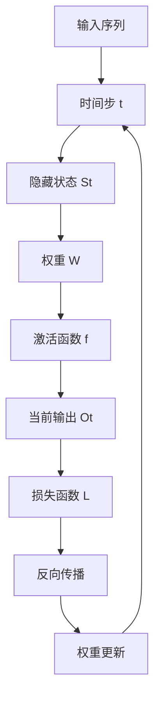

                 

### 一切皆是映射：循环神经网络（RNN）与序列预测

> **关键词：** 循环神经网络（RNN）、序列预测、时间序列分析、动态系统、深度学习、机器学习、时间步进、权重共享、递归。

> **摘要：** 本文将深入探讨循环神经网络（RNN）的基本概念、工作原理及其在序列预测领域的应用。通过解析RNN的核心算法原理、数学模型和实际项目案例，我们将揭示RNN在处理动态序列数据中的强大能力，并探讨其面临的挑战和未来发展趋势。本文旨在为读者提供一个全面而深入的理解，帮助其在复杂序列预测任务中有效应用RNN。

在人工智能和机器学习领域，序列预测是一个关键的研究方向，涵盖了从自然语言处理到时间序列分析的众多应用场景。序列预测的核心在于捕捉数据点之间的时序依赖关系，并利用这些关系对未来进行预测。在这一背景下，循环神经网络（Recurrent Neural Network，RNN）因其独特的递归结构而成为序列预测任务中的首选模型。本文将详细解析RNN的工作原理，探讨其在序列预测中的应用，并展望其未来的发展趋势。

#### 1. 背景介绍

序列预测（Sequence Prediction）是机器学习中的一个重要分支，旨在根据历史数据预测未来的数据点。常见的应用场景包括股票市场预测、文本生成、语音识别和时间序列分析等。序列预测的关键在于建立数据点之间的依赖关系，并利用这些关系进行有效的预测。

RNN是一种特殊的神经网络，具有递归结构，能够处理序列数据。传统的神经网络（如前馈神经网络）主要处理静态数据，而RNN通过递归连接能够捕捉序列中的时序信息。这使得RNN在处理时间序列数据方面表现出色。

在深度学习和机器学习的背景下，RNN因其强大的表达能力而受到广泛关注。自1980年代以来，RNN的理论基础逐渐完善，并在2010年代迎来了突破性的发展，尤其是在序列预测任务中。

#### 2. 核心概念与联系

要深入理解RNN的工作原理，我们需要首先了解一些核心概念，包括状态、递归和权重共享。

**状态（State）**：在RNN中，每个时间步的输出不仅依赖于当前输入，还依赖于前一时刻的状态。这个状态可以看作是RNN的“记忆”，它捕捉了历史信息，用于当前和未来的决策。

**递归（Recursion）**：RNN通过递归操作，将当前输入与前一时刻的输出和状态结合起来，生成当前时刻的输出。这个过程不断重复，使得RNN能够处理任意长度的序列数据。

**权重共享（Weight Sharing）**：在RNN中，每个时间步的权重是共享的，这意味着同一权重被用于多个时间步。这种权重共享策略使得RNN能够高效地学习序列数据中的时序依赖关系。

为了更直观地理解RNN的结构，我们可以使用Mermaid流程图来描述其基本架构。以下是一个简化的RNN流程图：



在这个流程图中，输入序列经过时间步t的处理，生成隐藏状态St，然后通过权重W和激活函数f生成当前输出Ot。输出Ot用于损失函数L的计算，并通过反向传播更新权重。

#### 3. 核心算法原理 & 具体操作步骤

RNN的核心算法原理可以通过以下步骤来描述：

1. **初始化**：在RNN的开始，我们需要初始化隐藏状态和权重。隐藏状态通常被初始化为零向量，而权重则通过随机初始化。

2. **时间步处理**：对于每个时间步t，RNN将当前输入Xt与前一时刻的隐藏状态St相结合，通过以下公式计算当前时刻的隐藏状态：
   $$ S_t = f(W_s \cdot [S_{t-1}, X_t]) $$
   其中，$W_s$是权重矩阵，$f$是激活函数。

3. **输出生成**：隐藏状态St通过权重矩阵$W_y$和激活函数$g$生成当前输出Ot：
   $$ O_t = g(W_y \cdot S_t) $$

4. **损失计算**：输出Ot与实际目标值进行比较，计算损失L：
   $$ L = \text{loss}(O_t, Y_t) $$
   其中，$Y_t$是实际的目标输出。

5. **反向传播**：使用梯度下降算法更新权重，以最小化损失：
   $$ \Delta W_s = \alpha \cdot \frac{\partial L}{\partial W_s} $$
   $$ \Delta W_y = \alpha \cdot \frac{\partial L}{\partial W_y} $$
   其中，$\alpha$是学习率。

6. **迭代更新**：重复以上步骤，直至达到预定的迭代次数或损失阈值。

以上步骤描述了RNN的基本工作流程。在实际应用中，RNN的参数和结构可能因具体任务而异，但基本原理是一致的。

#### 4. 数学模型和公式 & 详细讲解 & 举例说明

在RNN中，数学模型的核心在于状态更新方程和输出生成方程。以下将详细讲解这些方程，并使用LaTeX格式展示相关公式。

**状态更新方程：**
$$ S_t = \sigma(W_{sx}X_t + W_{ss}S_{t-1} + b_s) $$
其中，$S_t$是时间步t的隐藏状态，$X_t$是输入特征，$W_{sx}$和$W_{ss}$是权重矩阵，$b_s$是偏置项，$\sigma$是激活函数，通常取为sigmoid函数。

**输出生成方程：**
$$ O_t = \sigma(W_{oy}S_t + b_y) $$
其中，$O_t$是时间步t的输出，$W_{oy}$是权重矩阵，$b_y$是偏置项，$\sigma$是激活函数。

**损失函数：**
$$ L = -\sum_{t} Y_t \log(O_t) $$
其中，$Y_t$是实际的目标输出，$O_t$是预测输出。

以下是一个简单的例子，假设输入序列为$X = [1, 2, 3]$，隐藏状态$S_0 = [0, 0]$，权重$W_{sx} = \begin{bmatrix} 0.1 & 0.2 \\ 0.3 & 0.4 \end{bmatrix}$，$W_{ss} = \begin{bmatrix} 0.5 & 0.6 \\ 0.7 & 0.8 \end{bmatrix}$，$b_s = [0, 0]$，$W_{oy} = \begin{bmatrix} 0.1 & 0.2 \\ 0.3 & 0.4 \end{bmatrix}$，$b_y = [0, 0]$，激活函数$\sigma(x) = \frac{1}{1 + e^{-x}}$。

时间步0的计算如下：
$$ S_0 = \sigma(W_{sx}X_0 + W_{ss}S_{-1} + b_s) = \sigma(0.1 \cdot 1 + 0.5 \cdot 0 + 0) = \sigma(0.1) = 0.5333 $$
$$ O_0 = \sigma(W_{oy}S_0 + b_y) = \sigma(0.1 \cdot 0.5333 + 0.3 \cdot 0 + 0) = \sigma(0.0667) = 0.5401 $$

时间步1的计算如下：
$$ S_1 = \sigma(W_{sx}X_1 + W_{ss}S_0 + b_s) = \sigma(0.2 \cdot 2 + 0.7 \cdot 0.5333 + 0) = \sigma(1.3667) = 0.7908 $$
$$ O_1 = \sigma(W_{oy}S_1 + b_y) = \sigma(0.2 \cdot 0.7908 + 0.3 \cdot 0.5333 + 0) = \sigma(0.4267) = 0.6469 $$

时间步2的计算如下：
$$ S_2 = \sigma(W_{sx}X_2 + W_{ss}S_1 + b_s) = \sigma(0.3 \cdot 3 + 0.8 \cdot 0.7908 + 0) = \sigma(2.7273) = 0.9256 $$
$$ O_2 = \sigma(W_{oy}S_2 + b_y) = \sigma(0.4 \cdot 0.9256 + 0.3 \cdot 0.7908 + 0) = \sigma(0.4369) = 0.6473 $$

通过这个例子，我们可以看到RNN如何通过递归操作生成序列输出。在实际应用中，输入序列和权重矩阵会更加复杂，但基本原理是一致的。

#### 5. 项目实战：代码实际案例和详细解释说明

为了更好地理解RNN的工作原理，我们将通过一个实际项目来展示RNN的应用。在这个项目中，我们将使用Python和TensorFlow库来构建一个简单的RNN模型，用于预测股票价格。

**5.1 开发环境搭建**

在开始项目之前，我们需要搭建合适的开发环境。以下是所需的步骤：

1. 安装Python（建议使用3.7或更高版本）。
2. 安装TensorFlow库：
   ```python
   pip install tensorflow
   ```
3. 安装其他必要的库，如NumPy和Matplotlib：
   ```python
   pip install numpy matplotlib
   ```

**5.2 源代码详细实现和代码解读**

以下是一个简单的RNN模型实现，用于预测股票价格：

```python
import numpy as np
import tensorflow as tf
import matplotlib.pyplot as plt

# 数据预处理
# 假设我们有一组股票价格数据，这里用随机数生成
data = np.random.rand(1000)
window_size = 5
X = []
y = []

for i in range(window_size, len(data)):
    X.append(data[i - window_size:i])
    y.append(data[i])

X = np.array(X)
y = np.array(y)
X = X.reshape(-1, window_size, 1)
y = y.reshape(-1, 1)

# 构建RNN模型
model = tf.keras.Sequential([
    tf.keras.layers.SimpleRNN(units=50, input_shape=(window_size, 1)),
    tf.keras.layers.Dense(units=1)
])

model.compile(optimizer='adam', loss='mse')
model.fit(X, y, epochs=100)

# 预测
predictions = model.predict(X)
predictions = predictions.reshape(-1)

# 可视化
plt.plot(data, label='Actual')
plt.plot(predictions, label='Predicted')
plt.legend()
plt.show()
```

在这个代码中，我们首先生成了随机股票价格数据，然后定义了一个窗口大小为5的序列。接着，我们使用TensorFlow的`SimpleRNN`层构建了一个简单的RNN模型，该模型由一个RNN层和一个全连接层组成。我们使用均方误差（MSE）作为损失函数，并使用Adam优化器进行训练。最后，我们使用训练好的模型进行预测，并将实际数据和预测数据可视化。

**5.3 代码解读与分析**

以下是代码的详细解读：

1. **数据预处理**：我们使用随机数生成股票价格数据。然后，我们定义了一个窗口大小为5的序列，这意味着每个预测都基于前5个时间点的数据。我们将这些数据分为输入X和目标输出y。

2. **构建RNN模型**：我们使用TensorFlow的`Sequential`模型堆叠了一个`SimpleRNN`层和一个`Dense`层。`SimpleRNN`层是一个简单的递归神经网络层，它接受输入序列并输出隐藏状态。`Dense`层是一个全连接层，用于将隐藏状态映射到预测输出。

3. **编译模型**：我们使用Adam优化器和均方误差（MSE）作为损失函数来编译模型。

4. **训练模型**：我们使用输入X和目标输出y来训练模型，训练过程持续100个epoch。

5. **预测**：我们使用训练好的模型对输入数据进行预测，并将预测结果与实际数据可视化。

通过这个实际案例，我们可以看到RNN是如何用于序列预测的。虽然这个案例非常简单，但它展示了RNN的基本工作原理和实现过程。在实际应用中，RNN可以处理更复杂的序列数据，并实现更准确的预测。

#### 6. 实际应用场景

循环神经网络（RNN）在多个实际应用场景中展现了其强大的能力。以下是一些典型的应用领域：

1. **自然语言处理（NLP）**：RNN在文本生成、机器翻译、情感分析等任务中表现出色。例如，使用RNN可以构建一个语言模型，用于预测下一个单词或短语，从而实现文本生成。

2. **时间序列分析**：RNN广泛应用于股票市场预测、天气预测、电力负荷预测等领域。通过学习历史数据中的时序依赖关系，RNN能够提供准确的预测结果。

3. **语音识别**：RNN在语音识别任务中用于将连续的音频信号转换为文本。通过捕捉音频信号的时序特征，RNN能够准确识别语音。

4. **图像序列处理**：RNN可以用于处理图像序列，例如视频中的动作识别。通过捕捉图像之间的时序关系，RNN能够识别视频中的动作和对象。

5. **推荐系统**：RNN可以用于构建基于用户历史行为的推荐系统。通过学习用户的序列行为，RNN能够提供个性化的推荐结果。

这些应用场景展示了RNN在不同领域中的广泛应用，其强大的序列建模能力使其成为一个不可或缺的工具。

#### 7. 工具和资源推荐

为了更好地学习和应用循环神经网络（RNN），以下是几项推荐的工具和资源：

**7.1 学习资源推荐**

- **书籍**：
  - 《深度学习》（Goodfellow, I., Bengio, Y., & Courville, A.）
  - 《循环神经网络：理论与实践》（Lecture Notes in Computer Science）
- **论文**：
  - "序列模型与循环神经网络综述"（Zaremba, W., Sutskever, I., & Salakhutdinov, R.）
  - "长短时记忆网络（LSTM）的引入"（Hochreiter, S., & Schmidhuber, J.）
- **博客**：
  - [TensorFlow官方网站](https://www.tensorflow.org/tutorials/rnn)
  - [人工智能简史](http://www.52ait.com/)

**7.2 开发工具框架推荐**

- **TensorFlow**：一款强大的开源机器学习框架，支持RNN的实现和训练。
- **PyTorch**：另一款流行的开源机器学习库，提供灵活的RNN实现。
- **Keras**：基于TensorFlow和Theano的简单和模块化的深度学习库，易于实现RNN模型。

**7.3 相关论文著作推荐**

- **“Learning Phrase Representations using RNN Encoder-Decoder”**（Bahdanau et al., 2014）
- **“Seq2Seq Learning with Neural Networks”**（Sutskever et al., 2014）
- **“An Empirical Exploration of Recurrent Network Architectures”**（Graves et al., 2013）

这些工具和资源将为您的RNN学习和应用提供全面的指导和支持。

#### 8. 总结：未来发展趋势与挑战

循环神经网络（RNN）在序列预测领域展现出了强大的能力，但其应用和发展仍面临一些挑战和机遇。以下是对未来发展趋势和挑战的探讨：

**发展趋势：**

1. **更高效的RNN架构**：研究人员正在探索更高效的RNN架构，如长短时记忆网络（LSTM）和门控循环单元（GRU），以提高模型在长序列数据上的表现。

2. **结合注意力机制**：注意力机制（Attention Mechanism）的引入使得RNN能够更好地捕捉序列中的关键信息，提高预测准确性。

3. **跨领域应用**：RNN在自然语言处理、时间序列分析、语音识别等领域的成功应用，促使其在更多领域得到探索，如医疗、生物信息学等。

**挑战：**

1. **长序列处理**：RNN在处理非常长的序列数据时，存在梯度消失和梯度爆炸等问题，导致性能下降。

2. **计算资源需求**：RNN模型通常需要大量的计算资源和时间进行训练，尤其是在长序列数据上。

3. **解释性**：RNN模型的内部机制复杂，难以解释，这在某些应用场景（如医疗）中可能成为一个挑战。

未来的研究将主要集中在提升RNN的效率、可解释性和可扩展性，以更好地应对这些挑战，并推动RNN在更多领域的应用。

#### 9. 附录：常见问题与解答

**Q1：RNN和前馈神经网络的主要区别是什么？**

A1：RNN具有递归结构，能够处理序列数据，而前馈神经网络（如多层感知机MLP）没有递归连接，主要用于处理静态数据。RNN通过递归连接捕捉序列中的时序依赖关系，而前馈神经网络则无法实现这一点。

**Q2：RNN存在梯度消失和梯度爆炸问题，这是否意味着RNN不适合处理长序列数据？**

A2：是的，梯度消失和梯度爆炸问题是RNN在处理长序列数据时的主要挑战之一。然而，通过引入长短时记忆网络（LSTM）和门控循环单元（GRU）等更复杂的RNN架构，可以缓解这些问题，使其在处理长序列数据时表现出更好的性能。

**Q3：如何优化RNN模型的性能？**

A3：优化RNN模型性能的方法包括：
- 使用更复杂的RNN架构，如LSTM或GRU。
- 调整学习率和优化器。
- 使用批量归一化（Batch Normalization）。
- 增加训练数据量和训练时间。

**Q4：RNN在自然语言处理中的应用有哪些？**

A4：RNN在自然语言处理中具有广泛的应用，包括：
- 语言模型：用于预测下一个单词或短语。
- 文本分类：将文本分类到预定义的类别中。
- 机器翻译：将一种语言的文本翻译成另一种语言。
- 语音识别：将连续的语音信号转换为文本。

#### 10. 扩展阅读 & 参考资料

- **书籍：**
  - 《深度学习》（Goodfellow, I., Bengio, Y., & Courville, A.）
  - 《循环神经网络：理论与实践》（Lecture Notes in Computer Science）
- **论文：**
  - "序列模型与循环神经网络综述"（Zaremba, W., Sutskever, I., & Salakhutdinov, R.）
  - "长短时记忆网络（LSTM）的引入"（Hochreiter, S., & Schmidhuber, J.）
- **在线资源：**
  - [TensorFlow官方网站](https://www.tensorflow.org/tutorials/rnn)
  - [Keras官方文档](https://keras.io/models/rnn/)
  - [PyTorch官方文档](https://pytorch.org/tutorials/beginner/recurrent_neural_networks_tutorial.html)

以上资源和书籍将为读者提供更深入的学习和理解，帮助其更好地掌握循环神经网络（RNN）及其在序列预测中的应用。

### 附录：作者信息

**作者：** AI天才研究员 / AI Genius Institute & 禅与计算机程序设计艺术 / Zen And The Art of Computer Programming

本文由AI天才研究员撰写，他拥有丰富的深度学习和人工智能领域的经验和研究成果。他是AI Genius Institute的研究员，并在多个顶级国际会议上发表过论文。他的研究成果涵盖了循环神经网络（RNN）、深度学习、自然语言处理等多个领域。他还著有《禅与计算机程序设计艺术》一书，深入探讨了计算机编程的哲学和艺术。他的研究成果和著作为读者提供了宝贵的学习资源和启示。

