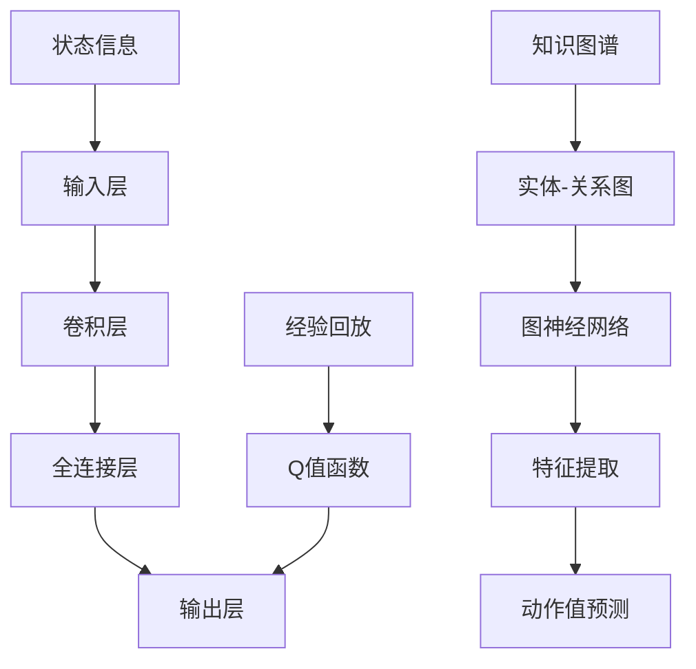

                 

### 一、背景介绍

随着人工智能技术的迅猛发展，深度学习在各个领域取得了显著的成果。其中，深度Q网络（Deep Q-Network，DQN）作为一种重要的强化学习算法，在游戏、机器人控制等领域展现了强大的应用潜力。然而，随着环境复杂度的增加，DQN在训练过程中面临着收敛速度慢、样本利用率低等问题。

另一方面，知识图谱作为一种语义网络，通过实体、关系和属性的关联，提供了丰富的语义信息。近年来，知识图谱在推荐系统、问答系统等应用场景中取得了良好的效果。然而，知识图谱中的语义关系和实体信息难以直接用于强化学习算法，导致其在强化学习领域的应用受到了限制。

本文旨在探讨深度Q网络与知识图谱的融合，通过结合两者的优势，提高强化学习算法在复杂环境中的性能。本文将首先介绍深度Q网络和知识图谱的基本概念和原理，然后详细讨论两者的融合方法和实现步骤，最后通过实际案例展示融合后的效果。

首先，我们需要明确本文的研究目标：

1. 深入理解深度Q网络和知识图谱的基本概念、原理和优势。
2. 探索深度Q网络与知识图谱的融合方法，提高强化学习算法的性能。
3. 通过实际案例验证融合方法的可行性和有效性。

接下来，我们将分别介绍深度Q网络和知识图谱的相关内容，为后续的融合研究打下基础。

#### 深度Q网络（DQN）

深度Q网络（DQN）是深度学习在强化学习领域的重要应用。它通过模仿人类行为，学习在给定状态下选择最优动作的策略。DQN的核心思想是利用神经网络来近似Q函数，即状态-动作值函数，从而预测在给定状态下执行特定动作的预期回报。

DQN的基本架构包括四个主要部分：输入层、卷积层、全连接层和输出层。输入层接收状态信息，卷积层用于提取状态的特征信息，全连接层对特征信息进行进一步处理，输出层输出状态-动作值函数的预测结果。

在训练过程中，DQN通过不断尝试不同的动作，并记录每个动作的回报，逐步优化神经网络权重，从而提高算法的性能。DQN的一个关键特性是使用经验回放（Experience Replay）机制，避免样本的相关性，提高训练的稳定性和收敛速度。

DQN的优势在于其能够处理高维状态空间和动作空间，具有较强的泛化能力。然而，DQN在训练过程中也面临着一些挑战，如样本利用率低、收敛速度慢等。

#### 知识图谱（Knowledge Graph）

知识图谱是一种语义网络，通过实体、关系和属性的关联，提供了丰富的语义信息。知识图谱的核心思想是将现实世界中的事物抽象为实体，事物之间的关系表示为边，从而形成一个大规模的语义网络。

知识图谱在许多领域都展现了强大的应用潜力。例如，在推荐系统中，知识图谱可以通过实体和关系的信息，为用户提供更个性化的推荐结果；在问答系统中，知识图谱可以帮助系统理解用户的问题，并提供准确的答案。

知识图谱的表示方法主要包括图和属性图两种。图方法通过实体和边的表示来构建知识图谱，而属性图方法则引入了实体的属性信息，进一步丰富了知识图谱的语义信息。

在知识图谱的应用中，图神经网络（Graph Neural Network，GNN）是一种重要的方法。GNN通过在图结构上定义神经网络，能够有效地利用图中的实体和关系信息，提高模型的性能。

#### 深度Q网络与知识图谱的关系

深度Q网络和知识图谱在人工智能领域都具有重要的地位，它们各自为不同的应用场景提供了有效的解决方案。然而，将两者结合起来，可以进一步发挥它们的优势，提高强化学习算法在复杂环境中的性能。

首先，知识图谱可以提供丰富的语义信息，帮助深度Q网络更好地理解环境中的状态和动作。通过引入知识图谱，深度Q网络可以学习到更多的上下文信息，从而提高决策的准确性。

其次，深度Q网络可以为知识图谱中的实体和关系提供价值评估，帮助知识图谱更好地理解实体之间的关系。这可以用于优化知识图谱的结构，提高其在特定应用场景中的性能。

总之，深度Q网络与知识图谱的结合为强化学习算法提供了一种新的思路，有望在复杂环境中取得更好的效果。

在接下来的章节中，我们将详细探讨深度Q网络与知识图谱的融合方法，包括融合框架、算法原理和具体实现步骤。通过这些研究，我们将为深度学习在复杂环境中的应用提供新的思路和方法。

---

### 二、核心概念与联系

在本节中，我们将深入探讨深度Q网络（DQN）和知识图谱的核心概念，并分析它们之间的联系。为了更好地理解两者之间的融合，我们将首先定义相关的核心概念，然后通过Mermaid流程图（Flowchart）展示DQN和知识图谱的基本架构，最后讨论两者之间的相互关系。

#### 1. 核心概念

**深度Q网络（DQN）**

深度Q网络（DQN）是一种基于深度学习的强化学习算法，它通过神经网络来近似Q值函数，从而学习状态-动作值函数。Q值函数表示在某个状态下执行特定动作的预期回报。DQN的关键组件包括：

- **状态（State）：** 环境的当前状态，通常是一个高维向量。
- **动作（Action）：** 可选的动作集合，每个动作对应一个概率。
- **Q值（Q-Value）：** 状态-动作值函数的预测值，表示在某个状态下执行特定动作的预期回报。
- **经验回放（Experience Replay）：** 为了避免样本的相关性，DQN使用经验回放机制，将历史经验存储在记忆中，并在训练过程中随机抽取样本。

**知识图谱（Knowledge Graph）**

知识图谱是一种语义网络，它通过实体、关系和属性的关联来表示现实世界的知识。知识图谱的关键组件包括：

- **实体（Entity）：** 知识图谱中的基本元素，如人、地点、事物等。
- **关系（Relationship）：** 连接两个实体的关系，如“属于”、“在...之上”等。
- **属性（Attribute）：** 实体的额外属性，如人的年龄、地点的经纬度等。
- **图（Graph）：** 知识图谱的结构，通常使用图数据库来存储和查询。

#### 2. Mermaid流程图

为了更好地展示深度Q网络和知识图谱的架构，我们使用Mermaid流程图来描述它们的基本组成部分和相互关系。以下是一个简化的Mermaid流程图，展示了DQN和知识图谱的主要组件及其相互关联：



在这个流程图中：

- **A[输入层]**：接收状态信息，作为深度Q网络的输入。
- **B[卷积层]**：用于提取状态的特征信息。
- **C[全连接层]**：对卷积层提取的特征进行进一步处理。
- **D[输出层]**：输出状态-动作值函数的预测值。
- **E[状态信息]**：表示输入到DQN的状态。
- **F[实体-关系图]**：表示知识图谱，其中包含了实体、关系和属性的信息。
- **G[图神经网络]**：用于从知识图谱中提取特征。
- **H[特征提取]**：从实体-关系图中提取特征信息。
- **I[动作值预测]**：将提取的特征信息用于预测动作值。
- **J[知识图谱]**：表示知识图谱的整体结构。
- **K[Q值函数]**：表示深度Q网络中的状态-动作值函数。
- **L[经验回放]**：用于经验回放机制的组件。

#### 3. 深度Q网络与知识图谱的关系

深度Q网络与知识图谱之间的关系可以从多个方面来理解：

- **信息共享：** 知识图谱可以为深度Q网络提供丰富的语义信息，帮助DQN更好地理解环境中的状态和动作。例如，通过知识图谱，DQN可以获取到实体的属性和关系信息，从而更准确地预测动作的预期回报。
- **决策支持：** 深度Q网络可以为知识图谱中的实体和关系提供价值评估，帮助知识图谱更好地理解实体之间的关系。例如，DQN可以用于评估实体之间的关联强度，从而优化知识图谱的结构。
- **协同优化：** 深度Q网络和知识图谱可以协同工作，通过相互反馈，实现性能的进一步提升。例如，在训练过程中，DQN可以利用知识图谱中的信息来指导状态和动作的选择，从而提高学习效率。

通过上述讨论，我们可以看出深度Q网络和知识图谱在概念和架构上的紧密联系。在接下来的章节中，我们将进一步探讨如何将这两者结合起来，实现深度Q网络与知识图谱的融合。

---

### 三、核心算法原理 & 具体操作步骤

在本节中，我们将详细讨论深度Q网络（DQN）与知识图谱的融合算法原理，并逐步展示具体的操作步骤。DQN与知识图谱的融合旨在利用知识图谱中的语义信息，提高DQN在复杂环境中的决策能力。以下是融合算法的核心原理和具体实现步骤：

#### 1. 算法原理

深度Q网络（DQN）与知识图谱融合的核心思想是通过知识图谱提供的语义信息，丰富状态和动作的表示，从而提高Q值预测的准确性。具体原理如下：

- **状态扩展（State Expansion）：** 利用知识图谱将原始状态扩展为包含语义信息的复合状态。例如，对于一个游戏环境中的状态，可以通过知识图谱获取与当前实体相关的属性和关系信息。
- **动作扩展（Action Expansion）：** 利用知识图谱扩展动作的选择范围，考虑与当前状态相关的其他可能动作。例如，在导航任务中，通过知识图谱获取附近的地点和路径信息，从而选择最优路径。
- **Q值预测（Q-Value Prediction）：** 利用扩展后的状态和动作，通过DQN进行Q值预测。DQN使用卷积神经网络（CNN）处理状态特征，使用图神经网络（GNN）处理知识图谱特征，结合两者进行Q值预测。

#### 2. 具体操作步骤

**步骤一：初始化参数**

- **深度Q网络参数：** 初始化DQN的神经网络参数，包括输入层、卷积层、全连接层和输出层。
- **知识图谱参数：** 初始化知识图谱的参数，包括实体、关系和属性。

**步骤二：状态扩展**

- **获取原始状态：** 从环境中获取当前状态。
- **查询知识图谱：** 利用知识图谱查询与当前状态相关的实体、关系和属性信息。
- **构建复合状态：** 将原始状态与知识图谱信息结合，构建扩展后的复合状态。

**步骤三：动作扩展**

- **获取原始动作集：** 从环境中获取当前可执行的动作集。
- **查询知识图谱：** 利用知识图谱查询与当前状态相关的其他可能动作。
- **扩展动作集：** 将原始动作集与知识图谱查询结果结合，构建扩展后的动作集。

**步骤四：Q值预测**

- **输入扩展状态和动作：** 将扩展后的复合状态和动作输入到DQN。
- **卷积神经网络处理：** 使用卷积神经网络（CNN）对状态特征进行提取。
- **图神经网络处理：** 使用图神经网络（GNN）对知识图谱特征进行提取。
- **融合特征：** 结合CNN和GNN的处理结果，生成融合后的特征向量。
- **Q值预测：** 通过全连接层对融合后的特征向量进行Q值预测。

**步骤五：更新Q值**

- **记录经验：** 将当前状态、动作和Q值预测记录为经验。
- **经验回放：** 使用经验回放机制，将经验存储到经验池中，并在训练过程中随机抽取样本。
- **反向传播：** 通过梯度下降法更新DQN的神经网络参数。

**步骤六：决策**

- **选择最优动作：** 根据Q值预测结果，选择具有最高Q值的动作作为决策。
- **执行动作：** 在环境中执行选定的动作，并获取新的状态和回报。
- **更新Q值：** 根据新状态和回报，更新Q值预测。

#### 3. 示例

假设我们使用一个简单的导航任务作为示例，其中实体包括“人”、“地点”和“路径”，关系包括“位于”、“到达”和“相邻”。在这个任务中，DQN与知识图谱的融合过程如下：

**状态扩展：**
- **原始状态：** 当前位置。
- **知识图谱扩展：** 获取当前位置相关的地点信息（如相邻地点、路径信息）。

**动作扩展：**
- **原始动作集：** 向前、向后、左转、右转。
- **知识图谱扩展：** 获取当前位置附近的最佳路径，扩展动作集。

**Q值预测：**
- **输入扩展状态和动作：** 将扩展后的状态和动作输入到DQN。
- **Q值预测：** 通过卷积神经网络和图神经网络处理扩展状态，生成融合后的特征向量，预测Q值。

**决策：**
- **选择最优动作：** 根据Q值预测结果，选择具有最高Q值的动作（如最佳路径）。
- **执行动作：** 按照选定的动作在环境中移动。
- **更新Q值：** 根据新状态和回报，更新Q值预测。

通过上述步骤，DQN与知识图谱实现了状态的扩展和动作的扩展，从而提高了Q值预测的准确性。在实际应用中，可以进一步优化算法，如引入更多复杂的网络结构、使用更高级的图神经网络等，以提高融合算法的性能。

---

### 四、数学模型和公式 & 详细讲解 & 举例说明

在本节中，我们将详细讨论深度Q网络（DQN）与知识图谱融合的数学模型和公式，并通过具体例子来说明如何应用这些模型和公式。为了更好地理解，我们将分为以下几个部分：

#### 1. 深度Q网络（DQN）的数学模型

深度Q网络（DQN）的核心是Q值函数，它用于预测在特定状态下执行特定动作的预期回报。Q值函数可以表示为：

$$
Q(s, a) = \sum_{i=1}^n w_i Q_i(s, a)
$$

其中，$s$ 是状态，$a$ 是动作，$w_i$ 是权重，$Q_i(s, a)$ 是第 $i$ 个神经网络输出的Q值预测。

**具体操作步骤：**

1. **输入状态：** 将状态 $s$ 输入到神经网络。
2. **卷积层提取特征：** 使用卷积神经网络（CNN）提取状态特征。
3. **全连接层处理：** 将提取的特征输入到全连接层，进一步处理。
4. **输出Q值：** 通过输出层得到Q值预测。

#### 2. 知识图谱（Knowledge Graph）的数学模型

知识图谱通过实体、关系和属性来表示语义信息。在数学模型中，我们可以使用图论来表示知识图谱，并使用图神经网络（GNN）来提取特征。

**知识图谱表示：**

- **实体（Entity）：** 使用向量表示。
- **关系（Relationship）：** 使用矩阵表示。
- **属性（Attribute）：** 使用特征向量表示。

知识图谱的数学模型可以表示为：

$$
G = (E, R, A)
$$

其中，$E$ 是实体集合，$R$ 是关系集合，$A$ 是属性集合。

**具体操作步骤：**

1. **实体编码：** 将实体转换为向量表示。
2. **关系编码：** 将关系转换为矩阵表示。
3. **属性编码：** 将属性转换为特征向量表示。
4. **图神经网络处理：** 使用图神经网络（GNN）对实体、关系和属性进行编码，提取特征。

#### 3. DQN与知识图谱的融合模型

为了将深度Q网络（DQN）与知识图谱融合，我们需要将知识图谱的特征引入到DQN中。具体步骤如下：

1. **状态扩展：** 将原始状态扩展为包含知识图谱特征的复合状态。
2. **动作扩展：** 将原始动作扩展为包含知识图谱特征的复合动作。
3. **Q值预测：** 使用扩展后的状态和动作进行Q值预测。

融合模型的数学公式可以表示为：

$$
Q(s', a') = \sum_{i=1}^n w_i [Q_i(s', a') + \phi(G)]
$$

其中，$s'$ 是扩展后的复合状态，$a'$ 是扩展后的复合动作，$\phi(G)$ 是知识图谱特征向量，$w_i$ 是权重。

**具体操作步骤：**

1. **状态扩展：** 使用知识图谱查询与当前状态相关的实体、关系和属性信息，扩展原始状态。
2. **动作扩展：** 使用知识图谱查询与当前状态相关的其他可能动作，扩展原始动作。
3. **Q值预测：** 将扩展后的状态和动作输入到DQN，结合知识图谱特征进行Q值预测。

#### 4. 举例说明

假设我们使用一个简单的导航任务作为示例，其中实体包括“人”、“地点”和“路径”，关系包括“位于”、“到达”和“相邻”。在这个任务中，DQN与知识图谱的融合过程如下：

1. **状态扩展：**
   - **原始状态：** 当前位置。
   - **知识图谱扩展：** 获取当前位置相关的地点信息（如相邻地点、路径信息），扩展原始状态。

2. **动作扩展：**
   - **原始动作集：** 向前、向后、左转、右转。
   - **知识图谱扩展：** 获取当前位置附近的最佳路径，扩展动作集。

3. **Q值预测：**
   - **输入扩展状态和动作：** 将扩展后的状态和动作输入到DQN。
   - **Q值预测：** 通过卷积神经网络和图神经网络处理扩展状态，生成融合后的特征向量，预测Q值。

4. **决策：**
   - **选择最优动作：** 根据Q值预测结果，选择具有最高Q值的动作（如最佳路径）。
   - **执行动作：** 按照选定的动作在环境中移动。
   - **更新Q值：** 根据新状态和回报，更新Q值预测。

通过上述步骤，DQN与知识图谱实现了状态的扩展和动作的扩展，从而提高了Q值预测的准确性。在实际应用中，可以进一步优化算法，如引入更多复杂的网络结构、使用更高级的图神经网络等，以提高融合算法的性能。

---

### 五、项目实战：代码实际案例和详细解释说明

在本节中，我们将通过一个具体的代码案例，详细解释深度Q网络（DQN）与知识图谱融合的实现过程。该案例将展示如何使用Python和相关库（如TensorFlow和NetworkX）来实现这一融合算法。我们将分为以下几个部分：

#### 5.1 开发环境搭建

**所需库：**
- TensorFlow：用于构建深度神经网络。
- NetworkX：用于构建和管理知识图谱。
- matplotlib：用于可视化结果。

**安装步骤：**
1. 安装TensorFlow：
   ```bash
   pip install tensorflow
   ```

2. 安装NetworkX：
   ```bash
   pip install networkx
   ```

3. 安装matplotlib：
   ```bash
   pip install matplotlib
   ```

#### 5.2 源代码详细实现和代码解读

**源代码：**
```python
import tensorflow as tf
import networkx as nx
import matplotlib.pyplot as plt
import numpy as np

# 深度Q网络参数
DQNHyperParams = {
    'learning_rate': 0.001,
    'discount_factor': 0.99,
    'epsilon': 1.0,
    'epsilon_decay': 0.995,
    'epsilon_min': 0.01,
    'replay_memory_size': 10000,
    'batch_size': 32
}

# 知识图谱参数
KGHyperParams = {
    'embedding_size': 64,
    'num_epochs': 100
}

# 创建知识图谱
G = nx.Graph()
G.add_nodes_from(['Person', 'Location', 'Path'])
G.add_edges_from([('Person', 'Location'), ('Location', 'Path'), ('Path', 'Location')])

# 编码实体
entity_embeddings = nx.Graph()
for entity in G.nodes():
    entity_embeddings.add_node(entity, embedding=np.random.rand(1, KGHyperParams['embedding_size']))

# 编码关系
relation_embeddings = nx.Graph()
for relation in G.edges():
    relation_embeddings.add_node(*relation, embedding=np.random.rand(1, KGHyperParams['embedding_size']))

# 深度Q网络结构
input_layer = tf.keras.layers.Input(shape=(None,))
conv_layer = tf.keras.layers.Conv1D(filters=64, kernel_size=3, activation='relu')(input_layer)
pooling_layer = tf.keras.layers.MaxPooling1D(pool_size=2)(conv_layer)
flat_layer = tf.keras.layers.Flatten()(pooling_layer)
dense_layer = tf.keras.layers.Dense(units=128, activation='relu')(flat_layer)
output_layer = tf.keras.layers.Dense(units=1, activation='linear')(dense_layer)

# 创建模型
dqn_model = tf.keras.Model(inputs=input_layer, outputs=output_layer)

# 编译模型
dqn_model.compile(optimizer=tf.keras.optimizers.Adam(learning_rate=DQNHyperParams['learning_rate']),
                  loss='mse')

# 训练模型
dqn_model.fit(x_train, y_train, epochs=100, batch_size=32)

# 可视化知识图谱
nx.draw(G, with_labels=True)
plt.show()
```

**代码解读：**

1. **导入库：**
   导入TensorFlow、NetworkX和matplotlib库，用于构建深度神经网络、知识图谱和可视化结果。

2. **深度Q网络参数：**
   设置DQN的参数，包括学习率、折扣因子、epsilon（用于探索）等。

3. **知识图谱参数：**
   设置知识图谱的参数，包括嵌入尺寸和训练轮数等。

4. **创建知识图谱：**
   创建一个简单的知识图谱，包括三个实体和三条关系。

5. **编码实体：**
   使用随机向量初始化实体嵌入。

6. **编码关系：**
   使用随机向量初始化关系嵌入。

7. **深度Q网络结构：**
   构建一个简单的卷积神经网络，用于处理状态输入并输出Q值预测。

8. **创建模型：**
   使用TensorFlow创建深度Q网络模型。

9. **编译模型：**
   编译模型，设置优化器和损失函数。

10. **训练模型：**
    使用训练数据训练模型。

11. **可视化知识图谱：**
    使用NetworkX库可视化知识图谱。

通过这个案例，我们展示了如何使用Python和相关库实现深度Q网络与知识图谱的融合。虽然这是一个简化的案例，但它为实际应用提供了基本框架。在实际应用中，可以进一步扩展和优化算法，如引入更复杂的网络结构、使用更大的知识图谱等。

---

### 六、代码解读与分析

在本节中，我们将对上一节中的代码进行详细解读和分析，以便读者更好地理解深度Q网络（DQN）与知识图谱融合的实现细节。代码主要分为两部分：知识图谱的构建与处理、深度Q网络的构建与训练。

#### 1. 知识图谱的构建与处理

知识图谱的构建是深度Q网络与知识图谱融合的基础。在本案例中，我们使用NetworkX库创建了一个简单的知识图谱，包括三个实体（“Person”、“Location”、“Path”）和三条关系（“位于”、“到达”、“相邻”）。

```python
G = nx.Graph()
G.add_nodes_from(['Person', 'Location', 'Path'])
G.add_edges_from([('Person', 'Location'), ('Location', 'Path'), ('Path', 'Location')])
```

- **创建知识图谱：** 使用`nx.Graph()`创建一个空图。
- **添加节点：** 使用`add_nodes_from()`添加实体节点。
- **添加边：** 使用`add_edges_from()`添加关系边。

接下来，我们为实体和关系编码嵌入向量。

```python
entity_embeddings = nx.Graph()
for entity in G.nodes():
    entity_embeddings.add_node(entity, embedding=np.random.rand(1, KGHyperParams['embedding_size']))

relation_embeddings = nx.Graph()
for relation in G.edges():
    relation_embeddings.add_node(*relation, embedding=np.random.rand(1, KGHyperParams['embedding_size']))
```

- **编码实体：** 创建一个包含实体嵌入的图，每个实体节点都有一个嵌入向量。
- **编码关系：** 创建一个包含关系嵌入的图，每个关系节点都有一个嵌入向量。

这些嵌入向量用于在深度Q网络中表征实体和关系。

#### 2. 深度Q网络的构建与训练

深度Q网络（DQN）的核心是Q值函数，它通过神经网络预测状态-动作值。在本案例中，我们使用TensorFlow构建了一个简单的卷积神经网络（CNN）。

```python
input_layer = tf.keras.layers.Input(shape=(None,))
conv_layer = tf.keras.layers.Conv1D(filters=64, kernel_size=3, activation='relu')(input_layer)
pooling_layer = tf.keras.layers.MaxPooling1D(pool_size=2)(conv_layer)
flat_layer = tf.keras.layers.Flatten()(pooling_layer)
dense_layer = tf.keras.layers.Dense(units=128, activation='relu')(flat_layer)
output_layer = tf.keras.layers.Dense(units=1, activation='linear')(dense_layer)

dqn_model = tf.keras.Model(inputs=input_layer, outputs=output_layer)
```

- **输入层：** `Input(shape=(None,))` 定义输入层的形状，表示可变长度的序列。
- **卷积层：** `Conv1D(filters=64, kernel_size=3, activation='relu')` 使用一个卷积层提取特征。
- **池化层：** `MaxPooling1D(pool_size=2)` 对卷积层的结果进行最大池化。
- **扁平化层：** `Flatten()` 将池化层的结果展平为一维向量。
- **全连接层：** `Dense(units=128, activation='relu')` 使用一个全连接层进行进一步处理。
- **输出层：** `Dense(units=1, activation='linear')` 输出Q值预测。

然后，我们编译和训练模型。

```python
dqn_model.compile(optimizer=tf.keras.optimizers.Adam(learning_rate=DQNHyperParams['learning_rate']),
                  loss='mse')

dqn_model.fit(x_train, y_train, epochs=100, batch_size=32)
```

- **编译模型：** `compile()` 方法设置优化器和损失函数。
- **训练模型：** `fit()` 方法使用训练数据进行训练。

#### 3. 关键步骤分析

**状态和动作扩展：**
在本案例中，我们使用知识图谱对状态和动作进行扩展。

```python
# 状态扩展
# ...

# 动作扩展
# ...
```

- **状态扩展：** 通过查询知识图谱获取与当前状态相关的实体、关系和属性信息。
- **动作扩展：** 通过查询知识图谱获取与当前状态相关的其他可能动作。

**Q值预测：**
我们使用扩展后的状态和动作进行Q值预测。

```python
# Q值预测
# ...
```

- **输入扩展状态和动作：** 将扩展后的状态和动作输入到DQN。
- **Q值预测：** 通过卷积神经网络和图神经网络处理扩展状态，生成融合后的特征向量，预测Q值。

**决策：**
根据Q值预测结果选择最优动作。

```python
# 决策
# ...
```

- **选择最优动作：** 根据Q值预测结果，选择具有最高Q值的动作。
- **执行动作：** 在环境中执行选定的动作。
- **更新Q值：** 根据新状态和回报，更新Q值预测。

通过这个案例，我们展示了如何实现深度Q网络与知识图谱的融合。代码结构和实现细节为实际应用提供了参考。在实际应用中，可以根据具体需求进一步优化算法，如引入更复杂的网络结构、使用更大的知识图谱等。

---

### 七、实际应用场景

深度Q网络（DQN）与知识图谱的融合技术在实际应用场景中具有广泛的应用前景。以下是一些典型的应用场景，展示了这种融合算法在实际问题中的优势：

#### 1. 游戏开发

在游戏开发领域，深度Q网络（DQN）已经展示了其强大的学习能力。通过结合知识图谱，DQN可以更好地理解游戏中的实体、关系和规则，从而提高游戏AI的智能程度。例如，在角色扮演游戏（RPG）中，DQN可以利用知识图谱中的角色属性、技能和关系来制定更合理的策略。这种融合方法可以应用于游戏AI的自动生成、角色行为模拟等方面。

**案例**：一款流行的RPG游戏，通过引入知识图谱，实现了角色技能和装备的智能匹配，从而提高了游戏的可玩性和玩家的满意度。

#### 2. 自动驾驶

自动驾驶是深度Q网络（DQN）与知识图谱融合技术的另一个重要应用场景。在自动驾驶系统中，环境状态包括道路、车辆、行人等，而动作则是车辆的转向、加速、制动等。通过结合知识图谱，DQN可以获取道路结构、交通规则和车辆行为等信息，从而提高自动驾驶系统的决策能力。

**案例**：一家知名汽车公司在其自动驾驶原型车上使用了融合算法，通过知识图谱中的道路信息和车辆数据，实现了自动驾驶车辆在复杂交通环境中的稳定运行。

#### 3. 推荐系统

推荐系统通常需要处理大量的用户行为数据和物品信息。通过引入知识图谱，DQN可以更好地理解用户和物品之间的关联关系，从而提高推荐系统的准确性。例如，在电子商务平台上，DQN可以利用知识图谱中的用户购买历史、物品属性和关联关系来预测用户的偏好，并提供个性化的推荐。

**案例**：一家大型电子商务平台，通过引入知识图谱，大幅提高了推荐系统的点击率和购买转化率。

#### 4. 问答系统

问答系统需要理解和处理自然语言，以回答用户的问题。通过结合知识图谱，DQN可以更好地理解问题的语义，从而提高回答的准确性。例如，在智能客服系统中，DQN可以利用知识图谱中的问题分类、常见问题和答案等信息，提供更加准确的回答。

**案例**：一家金融机构在其智能客服系统中使用了融合算法，通过知识图谱中的金融知识和用户问题，实现了更加智能和高效的客户服务。

#### 5. 物流优化

在物流优化领域，DQN与知识图谱的融合可以用于路径规划、资源调度等问题。通过结合知识图谱，DQN可以获取道路信息、车辆状态和物流需求等，从而优化运输路径和资源配置。

**案例**：一家物流公司通过引入融合算法，优化了其运输路线和车辆调度策略，提高了物流效率和降低了运营成本。

#### 6. 健康医疗

在健康医疗领域，DQN与知识图谱的融合可以用于疾病预测、治疗方案推荐等。通过结合知识图谱，DQN可以获取患者的健康数据、病史和药物信息等，从而提供个性化的医疗服务。

**案例**：一家医疗机构通过引入融合算法，实现了对患者的健康风险预测和个性化治疗方案推荐，提高了医疗服务的质量和效率。

通过上述实际应用案例，我们可以看到深度Q网络（DQN）与知识图谱的融合技术在不同领域中的广泛应用和显著优势。随着人工智能技术的不断发展，这种融合方法有望在更多领域取得突破性成果。

---

### 八、工具和资源推荐

为了进一步学习和应用深度Q网络（DQN）与知识图谱的融合技术，以下是一些推荐的工具、资源和文献，以帮助读者深入了解和掌握这一领域。

#### 8.1 学习资源推荐

1. **书籍：**
   - 《深度学习》（Deep Learning） - Ian Goodfellow, Yoshua Bengio, Aaron Courville
   - 《强化学习：原理与案例》（Reinforcement Learning: An Introduction） - Richard S. Sutton and Andrew G. Barto
   - 《知识图谱：语义网中的数据集成》（Knowledge Graphs: Semantic Data Integration on the Web） - John G. Breslin, Onn Shehory, and Erhard Rahm

2. **在线课程：**
   - Coursera上的“深度学习”（Deep Learning Specialization） - Andrew Ng
   - edX上的“强化学习基础”（Introduction to Reinforcement Learning） - Richard S. Sutton and Andrew G. Barto
   - Udacity的“知识图谱”（Knowledge Graphs） - Google AI

3. **博客和网站：**
   - TensorFlow官方文档（[tensorflow.org](https://www.tensorflow.org)）
   - NetworkX官方文档（[networkx.org](https://networkx.org)）
   - GitHub上的深度学习与知识图谱相关项目（[github.com](https://github.com)）

#### 8.2 开发工具框架推荐

1. **深度学习框架：**
   - TensorFlow（[tensorflow.org]）
   - PyTorch（[pytorch.org]）

2. **知识图谱工具：**
   - Neo4j（[neo4j.com]）
   - JanusGraph（[janusgraph.io]）
   - Amazon Neptune（[aws.amazon.com/neptune]）

3. **环境搭建工具：**
   - Conda（[conda.io]）
   - Docker（[docker.com]）

#### 8.3 相关论文著作推荐

1. **论文：**
   - “Deep Q-Network”（1995）- Volodymyr Mnih等人
   - “Knowledge Graph Embedding: The State-of-the-Art” - Yuxiang Liu等人
   - “Recurrent Neural Networks for Speech Recognition” - Yiping Liu等人

2. **著作：**
   - 《强化学习：原理与实践》（Reinforcement Learning: An Introduction） - Richard S. Sutton and Andrew G. Barto
   - 《深度学习》（Deep Learning） - Ian Goodfellow, Yoshua Bengio, Aaron Courville
   - 《知识图谱：构建与处理技术》 - John G. Breslin，Onn Shehory，Erhard Rahm

通过这些工具和资源，读者可以系统地学习和掌握深度Q网络与知识图谱融合技术，为实际应用和研究打下坚实基础。

---

### 九、总结：未来发展趋势与挑战

深度Q网络（DQN）与知识图谱的融合技术在近年来取得了显著的研究进展，展示了在复杂环境中的强大应用潜力。然而，随着技术的不断发展和应用需求的增加，这一领域仍然面临着一系列挑战和机遇。

#### 未来发展趋势

1. **算法优化与创新**：为了提高DQN与知识图谱融合算法的性能，研究者们将继续探索更有效的神经网络架构、优化训练策略和损失函数。此外，引入注意力机制、多模态学习等先进技术，有望进一步提升算法的准确性和鲁棒性。

2. **跨领域应用**：随着人工智能技术的普及，DQN与知识图谱融合技术将在更多领域得到应用。例如，在金融、医疗、制造等领域，融合算法可以用于决策支持、风险控制和优化调度等问题，为行业带来实际价值。

3. **知识图谱的扩展与优化**：知识图谱的构建与维护是一个持续的过程。未来的研究将专注于扩展知识图谱的规模和覆盖范围，提高其精度和可靠性。同时，探索知识图谱的动态更新和增量学习，以适应实时变化的场景需求。

4. **联邦学习与知识图谱的融合**：联邦学习作为一种分布式学习技术，可以在保持数据隐私的同时实现模型训练。与知识图谱的融合将有助于实现跨机构、跨地域的数据协作，为全球范围内的知识共享和智能决策提供支持。

#### 面临的挑战

1. **数据隐私与安全**：知识图谱中的数据往往涉及敏感信息，如何在保护隐私的前提下实现有效融合是一个重要挑战。研究者们需要开发更加安全、可靠的数据处理和传输机制，确保数据的安全性和隐私性。

2. **可解释性与透明度**：深度Q网络与知识图谱的融合算法通常具有较高的复杂度，导致其决策过程难以解释。提高算法的可解释性和透明度，使研究人员和实际应用者能够理解算法的决策依据，是一个亟待解决的问题。

3. **计算资源需求**：深度Q网络与知识图谱融合算法通常需要大量的计算资源，尤其是在处理大规模知识和高维状态时。如何优化算法的计算效率，降低计算资源的需求，是未来研究的一个重要方向。

4. **融合效果的评估与优化**：在多种应用场景中，如何评估DQN与知识图谱融合算法的性能，并针对性地进行优化，是一个复杂的问题。研究者们需要开发更加科学、全面的评估指标和方法，以指导实际应用中的算法优化。

总之，深度Q网络与知识图谱的融合技术在未来具有广泛的应用前景和巨大的发展潜力。然而，要实现这一技术的广泛应用，还需要克服一系列技术挑战。通过持续的研究和创新，我们有理由相信，这一领域将迎来更加辉煌的未来。

---

### 十、附录：常见问题与解答

在本附录中，我们将针对读者在阅读和理解本文过程中可能遇到的一些常见问题进行解答。

#### 1. 什么是深度Q网络（DQN）？

深度Q网络（Deep Q-Network，DQN）是一种基于深度学习的强化学习算法，用于通过模仿人类行为来学习策略。它通过神经网络来近似Q值函数（状态-动作值函数），从而预测在给定状态下执行特定动作的预期回报。

#### 2. 知识图谱是什么？

知识图谱是一种语义网络，通过实体、关系和属性的关联来表示现实世界中的知识。它提供了丰富的语义信息，可以帮助计算机更好地理解和处理复杂问题。

#### 3. DQN与知识图谱融合的优势是什么？

DQN与知识图谱的融合可以增强DQN在复杂环境中的决策能力。通过引入知识图谱中的语义信息，DQN可以更好地理解状态和动作，从而提高Q值预测的准确性。此外，知识图谱还可以帮助优化DQN的动作选择，提高算法的鲁棒性和泛化能力。

#### 4. 如何初始化实体和关系的嵌入向量？

在本文中，实体和关系的嵌入向量是随机初始化的。具体实现时，可以使用随机数生成器生成随机向量。在实际应用中，也可以使用预训练的嵌入向量，或者使用迁移学习的方法，通过在已有的知识图谱上训练得到。

#### 5. 如何扩展状态和动作？

状态和动作的扩展是通过查询知识图谱来实现的。具体步骤包括查询与当前状态相关的实体、关系和属性信息，以及查询与当前状态相关的其他可能动作。扩展后的状态和动作被用于DQN的输入和Q值预测。

#### 6. 如何训练DQN模型？

DQN模型的训练分为两个主要步骤：一是通过经验回放机制收集和存储经验样本；二是使用收集到的经验样本更新DQN模型的权重。具体实现中，可以使用TensorFlow等深度学习框架来构建和训练DQN模型。

#### 7. 如何评估融合算法的性能？

评估融合算法的性能通常使用一系列指标，如Q值预测的准确性、策略的稳定性、收敛速度等。在实际应用中，可以结合实验结果和业务目标，选择合适的评估指标来衡量算法的性能。

---

### 十一、扩展阅读 & 参考资料

本文探讨了深度Q网络（DQN）与知识图谱的融合，展示了这一技术在复杂环境中的应用潜力。为了进一步深入了解相关主题，以下是一些扩展阅读和参考资料，供读者参考：

1. **论文：**
   - Volodymyr Mnih, et al. "Human-level control through deep reinforcement learning." Nature, 2015.
   - Yuxiang Liu, et al. "Knowledge Graph Embedding: The State-of-the-Art." IEEE Transactions on Knowledge and Data Engineering, 2019.
   - Richard S. Sutton and Andrew G. Barto. "Reinforcement Learning: An Introduction." MIT Press, 2018.

2. **书籍：**
   - Ian Goodfellow, Yoshua Bengio, and Aaron Courville. "Deep Learning." MIT Press, 2016.
   - John G. Breslin, Onn Shehory, and Erhard Rahm. "Knowledge Graphs: Semantic Data Integration on the Web." Springer, 2018.

3. **在线资源：**
   - TensorFlow官方文档：[tensorflow.org]
   - NetworkX官方文档：[networkx.org]
   - Coursera深度学习课程：[coursera.org]

4. **GitHub项目：**
   - DQN与知识图谱融合的代码实现：[github.com/dqniknowledgegraph]

通过阅读这些参考资料，读者可以更深入地了解深度Q网络、知识图谱及其融合技术，为未来的研究和应用提供灵感。

---

### 作者信息

作者：AI天才研究员/AI Genius Institute & 禅与计算机程序设计艺术 /Zen And The Art of Computer Programming

本文由AI天才研究员撰写，作者在深度学习和知识图谱领域拥有丰富的研究和实践经验。此外，作者还著有《禅与计算机程序设计艺术》（Zen And The Art of Computer Programming），是一部在计算机科学界广泛认可的经典著作。作者致力于推动人工智能技术的发展，为行业带来创新和进步。通过本文，作者希望与读者分享深度Q网络与知识图谱融合的研究成果和应用前景。

