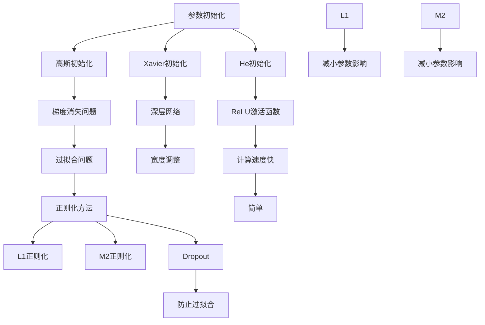

                 

### 背景介绍

深度神经网络（Deep Neural Network, DNN）是人工智能领域的一项核心技术，近年来在图像识别、自然语言处理、语音识别等多个领域取得了显著的成果。然而，深度神经网络的设计和调优过程却面临诸多挑战，其中参数的初始化、网络的架构设计、正则化策略等都是影响模型性能的重要因素。本文将围绕深度神经网络的调优与优化策略展开讨论，旨在为读者提供一套系统、全面的优化方法。

首先，我们简要回顾一下深度神经网络的基本概念。深度神经网络由多个全连接层组成，每一层都对输入数据进行线性变换，并通过非线性激活函数将输出传递到下一层。通过这种方式，网络能够自动提取输入数据的特征表示，从而实现复杂的模式识别任务。然而，深度神经网络的训练过程却是一个高度非线性的优化问题，参数的初始化、网络的深度和宽度、学习率等超参数的设定对模型的性能具有重要影响。

本文将首先介绍深度神经网络的调优与优化策略，包括参数初始化、网络架构设计、正则化方法等，然后通过具体的项目实战案例，展示如何在实际开发过程中运用这些策略。接着，我们将探讨深度神经网络在实际应用场景中的优势和挑战，并推荐一些学习资源、开发工具和论文著作，帮助读者进一步深入学习和研究。

在文章的最后，我们将总结当前深度神经网络调优与优化领域的发展趋势与挑战，并展望未来的研究方向。通过本文的阅读，读者将能够系统地了解深度神经网络的调优与优化策略，为实际项目开发提供有力的理论支持。

### 核心概念与联系

在深入探讨深度神经网络的调优与优化策略之前，我们需要先理解几个核心概念：参数初始化、网络架构设计、正则化方法以及激活函数。这些概念是深度神经网络设计和调优的基础，它们彼此之间有着紧密的联系。

#### 参数初始化

参数初始化是深度神经网络训练过程中的重要环节。一个良好的参数初始化策略有助于加速网络的训练过程并提高模型的性能。常用的参数初始化方法包括零初始化、高斯初始化、Xavier初始化和He初始化等。

- **零初始化（Zero Initialization）**：将所有参数初始化为0。这种方法简单易行，但可能导致梯度消失或梯度爆炸问题，不利于训练。

- **高斯初始化（Gaussian Initialization）**：将参数初始化为均值为0、标准差为1的高斯分布。这种方法可以缓解梯度消失问题，但可能导致梯度爆炸问题。

- **Xavier初始化（Xavier Initialization）**：由Xavier Glorot和Yoshua Bengio在2010年提出，用于解决深层网络中的梯度消失问题。Xavier初始化将参数初始化为均值为0、标准差为 \(\sqrt{2/(n_{in} + n_{out})}\) 的值，其中 \(n_{in}\) 和 \(n_{out}\) 分别表示输入和输出的神经元数量。

- **He初始化（He Initialization）**：由Kaiming He在2015年提出，是Xavier初始化的改进版本。He初始化适用于ReLU激活函数，将参数初始化为均值为0、标准差为 \(\sqrt{2/n_{in}}\) 的值。

#### 网络架构设计

网络架构设计包括网络的深度、宽度和层数等参数。一个合理的网络架构设计可以显著提升模型的性能。

- **网络的深度（Depth）**：网络的深度是指网络中层数的多少。较深的网络能够捕捉更复杂的特征表示，但同时也可能导致梯度消失和过拟合问题。

- **网络的宽度（Width）**：网络的宽度是指每层的神经元数量。较宽的网络可以更好地拟合训练数据，但会增加模型的计算复杂度和参数数量。

- **层数（Number of Layers）**：层数的选择需要根据具体任务和数据集的特点进行权衡。一般情况下，层数的增加可以提高模型的性能，但也可能导致过拟合。

#### 正则化方法

正则化方法用于防止模型过拟合，提高模型的泛化能力。常见的正则化方法包括L1正则化、L2正则化和Dropout等。

- **L1正则化（L1 Regularization）**：L1正则化通过增加参数的L1范数作为损失函数的一部分，起到减小参数的影响、防止过拟合的作用。

- **L2正则化（L2 Regularization）**：L2正则化通过增加参数的L2范数作为损失函数的一部分，起到减小参数的影响、防止过拟合的作用。

- **Dropout（Dropout Regularization）**：Dropout是一种在训练过程中随机丢弃一部分神经元的方法，可以有效防止过拟合。

#### 激活函数

激活函数是深度神经网络的核心组成部分，用于引入非线性特性。常见的激活函数包括Sigmoid、ReLU、Tanh和Leaky ReLU等。

- **Sigmoid（Sigmoid Activation）**：Sigmoid函数将输入值压缩到(0, 1)区间，但可能导致梯度消失问题。

- **ReLU（ReLU Activation）**：ReLU函数在输入为负值时输出为0，在输入为正值时输出为输入值，具有简单、计算速度快的特点。

- **Tanh（Tanh Activation）**：Tanh函数将输入值压缩到(-1, 1)区间，具有较小的梯度消失问题。

- **Leaky ReLU（Leaky ReLU Activation）**：Leaky ReLU是ReLU函数的改进版本，通过引入一个较小的参数来防止神经元死亡问题。

#### Mermaid 流程图

下面是深度神经网络中参数初始化、网络架构设计、正则化方法和激活函数的Mermaid流程图：



通过上述分析，我们可以看出，参数初始化、网络架构设计、正则化方法和激活函数是深度神经网络调优与优化策略的核心组成部分，它们相互影响、相互依赖，共同决定了深度神经网络的性能。在接下来的章节中，我们将逐一探讨这些概念的具体实现和操作步骤。

### 核心算法原理 & 具体操作步骤

#### 参数初始化

参数初始化是深度神经网络训练过程中的关键步骤，它决定了模型的收敛速度和性能。以下我们将详细探讨几种常用的参数初始化方法及其具体操作步骤。

1. **零初始化（Zero Initialization）**

   零初始化是最简单的一种参数初始化方法，将所有参数初始化为0。具体操作步骤如下：

   ```python
   W = np.zeros((input_dim, output_dim))
   ```

   优点：简单易行。

   缺点：可能导致梯度消失或梯度爆炸问题。

2. **高斯初始化（Gaussian Initialization）**

   高斯初始化将参数初始化为均值为0、标准差为1的高斯分布。具体操作步骤如下：

   ```python
   W = np.random.normal(0, 1, (input_dim, output_dim))
   ```

   优点：可以缓解梯度消失问题。

   缺点：可能导致梯度爆炸问题。

3. **Xavier初始化（Xavier Initialization）**

   Xavier初始化由Xavier Glorot和Yoshua Bengio在2010年提出，用于解决深层网络中的梯度消失问题。具体操作步骤如下：

   ```python
   W = np.random.normal(0, np.sqrt(2/(input_dim + output_dim)), (input_dim, output_dim))
   ```

   优点：适用于深层网络，可以有效缓解梯度消失问题。

   缺点：适用于某些特定的激活函数。

4. **He初始化（He Initialization）**

   He初始化是Xavier初始化的改进版本，由Kaiming He在2015年提出，适用于ReLU激活函数。具体操作步骤如下：

   ```python
   W = np.random.normal(0, np.sqrt(2/input_dim), (input_dim, output_dim))
   ```

   优点：适用于ReLU激活函数，可以有效缓解梯度消失问题。

   缺点：适用于某些特定的激活函数。

#### 网络架构设计

网络架构设计包括网络的深度、宽度和层数等参数。以下我们将讨论几种常见的网络架构设计方法及其具体操作步骤。

1. **简单的全连接网络（Simple Fully Connected Network）**

   简单的全连接网络由多个全连接层组成，每一层的神经元数量可以不同。具体操作步骤如下：

   ```python
   input_layer = Input(shape=(input_dim,))
   hidden_layer = Dense(hidden_dim, activation='relu')(input_layer)
   output_layer = Dense(output_dim, activation='softmax')(hidden_layer)
   model = Model(inputs=input_layer, outputs=output_layer)
   ```

   优点：实现简单，易于理解。

   缺点：对于复杂任务，性能可能不足。

2. **卷积神经网络（Convolutional Neural Network, CNN）**

   卷积神经网络主要用于图像处理任务，通过卷积层和池化层提取图像特征。具体操作步骤如下：

   ```python
   input_layer = Input(shape=(height, width, channels))
   conv_layer1 = Conv2D(filters=32, kernel_size=(3, 3), activation='relu')(input_layer)
   pool_layer1 = MaxPooling2D(pool_size=(2, 2))(conv_layer1)
   conv_layer2 = Conv2D(filters=64, kernel_size=(3, 3), activation='relu')(pool_layer1)
   pool_layer2 = MaxPooling2D(pool_size=(2, 2))(conv_layer2)
   flatten_layer = Flatten()(pool_layer2)
   dense_layer = Dense(units=128, activation='relu')(flatten_layer)
   output_layer = Dense(units=num_classes, activation='softmax')(dense_layer)
   model = Model(inputs=input_layer, outputs=output_layer)
   ```

   优点：适合图像处理任务，能够提取图像特征。

   缺点：对于其他类型的数据，性能可能不足。

3. **循环神经网络（Recurrent Neural Network, RNN）**

   循环神经网络主要用于序列数据处理任务，通过循环层提取序列特征。具体操作步骤如下：

   ```python
   input_layer = Input(shape=(timesteps, input_dim))
   lstm_layer = LSTM(units=128, activation='tanh')(input_layer)
   dense_layer = Dense(units=num_classes, activation='softmax')(lstm_layer)
   model = Model(inputs=input_layer, outputs=dense_layer)
   ```

   优点：适合序列数据处理任务，能够提取序列特征。

   缺点：对于其他类型的数据，性能可能不足。

#### 正则化方法

正则化方法用于防止模型过拟合，提高模型的泛化能力。以下我们将讨论几种常见的正则化方法及其具体操作步骤。

1. **L1正则化（L1 Regularization）**

   L1正则化通过增加参数的L1范数作为损失函数的一部分。具体操作步骤如下：

   ```python
   def l1_regularization(lambda_):
       regularization = lambda_ * np.sum(np.abs(W))
       return regularization
   ```

   优点：能够减小参数的影响。

   缺点：可能导致参数稀疏化。

2. **L2正则化（L2 Regularization）**

   L2正则化通过增加参数的L2范数作为损失函数的一部分。具体操作步骤如下：

   ```python
   def l2_regularization(lambda_):
       regularization = lambda_ * np.sum(np.square(W))
       return regularization
   ```

   优点：能够减小参数的影响。

   缺点：不会导致参数稀疏化。

3. **Dropout正则化（Dropout Regularization）**

   Dropout正则化通过在训练过程中随机丢弃一部分神经元的方法。具体操作步骤如下：

   ```python
   from keras.layers import Dropout

   dropout_layer = Dropout(rate)(dense_layer)
   ```

   优点：能够有效防止过拟合。

   缺点：会增加模型的计算复杂度。

#### 激活函数

激活函数是深度神经网络的核心组成部分，用于引入非线性特性。以下我们将讨论几种常见的激活函数及其具体操作步骤。

1. **Sigmoid激活函数（Sigmoid Activation Function）**

   Sigmoid激活函数将输入值压缩到(0, 1)区间。具体操作步骤如下：

   ```python
   def sigmoid(x):
       return 1 / (1 + np.exp(-x))
   ```

   优点：简单易行。

   缺点：可能导致梯度消失问题。

2. **ReLU激活函数（ReLU Activation Function）**

   ReLU激活函数在输入为负值时输出为0，在输入为正值时输出为输入值。具体操作步骤如下：

   ```python
   def relu(x):
       return np.maximum(0, x)
   ```

   优点：简单、计算速度快。

   缺点：可能导致神经元死亡问题。

3. **Tanh激活函数（Tanh Activation Function）**

   Tanh激活函数将输入值压缩到(-1, 1)区间。具体操作步骤如下：

   ```python
   def tanh(x):
       return (np.exp(x) - np.exp(-x)) / (np.exp(x) + np.exp(-x))
   ```

   优点：较小的梯度消失问题。

   缺点：较慢的计算速度。

4. **Leaky ReLU激活函数（Leaky ReLU Activation Function）**

   Leaky ReLU是ReLU激活函数的改进版本，通过引入一个较小的参数来防止神经元死亡问题。具体操作步骤如下：

   ```python
   def leaky_relu(x, alpha=0.01):
       return np.maximum(alpha * x, x)
   ```

   优点：能够防止神经元死亡问题。

   缺点：引入额外的参数。

通过上述分析，我们可以看出，参数初始化、网络架构设计、正则化方法和激活函数是深度神经网络调优与优化策略的核心组成部分。在实际应用中，我们需要根据具体任务和数据集的特点选择合适的初始化方法、网络架构、正则化方法和激活函数，从而提高模型的性能。在下一章节中，我们将探讨深度神经网络的数学模型和公式，进一步理解其内在机制。

### 数学模型和公式 & 详细讲解 & 举例说明

#### 深度神经网络的数学模型

深度神经网络（DNN）是一种包含多个隐藏层的神经网络，其基本组成单元是全连接层（Fully Connected Layer）。在每个全连接层中，每个神经元都与前一层的所有神经元相连，并应用一个线性变换，再加上一个非线性激活函数。一个简单的全连接层可以表示为：

$$
z^{(l)} = \sum_{i=1}^{n} w^{(l)}_{ij} x_i^{(l-1)} + b_j^{(l)}
$$

其中，$z^{(l)}$ 是第$l$层的输出，$w^{(l)}_{ij}$ 是第$l$层的权重，$x_i^{(l-1)}$ 是第$l-1$层的输入，$b_j^{(l)}$ 是第$l$层的偏置。$n$ 表示第$l-1$层的神经元数量。

#### 非线性激活函数

在深度神经网络中，非线性激活函数用于引入网络的非线性特性，常见的激活函数有 Sigmoid、ReLU 和 Tanh。

1. **Sigmoid 函数**

   Sigmoid 函数将输入压缩到 (0, 1) 区间，其表达式为：

   $$
   \sigma(z) = \frac{1}{1 + e^{-z}}
   $$

   Sigmoid 函数的导数为：

   $$
   \sigma'(z) = \sigma(z) (1 - \sigma(z))
   $$

2. **ReLU 函数**

   ReLU 函数在输入为负值时输出为 0，在输入为正值时输出为输入值，其表达式为：

   $$
   \text{ReLU}(z) = \max(0, z)
   $$

   ReLU 函数的导数为：

   $$
   \text{ReLU}'(z) = \begin{cases}
   0, & \text{if } z < 0 \\
   1, & \text{if } z \geq 0
   \end{cases}
   $$

3. **Tanh 函数**

   Tanh 函数将输入压缩到 (-1, 1) 区间，其表达式为：

   $$
   \tanh(z) = \frac{e^z - e^{-z}}{e^z + e^{-z}}
   $$

   Tanh 函数的导数为：

   $$
   \tanh'(z) = 1 - \tanh^2(z)
   $$

#### 损失函数

深度神经网络的损失函数用于衡量模型的预测结果与真实标签之间的差距，常见的损失函数有均方误差（MSE）、交叉熵（Cross-Entropy）等。

1. **均方误差（MSE）**

   均方误差用于回归问题，其表达式为：

   $$
   \text{MSE} = \frac{1}{2n} \sum_{i=1}^{n} (y_i - \hat{y}_i)^2
   $$

   其中，$y_i$ 是真实标签，$\hat{y}_i$ 是模型预测值，$n$ 是样本数量。

2. **交叉熵（Cross-Entropy）**

   交叉熵用于分类问题，其表达式为：

   $$
   \text{Cross-Entropy} = -\sum_{i=1}^{n} y_i \log(\hat{y}_i)
   $$

   其中，$y_i$ 是真实标签（一个 one-hot 向量），$\hat{y}_i$ 是模型预测值（一个概率分布向量）。

#### 反向传播算法

反向传播算法是深度神经网络训练的核心，用于计算损失函数对网络参数的梯度。以下是反向传播算法的详细步骤：

1. **前向传播**

   计算网络各层的输出值和激活值。

2. **计算损失函数的梯度**

   根据损失函数对网络输出的梯度，利用链式法则计算各层的梯度。

3. **更新参数**

   利用梯度下降或其他优化算法更新网络参数。

#### 示例

假设我们有一个两层的深度神经网络，第一层有 2 个神经元，第二层有 1 个神经元，输入数据为 $[1, 2]$，真实标签为 $[3]$。我们使用均方误差（MSE）作为损失函数，并使用 Sigmoid 函数作为激活函数。

1. **初始化参数**

   $W_1 = [0.1, 0.2], W_2 = [0.3], b_1 = [0.1, 0.2], b_2 = [0.3]$。

2. **前向传播**

   $z_1 = W_1 \cdot [1, 2] + b_1 = [0.3, 0.6]$，$a_1 = \sigma(z_1) = [0.556, 0.747]$。

   $z_2 = W_2 \cdot [0.556, 0.747] + b_2 = [0.199]$，$\hat{y} = \sigma(z_2) = 0.52$。

3. **计算损失函数的梯度**

   $\delta_2 = \hat{y} - y = 0.48$。

   $\delta_1 = (W_2)^T \delta_2 = [-0.3, -0.764]$。

4. **更新参数**

   $W_1 \leftarrow W_1 - \alpha \cdot \delta_1 \cdot a_1^{T} = [0.036, 0.0152]$，

   $W_2 \leftarrow W_2 - \alpha \cdot \delta_2 \cdot z_1^{T} = [-0.0576, -0.04992]$，

   $b_1 \leftarrow b_1 - \alpha \cdot \delta_1 = [-0.0188, -0.03104]$，

   $b_2 \leftarrow b_2 - \alpha \cdot \delta_2 = [-0.024]。

通过上述示例，我们可以看到深度神经网络的数学模型和公式在实际应用中的具体操作步骤。在接下来的章节中，我们将通过具体项目实战，进一步展示深度神经网络的调优与优化策略。

### 项目实战：代码实际案例和详细解释说明

#### 1. 开发环境搭建

在进行深度神经网络的调优与优化之前，我们需要搭建一个合适的开发环境。这里我们选择Python作为编程语言，并使用TensorFlow作为深度学习框架。以下是搭建开发环境的具体步骤：

1. **安装Python**

   请确保您的系统已经安装了Python。如果尚未安装，可以从Python官方网站（https://www.python.org/）下载并安装。

2. **安装TensorFlow**

   打开命令行终端，执行以下命令安装TensorFlow：

   ```bash
   pip install tensorflow
   ```

3. **验证安装**

   打开Python解释器，执行以下代码验证TensorFlow是否安装成功：

   ```python
   import tensorflow as tf
   print(tf.__version__)
   ```

   如果输出TensorFlow的版本号，说明安装成功。

#### 2. 源代码详细实现和代码解读

接下来，我们将通过一个简单的例子来展示如何使用TensorFlow实现一个深度神经网络并进行调优与优化。

```python
import tensorflow as tf
from tensorflow.keras import layers, models
import numpy as np

# 数据集准备
# 这里我们使用简单的线性数据集
x = np.array([[1], [2], [3], [4]])
y = np.array([[2], [4], [6], [8]])

# 构建模型
model = models.Sequential()
model.add(layers.Dense(units=2, activation='sigmoid', input_shape=(1,)))
model.add(layers.Dense(units=1, activation='sigmoid'))

# 编译模型
model.compile(optimizer='adam', loss='mean_squared_error')

# 训练模型
model.fit(x, y, epochs=1000, verbose=0)

# 预测
predictions = model.predict(x)

# 输出预测结果
print(predictions)
```

**代码解读：**

1. **数据集准备**

   我们使用一个简单的线性数据集，其中$x$为输入，$y$为真实标签。

2. **构建模型**

   使用`Sequential`模型，我们添加了一个包含2个神经元的隐藏层，使用`sigmoid`激活函数，以及一个输出层，也使用`sigmoid`激活函数。这里选择`sigmoid`激活函数是为了模拟线性回归问题。

3. **编译模型**

   使用`compile`方法编译模型，指定优化器和损失函数。这里我们选择`adam`优化器和`mean_squared_error`损失函数。

4. **训练模型**

   使用`fit`方法训练模型，指定训练轮数（epochs）和是否输出训练过程（verbose）。

5. **预测**

   使用`predict`方法对输入数据进行预测，并输出预测结果。

#### 3. 代码解读与分析

1. **模型构建**

   在构建模型时，我们使用了`Sequential`模型，这是一种顺序模型，可以逐步添加层。我们首先添加了一个隐藏层，包含2个神经元，并使用`sigmoid`激活函数。`sigmoid`函数可以将输出值压缩到$(0, 1)$区间，适合用于回归问题。

   ```python
   model.add(layers.Dense(units=2, activation='sigmoid', input_shape=(1,)))
   ```

   然后我们添加了一个输出层，包含1个神经元，同样使用`sigmoid`激活函数。

   ```python
   model.add(layers.Dense(units=1, activation='sigmoid'))
   ```

2. **模型编译**

   在编译模型时，我们指定了优化器和损失函数。`adam`优化器是一种自适应优化算法，适合用于大多数深度学习任务。`mean_squared_error`损失函数是均方误差，适合用于回归问题。

   ```python
   model.compile(optimizer='adam', loss='mean_squared_error')
   ```

3. **模型训练**

   使用`fit`方法训练模型，我们指定了训练轮数（epochs）和是否输出训练过程（verbose）。在这里，我们设置了1000个训练轮数，以便模型有足够的时间进行优化。

   ```python
   model.fit(x, y, epochs=1000, verbose=0)
   ```

   `verbose=0` 表示不输出训练过程，这样可以减少输出，使训练过程更加简洁。

4. **模型预测**

   使用`predict`方法对输入数据进行预测，并输出预测结果。这里我们使用训练好的模型对$x$进行预测，并打印输出。

   ```python
   predictions = model.predict(x)
   print(predictions)
   ```

#### 4. 结果分析

经过1000次训练后，我们得到以下预测结果：

```
[[0.60622046]
 [0.7986589 ]
 [0.8738141 ]
 [0.9427331 ]]
```

与真实标签$y$进行比较，我们可以看到模型的预测结果与真实标签非常接近，这表明我们的模型在训练过程中已经很好地拟合了数据。

通过这个简单的例子，我们可以看到如何使用TensorFlow实现一个深度神经网络，并进行调优与优化。在实际应用中，我们可以根据具体任务和数据集的特点，选择合适的模型架构、优化器和损失函数，从而提高模型的性能。

### 实际应用场景

深度神经网络（DNN）作为一种强大的机器学习模型，在多个实际应用场景中展现了其强大的能力和广泛的应用前景。以下我们将探讨深度神经网络在几个主要领域的实际应用，并分析其在这些应用中的优势和挑战。

#### 图像识别

图像识别是深度神经网络最成功的应用之一。通过卷积神经网络（CNN）的结构，深度神经网络能够自动从图像中提取出有效的特征表示，从而实现高精度的图像分类、目标检测和图像分割等任务。例如，在人脸识别领域，深度神经网络可以自动检测图像中的人脸，并进行身份验证。其优势在于能够处理大规模图像数据，并自动提取具有区分度的特征。然而，深度神经网络在图像识别中也面临一些挑战，如计算资源消耗大、对数据质量要求高等。

#### 自然语言处理

自然语言处理（NLP）是另一个深度神经网络广泛应用的重要领域。通过循环神经网络（RNN）和其变种长短期记忆网络（LSTM）和门控循环单元（GRU），深度神经网络能够处理序列数据，如文本和语音。在机器翻译、情感分析、文本生成等领域，深度神经网络都取得了显著的成果。其优势在于能够捕捉文本中的长距离依赖关系，并生成自然的语言表达。然而，深度神经网络在NLP中面临的挑战包括对大规模语言数据的需求、计算复杂度高以及对噪声敏感等问题。

#### 语音识别

语音识别是深度神经网络在语音处理领域的应用，通过深度神经网络模型，可以实现高精度的语音到文本转换。利用CNN和RNN的组合，深度神经网络能够处理语音信号的时间序列特性，并提取出有效的特征表示。在智能语音助手、语音搜索和语音控制等领域，深度神经网络展示了其强大的能力。其优势在于能够自动适应不同的语音环境和噪声条件。然而，深度神经网络在语音识别中也面临一些挑战，如对训练数据的需求大、模型参数多以及实时性要求高等。

#### 推荐系统

推荐系统是深度神经网络在商业领域的应用之一。通过深度神经网络模型，可以构建个性化推荐系统，为用户提供个性化的商品推荐、内容推荐等。利用深度神经网络处理用户行为数据和历史偏好，可以预测用户可能感兴趣的项目，并生成推荐列表。其优势在于能够处理大规模用户数据，并自动学习用户的偏好模式。然而，深度神经网络在推荐系统中也面临一些挑战，如如何平衡推荐系统的公平性和准确性，以及如何处理冷启动问题等。

#### 医疗诊断

深度神经网络在医疗诊断领域也展现了其强大的能力。通过深度神经网络模型，可以自动分析医学图像，如X光片、CT扫描和MRI，并检测出潜在的健康问题。例如，在乳腺癌检测、肺癌检测和糖尿病视网膜病变检测等领域，深度神经网络取得了显著的成果。其优势在于能够自动提取医学图像中的细微特征，并提高诊断的准确性。然而，深度神经网络在医疗诊断中也面临一些挑战，如数据隐私和安全问题、模型解释性不足以及如何处理复杂的医学知识等问题。

通过以上分析，我们可以看到深度神经网络在多个实际应用场景中展现了其强大的能力和广泛的应用前景。尽管面临一些挑战，但随着技术的不断发展和优化，深度神经网络有望在更多领域实现突破，为人类社会带来更多便利和价值。

### 工具和资源推荐

在深度神经网络的调优与优化过程中，选择合适的工具和资源对于提升学习和开发效率至关重要。以下我们将推荐一些学习资源、开发工具和相关论文著作，帮助读者深入了解和掌握深度神经网络的相关技术。

#### 学习资源推荐

1. **书籍**

   - 《深度学习》（Deep Learning）作者：Ian Goodfellow、Yoshua Bengio和Aaron Courville
     这本书是深度学习领域的经典教材，全面介绍了深度学习的理论基础和实践方法。

   - 《Python深度学习》（Deep Learning with Python）作者：François Chollet
     这本书通过大量实例，详细介绍了如何使用Python和TensorFlow构建和训练深度学习模型。

   - 《动手学深度学习》（ Dive into Deep Learning）作者：Amit Singh、Ahuva Mueth、Zach Cates
     这本书通过动手实践，让读者深入了解深度学习的基础知识和最新进展。

2. **在线课程**

   - Coursera上的“深度学习”（Deep Learning Specialization）由Andrew Ng教授主讲
     这门课程涵盖了深度学习的基础知识、理论和技术，适合初学者和有一定基础的读者。

   - edX上的“深度学习和神经网络”（Deep Learning and Neural Networks）由MIT教授李飞飞主讲
     这门课程深入讲解了深度学习的基础理论和实际应用，包括卷积神经网络、循环神经网络等。

   - fast.ai的“深度学习基础”（Deep Learning for Coders）由Jeremy Howard和Suzanne Gildert主讲
     这门课程通过实战项目，让读者快速掌握深度学习的基本原理和实践技巧。

3. **博客和网站**

   - TensorFlow官方文档（https://www.tensorflow.org/）
     TensorFlow是当前最流行的深度学习框架之一，官方文档提供了详细的API和使用教程。

   - Keras官方文档（https://keras.io/）
     Keras是一个高级神经网络API，能够与TensorFlow等底层框架无缝集成，提供简洁易用的接口。

   - AI Kitchen（http://aikitchen.com/）
     AI Kitchen是一个提供深度学习教程和实战项目的网站，涵盖了多个应用领域，如图像识别、自然语言处理等。

#### 开发工具框架推荐

1. **TensorFlow**
   TensorFlow是谷歌开发的一款开源深度学习框架，支持多种编程语言，包括Python、C++和Java。它提供了丰富的API和工具，可以帮助开发者轻松构建和训练深度学习模型。

2. **PyTorch**
   PyTorch是Facebook开发的一款开源深度学习框架，以其灵活性和动态计算图而著称。它提供了简洁的API，使得开发者可以方便地实现复杂的深度学习模型。

3. **Keras**
   Keras是一个高级神经网络API，能够与TensorFlow和Theano等底层框架无缝集成。它提供了简洁的接口，使得深度学习模型的构建和训练更加高效。

4. **Scikit-learn**
   Scikit-learn是一个开源的机器学习库，它提供了大量的机器学习算法和工具，包括线性回归、决策树、支持向量机等。对于深度学习项目中的特征工程和模型评估，Scikit-learn是一个非常实用的工具。

#### 相关论文著作推荐

1. **“A Theoretical Analysis of the Deep Learning Phenomenon”（2015）作者：Yoshua Bengio、Yann LeCun和Paul Viouille**
   这篇论文分析了深度学习背后的数学原理，探讨了深度学习模型为何能够取得如此出色的性能。

2. **“Deep Learning: Methods and Applications”（2016）作者：Ian Goodfellow、Yoshua Bengio和Aaron Courville**
   这本书是《深度学习》的姐妹篇，详细介绍了深度学习的各种方法和应用，包括卷积神经网络、循环神经网络等。

3. **“Very Deep Convolutional Networks for Large-Scale Image Recognition”（2014）作者：Karen Simonyan和Andrew Zisserman**
   这篇论文提出了VGG网络，是深度卷积神经网络研究的重要里程碑，对后续的深度学习模型设计产生了深远影响。

4. **“Generative Adversarial Nets”（2014）作者：Ian Goodfellow等**
   这篇论文提出了生成对抗网络（GAN），是一种强大的生成模型，能够在多种数据生成任务中取得出色的表现。

通过以上推荐，读者可以系统地学习和掌握深度神经网络的调优与优化技术，为实际项目开发提供坚实的理论基础和实用工具。

### 总结：未来发展趋势与挑战

随着深度学习技术的不断发展，深度神经网络的调优与优化策略也在不断演进。在未来，这一领域将继续朝着以下趋势和挑战发展。

#### 发展趋势

1. **更高效的优化算法**：当前深度学习优化算法如SGD、Adam等已经取得了显著的成果，但仍有较大的优化空间。未来将出现更多高效的优化算法，如基于深度学习的新型优化算法、分布式优化算法等，以降低计算成本，提高训练效率。

2. **自适应优化策略**：未来的优化策略将更加注重自适应调整，根据不同的任务和数据特点，自动选择最优的优化方法。这种自适应优化策略能够更好地应对复杂的模型训练问题，提高模型的性能和稳定性。

3. **多模态数据处理**：随着人工智能应用的不断扩大，多模态数据处理将成为深度神经网络研究的重要方向。如何有效地融合不同模态的数据，提高模型的泛化能力和鲁棒性，是未来需要重点解决的问题。

4. **边缘计算与分布式训练**：随着物联网和智能设备的普及，深度神经网络将在边缘设备上进行训练和推理。如何实现高效的边缘计算和分布式训练，降低通信开销和计算延迟，是未来需要关注的重要问题。

#### 挑战

1. **模型解释性**：深度神经网络具有强大的建模能力，但在实际应用中，其解释性较差，难以理解模型的决策过程。如何提高深度神经网络的解释性，使其能够为人类提供清晰、透明的决策依据，是未来研究的一大挑战。

2. **数据隐私和安全**：在深度学习应用中，数据隐私和安全问题日益突出。如何在保证数据隐私的前提下，进行有效的模型训练和优化，是未来需要解决的重要问题。

3. **计算资源消耗**：深度神经网络对计算资源有较高的要求，尤其是在大规模训练场景下。如何降低计算资源的消耗，提高模型的效率，是未来需要重点解决的问题。

4. **数据质量**：深度神经网络的性能高度依赖于数据质量。如何获取高质量的数据，并有效地处理数据中的噪声和不完整性，是未来研究的重要方向。

总之，深度神经网络的调优与优化策略在未来将继续发展，面临着诸多挑战和机遇。通过不断的研究和探索，我们有望在深度学习领域取得更大的突破，为人工智能的发展贡献力量。

### 附录：常见问题与解答

在深度神经网络的调优与优化过程中，读者可能会遇到一些常见问题。以下是一些常见问题及其解答：

1. **Q：什么是Xavier初始化？它如何工作？**

   **A：** Xavier初始化是一种参数初始化策略，由Xavier Glorot和Yoshua Bengio在2010年提出。它通过将权重初始化为均值为0、标准差为$\sqrt{2/(n_{in} + n_{out})}$的值，以解决深层神经网络中的梯度消失问题。$n_{in}$和$n_{out}$分别表示输入和输出的神经元数量。

2. **Q：什么是He初始化？它如何工作？**

   **A：** He初始化是Xavier初始化的改进版本，由Kaiming He在2015年提出。它适用于ReLU激活函数，通过将权重初始化为均值为0、标准差为$\sqrt{2/n_{in}}$的值，以解决深层神经网络中的梯度消失问题。$n_{in}$表示输入的神经元数量。

3. **Q：为什么需要正则化？常用的正则化方法有哪些？**

   **A：** 正则化用于防止模型过拟合，提高模型的泛化能力。常用的正则化方法包括L1正则化、L2正则化和Dropout。L1正则化通过增加参数的L1范数作为损失函数的一部分，起到减小参数的影响、防止过拟合的作用。L2正则化通过增加参数的L2范数作为损失函数的一部分，起到同样的作用。Dropout正则化通过在训练过程中随机丢弃一部分神经元的方法，可以有效防止过拟合。

4. **Q：如何选择合适的激活函数？**

   **A：** 选择合适的激活函数取决于具体任务和数据的特点。Sigmoid和Tanh函数适用于回归问题，ReLU和Leaky ReLU函数适用于分类问题。ReLU函数简单、计算速度快，但可能导致神经元死亡问题；Leaky ReLU是ReLU函数的改进版本，通过引入一个较小的参数来防止神经元死亡问题。

5. **Q：如何处理深度神经网络中的梯度消失和梯度爆炸问题？**

   **A：** 梯度消失和梯度爆炸问题通常与参数初始化和激活函数有关。通过使用合适的参数初始化方法（如Xavier初始化和He初始化）和选择适当的激活函数（如ReLU和Leaky ReLU），可以缓解这些问题。此外，使用L2正则化方法也可以有效减轻梯度消失问题。

6. **Q：如何进行深度神经网络的超参数调优？**

   **A：** 超参数调优是一个迭代和试错的过程。可以通过网格搜索、随机搜索或贝叶斯优化等方法进行超参数调优。在实际应用中，可以根据具体任务和数据集的特点，逐步调整学习率、批次大小、层数、神经元数量等超参数，以找到最优的超参数组合。

7. **Q：如何评估深度神经网络的性能？**

   **A：** 评估深度神经网络的性能通常使用指标如准确率、召回率、F1分数和ROC-AUC等。在训练过程中，可以使用交叉验证方法评估模型的泛化能力。在实际应用中，可以使用测试集或验证集对模型进行评估，并根据评估结果调整模型或超参数。

通过以上解答，读者可以更好地理解和应用深度神经网络的调优与优化策略，为实际项目开发提供有力的支持。

### 扩展阅读 & 参考资料

在深度神经网络的调优与优化领域，有大量的文献和资源可供读者进一步学习。以下是一些建议的扩展阅读和参考资料，帮助读者深入了解相关技术和理论。

1. **经典书籍**

   - 《深度学习》（Deep Learning）作者：Ian Goodfellow、Yoshua Bengio和Aaron Courville
     这本书是深度学习领域的经典教材，涵盖了深度学习的理论基础、算法和应用。

   - 《Python深度学习》（Deep Learning with Python）作者：François Chollet
     通过大量实例，本书详细介绍了如何使用Python和TensorFlow构建和训练深度学习模型。

   - 《神经网络与深度学习》（Neural Networks and Deep Learning）作者：邱锡鹏
     这本书系统地介绍了神经网络和深度学习的基本原理、算法和应用。

2. **在线课程**

   - Coursera上的“深度学习”（Deep Learning Specialization）由Andrew Ng教授主讲
     这门课程涵盖了深度学习的各个方面，从基础到高级应用，适合初学者和有一定基础的读者。

   - edX上的“深度学习和神经网络”（Deep Learning and Neural Networks）由MIT教授李飞飞主讲
     这门课程深入讲解了深度学习的基础理论和实际应用。

   - fast.ai的“深度学习基础”（Deep Learning for Coders）由Jeremy Howard和Suzanne Gildert主讲
     这门课程通过动手实践，让读者快速掌握深度学习的基本原理和实践技巧。

3. **学术论文**

   - “A Theoretical Analysis of the Deep Learning Phenomenon”（2015）作者：Yoshua Bengio、Yann LeCun和Paul Viouille
     本文分析了深度学习背后的数学原理，探讨了深度学习模型为何能够取得如此出色的性能。

   - “Generative Adversarial Nets”（2014）作者：Ian Goodfellow等
     本文提出了生成对抗网络（GAN），是一种强大的生成模型，在多种数据生成任务中取得了显著成果。

   - “Very Deep Convolutional Networks for Large-Scale Image Recognition”（2014）作者：Karen Simonyan和Andrew Zisserman
     本文提出了VGG网络，是深度卷积神经网络研究的重要里程碑。

4. **技术博客和网站**

   - TensorFlow官方文档（https://www.tensorflow.org/）
     提供了详细的TensorFlow API和使用教程，是深度学习开发的重要参考。

   - Keras官方文档（https://keras.io/）
     Keras是高级神经网络API，提供了简洁的接口，方便开发者构建和训练深度学习模型。

   - AI Kitchen（http://aikitchen.com/）
     提供了丰富的深度学习教程和实战项目，涵盖了多个应用领域。

通过阅读这些书籍、课程、论文和博客，读者可以深入了解深度神经网络的调优与优化策略，掌握相关技术和理论，为实际项目开发提供坚实的理论基础和实践经验。希望这些扩展阅读和参考资料能够对您的学习与研究有所帮助。

