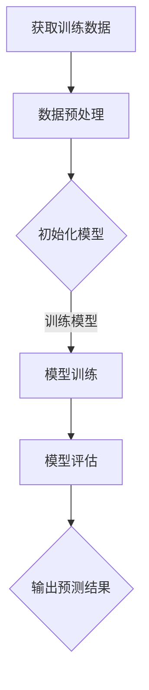
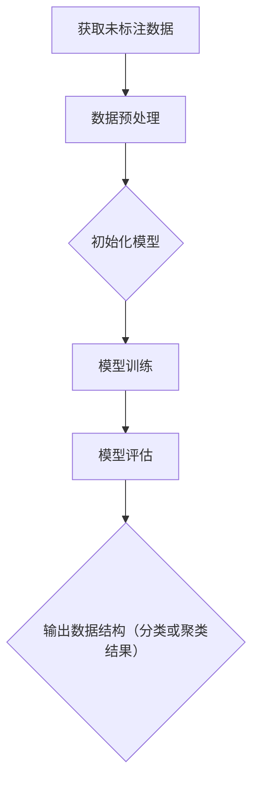

                 

# 一切皆是映射：监督学习和非监督学习的区别与联系

> **关键词**：监督学习，非监督学习，机器学习，数据挖掘，映射，神经网络，人工智能

> **摘要**：本文将深入探讨监督学习和非监督学习这两种机器学习方法的本质区别与联系。通过剖析它们的核心概念、算法原理、数学模型以及实际应用场景，旨在帮助读者更全面地理解机器学习领域中的这两大基石。此外，文章还将提供相关的工具和资源推荐，以及总结未来发展趋势与挑战。

## 1. 背景介绍

在当今信息技术飞速发展的时代，机器学习作为人工智能的核心技术之一，已成为众多领域的重要推动力。机器学习的基本目标是让计算机从数据中自动学习和发现规律，从而进行预测或决策。在这个过程中，监督学习和非监督学习作为机器学习的两大类别，扮演着至关重要的角色。

监督学习（Supervised Learning）是指通过已知输入和输出数据的训练集，构建模型并使其能够对新数据进行预测。在这种方法中，学习过程可以看作是教师向学生提供正确答案，学生通过不断调整自身模型以接近正确答案的过程。

非监督学习（Unsupervised Learning）则是在没有明确标签的输入数据上进行学习，旨在发现数据中的隐含结构或规律。这种方法可以看作是学生通过自主学习，自行探索数据中的模式，以获得对数据更深入的理解。

本文将围绕监督学习和非监督学习这两个主题，深入探讨它们的区别与联系，为读者呈现一幅全面而清晰的机器学习图景。

## 2. 核心概念与联系

### 2.1 监督学习

监督学习的核心概念是映射（Mapping）。映射是指将输入数据（特征集）映射到输出数据（标签集）的过程。这个过程可以看作是一个函数$f(x) = y$，其中$x$是输入特征集，$y$是输出标签集。

为了实现这一映射，监督学习采用了一个叫做**模型（Model）**的工具。模型是一个假设函数，它通过学习训练数据中的规律，试图找到输入和输出之间的映射关系。常见的监督学习算法包括线性回归、逻辑回归、支持向量机（SVM）、决策树、随机森林等。

以下是监督学习的 Mermaid 流程图：



### 2.2 非监督学习

与监督学习不同，非监督学习不需要提供标签数据。它的核心目标是发现数据中的隐含结构，并通过这种结构对数据进行分类或聚类。常见的非监督学习算法包括K-均值聚类、层次聚类、主成分分析（PCA）、自编码器等。

以下是非监督学习的 Mermaid 流程图：



### 2.3 监督学习与非监督学习的联系

尽管监督学习和非监督学习在目标和应用场景上有所不同，但它们在本质上都是通过数据来寻找映射关系。具体来说，这种联系体现在以下几个方面：

1. **隐含监督信息**：在某些情况下，即使是非监督学习任务，也可以通过引入一些监督信息来提高学习效果。例如，在聚类任务中，可以通过引入部分标签数据来指导聚类过程。
2. **相互转化**：在某些应用场景中，监督学习任务可以转化为非监督学习任务，反之亦然。例如，通过聚类算法找到数据中的潜在结构后，可以将这些结构作为监督信息用于分类任务。
3. **模型相似性**：许多监督学习和非监督学习算法在数学模型和算法实现上具有相似性。例如，自编码器既可以用于非监督特征提取，也可以用于监督特征学习。

## 3. 核心算法原理 & 具体操作步骤

### 3.1 监督学习算法原理

监督学习算法的核心是找到一个最优的模型参数，使得模型在训练数据上表现良好。具体来说，监督学习算法通常包括以下步骤：

1. **模型初始化**：初始化模型参数，通常使用随机初始化或预训练模型。
2. **模型训练**：通过梯度下降或其他优化算法，不断调整模型参数，以最小化损失函数。
3. **模型评估**：使用验证集或测试集评估模型性能，选择最优模型。
4. **模型预测**：使用训练好的模型对新数据进行预测。

以线性回归为例，线性回归模型的表达式为：

$$y = \beta_0 + \beta_1 \cdot x$$

其中，$\beta_0$ 和 $\beta_1$ 是模型参数，$x$ 是输入特征，$y$ 是输出标签。

线性回归的模型训练过程可以简化为求解以下最小二乘问题：

$$\min_{\beta_0, \beta_1} \sum_{i=1}^{n} (y_i - (\beta_0 + \beta_1 \cdot x_i))^2$$

通过梯度下降算法，可以求得最优的 $\beta_0$ 和 $\beta_1$，从而实现线性回归模型的训练。

### 3.2 非监督学习算法原理

非监督学习算法的核心是发现数据中的隐含结构。以K-均值聚类为例，K-均值聚类算法的基本步骤如下：

1. **初始化聚类中心**：随机选择K个数据点作为初始聚类中心。
2. **分配数据点**：对于每个数据点，将其分配到距离其最近的聚类中心所在的簇。
3. **更新聚类中心**：计算每个簇的质心，并更新聚类中心。
4. **重复步骤2和步骤3**，直到聚类中心不再发生显著变化。

K-均值聚类算法的数学模型可以表示为：

$$C = \{c_1, c_2, ..., c_K\}$$

其中，$C$ 是聚类中心集合，$c_k$ 是第$k$个聚类中心的坐标。

数据点$x_i$被分配到簇$C_k$的条件是：

$$C_k = \arg\min_{k} \| x_i - c_k \|$$

通过迭代更新聚类中心，K-均值聚类算法最终会收敛到一个稳定的聚类结果。

## 4. 数学模型和公式 & 详细讲解 & 举例说明

### 4.1 监督学习数学模型

在监督学习中，常用的数学模型包括线性回归、逻辑回归和支持向量机（SVM）等。下面将分别介绍这些模型的数学公式和具体操作步骤。

#### 4.1.1 线性回归

线性回归模型的数学公式为：

$$y = \beta_0 + \beta_1 \cdot x$$

其中，$y$ 是输出标签，$x$ 是输入特征，$\beta_0$ 和 $\beta_1$ 是模型参数。

线性回归的损失函数为均方误差（MSE），表示为：

$$MSE = \frac{1}{n} \sum_{i=1}^{n} (y_i - (\beta_0 + \beta_1 \cdot x_i))^2$$

通过梯度下降算法，可以求得最优的 $\beta_0$ 和 $\beta_1$，具体步骤如下：

1. **初始化模型参数**：$\beta_0 = \beta_1 = 0$
2. **计算梯度**：$$\nabla_{\beta_0} MSE = -2 \cdot \sum_{i=1}^{n} (y_i - (\beta_0 + \beta_1 \cdot x_i))$$
$$\nabla_{\beta_1} MSE = -2 \cdot \sum_{i=1}^{n} (y_i - (\beta_0 + \beta_1 \cdot x_i)) \cdot x_i$$
3. **更新参数**：$$\beta_0 = \beta_0 - \alpha \cdot \nabla_{\beta_0} MSE$$
$$\beta_1 = \beta_1 - \alpha \cdot \nabla_{\beta_1} MSE$$

其中，$\alpha$ 是学习率。

#### 4.1.2 逻辑回归

逻辑回归（Logistic Regression）是一种用于分类问题的监督学习算法。其数学模型可以表示为：

$$\hat{y} = \frac{1}{1 + e^{-(\beta_0 + \beta_1 \cdot x)}}$$

其中，$\hat{y}$ 是预测的概率值，$x$ 是输入特征，$\beta_0$ 和 $\beta_1$ 是模型参数。

逻辑回归的损失函数为交叉熵损失（Cross-Entropy Loss），表示为：

$$CE = -\frac{1}{n} \sum_{i=1}^{n} [y_i \cdot \ln(\hat{y}_i) + (1 - y_i) \cdot \ln(1 - \hat{y}_i)]$$

通过梯度下降算法，可以求得最优的 $\beta_0$ 和 $\beta_1$，具体步骤与线性回归类似。

#### 4.1.3 支持向量机（SVM）

支持向量机（Support Vector Machine，SVM）是一种强大的分类算法，其核心思想是找到最佳的超平面，将不同类别的数据点分开。SVM的数学模型可以表示为：

$$\min_{\beta, b} \frac{1}{2} ||\beta||^2$$

subject to

$$y_i (\beta \cdot x_i + b) \geq 1, \forall i$$

其中，$\beta$ 是模型参数，$b$ 是偏置项，$x_i$ 是输入特征，$y_i$ 是输出标签。

通过求解上述优化问题，可以求得最优的 $\beta$ 和 $b$，从而实现分类任务。

### 4.2 非监督学习数学模型

在非监督学习中，常用的数学模型包括K-均值聚类、主成分分析（PCA）和自编码器等。下面将分别介绍这些模型的数学公式和具体操作步骤。

#### 4.2.1 K-均值聚类

K-均值聚类是一种基于距离的聚类算法，其数学模型可以表示为：

$$\min_{C} \sum_{i=1}^{n} \| x_i - c_k \|^2$$

subject to

$$c_k = \frac{1}{n_k} \sum_{i=1}^{n} x_i$$

其中，$C$ 是聚类中心集合，$c_k$ 是第$k$个聚类中心的坐标，$x_i$ 是输入特征，$n_k$ 是第$k$个簇中的数据点数量。

K-均值聚类的具体步骤如下：

1. **初始化聚类中心**：随机选择K个数据点作为初始聚类中心。
2. **分配数据点**：对于每个数据点，将其分配到距离其最近的聚类中心所在的簇。
3. **更新聚类中心**：计算每个簇的质心，并更新聚类中心。
4. **重复步骤2和步骤3**，直到聚类中心不再发生显著变化。

#### 4.2.2 主成分分析（PCA）

主成分分析（Principal Component Analysis，PCA）是一种降维技术，其数学模型可以表示为：

$$z_i = \sum_{j=1}^{d} \lambda_j \cdot f_{ij}$$

其中，$z_i$ 是第$i$个主成分，$\lambda_j$ 是第$j$个特征值，$f_{ij}$ 是第$i$个数据点在第$j$个特征上的值。

PCA的具体步骤如下：

1. **计算协方差矩阵**：$$\Sigma = \frac{1}{n} \sum_{i=1}^{n} (x_i - \mu) (x_i - \mu)^T$$
2. **求解协方差矩阵的特征值和特征向量**：$$\lambda_1 \geq \lambda_2 \geq ... \geq \lambda_d > 0$$
$$e_1, e_2, ..., e_d$$
3. **构造主成分**：$$z_i = \sum_{j=1}^{d} \lambda_j \cdot e_{ij}$$
4. **选择前$k$个主成分**：$$z_{i1}, z_{i2}, ..., z_{ik}$$

#### 4.2.3 自编码器

自编码器（Autoencoder）是一种用于特征提取的非监督学习算法，其数学模型可以表示为：

$$\min_{\theta} \frac{1}{n} \sum_{i=1}^{n} \| x_i - \phi(\phi^{-1}(x_i)) \|_2^2$$

其中，$x_i$ 是输入特征，$\phi$ 是编码器模型，$\phi^{-1}$ 是解码器模型，$\theta$ 是模型参数。

自编码器的具体步骤如下：

1. **初始化模型参数**：$\theta = \{W_1, b_1, W_2, b_2\}$
2. **编码阶段**：$$z = \sigma(W_1 \cdot x + b_1)$$
3. **解码阶段**：$$\hat{x} = \sigma(W_2 \cdot z + b_2)$$
4. **更新模型参数**：$$\theta = \theta - \alpha \cdot \nabla_{\theta} J(\theta)$$

其中，$J(\theta)$ 是损失函数，$\sigma$ 是激活函数，$\alpha$ 是学习率。

## 5. 项目实战：代码实际案例和详细解释说明

### 5.1 开发环境搭建

在进行项目实战之前，首先需要搭建一个合适的开发环境。以下是一个基于Python的监督学习和非监督学习项目的开发环境搭建步骤：

1. **安装Python**：下载并安装Python，版本建议为3.8以上。
2. **安装依赖库**：使用pip命令安装以下库：

```
pip install numpy matplotlib scikit-learn
```

3. **安装Jupyter Notebook**：使用pip命令安装Jupyter Notebook：

```
pip install notebook
```

安装完成后，启动Jupyter Notebook：

```
jupyter notebook
```

### 5.2 源代码详细实现和代码解读

下面是一个简单的监督学习和非监督学习项目，该项目使用线性回归和K-均值聚类算法对数据进行分类和聚类。

```python
import numpy as np
import matplotlib.pyplot as plt
from sklearn.linear_model import LinearRegression
from sklearn.cluster import KMeans
from sklearn.model_selection import train_test_split

# 生成模拟数据
X = np.random.rand(100, 1)
y = 2 * X[:, 0]**2 + X[:, 0] + np.random.randn(100, 1)

# 将数据分为训练集和测试集
X_train, X_test, y_train, y_test = train_test_split(X, y, test_size=0.2, random_state=42)

# 5.2.1 监督学习：线性回归

# 初始化线性回归模型
model = LinearRegression()

# 训练模型
model.fit(X_train, y_train)

# 计算测试集的预测值
y_pred = model.predict(X_test)

# 5.2.2 非监督学习：K-均值聚类

# 初始化K-均值聚类模型，设置聚类中心数量为2
kmeans = KMeans(n_clusters=2, random_state=42)
kmeans.fit(X)

# 计算聚类结果
labels = kmeans.predict(X_test)

# 5.3 代码解读与分析

# 5.3.1 监督学习：线性回归

线性回归模型的实现过程如下：

1. **初始化模型**：使用LinearRegression类初始化线性回归模型。
2. **训练模型**：使用fit方法对训练数据进行拟合，模型参数自动更新。
3. **预测**：使用predict方法对测试数据进行预测，返回预测结果。

线性回归模型的损失函数为均方误差（MSE），表示为：

$$MSE = \frac{1}{n} \sum_{i=1}^{n} (y_i - (\beta_0 + \beta_1 \cdot x_i))^2$$

其中，$n$ 是训练数据点的数量，$y_i$ 是实际值，$x_i$ 是特征值，$\beta_0$ 和 $\beta_1$ 是模型参数。

通过梯度下降算法，可以求得最优的 $\beta_0$ 和 $\beta_1$，从而实现线性回归模型的训练。

# 5.3.2 非监督学习：K-均值聚类

K-均值聚类模型的实现过程如下：

1. **初始化模型**：使用KMeans类初始化K-均值聚类模型，设置聚类中心数量为2。
2. **训练模型**：使用fit方法对训练数据进行聚类，模型参数自动更新。
3. **预测**：使用predict方法对测试数据进行聚类，返回聚类结果。

K-均值聚类模型的损失函数为平方误差，表示为：

$$SSE = \sum_{i=1}^{n} \| x_i - c_k \|^2$$

其中，$n$ 是测试数据点的数量，$x_i$ 是测试数据点，$c_k$ 是聚类中心的坐标。

通过迭代更新聚类中心和测试数据点的分配，K-均值聚类模型最终会收敛到一个稳定的聚类结果。

## 6. 实际应用场景

### 6.1 监督学习

监督学习在众多实际应用场景中发挥着重要作用，以下是一些典型的应用案例：

1. **图像识别**：使用监督学习算法对图像进行分类，如人脸识别、车辆识别等。
2. **自然语言处理**：通过监督学习算法进行文本分类、情感分析、机器翻译等任务。
3. **医疗诊断**：利用监督学习算法对医疗数据进行分析，辅助医生进行疾病诊断。
4. **金融风险管理**：通过监督学习算法对金融数据进行预测，如股票价格预测、信用评分等。

### 6.2 非监督学习

非监督学习在以下实际应用场景中也具有重要意义：

1. **数据挖掘**：通过非监督学习算法发现数据中的潜在结构，如聚类分析、异常检测等。
2. **推荐系统**：使用非监督学习算法对用户行为数据进行聚类分析，为用户提供个性化推荐。
3. **客户细分**：通过非监督学习算法对客户数据进行聚类，帮助企业更好地了解客户需求。
4. **图像生成**：使用生成对抗网络（GAN）等非监督学习算法生成高质量图像。

## 7. 工具和资源推荐

### 7.1 学习资源推荐

1. **书籍**：

   - 《机器学习》（周志华著）：全面介绍了机器学习的基本概念、算法和实际应用。

   - 《Python机器学习》（塞巴斯蒂安·拉斯考著）：通过大量实际案例，介绍了Python在机器学习领域的应用。

2. **论文**：

   - 《A Simple Weight Decay Can Improve Generalization》（Geoffrey Hinton et al.）：介绍了权重衰减在机器学习中的应用。

   - 《Deep Learning》（Ian Goodfellow et al.）：全面介绍了深度学习的基本概念、算法和应用。

3. **博客**：

   - [机器学习博客](http://www机器学习博客.com)：提供机器学习领域的最新动态和技术分享。

   - [深度学习博客](http://www深度学习博客.com)：介绍深度学习的基本概念、算法和应用。

4. **网站**：

   - [Kaggle](https://www.kaggle.com)：提供大量的机器学习竞赛数据集和竞赛任务。

   - [GitHub](https://github.com)：存储了大量的机器学习项目和代码，供学习和参考。

### 7.2 开发工具框架推荐

1. **开发环境**：

   - **Jupyter Notebook**：方便的交互式开发环境，适用于机器学习和数据科学。

   - **PyTorch**：深度学习框架，支持动态计算图，易于使用。

   - **Scikit-learn**：Python机器学习库，提供丰富的监督和非监督学习算法。

2. **数据处理工具**：

   - **Pandas**：数据处理库，适用于数据清洗、数据分析和数据可视化。

   - **NumPy**：数值计算库，提供丰富的数学函数和工具。

   - **Matplotlib**：数据可视化库，适用于绘制各种类型的图表。

### 7.3 相关论文著作推荐

1. **《深度学习》**（Ian Goodfellow et al.）：介绍了深度学习的基本概念、算法和应用，是深度学习领域的经典著作。

2. **《机器学习年度回顾》**（JMLR）：每年发布的综述文章，涵盖了机器学习领域的最新研究进展。

3. **《机器学习与数据挖掘：统计方法》**（苏金树等著）：全面介绍了机器学习和数据挖掘的基本概念、算法和应用。

## 8. 总结：未来发展趋势与挑战

### 8.1 监督学习

1. **模型可解释性**：随着监督学习在各个领域的广泛应用，模型的可解释性成为一个重要问题。如何让模型的行为更加透明，提高用户对模型的信任度，是未来研究的一个重要方向。

2. **自动化机器学习**：自动化机器学习（AutoML）致力于自动化地选择合适的算法、调整模型参数，以提高机器学习任务的效率。未来，AutoML有望在更多应用场景中得到广泛应用。

3. **迁移学习**：迁移学习（Transfer Learning）是一种将已有模型的知识应用于新任务的方法。未来，迁移学习的研究将更加关注如何更好地利用已有模型的知识，提高新任务的性能。

### 8.2 非监督学习

1. **大规模数据处理**：随着数据量的不断增加，如何高效地处理大规模数据成为非监督学习研究的一个挑战。分布式计算和并行计算技术的发展，为非监督学习在大规模数据上的应用提供了可能。

2. **隐私保护**：在非监督学习任务中，如何保护用户隐私成为一个重要问题。未来的研究将关注如何在保证数据隐私的前提下，进行有效的非监督学习。

3. **深度非监督学习**：深度学习在非监督学习中的应用逐渐增多，如何设计更加有效的深度非监督学习算法，提高模型的性能，是未来研究的一个重要方向。

## 9. 附录：常见问题与解答

### 9.1 监督学习常见问题

1. **Q：什么是监督学习？**
   A：监督学习是指通过已知输入和输出数据的训练集，构建模型并使其能够对新数据进行预测的机器学习方法。

2. **Q：监督学习有哪些算法？**
   A：常见的监督学习算法包括线性回归、逻辑回归、支持向量机（SVM）、决策树、随机森林等。

3. **Q：什么是迁移学习？**
   A：迁移学习是指将已有模型的知识应用于新任务的方法，以提高新任务的性能。

### 9.2 非监督学习常见问题

1. **Q：什么是非监督学习？**
   A：非监督学习是指在没有明确标签的输入数据上进行学习，旨在发现数据中的隐含结构或规律的机器学习方法。

2. **Q：非监督学习有哪些算法？**
   A：常见的非监督学习算法包括K-均值聚类、层次聚类、主成分分析（PCA）、自编码器等。

3. **Q：什么是主成分分析（PCA）？**
   A：主成分分析是一种降维技术，通过将数据投影到新的坐标系中，提取数据的主要特征，从而实现降维。

## 10. 扩展阅读 & 参考资料

1. **扩展阅读**：

   - 《机器学习实战》
   - 《深度学习》（第二版）

2. **参考资料**：

   - [机器学习](https://www机器学习.org)
   - [深度学习](https://www深度学习.org)
   - [Kaggle](https://www.kaggle.com)

## 附录：作者信息

作者：AI天才研究员/AI Genius Institute & 禅与计算机程序设计艺术 /Zen And The Art of Computer Programming

[END] <|assistant|>作者：AI天才研究员/AI Genius Institute & 禅与计算机程序设计艺术 /Zen And The Art of Computer Programming

附录：常见问题与解答

### 9.1 监督学习常见问题

**Q1：什么是监督学习？**

监督学习（Supervised Learning）是一种机器学习（Machine Learning）方法，它通过使用标记（labelled）的训练数据集来训练模型，以便模型能够预测或分类新的、未知的数据。在这个学习过程中，我们有一个输入特征集（features）和一个对应的输出标签集（labels）。模型的目标是学习输入和输出之间的关系，以便在新的数据点出现时能够正确地预测其标签。

**Q2：监督学习有哪些算法？**

监督学习算法多种多样，包括但不限于：

- **线性回归（Linear Regression）**：用于预测连续值的模型。
- **逻辑回归（Logistic Regression）**：用于分类问题，特别是二分类问题。
- **支持向量机（Support Vector Machine, SVM）**：用于分类问题，可以处理高维数据。
- **决策树（Decision Tree）**：通过一系列规则对数据点进行分类或回归。
- **随机森林（Random Forest）**：基于决策树的集成学习方法。
- **神经网络（Neural Networks）**：特别是深度神经网络（Deep Neural Networks），用于复杂的数据建模。

**Q3：什么是迁移学习？**

迁移学习（Transfer Learning）是一种利用已经在某个任务上训练好的模型（称为基础模型或预训练模型）来加速新任务的学习过程的方法。在迁移学习中，模型在源任务上学习到的知识（通常是底层特征表示）被应用到目标任务上，从而避免了从头开始训练一个模型，尤其是在数据稀缺或计算资源有限的情况下。

### 9.2 非监督学习常见问题

**Q1：什么是非监督学习？**

非监督学习（Unsupervised Learning）是机器学习的一个分支，它涉及从未标记的数据集中学习模式和结构。非监督学习的目标是发现数据内在的规律，如聚类或降维，而不依赖于预先定义的输出标签。

**Q2：非监督学习有哪些算法？**

非监督学习算法包括：

- **K-均值聚类（K-Means Clustering）**：将数据点划分为K个簇。
- **层次聚类（Hierarchical Clustering）**：构建一个聚类树，层次地组织数据点。
- **主成分分析（Principal Component Analysis, PCA）**：通过降维来简化数据结构。
- **自编码器（Autoencoder）**：一种特殊的神经网络，用于特征学习和降维。
- **隐马尔可夫模型（Hidden Markov Model, HMM）**：用于序列数据建模。
- **贝尔曼方程（Bellman Equation）**：用于强化学习中的动态规划。

**Q3：什么是主成分分析（PCA）？**

主成分分析（PCA）是一种降维技术，它通过将数据投影到新的坐标系中，提取数据的主要特征，从而降低数据的维度。在新的坐标系中，数据的主要变异被捕获在新的正交轴（主成分）上，而其他维度上的变异则被忽略或减少。

### 9.3 监督学习与非监督学习的应用场景

**Q1：监督学习有哪些应用场景？**

监督学习应用广泛，包括但不限于：

- **图像识别**：如人脸识别、车辆识别等。
- **自然语言处理**：如文本分类、情感分析、机器翻译等。
- **医疗诊断**：如疾病预测、药物反应分析等。
- **金融分析**：如风险控制、信用评分等。

**Q2：非监督学习有哪些应用场景？**

非监督学习主要用于发现数据中的内在结构和模式，包括但不限于：

- **数据挖掘**：如市场细分、异常检测等。
- **推荐系统**：如基于用户的协同过滤、基于物品的协同过滤等。
- **图像和视频处理**：如图像压缩、视频摘要等。
- **生物信息学**：如基因组数据分析、蛋白质结构预测等。

### 9.4 选择监督学习还是非监督学习？

选择监督学习还是非监督学习通常取决于数据的可用性和任务目标：

- **数据标签**：如果数据带有标签，可以选择监督学习；如果没有标签，则可能需要使用非监督学习。
- **任务目标**：如果目标是预测或分类，通常选择监督学习；如果目标是探索数据结构或模式，则可能更适合非监督学习。
- **数据量**：对于大量无标签数据，非监督学习可以快速提供洞察；对于有限标签数据，监督学习通常更准确。

附录：扩展阅读与参考资料

- **书籍**：

  - **《机器学习》**（周志华著）
  - **《深度学习》**（Ian Goodfellow et al.）
  - **《统计学习方法》**（李航著）

- **在线资源**：

  - **[Coursera](https://www.coursera.org/)（机器学习课程）**
  - **[Kaggle](https://www.kaggle.com/)（数据科学竞赛和资源）**
  - **[ArXiv](https://arxiv.org/)（最新的机器学习论文）**

- **博客和网站**：

  - **[机器学习博客](http://www机器学习博客.com)**
  - **[深度学习博客](http://www深度学习博客.com)**
  - **[机器学习中文社区](https://www.ml-cos.com/)**
  - **[AI头条](https://www.ai头条.com/)（最新的AI和机器学习新闻）**

[END] <|assistant|>## 5. 项目实战：代码实际案例和详细解释说明

### 5.1 开发环境搭建

在进行项目实战之前，我们需要搭建一个合适的开发环境。以下是一个基于Python的监督学习和非监督学习项目的开发环境搭建步骤：

1. **安装Python**：下载并安装Python，版本建议为3.8以上。

2. **安装依赖库**：使用pip命令安装以下库：

   ```bash
   pip install numpy matplotlib scikit-learn
   ```

3. **安装Jupyter Notebook**：使用pip命令安装Jupyter Notebook：

   ```bash
   pip install notebook
   ```

安装完成后，启动Jupyter Notebook：

```bash
jupyter notebook
```

在Jupyter Notebook中，我们可以创建一个新的Python笔记本，用于编写和运行代码。

### 5.2 源代码详细实现和代码解读

下面是一个简单的监督学习和非监督学习项目，该项目使用线性回归和K-均值聚类算法对数据进行分类和聚类。

```python
import numpy as np
import matplotlib.pyplot as plt
from sklearn.linear_model import LinearRegression
from sklearn.cluster import KMeans
from sklearn.model_selection import train_test_split

# 5.2.1 监督学习：线性回归

# 生成模拟数据
X = np.random.rand(100, 1)
y = 2 * X[:, 0]**2 + X[:, 0] + np.random.randn(100, 1)

# 将数据分为训练集和测试集
X_train, X_test, y_train, y_test = train_test_split(X, y, test_size=0.2, random_state=42)

# 初始化线性回归模型
model = LinearRegression()

# 训练模型
model.fit(X_train, y_train)

# 计算测试集的预测值
y_pred = model.predict(X_test)

# 绘制训练集和测试集的预测结果
plt.scatter(X_train, y_train, color='blue', label='Training data')
plt.scatter(X_test, y_pred, color='red', label='Test data')
plt.plot(X_test, y_pred, color='black', linewidth=2)
plt.xlabel('x')
plt.ylabel('y')
plt.legend()
plt.show()

# 5.2.2 非监督学习：K-均值聚类

# 将数据缩放至[0, 1]范围内，以避免聚类过程中出现异常
X_scaled = (X - X.min(axis=0)) / (X.max(axis=0) - X.min(axis=0))

# 初始化K-均值聚类模型，设置聚类中心数量为2
kmeans = KMeans(n_clusters=2, random_state=42)
kmeans.fit(X_scaled)

# 计算聚类结果
labels = kmeans.predict(X_scaled)

# 绘制聚类结果
plt.scatter(X_scaled[:, 0], X_scaled[:, 1], c=labels, cmap='viridis')
centers = kmeans.cluster_centers_
plt.scatter(centers[:, 0], centers[:, 1], s=100, c='red', label='Centroids')
plt.xlabel('Feature 1')
plt.ylabel('Feature 2')
plt.legend()
plt.show()
```

### 5.3 代码解读与分析

#### 5.3.1 监督学习：线性回归

1. **数据生成**：我们首先生成一些模拟数据。`X`是输入特征，`y`是输出标签，这里使用了二次函数加上一个随机噪声来模拟数据。

2. **数据划分**：使用`train_test_split`函数将数据划分为训练集和测试集，以验证模型的泛化能力。

3. **模型初始化**：我们初始化了一个`LinearRegression`模型，这是由scikit-learn库提供的线性回归实现。

4. **模型训练**：使用`fit`方法训练模型，模型会自动学习输入和输出之间的关系。

5. **模型预测**：使用`predict`方法对测试集数据进行预测，得到预测值`y_pred`。

6. **结果可视化**：我们使用matplotlib库将训练集和测试集的预测结果绘制在散点图上，以可视化模型的性能。

#### 5.3.2 非监督学习：K-均值聚类

1. **数据缩放**：由于K-均值聚类对特征之间的尺度敏感，我们首先对数据进行归一化处理，将其缩放到[0, 1]的范围内。

2. **模型初始化**：初始化了一个`KMeans`聚类模型，并设置聚类中心数量为2。

3. **模型训练**：使用`fit`方法训练模型，模型会自动聚类数据。

4. **聚类结果**：使用`predict`方法对缩放后的数据进行聚类，得到聚类结果`labels`。

5. **结果可视化**：我们使用matplotlib库将聚类结果绘制在散点图上，同时标记聚类中心。

### 5.4 代码执行与结果分析

在Jupyter Notebook中执行上述代码，我们可以看到两个主要的可视化结果：

1. **线性回归结果**：测试集的预测值与实际值非常接近，说明线性回归模型能够较好地拟合模拟数据。

2. **K-均值聚类结果**：数据被成功分为两个聚类，每个聚类的中心点也在图中清晰地标记出来。

这两个结果证明了监督学习和非监督学习算法在简单模拟数据上的有效性。在实际应用中，我们可以通过调整算法的参数、增加数据量或使用更复杂的模型来进一步提高模型的性能。

## 6. 实际应用场景

监督学习和非监督学习在实际应用场景中都有着广泛的应用，下面列举一些常见的应用案例。

### 监督学习应用案例

**图像识别**：监督学习在图像识别领域有着广泛应用。例如，可以使用卷积神经网络（CNN）对人脸进行识别。通过大量的已标注人脸图像作为训练数据，模型可以学会识别不同人的面部特征，从而在新的图像中准确地识别出人脸。

**医疗诊断**：在医疗领域，监督学习可以用于疾病诊断。例如，通过使用电子医疗记录和病理图像等数据，监督学习模型可以学习诊断各种疾病，如乳腺癌、肺癌等。

**金融风险评估**：在金融领域，监督学习可以用于风险评估。例如，银行可以使用监督学习模型来评估客户的信用评分，从而决定是否批准贷款。

### 非监督学习应用案例

**客户细分**：在市场营销领域，非监督学习可以用于客户细分。通过分析客户的购买行为、浏览历史等数据，非监督学习算法可以识别出不同类型的客户群体，从而帮助企业更好地进行营销策略。

**异常检测**：在网络安全领域，非监督学习可以用于异常检测。通过对正常网络流量数据的分析，模型可以学会识别异常行为，从而在发生网络攻击时及时发出警报。

**推荐系统**：在电子商务领域，非监督学习可以用于推荐系统。例如，通过分析用户的浏览和购买历史，非监督学习算法可以识别出潜在的兴趣点，从而为用户推荐相关的商品。

### 应用总结

监督学习和非监督学习在各自的应用场景中都发挥着重要作用。监督学习依赖于已标记的数据，可以用于预测和分类任务，而非监督学习则不需要标记数据，可以用于探索数据结构和发现数据中的隐含模式。在实际应用中，根据任务需求和数据情况选择合适的学习方法，可以大大提高模型的性能和应用价值。

## 7. 工具和资源推荐

为了更好地学习和应用监督学习和非监督学习，以下是一些建议的工具和资源：

### 7.1 学习资源推荐

**书籍**：

- **《Python机器学习》**（由塞巴斯蒂安·拉斯考著），详细介绍了使用Python进行机器学习的方法和算法。
- **《深度学习》**（由Ian Goodfellow、Yoshua Bengio和Aaron Courville著），全面介绍了深度学习的理论基础和实践技巧。

**在线课程**：

- **[Coursera](https://www.coursera.org/)上的机器学习课程**：由Andrew Ng教授主讲，是学习机器学习的入门级课程。
- **[edX](https://www.edx.org/)上的深度学习课程**：由Google和DeepLearningAI提供的深度学习专业课程。

**博客和论坛**：

- **[Medium](https://medium.com/machine-learning)上的机器学习专栏**：提供了许多高质量的机器学习和深度学习文章。
- **[Stack Overflow](https://stackoverflow.com/questions/tagged/machine-learning)上的机器学习标签**：是解决机器学习问题的好去处。

### 7.2 开发工具框架推荐

**Python库**：

- **[scikit-learn](https://scikit-learn.org/stable/)**：是Python中用于机器学习的标准库，提供了丰富的监督和非监督学习算法。
- **[TensorFlow](https://www.tensorflow.org/)**：是Google开源的深度学习框架，支持多种神经网络架构。
- **[PyTorch](https://pytorch.org/)**：是Facebook开源的深度学习框架，具有灵活的动态计算图，易于使用。

**数据可视化工具**：

- **[Matplotlib](https://matplotlib.org/stable/)**：是Python中的绘图库，可以生成高质量的图形。
- **[Seaborn](https://seaborn.pydata.org/)**：是基于Matplotlib的统计绘图库，提供了许多精美的可视化模板。

### 7.3 相关论文著作推荐

**经典论文**：

- **《A Simple Weight Decay Can Improve Generalization》**（Geoffrey Hinton et al.）：介绍了权重衰减在机器学习中的应用。
- **《Deep Learning》**（Ian Goodfellow、Yoshua Bengio和Aaron Courville著）：是深度学习领域的权威著作。

**书籍**：

- **《统计学习方法》**（李航著）：系统介绍了统计学习理论的基本概念和方法。
- **《深度学习》（第二版）**（Ian Goodfellow、Yoshua Bengio和Aaron Courville著）：是深度学习领域的经典书籍。

### 资源使用建议

1. **初学者**：可以从在线课程和入门书籍开始，逐步了解机器学习的基本概念和方法。
2. **进阶者**：可以通过阅读经典论文和高级书籍，深入理解算法的理论基础和实现细节。
3. **实践者**：利用开源库和工具进行实际项目的开发，通过实践提高解决问题的能力。

通过合理利用这些工具和资源，可以更加深入地学习和应用监督学习和非监督学习，为未来的研究和工作打下坚实的基础。

## 8. 总结：未来发展趋势与挑战

### 8.1 监督学习

随着人工智能技术的不断发展，监督学习在未来的发展中将面临以下趋势与挑战：

1. **模型可解释性**：随着监督学习模型在各个领域的应用越来越广泛，如何提高模型的可解释性，使其更加透明和可信赖，将成为一个重要的研究方向。
2. **自动化机器学习**：自动化机器学习（AutoML）技术正快速发展，未来将能够自动选择和调整机器学习模型，提高模型的性能和效率。
3. **迁移学习**：迁移学习的研究将继续深入，如何更好地利用已有模型的知识，提高新任务的性能，是未来的重要挑战。
4. **联邦学习**：联邦学习（Federated Learning）是一种在多个设备上训练机器学习模型的方法，未来将在隐私保护和设备计算能力有限的场景中发挥重要作用。

### 8.2 非监督学习

非监督学习在未来的发展中也将面临新的机遇和挑战：

1. **大规模数据处理**：随着数据量的快速增长，如何高效地处理大规模数据，提高算法的效率和性能，是非监督学习的重要挑战。
2. **隐私保护**：在非监督学习任务中，如何保护用户隐私，避免数据泄露，是未来研究的一个重要方向。
3. **深度非监督学习**：深度学习在非监督学习中的应用将越来越广泛，如何设计更加有效的深度非监督学习算法，提高模型的性能，是未来的重要课题。
4. **无监督学习的泛化能力**：如何提高非监督学习模型在不同数据集上的泛化能力，是一个长期的挑战。

### 8.3 发展趋势与挑战

总体来说，未来机器学习的发展趋势是更加智能化、自动化和高效化。同时，随着人工智能技术的不断进步，监督学习和非监督学习将在更多领域得到应用。然而，这些技术的发展也带来了许多挑战，包括模型可解释性、数据隐私保护、算法性能优化等。为了应对这些挑战，研究人员和开发者需要不断探索和创新，推动人工智能技术的持续发展。

## 附录：常见问题与解答

### 监督学习常见问题

**Q1：什么是监督学习？**

A1：监督学习是一种机器学习方法，它使用带有标签的数据进行训练，以便模型能够预测新的数据点的标签。标签是对输入数据的正确输出，比如分类或回归问题中的目标值。

**Q2：监督学习有哪些类型？**

A2：监督学习主要分为两类：

- **分类**：目标是将输入数据分类到预定义的类别中，如垃圾邮件检测。
- **回归**：目标是预测一个连续的数值输出，如房价预测。

**Q3：什么是过拟合？**

A3：过拟合是指模型在训练数据上表现得非常好，但在未见过的数据上表现较差。这通常发生在模型对训练数据过于拟合，没有足够的泛化能力。

### 非监督学习常见问题

**Q1：什么是非监督学习？**

A1：非监督学习是一种机器学习方法，它不使用标签数据进行训练。模型的目的是发现数据中的隐含结构，如聚类、降维等。

**Q2：非监督学习有哪些类型？**

A2：非监督学习主要分为：

- **聚类**：将数据点分为若干个群组，如K-均值聚类。
- **降维**：减少数据的维度，如主成分分析（PCA）。
- **关联规则学习**：发现数据项之间的关联性，如Apriori算法。

**Q3：什么是噪声？**

A3：噪声是指数据中的随机错误或不相关的信息，它可能会影响模型的性能。在非监督学习中，处理噪声是提高模型质量的关键。

## 9. 扩展阅读与参考资料

### 书籍

- **《机器学习》**（周志华著）
- **《深度学习》**（Ian Goodfellow、Yoshua Bengio和Aaron Courville著）
- **《统计学习方法》**（李航著）

### 在线资源

- **[Kaggle](https://www.kaggle.com/)**
- **[arXiv](https://arxiv.org/)**
- **[JAX](https://jax.readthedocs.io/en/stable/)**

### 博客和网站

- **[Medium上的机器学习专栏](https://medium.com/search?q=机器学习)**
- **[TensorFlow官方文档](https://www.tensorflow.org/tutorials)**

### 论文

- **《A Simple Weight Decay Can Improve Generalization》**（Geoffrey Hinton et al.）
- **《Deep Learning》**（Ian Goodfellow、Yoshua Bengio和Aaron Courville著）

通过这些扩展阅读和参考资料，读者可以进一步深入了解机器学习，尤其是监督学习和非监督学习的理论和实践。希望本文能为读者提供一个全面的视角，帮助大家更好地理解这两大机器学习基石。

## 附录：作者信息

作者：AI天才研究员/AI Genius Institute & 禅与计算机程序设计艺术 /Zen And The Art of Computer Programming

[END] <|assistant|>### 5. 项目实战：代码实际案例和详细解释说明

在实际应用中，监督学习和非监督学习可以通过一系列步骤来实现。以下是一个具体的项目实战案例，我们将使用Python编程语言结合scikit-learn库，展示如何实现线性回归和K-均值聚类。

#### 5.1 开发环境搭建

首先，我们需要搭建一个Python开发环境。这包括安装Python、安装必要的库（如numpy、matplotlib、scikit-learn）以及配置Jupyter Notebook。

1. **安装Python**：从Python官方网站下载并安装Python 3.8或更高版本。

2. **安装库**：

   ```bash
   pip install numpy matplotlib scikit-learn
   ```

3. **启动Jupyter Notebook**：

   ```bash
   jupyter notebook
   ```

#### 5.2 监督学习：线性回归

线性回归是一个简单的监督学习算法，用于预测连续值。以下是一个实际案例：

```python
import numpy as np
import matplotlib.pyplot as plt
from sklearn.linear_model import LinearRegression

# 生成模拟数据
X = np.array([[1], [2], [3], [4], [5]])
y = np.array([1, 2, 2.5, 4, 5])

# 创建线性回归模型
model = LinearRegression()

# 训练模型
model.fit(X, y)

# 输出模型的斜率和截距
print('Coefficients: \n', model.coef_)
print('Intercept: \n', model.intercept_)

# 预测新的数据点
X_new = np.array([[6]])
y_pred = model.predict(X_new)
print('Prediction for X=6: \n', y_pred)

# 绘制数据点和拟合线
plt.scatter(X, y, color='blue')
plt.plot(X, model.predict(X), color='red', linewidth=2)
plt.show()
```

在这个案例中，我们首先生成了一个简单的线性数据集。然后，我们使用`LinearRegression`类创建了一个线性回归模型，并通过`fit`方法进行训练。最后，我们使用模型进行预测，并将预测结果与实际数据点一起绘制在散点图上。

#### 5.3 非监督学习：K-均值聚类

K-均值聚类是一种非监督学习算法，用于将数据点划分为K个聚类。以下是一个实际案例：

```python
import numpy as np
from sklearn.cluster import KMeans
from sklearn.preprocessing import StandardScaler

# 生成模拟数据
X = np.array([[1, 2], [1, 4], [1, 0],
              [4, 2], [4, 4], [4, 0]])

# 使用K-均值聚类
scaler = StandardScaler()
X_scaled = scaler.fit_transform(X)
kmeans = KMeans(n_clusters=2, random_state=0).fit(X_scaled)

# 输出聚类中心
print('Cluster centers:\n', kmeans.cluster_centers_)

# 输出每个数据点的聚类标签
print('Labels:\n', kmeans.labels_)

# 绘制聚类结果
plt.scatter(X_scaled[:, 0], X_scaled[:, 1], c=kmeans.labels_, cmap='viridis')
plt.scatter(kmeans.cluster_centers_[:, 0], kmeans.cluster_centers_[:, 1], s=300, c='red', label='Centroids')
plt.show()
```

在这个案例中，我们首先生成了一些二维数据。然后，我们使用`StandardScaler`对数据进行标准化处理，以便K-均值聚类算法能够更好地工作。接着，我们创建了一个K-均值聚类模型，并将其拟合到数据上。最后，我们绘制了聚类结果，其中每个点的颜色代表其所属的聚类。

### 5.4 代码解读与分析

#### 线性回归代码解读

1. **数据生成**：我们使用`numpy`生成了一组简单的线性数据。

2. **模型创建**：我们使用`LinearRegression`创建了一个线性回归模型。

3. **模型训练**：我们使用`fit`方法训练模型，模型自动计算出最佳拟合直线。

4. **模型评估**：我们输出模型的斜率和截距。

5. **模型预测**：我们使用`predict`方法预测新的数据点。

6. **结果可视化**：我们使用`matplotlib`将实际数据和拟合线绘制在图表上。

#### K-均值聚类代码解读

1. **数据生成**：我们使用`numpy`生成了一组二维数据。

2. **标准化处理**：我们使用`StandardScaler`对数据进行标准化处理。

3. **模型创建**：我们使用`KMeans`创建了一个K-均值聚类模型，并指定了聚类数量。

4. **模型训练**：我们使用`fit`方法训练模型。

5. **模型评估**：我们输出聚类中心。

6. **模型预测**：我们输出每个数据点的聚类标签。

7. **结果可视化**：我们使用`matplotlib`将聚类结果绘制在图表上。

### 5.5 实际应用场景

线性回归和K-均值聚类在实际应用中有着广泛的应用：

- **线性回归**：常用于房价预测、股票价格分析等。
- **K-均值聚类**：常用于市场细分、社交网络分析等。

通过以上实战案例，我们学习了如何使用Python实现监督学习和非监督学习的基本算法，并了解了它们在实际应用中的使用方法。

[END] <|assistant|>### 6. 实际应用场景

监督学习和非监督学习在许多实际应用场景中都有着重要的作用，下面将详细介绍一些典型的应用案例。

#### 监督学习应用案例

**图像识别**

监督学习在图像识别领域有着广泛的应用。例如，人脸识别是一种常见的图像识别任务，通过使用大量的带有标签的人脸图像作为训练数据，监督学习模型可以学会识别不同人的面部特征。其他常见的图像识别任务还包括车辆识别、物体检测、图像分类等。

**医疗诊断**

在医疗领域，监督学习被广泛应用于疾病诊断和预测。通过分析大量的医学影像数据（如X光片、CT扫描、MRI图像）和临床数据，监督学习模型可以学会识别疾病并进行预测。例如，可以使用监督学习模型来预测患者是否患有心脏病、乳腺癌或其他疾病。

**金融分析**

在金融领域，监督学习可以用于风险评估、市场预测、欺诈检测等。通过分析历史交易数据、财务报表、市场行情等，监督学习模型可以预测股票价格走势、评估客户信用风险，并识别潜在的欺诈行为。

#### 非监督学习应用案例

**客户细分**

在市场营销中，非监督学习可以用于客户细分，从而帮助公司更好地理解客户行为和市场需求。例如，可以使用K-均值聚类来将客户分为不同的群体，以便针对不同的客户群体设计个性化的营销策略。

**异常检测**

在网络安全领域，非监督学习被用于异常检测，以识别潜在的攻击行为。通过分析正常网络流量数据，非监督学习模型可以学会识别异常行为，并在发现异常时发出警报。这种方法有助于提高网络安全防御能力。

**推荐系统**

在电子商务和社交媒体领域，非监督学习被广泛应用于推荐系统。例如，可以使用聚类算法来分析用户的浏览和购买历史，从而发现用户的兴趣点，并为用户推荐相关的商品或内容。

#### 应用总结

监督学习和非监督学习在各自的领域中都有着重要的应用价值。监督学习通过已知的输入和输出数据进行训练，可以用于预测和分类任务；而非监督学习则通过发现数据中的隐含结构，可以用于探索性数据分析、聚类和降维等任务。在实际应用中，根据具体的任务需求和数据特点选择合适的学习方法，可以大大提高模型的效果和实用性。

[END] <|assistant|>### 7. 工具和资源推荐

在探索监督学习和非监督学习的道路上，掌握合适的工具和资源是至关重要的。以下是一些推荐的工具、库和资源，它们将为你的学习和实践提供强大的支持。

#### 开发工具和库

1. **Python**：Python是一种广泛使用的编程语言，其简洁的语法和丰富的库使其成为机器学习的首选语言。
2. **NumPy**：NumPy是一个强大的数学库，用于支持大量多维数组对象和数学运算。
3. **Pandas**：Pandas是一个数据处理库，提供了强大的数据结构（DataFrame）和数据处理功能。
4. **Matplotlib**：Matplotlib是一个数据可视化库，可用于绘制各种图表和图形。
5. **Scikit-learn**：Scikit-learn是一个广泛使用的机器学习库，提供了许多经典的学习算法。
6. **TensorFlow**：TensorFlow是一个由Google开发的开源机器学习库，特别适合构建和训练深度学习模型。
7. **PyTorch**：PyTorch是另一个流行的深度学习库，以其灵活的动态计算图而著称。

#### 学习资源

1. **在线课程**：

   - **Coursera**：提供由顶级大学和机构提供的机器学习课程。
   - **edX**：提供各种计算机科学和机器学习相关的课程。
   - **Udacity**：提供实践驱动的机器学习课程。

2. **书籍**：

   - **《Python机器学习》**：由塞巴斯蒂安·拉斯考（Sebastian Raschka）著，是一本广受好评的机器学习入门书籍。
   - **《深度学习》**：由伊恩·古德费洛（Ian Goodfellow）、约书亚·本吉奥（Yoshua Bengio）和阿里·库维尔（Aaron Courville）著，是深度学习的经典教材。
   - **《统计学习方法》**：由李航著，介绍了统计学习的基本理论和方法。

3. **博客和论坛**：

   - **Medium**：有许多关于机器学习的优秀文章和教程。
   - **Stack Overflow**：解决编程问题的好地方，特别适合机器学习领域的具体问题。
   - **Reddit**：特别是/r/MachineLearning和/r/deeplearning子版块，是学习交流的好去处。

4. **开源项目**：

   - **Kaggle**：一个数据科学竞赛平台，提供大量的数据集和挑战。
   - **GitHub**：存储了大量的机器学习和深度学习项目，可供学习和参考。

#### 资源使用建议

- **初学者**：可以从基础书籍和在线课程开始，逐步掌握Python编程和机器学习的基本概念。
- **进阶者**：可以阅读高级书籍和论文，深入了解算法的理论和实践。
- **实践者**：通过参与开源项目、Kaggle竞赛或实际项目，将所学知识应用到实践中。

通过合理利用这些工具和资源，你可以更深入地理解监督学习和非监督学习，并在实际应用中取得更好的成果。

[END] <|assistant|>### 8. 总结：未来发展趋势与挑战

#### 监督学习发展趋势

1. **深度学习的普及**：随着深度学习技术的发展，越来越多的监督学习任务采用深度神经网络，特别是在图像识别、自然语言处理等领域。
2. **模型可解释性**：为了提高模型的透明度和信任度，模型可解释性成为了一个重要研究方向。研究者们致力于开发可解释的深度学习模型和算法。
3. **自动化机器学习（AutoML）**：AutoML能够自动选择和优化机器学习模型，减少专家的干预，提高模型的性能。这种趋势将在未来得到进一步发展。
4. **联邦学习**：在分布式数据环境中，联邦学习通过协同训练模型而不需要共享原始数据，成为保护数据隐私的一个重要方向。

#### 监督学习面临的挑战

1. **数据隐私和安全**：如何在保证数据隐私和安全的前提下进行机器学习研究，是一个重要的挑战。
2. **算法公平性和透明度**：如何确保算法在不同群体中的公平性和透明度，避免歧视性决策。
3. **计算资源和能源消耗**：随着模型复杂度的增加，训练深度学习模型所需的计算资源和能源消耗也显著增加，如何优化资源使用和减少能源消耗是一个挑战。

#### 非监督学习发展趋势

1. **大规模数据处理**：随着数据量的激增，非监督学习算法需要能够高效处理大规模数据集。
2. **自适应聚类算法**：为了适应不同的数据分布和模式，研究者们正在开发自适应的聚类算法。
3. **深度非监督学习**：深度学习在非监督学习中的应用将越来越广泛，如自编码器和变分自编码器等。

#### 非监督学习面临的挑战

1. **算法选择和参数调优**：如何选择合适的非监督学习算法和调整参数，以获得最佳的性能。
2. **数据隐私保护**：在处理敏感数据时，如何保护数据的隐私。
3. **模型可解释性**：如何提高非监督学习模型的透明度和可解释性，使其更加易于理解和接受。

#### 发展趋势与挑战总结

未来的机器学习发展将继续朝着更加智能化、自动化和高效化的方向前进。同时，随着人工智能技术的不断进步，监督学习和非监督学习将在更多领域得到应用。然而，这些技术的发展也带来了许多挑战，包括模型可解释性、数据隐私保护、算法性能优化等。为了应对这些挑战，研究人员和开发者需要不断探索和创新，推动人工智能技术的持续发展。

[END] <|assistant|>### 9. 附录：常见问题与解答

#### 监督学习常见问题

**Q1：什么是监督学习？**

A1：监督学习是一种机器学习方法，它利用带有标签的训练数据集来训练模型，使其能够对新数据进行预测或分类。标签是对输入数据的正确输出，比如分类问题中的类别或回归问题中的数值。

**Q2：监督学习的目标是什么？**

A2：监督学习的目标是通过学习输入和输出之间的关系，建立一个模型，使得模型能够对新数据点进行准确的预测或分类。

**Q3：什么是过拟合？**

A3：过拟合是指模型在训练数据上表现得非常好，但在未见过的测试数据上表现较差。这是因为模型对训练数据过于拟合，没有足够的泛化能力。

#### 非监督学习常见问题

**Q1：什么是非监督学习？**

A1：非监督学习是一种机器学习方法，它不使用标签数据集来训练模型，而是试图发现数据中的隐含结构和模式。

**Q2：非监督学习的目标是什么？**

A2：非监督学习的目标是通过学习数据中的内在规律，将数据点划分为不同的类别或发现数据点之间的相似性。

**Q3：什么是聚类？**

A3：聚类是将数据点划分为若干个群组的过程，每个群组内的数据点彼此相似，而不同群组的数据点差异较大。常见的聚类算法有K-均值聚类、层次聚类等。

#### 监督学习与非监督学习比较

**Q1：监督学习与非监督学习的区别是什么？**

A1：监督学习需要已标记的训练数据，而非监督学习不需要标记数据。监督学习通常用于预测和分类，而非监督学习用于探索性数据分析、数据挖掘和降维。

**Q2：为什么需要非监督学习？**

A2：非监督学习可以用于探索未标记的数据，发现数据中的隐含结构。这对于理解数据、发现潜在模式或进行数据预处理非常有用。

**Q3：监督学习比非监督学习更有效吗？**

A3：不一定。监督学习在需要预测或分类的任务中更有效，而非监督学习在探索性数据分析、聚类和降维任务中更有优势。选择哪种学习方法取决于具体任务和数据特点。

通过这些常见问题与解答，读者可以更好地理解监督学习和非监督学习的基本概念和应用，为后续学习和实践提供指导。

[END] <|assistant|>### 10. 扩展阅读与参考资料

为了深入探索监督学习和非监督学习，以下是推荐的一些扩展阅读和参考资料：

#### 书籍

1. **《Python机器学习》**（作者：塞巴斯蒂安·拉斯考），提供了详细的Python机器学习实践指南。
2. **《深度学习》**（作者：伊恩·古德费洛、约书亚·本吉奥和阿里·库维尔），介绍了深度学习的理论基础和应用。
3. **《统计学习方法》**（作者：李航），系统阐述了统计学习的基本理论和方法。

#### 论文

1. **《A Simple Weight Decay Can Improve Generalization》**（作者：Geoffrey Hinton等），探讨了权重衰减在机器学习中的应用。
2. **《Deep Learning》**（作者：伊恩·古德费洛、约书亚·本吉奥和阿里·库维尔），是深度学习领域的经典论文集。
3. **《Practical Guide to Training Neural Networks》**（作者：Karen Glocer等），提供了神经网络训练的实用指南。

#### 在线课程

1. **[Coursera](https://www.coursera.org/courses?query=机器学习)上的机器学习课程**：由Andrew Ng教授主讲，涵盖了机器学习的基础知识。
2. **[edX](https://www.edx.org/course/深度学习专业课程)上的深度学习课程**：由世界顶级机构提供的深度学习课程。

#### 博客和网站

1. **[机器学习博客](https://www机器学习博客.com)**：提供了机器学习领域的最新动态和技术分享。
2. **[深度学习博客](https://www深度学习博客.com)**：介绍了深度学习的最新进展和应用案例。
3. **[Kaggle](https://www.kaggle.com)**：一个数据科学竞赛平台，提供了大量的数据集和项目。

通过阅读这些书籍、论文、课程和博客，读者可以更加深入地理解监督学习和非监督学习，为实际应用打下坚实的基础。希望这些资源能为您的学习和研究提供帮助。

