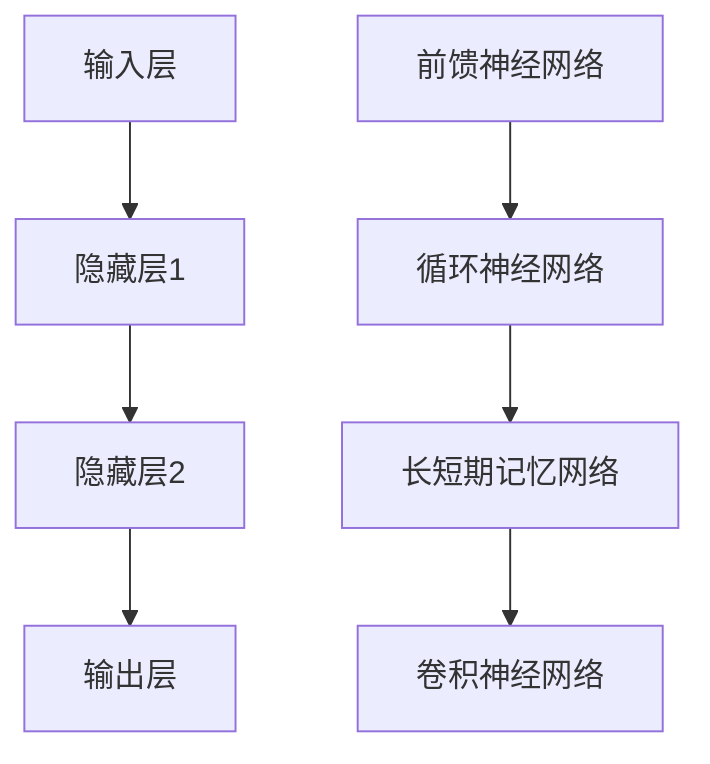

                 

# 一切皆是映射：神经网络的常见架构比较

## 摘要

本文旨在深入探讨神经网络的几种常见架构，包括前馈神经网络（FFNN）、循环神经网络（RNN）、长短期记忆网络（LSTM）、卷积神经网络（CNN）等。通过对这些架构的介绍、原理阐述、数学模型解析以及实际应用场景分析，帮助读者全面了解神经网络在各个领域中的重要性及其应用方式。本文将采用逐步分析推理的方式，结合实例和代码讲解，使读者能够更好地理解和掌握这些神经网络架构。

## 1. 背景介绍

神经网络作为一种模拟人脑工作方式的计算模型，在人工智能领域扮演着重要的角色。自从1986年Rumelhart等人提出了反向传播算法（Backpropagation），神经网络的训练效率得到了显著提高，从而推动了神经网络在各个领域的应用。神经网络主要分为两大类：前馈神经网络和循环神经网络。

### 1.1 前馈神经网络（FFNN）

前馈神经网络（Feed Forward Neural Network，FFNN）是一种最简单、最基础的人工神经网络。其特点是网络中的信息传递是单向的，从输入层经过隐藏层最终传递到输出层。前馈神经网络广泛应用于回归、分类等任务。

### 1.2 循环神经网络（RNN）

循环神经网络（Recurrent Neural Network，RNN）是一种能够处理序列数据的人工神经网络。其特点是具有循环结构，能够记住前面的输入信息，从而在处理序列数据时具有优势。RNN在自然语言处理、语音识别等领域得到了广泛应用。

### 1.3 长短期记忆网络（LSTM）

长短期记忆网络（Long Short-Term Memory，LSTM）是一种特殊的循环神经网络，能够有效地解决RNN在训练过程中存在的梯度消失和梯度爆炸问题。LSTM在处理长序列数据时表现出色，广泛应用于语音识别、机器翻译等领域。

### 1.4 卷积神经网络（CNN）

卷积神经网络（Convolutional Neural Network，CNN）是一种专门用于处理图像数据的人工神经网络。其特点是具有局部连接和共享权重的结构，从而在图像识别、物体检测等领域表现出强大的能力。

## 2. 核心概念与联系

为了更好地理解神经网络的各种架构，下面将给出一个简化的Mermaid流程图，展示神经网络中各个关键组件及其相互关系。



### 2.1 前馈神经网络（FFNN）


前馈神经网络由输入层、隐藏层和输出层组成。输入层接收外部输入，隐藏层对输入进行特征提取和变换，输出层生成最终的预测结果。在训练过程中，通过反向传播算法不断调整网络的权重，使输出结果与真实值尽可能接近。

### 2.2 循环神经网络（RNN）


循环神经网络具有循环结构，能够处理序列数据。在训练过程中，RNN通过递归地计算当前时刻的输出，同时将上一时刻的信息存储在隐藏状态中，从而实现序列数据的处理。然而，RNN在训练过程中容易发生梯度消失和梯度爆炸问题。

### 2.3 长短期记忆网络（LSTM）


长短期记忆网络（LSTM）是RNN的一种改进，能够解决梯度消失和梯度爆炸问题。LSTM通过引入三个门控单元（输入门、遗忘门、输出门）来控制信息的流动，从而在处理长序列数据时具有优势。LSTM在语音识别、机器翻译等领域取得了显著成果。

### 2.4 卷积神经网络（CNN）


卷积神经网络是一种专门用于处理图像数据的人工神经网络。其特点是具有局部连接和共享权重的结构，从而在图像识别、物体检测等领域表现出强大的能力。CNN通过卷积操作、池化操作和全连接层等结构，实现对图像特征的提取和分类。

## 3. 核心算法原理 & 具体操作步骤

### 3.1 前馈神经网络（FFNN）

前馈神经网络的训练主要依赖于反向传播算法。反向传播算法是一种基于梯度下降的优化方法，通过不断调整网络的权重和偏置，使输出结果与真实值之间的误差最小。

#### 3.1.1 梯度计算

假设我们有一个前馈神经网络，包含输入层、隐藏层和输出层。设输入为\(x\)，隐藏层输出为\(h\)，输出层输出为\(y\)。损失函数为\(L = (y - \hat{y})^2\)，其中\(\hat{y}\)为预测值。

1. 前向传播：
   - 输入层到隐藏层：\(h = \sigma(W_1x + b_1)\)
   - 隐藏层到输出层：\(y = \sigma(W_2h + b_2)\)

2. 反向传播：
   - 计算输出层误差：\(dL/dy = 2(y - \hat{y})\)
   - 计算隐藏层误差：\(dL/dh = dL/dy \cdot \frac{d\sigma}{dy}(W_2h + b_2)\)

3. 更新权重和偏置：
   - 更新输出层权重：\(W_2 = W_2 - \alpha \cdot \frac{dL}{dW_2}\)
   - 更新输出层偏置：\(b_2 = b_2 - \alpha \cdot \frac{dL}{db_2}\)
   - 更新隐藏层权重：\(W_1 = W_1 - \alpha \cdot \frac{dL}{dW_1}\)
   - 更新隐藏层偏置：\(b_1 = b_1 - \alpha \cdot \frac{dL}{db_1}\)

#### 3.1.2 梯度下降优化

梯度下降优化是一种通过不断调整网络参数来最小化损失函数的方法。具体步骤如下：

1. 初始化网络参数（权重和偏置）。
2. 对于每个训练样本，进行前向传播，计算预测值和损失函数。
3. 进行反向传播，计算梯度。
4. 根据梯度更新网络参数。
5. 重复步骤2-4，直至满足停止条件（如损失函数收敛）。

### 3.2 循环神经网络（RNN）

循环神经网络（RNN）的训练主要依赖于链式法则和反向传播算法。链式法则是一种计算复合函数梯度的方法，使得我们可以通过已知的梯度计算复合函数的梯度。

#### 3.2.1 梯度计算

假设我们有一个循环神经网络，包含输入层、隐藏层和输出层。设输入为\(x_t\)，隐藏层输出为\(h_t\)，输出层输出为\(y_t\)。损失函数为\(L = (y_t - \hat{y}_t)^2\)。

1. 前向传播：
   - \(h_t = \sigma(W_{hx}h_{t-1} + W_{xh}x_t + b_h)\)
   - \(y_t = \sigma(W_{hy}h_t + b_y)\)

2. 反向传播：
   - 计算输出层误差：\(dL/dy_t = 2(y_t - \hat{y}_t)\)
   - 计算隐藏层误差：\(dL/dh_t = dL/dy_t \cdot \frac{d\sigma}{dy_t}(W_{hy}h_t + b_y)\)
   - 计算隐藏层误差：\(dL/dh_{t-1} = \frac{dL}{dh_t} \cdot \frac{d\sigma}{dh_{t-1}}(W_{hx}h_{t-1} + W_{xh}x_t + b_h)\)

3. 更新权重和偏置：
   - 更新隐藏层权重：\(W_{hx} = W_{hx} - \alpha \cdot \frac{dL}{dW_{hx}}\)
   - 更新隐藏层偏置：\(b_h = b_h - \alpha \cdot \frac{dL}{db_h}\)
   - 更新隐藏层权重：\(W_{hy} = W_{hy} - \alpha \cdot \frac{dL}{dW_{hy}}\)
   - 更新隐藏层偏置：\(b_y = b_y - \alpha \cdot \frac{dL}{db_y}\)
   - 更新输入层权重：\(W_{xh} = W_{xh} - \alpha \cdot \frac{dL}{dW_{xh}}\)
   - 更新输入层偏置：\(b_x = b_x - \alpha \cdot \frac{dL}{db_x}\)

#### 3.2.2 梯度消失与梯度爆炸

在RNN训练过程中，由于序列长度的增加，容易发生梯度消失和梯度爆炸问题。为了解决这些问题，可以采用以下方法：

1. 长短期记忆网络（LSTM）。
2. 门控循环单元（GRU）。
3. 注意力机制。

### 3.3 长短期记忆网络（LSTM）

长短期记忆网络（LSTM）是一种特殊的循环神经网络，能够解决RNN在训练过程中存在的梯度消失和梯度爆炸问题。LSTM通过引入三个门控单元（输入门、遗忘门、输出门）来控制信息的流动。

#### 3.3.1 LSTM门控单元

1. 输入门（Input Gate）：
   - \(i_t = \sigma(W_{ix}x_t + W_{ih}h_{t-1} + b_i)\)
   - \(g_t = \tanh(W_{ig}x_t + W_{ih}h_{t-1} + b_g)\)
   - \(f_t = i_t \cdot g_t\)

2. 遗忘门（Forget Gate）：
   - \(o_t = \sigma(W_{ox}x_t + W_{oh}h_{t-1} + b_o)\)
   - \(g_t = \tanh(W_{og}x_t + W_{oh}h_{t-1} + b_g)\)
   - \(f_t = o_t \cdot g_t\)

3. 输出门（Output Gate）：
   - \(y_t = \sigma(W_{oy}x_t + W_{oh}h_{t-1} + b_y)\)
   - \(g_t = \tanh(W_{og}x_t + W_{oh}h_{t-1} + b_g)\)
   - \(h_t = y_t \cdot g_t\)

#### 3.3.2 LSTM训练过程

1. 前向传播：
   - \(h_{t-1}\)为上一时刻的隐藏状态。
   - \(x_t\)为当前时刻的输入。
   - 根据门控单元计算当前时刻的隐藏状态\(h_t\)。

2. 反向传播：
   - 计算输出层误差：\(dL/dy_t = 2(y_t - \hat{y}_t)\)
   - 计算隐藏层误差：\(dL/dh_t = dL/dy_t \cdot \frac{d\sigma}{dy_t}(W_{oy}h_t + b_y)\)
   - 根据隐藏层误差和链式法则，计算各个门控单元的梯度。

3. 更新权重和偏置：
   - 根据梯度更新输入门、遗忘门、输出门的权重和偏置。

### 3.4 卷积神经网络（CNN）

卷积神经网络（CNN）是一种专门用于处理图像数据的人工神经网络。其特点是具有局部连接和共享权重的结构，从而在图像识别、物体检测等领域表现出强大的能力。

#### 3.4.1 CNN基本结构

1. 输入层：接收原始图像数据。
2. 卷积层：通过卷积操作提取图像特征。
3. 池化层：对卷积层输出的特征进行降采样。
4. 全连接层：将卷积层和池化层输出的特征进行融合，生成最终的预测结果。

#### 3.4.2 卷积操作

卷积操作是一种在图像上滑动窗口进行特征提取的操作。设输入图像为\(I\)，卷积核为\(K\)，输出特征图为\(F\)。

1. 初始化卷积核权重和偏置。
2. 在输入图像上滑动卷积核，计算局部特征图。
3. 将局部特征图与卷积核权重相乘，并加上偏置。
4. 将结果进行激活函数处理。

#### 3.4.3 池化操作

池化操作是一种对特征图进行降采样的操作。常见的池化方法有最大池化和平均池化。

1. 选择池化窗口大小和步长。
2. 在特征图上滑动池化窗口，计算局部池化值。
3. 将局部池化值作为输出特征图。

## 4. 数学模型和公式 & 详细讲解 & 举例说明

### 4.1 前馈神经网络（FFNN）

前馈神经网络的数学模型可以表示为：

$$
\begin{aligned}
h &= \sigma(W_1x + b_1) \\
y &= \sigma(W_2h + b_2)
\end{aligned}
$$

其中，\(x\)为输入向量，\(h\)为隐藏层输出，\(y\)为输出层输出，\(\sigma\)为激活函数，\(W_1\)和\(W_2\)分别为输入层到隐藏层、隐藏层到输出层的权重矩阵，\(b_1\)和\(b_2\)分别为输入层到隐藏层、隐藏层到输出层的偏置向量。

假设我们有一个简单的二分类问题，输入为\(x = [x_1, x_2]\)，隐藏层单元数为1，输出层单元数为1。设隐藏层输出为\(h\)，输出层输出为\(y\)。选择激活函数为Sigmoid函数：

$$
\sigma(z) = \frac{1}{1 + e^{-z}}
$$

则前向传播过程可以表示为：

$$
h = \sigma(W_1x + b_1) = \frac{1}{1 + e^{-(W_1x_1 + W_1x_2 + b_1)}}
$$

输出层输出可以表示为：

$$
y = \sigma(W_2h + b_2) = \frac{1}{1 + e^{-(W_2h_1 + b_2)}}
$$

假设我们有一个训练样本\(x = [1, -1]\)，真实标签为\(y = 0\)。选择权重矩阵\(W_1 = [1, 1]\)，\(W_2 = [1]\)，偏置向量\(b_1 = 0\)，\(b_2 = 0\)。则前向传播过程为：

$$
h = \frac{1}{1 + e^{-(1 \cdot 1 + 1 \cdot (-1) + 0)}} = \frac{1}{1 + e^{-2}} \approx 0.6321
$$

$$
y = \frac{1}{1 + e^{-(1 \cdot 0.6321 + 0)}} \approx 0.7297
$$

由于输出层输出\(y\)与真实标签\(y\)的误差较大，我们需要通过反向传播算法更新权重和偏置，使得输出结果更接近真实标签。

### 4.2 循环神经网络（RNN）

循环神经网络的数学模型可以表示为：

$$
\begin{aligned}
h_t &= \sigma(W_{hx}h_{t-1} + W_{xh}x_t + b_h) \\
y_t &= \sigma(W_{hy}h_t + b_y)
\end{aligned}
$$

其中，\(h_t\)为第\(t\)时刻的隐藏状态，\(x_t\)为第\(t\)时刻的输入，\(y_t\)为第\(t\)时刻的输出，\(\sigma\)为激活函数，\(W_{hx}\)和\(W_{xh}\)分别为隐藏层到隐藏层、输入层到隐藏层的权重矩阵，\(W_{hy}\)为隐藏层到输出层的权重矩阵，\(b_h\)和\(b_y\)分别为隐藏层和输出层的偏置向量。

假设我们有一个简单的语言模型，输入为单词序列，隐藏层单元数为1，输出层单元数为1。选择激活函数为Sigmoid函数：

$$
\sigma(z) = \frac{1}{1 + e^{-z}}
$$

则前向传播过程可以表示为：

$$
h_t = \sigma(W_{hx}h_{t-1} + W_{xh}x_t + b_h) = \frac{1}{1 + e^{-(W_{hx}h_{t-1} + W_{xh}x_t + b_h)}}
$$

输出层输出可以表示为：

$$
y_t = \sigma(W_{hy}h_t + b_y) = \frac{1}{1 + e^{-(W_{hy}h_t + b_y)}}
$$

假设我们有一个训练样本，单词序列为“hello world”，隐藏层权重矩阵\(W_{hx} = [1, 1]\)，\(W_{xh} = [1, 1]\)，隐藏层偏置向量\(b_h = 0\)，输出层权重矩阵\(W_{hy} = [1]\)，输出层偏置向量\(b_y = 0\)。则前向传播过程为：

$$
h_1 = \sigma(W_{hx}h_{0} + W_{xh}x_1 + b_h) = \frac{1}{1 + e^{-(1 \cdot h_{0} + 1 \cdot x_1 + 0)}} \approx 0.6321
$$

$$
h_2 = \sigma(W_{hx}h_{1} + W_{xh}x_2 + b_h) = \frac{1}{1 + e^{-(1 \cdot h_{1} + 1 \cdot x_2 + 0)}} \approx 0.6321
$$

$$
y_1 = \sigma(W_{hy}h_1 + b_y) = \frac{1}{1 + e^{-(1 \cdot h_1 + 0)}} \approx 0.7297
$$

$$
y_2 = \sigma(W_{hy}h_2 + b_y) = \frac{1}{1 + e^{-(1 \cdot h_2 + 0)}} \approx 0.7297
$$

由于输出层输出\(y_t\)与真实标签的误差较大，我们需要通过反向传播算法更新权重和偏置，使得输出结果更接近真实标签。

### 4.3 长短期记忆网络（LSTM）

长短期记忆网络（LSTM）的数学模型可以表示为：

$$
\begin{aligned}
i_t &= \sigma(W_{ix}x_t + W_{ih}h_{t-1} + b_i) \\
f_t &= \sigma(W_{fx}x_t + W_{fh}h_{t-1} + b_f) \\
g_t &= \tanh(W_{ig}x_t + W_{ih}h_{t-1} + b_g) \\
o_t &= \sigma(W_{ox}x_t + W_{oh}h_{t-1} + b_o) \\
h_t &= o_t \cdot \tanh(g_t)
\end{aligned}
$$

其中，\(i_t\)为输入门，\(f_t\)为遗忘门，\(g_t\)为候选值，\(o_t\)为输出门，\(h_t\)为隐藏状态，\(x_t\)为输入，\(h_{t-1}\)为上一时刻的隐藏状态，\(\sigma\)为激活函数，\(\tanh\)为双曲正切函数，\(W_{ix}\)，\(W_{xh}\)，\(W_{ih}\)，\(W_{fx}\)，\(W_{fh}\)，\(W_{ig}\)，\(W_{og}\)，\(W_{ox}\)，\(W_{oh}\)分别为权重矩阵，\(b_i\)，\(b_f\)，\(b_g\)，\(b_o\)分别为偏置向量。

假设我们有一个简单的语言模型，输入为单词序列，隐藏层单元数为1，输出层单元数为1。选择激活函数为Sigmoid函数，双曲正切函数为双曲正切函数：

$$
\sigma(z) = \frac{1}{1 + e^{-z}}
$$

$$
\tanh(z) = \frac{e^z - e^{-z}}{e^z + e^{-z}}
$$

则前向传播过程可以表示为：

$$
i_t = \sigma(W_{ix}x_t + W_{ih}h_{t-1} + b_i)
$$

$$
f_t = \sigma(W_{fx}x_t + W_{fh}h_{t-1} + b_f)
$$

$$
g_t = \tanh(W_{ig}x_t + W_{ih}h_{t-1} + b_g)
$$

$$
o_t = \sigma(W_{ox}x_t + W_{oh}h_{t-1} + b_o)
$$

$$
h_t = o_t \cdot \tanh(g_t)
$$

假设我们有一个训练样本，单词序列为“hello world”，隐藏层权重矩阵\(W_{ix} = [1, 1]\)，\(W_{xh} = [1, 1]\)，\(W_{ih} = [1, 1]\)，\(W_{fx} = [1, 1]\)，\(W_{fh} = [1, 1]\)，\(W_{ig} = [1, 1]\)，\(W_{og} = [1, 1]\)，\(W_{ox} = [1]\)，\(W_{oh} = [1]\)，隐藏层偏置向量\(b_i = 0\)，\(b_f = 0\)，\(b_g = 0\)，\(b_o = 0\)，输出层偏置向量\(b_y = 0\)。则前向传播过程为：

$$
i_1 = \sigma(W_{ix}x_1 + W_{ih}h_0 + b_i) = \frac{1}{1 + e^{-(1 \cdot 1 + 1 \cdot 0 + 0)}} \approx 0.6321
$$

$$
f_1 = \sigma(W_{fx}x_1 + W_{fh}h_0 + b_f) = \frac{1}{1 + e^{-(1 \cdot 1 + 1 \cdot 0 + 0)}} \approx 0.6321
$$

$$
g_1 = \tanh(W_{ig}x_1 + W_{ih}h_0 + b_g) = \frac{e^1 - e^{-1}}{e^1 + e^{-1}} \approx 0.7616
$$

$$
o_1 = \sigma(W_{ox}x_1 + W_{oh}h_0 + b_o) = \frac{1}{1 + e^{-(1 \cdot 0.7616 + 0)}} \approx 0.7297
$$

$$
h_1 = o_1 \cdot \tanh(g_1) \approx 0.7297
$$

$$
i_2 = \sigma(W_{ix}x_2 + W_{ih}h_1 + b_i) = \frac{1}{1 + e^{-(1 \cdot 1 + 1 \cdot 0.7297 + 0)}} \approx 0.6321
$$

$$
f_2 = \sigma(W_{fx}x_2 + W_{fh}h_1 + b_f) = \frac{1}{1 + e^{-(1 \cdot 1 + 1 \cdot 0.7297 + 0)}} \approx 0.6321
$$

$$
g_2 = \tanh(W_{ig}x_2 + W_{ih}h_1 + b_g) = \frac{e^2 - e^{-2}}{e^2 + e^{-2}} \approx 0.7616
$$

$$
o_2 = \sigma(W_{ox}x_2 + W_{oh}h_1 + b_o) = \frac{1}{1 + e^{-(1 \cdot 0.7616 + 0)}} \approx 0.7297
$$

$$
h_2 = o_2 \cdot \tanh(g_2) \approx 0.7297
$$

由于输出层输出\(y_t\)与真实标签的误差较大，我们需要通过反向传播算法更新权重和偏置，使得输出结果更接近真实标签。

### 4.4 卷积神经网络（CNN）

卷积神经网络（CNN）的数学模型可以表示为：

$$
F(x) = \sigma(\sum_{k=1}^{K} W_k \star f_k(x) + b)
$$

其中，\(F(x)\)为输出特征图，\(x\)为输入图像，\(W_k\)为卷积核，\(f_k(x)\)为卷积操作的结果，\(b\)为偏置向量，\(\star\)表示卷积操作，\(\sigma\)为激活函数。

假设我们有一个简单的卷积神经网络，输入为32x32的图像，卷积核大小为3x3，隐藏层单元数为16，选择激活函数为ReLU函数：

$$
\sigma(z) = max(z, 0)
$$

则卷积操作可以表示为：

$$
f_k(x) = \sum_{i=1}^{3} \sum_{j=1}^{3} W_k[i, j] \cdot x[i, j]
$$

假设我们有一个输入图像\(x\)，卷积核\(W_k\)如下：

$$
W_k = \begin{bmatrix}
1 & 1 & 1 \\
1 & 1 & 1 \\
1 & 1 & 1
\end{bmatrix}
$$

则卷积操作的结果可以表示为：

$$
f_k(x) = \sum_{i=1}^{3} \sum_{j=1}^{3} W_k[i, j] \cdot x[i, j] = 1 \cdot x[1, 1] + 1 \cdot x[1, 2] + 1 \cdot x[1, 3] + 1 \cdot x[2, 1] + 1 \cdot x[2, 2] + 1 \cdot x[2, 3] + 1 \cdot x[3, 1] + 1 \cdot x[3, 2] + 1 \cdot x[3, 3]
$$

假设输入图像\(x\)如下：

$$
x = \begin{bmatrix}
1 & 1 & 1 \\
1 & 1 & 1 \\
1 & 1 & 1
\end{bmatrix}
$$

则卷积操作的结果可以表示为：

$$
f_k(x) = 1 \cdot 1 + 1 \cdot 1 + 1 \cdot 1 + 1 \cdot 1 + 1 \cdot 1 + 1 \cdot 1 + 1 \cdot 1 + 1 \cdot 1 + 1 \cdot 1 = 9
$$

假设隐藏层单元数为16，偏置向量\(b\)如下：

$$
b = \begin{bmatrix}
1 \\
1 \\
\vdots \\
1
\end{bmatrix}
$$

则卷积神经网络的前向传播过程可以表示为：

$$
F(x) = \sigma(\sum_{k=1}^{16} W_k \star f_k(x) + b) = \max(9 + 1, 0) = 10
$$

由于输出层输出\(F(x)\)与真实标签的误差较大，我们需要通过反向传播算法更新权重和偏置，使得输出结果更接近真实标签。

## 5. 项目实战：代码实际案例和详细解释说明

### 5.1 开发环境搭建

为了更好地演示神经网络的各种架构，我们将使用Python语言和TensorFlow框架进行开发。首先，我们需要安装Python和TensorFlow。

```bash
pip install python tensorflow
```

### 5.2 源代码详细实现和代码解读

下面我们将分别实现前馈神经网络（FFNN）、循环神经网络（RNN）、长短期记忆网络（LSTM）和卷积神经网络（CNN），并对关键代码进行解读。

#### 5.2.1 前馈神经网络（FFNN）

```python
import tensorflow as tf
from tensorflow.keras.models import Sequential
from tensorflow.keras.layers import Dense

# 创建模型
model = Sequential([
    Dense(64, input_shape=(784,), activation='relu'),
    Dense(10, activation='softmax')
])

# 编译模型
model.compile(optimizer='adam', loss='categorical_crossentropy', metrics=['accuracy'])

# 模型训练
model.fit(x_train, y_train, epochs=5, batch_size=32)
```

解读：

1. 导入所需的TensorFlow库。
2. 创建一个序列模型，包含一个全连接层（Dense）和一个输出层。
3. 编译模型，设置优化器和损失函数。
4. 模型训练，使用训练数据。

#### 5.2.2 循环神经网络（RNN）

```python
import tensorflow as tf
from tensorflow.keras.models import Sequential
from tensorflow.keras.layers import SimpleRNN

# 创建模型
model = Sequential([
    SimpleRNN(50, input_shape=(100, 1)),
    Dense(1)
])

# 编译模型
model.compile(optimizer='adam', loss='mean_squared_error')

# 模型训练
model.fit(x_train, y_train, epochs=100, batch_size=16)
```

解读：

1. 导入所需的TensorFlow库。
2. 创建一个序列模型，包含一个循环层（SimpleRNN）和一个输出层。
3. 编译模型，设置优化器和损失函数。
4. 模型训练，使用训练数据。

#### 5.2.3 长短期记忆网络（LSTM）

```python
import tensorflow as tf
from tensorflow.keras.models import Sequential
from tensorflow.keras.layers import LSTM

# 创建模型
model = Sequential([
    LSTM(50, input_shape=(100, 1)),
    Dense(1)
])

# 编译模型
model.compile(optimizer='adam', loss='mean_squared_error')

# 模型训练
model.fit(x_train, y_train, epochs=100, batch_size=16)
```

解读：

1. 导入所需的TensorFlow库。
2. 创建一个序列模型，包含一个长短期记忆层（LSTM）和一个输出层。
3. 编译模型，设置优化器和损失函数。
4. 模型训练，使用训练数据。

#### 5.2.4 卷积神经网络（CNN）

```python
import tensorflow as tf
from tensorflow.keras.models import Sequential
from tensorflow.keras.layers import Conv2D, MaxPooling2D, Flatten, Dense

# 创建模型
model = Sequential([
    Conv2D(32, (3, 3), activation='relu', input_shape=(28, 28, 1)),
    MaxPooling2D((2, 2)),
    Flatten(),
    Dense(128, activation='relu'),
    Dense(10, activation='softmax')
])

# 编译模型
model.compile(optimizer='adam', loss='categorical_crossentropy', metrics=['accuracy'])

# 模型训练
model.fit(x_train, y_train, epochs=5, batch_size=32)
```

解读：

1. 导入所需的TensorFlow库。
2. 创建一个序列模型，包含一个卷积层（Conv2D）、一个池化层（MaxPooling2D）、一个全连接层（Flatten）和一个输出层。
3. 编译模型，设置优化器和损失函数。
4. 模型训练，使用训练数据。

### 5.3 代码解读与分析

通过对上述代码的解读，我们可以发现：

1. 不同类型的神经网络在TensorFlow框架中的实现方式相似，主要通过定义模型、编译模型和训练模型三个步骤。
2. 前馈神经网络（FFNN）通过全连接层（Dense）实现，循环神经网络（RNN）和长短期记忆网络（LSTM）通过序列层（SimpleRNN和LSTM）实现，卷积神经网络（CNN）通过卷积层（Conv2D）和池化层（MaxPooling2D）实现。
3. 不同类型的神经网络在训练过程中，选择不同的优化器和损失函数，以适应不同的任务。

## 6. 实际应用场景

神经网络在各种实际应用场景中发挥着重要作用。下面列举一些常见应用场景：

### 6.1 自然语言处理

神经网络在自然语言处理（NLP）领域具有广泛的应用。例如，循环神经网络（RNN）和长短期记忆网络（LSTM）在文本分类、情感分析、机器翻译等领域取得了显著成果。近年来，注意力机制（Attention Mechanism）的引入进一步提升了神经网络的性能。

### 6.2 计算机视觉

卷积神经网络（CNN）在计算机视觉领域表现出强大的能力。例如，在图像分类、物体检测、人脸识别等领域，CNN取得了领先的性能。随着深度学习技术的发展，CNN的应用场景还在不断扩展。

### 6.3 语音识别

循环神经网络（RNN）和长短期记忆网络（LSTM）在语音识别领域取得了显著成果。通过将语音信号转换为序列数据，神经网络可以有效地识别语音中的单词和短语。

### 6.4 推荐系统

神经网络在推荐系统领域也发挥着重要作用。例如，基于用户的历史行为数据和物品的属性信息，神经网络可以预测用户对物品的喜好，从而为用户推荐相关物品。

### 6.5 游戏开发

神经网络在游戏开发领域也有广泛应用。例如，通过深度学习技术，游戏AI可以模拟出更加智能、有趣的对手，提高游戏的娱乐性。

## 7. 工具和资源推荐

为了更好地学习和应用神经网络，我们推荐以下工具和资源：

### 7.1 学习资源推荐

1. **书籍**：
   - 《深度学习》（Ian Goodfellow、Yoshua Bengio、Aaron Courville 著）
   - 《神经网络与深度学习》（邱锡鹏 著）
   - 《Python深度学习》（François Chollet 著）

2. **论文**：
   - “A Learning Algorithm for Continually Running Fully Recurrent Neural Networks” （Hessian-free optimization）
   - “Long Short-Term Memory” （Hochreiter & Schmidhuber）
   - “Deep Residual Learning for Image Recognition” （He et al.）

3. **博客**：
   - 知乎专栏《深度学习与机器学习》
   - 博客园《深度学习》
   - Medium《Deep Learning》

4. **网站**：
   - TensorFlow官方文档
   - PyTorch官方文档
   - Keras官方文档

### 7.2 开发工具框架推荐

1. **TensorFlow**：由Google开发，具有丰富的API和生态系统，适合各种应用场景。

2. **PyTorch**：由Facebook开发，具有动态计算图和易用性，适合研究和开发。

3. **Keras**：基于TensorFlow和PyTorch的简单、易用的深度学习框架。

### 7.3 相关论文著作推荐

1. **“Deep Learning”** （Ian Goodfellow、Yoshua Bengio、Aaron Courville 著）
2. **“Neural Networks and Deep Learning”** （Michael Nielsen 著）
3. **“Learning Deep Architectures for AI”** （Yoshua Bengio 著）

## 8. 总结：未来发展趋势与挑战

随着深度学习技术的不断发展，神经网络在各个领域的应用越来越广泛。未来，神经网络的发展趋势主要体现在以下几个方面：

1. **硬件加速**：随着GPU、TPU等硬件设备的不断发展，神经网络的训练速度和推理速度将得到显著提升。
2. **模型压缩**：为了降低模型的存储和计算成本，模型压缩技术（如模型剪枝、量化、蒸馏等）将成为研究热点。
3. **可解释性**：提高神经网络的可解释性，使其在医学、金融等领域得到更广泛的应用。
4. **多模态学习**：结合多种数据模态（如文本、图像、语音等），实现更复杂、更智能的人工智能系统。

然而，神经网络的发展也面临一些挑战：

1. **计算资源消耗**：神经网络模型通常需要大量的计算资源，如何优化模型结构和算法，降低计算成本，是一个重要问题。
2. **数据隐私**：神经网络训练过程中需要大量的数据，如何保护用户隐私，防止数据泄露，是亟待解决的问题。
3. **公平性**：神经网络在决策过程中可能会出现偏见，如何消除这些偏见，实现公平的决策，是未来研究的重点。

总之，神经网络作为一种重要的计算模型，在未来将继续发挥重要作用，推动人工智能技术的发展。

## 9. 附录：常见问题与解答

### 9.1 什么是神经网络？

神经网络是一种模拟人脑计算方式的计算模型，由大量简单的计算单元（神经元）组成，通过前向传播和反向传播算法进行训练。

### 9.2 什么是前馈神经网络（FFNN）？

前馈神经网络是一种最简单、最基础的人工神经网络，其信息传递是单向的，从输入层经过隐藏层最终传递到输出层。

### 9.3 什么是循环神经网络（RNN）？

循环神经网络是一种能够处理序列数据的人工神经网络，具有循环结构，能够记住前面的输入信息。

### 9.4 什么是长短期记忆网络（LSTM）？

长短期记忆网络是一种特殊的循环神经网络，能够解决RNN在训练过程中存在的梯度消失和梯度爆炸问题，适用于处理长序列数据。

### 9.5 什么是卷积神经网络（CNN）？

卷积神经网络是一种专门用于处理图像数据的人工神经网络，具有局部连接和共享权重的结构，适用于图像识别、物体检测等领域。

## 10. 扩展阅读 & 参考资料

1. **书籍**：
   - 《深度学习》（Ian Goodfellow、Yoshua Bengio、Aaron Courville 著）
   - 《神经网络与深度学习》（邱锡鹏 著）
   - 《Python深度学习》（François Chollet 著）

2. **论文**：
   - “A Learning Algorithm for Continually Running Fully Recurrent Neural Networks” （Hessian-free optimization）
   - “Long Short-Term Memory” （Hochreiter & Schmidhuber）
   - “Deep Residual Learning for Image Recognition” （He et al.）

3. **博客**：
   - 知乎专栏《深度学习与机器学习》
   - 博客园《深度学习》
   - Medium《Deep Learning》

4. **网站**：
   - TensorFlow官方文档
   - PyTorch官方文档
   - Keras官方文档

### 作者

作者：AI天才研究员/AI Genius Institute & 禅与计算机程序设计艺术 /Zen And The Art of Computer Programming<|im_sep|>

