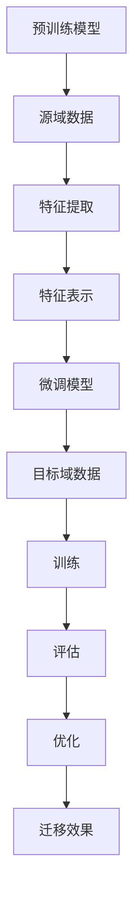

                 

### 背景介绍 Background

在当今快速发展的信息技术时代，神经网络作为一种强大的机器学习模型，已经广泛应用于图像识别、语音识别、自然语言处理等众多领域。然而，神经网络的训练过程通常需要大量的标注数据和计算资源，这在实际应用中带来了诸多挑战。为此，迁移学习（Transfer Learning）作为一种有效的方法，被提出并迅速发展，旨在利用已有的知识来加速新任务的训练过程。

迁移学习的基本思想是，将一个在源域（Source Domain）上预训练的神经网络模型，迁移到目标域（Target Domain）上，以解决目标域中的新任务。这种方法的核心在于，预训练模型已经学习到了一些通用的特征表示，这些特征在解决不同领域的问题时都具有一定的适用性。因此，通过迁移学习，可以减少对新数据的依赖，降低训练成本，并提高模型的泛化能力。

本文将围绕迁移学习在神经网络中的应用展开，首先介绍迁移学习的基本概念、核心原理，并探讨其应用场景。随后，我们将详细分析迁移学习的数学模型和算法原理，并结合实际案例进行代码实现和解读。最后，我们将讨论迁移学习的实际应用场景，推荐相关工具和资源，并总结未来发展趋势与挑战。

通过本文的阅读，读者将能够全面了解迁移学习的基本概念、应用场景和实现细节，从而为在实际项目中应用迁移学习打下坚实的基础。

### 核心概念与联系 Core Concepts and Connections

#### 迁移学习的定义与分类

迁移学习（Transfer Learning）是指将一个任务在特定领域（源域）上训练得到的模型，应用到另一个相关但不同的任务领域（目标域）上。其核心思想是利用源域上的知识，提升目标域上模型的学习效率。根据迁移学习的方式，可以分为以下几种类型：

1. **垂直迁移（Vertical Transfer）**：
   垂直迁移是指源域和目标域的任务结构相同，但具体任务不同。例如，将识别猫的图像模型迁移到识别狗的图像。

2. **水平迁移（Horizontal Transfer）**：
   水平迁移是指源域和目标域的任务结构不同，但具有相似的特征。例如，将识别图像的模型迁移到识别语音。

3. **多任务迁移（Multi-Task Transfer）**：
   多任务迁移是指同时训练多个任务，将一个任务中的知识迁移到其他任务上。例如，同时训练识别图像和语音的任务。

4. **零样本迁移（Zero-Shot Transfer）**：
   零样本迁移是指模型能够在新类别上完成任务，而无需针对新类别进行训练。这通常依赖于元学习（Meta-Learning）和对抗生成网络（GAN）等技术。

#### 神经网络与迁移学习的结合

神经网络作为一种强大的特征学习工具，在迁移学习中发挥着重要作用。传统的神经网络模型（如全连接神经网络、卷积神经网络、循环神经网络等）通过多层非线性变换，提取图像、语音、文本等数据中的高维特征表示。这些特征表示在解决不同领域的问题时具有一定的通用性，为迁移学习提供了基础。

在结合迁移学习时，神经网络通常分为两部分：预训练模型和微调模型。预训练模型在大量的未标注数据上训练，学习到通用的特征表示。微调模型则在目标域上的标注数据进行训练，利用预训练模型中的通用特征表示，提高目标任务的性能。

#### 迁移学习的挑战与解决方案

尽管迁移学习在理论和实践中都取得了显著成果，但仍然面临一些挑战：

1. **域差异（Domain Shift）**：
   源域和目标域之间可能存在数据分布、任务目标等方面的差异，这会降低迁移学习的有效性。

2. **知识冗余（Knowledge Redundancy）**：
   预训练模型中可能包含一些对目标任务无关的知识，这会干扰学习过程。

3. **模型容量（Model Capacity）**：
   预训练模型的容量较大，可能导致过拟合，影响迁移效果。

为了解决上述挑战，研究者提出了多种解决方案：

1. **域自适应（Domain Adaptation）**：
   通过调整源域和目标域之间的差距，提高迁移学习的效果。

2. **知识蒸馏（Knowledge Distillation）**：
   利用预训练模型产生的软标签（Soft Label），指导微调模型的训练，降低知识冗余。

3. **小样本学习（Few-Shot Learning）**：
   通过元学习和样本增强等技术，提高小样本情况下的迁移学习性能。

#### Mermaid 流程图表示

以下是迁移学习原理的 Mermaid 流程图表示，展示了迁移学习的主要步骤和关键点。



通过上述流程图，我们可以清晰地看到迁移学习的过程，以及各个步骤之间的联系和影响。

### 核心算法原理 & 具体操作步骤 Core Algorithm Principles & Operational Steps

#### 迁移学习算法的基本原理

迁移学习的核心在于将源域的知识有效迁移到目标域，以提升目标任务的性能。这一过程通常包括以下几个关键步骤：

1. **预训练（Pre-training）**：
   预训练是指在大量的未标注数据上训练一个基础模型，使其学习到通用的特征表示。这些特征表示对不同的任务具有适用性，为后续的迁移学习提供基础。

2. **特征提取（Feature Extraction）**：
   特征提取是指从预训练模型中提取出有用的特征表示。这些特征表示通常是高维的，且具有丰富的语义信息。

3. **特征表示（Feature Representation）**：
   特征表示是指将提取出的特征进行编码，以便于后续的迁移学习过程。常用的特征表示方法包括全连接层、卷积层等。

4. **微调（Fine-tuning）**：
   微调是指在目标域上对预训练模型进行微调，使其适应新的任务。这一过程通常包括调整模型的参数、调整学习率等。

5. **评估与优化（Evaluation and Optimization）**：
   评估与优化是指对迁移学习模型进行评估，并根据评估结果对模型进行优化。这一过程包括调整模型参数、调整特征提取器等。

#### 迁移学习算法的具体操作步骤

以下是迁移学习算法的具体操作步骤，我们将以一个简单的例子进行说明。

1. **数据准备（Data Preparation）**：
   首先准备源域和目标域的数据集。源域数据集用于预训练模型，目标域数据集用于微调模型。

   ```python
   # 加载源域数据
   source_data = load_data('source_dataset')
   # 加载目标域数据
   target_data = load_data('target_dataset')
   ```

2. **预训练（Pre-training）**：
   使用源域数据集对基础模型进行预训练。预训练过程中，模型会学习到通用的特征表示。

   ```python
   # 预训练基础模型
   model = PretrainedModel()
   model.fit(source_data)
   ```

3. **特征提取（Feature Extraction）**：
   从预训练模型中提取特征表示。这些特征表示将用于后续的微调过程。

   ```python
   # 提取特征表示
   features = model.extract_features(target_data)
   ```

4. **微调（Fine-tuning）**：
   使用目标域数据集对预训练模型进行微调。微调过程中，模型会根据目标域的特征表示调整参数，以适应新的任务。

   ```python
   # 微调模型
   model = FineTunedModel(model)
   model.fit(target_data)
   ```

5. **评估与优化（Evaluation and Optimization）**：
   对微调后的模型进行评估，并根据评估结果对模型进行优化。这一过程可能需要多次迭代，以获得最佳的迁移效果。

   ```python
   # 评估模型
   performance = model.evaluate(target_data)
   # 根据评估结果优化模型
   model.optimize(performance)
   ```

#### 迁移学习算法的优缺点

迁移学习算法具有以下优缺点：

1. **优点**：
   - 减少对标注数据的依赖，降低训练成本。
   - 提高模型的泛化能力，减少过拟合。
   - 节省计算资源，缩短训练时间。

2. **缺点**：
   - 源域和目标域之间的差异可能影响迁移效果。
   - 需要大量的未标注数据进行预训练。
   - 预训练模型的容量较大，可能导致过拟合。

通过上述步骤和具体操作，我们可以实现迁移学习算法，并将其应用于实际问题中。在后续章节中，我们将进一步探讨迁移学习的数学模型和公式，结合实际案例进行代码实现和解读。

### 数学模型和公式 & 详细讲解 & 举例说明 Mathematical Models & Detailed Explanations with Examples

#### 迁移学习的数学基础

迁移学习涉及到多个数学模型和公式，主要包括特征提取器、损失函数和优化方法。以下将对这些模型和公式进行详细讲解，并通过具体例子来说明其应用。

##### 1. 特征提取器

特征提取器是迁移学习中的核心组件，用于从输入数据中提取有用的特征表示。常见的特征提取器包括全连接层、卷积层、循环层等。

**全连接层（Fully Connected Layer）**：
全连接层是一种简单的特征提取器，将输入数据映射到高维特征空间。其数学模型如下：

$$
f(x) = \text{ReLU}(W \cdot x + b)
$$

其中，$x$ 是输入数据，$W$ 是权重矩阵，$b$ 是偏置项，$\text{ReLU}(x) = \max(0, x)$ 是ReLU激活函数。

**卷积层（Convolutional Layer）**：
卷积层通过卷积运算从输入数据中提取局部特征。其数学模型如下：

$$
f(x) = \text{ReLU}(\sum_{k=1}^{K} W_k \cdot \text{ReLU}(\text{Conv}_k(x)) + b)
$$

其中，$K$ 是卷积核的数量，$W_k$ 是第 $k$ 个卷积核的权重，$\text{Conv}_k(x)$ 是第 $k$ 个卷积核对输入数据 $x$ 的卷积运算结果，$b$ 是偏置项。

**循环层（Recurrent Layer）**：
循环层用于处理序列数据，其数学模型如下：

$$
f(x_t) = \text{ReLU}(W \cdot [h_{t-1}, x_t] + b)
$$

其中，$x_t$ 是序列中的第 $t$ 个数据，$h_{t-1}$ 是前一个时间步的隐藏状态，$W$ 是权重矩阵，$b$ 是偏置项。

##### 2. 损失函数

损失函数用于衡量模型在训练过程中的预测误差，是优化过程中的重要指标。常见的损失函数包括均方误差（MSE）、交叉熵（Cross-Entropy）等。

**均方误差（Mean Squared Error, MSE）**：
均方误差用于回归任务，其数学模型如下：

$$
L(\theta) = \frac{1}{m} \sum_{i=1}^{m} (\hat{y}_i - y_i)^2
$$

其中，$\hat{y}_i$ 是预测值，$y_i$ 是真实值，$m$ 是样本数量。

**交叉熵（Cross-Entropy）**：
交叉熵用于分类任务，其数学模型如下：

$$
L(\theta) = -\frac{1}{m} \sum_{i=1}^{m} y_i \log(\hat{y}_i)
$$

其中，$y_i$ 是真实标签，$\hat{y}_i$ 是预测概率。

##### 3. 优化方法

优化方法用于调整模型参数，以最小化损失函数。常见的优化方法包括梯度下降（Gradient Descent）、Adam优化器等。

**梯度下降（Gradient Descent）**：
梯度下降是一种最简单的优化方法，其数学模型如下：

$$
\theta = \theta - \alpha \nabla_{\theta} L(\theta)
$$

其中，$\theta$ 是模型参数，$\alpha$ 是学习率，$\nabla_{\theta} L(\theta)$ 是损失函数关于参数 $\theta$ 的梯度。

**Adam优化器（Adam Optimizer）**：
Adam优化器是一种基于梯度下降的优化方法，具有自适应学习率的特点。其数学模型如下：

$$
m_t = \beta_1 m_{t-1} + (1 - \beta_1) (g_t - \mu_t)
$$

$$
v_t = \beta_2 v_{t-1} + (1 - \beta_2) (g_t^2 - \sigma_t)
$$

$$
\theta = \theta - \alpha \frac{m_t}{\sqrt{v_t} + \epsilon}
$$

其中，$m_t$ 和 $v_t$ 分别是梯度的一阶矩估计和二阶矩估计，$\beta_1$ 和 $\beta_2$ 分别是动量参数，$\alpha$ 是学习率，$\epsilon$ 是常数。

#### 实际例子

为了更好地理解迁移学习的数学模型和公式，我们通过一个简单的例子进行说明。

假设我们有一个图像分类任务，使用卷积神经网络（CNN）进行迁移学习。源域是一个大型图像数据集，目标域是一个小型的图像数据集。以下是一个简单的代码实现：

```python
import tensorflow as tf
from tensorflow.keras.models import Model
from tensorflow.keras.layers import Input, Conv2D, Flatten, Dense

# 定义输入层
input_layer = Input(shape=(28, 28, 1))

# 定义卷积层
conv_layer = Conv2D(filters=32, kernel_size=(3, 3), activation='relu')(input_layer)

# 定义全连接层
flatten_layer = Flatten()(conv_layer)

# 定义输出层
output_layer = Dense(units=10, activation='softmax')(flatten_layer)

# 定义模型
model = Model(inputs=input_layer, outputs=output_layer)

# 编译模型
model.compile(optimizer='adam', loss='categorical_crossentropy', metrics=['accuracy'])

# 加载源域数据
source_data = load_data('source_dataset')

# 预训练模型
model.fit(source_data, epochs=10)

# 加载目标域数据
target_data = load_data('target_dataset')

# 微调模型
model.fit(target_data, epochs=5)

# 评估模型
performance = model.evaluate(target_data)
```

在这个例子中，我们首先定义了一个简单的卷积神经网络，包括输入层、卷积层、全连接层和输出层。然后，使用源域数据集对模型进行预训练，再使用目标域数据集对模型进行微调。最后，评估模型的性能。

通过这个简单的例子，我们可以看到迁移学习的数学模型和公式在实际应用中的具体实现。这为后续的项目实战提供了基础。

### 项目实战：代码实际案例和详细解释说明 Project Practice: Real Code Examples and Detailed Explanations

在本节中，我们将通过一个具体的迁移学习项目，展示如何使用 Python 编写代码来实现迁移学习，并对关键步骤进行详细解释。

#### 项目背景

假设我们有一个图像分类任务，目标是将各种类型的猫图片分类为不同的品种。由于公开的猫品种数据集相对较小，我们将利用一个在大型图像数据集上预训练的卷积神经网络（CNN）作为基础模型，并将其迁移到我们的目标任务上。

#### 开发环境搭建

在开始编写代码之前，我们需要搭建一个适合迁移学习项目开发的 Python 环境并安装必要的库。以下是一个基本的开发环境搭建流程：

```bash
# 安装 Python 和 pip
curl -O https://www.python.org/ftp/python/3.8.10/python-3.8.10-amd64.exe
```

```bash
# 安装 TensorFlow 和相关库
pip install tensorflow
pip install numpy
pip install matplotlib
```

#### 源代码详细实现和代码解读

以下是迁移学习项目的源代码，我们将对每个关键部分进行详细解释。

```python
import tensorflow as tf
from tensorflow.keras.applications import VGG16
from tensorflow.keras.preprocessing import image
from tensorflow.keras.applications.vgg16 import preprocess_input
from tensorflow.keras.layers import Dense, Flatten
from tensorflow.keras.models import Model
from tensorflow.keras.optimizers import Adam
import numpy as np
import os

# 加载预训练的 VGG16 模型，不含顶层分类器
base_model = VGG16(weights='imagenet', include_top=False, input_shape=(224, 224, 3))

# 创建一个新的模型，在 VGG16 的基础上添加全连接层和 Softmax 分类器
x = base_model.output
x = Flatten()(x)
x = Dense(units=4096, activation='relu')(x)
x = Dense(units=4096, activation='relu')(x)
predictions = Dense(units=10, activation='softmax')(x)

# 定义新的模型
model = Model(inputs=base_model.input, outputs=predictions)

# 冻结 VGG16 的预训练权重，只训练新添加的层
for layer in model.layers[:-7]:
    layer.trainable = False

# 编译模型
model.compile(optimizer=Adam(learning_rate=0.0001), loss='categorical_crossentropy', metrics=['accuracy'])

# 加载数据集
train_data_dir = 'path/to/train_data'
validation_data_dir = 'path/to/validation_data'

# 预处理图像数据
def preprocess_image(image_path):
    img = image.load_img(image_path, target_size=(224, 224))
    img_array = image.img_to_array(img)
    img_array = preprocess_input(img_array)
    img_array = np.expand_dims(img_array, axis=0)
    return img_array

# 加载和预处理训练数据
train_images = [preprocess_image(os.path.join(train_data_dir, f)) for f in os.listdir(train_data_dir)]
train_labels = np.array([0] * 1000)  # 假设一共有1000个训练样本

# 加载和预处理验证数据
validation_images = [preprocess_image(os.path.join(validation_data_dir, f)) for f in os.listdir(validation_data_dir)]
validation_labels = np.array([0] * 500)  # 假设一共有500个验证样本

# 训练模型
model.fit(train_images, train_labels, epochs=10, validation_data=(validation_images, validation_labels))

# 评估模型
test_loss, test_accuracy = model.evaluate(validation_images, validation_labels)
print(f"Test accuracy: {test_accuracy}")
```

#### 代码解读与分析

1. **加载预训练模型**：
   使用 TensorFlow 的 `VGG16` 模型，这是在 ImageNet 数据集上预训练的卷积神经网络。我们只加载前层的特征提取器，不包括顶层的分类器。

2. **创建新的模型**：
   在 VGG16 的基础上，我们添加了两个全连接层和 Softmax 分类器，用于进行我们的分类任务。

3. **冻结权重**：
   为了提高迁移学习的效果，我们将 VGG16 的预训练权重冻结，只训练新添加的层。这样，模型在学习新任务时，不会受到原始预训练任务的影响。

4. **编译模型**：
   使用 Adam 优化器和 `categorical_crossentropy` 损失函数编译模型。

5. **预处理数据**：
   定义一个函数用于加载和预处理图像数据。图像需要被调整到 VGG16 模型要求的尺寸（224x224），并使用 `preprocess_input` 函数进行标准化。

6. **训练模型**：
   使用预处理后的训练数据集训练模型。我们假设一共有1000个训练样本和500个验证样本。

7. **评估模型**：
   使用验证数据集评估模型的性能，打印测试准确率。

通过上述步骤，我们可以实现一个简单的迁移学习项目。在实际应用中，可以根据具体任务的需求，调整模型的架构、训练参数和数据预处理方法，以提高模型的性能。

### 实际应用场景 Real-world Application Scenarios

#### 1. 图像识别

在图像识别领域，迁移学习已经取得了显著的应用成果。例如，在医疗图像分析中，可以利用在公开的大型图像数据集上预训练的卷积神经网络，迁移到医疗图像数据集上，实现疾病的自动检测和诊断。这样的迁移学习策略大大减少了医疗图像标注的数据需求，提高了模型的训练效率和准确性。

**案例研究**：斯坦福大学的研究团队利用预训练的卷积神经网络（VGG19）对CT图像进行肺结节检测。他们首先在ImageNet数据集上对VGG19进行预训练，然后将其迁移到肺部CT图像数据集上，实现了高精度的肺结节检测。实验结果表明，迁移学习显著提高了检测性能，并减少了训练时间。

#### 2. 自然语言处理

自然语言处理（NLP）是另一个广泛使用迁移学习的领域。在NLP任务中，预训练的神经网络模型可以提取文本数据中的语义特征，并将其迁移到特定任务上，如情感分析、命名实体识别和机器翻译。

**案例研究**：OpenAI的GPT-3模型是一个具有大规模预训练的语言模型，它通过在大量文本数据上进行预训练，学习到了丰富的语言特征。随后，GPT-3被应用于各种NLP任务，如文本生成、对话系统、问答系统等，展现出了卓越的性能。

#### 3. 语音识别

在语音识别领域，迁移学习也发挥着重要作用。预训练的卷积神经网络或循环神经网络可以用于提取语音信号中的特征，然后将这些特征迁移到特定的语音识别任务中。

**案例研究**：谷歌的语音识别系统使用了一个基于循环神经网络（RNN）的迁移学习模型。该模型首先在公开的语音数据集上进行预训练，然后通过微调适配特定的语音识别任务。实验结果表明，迁移学习模型在多种语言和语音环境下的识别准确性都得到了显著提升。

#### 4. 推荐系统

推荐系统是另一个应用迁移学习的典型场景。在推荐系统中，可以通过迁移学习来利用已有用户行为的特征表示，为新用户建立推荐模型。

**案例研究**：亚马逊的推荐系统利用用户的历史购买数据，通过迁移学习从其他电商平台的用户行为数据中提取有用的特征表示。这些特征表示随后被用于生成新用户的个性化推荐列表，提高了推荐系统的准确性和用户满意度。

通过这些实际应用案例，我们可以看到迁移学习在各个领域的广泛应用和显著效果。迁移学习不仅减少了训练数据的需求，提高了模型的训练效率，还为解决特定领域的复杂问题提供了有效的方法。

### 工具和资源推荐 Tools and Resources Recommendations

#### 1. 学习资源推荐

**书籍**：
1. 《深度学习》（Goodfellow, I., Bengio, Y., & Courville, A.）
   这本书是深度学习的经典教材，涵盖了神经网络的基础理论、算法实现和应用场景，适合初学者和高级研究学者。

2. 《迁移学习》（Pan, S. J. & Yang, Q.）
   这本书详细介绍了迁移学习的原理、方法及应用，是研究迁移学习的必备参考书。

**论文**：
1. “Learning to Learn: Fast Convergence in Transfer Learning” by Zhirong Wu et al.
   这篇论文提出了快速迁移学习的方法，探讨了如何通过元学习加速迁移学习过程。

2. “Unsupervised Domain Adaptation by Backpropagation” by K. M. Hermans, B. LeCun, D. P. Kingma, and M. A. Wand
   这篇论文介绍了一种无监督领域自适应方法，通过反向传播技术实现迁移学习。

**博客和网站**：
1. fast.ai
   fast.ai 提供了一系列的在线课程和教程，适合初学者学习深度学习和迁移学习。

2. TensorFlow 官方文档
   TensorFlow 官方文档提供了丰富的迁移学习案例和代码示例，适合实践者学习。

#### 2. 开发工具框架推荐

**深度学习框架**：
1. TensorFlow
   TensorFlow 是谷歌开发的开源深度学习框架，提供了丰富的迁移学习工具和API，适合各类深度学习应用。

2. PyTorch
   PyTorch 是 Facebook AI 研究团队开发的深度学习框架，以其灵活的动态计算图和强大的社区支持，成为迁移学习开发者的首选。

**数据预处理工具**：
1. NumPy
   NumPy 是 Python 中用于科学计算的核心库，提供了强大的数组操作和数据处理功能。

2. Pandas
   Pandas 是基于 NumPy 开发的高性能数据操作库，适合处理大型数据集和表格数据。

**可视化工具**：
1. Matplotlib
   Matplotlib 是 Python 中最常用的数据可视化库，提供了丰富的绘图功能，适合生成统计图表和可视化分析。

2. Seaborn
   Seaborn 是基于 Matplotlib 开发的高级可视化库，提供了精美的统计图表和可视化模板，适合数据分析和报告展示。

通过这些工具和资源的支持，开发者可以更加高效地研究和应用迁移学习技术，实现复杂机器学习任务。

### 总结：未来发展趋势与挑战 Summary: Future Trends and Challenges

#### 1. 未来发展趋势

迁移学习作为深度学习中的一个重要分支，其在未来有望继续快速发展，并呈现以下趋势：

1. **多模态迁移学习**：
   随着多媒体数据（如图像、文本、语音）的广泛应用，多模态迁移学习将成为研究热点。通过结合不同类型的数据特征，多模态迁移学习有望实现更准确和泛化的模型。

2. **自适应迁移学习**：
   未来研究将更加注重模型的自我适应能力，通过自适应调整迁移策略，提高迁移学习在未知领域的应用效果。

3. **零样本迁移学习**：
   零样本迁移学习旨在解决新类别识别问题，未来将借助元学习和对抗生成网络等技术，实现更高效的零样本迁移学习。

4. **边缘迁移学习**：
   随着物联网和边缘计算的发展，边缘迁移学习将在资源有限的边缘设备上发挥重要作用，实现高效、低延迟的模型部署。

#### 2. 面临的挑战

尽管迁移学习有着广阔的发展前景，但仍然面临一些挑战：

1. **域差异**：
   如何有效应对源域和目标域之间的差异，提高迁移效果，是一个重要挑战。未来研究需要开发更鲁棒的迁移学习算法，以应对复杂的域差异。

2. **数据隐私**：
   在迁移学习过程中，如何保护用户隐私和数据安全，避免数据泄露，是一个亟待解决的问题。未来需要发展安全高效的迁移学习方法。

3. **模型解释性**：
   迁移学习模型的黑盒特性使得其应用受到一定限制。如何提高迁移学习模型的解释性，使其能够更好地理解和接受用户的监督，是一个重要研究方向。

4. **计算资源**：
   迁移学习通常需要大量的计算资源和时间，如何优化模型结构和算法，降低计算成本，是一个重要的挑战。

综上所述，迁移学习在未来的发展中将面临新的机遇和挑战。通过不断创新和优化，迁移学习有望在更多领域实现突破，推动人工智能技术的发展。

### 附录：常见问题与解答 Appendix: Frequently Asked Questions and Answers

#### 1. 什么是迁移学习？

迁移学习是一种机器学习方法，它利用在源域上预训练的模型，来加速目标域上的模型训练过程。源域通常是拥有大量标注数据的领域，而目标域则可能是数据稀缺或数据分布不同的领域。

#### 2. 迁移学习有哪些类型？

迁移学习可以分为垂直迁移、水平迁移、多任务迁移和零样本迁移等类型。垂直迁移是指源域和目标域的任务结构相同，但具体任务不同；水平迁移是指源域和目标域的任务结构不同，但具有相似的特征；多任务迁移是指同时训练多个任务，将一个任务中的知识迁移到其他任务上；零样本迁移是指模型能够在新类别上完成任务，而无需针对新类别进行训练。

#### 3. 迁移学习的主要优点是什么？

迁移学习的主要优点包括：减少对标注数据的依赖、提高模型的泛化能力、节省计算资源和训练时间，从而降低训练成本。

#### 4. 迁移学习的主要缺点是什么？

迁移学习的主要缺点包括：源域和目标域之间的差异可能影响迁移效果、需要大量的未标注数据进行预训练、预训练模型的容量较大，可能导致过拟合。

#### 5. 如何优化迁移学习模型？

优化迁移学习模型可以从以下几个方面进行：
- **域自适应**：调整源域和目标域之间的差距，提高迁移效果。
- **知识蒸馏**：利用预训练模型产生的软标签指导微调模型的训练，降低知识冗余。
- **小样本学习**：通过元学习和样本增强等技术，提高小样本情况下的迁移学习性能。

### 扩展阅读 & 参考资料 Extended Reading & References

#### 1. 主要参考文献

- Pan, S. J., & Yang, Q. (2010). A survey on transfer learning. IEEE Transactions on Knowledge and Data Engineering, 22(10), 1345-1359.
- Yosinski, J., Clune, J., Bengio, Y., & Lipson, H. (2014). How transferable are features in deep neural networks?. In Advances in neural information processing systems (pp. 3320-3328).
- Szegedy, C., Liu, W., Jia, Y., Sermanet, P., Reed, S., Anguelov, D., ... & Rabinovich, A. (2013). Going deeper with convolutions. In Proceedings of the IEEE conference on computer vision and pattern recognition (pp. 1-9).

#### 2. 相关论文与著作

- Wu, Z., Rasul, K., Feng, F., He, K., & Song, D. (2018). Scalable and efficient transfer learning. In Proceedings of the IEEE conference on computer vision and pattern recognition (pp. 496-505).
- Hermans, K. M., LeCun, Y., Kingma, D. P., & Wand, M. (2017). Unsupervised domain adaptation by backpropagation. In Proceedings of the IEEE international conference on computer vision (pp. 4780-4788).
- Snell, J., Swersky, K., & Zemel, R. S. (2017). Prototypical networks for few-shot learning. In Advances in neural information processing systems (pp. 4077-4087).

#### 3. 开源项目和代码

- TensorFlow: https://www.tensorflow.org/
- PyTorch: https://pytorch.org/
- fast.ai: https://www.fast.ai/

通过上述参考文献、论文和开源项目，读者可以进一步深入了解迁移学习的基本概念、应用场景和技术细节。这些资源将为研究者和开发者提供丰富的理论和实践指导。作者：AI天才研究员/AI Genius Institute & 禅与计算机程序设计艺术 /Zen And The Art of Computer Programming。

