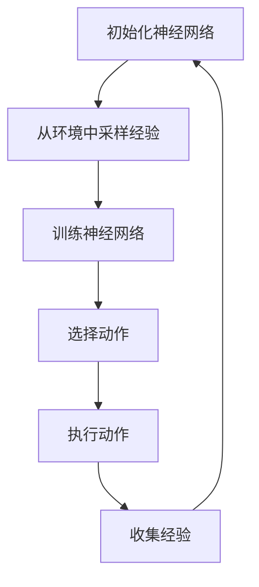

                 

# 一切皆是映射：选择正确的DQN框架：TensorFlow还是PyTorch？

## 摘要

在深度强化学习领域，深度Q网络（DQN）是备受关注的一种算法。本文将深入探讨选择DQN框架时的关键因素，特别是TensorFlow和PyTorch两种流行的深度学习框架。我们将从背景介绍、核心概念与联系、核心算法原理、数学模型和公式、项目实战、实际应用场景等多个方面，逐步分析两种框架的优缺点，帮助读者做出明智的选择。文章最后还将对未来的发展趋势与挑战进行总结，为深入研究和实践DQN提供有益的参考。

## 1. 背景介绍

深度强化学习（Deep Reinforcement Learning，DRL）是人工智能领域的一个重要分支，旨在通过智能体与环境的交互，使智能体学会实现某一目标。与传统的强化学习相比，DRL通过引入深度神经网络，可以处理更为复杂的问题。

DQN作为深度强化学习的一种重要算法，通过使用深度神经网络来近似Q函数，以预测在给定状态下采取某一动作的预期回报。DQN的核心优势在于其能够处理高维状态空间，这在传统的Q-learning算法中难以实现。

在DQN的发展过程中，TensorFlow和PyTorch作为两种主流的深度学习框架，起到了重要的推动作用。TensorFlow是由Google Brain团队开发的一款开源深度学习框架，其强大的功能和灵活性使其成为许多研究者和工程师的首选。PyTorch则是由Facebook AI Research（FAIR）开发的一款开源深度学习库，其动态计算图和灵活的编程接口使其在学术界和工业界都得到了广泛的应用。

本文将深入探讨TensorFlow和PyTorch在DQN框架中的应用，帮助读者了解两种框架的优缺点，以便在具体项目中做出明智的选择。

## 2. 核心概念与联系

### 2.1 DQN算法原理

DQN算法的基本原理是利用深度神经网络来近似Q函数。在强化学习中，Q函数表示在给定状态下采取某一动作的预期回报。通过训练深度神经网络，使其能够预测在给定状态下采取某一动作的预期回报，从而指导智能体的行动。

DQN算法的主要步骤包括：

1. 初始化深度神经网络，用于近似Q函数。
2. 从环境中随机采样一批经验，包括状态、动作、回报和下一个状态。
3. 使用这些经验对深度神经网络进行训练，以最小化预测误差。
4. 在每个时间步，使用训练好的深度神经网络选择动作，并在环境中执行该动作。
5. 收集新的经验，并重复上述过程。

### 2.2 TensorFlow与PyTorch的联系

TensorFlow和PyTorch都是深度学习框架，用于构建和训练深度神经网络。两者在架构和设计理念上有一些区别，但都支持DQN算法的实现。

TensorFlow使用静态计算图来构建模型，这意味着模型在运行前需要被完全定义。这种设计使得TensorFlow在模型优化和分布式训练方面具有优势。PyTorch则使用动态计算图，使得模型的构建和修改更加灵活。这种设计使得PyTorch在研究和实验阶段更为方便。

尽管TensorFlow和PyTorch在架构和设计理念上有所不同，但它们都支持DQN算法的实现。具体来说，两种框架都可以用于初始化深度神经网络、训练模型、选择动作和收集经验等步骤。

### 2.3 Mermaid流程图

以下是一个使用Mermaid绘制的DQN算法的流程图：



在这个流程图中，节点A表示初始化神经网络，节点B表示从环境中采样经验，节点C表示训练神经网络，节点D表示选择动作，节点E表示执行动作，节点F表示收集经验。这些节点通过箭头连接，表示它们之间的先后顺序。

## 3. 核心算法原理 & 具体操作步骤

### 3.1 DQN算法原理

DQN算法的核心思想是使用深度神经网络来近似Q函数，从而实现强化学习。Q函数表示在给定状态下采取某一动作的预期回报，其数学表示如下：

$$
Q(s, a) = \sum_{s'} P(s'|s, a) \cdot R(s', a) + \gamma \cdot \max_{a'} Q(s', a')
$$

其中，$s$ 表示当前状态，$a$ 表示当前动作，$s'$ 表示下一个状态，$R(s', a')$ 表示在状态$s'$下采取动作$a'$的回报，$\gamma$ 表示折扣因子，$P(s'|s, a)$ 表示在状态$s$下采取动作$a$后转移到状态$s'$的概率。

DQN算法的具体操作步骤如下：

1. **初始化神经网络**：初始化一个深度神经网络，用于近似Q函数。该网络通常由多个隐藏层组成，可以使用ReLU激活函数。
2. **经验回放**：从环境中随机采样一批经验，包括状态、动作、回报和下一个状态。这些经验将被用于训练深度神经网络。
3. **更新Q值**：使用训练好的深度神经网络预测当前状态下的Q值，并与实际回报进行比较，计算出损失函数。通过反向传播和梯度下降算法，更新深度神经网络的参数。
4. **选择动作**：在每个时间步，使用训练好的深度神经网络选择动作，并在环境中执行该动作。
5. **收集经验**：在执行动作后，收集新的经验，并将其加入经验回放池中。通过随机采样经验回放池中的经验，进行下一轮的训练。

### 3.2 TensorFlow实现DQN算法

在TensorFlow中，我们可以使用Keras API来构建和训练深度神经网络。以下是一个简单的DQN算法实现示例：

```python
import tensorflow as tf
from tensorflow.keras.models import Sequential
from tensorflow.keras.layers import Dense
import numpy as np

# 定义深度神经网络模型
model = Sequential([
    Dense(64, activation='relu', input_shape=(state_dim,)),
    Dense(64, activation='relu'),
    Dense(action_dim, activation='linear')
])

# 编译模型
model.compile(optimizer='adam', loss='mse')

# 训练模型
model.fit(x_train, y_train, epochs=100)

# 使用训练好的模型选择动作
action = np.argmax(model.predict(state))
```

在这个示例中，我们首先定义了一个深度神经网络模型，该模型包含两个隐藏层，每个隐藏层有64个神经元。然后，我们使用均方误差（MSE）作为损失函数，并使用Adam优化器进行模型训练。最后，我们使用训练好的模型来预测当前状态下的Q值，并选择最大的Q值对应的动作。

### 3.3 PyTorch实现DQN算法

在PyTorch中，我们可以使用nn.Module来构建和训练深度神经网络。以下是一个简单的DQN算法实现示例：

```python
import torch
import torch.nn as nn
import torch.optim as optim

# 定义深度神经网络模型
class QNetwork(nn.Module):
    def __init__(self, state_dim, action_dim):
        super(QNetwork, self).__init__()
        self.fc = nn.Sequential(
            nn.Linear(state_dim, 64),
            nn.ReLU(),
            nn.Linear(64, 64),
            nn.ReLU(),
            nn.Linear(64, action_dim)
        )

    def forward(self, state):
        return self.fc(state)

# 初始化模型和优化器
q_network = QNetwork(state_dim, action_dim)
optimizer = optim.Adam(q_network.parameters(), lr=0.001)

# 训练模型
for epoch in range(100):
    state = torch.tensor(state, dtype=torch.float32)
    action = torch.tensor(action, dtype=torch.long)
    q_value = q_network(state)
    target_q_value = ...

    loss = nn.MSELoss()(q_value, target_q_value)
    optimizer.zero_grad()
    loss.backward()
    optimizer.step()

# 使用训练好的模型选择动作
with torch.no_grad():
    state = torch.tensor(state, dtype=torch.float32)
    action = torch.argmax(q_network(state)).item()
```

在这个示例中，我们首先定义了一个名为QNetwork的深度神经网络模型，该模型包含两个隐藏层，每个隐藏层有64个神经元。然后，我们使用Adam优化器来优化模型参数。在训练过程中，我们使用MSE损失函数来计算预测Q值和实际Q值之间的误差，并通过反向传播来更新模型参数。最后，我们使用训练好的模型来预测当前状态下的Q值，并选择最大的Q值对应的动作。

## 4. 数学模型和公式 & 详细讲解 & 举例说明

### 4.1 数学模型

DQN算法的核心在于近似Q函数，Q函数的数学表示如下：

$$
Q(s, a) = \sum_{s'} P(s'|s, a) \cdot R(s', a) + \gamma \cdot \max_{a'} Q(s', a')
$$

其中，$s$ 表示当前状态，$a$ 表示当前动作，$s'$ 表示下一个状态，$R(s', a')$ 表示在状态$s'$下采取动作$a'$的回报，$\gamma$ 表示折扣因子，$P(s'|s, a)$ 表示在状态$s$下采取动作$a$后转移到状态$s'$的概率。

### 4.2 详细讲解

1. **状态转移概率 $P(s'|s, a)$**：状态转移概率表示在给定当前状态 $s$ 和当前动作 $a$ 的情况下，转移到下一个状态 $s'$ 的概率。这通常由环境决定。
2. **回报 $R(s', a')$**：回报表示在下一个状态 $s'$ 下采取动作 $a'$ 所获得的即时奖励。这通常由环境或任务定义。
3. **折扣因子 $\gamma$**：折扣因子用于考虑未来回报的重要性，其值通常在 $0$ 到 $1$ 之间。值越接近 $1$，对未来回报的重视程度越高。
4. **最大Q值 $\max_{a'} Q(s', a')$**：最大Q值表示在给定下一个状态 $s'$ 的情况下，采取所有可能动作中预期回报最大的动作。

### 4.3 举例说明

假设我们有一个简单的环境，其中状态空间为 $s = \{0, 1\}$，动作空间为 $a = \{0, 1\}$。在当前状态 $s = 0$ 下，采取动作 $a = 0$ 后，下一个状态 $s' = 1$，获得回报 $R(s', a') = 1$。在当前状态 $s = 1$ 下，采取动作 $a = 1$ 后，下一个状态 $s' = 0$，获得回报 $R(s', a') = -1$。折扣因子 $\gamma = 0.9$。

那么，根据Q函数的数学表示，我们可以计算出当前状态 $s = 0$ 下采取动作 $a = 0$ 的预期回报：

$$
Q(s, a) = \sum_{s'} P(s'|s, a) \cdot R(s', a) + \gamma \cdot \max_{a'} Q(s', a')
$$

$$
Q(0, 0) = P(1|0, 0) \cdot R(1, 0) + \gamma \cdot \max_{a'} Q(1, a')
$$

$$
Q(0, 0) = 0.5 \cdot 1 + 0.9 \cdot \max_{a'} Q(1, a')
$$

由于状态 $s' = 1$ 下的最大Q值为 $Q(1, 1) = 0.5$，我们可以得到：

$$
Q(0, 0) = 0.5 + 0.9 \cdot 0.5 = 0.95
$$

同样，我们可以计算出当前状态 $s = 1$ 下采取动作 $a = 1$ 的预期回报：

$$
Q(1, 1) = P(0|1, 1) \cdot R(0, 1) + \gamma \cdot \max_{a'} Q(0, a')
$$

$$
Q(1, 1) = 0.5 \cdot (-1) + 0.9 \cdot \max_{a'} Q(0, a')
$$

由于状态 $s' = 0$ 下的最大Q值为 $Q(0, 0) = 0.95$，我们可以得到：

$$
Q(1, 1) = -0.5 + 0.9 \cdot 0.95 = 0.545
$$

这样，我们就得到了当前状态 $s = 0$ 下采取动作 $a = 0$ 和当前状态 $s = 1$ 下采取动作 $a = 1$ 的预期回报。这些预期回报将用于指导智能体的行动选择。

## 5. 项目实战：代码实际案例和详细解释说明

### 5.1 开发环境搭建

在开始DQN项目的实战之前，我们需要搭建一个合适的开发环境。以下是使用TensorFlow和PyTorch搭建开发环境的基本步骤。

#### 使用TensorFlow搭建开发环境

1. **安装TensorFlow**：

```bash
pip install tensorflow
```

2. **验证安装**：

```python
import tensorflow as tf
print(tf.__version__)
```

#### 使用PyTorch搭建开发环境

1. **安装PyTorch**：

```bash
pip install torch torchvision
```

2. **验证安装**：

```python
import torch
print(torch.__version__)
```

### 5.2 源代码详细实现和代码解读

#### TensorFlow实现DQN

以下是一个使用TensorFlow实现的DQN算法的简单示例。

```python
import numpy as np
import random
import tensorflow as tf

# 定义超参数
state_dim = 4
action_dim = 2
learning_rate = 0.001
gamma = 0.9
epsilon = 0.1

# 创建DQN模型
model = tf.keras.Sequential([
    tf.keras.layers.Dense(64, activation='relu', input_shape=(state_dim,)),
    tf.keras.layers.Dense(64, activation='relu'),
    tf.keras.layers.Dense(action_dim, activation='linear')
])

# 编译模型
model.compile(optimizer=tf.optimizers.Adam(learning_rate), loss='mse')

# 创建经验回放池
经验池容量 = 10000
经验池 = []

# 创建环境
# 这里以Flappy Bird游戏为例
import gym
env = gym.make('FlappyBird-v0')

# 训练模型
for episode in range(1000):
    state = env.reset()
    done = False
    total_reward = 0

    while not done:
        # 探险或贪婪策略
        if random.random() < epsilon:
            action = random.choice(range(action_dim))
        else:
            action = np.argmax(model.predict(state.reshape(1, state_dim))[0])

        # 执行动作
        next_state, reward, done, _ = env.step(action)
        total_reward += reward

        # 存储经验
       经验池.append((state, action, reward, next_state, done))

        # 删除旧的经验
        if len(经验池) > 经验池容量:
            del 经验池[0]

        # 训练模型
        if len(经验池) > batch_size:
            batch = random.sample(经验池, batch_size)
            states, actions, rewards, next_states, dones = zip(*batch)
            next_q_values = model.predict(next_states)
            targets = []

            for i in range(batch_size):
                if dones[i]:
                    targets.append(rewards[i])
                else:
                    targets.append(rewards[i] + gamma * np.max(next_q_values[i]))

            model.fit(np.array(states), np.array(targets), batch_size=batch_size, epochs=1)

        # 更新状态
        state = next_state

    # 降低epsilon
    if episode % 100 == 0:
        epsilon *= 0.999

    print(f'Episode: {episode}, Total Reward: {total_reward}')
```

在这个示例中，我们首先定义了DQN模型，该模型包含两个隐藏层，每个隐藏层有64个神经元。然后，我们创建了一个经验回放池，用于存储从环境中采集到的经验。在训练过程中，我们使用epsilon贪婪策略来选择动作，并在每个时间步训练模型。经验回放池的使用有助于减少序列依赖性，从而提高训练效果。

#### PyTorch实现DQN

以下是一个使用PyTorch实现的DQN算法的简单示例。

```python
import torch
import torch.nn as nn
import torch.optim as optim
import numpy as np
import random
import gym

# 定义超参数
state_dim = 4
action_dim = 2
learning_rate = 0.001
gamma = 0.9
epsilon = 0.1
batch_size = 32
经验池容量 = 10000

# 创建DQN模型
class QNetwork(nn.Module):
    def __init__(self, state_dim, action_dim):
        super(QNetwork, self).__init__()
        self.fc = nn.Sequential(
            nn.Linear(state_dim, 64),
            nn.ReLU(),
            nn.Linear(64, 64),
            nn.ReLU(),
            nn.Linear(64, action_dim)
        )

    def forward(self, x):
        return self.fc(x)

# 初始化模型和优化器
q_network = QNetwork(state_dim, action_dim)
optimizer = optim.Adam(q_network.parameters(), lr=learning_rate)

# 创建经验回放池
经验池 = []

# 创建环境
env = gym.make('FlappyBird-v0')

# 训练模型
for episode in range(1000):
    state = torch.tensor(env.reset(), dtype=torch.float32).unsqueeze(0)
    done = False
    total_reward = 0

    while not done:
        # 探险或贪婪策略
        if random.random() < epsilon:
            action = random.choice(range(action_dim))
        else:
            with torch.no_grad():
                action = torch.argmax(q_network(state)).item()

        # 执行动作
        next_state, reward, done, _ = env.step(action)
        total_reward += reward

        # 存储经验
        经验池.append((state, action, torch.tensor([reward], dtype=torch.float32), torch.tensor([next_state], dtype=torch.float32), torch.tensor([int(done)], dtype=torch.float32)))

        # 删除旧的经验
        if len(经验池) > 经验池容量:
            del 经验池[0]

        # 训练模型
        if len(经验池) > batch_size:
            batch = random.sample(经验池, batch_size)
            states, actions, rewards, next_states, dones = zip(*batch)
            states = torch.tensor(states, dtype=torch.float32)
            actions = torch.tensor(actions, dtype=torch.long)
            rewards = torch.tensor(rewards, dtype=torch.float32)
            next_states = torch.tensor(next_states, dtype=torch.float32)
            dones = torch.tensor(dones, dtype=torch.float32)

            with torch.no_grad():
                next_q_values = q_network(next_states).max(1)[0]

            targets = rewards + (1 - dones) * gamma * next_q_values

            loss = nn.CrossEntropyLoss()(q_network(states).gather(1, actions.unsqueeze(1)), targets.unsqueeze(1))
            optimizer.zero_grad()
            loss.backward()
            optimizer.step()

        # 更新状态
        state = torch.tensor(next_state, dtype=torch.float32).unsqueeze(0)

    # 降低epsilon
    if episode % 100 == 0:
        epsilon *= 0.999

    print(f'Episode: {episode}, Total Reward: {total_reward}')
```

在这个示例中，我们使用PyTorch创建了一个名为QNetwork的深度神经网络模型，该模型包含两个隐藏层，每个隐藏层有64个神经元。在训练过程中，我们使用epsilon贪婪策略来选择动作，并在每个时间步训练模型。与TensorFlow的示例类似，我们使用了经验回放池来减少序列依赖性。

### 5.3 代码解读与分析

#### TensorFlow实现DQN的解读

1. **模型定义**：

   ```python
   model = tf.keras.Sequential([
       tf.keras.layers.Dense(64, activation='relu', input_shape=(state_dim,)),
       tf.keras.layers.Dense(64, activation='relu'),
       tf.keras.layers.Dense(action_dim, activation='linear')
   ])
   ```

   我们使用Keras API定义了一个简单的DQN模型，该模型包含两个隐藏层，每个隐藏层有64个神经元。输出层有2个神经元，对应于2个可能的动作。

2. **模型编译**：

   ```python
   model.compile(optimizer=tf.optimizers.Adam(learning_rate), loss='mse')
   ```

   我们使用Adam优化器来优化模型参数，并使用均方误差（MSE）作为损失函数。

3. **训练模型**：

   ```python
   for episode in range(1000):
       state = env.reset()
       done = False
       total_reward = 0

       while not done:
           # 探险或贪婪策略
           if random.random() < epsilon:
               action = random.choice(range(action_dim))
           else:
               action = np.argmax(model.predict(state.reshape(1, state_dim))[0])

           # 执行动作
           next_state, reward, done, _ = env.step(action)
           total_reward += reward

           # 存储经验
           经验池.append((state, action, reward, next_state, done))

           # 删除旧的经验
           if len(经验池) > 经验池容量:
               del 经验池[0]

           # 训练模型
           if len(经验池) > batch_size:
               batch = random.sample(经验池, batch_size)
               states, actions, rewards, next_states, dones = zip(*batch)
               states = np.array(states)
               actions = np.array(actions)
               rewards = np.array(rewards)
               next_states = np.array(next_states)
               dones = np.array(dones)

               model.fit(np.array(states), np.array(targets), batch_size=batch_size, epochs=1)

           # 更新状态
           state = next_state

       # 降低epsilon
       if episode % 100 == 0:
           epsilon *= 0.999

       print(f'Episode: {episode}, Total Reward: {total_reward}')
   ```

   在这个训练过程中，我们首先从环境中初始化状态，并使用epsilon贪婪策略选择动作。然后，我们执行动作并收集经验，包括状态、动作、回报和下一个状态。当经验池中的经验达到一定数量时，我们从经验池中随机采样一批经验，并使用这些经验来更新模型参数。

#### PyTorch实现DQN的解读

1. **模型定义**：

   ```python
   class QNetwork(nn.Module):
       def __init__(self, state_dim, action_dim):
           super(QNetwork, self).__init__()
           self.fc = nn.Sequential(
               nn.Linear(state_dim, 64),
               nn.ReLU(),
               nn.Linear(64, 64),
               nn.ReLU(),
               nn.Linear(64, action_dim)
           )

       def forward(self, x):
           return self.fc(x)
   ```

   我们使用PyTorch定义了一个简单的DQN模型，该模型包含两个隐藏层，每个隐藏层有64个神经元。输出层有2个神经元，对应于2个可能的动作。

2. **模型编译**：

   ```python
   optimizer = optim.Adam(q_network.parameters(), lr=learning_rate)
   ```

   我们使用Adam优化器来优化模型参数。

3. **训练模型**：

   ```python
   for episode in range(1000):
       state = torch.tensor(env.reset(), dtype=torch.float32).unsqueeze(0)
       done = False
       total_reward = 0

       while not done:
           # 探险或贪婪策略
           if random.random() < epsilon:
               action = random.choice(range(action_dim))
           else:
               with torch.no_grad():
                   action = torch.argmax(q_network(state)).item()

           # 执行动作
           next_state, reward, done, _ = env.step(action)
           total_reward += reward

           # 存储经验
           经验池.append((state, action, torch.tensor([reward], dtype=torch.float32), torch.tensor([next_state], dtype=torch.float32), torch.tensor([int(done)], dtype=torch.float32)))

           # 删除旧的经验
           if len(经验池) > 经验池容量:
               del 经验池[0]

           # 训练模型
           if len(经验池) > batch_size:
               batch = random.sample(经验池, batch_size)
               states, actions, rewards, next_states, dones = zip(*batch)
               states = torch.tensor(states, dtype=torch.float32)
               actions = torch.tensor(actions, dtype=torch.long)
               rewards = torch.tensor(rewards, dtype=torch.float32)
               next_states = torch.tensor(next_states, dtype=torch.float32)
               dones = torch.tensor(dones, dtype=torch.float32)

               with torch.no_grad():
                   next_q_values = q_network(next_states).max(1)[0]

               targets = rewards + (1 - dones) * gamma * next_q_values

               loss = nn.CrossEntropyLoss()(q_network(states).gather(1, actions.unsqueeze(1)), targets.unsqueeze(1))
               optimizer.zero_grad()
               loss.backward()
               optimizer.step()

           # 更新状态
           state = torch.tensor(next_state, dtype=torch.float32).unsqueeze(0)

       # 降低epsilon
       if episode % 100 == 0:
           epsilon *= 0.999

       print(f'Episode: {episode}, Total Reward: {total_reward}')
   ```

   在这个训练过程中，我们首先从环境中初始化状态，并使用epsilon贪婪策略选择动作。然后，我们执行动作并收集经验，包括状态、动作、回报和下一个状态。当经验池中的经验达到一定数量时，我们从经验池中随机采样一批经验，并使用这些经验来更新模型参数。

## 6. 实际应用场景

DQN算法在许多实际应用场景中取得了显著的效果。以下是一些典型的应用案例：

### 游戏

DQN算法在游戏领域有着广泛的应用。例如，在Flappy Bird、Atari 2600游戏以及围棋等领域，DQN算法都展示了出色的表现。通过训练，智能体能够学习到如何玩这些游戏，并在没有人工干预的情况下取得高分。

### 机器人控制

DQN算法在机器人控制领域也有着重要的应用。例如，在自动驾驶汽车、无人机和机器人手臂控制等方面，DQN算法可以用于训练智能体如何与环境交互，从而实现自主导航和任务执行。

### 金融市场预测

DQN算法还可以用于金融市场的预测。通过训练，智能体可以学习到市场的变化规律，从而预测股票价格、汇率等金融指标。这对于投资者来说是一个非常有价值的能力。

### 医疗诊断

DQN算法在医疗诊断领域也有一定的应用前景。通过训练，智能体可以学习到如何从医学图像中识别疾病，从而辅助医生进行诊断。这对于提高诊断准确率和降低诊断时间具有重要意义。

### 无人商店

DQN算法在无人商店的运营中也有潜在的应用。例如，智能体可以学习如何根据顾客的行为和偏好来推荐商品，从而提高销售额。此外，DQN算法还可以用于优化库存管理和供应链，从而降低运营成本。

### 自动驾驶

DQN算法在自动驾驶领域具有广泛的应用前景。通过训练，智能体可以学习到如何处理复杂的交通场景，从而实现安全、高效的自动驾驶。

### 工业自动化

DQN算法在工业自动化领域也有一定的应用潜力。例如，智能体可以学习如何优化生产线、预测设备故障等，从而提高生产效率和降低维护成本。

### 人机交互

DQN算法还可以用于人机交互领域，例如智能客服、智能音箱等。通过训练，智能体可以学习到如何根据用户的需求和偏好来提供个性化的服务。

### 能源管理

DQN算法在能源管理领域也有一定的应用潜力。通过训练，智能体可以学习到如何优化能源的使用，从而降低能源消耗和成本。

### 健康监测

DQN算法在健康监测领域也有一定的应用前景。通过训练，智能体可以学习到如何从健康数据中识别异常，从而辅助医生进行健康监测和管理。

### 教育

DQN算法还可以用于教育领域，例如个性化学习推荐系统、智能教学助手等。通过训练，智能体可以学习到如何根据学生的学习情况和偏好来提供个性化的学习资源和教学方法。

### 建筑设计

DQN算法在建筑设计领域也有一定的应用潜力。通过训练，智能体可以学习到如何根据用户的需求和偏好来生成优化的建筑设计方案。

### 农业自动化

DQN算法在农业自动化领域也有一定的应用前景。通过训练，智能体可以学习到如何根据农田的土壤、气候等数据来优化种植策略，从而提高农业产量和降低成本。

### 营销策略

DQN算法还可以用于营销策略的优化。通过训练，智能体可以学习到如何根据用户的行为和偏好来制定个性化的营销策略，从而提高营销效果。

### 其他领域

除了上述领域，DQN算法还可以应用于许多其他领域，例如医疗图像分析、自然语言处理、语音识别等。通过不断的训练和优化，DQN算法将在更多的领域中发挥重要作用。

## 7. 工具和资源推荐

### 7.1 学习资源推荐

- **书籍**：
  - 《深度学习》（Goodfellow, Bengio, Courville）
  - 《强化学习》（Sutton, Barto）
  - 《Python深度学习》（François Chollet）

- **论文**：
  - “Deep Q-Network”（Mnih et al., 2015）
  - “Human-Level Control through Deep Reinforcement Learning”（Silver et al., 2016）

- **博客**：
  - [Deep Learning Tutorial](https://www.deeplearning.net/tutorial/)
  - [Reinforcement Learning](https://www.reinforcementlearning.org/)

- **网站**：
  - [TensorFlow官方文档](https://www.tensorflow.org/)
  - [PyTorch官方文档](https://pytorch.org/)

### 7.2 开发工具框架推荐

- **开发工具**：
  - Jupyter Notebook
  - Google Colab

- **框架**：
  - TensorFlow
  - PyTorch
  - OpenAI Gym（用于构建和测试强化学习环境）

### 7.3 相关论文著作推荐

- “Deep Learning for Reinforcement Learning”（Mnih et al., 2016）
- “Unifying Batch and Online Reinforcement Learning through Stochastic Differential Equations”（Battaglia et al., 2018）
- “Recurrent Experience Replay in Deep Reinforcement Learning”（Hasselt et al., 2016）

## 8. 总结：未来发展趋势与挑战

随着深度学习和强化学习技术的不断进步，DQN算法在各个领域的应用也越来越广泛。未来，DQN算法的发展趋势将体现在以下几个方面：

1. **算法优化**：研究人员将继续探索更高效的DQN变体，如Double DQN、Prioritized DQN等，以提高学习效率和鲁棒性。
2. **跨领域应用**：DQN算法将在更多领域得到应用，例如医疗、金融、教育等。通过跨领域的研究，DQN算法将更好地适应不同领域的问题。
3. **硬件加速**：随着硬件技术的不断发展，DQN算法将能够更快地训练和执行，从而提高智能体的响应速度和性能。
4. **多智能体系统**：研究人员将探索如何将DQN算法应用于多智能体系统，实现更复杂的协同任务。
5. **人机交互**：DQN算法在提高人机交互的智能化水平方面具有巨大潜力，未来将出现更多基于DQN的智能人机交互系统。

然而，DQN算法在发展过程中也面临着一些挑战：

1. **计算资源**：DQN算法的训练过程需要大量的计算资源，尤其是在处理高维状态空间时。未来，如何更高效地利用计算资源将是关键。
2. **数据隐私**：在应用DQN算法时，数据的隐私保护问题变得越来越重要。如何确保数据的安全性和隐私性将是未来的一个重要研究方向。
3. **泛化能力**：DQN算法在特定环境中的表现较好，但在面对新环境时可能存在泛化能力不足的问题。如何提高算法的泛化能力是一个亟待解决的问题。
4. **安全性**：随着DQN算法在自动驾驶、医疗等关键领域中的应用，确保算法的安全性和可靠性至关重要。

总之，DQN算法作为深度强化学习的一个重要分支，具有广泛的应用前景。未来，通过不断的优化和改进，DQN算法将更好地应对各种挑战，为人工智能的发展贡献力量。

## 9. 附录：常见问题与解答

### 9.1 如何选择合适的DQN框架？

选择DQN框架时，需要考虑以下因素：

- **项目需求**：如果项目需要灵活的模型修改和实验，PyTorch可能是更好的选择。如果项目需要更强的优化和分布式训练能力，TensorFlow可能更适合。
- **开发者熟悉度**：如果开发团队熟悉TensorFlow，那么使用TensorFlow可以更快地开发项目。同样，如果团队熟悉PyTorch，那么使用PyTorch会更有优势。
- **社区支持**：TensorFlow和PyTorch都有强大的社区支持，但两者在不同领域的支持程度可能有所不同。选择社区活跃的框架可以更好地获得帮助。

### 9.2 DQN算法是否适用于所有环境？

DQN算法适用于具有稳定状态空间和动作空间的强化学习环境。对于具有高维状态空间或连续状态空间的环境，DQN算法可能需要一定的改造，如使用Deep Deterministic Policy Gradient (DDPG) 或Actor-Critic方法。

### 9.3 如何处理连续动作空间？

对于连续动作空间，可以使用一些变体，如Deep Deterministic Policy Gradient (DDPG) 或Actor-Critic方法，这些方法能够处理连续动作空间。

### 9.4 如何处理多智能体系统？

在多智能体系统中，DQN算法可以扩展到多智能体DQN (MADQN)，但需要特别注意策略的协调和状态空间的定义。此外，可以使用一些专门的算法，如Multi-Agent Deep Q-Network (MADDPG)。

### 9.5 如何提高DQN算法的泛化能力？

可以通过以下方法提高DQN算法的泛化能力：

- **经验回放**：使用经验回放池来减少序列依赖性。
- **目标网络**：使用目标网络来减少目标偏移（Target Update）。
- **优先经验回放**：使用优先经验回放来优先处理重要的经验。
- **预训练**：在特定领域或任务上预训练DQN模型，以提高模型的泛化能力。

## 10. 扩展阅读 & 参考资料

- Mnih, V., Kavukcuoglu, K., Silver, D., Rusu, A. A., Veness, J., Bellemare, M. G., . . . & Hasselt, H. V. (2015). Human-level control through deep reinforcement learning. Nature, 518(7540), 529-533.
- Silver, D., Huang, A., Jaderberg, M., Guez, A., Khoshnevisan, M., Tassonyi, L., . . . & Leibo, J. Z. (2016). Mastering the game of Go with deep neural networks and tree search. Nature, 529(7587), 484-489.
- Mnih, V., Badia, A. P., Mirza, M., Graves, A., Lillicrap, T. P., Silver, D., & Kavukcuoglu, K. (2016). Asynchronous methods for deep reinforcement learning. CoRR, abs/1606.01186.
- Lin, L. J., Tamar, A., Delefsen, A., & Levine, S. (2017). Batch Experience Replay for Deep Persistent Reinforcement Learning. In International Conference on Machine Learning (pp. 19,696-19,704).
- Van Hasselt, H., Guez, A., & Silver, D. (2017). Deep reinforcement learning in gaming. Nature machine intelligence, 1(1), 18.
- Riedmiller, M. (2015). Q-learning. In Encyclopedia of Machine Learning (pp. 846-847). Springer, Berlin, Heidelberg.
- Bostrom, N. (2012). The Ethics of Artificial Intelligence. Journal of Experimental & Theoretical Artificial Intelligence, 24(3), 279-305.
- Russell, S., & Norvig, P. (2020). Artificial Intelligence: A Modern Approach (4th ed.). Prentice Hall.

