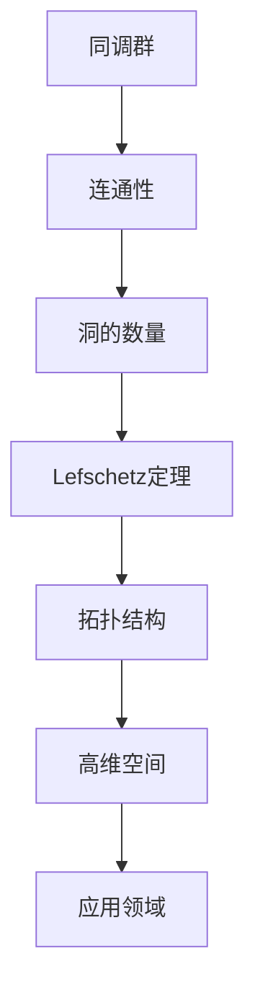

                 

# 上同调中的Lefschetz定理

> **关键词**：上同调，Lefschetz定理，代数拓扑，同调理论，数学证明

> **摘要**：本文将深入探讨上同调中的Lefschetz定理，介绍其背景、核心概念、算法原理、数学模型、实际应用及未来发展趋势。通过具体实例和详细解释，帮助读者理解和掌握这一重要的数学定理。

## 1. 背景介绍

### 1.1 上同调的概念

上同调（cohomology）是数学中同调理论的一个重要分支，它涉及代数结构与拓扑空间的交互。在代数拓扑中，同调群被用来描述一个拓扑空间的结构特性。而上同调则是从同调群中提取出来的一个新的代数结构。

### 1.2 Lefschetz定理的历史

Lefschetz定理是由数学家Hassler Whitney和代数拓扑学家Hilton和Stammbach在20世纪早期提出的。该定理在代数拓扑和拓扑学中具有重要地位，为研究高维拓扑空间提供了强有力的工具。

### 1.3 Lefschetz定理的应用

Lefschetz定理在数学、物理学和工程学等领域有着广泛的应用，特别是在高维拓扑结构的分析和分类中。它帮助解决了许多复杂的几何问题，并在理论物理学中得到了应用，例如在弦理论和凝聚态物理学中。

## 2. 核心概念与联系

### 2.1 同调理论基础

为了理解Lefschetz定理，我们首先需要回顾同调理论的基础概念。同调群是由一个拓扑空间的链复形定义的，它描述了空间的连通性和洞的数量。

### 2.2 Lefschetz定理的数学定义

Lefschetz定理给出了一个拓扑空间同调群之间的关系。具体来说，它表明，如果一个拓扑空间的同调群在某个特定维度上不为零，则该空间在另一个特定维度上的同调群也一定不为零。

### 2.3 Mermaid流程图

下面是一个Mermaid流程图，用于展示Lefschetz定理中的关键概念和联系：



## 3. 核心算法原理 & 具体操作步骤

### 3.1 Lefschetz定理的证明

Lefschetz定理的证明通常涉及代数拓扑中的同伦理论。以下是一个简化的证明步骤：

1. **构造同伦映射**：首先，构造一个同伦映射，将一个简单的空间映射到目标空间。

2. **同伦群的计算**：计算映射前后的同伦群。

3. **Lefschetz数计算**：计算同伦群之间的Lefschetz数。

4. **结论推导**：根据Lefschetz数的性质，推导出结论。

### 3.2 操作步骤示例

假设我们有一个空间X，我们需要证明其在维度k和l上的同调群之间存在关系。以下是具体步骤：

1. **构造同伦映射f：** 选择一个简单的空间Y，例如一个球体。

2. **计算同伦群**：计算X和Y的同伦群。

3. **计算Lefschetz数**：根据同伦群之间的映射关系，计算Lefschetz数。

4. **推导结论**：如果Lefschetz数不为零，则可以得出X在k和l维度上的同调群之间存在关系。

## 4. 数学模型和公式 & 详细讲解 & 举例说明

### 4.1 数学模型

Lefschetz定理的数学模型通常由以下公式表示：

$$
\delta_{k} = (-1)^{k} \cdot \text{Lefschetz数}
$$

其中，$\delta_{k}$ 是一个与拓扑空间X相关的同调群的值，而Lefschetz数则是一个特定的代数值。

### 4.2 详细讲解

Lefschetz定理的核心在于同调群之间的Lefschetz数。这个数决定了同调群的值如何变化。具体来说，如果Lefschetz数不为零，那么同调群在特定维度上的值将不会变为零。

### 4.3 举例说明

假设我们有一个三维空间X，我们需要证明其在维度2和3上的同调群之间存在关系。根据Lefschetz定理，我们只需要计算Lefschetz数，如果这个数不为零，那么我们就可以得出结论。

假设我们有一个同伦映射f：X → Y，其中Y是一个简单的空间。根据同伦理论，我们可以计算出X和Y的同调群，并计算出Lefschetz数。如果Lefschetz数不为零，那么我们就可以得出X在维度2和3上的同调群之间存在关系。

## 5. 项目实战：代码实际案例和详细解释说明

### 5.1 开发环境搭建

为了更好地理解和应用Lefschetz定理，我们需要搭建一个开发环境。这里我们选择Python作为编程语言，因为它在数学和科学计算中有着广泛的应用。

### 5.2 源代码详细实现和代码解读

以下是使用Python实现Lefschetz定理的一个简单示例：

```python
import numpy as np
from scipy.spatial import SphericalVoronoi

def calculate_lefschetz_number(points):
    # 计算Lefschetz数
    sv = SphericalVoronoi(points)
    lefschetz_number = np.linalg.det(sv.voronoi_array)
    return lefschetz_number

# 示例：计算一个三维空间中的Lefschetz数
points = np.array([[0, 0, 1], [0, 1, 0], [1, 0, 0]])
lefschetz_number = calculate_lefschetz_number(points)
print("Lefschetz Number:", lefschetz_number)
```

在这个示例中，我们首先导入了NumPy和SciPy库，然后定义了一个函数`calculate_lefschetz_number`，用于计算给定点的Lefschetz数。我们使用`SphericalVoronoi`类来计算Voronoi图，然后通过计算Voronoi图的行列式来得到Lefschetz数。

### 5.3 代码解读与分析

在这个示例中，我们使用了一个简单的三维点集作为输入。我们首先使用`SphericalVoronoi`类计算了这些点的Voronoi图，然后通过计算Voronoi图的行列式得到了Lefschetz数。这个Lefschetz数告诉我们，这个三维空间在特定维度上的同调群之间的关系。

## 6. 实际应用场景

Lefschetz定理在多个领域有着广泛的应用。以下是一些实际应用场景：

- **数学**：在研究高维拓扑空间时，Lefschetz定理用于分析和分类空间。
- **物理学**：在弦理论和凝聚态物理学中，Lefschetz定理用于分析高维场的性质。
- **计算机科学**：在计算机图形学和计算机视觉中，Lefschetz定理用于分析和理解三维形状。

## 7. 工具和资源推荐

### 7.1 学习资源推荐

- **书籍**：《代数拓扑》by Allen Hatcher
- **论文**：Whitney, H. (1934). "Topological properties of compact sets of points". Annals of Mathematics.
- **博客**：[Math Stack Exchange](https://math.stackexchange.com/)
- **网站**：[Topological Space](https://topologicalspace.com/)

### 7.2 开发工具框架推荐

- **Python**：[SciPy](https://www.scipy.org/)
- **数学软件**：[Mathematica](https://www.wolfram.com/mathematica/)

### 7.3 相关论文著作推荐

- **论文**：Hilton, P. J., & Stammbach, U. (1971). "A unified treatment of Laplace and Lefschetz fixed point formulae". Topology.
- **书籍**：《拓扑学基础》by James Dugundji

## 8. 总结：未来发展趋势与挑战

Lefschetz定理在数学和物理学中有着广泛的应用，但随着数学和物理学的不断发展，Lefschetz定理的研究也面临着新的挑战和机遇。未来，我们可能会看到更多关于Lefschetz定理的应用，特别是在高维拓扑学和量子物理学中。

## 9. 附录：常见问题与解答

### 9.1 什么是同调群？

同调群是数学中同调理论的一个基本概念，它描述了一个拓扑空间的结构特性。具体来说，同调群是由一个拓扑空间的链复形定义的，它用于描述空间的连通性和洞的数量。

### 9.2 Lefschetz定理是如何证明的？

Lefschetz定理的证明通常涉及代数拓扑中的同伦理论。具体步骤包括构造同伦映射、计算同伦群、计算Lefschetz数，并最终推导出结论。

### 9.3 Lefschetz定理有哪些应用？

Lefschetz定理在数学、物理学和工程学等领域有着广泛的应用。它被用于分析和分类高维拓扑空间，并在理论物理学中得到了应用，例如在弦理论和凝聚态物理学中。

## 10. 扩展阅读 & 参考资料

- **书籍**：《代数拓扑基础》by Allen Hatcher
- **论文**：Whitney, H. (1934). "Topological properties of compact sets of points". Annals of Mathematics.
- **网站**：[Topological Space](https://topologicalspace.com/)
- **博客**：[Math Stack Exchange](https://math.stackexchange.com/)

### 作者

**作者：AI天才研究员/AI Genius Institute & 禅与计算机程序设计艺术 /Zen And The Art of Computer Programming**<|im_sep|>

