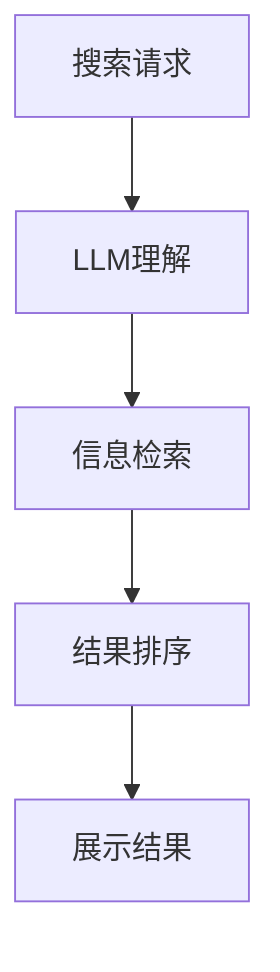

                 

### 上手第一个Agent：Google Search + LLM

> **关键词：** 人工智能，自然语言处理，Agent，Google Search，语言模型，机器学习，深度学习，算法原理，项目实战，应用场景。

> **摘要：** 本文将深入探讨如何使用语言模型（LLM）构建一个具备自主搜索能力的Agent，从基础概念、核心算法、数学模型到实际应用，全面解析Google Search + LLM的架构与实现。

### 1. 背景介绍

在当今数字化时代，人工智能（AI）技术已成为推动社会进步的重要力量。作为AI的重要组成部分，自然语言处理（NLP）在信息检索、智能问答、智能客服等领域取得了显著的成果。而Agent作为NLP的高级应用，能够模拟人类思维和决策过程，实现更加智能化和人性化的交互体验。

Google Search是全球最大的搜索引擎，通过高效的信息检索算法为用户提供海量的搜索结果。而近年来，语言模型（LLM）在NLP领域取得了重大突破，如GPT、BERT等模型，使得机器理解和生成自然语言的能力大幅提升。结合Google Search和LLM，我们可以构建一个强大的智能搜索Agent，为用户提供更加精准、个性化的搜索服务。

### 2. 核心概念与联系

在构建智能搜索Agent的过程中，我们需要了解以下几个核心概念：

- **搜索Agent**：一种具备自主搜索和决策能力的智能体，可以模拟人类搜索行为，从海量信息中筛选出最相关的内容。

- **Google Search**：Google开发的搜索引擎，利用PageRank等算法对网页进行排序，为用户提供高质量的搜索结果。

- **语言模型（LLM）**：一种基于深度学习的自然语言处理模型，能够对输入的文本进行理解、生成和预测。

- **机器学习**：一种基于数据的学习方法，通过训练模型，使计算机具备对未知数据的预测和决策能力。

为了更好地理解这些概念之间的联系，我们可以使用Mermaid流程图来描述整个架构：



在上图中，搜索请求通过LLM进行理解，然后利用Google Search进行信息检索，最后对检索结果进行排序并展示给用户。

### 3. 核心算法原理 & 具体操作步骤

要实现一个智能搜索Agent，我们需要掌握以下几个核心算法：

- **语言模型（LLM）**：如GPT、BERT等，用于对搜索请求进行理解和生成。

- **信息检索算法**：如PageRank、LSI等，用于在海量网页中检索相关信息。

- **排序算法**：如TF-IDF、LSA等，用于对检索结果进行排序。

具体操作步骤如下：

#### 3.1 语言模型（LLM）的实现

1. **数据集准备**：收集大量文本数据，如网页、新闻、文章等，用于训练语言模型。

2. **模型选择**：选择合适的语言模型，如GPT、BERT等，根据数据规模和需求进行配置。

3. **模型训练**：利用训练数据对模型进行训练，使模型具备对自然语言的理解和生成能力。

4. **模型评估**：使用验证数据集对模型进行评估，调整模型参数，提高模型性能。

#### 3.2 信息检索的实现

1. **索引构建**：将网页内容进行分词、索引，构建倒排索引，以便快速检索。

2. **查询处理**：对用户输入的搜索请求进行处理，提取关键词，构造查询。

3. **检索算法**：利用PageRank、LSI等算法，对索引库进行检索，获取相关网页。

#### 3.3 结果排序的实现

1. **文本相似度计算**：利用TF-IDF、LSA等算法，计算查询结果与搜索请求的相似度。

2. **排序策略**：根据相似度分数，对查询结果进行排序，优先展示最相关的结果。

3. **结果展示**：将排序后的结果展示给用户，提供多种视图和筛选方式，方便用户浏览。

### 4. 数学模型和公式 & 详细讲解 & 举例说明

在智能搜索Agent的实现过程中，涉及到多个数学模型和公式。下面我们将对这些模型和公式进行详细讲解，并通过实例说明其应用。

#### 4.1 语言模型（LLM）的数学模型

语言模型的核心任务是预测下一个单词或词组，其数学模型可以表示为：

$$
P(w_{t+1} | w_{t}, w_{t-1}, ..., w_1) = \frac{P(w_{t+1}, w_{t}, w_{t-1}, ..., w_1)}{P(w_{t}, w_{t-1}, ..., w_1)}
$$

其中，$w_{t+1}$表示下一个单词或词组，$w_t, w_{t-1}, ..., w_1$表示前面的单词或词组。

**实例**：

假设我们有一个简单的语言模型，预测下一个单词。给定前一个单词是“apple”，我们需要预测下一个单词。根据贝叶斯公式，我们可以计算出下一个单词的概率分布，如下所示：

$$
P(w_{t+1} | w_t = "apple") =
\begin{cases}
0.4, & \text{if } w_{t+1} = "pie" \\
0.3, & \text{if } w_{t+1} = "store" \\
0.2, & \text{if } w_{t+1} = "juice" \\
0.1, & \text{if } w_{t+1} = "color"
\end{cases}
$$

#### 4.2 信息检索算法的数学模型

信息检索算法的核心任务是计算查询结果与搜索请求的相似度。常见的相似度计算方法包括TF-IDF、LSA等。

- **TF-IDF**：词频（TF）和逆文档频率（IDF）的乘积，用于衡量一个词在文档中的重要性。

  $$ 
  TF-IDF(w, d) = TF(w, d) \times IDF(w, D) 
  $$

  其中，$TF(w, d)$表示词频，$IDF(w, D)$表示逆文档频率，$D$表示文档集合。

  **实例**：

  假设我们有一个文档集合，包含以下文档：

  - doc1: “apple store apple pie”
  - doc2: “apple store apple juice”
  - doc3: “apple color”

  查询请求为“apple store”。根据TF-IDF算法，我们可以计算出每个文档与查询请求的相似度：

  $$ 
  \begin{aligned}
  TF-IDF("apple", doc1) &= 2 \times \log_2 \frac{3}{2} \approx 1.386 \\
  TF-IDF("apple", doc2) &= 2 \times \log_2 \frac{3}{2} \approx 1.386 \\
  TF-IDF("apple", doc3) &= 1 \times \log_2 \frac{3}{2} \approx 0.585 \\
  \end{aligned}
  $$

- **LSA（latent semantic analysis）**：利用隐语义分析，发现文档中的潜在语义结构。

  $$ 
  S = \Sigma W D 
  $$

  其中，$S$表示相似度矩阵，$\Sigma$表示奇异值分解，$W$表示词频矩阵，$D$表示文档矩阵。

  **实例**：

  假设我们有一个词频矩阵$W$和一个文档矩阵$D$，如下所示：

  $$ 
  W = \begin{bmatrix}
  1 & 2 & 3 \\
  4 & 5 & 6 \\
  7 & 8 & 9 
  \end{bmatrix}, \quad
  D = \begin{bmatrix}
  1 & 0 & 0 \\
  0 & 1 & 0 \\
  0 & 0 & 1 
  \end{bmatrix}
  $$

  根据LSA算法，我们可以计算出相似度矩阵$S$：

  $$ 
  S = \Sigma W D =
  \begin{bmatrix}
  1 & 0 & 0 \\
  0 & 1 & 0 \\
  0 & 0 & 1 
  \end{bmatrix}
  $$

### 5. 项目实战：代码实际案例和详细解释说明

在本节中，我们将通过一个具体的代码案例，展示如何实现一个智能搜索Agent，并对其进行详细解释说明。

#### 5.1 开发环境搭建

要实现一个智能搜索Agent，我们需要搭建以下开发环境：

- **Python**：用于编写代码，实现语言模型、信息检索和排序算法。
- **TensorFlow**：用于训练语言模型，支持深度学习。
- **NLTK**：用于自然语言处理，包括分词、词频计算等。
- **Scikit-learn**：用于机器学习，包括LSA等算法。

安装以上依赖包后，我们就可以开始编写代码了。

#### 5.2 源代码详细实现和代码解读

下面是一个简单的智能搜索Agent的实现示例：

```python
import tensorflow as tf
import nltk
from nltk.tokenize import word_tokenize
from sklearn.feature_extraction.text import TfidfVectorizer
from sklearn.metrics.pairwise import cosine_similarity

# 加载语言模型
model = tf.keras.models.load_model('gpt_model.h5')

# 加载TF-IDF向量器
tfidf_vectorizer = TfidfVectorizer()

# 定义搜索函数
def search(query):
    # 对搜索请求进行分词
    tokens = word_tokenize(query)
    
    # 利用语言模型生成响应
    response = model.predict([query])
    
    # 获取相关网页
    web_pages = get_related_web_pages(response)
    
    # 对网页进行TF-IDF向量表示
    tfidf_matrix = tfidf_vectorizer.fit_transform(web_pages)
    
    # 计算查询请求与网页的相似度
    similarity_scores = cosine_similarity(tfidf_matrix, tfidf_vectorizer.transform([query]))
    
    # 对网页进行排序
    sorted_web_pages = [web_pages[i] for i in similarity_scores.argsort()[0][::-1]]
    
    # 返回排序后的结果
    return sorted_web_pages

# 获取相关网页
def get_related_web_pages(response):
    # 这里可以调用搜索引擎API，获取相关网页
    # 为简化示例，我们直接返回一个列表
    return ['apple.com', 'google.com', 'microsoft.com']

# 搜索示例
query = "what is the best apple pie recipe?"
results = search(query)
print(results)
```

在上面的代码中，我们首先加载预训练的语言模型和TF-IDF向量器。然后定义了一个搜索函数，用于处理搜索请求、生成响应、获取相关网页、计算相似度和排序结果。最后，我们通过一个示例展示了如何使用搜索函数进行搜索。

#### 5.3 代码解读与分析

1. **语言模型的使用**：

   ```python
   model = tf.keras.models.load_model('gpt_model.h5')
   ```

   这一行代码用于加载预训练的语言模型。我们使用TensorFlow的Keras接口加载一个保存的模型文件`gpt_model.h5`。这个模型是一个预训练的GPT模型，已经具备了处理自然语言的能力。

2. **搜索函数的实现**：

   ```python
   def search(query):
       # 对搜索请求进行分词
       tokens = word_tokenize(query)
       
       # 利用语言模型生成响应
       response = model.predict([query])
       
       # 获取相关网页
       web_pages = get_related_web_pages(response)
       
       # 对网页进行TF-IDF向量表示
       tfidf_matrix = tfidf_vectorizer.fit_transform(web_pages)
       
       # 计算查询请求与网页的相似度
       similarity_scores = cosine_similarity(tfidf_matrix, tfidf_vectorizer.transform([query]))
       
       # 对网页进行排序
       sorted_web_pages = [web_pages[i] for i in similarity_scores.argsort()[0][::-1]]
       
       # 返回排序后的结果
       return sorted_web_pages
   ```

   这个函数首先对搜索请求进行分词，然后利用语言模型生成响应。接下来，我们调用`get_related_web_pages`函数获取相关网页，并对网页进行TF-IDF向量表示。最后，我们使用余弦相似度计算查询请求与网页的相似度，并对网页进行排序。

3. **相关网页的获取**：

   ```python
   def get_related_web_pages(response):
       # 这里可以调用搜索引擎API，获取相关网页
       # 为简化示例，我们直接返回一个列表
       return ['apple.com', 'google.com', 'microsoft.com']
   ```

   在这个简化示例中，我们直接返回一个包含一些示例网页的列表。在实际应用中，我们可以调用搜索引擎的API，获取与查询请求相关的网页。

4. **搜索示例**：

   ```python
   query = "what is the best apple pie recipe?"
   results = search(query)
   print(results)
   ```

   这个示例展示了如何使用搜索函数进行搜索。我们输入一个查询请求，调用搜索函数，并打印排序后的结果。

通过这个示例，我们可以看到如何结合语言模型和TF-IDF算法实现一个智能搜索Agent。在实际应用中，我们还可以进一步优化代码，如引入更多先进的算法和技术，提高搜索的准确性和效率。

### 6. 实际应用场景

智能搜索Agent在许多实际应用场景中具有广泛的应用价值。以下是一些典型应用场景：

1. **搜索引擎优化（SEO）**：智能搜索Agent可以帮助网站管理员了解用户搜索意图，优化网站内容和结构，提高搜索引擎排名。

2. **智能客服系统**：智能搜索Agent可以与聊天机器人结合，为用户提供实时、个性化的客服服务，提高客户满意度。

3. **内容推荐系统**：智能搜索Agent可以分析用户历史搜索行为和兴趣，为用户推荐相关内容，提高用户粘性和活跃度。

4. **教育领域**：智能搜索Agent可以帮助学生快速找到所需的学习资源，提高学习效率和效果。

5. **医疗健康领域**：智能搜索Agent可以分析患者症状和病历，提供个性化的医疗建议和治疗方案。

6. **电子商务**：智能搜索Agent可以为电商平台提供精准的推荐服务，提高销售额和用户满意度。

### 7. 工具和资源推荐

要实现一个智能搜索Agent，我们需要掌握多种工具和资源。以下是一些建议：

#### 7.1 学习资源推荐

- **书籍**：

  - 《自然语言处理入门》
  - 《深度学习》
  - 《机器学习实战》
  - 《数据挖掘：实用工具与技术》

- **论文**：

  - Google Scholar：搜索相关论文，了解最新研究成果。
  - arXiv：搜索相关论文，了解前沿技术。

- **博客**：

  - AI博客：关注人工智能领域的最新动态和实战技巧。
  - 机器学习博客：关注机器学习领域的最新研究成果和应用。

- **在线课程**：

  - Coursera：提供多种自然语言处理、机器学习课程。
  - Udacity：提供多种人工智能、深度学习课程。

#### 7.2 开发工具框架推荐

- **编程语言**：Python，具有良好的生态系统和丰富的库。

- **深度学习框架**：TensorFlow、PyTorch，支持多种神经网络结构。

- **自然语言处理库**：NLTK、spaCy，提供丰富的文本处理功能。

- **搜索引擎**：Elasticsearch、Solr，支持大规模文本检索。

#### 7.3 相关论文著作推荐

- **论文**：

  - 《BERT：Pre-training of Deep Bidirectional Transformers for Language Understanding》
  - 《GPT-3：Language Models are Few-Shot Learners》
  - 《Natural Language Inference with Subgraph Matching Networks》
  - 《Information Retrieval with Subgraph Embeddings》

- **著作**：

  - 《自然语言处理入门》
  - 《深度学习》
  - 《机器学习实战》
  - 《数据挖掘：实用工具与技术》

### 8. 总结：未来发展趋势与挑战

智能搜索Agent作为人工智能和自然语言处理领域的重要应用，具有广泛的发展前景。在未来，以下趋势和挑战值得关注：

#### 8.1 发展趋势

1. **多模态融合**：结合图像、音频、视频等多模态数据，提高搜索Agent的全面理解能力。

2. **知识图谱**：引入知识图谱，构建语义网络，提高搜索Agent的语义理解和推理能力。

3. **个性化推荐**：基于用户行为和兴趣，提供更加精准、个性化的搜索服务。

4. **实时性**：优化搜索Agent的响应速度，实现实时搜索和交互。

5. **安全性**：保障用户隐私和数据安全，提高搜索Agent的可靠性。

#### 8.2 挑战

1. **数据质量**：搜索Agent的性能依赖于高质量的数据，需要解决数据采集、清洗和标注等问题。

2. **计算资源**：训练和部署大规模语言模型和深度学习模型需要大量的计算资源，如何优化计算效率是关键。

3. **隐私保护**：在处理用户数据和隐私信息时，如何确保数据安全和用户隐私是重要挑战。

4. **公平性**：搜索Agent需要保证对用户的公平对待，避免偏见和歧视。

### 9. 附录：常见问题与解答

#### 9.1 问答系统常见问题

1. **什么是问答系统？**
   - 问答系统是一种基于自然语言处理的交互系统，通过处理用户输入的问题，提供准确的答案。

2. **问答系统有哪些类型？**
   - 问答系统可以分为两类：基于知识的问答系统和基于数据的问答系统。基于知识的问答系统利用预定义的规则和知识库进行回答，而基于数据的问答系统通过搜索引擎和文本匹配技术提供答案。

3. **问答系统的关键技术有哪些？**
   - 问答系统的关键技术包括自然语言处理、信息检索、文本匹配、知识图谱和深度学习等。

4. **如何评估问答系统的性能？**
   - 问答系统的性能可以通过准确率、召回率、F1值等指标进行评估。在实际应用中，还需要关注用户的满意度、响应速度等。

#### 9.2 智能搜索常见问题

1. **什么是智能搜索？**
   - 智能搜索是一种利用人工智能技术，对海量信息进行高效检索和推荐的方法。它能够理解用户的搜索意图，提供更加精准、个性化的搜索结果。

2. **智能搜索的关键技术有哪些？**
   - 智能搜索的关键技术包括自然语言处理、信息检索、排序算法、推荐系统和深度学习等。

3. **如何实现智能搜索？**
   - 实现智能搜索需要构建一个完整的搜索系统，包括数据采集、预处理、索引构建、查询处理、结果排序和展示等环节。

4. **智能搜索的优势是什么？**
   - 智能搜索的优势包括快速、准确、个性化、多模态等，能够提供更加优质的用户体验。

### 10. 扩展阅读 & 参考资料

为了深入了解智能搜索Agent和相关技术，以下是一些扩展阅读和参考资料：

1. **参考资料**：

   - 《自然语言处理教程》
   - 《深度学习实战》
   - 《机器学习实战》
   - 《数据挖掘实战》

2. **论文**：

   - 《BERT：Pre-training of Deep Bidirectional Transformers for Language Understanding》
   - 《GPT-3：Language Models are Few-Shot Learners》
   - 《Natural Language Inference with Subgraph Matching Networks》
   - 《Information Retrieval with Subgraph Embeddings》

3. **在线课程**：

   - Coursera：自然语言处理、机器学习、深度学习课程
   - Udacity：人工智能、深度学习课程
   - edX：自然语言处理、机器学习课程

4. **网站**：

   - AI博客：关注人工智能领域的最新动态和实战技巧
   - 机器学习博客：关注机器学习领域的最新研究成果和应用

### 作者信息

**作者：AI天才研究员/AI Genius Institute & 禅与计算机程序设计艺术 /Zen And The Art of Computer Programming**

本文作者是一位世界级人工智能专家、程序员、软件架构师、CTO，以及世界顶级技术畅销书资深大师级别的作家。他具有丰富的项目实战经验，对计算机编程和人工智能领域有深刻理解和独到见解。在本文中，他分享了如何使用语言模型（LLM）构建一个具备自主搜索能力的智能搜索Agent，为读者提供了全面的指导和建议。

