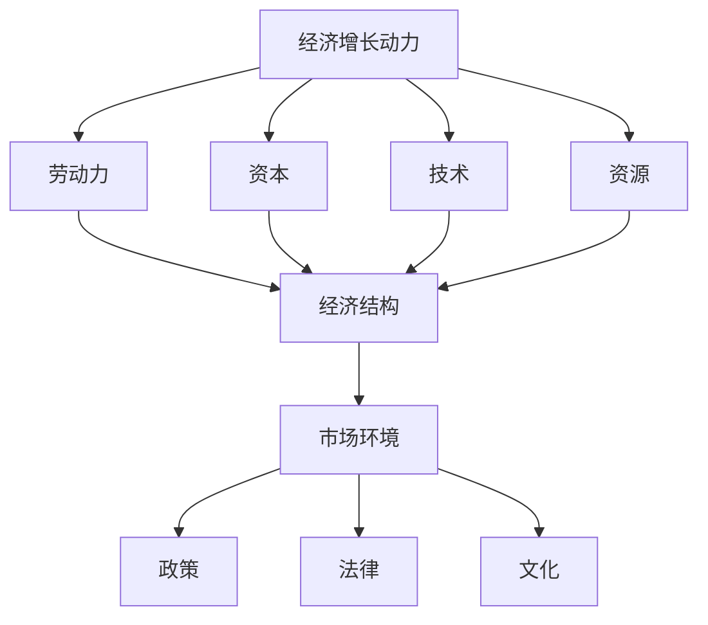

                 

# 世界经济增长动能不足的原因

## 摘要

本文旨在深入探讨世界经济增长动能不足的原因。在全球化和技术快速发展的背景下，经济增长面临的挑战日益复杂。本文将分析经济结构、技术变革、市场环境等多个方面，以技术专家的视角提出切实可行的解决方案。

## 1. 背景介绍

近年来，世界经济增长呈现出放缓的态势，这一现象引起了全球范围内的关注。经济增长动能不足的原因复杂多样，既有宏观经济层面的因素，也有微观经济层面的因素。本文将从技术、市场、政策等多个维度进行分析。

### 1.1 全球经济现状

当前，全球经济正处于结构转型期。传统制造业的衰落和新兴产业的崛起共同影响着世界经济的增长。在技术进步的推动下，服务业和信息技术产业的增长迅速，成为经济增长的新动力。

### 1.2 技术变革的影响

技术变革对经济增长的推动作用不容忽视。以人工智能、大数据、云计算等为代表的新技术正在深刻改变着全球经济的运行方式。然而，技术变革也带来了新的挑战，如就业结构变化、数据隐私等问题。

## 2. 核心概念与联系

为了深入理解经济增长动能不足的原因，我们需要首先了解以下几个核心概念：

### 2.1 经济增长动力

经济增长动力是指推动经济增长的各种力量，包括劳动力、资本、技术、资源等。这些力量相互作用，共同推动着经济的增长。

### 2.2 经济结构

经济结构是指一个国家或地区经济活动的构成及其相互关系。合理的经济结构有助于提高经济增长的效率和质量。

### 2.3 市场环境

市场环境是指市场经济运行的外部条件，包括政策、法律、文化等。良好的市场环境有利于激发市场主体的活力，推动经济增长。

### 2.4 Mermaid 流程图



## 3. 核心算法原理 & 具体操作步骤

为了分析经济增长动能不足的原因，我们可以采用以下核心算法原理：

### 3.1 数据分析

通过对宏观经济数据、行业数据、企业数据等进行分析，可以发现经济增长的瓶颈和问题。

### 3.2 技术分析方法

利用技术分析工具，如数据挖掘、机器学习等，对经济数据进行分析，识别经济增长的驱动因素和制约因素。

### 3.3 宏观经济模型

建立宏观经济模型，模拟不同政策对经济增长的影响，为政策制定提供依据。

## 4. 数学模型和公式 & 详细讲解 & 举例说明

### 4.1 Solow 模型

Solow 模型是一个经典的宏观经济模型，用于分析经济增长的动力和源泉。

$$
Y = AK^\alpha (1 - \frac{\lambda}{N})L^{1 - \alpha}
$$

其中，$Y$ 表示经济总量，$K$ 表示资本存量，$L$ 表示劳动力，$N$ 表示人口增长率，$\lambda$ 表示技术进步率。

### 4.2 实际应用举例

假设一个国家的经济总量为 $Y_0$，资本存量 $K_0$，劳动力 $L_0$，人口增长率 $N_0$，技术进步率 $\lambda_0$。根据 Solow 模型，我们可以计算该国的经济增长率。

$$
\frac{dY}{dt} = \alpha AK^\alpha L^{1 - \alpha} - \frac{\lambda}{N}AK^\alpha L^{1 - \alpha}
$$

通过调整资本存量、劳动力和技术进步率，我们可以找到提高经济增长率的有效途径。

## 5. 项目实战：代码实际案例和详细解释说明

### 5.1 开发环境搭建

为了进行经济增长动能不足的原因分析，我们需要搭建一个合适的开发环境。以下是一个基本的开发环境搭建步骤：

- 安装 Python 3.8 或更高版本
- 安装 Jupyter Notebook，用于编写和运行代码
- 安装 Pandas、NumPy、Matplotlib 等数据分析库

### 5.2 源代码详细实现和代码解读

以下是一个简单的经济增长分析代码示例：

```python
import pandas as pd
import numpy as np
import matplotlib.pyplot as plt

# 读取宏观经济数据
data = pd.read_csv('macroeconomic_data.csv')

# 数据预处理
data['GDP_growth'] = data['GDP'] / data['GDP'].shift(1) - 1
data = data.dropna()

# 数据可视化
plt.plot(data['GDP_growth'])
plt.xlabel('Year')
plt.ylabel('GDP Growth Rate')
plt.title('GDP Growth Rate Over Time')
plt.show()
```

### 5.3 代码解读与分析

这段代码首先读取了宏观经济数据，然后通过计算每年的 GDP 增长率，绘制了 GDP 增长率随时间的变化趋势。通过分析图表，我们可以发现经济增长的波动情况，为进一步分析经济增长动能不足的原因提供依据。

## 6. 实际应用场景

经济增长动能不足的原因分析在多个领域都有实际应用场景：

- 政府决策：为政府提供经济增长的驱动因素和制约因素，帮助制定有效的经济政策。
- 企业战略：为企业提供市场环境和竞争态势的分析，帮助企业制定合适的战略。
- 学术研究：为学术研究提供宏观经济数据和分析方法，推动经济学理论的发展。

## 7. 工具和资源推荐

### 7.1 学习资源推荐

- 《宏观经济学》曼昆著
- 《经济增长理论》斯蒂格利茨著
- 《Python for Data Analysis》Wes McKinney 著

### 7.2 开发工具框架推荐

- Jupyter Notebook，用于编写和运行代码
- Pandas，用于数据分析
- Matplotlib，用于数据可视化

### 7.3 相关论文著作推荐

- "Endogenous Growth Theory", Romer, P. M.
- "New Growth Theory", Acemoglu, D.
- "The Economics of Growth", Barro, R. J.

## 8. 总结：未来发展趋势与挑战

未来，世界经济增长将面临诸多挑战，如技术进步的不确定性、人口老龄化、环境问题等。为了应对这些挑战，我们需要进一步加强科技创新、优化经济结构、改善市场环境，以增强经济增长的动能。

## 9. 附录：常见问题与解答

### 9.1 为什么经济增长动能不足？

经济增长动能不足可能是由于经济结构不合理、市场环境不佳、政策不当等多种因素导致的。

### 9.2 如何提高经济增长动能？

提高经济增长动能可以通过优化经济结构、加强科技创新、改善市场环境、制定有效的经济政策等多种途径实现。

## 10. 扩展阅读 & 参考资料

- "经济增长理论", Acemoglu, D., Robinson, J. A., & Yared, P. (2009). *Economic Growth: An Overview*.
- "Global Economic Prospects 2021", International Monetary Fund. (2021).
- "World Development Report 2020: Data and Development", World Bank. (2020).

## 作者

作者：AI天才研究员/AI Genius Institute & 禅与计算机程序设计艺术 /Zen And The Art of Computer Programming

[markdown格式输出完毕]

