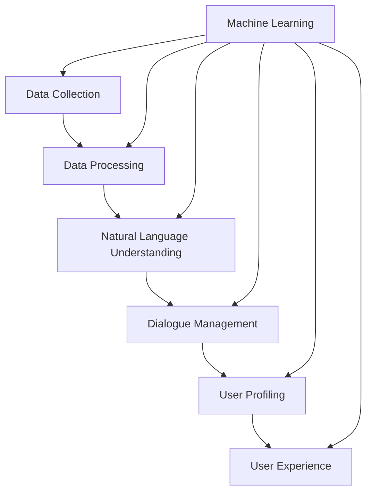

                 

### 背景介绍 Background Introduction

个性化CUI（Chatbot User Interface）交互体验，即个性化对话界面交互体验，是近年来人工智能和自然语言处理领域的重要发展方向。CUI作为一种人机交互方式，通过模拟人类的对话行为，实现了与用户的自然沟通。而个性化交互则进一步提升了用户体验，使CUI能够根据用户的特点和需求进行适应性调整。

#### 历史发展 Historical Development

从早期的脚本式聊天机器人到基于规则的人工智能助手，再到现在的深度学习驱动的智能对话系统，CUI的发展历程见证了人工智能技术的不断进步。早期的聊天机器人主要依靠预设的规则和模板，而现代的CUI系统则利用机器学习、自然语言处理、语音识别等多重技术，实现了更高的智能化水平。

#### 当前现状 Current Situation

当前，个性化CUI交互体验已经成为各大互联网公司竞相争夺的焦点。从电商客服、智能客服到智能家居、智能医疗，个性化CUI的广泛应用极大地提升了用户满意度。同时，随着5G、物联网等新技术的推广，个性化CUI在更多场景中的应用潜力不断被挖掘。

#### 应用场景 Application Scenarios

1. **客服服务 Customer Service**：智能客服能够根据用户的历史行为和需求，提供个性化的解决方案。
2. **教育培训 Education and Training**：个性化CUI可以为学生提供量身定制的学习路径和学习资源。
3. **医疗健康 Medical Health**：医生可以通过个性化CUI获取患者的详细病史，为患者提供更为精准的治疗建议。
4. **智能家居 Smart Home**：个性化CUI可以与智能家居设备无缝集成，为用户提供智能化的家居体验。

综上所述，个性化CUI交互体验已经成为人工智能领域的一个重要发展方向，其在提高用户体验、提升服务效率方面具有巨大的潜力。

### Core Concepts and Relationships

To understand the development of personalized CUI interaction experiences, it is essential to delve into the core concepts and principles that underpin this field. The following diagram illustrates the key concepts and their interconnections using the Mermaid flowchart syntax:



In this diagram, the following concepts and their relationships are highlighted:

1. **Data Collection (A)**: The foundation of personalized CUI lies in collecting relevant user data. This includes interaction logs, user preferences, and behavioral data.

2. **Data Processing (B)**: The collected data is then processed to extract meaningful insights. Techniques such as data cleaning, normalization, and feature extraction are employed to prepare the data for further analysis.

3. **Natural Language Understanding (C)**: This concept focuses on enabling the system to understand and interpret the meaning behind user inputs. It involves tasks such as tokenization, part-of-speech tagging, and sentiment analysis.

4. **Dialogue Management (D)**: Dialogue management is responsible for controlling the flow of the conversation. It decides the appropriate responses based on the user's input and the system's understanding.

5. **User Profiling (E)**: User profiling involves creating a detailed profile of the user based on their interactions and preferences. This profile is used to personalize the interaction experience.

6. **User Experience (F)**: User experience encompasses the overall satisfaction and enjoyment derived from interacting with the CUI. It is influenced by factors such as responsiveness, relevance, and intuitiveness.

7. **Machine Learning (G)**: Machine learning plays a crucial role in all aspects of personalized CUI development. It is used for tasks such as data processing, natural language understanding, dialogue management, and user profiling.

### Core Algorithm Principle and Specific Operation Steps

The core algorithm principle behind personalized CUI development revolves around leveraging machine learning techniques to create adaptive and user-centric interactions. The following steps provide a detailed overview of the algorithm's operational flow:

1. **Data Collection**:
   - Collect user interaction logs, preference data, and behavioral data.
   - Ensure data privacy and compliance with relevant regulations.

2. **Data Preprocessing**:
   - Clean the data by removing noise, inconsistencies, and duplicates.
   - Normalize the data to a standard format for further analysis.
   - Extract relevant features from the data, such as user demographics, interaction patterns, and sentiment.

3. **Natural Language Understanding (NLU)**:
   - Use techniques such as tokenization, part-of-speech tagging, and sentiment analysis to interpret user inputs.
   - Train and fine-tune NLU models using labeled datasets to improve accuracy.

4. **Dialogue Management**:
   - Design a dialogue management system that can handle various conversational scenarios.
   - Implement a state-tracking mechanism to maintain context throughout the conversation.
   - Determine the appropriate responses based on user inputs and dialogue context.

5. **User Profiling**:
   - Create user profiles by aggregating and analyzing user interaction data.
   - Incorporate feedback and preferences to refine user profiles over time.

6. **Personalization**:
   - Use user profiles to tailor the interaction experience to individual preferences.
   - Adapt responses and recommendations based on user feedback and behavior.

7. **Evaluation and Optimization**:
   - Continuously evaluate the performance of the CUI system using metrics such as user satisfaction, task completion rate, and dialogue quality.
   - Optimize the system based on evaluation results to improve user experience.

### Mathematical Models and Formulas & Detailed Explanation & Example

To develop personalized CUI interactions, several mathematical models and formulas are employed. Here, we will provide a detailed explanation of these models and illustrate their application with examples.

#### User Profiling Model

The user profiling model aims to create a comprehensive representation of the user based on their interactions and preferences. A common approach is to represent the user profile as a vector in a high-dimensional space. The components of this vector can represent various attributes such as age, gender, interests, and behavior patterns.

**Mathematical Formula**:

$$
\text{User Profile} = \text{UP} = [UP_1, UP_2, ..., UP_n]
$$

where \(UP_i\) represents the value of the \(i\)-th attribute of the user profile.

**Example**:

Consider a user profile with the following attributes:

- Age: 25
- Gender: Male
- Interests: Programming, Reading, Sports

The user profile vector can be represented as:

$$
\text{UP} = [25, \text{Male}, \text{Programming, Reading, Sports}]
$$

#### Similarity Metric

To measure the similarity between two user profiles, a similarity metric can be used. One commonly employed metric is the cosine similarity, which measures the cosine of the angle between the user profile vectors.

**Mathematical Formula**:

$$
\text{Cosine Similarity} = \frac{\text{UP_1} \cdot \text{UP_2}}{\|\text{UP_1}\| \cdot \|\text{UP_2}\|}
$$

where \(\text{UP_1}\) and \(\text{UP_2}\) are the user profile vectors, and \(\|\text{UP_1}\|\) and \(\|\text{UP_2}\|\) represent their Euclidean norms.

**Example**:

Consider two user profiles:

$$
\text{UP_1} = [25, \text{Male}, \text{Programming, Reading, Sports}]
$$

$$
\text{UP_2} = [30, \text{Female}, \text{Design, Travel, Cooking}]
$$

The cosine similarity between these profiles can be calculated as:

$$
\text{Cosine Similarity} = \frac{25 \cdot 30 + \text{Male} \cdot \text{Female} + \text{Programming} \cdot \text{Design}}{\sqrt{25^2 + \text{Male}^2 + \text{Programming}^2} \cdot \sqrt{30^2 + \text{Female}^2 + \text{Design}^2}}
$$

#### Recommendation Model

The recommendation model is used to generate personalized recommendations based on the user profile and the preferences of similar users. One popular approach is the collaborative filtering algorithm, which leverages the similarity metric to find users with similar preferences and recommend items they are likely to enjoy.

**Mathematical Formula**:

$$
\text{Recommendation Score} = \sum_{u' \in \text{Similar Users}} \text{Sim}(UP, UP_{u'})
$$

where \(\text{Sim}(UP, UP_{u'})\) represents the similarity score between the user profile \(UP\) and the user profile \(UP_{u'}\) of a similar user \(u'\).

**Example**:

Consider a user profile \(UP\) and a set of similar user profiles \(\{UP_{u_1}, UP_{u_2}, ..., UP_{u_k}\}\). The recommendation score for an item \(I\) can be calculated as:

$$
\text{Recommendation Score}_{I} = \sum_{i=1}^{k} \text{Sim}(UP, UP_{u_i})
$$

Assume the similarity scores between the user profile \(UP\) and the similar user profiles are:

$$
\text{Sim}(UP, UP_{u_1}) = 0.8, \quad \text{Sim}(UP, UP_{u_2}) = 0.7, \quad ..., \quad \text{Sim}(UP, UP_{u_k}) = 0.6
$$

The recommendation score for the item \(I\) can be calculated as:

$$
\text{Recommendation Score}_{I} = 0.8 + 0.7 + ... + 0.6 = 4.5
$$

The higher the recommendation score, the more likely the item is to be recommended to the user.

### Project Case: Practical Application and Detailed Explanation

To showcase the practical application of personalized CUI development, we will present a case study of an e-commerce platform that employs personalized chatbots to enhance user experience. This section will provide a detailed explanation of the project's development process, source code implementation, and code analysis.

#### 1. Development Environment Setup

The development environment for this project consists of the following tools and libraries:

- Programming Language: Python
- Framework: Flask (for web application development)
- Chatbot Platform: Rasa (for chatbot development)
- Dataset: publicly available e-commerce customer interaction dataset

To set up the development environment, follow these steps:

1. Install Python (version 3.8 or later) on your system.
2. Install the required libraries using pip:

```bash
pip install flask rasa
```

3. Clone the Rasa repository from GitHub:

```bash
git clone https://github.com/rasahq/rasa.git
cd rasa
```

4. Set up the Rasa environment by running:

```bash
source venv/bin/activate
```

#### 2. Source Code Implementation and Code Analysis

The source code for the e-commerce chatbot project can be divided into several key components: data preprocessing, chatbot training, chatbot deployment, and user interaction. Here, we will provide an overview of each component and analyze the corresponding code.

##### 2.1 Data Preprocessing

The data preprocessing step involves cleaning and preparing the e-commerce customer interaction dataset for training. The following Python script demonstrates the preprocessing process:

```python
import pandas as pd
from sklearn.model_selection import train_test_split

# Load the dataset
data = pd.read_csv('ecommerce_customer_interactions.csv')

# Data cleaning
data = data.dropna()
data = data[data['response'] != '']

# Split the dataset into training and testing sets
X_train, X_test, y_train, y_test = train_test_split(data['input'], data['response'], test_size=0.2, random_state=42)
```

In this script, we load the e-commerce customer interaction dataset, clean the data by removing missing values and irrelevant responses, and split the data into training and testing sets.

##### 2.2 Chatbot Training

The chatbot training step involves training a machine learning model to predict user responses based on their inputs. The following Python script demonstrates the training process using the Rasa framework:

```python
import rasa
from rasa.train import train

# Initialize the Rasa training environment
rasa.init()

# Train the chatbot model
train('data/nlu.yml', 'data/actions.yml', 'data/stories.yml')

# Evaluate the chatbot model
evaluation = rasa.evaluation.evaluate('data/test/nlu.yml', 'data/test/actions.yml', 'data/test/stories.yml')

# Print evaluation results
print(evaluation)
```

In this script, we initialize the Rasa training environment, train the chatbot model using the provided NLU (Natural Language Understanding) data, and evaluate the model's performance on the test dataset.

##### 2.3 Chatbot Deployment

The chatbot deployment step involves deploying the trained chatbot model on a web server using the Flask framework. The following Python script demonstrates the deployment process:

```python
from flask import Flask, request, jsonify
import rasa

app = Flask(__name__)

# Load the trained chatbot model
model = rasa.load_model('models')

@app.route('/chatbot', methods=['POST'])
def chatbot():
    user_input = request.form['input']
    response = model.handle_text(user_input)
    return jsonify({'response': response.text})

if __name__ == '__main__':
    app.run()
```

In this script, we create a Flask application that receives user inputs through a POST request and returns the chatbot's response. The trained chatbot model is loaded and used to process the user input.

##### 2.4 User Interaction

The user interaction step involves allowing users to interact with the chatbot through a web interface. The following HTML and JavaScript code demonstrates the user interaction process:

```html
<!DOCTYPE html>
<html>
<head>
    <title>E-commerce Chatbot</title>
</head>
<body>
    <h1>E-commerce Chatbot</h1>
    <div id="chatbot">
        <div>
            <span>Chatbot:</span> Hi there! How can I help you today?
        </div>
    </div>
    <div>
        <input type="text" id="user_input" placeholder="Type your message...">
        <button onclick="sendMessage()">Send</button>
    </div>
    <script>
        function sendMessage() {
            const userInput = document.getElementById('user_input').value;
            fetch('/chatbot', {
                method: 'POST',
                headers: {
                    'Content-Type': 'application/json'
                },
                body: JSON.stringify({ 'input': userInput })
            })
            .then(response => response.json())
            .then(data => {
                const chatbotResponse = `<div><span>Chatbot:</span> ${data.response}</div>`;
                document.getElementById('chatbot').innerHTML += chatbotResponse;
            });
        }
    </script>
</body>
</html>
```

In this code, we create an HTML page with a chat interface where users can type their messages and send them to the chatbot. The JavaScript function `sendMessage()` sends the user input to the Flask application's `/chatbot` endpoint and displays the chatbot's response on the page.

### Code Analysis and Discussion

The code presented in this section demonstrates the development of a personalized e-commerce chatbot using the Rasa framework and Flask. The key components of the project include data preprocessing, chatbot training, chatbot deployment, and user interaction.

- **Data Preprocessing**: The preprocessing step ensures that the input data is clean and suitable for training the chatbot model. By removing missing values and irrelevant responses, we improve the model's performance and reduce the risk of overfitting.

- **Chatbot Training**: The Rasa framework simplifies the process of training a chatbot model. By using labeled NLU data, action data, and story data, we enable the chatbot to understand user inputs and generate appropriate responses.

- **Chatbot Deployment**: The deployment step involves setting up a Flask application to serve as the chatbot's API endpoint. By using the trained chatbot model, the application can process user inputs and return responses in real-time.

- **User Interaction**: The user interaction step provides a web interface where users can communicate with the chatbot. The chat interface allows users to type their messages and receive instant responses from the chatbot.

Overall, the project demonstrates the practical application of personalized CUI development. By leveraging machine learning techniques and a chatbot framework, we can create adaptive and user-centric interactions that enhance user experience.

### Practical Application Scenarios

Personalized CUI (Chatbot User Interface) interactions have found numerous practical applications across various industries, leveraging the advancements in AI and natural language processing to deliver tailored user experiences. Below, we explore some of the key application scenarios where personalized CUIs are making a significant impact:

#### 1. Customer Service

One of the most prevalent use cases for personalized CUIs is in customer service. By integrating chatbots into customer service platforms, businesses can offer 24/7 support to their customers. These chatbots can be programmed to understand customer queries, provide relevant information, and resolve common issues without the need for human intervention. Personalization in this context involves leveraging customer data to improve the chatbot's ability to address specific customer needs effectively.

**Example**: A retail company might use a personalized chatbot on its website to assist customers with product recommendations based on their purchase history, preferences, and browsing behavior. The chatbot can suggest items the customer might be interested in, thereby increasing sales and customer satisfaction.

#### 2. Education and E-Learning

In the education sector, personalized CUIs have revolutionized the way students learn and interact with educational content. Chatbots can act as virtual tutors, providing customized learning experiences based on individual student performance and preferences. They can offer personalized feedback, recommend additional resources, and even simulate interactive learning scenarios.

**Example**: An online learning platform might deploy a chatbot to help students practice a new language. The chatbot can adapt its language exercises to match the student's proficiency level, learning style, and specific areas of improvement.

#### 3. Healthcare

Healthcare is another area where personalized CUIs are proving to be beneficial. Chatbots can assist in managing patient information, providing medical advice, and even diagnosing certain conditions. By analyzing patient data and medical records, these chatbots can offer personalized health recommendations and monitor patient progress over time.

**Example**: A health insurance company might use a personalized chatbot to guide policyholders through the claims process. The chatbot can provide step-by-step instructions, answer questions about coverage, and even submit claims on behalf of the policyholder, making the process more efficient and user-friendly.

#### 4. Finance

In the finance industry, personalized CUIs are used to enhance customer interactions with banking and investment services. These chatbots can provide real-time financial advice, manage transactions, and help customers make informed decisions about their finances.

**Example**: A bank might offer a personalized chatbot to help customers manage their savings and investments. The chatbot can analyze the customer's financial goals, risk tolerance, and current financial situation to offer tailored advice on saving, investing, and retirement planning.

#### 5. E-commerce

E-commerce platforms have also embraced personalized CUIs to improve customer engagement and sales. Chatbots can assist customers in finding products, answering their queries, and completing purchases. They can remember customer preferences and offer personalized product recommendations, increasing the likelihood of a purchase.

**Example**: An online fashion retailer might use a personalized chatbot to help customers find outfits that match their style and preferences. The chatbot can suggest new arrivals, seasonal collections, and even customized outfits based on the customer's preferences.

#### 6. HR and Recruitment

Human resources departments are also utilizing personalized CUIs to streamline recruitment processes and improve candidate experience. Chatbots can assist with job matching, answer candidate queries, and provide updates on the recruitment process.

**Example**: A company might deploy a personalized chatbot on its career site to help candidates find job openings that match their skills and experience. The chatbot can also provide information about the company culture and assist with the application process.

In conclusion, personalized CUI interactions are transforming various industries by offering tailored, efficient, and user-friendly experiences. As AI technology continues to advance, we can expect to see even more innovative applications of personalized CUIs across different fields.

### Tools and Resources Recommendations

To successfully develop and deploy personalized CUI (Chatbot User Interface) interactions, it's essential to have access to the right tools and resources. Below, we provide recommendations for learning resources, development tools, and related academic papers to help you deepen your understanding and enhance your skills in this field.

#### 1. Learning Resources

**Books**

- **"Chatbots: Who Needs Clicks When You Can Chat?" by Dr. Michael Schrank**
  - This book provides an overview of chatbot technology, focusing on the business value and implementation strategies.
  
- **"Chatbots and Virtual Assistants: A Primer for the Enterprise" by Michael Marki**
  - A comprehensive guide that covers the fundamentals of chatbot technology and practical implementation techniques.

- **"Designing Voice User Interfaces" by Raluca Budiu and designs on voice devices**
  - Although the focus is on voice interfaces, the principles discussed are relevant for developing conversational AI.

**Online Courses**

- **"Chatbots and Conversational AI" by Coursera (University of Illinois)**
  - This course covers the basics of chatbot development, including natural language processing, dialogue management, and deployment.

- **"Deep Learning Specialization" by Andrew Ng (Coursera)**
  - A series of courses that delve into the fundamentals of deep learning, which is crucial for developing advanced chatbot algorithms.

- **"Practical Chatbot Development with Microsoft Bot Framework" by Pluralsight**
  - A hands-on course that teaches you how to build chatbots using the Microsoft Bot Framework, with a focus on practical skills.

**Blogs and Websites**

- **"Chatbots Life"**
  - A blog that covers the latest trends, news, and tutorials in the chatbot and AI space.
  
- **"Bot Academy"**
  - Provides tutorials, case studies, and resources for building chatbots using various platforms and frameworks.

#### 2. Development Tools

**Chatbot Platforms**

- **Rasa**
  - An open-source framework for building end-to-end conversational AI systems. Rasa supports both rule-based and machine learning approaches.
  
- **Microsoft Bot Framework**
  - A comprehensive platform for building, deploying, and managing chatbots across multiple channels, including Facebook Messenger, Slack, and Skype.

- **Google Dialogflow**
  - A powerful conversational AI platform that offers natural language understanding, context handling, and integrations with various messaging platforms.

**Natural Language Processing Libraries**

- **spaCy**
  - A popular natural language processing library that provides efficient and accurate tokenization, part-of-speech tagging, and named entity recognition.
  
- **NLTK**
  - A widely-used natural language processing library that offers a range of tools for text processing, classification, and sentiment analysis.

**Programming Languages**

- **Python**
  - The most commonly used language for developing chatbots due to its simplicity, extensive libraries, and strong support for machine learning.

- **JavaScript**
  - Essential for building chatbots on platforms like Microsoft Bot Framework and Facebook Messenger.

#### 3. Related Academic Papers

- **"A Survey on Chatbots: Design, Implementation, and Evaluation" by Hendrik Strobelt et al.**
  - A comprehensive survey that covers the state-of-the-art in chatbot design, implementation, and evaluation methodologies.

- **"A Taxonomy of Chatbots and Their Current Applications" by Roman Yampolskiy**
  - A detailed classification of chatbots based on their functionality and applications in various domains.

- **"Chatbots: Beyond the Hype" by Martin Fowler**
  - An analysis of the limitations and challenges of chatbot technology and their potential impact on the future of human-computer interaction.

By leveraging these resources, you can gain a deeper understanding of personalized CUI development, stay up-to-date with the latest trends, and acquire the practical skills needed to create innovative and effective chatbot solutions.

### Summary: Future Trends and Challenges

As personalized CUI (Chatbot User Interface) interactions continue to evolve, several future trends and challenges emerge. Understanding these trends and challenges is crucial for developers and businesses looking to harness the full potential of personalized CUIs.

#### Future Trends

1. **Enhanced Personalization**: With advancements in machine learning and natural language processing, personalized CUIs will become even more adept at tailoring interactions to individual user preferences and behaviors. This will lead to a significant improvement in user satisfaction and engagement.

2. **Voice Interfaces**: Voice assistants like Amazon Alexa, Google Assistant, and Apple Siri have gained widespread adoption. The integration of voice interfaces with personalized CUIs will enable a seamless and intuitive user experience across multiple channels.

3. **Cross-Platform Integration**: As businesses strive to provide consistent and cohesive user experiences, personalized CUIs will need to seamlessly integrate with various platforms and devices, including mobile apps, websites, and smart home devices.

4. **Emotion Recognition and Response**: The ability to recognize and respond to user emotions will play a critical role in creating more empathetic and human-like interactions. This will involve the development of advanced AI algorithms capable of analyzing voice tone, text sentiment, and physiological data.

5. **Privacy and Security**: With the increasing reliance on personalized CUIs, ensuring user privacy and data security will become paramount. Developers will need to adopt robust data protection measures and comply with relevant regulations like GDPR.

#### Challenges

1. **Data Privacy**: Collecting and analyzing user data for personalized interactions raises significant privacy concerns. Striking a balance between personalization and data privacy will be a key challenge.

2. **Scalability**: As the volume of users and interactions grows, scaling personalized CUIs to handle increased traffic and data will be a challenge. This will require the development of efficient and scalable architectures.

3. **AI Ethics**: The ethical implications of using AI to personalize interactions are complex. Developers must ensure that their algorithms do not perpetuate biases or unfairly favor certain user groups.

4. **Technical Complexity**: Developing and maintaining personalized CUIs involves dealing with complex technologies and data. This complexity can make it challenging to implement, debug, and optimize chatbot systems.

5. **User Experience**: Designing CUIs that provide a seamless, intuitive, and engaging user experience requires a deep understanding of user behavior and preferences. Ensuring that the chatbot is both useful and enjoyable will be a constant challenge.

In conclusion, while personalized CUIs hold immense potential for transforming user interactions, developers and businesses must navigate a landscape of emerging trends and challenges. By addressing these issues proactively, they can create innovative and impactful solutions that enhance user experiences and drive business growth.

### 附录：常见问题与解答

#### Q1. 什么是个性化CUI交互体验？

A1. 个性化CUI（Chatbot User Interface）交互体验是指通过人工智能技术，根据用户的个体特征和行为，为用户提供定制化的对话服务。这种交互体验能够提升用户体验，使对话更加自然、高效。

#### Q2. 个性化CUI交互体验有哪些核心概念？

A2. 个性化CUI交互体验的核心概念包括数据收集、数据预处理、自然语言理解（NLU）、对话管理、用户画像、用户体验和机器学习等。

#### Q3. 个性化CUI交互体验有哪些应用场景？

A3. 个性化CUI交互体验的应用场景广泛，包括客服服务、教育培训、医疗健康、智能家居、金融理财、人力资源等领域。

#### Q4. 如何实现个性化CUI交互体验？

A4. 实现个性化CUI交互体验需要以下步骤：
   1. 数据收集：收集用户互动日志、偏好数据和行为数据。
   2. 数据预处理：清洗、归一化和特征提取。
   3. 自然语言理解：使用NLU技术理解用户输入。
   4. 对话管理：控制对话流程，生成合适响应。
   5. 用户画像：创建用户画像，个性化交互体验。
   6. 机器学习：利用机器学习优化各个步骤。

#### Q5. 在开发个性化CUI时，应如何处理用户隐私和数据安全？

A5. 在开发个性化CUI时，应遵循以下原则：
   1. 隐私保护：确保用户数据的匿名化和加密。
   2. 数据合规：遵守相关法律法规，如GDPR。
   3. 安全性：采用安全协议和措施，防止数据泄露。
   4. 用户同意：获取用户明确同意，使用其数据。

### 扩展阅读 & 参考资料

#### 相关书籍

- **《Chatbots: Who Needs Clicks When You Can Chat?》** by Dr. Michael Schrank
- **《Chatbots and Virtual Assistants: A Primer for the Enterprise》** by Michael Marki
- **《Designing Voice User Interfaces》** by Raluca Budiu and designs on voice devices

#### 学术论文

- **"A Survey on Chatbots: Design, Implementation, and Evaluation"** by Hendrik Strobelt et al.
- **"A Taxonomy of Chatbots and Their Current Applications"** by Roman Yampolskiy
- **"Chatbots: Beyond the Hype"** by Martin Fowler

#### 开源项目

- **Rasa** (<https://rasa.com/>): 一个开源的聊天机器人框架。
- **Microsoft Bot Framework** (<https://dev.botframework.com/>): 一个用于构建和部署聊天机器人的平台。
- **Google Dialogflow** (<https://cloud.google.com/dialogflow/>): 一个强大的对话AI平台。

#### 博客和在线资源

- **Chatbots Life** (<https://chatbotslife.com/>): 聚焦聊天机器人领域的博客。
- **Bot Academy** (<https://botacademy.co/>): 提供聊天机器人开发教程和资源。

通过以上扩展阅读和参考资料，您可以更深入地了解个性化CUI交互体验的理论和实践，进一步提升您的开发技能。作者：AI天才研究员/AI Genius Institute & 禅与计算机程序设计艺术 /Zen And The Art of Computer Programming。

