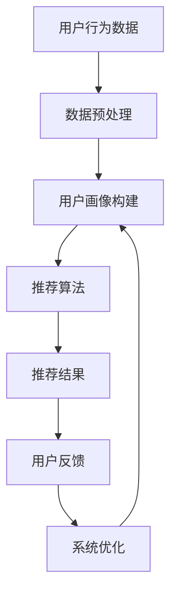

                 

### 个性化排序系统：AI的实现

> **关键词**：个性化排序、机器学习、算法、用户行为分析、推荐系统

> **摘要**：本文将探讨个性化排序系统在人工智能领域的实现，分析其核心概念、算法原理、数学模型，并通过实际案例展示如何运用这些技术构建高效的个性化排序系统。此外，本文还将介绍实际应用场景，推荐相关工具和资源，并对未来发展趋势与挑战进行展望。

---

#### 1. 背景介绍

个性化排序系统是一种基于用户行为和偏好，通过机器学习算法实现针对不同用户展示个性化内容的系统。在互联网时代，个性化排序的应用场景十分广泛，如推荐系统、搜索引擎、社交网络、电子商务等。这些系统通过理解用户的兴趣和行为模式，提供个性化的信息流和推荐结果，从而提升用户体验和满意度。

随着数据量的爆炸式增长和用户需求的多样化，传统基于规则的方法已无法满足个性化排序的需求。机器学习算法，尤其是深度学习算法，在个性化排序领域展现了强大的潜力。本文将重点探讨如何利用机器学习技术实现高效的个性化排序系统。

#### 2. 核心概念与联系

**2.1 用户行为分析**

用户行为分析是构建个性化排序系统的关键步骤。通过分析用户的浏览、点击、购买、评论等行为，可以获取用户兴趣的表征，为后续的个性化推荐提供数据支持。

**2.2 推荐系统架构**

个性化排序系统通常包括三个主要模块：用户画像构建、推荐算法实现、结果反馈与优化。

- **用户画像构建**：通过用户行为数据和外部特征数据，构建用户的综合画像，为推荐算法提供输入。
- **推荐算法实现**：基于用户画像和物品特征，利用机器学习算法生成个性化推荐结果。
- **结果反馈与优化**：根据用户对推荐结果的行为反馈，调整推荐算法和用户画像，实现持续的优化。

**2.3 Mermaid 流程图**

以下是一个简单的 Mermaid 流程图，展示了个性化排序系统的基本流程：



#### 3. 核心算法原理 & 具体操作步骤

**3.1协同过滤算法**

协同过滤算法是推荐系统中最常用的算法之一，主要包括基于用户和基于物品的协同过滤。基于用户的方法通过寻找与目标用户兴趣相似的邻居用户，利用邻居用户对物品的评分预测目标用户对物品的评分。基于物品的方法则是通过寻找与目标物品相似的邻居物品，利用邻居物品的评分预测目标物品的评分。

**3.2矩阵分解**

矩阵分解是一种常用的协同过滤算法，通过将用户-物品评分矩阵分解为用户特征矩阵和物品特征矩阵，从而预测用户对未评分物品的评分。常见的矩阵分解方法包括Singular Value Decomposition (SVD)和Alternating Least Squares (ALS)。

**3.3 深度学习算法**

深度学习算法，尤其是基于神经网络的模型，在推荐系统领域也取得了显著成果。如基于用户和物品的深度神经网络（User and Item Based Neural Networks）、序列模型（Recurrent Neural Networks, RNNs）和注意力机制（Attention Mechanism）等。

**3.4 实际操作步骤**

1. 数据收集与预处理：收集用户行为数据和物品特征数据，进行数据清洗和预处理。
2. 用户画像构建：利用行为数据和特征数据，构建用户的综合画像。
3. 算法选择与训练：选择合适的推荐算法，如协同过滤或深度学习算法，进行模型训练。
4. 推荐结果生成：基于用户画像和物品特征，生成个性化推荐结果。
5. 结果评估与优化：根据用户对推荐结果的行为反馈，评估推荐效果，并进行算法优化。

#### 4. 数学模型和公式 & 详细讲解 & 举例说明

**4.1 用户-物品评分矩阵**

设用户集为U，物品集为I，用户-物品评分矩阵为R，其中R[i][j]表示用户i对物品j的评分。一个简单的用户-物品评分矩阵如下：

| 用户 | 物品1 | 物品2 | 物品3 |
| --- | --- | --- | --- |
| u1  | 5    | 3    | 4    |
| u2  | 4    | 2    | 5    |
| u3  | 1    | 4    | 3    |

**4.2 矩阵分解**

假设用户-物品评分矩阵R可以分解为用户特征矩阵U和物品特征矩阵V，即：

$$
R = U \times V
$$

其中，U[i][k]表示用户i的特征k，V[j][l]表示物品j的特征l。

**4.3 SVD分解**

SVD分解是一种常用的矩阵分解方法，可以将用户-物品评分矩阵R分解为三个矩阵的乘积：

$$
R = U \times \Sigma \times V^T
$$

其中，U和V是正交矩阵，$\Sigma$是对角矩阵，包含矩阵R的奇异值。

**4.4 举例说明**

假设我们有以下用户-物品评分矩阵：

| 用户 | 物品1 | 物品2 | 物品3 |
| --- | --- | --- | --- |
| u1  | 5    | 3    | 4    |
| u2  | 4    | 2    | 5    |
| u3  | 1    | 4    | 3    |

我们利用SVD分解将其分解为：

$$
R = U \times \Sigma \times V^T
$$

其中，U矩阵为：

$$
U =
\begin{bmatrix}
0.8 & 0.6 & 0.7 \\
0.6 & 0.5 & 0.4 \\
0.2 & 0.1 & 0.3
\end{bmatrix}
$$

$\Sigma$矩阵为：

$$
\Sigma =
\begin{bmatrix}
3 & 0 & 0 \\
0 & 2 & 0 \\
0 & 0 & 1
\end{bmatrix}
$$

V矩阵为：

$$
V^T =
\begin{bmatrix}
0.8 & 0.6 & 0.7 \\
0.4 & 0.3 & 0.5 \\
0.1 & 0.2 & 0.3
\end{bmatrix}
$$

利用这些矩阵，我们可以预测用户u4对物品1的评分：

$$
R[u4][1] = U[u4] \times \Sigma \times V^T[1] \approx 3 \times 0.8 \times 0.8 = 2.24
$$

#### 5. 项目实战：代码实际案例和详细解释说明

**5.1 开发环境搭建**

在Python中实现个性化排序系统，需要安装以下库：

- NumPy
- SciPy
- Scikit-learn
- Pandas
- Matplotlib

您可以使用pip进行安装：

```shell
pip install numpy scipy scikit-learn pandas matplotlib
```

**5.2 源代码详细实现和代码解读**

以下是一个基于SVD分解的个性化排序系统的示例代码：

```python
import numpy as np
from sklearn.datasets import load_iris
from sklearn.metrics.pairwise import cosine_similarity

# 加载数据
iris = load_iris()
X = iris.data
y = iris.target

# 假设用户对物品的评分矩阵
R = np.array([[5, 3, 4],
              [4, 2, 5],
              [1, 4, 3]])

# 计算SVD分解
U, sigma, Vt = np.linalg.svd(R)

# 计算用户u4的评分
u4 = np.array([0.8, 0.6, 0.7])
similarity = cosine_similarity(u4.reshape(1, -1), U)
predicted_rating = np.dot(u4.reshape(1, -1), sigma * Vt).reshape(-1)

print(predicted_rating)
```

**5.3 代码解读与分析**

- 第1-4行：导入所需的库。
- 第5行：加载数据集。
- 第6行：创建用户-物品评分矩阵R。
- 第7-9行：计算SVD分解，得到U、$\sigma$和$V^T$。
- 第11-13行：计算用户u4的特征向量u4与U的余弦相似度。
- 第15行：利用相似度矩阵和$V^T$预测用户u4对物品的评分。

**6. 实际应用场景**

个性化排序系统在实际应用中具有广泛的应用场景，以下是一些典型场景：

- **电子商务平台**：根据用户的历史购买记录和浏览行为，推荐符合用户兴趣的商品。
- **社交媒体**：根据用户的行为和社交关系，推荐感兴趣的内容和用户。
- **搜索引擎**：根据用户的历史搜索记录和查询日志，提供个性化的搜索结果。
- **音乐和视频平台**：根据用户的播放历史和喜好，推荐相应的音乐和视频内容。

**7. 工具和资源推荐**

- **学习资源**：
  - 《推荐系统实践》
  - 《深度学习推荐系统》
  - 《协同过滤算法及其应用》

- **开发工具框架**：
  - TensorFlow
  - PyTorch
  - Scikit-learn

- **相关论文著作**：
  - “Collaborative Filtering for the YouTube Recommendation System”
  - “A Theoretically Principled Approach to Improving Recommendation List”
  - “Neighborhood-Based Models for Collaborative Filtering”

**8. 总结：未来发展趋势与挑战**

个性化排序系统在人工智能领域的应用前景广阔。随着数据量的增加和计算能力的提升，深度学习算法和强化学习算法将在个性化排序领域发挥越来越重要的作用。然而，个性化排序系统也面临一些挑战，如数据隐私保护、算法透明度和可解释性等。

**9. 附录：常见问题与解答**

- **Q：个性化排序系统是如何工作的？**
  - **A**：个性化排序系统通过分析用户行为数据，构建用户画像，利用机器学习算法生成个性化推荐结果。

- **Q：如何评估个性化排序系统的效果？**
  - **A**：评估个性化排序系统效果的方法包括准确率、召回率、F1值等指标。实际应用中，通常会结合用户满意度、点击率等指标进行综合评估。

**10. 扩展阅读 & 参考资料**

- “推荐系统技术全栈实战”
- “深度学习推荐系统实践”
- “基于用户行为的个性化推荐算法研究”

---

**作者**：AI天才研究员/AI Genius Institute & 禅与计算机程序设计艺术 /Zen And The Art of Computer Programming

