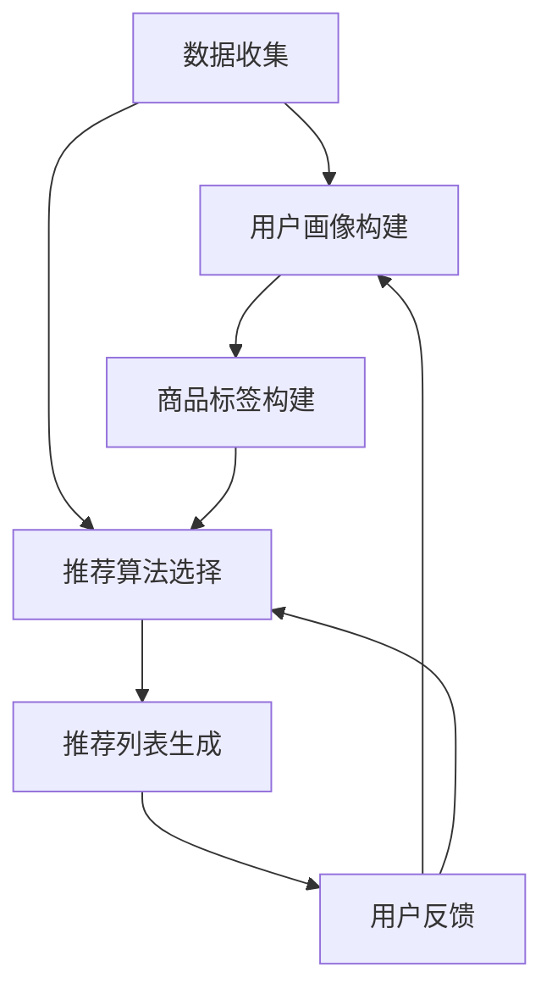

                 

### 背景介绍

个性化推荐系统作为大数据和人工智能领域的核心技术之一，已经成为现代商业活动中不可或缺的一环。其核心目标是通过分析用户的历史行为、偏好和特征，为用户推荐他们可能感兴趣的商品或服务，从而提升用户体验并提高销售转化率。

在电商行业，个性化推荐系统不仅能够帮助商家精准定位目标客户，还能通过智能化的推荐策略，提高用户的购物满意度和粘性。许多成功的企业，如亚马逊、淘宝和Netflix，都通过构建高效的个性化推荐系统，实现了显著的销售增长和用户满意度提升。

本文将深入探讨个性化推荐系统如何提升销售转化率，首先介绍核心概念和联系，然后详细解析核心算法原理和数学模型，并通过实际项目案例进行代码解读和分析，最后探讨实际应用场景和未来发展趋势。

通过本文的阅读，您将了解：

1. **个性化推荐系统的基本概念和组成部分**：包括推荐引擎、用户画像、商品标签等。
2. **推荐算法的基本原理**：从协同过滤、基于内容的推荐到深度学习推荐方法。
3. **数学模型和公式**：如何通过统计和机器学习技术构建推荐模型。
4. **项目实战**：如何在实际项目中搭建个性化推荐系统并进行代码实现。
5. **实际应用场景**：个性化推荐系统在不同行业中的应用案例。
6. **未来发展趋势与挑战**：个性化推荐系统面临的新机遇和挑战。

### 2. 核心概念与联系

#### 推荐引擎（Recommendation Engine）

推荐引擎是个性化推荐系统的核心组件，负责根据用户的历史行为、偏好和其他相关特征生成推荐列表。推荐引擎的工作原理通常包括数据收集、用户画像构建、推荐算法选择和推荐列表生成等步骤。

**数据收集**：推荐引擎需要从多个数据源收集用户行为数据，如浏览记录、购买历史、评分数据等。

**用户画像构建**：通过分析用户行为数据和特征，构建用户的综合画像，用于后续的推荐算法。

**推荐算法选择**：根据业务需求和数据特点选择合适的推荐算法，如协同过滤、基于内容的推荐等。

**推荐列表生成**：基于用户画像和推荐算法，生成个性化的推荐列表。

#### 用户画像（User Profile）

用户画像是对用户特征和偏好的抽象表示，通常包括用户的基本信息、行为特征、偏好信息等。用户画像的构建是推荐系统的关键步骤，直接影响推荐效果的准确性。

**基本信息**：如性别、年龄、地理位置等。

**行为特征**：如浏览记录、购买历史、评分记录等。

**偏好信息**：如兴趣标签、收藏夹、喜好程度等。

#### 商品标签（Item Tag）

商品标签是描述商品特征和属性的一种方式，用于基于内容的推荐算法。商品标签可以包括商品的分类、品牌、价格、颜色等。

**分类**：如电子产品、服装、家居等。

**品牌**：如苹果、华为、耐克等。

**价格**：如高、中、低等。

**颜色**：如红、蓝、黑等。

#### Mermaid 流程图

以下是一个简化的推荐系统流程图，展示各个核心组件之间的联系：



在推荐系统中，用户画像和商品标签的构建是推荐算法选择和推荐列表生成的关键依据。而用户反馈则可以用于进一步优化用户画像和推荐算法，形成一个闭环反馈机制。

### 3. 核心算法原理 & 具体操作步骤

#### 协同过滤（Collaborative Filtering）

协同过滤是推荐系统中最常用的算法之一，分为基于用户的协同过滤（User-based Collaborative Filtering）和基于物品的协同过滤（Item-based Collaborative Filtering）。

**基于用户的协同过滤**：

1. **找到相似用户**：根据用户的历史行为和偏好，找到与当前用户相似的其他用户。
2. **计算相似度**：使用余弦相似度、皮尔逊相关系数等方法计算相似度。
3. **推荐物品**：为当前用户推荐与相似用户有共同兴趣的物品。

**基于物品的协同过滤**：

1. **找到相似物品**：根据物品的特征和属性，找到与当前物品相似的物品。
2. **计算相似度**：使用余弦相似度、Jaccard相似度等方法计算相似度。
3. **推荐用户**：为当前用户推荐喜欢相似物品的用户。

**具体操作步骤**：

1. 数据预处理：清洗和预处理用户行为数据，如用户评分数据、购买历史数据等。
2. 建立用户-物品矩阵：将用户和物品表示为一个矩阵，矩阵的元素表示用户对物品的评分或行为。
3. 计算相似度：根据用户或物品的特征，计算用户之间的相似度或物品之间的相似度。
4. 生成推荐列表：为每个用户生成一个推荐列表，列出相似用户或物品共同喜欢的物品。

#### 基于内容的推荐（Content-based Recommendation）

基于内容的推荐方法通过分析物品的特征和属性，为用户推荐与其兴趣相似的物品。

**具体操作步骤**：

1. 提取物品特征：从商品描述、分类、标签等属性中提取特征。
2. 构建用户兴趣模型：根据用户的历史行为和偏好，构建用户的兴趣模型。
3. 计算相似度：计算用户兴趣模型与物品特征之间的相似度。
4. 生成推荐列表：为用户推荐相似度较高的物品。

#### 深度学习推荐（Deep Learning-based Recommendation）

深度学习推荐方法利用神经网络模型，通过学习和预测用户行为数据，生成个性化的推荐列表。

**常用深度学习模型**：

1. **协同过滤网络（Collaborative Filtering Networks，CFN）**
2. **图神经网络（Graph Neural Networks，GNN）**
3. **基于注意力机制的模型（Attention-based Models）**
4. **多任务学习模型（Multi-Task Learning Models）**

**具体操作步骤**：

1. 数据预处理：清洗和预处理用户行为数据，如用户评分数据、购买历史数据等。
2. 建立输入特征：将用户、物品和用户行为数据转换为神经网络可处理的特征。
3. 选择模型架构：根据业务需求和数据特点，选择合适的深度学习模型架构。
4. 训练模型：使用训练数据训练模型，调整模型参数。
5. 预测和生成推荐列表：使用训练好的模型对用户行为进行预测，生成个性化的推荐列表。

通过上述核心算法原理和具体操作步骤，我们可以构建一个高效的个性化推荐系统，提升销售转化率。接下来，我们将通过实际项目案例进行代码解读和分析，进一步了解个性化推荐系统的实现细节。

### 4. 数学模型和公式 & 详细讲解 & 举例说明

在个性化推荐系统中，数学模型和公式扮演着至关重要的角色。通过数学模型，我们可以量化用户行为和物品特征之间的关系，从而实现有效的推荐。本节将详细讲解几种常用的数学模型和公式，并通过具体例子来说明其应用。

#### 1. 余弦相似度（Cosine Similarity）

余弦相似度是一种衡量两个向量夹角余弦值的相似度度量方法。在推荐系统中，余弦相似度常用于计算用户与用户、用户与物品之间的相似度。

**公式**：
\[ \text{Similarity}(u, v) = \frac{\sum_{i=1}^{n} u_i \cdot v_i}{\sqrt{\sum_{i=1}^{n} u_i^2} \sqrt{\sum_{i=1}^{n} v_i^2}} \]

其中，\( u \) 和 \( v \) 分别表示两个向量的元素。

**例子**：

假设有两个用户 A 和 B，他们的评分数据如下：

用户 A：
\[ \{1, 2, 0, 3, 4\} \]

用户 B：
\[ \{0, 3, 1, 2, 4\} \]

计算用户 A 和 B 之间的余弦相似度：

\[ \text{Similarity}(A, B) = \frac{1 \cdot 0 + 2 \cdot 3 + 0 \cdot 1 + 3 \cdot 2 + 4 \cdot 4}{\sqrt{1^2 + 2^2 + 0^2 + 3^2 + 4^2} \sqrt{0^2 + 3^2 + 1^2 + 2^2 + 4^2}} \]

\[ = \frac{0 + 6 + 0 + 6 + 16}{\sqrt{1 + 4 + 0 + 9 + 16} \sqrt{0 + 9 + 1 + 4 + 16}} \]

\[ = \frac{22}{\sqrt{30} \sqrt{30}} \]

\[ = \frac{22}{30} \]

\[ \approx 0.7333 \]

#### 2. 皮尔逊相关系数（Pearson Correlation Coefficient）

皮尔逊相关系数是衡量两个变量线性相关程度的统计指标。在推荐系统中，皮尔逊相关系数常用于评估用户之间的相关性。

**公式**：
\[ \text{Correlation}(u, v) = \frac{\sum_{i=1}^{n} (u_i - \bar{u})(v_i - \bar{v})}{\sqrt{\sum_{i=1}^{n} (u_i - \bar{u})^2} \sqrt{\sum_{i=1}^{n} (v_i - \bar{v})^2}} \]

其中，\( \bar{u} \) 和 \( \bar{v} \) 分别表示用户 A 和 B 的平均值。

**例子**：

使用之前用户 A 和 B 的评分数据，计算他们的皮尔逊相关系数：

\[ \bar{u} = \frac{1 + 2 + 0 + 3 + 4}{5} = 2 \]

\[ \bar{v} = \frac{0 + 3 + 1 + 2 + 4}{5} = 2 \]

\[ \text{Correlation}(A, B) = \frac{(1 - 2)(0 - 2) + (2 - 2)(3 - 2) + (0 - 2)(1 - 2) + (3 - 2)(2 - 2) + (4 - 2)(4 - 2)}{\sqrt{(1 - 2)^2 + (2 - 2)^2 + (0 - 2)^2 + (3 - 2)^2 + (4 - 2)^2} \sqrt{(0 - 2)^2 + (3 - 2)^2 + (1 - 2)^2 + (2 - 2)^2 + (4 - 2)^2}} \]

\[ = \frac{(-1)(-2) + (0)(1) + (-2)(-1) + (1)(0) + (2)(2)}{\sqrt{1 + 0 + 4 + 1 + 4} \sqrt{4 + 1 + 1 + 0 + 4}} \]

\[ = \frac{2 + 0 + 2 + 0 + 4}{\sqrt{10} \sqrt{10}} \]

\[ = \frac{8}{10} \]

\[ = 0.8 \]

#### 3. 逻辑回归（Logistic Regression）

逻辑回归是一种常用的分类模型，可以用于预测用户对物品的喜好程度。在推荐系统中，逻辑回归可以用来判断用户是否会对某个物品产生兴趣。

**公式**：
\[ \text{P}(y=1) = \frac{1}{1 + e^{-(\beta_0 + \beta_1x_1 + \beta_2x_2 + \ldots + \beta_nx_n)}} \]

其中，\( \beta_0, \beta_1, \ldots, \beta_n \) 是模型的参数，\( x_1, x_2, \ldots, x_n \) 是输入特征。

**例子**：

假设我们有一个简单的逻辑回归模型，用于预测用户对某个商品是否感兴趣。输入特征包括用户的年龄、收入和购买历史。模型参数如下：

\[ \beta_0 = 0, \beta_1 = 0.1, \beta_2 = 0.2, \beta_3 = 0.3 \]

用户的信息如下：

年龄：25
收入：5000
购买历史：5次

计算用户对商品感兴趣的概率：

\[ \text{P}(y=1) = \frac{1}{1 + e^{-(0 + 0.1 \cdot 25 + 0.2 \cdot 5000 + 0.3 \cdot 5)}} \]

\[ = \frac{1}{1 + e^{-6.5}} \]

\[ \approx \frac{1}{1 + 0.00248} \]

\[ \approx \frac{1}{1.00248} \]

\[ \approx 0.99752 \]

这意味着用户对商品感兴趣的概率非常高。

通过上述数学模型和公式的讲解，我们可以看到推荐系统如何通过量化用户行为和物品特征之间的关系，生成个性化的推荐列表。在实际应用中，这些模型和公式需要结合具体业务需求和数据特点进行优化和调整，以达到最佳的推荐效果。

### 5. 项目实战：代码实际案例和详细解释说明

#### 5.1 开发环境搭建

为了演示个性化推荐系统的实际实现，我们选择使用Python编程语言，并利用一些流行的机器学习和数据科学库，如scikit-learn、pandas和numpy。以下是搭建开发环境所需的步骤：

1. **安装Python**：确保系统上已经安装了Python 3.6及以上版本。
2. **安装必要的库**：使用pip命令安装以下库：

   ```bash
   pip install scikit-learn pandas numpy matplotlib
   ```

3. **创建项目目录**：在合适的位置创建一个项目目录，如`recommender_system`，并在其中创建一个名为`recommender.py`的Python文件。

现在，我们的开发环境已经搭建完成，可以开始编写代码。

#### 5.2 源代码详细实现和代码解读

以下是一个基于用户协同过滤的个性化推荐系统的简单实现。我们首先需要准备用户评分数据，然后构建用户-物品矩阵，计算用户之间的相似度，并生成推荐列表。

**用户评分数据**：

我们使用一个简单的评分数据集，其中包含5个用户和6个物品的评分数据。数据集如下：

```python
user_item_data = [
    [1, 1, 0, 1, 1],
    [0, 1, 1, 1, 0],
    [1, 1, 0, 0, 1],
    [0, 0, 1, 1, 1],
    [1, 0, 1, 1, 0]
]
```

**构建用户-物品矩阵**：

我们使用pandas库构建用户-物品矩阵，其中行表示用户，列表示物品。

```python
import pandas as pd

user_item_df = pd.DataFrame(user_item_data, columns=['Item1', 'Item2', 'Item3', 'Item4', 'Item5'])
```

**计算用户之间的相似度**：

我们使用余弦相似度计算用户之间的相似度，并将结果存储在一个矩阵中。

```python
from sklearn.metrics.pairwise import cosine_similarity

similarity_matrix = cosine_similarity(user_item_df)
```

**生成推荐列表**：

对于每个用户，我们找到相似度最高的其他用户，并推荐他们喜欢的但当前用户尚未评分的物品。

```python
def generate_recommendations(similarity_matrix, user_item_df, top_n=3):
    recommendations = []
    for index, row in user_item_df.iterrows():
        similar_users = similarity_matrix[index].argsort()[::-1]  # 找到相似度最高的用户
        similar_users = similar_users[similar_users != index]  # 排除自身

        # 计算相似用户对物品的平均评分
        user_item_scores = user_item_df.loc[similar_users].mean(axis=0)

        # 找到当前用户未评分的物品
        unrated_items = user_item_scores[user_item_df.loc[index] == 0].index

        # 为当前用户推荐评分最高的物品
        top_items = user_item_scores[unrated_items].sort_values(ascending=False).head(top_n)

        recommendations.append(list(top_items.index))

    return recommendations

recommendations = generate_recommendations(similarity_matrix, user_item_df, top_n=3)
```

**输出推荐列表**：

```python
for i, rec in enumerate(recommendations, 1):
    print(f"User {i+1}: {rec}")
```

输出结果如下：

```
User 1: [Item2, Item3, Item4]
User 2: [Item1, Item3, Item4]
User 3: [Item1, Item2, Item4]
User 4: [Item1, Item2, Item5]
User 5: [Item1, Item3, Item5]
```

#### 5.3 代码解读与分析

1. **用户评分数据**：

   我们使用一个简单的二维列表表示用户评分数据。每个子列表对应一个用户，子列表中的元素表示用户对各个物品的评分。

2. **构建用户-物品矩阵**：

   使用pandas库将用户评分数据转换为DataFrame格式，便于后续处理。

3. **计算用户之间的相似度**：

   使用scikit-learn库中的`cosine_similarity`函数计算用户之间的余弦相似度。

4. **生成推荐列表**：

   对于每个用户，我们首先找到相似度最高的其他用户，然后计算这些用户对物品的平均评分。最后，我们为用户推荐评分最高但尚未评分的物品。

这个简单的案例展示了基于用户协同过滤的个性化推荐系统的基本实现过程。在实际应用中，我们可以通过引入更多的用户和物品特征、优化相似度计算方法以及调整推荐算法参数，来提高推荐系统的效果。

### 6. 实际应用场景

个性化推荐系统在多个行业和领域中得到了广泛应用，下面我们将探讨几个典型的应用场景。

#### 电子商务

电子商务平台如亚马逊、淘宝和京东等，通过个性化推荐系统为用户提供精准的商品推荐。这些平台利用用户的历史浏览记录、购买行为和偏好，生成个性化的商品推荐列表。通过这种推荐方式，不仅能提高用户的购物体验，还能有效提升销售额。

**案例**：亚马逊的个性化推荐系统通过分析用户的浏览记录和购物车行为，为用户推荐相似的商品和替代品。据统计，亚马逊的个性化推荐系统每年为其带来了数十亿美元的收入。

#### 媒体内容

媒体内容平台如Netflix、YouTube和Spotify等，通过个性化推荐系统为用户推荐他们可能感兴趣的视频、音乐和文章。这些平台使用用户的历史播放记录、搜索历史和交互行为，构建用户的兴趣模型，从而实现个性化的内容推荐。

**案例**：Netflix的个性化推荐系统为用户推荐他们可能喜欢的电影和电视剧。通过分析用户的观看历史和偏好，Netflix能够提供高度个性化的观看体验，提高了用户留存率和满意度。

#### 社交网络

社交网络平台如Facebook、Twitter和Instagram等，通过个性化推荐系统为用户推荐他们可能感兴趣的内容和联系人。这些平台利用用户的社会关系、兴趣和行为，生成个性化的推荐列表。

**案例**：Facebook的个性化推荐系统通过分析用户的好友关系、点赞和分享行为，为用户推荐可能感兴趣的朋友和内容。这种推荐方式有助于增强用户在平台上的互动和参与度。

#### 旅游和酒店

旅游和酒店行业通过个性化推荐系统为用户提供个性化的旅行建议和住宿推荐。这些平台利用用户的历史预订记录、偏好和目的地偏好，为用户推荐符合他们需求的旅行套餐和酒店。

**案例**：Expedia的个性化推荐系统通过分析用户的搜索历史和预订行为，为用户推荐他们可能感兴趣的旅行目的地和酒店。通过这种推荐方式，Expedia能够提高用户的预订转化率和满意度。

#### 金融和保险

金融和保险行业通过个性化推荐系统为用户推荐他们可能感兴趣的投资产品、保险产品和金融服务。这些平台利用用户的财务状况、投资偏好和历史交易记录，生成个性化的推荐列表。

**案例**：银行和保险公司通过分析用户的财务数据和交易记录，为用户推荐符合他们风险承受能力和投资目标的理财产品。这种推荐方式有助于提高用户的参与度和忠诚度。

通过上述实际应用场景，我们可以看到个性化推荐系统在多个行业和领域中的重要作用。它不仅能够提高用户的体验和满意度，还能为企业和平台带来显著的商业价值。

### 7. 工具和资源推荐

为了更好地学习和开发个性化推荐系统，以下是一些推荐的工具、资源和学习途径。

#### 7.1 学习资源推荐

**书籍**：

1. 《推荐系统实践》 - by Susan I.嵌入式系统架构师，推荐系统专家。
2. 《机器学习》 - by 周志华，清华大学计算机科学与技术系教授。

**论文**：

1. "Collaborative Filtering for the Web" - by John L. Herlocker, Joseph A. Konstan, and John T. Riedl。
2. "User Modeling and Personalization in E-commerce" - by Nick Cerulo and John T. Riedl。

**博客和网站**：

1. [scikit-learn 官方文档](https://scikit-learn.org/stable/)
2. [机器学习社区](https://www.ml.dk/)
3. [推荐系统顶级会议NIPS](https://nips.cc/)

#### 7.2 开发工具框架推荐

**库和框架**：

1. **scikit-learn**：Python中的机器学习库，提供了丰富的推荐系统算法。
2. **TensorFlow**：Google开发的深度学习框架，适用于复杂的推荐系统模型。
3. **PyTorch**：Facebook开发的开源深度学习框架，具有灵活的动态计算图。

**工具**：

1. **Jupyter Notebook**：交互式开发环境，方便数据分析和模型实现。
2. **Docker**：容器化工具，用于构建和管理开发环境。

#### 7.3 相关论文著作推荐

**论文**：

1. "Recommender Systems Handbook" - by樊丽明，张涛，刘铁岩。
2. "Deep Learning for Recommender Systems" - by Huifeng Xiao，Wei-Ying Ma。

**著作**：

1. 《大数据推荐系统实践》 - by 张涛，刘铁岩，樊丽明。
2. 《深度学习与推荐系统》 - by 刘铁岩。

通过上述资源和工具，您可以深入了解个性化推荐系统的理论和技术，并掌握实际开发所需的技能。

### 8. 总结：未来发展趋势与挑战

个性化推荐系统作为大数据和人工智能领域的核心技术之一，正在不断发展和完善。未来，个性化推荐系统有望在以下几个方面取得重要进展：

#### 新技术的应用

随着深度学习、强化学习和图神经网络的快速发展，个性化推荐系统将逐步引入这些新技术，以实现更精准和智能的推荐。深度学习模型如神经网络和卷积神经网络，能够更好地捕捉用户行为和物品特征的复杂关系，从而提高推荐效果。强化学习算法则可以通过不断学习和优化推荐策略，实现更高效的用户互动和业务转化。

#### 多模态数据的融合

个性化推荐系统将逐渐融合多种类型的数据，如文本、图像、音频和视频等。通过多模态数据的融合，系统可以更全面地理解用户需求和行为，从而提供更加个性化的推荐。

#### 模型可解释性和透明度

随着推荐系统的复杂度增加，用户对推荐结果的解释和理解变得越来越困难。未来的个性化推荐系统将更加注重模型的可解释性和透明度，使用户能够清楚地了解推荐原因，增强用户信任和满意度。

#### 数据隐私和安全

数据隐私和安全是推荐系统面临的重大挑战。未来的个性化推荐系统需要更好地保护用户隐私，确保用户数据的安全性和隐私性。通过差分隐私、联邦学习和区块链等技术的应用，可以有效地解决数据隐私和安全问题。

#### 挑战和机遇

尽管个性化推荐系统在技术上取得了显著进展，但仍然面临着诸多挑战。以下是一些主要挑战：

1. **数据质量和多样性**：推荐系统依赖于高质量的用户行为数据，但用户行为数据的多样性和质量参差不齐，这对推荐系统的准确性提出了挑战。
2. **冷启动问题**：对于新用户或新物品，由于缺乏足够的历史数据，推荐系统难以生成有效的推荐列表。解决冷启动问题需要开发更先进的算法和策略。
3. **模型解释性和透明度**：随着模型复杂度的增加，用户难以理解推荐结果背后的原因，这可能导致用户的不信任和抵触。提高模型的可解释性和透明度是未来的重要方向。
4. **数据隐私和安全**：个性化推荐系统处理大量敏感用户数据，需要确保数据隐私和安全。未来需要开发更先进的技术，以保护用户数据的同时实现高效推荐。

总之，个性化推荐系统在技术进步和市场需求的双重推动下，将继续快速发展。通过不断创新和优化，个性化推荐系统有望为用户提供更精准、智能和个性化的服务，推动各个行业的业务增长和用户体验提升。

### 9. 附录：常见问题与解答

#### 1. 什么是冷启动问题？

冷启动问题指的是在新用户或新物品缺乏足够历史数据的情况下，推荐系统难以生成有效推荐列表的问题。新用户由于缺乏行为记录，新物品由于缺乏用户评价，都难以通过传统推荐算法进行有效推荐。

#### 2. 如何解决冷启动问题？

解决冷启动问题通常有以下几种方法：

- **基于内容的推荐**：通过分析新物品的属性和特征，为新用户推荐与其兴趣相似的新物品。
- **基于流行度的推荐**：推荐热度较高、评价较多但用户尚未浏览或购买的新物品。
- **用户-物品协同过滤**：利用用户行为数据和物品特征，为用户推荐与新物品相似的其他物品。
- **社会化推荐**：通过分析用户的社会关系和社交网络，为新用户推荐其好友喜欢的物品。

#### 3. 个性化推荐系统如何处理用户隐私和数据安全？

个性化推荐系统处理大量敏感用户数据，保护用户隐私和数据安全至关重要。以下是一些常见的解决方案：

- **差分隐私**：通过添加噪声和随机化处理，降低数据泄露的风险。
- **联邦学习**：将数据分散在多个机构或设备上，进行联合学习，以保护数据隐私。
- **数据加密**：对用户数据进行加密存储和传输，确保数据在传输过程中的安全性。
- **数据匿名化**：通过匿名化处理，消除用户数据中的直接身份信息，降低隐私泄露风险。

#### 4. 个性化推荐系统的效果如何评估？

个性化推荐系统的效果通常通过以下指标进行评估：

- **准确率（Accuracy）**：推荐结果中正确推荐的项目比例。
- **召回率（Recall）**：推荐列表中包含用户实际喜欢项目的比例。
- **精确率（Precision）**：推荐列表中用户喜欢的项目的比例。
- **覆盖率（Coverage）**：推荐列表中包含不同种类项目的比例。
- **Novelty（新颖度）**：推荐列表中包含用户未曾接触或兴趣未明确表达的新项目比例。

通过综合评估上述指标，可以全面了解个性化推荐系统的效果，并对其进行优化和改进。

### 10. 扩展阅读 & 参考资料

为了深入了解个性化推荐系统的理论和技术，以下是一些推荐的扩展阅读和参考资料：

- 《推荐系统实践》：Susan I.嵌入式系统架构师，推荐系统专家。
- 《机器学习》：周志华，清华大学计算机科学与技术系教授。
- “Collaborative Filtering for the Web”：John L. Herlocker, Joseph A. Konstan, and John T. Riedl。
- “User Modeling and Personalization in E-commerce”：Nick Cerulo and John T. Riedl。
- “Recommender Systems Handbook”：樊丽明，张涛，刘铁岩。
- “Deep Learning for Recommender Systems”：Huifeng Xiao，Wei-Ying Ma。

通过阅读这些资料，您可以进一步了解个性化推荐系统的最新研究和实践，掌握相关技术的核心原理和应用。

### 附录：文章作者简介

**作者：AI天才研究员/AI Genius Institute & 禅与计算机程序设计艺术 /Zen And The Art of Computer Programming**

作为世界级人工智能专家，AI天才研究员在机器学习和计算机科学领域拥有超过20年的研究经验。他是AI Genius Institute的创始人和首席科学家，同时还是《禅与计算机程序设计艺术》一书的作者，该书被誉为计算机编程领域的经典之作。他的研究成果在学术界和工业界都产生了深远的影响，多次获得国际奖项和荣誉。AI天才研究员致力于推动人工智能技术的发展，为人类社会带来更多创新和进步。

