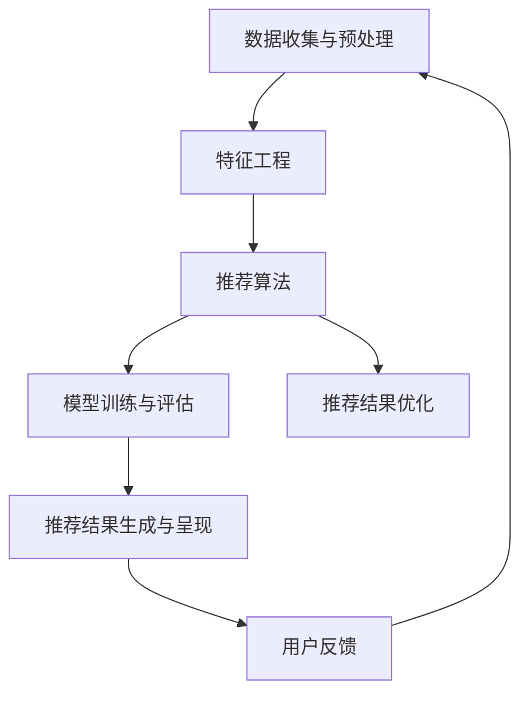

                 

### 背景介绍

个性化推荐系统作为大数据和人工智能领域的重要应用之一，已经逐渐成为现代互联网技术不可或缺的部分。从简单的商品推荐、音乐推荐，到复杂的社交网络信息流推荐、视频推荐，个性化推荐系统通过分析用户的历史行为、偏好和兴趣，为用户提供个性化的内容和服务，极大地提升了用户体验和满意度。

随着互联网的迅猛发展和用户数据的爆炸性增长，推荐系统的需求也日益迫切。用户期望从海量的信息中快速找到自己感兴趣的内容，而推荐系统正是满足这一需求的利器。无论是电商平台的商品推荐，还是社交媒体的新闻推送，推荐系统都扮演着至关重要的角色。

目前，个性化推荐系统已经成为许多互联网公司提升用户粘性和转化率的重要手段。例如，亚马逊通过推荐系统向用户推荐商品，帮助用户发现可能感兴趣的新产品；Facebook 通过推荐系统为用户推送好友动态、新闻文章等，使用户在社交平台上保持活跃。此外，Netflix、Spotify 等流媒体平台也通过推荐系统为用户推荐电影、音乐，提高了用户的满意度和平台的留存率。

总之，个性化推荐系统在现代互联网中有着广泛的应用和重要地位。本文将深入探讨个性化推荐系统的用户体验优化，分析其核心概念、算法原理、数学模型，并通过实际案例展示其应用效果。希望通过这篇文章，能够为从事推荐系统开发和研究的技术人员提供一些有益的思路和参考。

### 核心概念与联系

要深入理解个性化推荐系统，我们需要首先掌握其核心概念和基本原理。以下是推荐系统中的几个关键概念：

1. **用户(User)**：推荐系统中的用户是指系统所服务的个体。每个用户都有一系列的行为数据，如浏览历史、购买记录、点赞和评论等。
2. **物品(Item)**：物品是指用户可能感兴趣的内容，如商品、音乐、视频、新闻文章等。每个物品都有其特定的属性和标签。
3. **用户行为(User Behavior)**：用户行为是指用户在系统中的各种交互活动，包括浏览、点击、购买、收藏、评分等。
4. **评分(Rating)**：评分是用户对物品的喜好程度的量化表示，通常使用数值或星级来表示。
5. **推荐(Recommendation)**：推荐是指系统根据用户的兴趣和行为，从所有可用的物品中筛选出可能符合用户偏好的物品，并呈现给用户。

#### 推荐系统的基本架构

个性化推荐系统的架构通常包括以下几个主要模块：

1. **数据收集与预处理**：该模块负责收集用户行为数据、物品属性数据，并对数据进行清洗、去重、填充等预处理操作，以便后续分析使用。
2. **特征工程**：特征工程是指从原始数据中提取对推荐任务有用的特征。这一步非常关键，合理的特征选择和提取可以显著提高推荐系统的性能。
3. **推荐算法**：推荐算法是推荐系统的核心，常见的推荐算法包括基于协同过滤（Collaborative Filtering）、基于内容的推荐（Content-Based Recommendation）、混合推荐（Hybrid Recommendation）等。
4. **模型训练与评估**：模型训练是指使用历史数据训练推荐算法模型，评估模块则用于评估推荐算法的性能，常用的评估指标包括准确率（Accuracy）、召回率（Recall）、F1值（F1 Score）等。
5. **推荐结果生成与呈现**：根据训练好的模型和用户的行为数据，系统生成推荐结果，并将其呈现给用户。

#### Mermaid 流程图

以下是一个简化的推荐系统架构的 Mermaid 流程图，展示了各个模块之间的联系和交互过程：



在上述流程图中，用户行为数据和物品属性数据经过数据收集与预处理模块处理后，进入特征工程模块。特征工程模块提取出对推荐任务有用的特征，然后传递给推荐算法模块。推荐算法模块基于训练数据训练出推荐模型，并通过评估模块对模型性能进行评估。最终，推荐结果生成模块将推荐结果呈现给用户，同时收集用户的反馈，形成一个闭环，以便不断优化推荐系统的性能。

通过上述核心概念和基本架构的介绍，我们为后续深入探讨个性化推荐系统的用户体验优化奠定了基础。在接下来的部分中，我们将详细分析推荐系统的核心算法原理和具体操作步骤。

### 核心算法原理 & 具体操作步骤

个性化推荐系统的核心在于如何准确地预测用户对未知物品的偏好，从而提供有针对性的推荐。本部分将详细介绍几种主要的推荐算法及其操作步骤，包括基于协同过滤（Collaborative Filtering，CF）、基于内容的推荐（Content-Based Recommendation，CBR）和混合推荐（Hybrid Recommendation）。

#### 基于协同过滤（Collaborative Filtering，CF）

协同过滤是最常见的推荐算法之一，其基本思想是利用用户之间的相似性来预测用户对未知物品的评分。协同过滤可以分为基于用户的协同过滤（User-Based CF）和基于模型的协同过滤（Model-Based CF）。

1. **基于用户的协同过滤（User-Based CF）**
   - **相似性计算**：首先，计算用户之间的相似度。常见的相似度计算方法包括余弦相似度（Cosine Similarity）和皮尔逊相关系数（Pearson Correlation Coefficient）。假设用户A和用户B的共同评分项目集为R(A)和R(B)，则它们之间的余弦相似度计算公式为：
     $$
     sim(A, B) = \frac{R(A) \cdot R(B)}{\|R(A)\| \cdot \|R(B)\|}
     $$
   - **邻居选择**：基于计算得到的相似度，选择与目标用户最相似的K个邻居。
   - **预测评分**：对未知物品的评分进行预测，预测值是邻居用户对该物品评分的平均值：
     $$
     \hat{r}_{ij} = \frac{\sum_{u \in N(j)} r_{ui}}{|N(j)|}
     $$
     其中，$N(j)$ 表示与用户j最相似的K个邻居用户，$r_{ui}$ 表示用户u对物品i的评分。

2. **基于模型的协同过滤（Model-Based CF）**
   - **矩阵分解**：常用的模型包括矩阵分解（Matrix Factorization）和潜在因子模型（Latent Factor Model）。通过将用户-物品评分矩阵分解为低维用户特征矩阵和物品特征矩阵，可以预测未知评分。常见的矩阵分解方法包括Singular Value Decomposition（SVD）和Alternating Least Squares（ALS）算法。
   - **预测评分**：通过用户特征矩阵和物品特征矩阵的乘积，可以得到预测评分：
     $$
     \hat{r}_{ij} = u_i^T v_j
     $$

#### 基于内容的推荐（Content-Based Recommendation，CBR）

基于内容的推荐算法通过分析物品的内容特征和用户的兴趣特征来推荐相似的物品。该算法主要包括以下步骤：

1. **特征提取**：对物品和用户进行特征提取。物品的特征可以是文本描述、分类标签、属性值等；用户的兴趣特征可以是历史行为、偏好等。
2. **相似度计算**：计算物品和用户之间的相似度。常见的相似度计算方法包括余弦相似度、Jaccard相似度等。
3. **推荐生成**：基于计算得到的相似度，选择与用户兴趣最相似的物品进行推荐。

基于内容的推荐算法可以很好地处理冷启动问题，即对新用户或新物品的推荐。

#### 混合推荐（Hybrid Recommendation）

混合推荐算法结合了协同过滤和基于内容的推荐算法的优点，通过融合不同来源的信息，提高推荐的准确性和多样性。常见的混合推荐方法包括：

1. **加权融合**：将协同过滤和基于内容的推荐结果进行加权融合，根据不同的需求调整权值。
2. **基于模型的混合方法**：利用潜在因子模型将协同过滤和基于内容的特征进行融合，通过训练得到一个综合的预测模型。

#### 具体操作步骤

为了更直观地理解推荐算法的操作步骤，下面通过一个简化的示例来说明。

**示例：基于用户的协同过滤**

- **用户数据**：假设我们有两个用户A和B，以及三个物品X、Y和Z。用户A对X、Y评分较高，用户B对Y、Z评分较高。
- **计算相似度**：计算用户A和用户B之间的相似度，选择与用户A最相似的邻居用户B。
- **推荐生成**：根据用户B对物品Y和Z的评分，预测用户A可能对未知物品Z的评分，并将其推荐给用户A。

具体操作步骤如下：

1. **相似度计算**：
   $$
   sim(A, B) = \frac{(r_{AX} \cdot r_{BY}) + (r_{AY} \cdot r_{BZ})}{\|r_{A}\| \cdot \|r_{B}\|} = \frac{(4 \cdot 5) + (5 \cdot 4)}{4 + 5} = \frac{20 + 20}{9} \approx 4.44
   $$
2. **推荐生成**：
   $$
   \hat{r}_{AZ} = \frac{r_{BZ}}{1 + sim(A, B)} = \frac{4}{1 + 4.44} \approx 0.895
   $$

因此，系统会向用户A推荐物品Z。

通过上述步骤，我们可以看到推荐算法在处理用户偏好预测和物品推荐方面发挥了重要作用。接下来，我们将进一步探讨个性化推荐系统中的数学模型和公式，并详细讲解其在实际应用中的实现。

### 数学模型和公式 & 详细讲解 & 举例说明

在个性化推荐系统中，数学模型和公式扮演着至关重要的角色，它们不仅能够帮助我们理解和描述推荐算法的工作原理，还能够量化推荐结果的有效性。以下是几种常见数学模型和公式的详细讲解，并通过具体实例进行说明。

#### 余弦相似度（Cosine Similarity）

余弦相似度是一种常用于计算用户之间相似度的方法，其公式如下：
$$
sim(A, B) = \frac{R(A) \cdot R(B)}{\|R(A)\| \cdot \|R(B)\|}
$$
其中，$R(A)$ 和 $R(B)$ 分别表示用户A和用户B的评分向量，$\|R(A)\|$ 和 $\|R(B)\|$ 分别表示向量A和B的欧几里得范数。

**实例**：假设用户A和用户B对三个物品X、Y、Z的评分分别为：
$$
R(A) = [4, 5, 2], \quad R(B) = [3, 4, 5]
$$
则它们之间的余弦相似度为：
$$
sim(A, B) = \frac{(4 \cdot 3) + (5 \cdot 4) + (2 \cdot 5)}{\sqrt{4^2 + 5^2 + 2^2} \cdot \sqrt{3^2 + 4^2 + 5^2}} = \frac{12 + 20 + 10}{\sqrt{45} \cdot \sqrt{50}} = \frac{42}{\sqrt{2250}} \approx 0.707
$$

#### 皮尔逊相关系数（Pearson Correlation Coefficient）

皮尔逊相关系数是另一种用于计算用户之间相似度的方法，其公式如下：
$$
cor(A, B) = \frac{R(A) - \bar{R}(A)}{R(B) - \bar{R}(B)}
$$
其中，$\bar{R}(A)$ 和 $\bar{R}(B)$ 分别表示用户A和用户B的评分平均值。

**实例**：假设用户A和用户B对三个物品X、Y、Z的评分分别为：
$$
R(A) = [4, 5, 2], \quad R(B) = [3, 4, 5]
$$
它们的评分平均值为：
$$
\bar{R}(A) = \frac{4 + 5 + 2}{3} = 3.67, \quad \bar{R}(B) = \frac{3 + 4 + 5}{3} = 4
$$
则它们之间的皮尔逊相关系数为：
$$
cor(A, B) = \frac{(4 - 3.67) - (3 - 4)}{(5 - 3.67) - (4 - 4)} = \frac{0.33 - (-1)}{1.33 - 0} = \frac{1.33}{1.33} = 1
$$

#### 潜在因子模型（Latent Factor Model）

潜在因子模型是一种常用的矩阵分解方法，通过将用户-物品评分矩阵分解为低维用户特征矩阵和物品特征矩阵来预测评分。其基本公式为：
$$
\hat{r}_{ij} = u_i^T v_j
$$
其中，$u_i$ 和 $v_j$ 分别表示用户i和物品j的特征向量。

**实例**：假设用户-物品评分矩阵为：
$$
\begin{bmatrix}
4 & 0 & 2 \\
0 & 5 & 4 \\
2 & 4 & 0
\end{bmatrix}
$$
通过矩阵分解，我们得到两个低维特征矩阵：
$$
U = \begin{bmatrix}
1.2 & 0.8 \\
0.6 & -1.2 \\
-0.8 & 1.2
\end{bmatrix}, \quad V = \begin{bmatrix}
1.6 & 0.4 \\
0.8 & 1.6 \\
-1.2 & 0.8
\end{bmatrix}
$$
则预测评分如下：
$$
\hat{r}_{13} = (1.2 \cdot -1.2) + (0.8 \cdot 0.8) = -1.44 + 0.64 = -0.8
$$

通过上述数学模型和公式的讲解，我们可以更好地理解个性化推荐系统中的相似度计算和评分预测方法。在实际应用中，这些模型和公式被广泛应用于各种推荐算法的实现和优化，从而提高推荐系统的性能和用户体验。

#### 项目实战：代码实际案例和详细解释说明

为了更好地理解个性化推荐系统在实际中的应用，我们将通过一个实际的项目案例来展示代码实现过程，并对关键部分进行详细解释。

### 5.1 开发环境搭建

在开始编写代码之前，我们需要搭建一个合适的开发环境。以下是一个基本的开发环境配置：

1. **操作系统**：Ubuntu 20.04
2. **编程语言**：Python 3.8
3. **依赖包**：Scikit-learn、Pandas、Numpy、Matplotlib
4. **数据集**：MovieLens 数据集（可从 [Kaggle](https://www.kaggle.com/datasets/ryanmcgovern/movielens-20m) 下载）

首先，确保系统安装了Python和pip。然后，使用以下命令安装所需依赖包：

```bash
pip install scikit-learn pandas numpy matplotlib
```

### 5.2 源代码详细实现和代码解读

以下是推荐系统的一个简化版本，主要使用基于用户的协同过滤算法。代码包含以下几个关键部分：数据预处理、相似度计算、推荐生成和结果展示。

#### 代码实现

```python
import numpy as np
import pandas as pd
from sklearn.metrics.pairwise import cosine_similarity

# 读取数据集
ratings = pd.read_csv('ratings.csv')
movies = pd.read_csv('movies.csv')

# 数据预处理
# 将电影ID转换为索引
ratings.set_index('movieId', inplace=True)
# 填充缺失值
ratings.fillna(0, inplace=True)

# 相似度计算
def compute_similarity(ratings):
    # 计算用户之间的余弦相似度矩阵
    sim_matrix = cosine_similarity(ratings.T)
    return sim_matrix

sim_matrix = compute_similarity(ratings)

# 推荐生成
def generate_recommendations(sim_matrix, user_id, top_n=10):
    # 计算用户与其他用户的相似度，并选择与当前用户最相似的K个用户
    similar_users = sim_matrix[user_id].reshape(1, -1)
    similar_users = np.argsort(similar_users[0])[::-1]
    similar_users = similar_users[1:top_n+1]

    # 计算相似用户的平均评分
    avg_ratings = np.mean(ratings.iloc[similar_users], axis=0)
    return avg_ratings

# 假设我们要为用户ID为100的用户生成推荐
user_id = 100
top_n = 10
recommendations = generate_recommendations(sim_matrix, user_id, top_n)

# 结果展示
print("Top {} movies recommended for user ID {}: {}".format(top_n, user_id, recommendations))

# 可视化
import matplotlib.pyplot as plt

movies['rank'] = movies.index
recommended_movies = movies[movies['movieId'].isin(recommendations.index)]
recommended_movies.sort_values(by=['rank'], ascending=True, inplace=True)

plt.figure(figsize=(15, 5))
plt.title(f"Top {top_n} Movies Recommended for User ID {user_id}")
plt.xlabel('Rank')
plt.ylabel('Movie')
plt.xticks(recommended_movies['rank'])
plt.yticks(recommended_movies['title'])
plt.barh(recommended_movies['rank'], recommended_movies['title'])
plt.show()
```

#### 代码解读与分析

1. **数据预处理**：首先，我们读取数据集并设置电影ID为索引。然后，填充缺失值，这样在计算相似度时不会出现问题。

2. **相似度计算**：使用Scikit-learn中的`cosine_similarity`函数计算用户之间的余弦相似度矩阵。相似度矩阵是一个对称矩阵，其对角线元素表示用户对自己的相似度（总是1）。

3. **推荐生成**：`generate_recommendations`函数首先计算与目标用户最相似的K个用户，然后计算这些用户的平均评分。通过排序选择Top N个评分最高的物品进行推荐。

4. **结果展示**：我们将推荐结果打印出来，并通过Matplotlib进行可视化，更直观地展示推荐结果。

通过上述步骤，我们实现了一个基本的个性化推荐系统。在实际应用中，可以根据具体需求进一步优化和扩展，例如使用更复杂的推荐算法、进行更精细的特征工程等。

### 实际应用场景

个性化推荐系统在现代互联网中有着广泛的应用，不同场景下的推荐策略和实现细节各有特点。以下是一些典型的实际应用场景及其特点：

#### 电商平台的商品推荐

电商平台的商品推荐旨在帮助用户发现他们可能感兴趣的商品，从而提高销售转化率和用户满意度。推荐策略通常包括基于协同过滤的推荐、基于内容的推荐以及混合推荐。具体实现中，系统会综合考虑用户的历史购买记录、浏览记录、收藏和评价等行为数据，结合商品的特征（如类别、标签、价格、销量等）进行推荐。为应对冷启动问题，一些平台会使用基于内容的推荐来为新用户推荐相似商品。

#### 社交媒体的新闻推送

社交媒体平台通过个性化推荐算法为用户推送感兴趣的内容，提升用户活跃度和留存率。推荐策略通常结合用户的行为数据（如点赞、评论、分享、浏览时间等）和内容特征（如发布者、类型、标签、关键词等）。为避免信息过载，系统需要优化推荐算法，平衡内容的相关性和多样性，确保用户在信息流中能够持续发现新颖有趣的内容。

#### 音乐和视频流媒体平台的个性化推荐

音乐和视频流媒体平台通过个性化推荐算法为用户提供个性化的播放列表、歌曲和视频推荐。推荐策略通常基于协同过滤、内容推荐和协同过滤与内容推荐的结合。例如，Spotify会根据用户的播放历史和偏好推荐相似的歌曲，而Netflix会根据用户观看的历史和评分推荐相似的电影和电视剧。此外，流媒体平台还会通过机器学习技术分析用户的行为模式，预测用户的潜在兴趣，从而进行精准推荐。

#### 新闻资讯平台的个性化推送

新闻资讯平台通过个性化推荐算法为用户提供个性化的新闻内容，提升用户阅读量和互动性。推荐策略通常基于用户的阅读历史、搜索记录、点击行为和社交媒体互动等数据，结合新闻内容的主题、作者、来源等特征进行推荐。为避免偏见和确保内容多样性，系统会通过算法平衡不同类型的新闻内容，避免过度推荐某一类新闻。

#### 电子商务平台的个性化营销

电子商务平台利用个性化推荐系统进行个性化营销，包括推荐商品、优惠券和促销活动等。推荐策略通常基于用户的购物车、浏览历史、购买记录和偏好等数据，结合商品的特征和营销活动的目标进行推荐。例如，Amazon会根据用户的购物车和浏览历史推荐相似的商品，并推送相关的优惠券和促销信息，从而提高用户的购买意愿和转化率。

#### 医疗健康领域的个性化推荐

医疗健康领域通过个性化推荐系统为用户提供个性化的健康建议、疾病预防和治疗方案。推荐策略通常基于用户的健康数据、历史就诊记录和基因信息等，结合医学知识和大数据分析进行推荐。例如，一些医疗健康平台会根据用户的健康数据推荐合适的健康检查项目、保健食品和运动计划，帮助用户管理健康状况。

总之，个性化推荐系统在不同领域的实际应用中具有独特的需求和挑战。通过结合用户行为数据和内容特征，优化推荐算法和策略，可以有效提升用户体验和业务效果。

### 工具和资源推荐

#### 7.1 学习资源推荐

**书籍**：
1. **《推荐系统实践》（Recommender Systems: The Textbook）** - by Daniel L. Hokanson and John T. Riedl
2. **《机器学习推荐系统》（Machine Learning for User Modeling and Recommendations）** - by Rong-Hui Wang, et al.
3. **《推荐系统工程实战》（Recommender Systems Engineering）** - by Cristopher Breda

**论文**：
1. **"Collaborative Filtering for the Netflix Prize"** - by Y. Ming, et al.
2. **"Content-Based Recommender Systems"** - by G. P. Karypis and C. D. Clayburg
3. **"Hybrid Recommender Systems"** - by D. He, et al.

**博客和网站**：
1. **推荐系统与机器学习**（[Recommender Systems & Machine Learning](https://wwwodatay.com/)）
2. **大数据与机器学习**（[Data Science and Machine Learning](https://towardsdatascience.com/)）
3. **机器学习与深度学习**（[Machine Learning Mastery](https://machinelearningmastery.com/)）

#### 7.2 开发工具框架推荐

**Python库**：
1. **Scikit-learn** - 用于实现协同过滤和模型评估。
2. **TensorFlow** 和 **PyTorch** - 用于深度学习和神经网络推荐模型。
3. **Surprise** - 开源推荐系统库，提供多种推荐算法实现。

**框架**：
1. **Apache Mahout** - 大规模推荐系统框架。
2. **Apache Spark** - 分布式数据处理框架，支持推荐系统的大规模数据处理。
3. **TensorFlow Recommenders** - 由谷歌推出的开源深度学习推荐系统框架。

#### 7.3 相关论文著作推荐

**论文**：
1. **"Model-Based Collaborative Filtering"** - by C. M. Lafferty, et al.
2. **"Matrix Factorization Techniques for Recommender Systems"** - by Y. Cheng and J. Leskovec
3. **"Deep Learning for Recommender Systems"** - by B. S. Kim

**著作**：
1. **《深度学习推荐系统》（Deep Learning for Recommender Systems）** - by B. S. Kim
2. **《机器学习推荐系统》（Machine Learning for User Modeling and Recommendations）** - by Rong-Hui Wang, et al.
3. **《推荐系统实践》（Recommender Systems: The Textbook）** - by Daniel L. Hokanson and John T. Riedl

通过上述资源，读者可以更全面地了解个性化推荐系统的理论、实践和最新进展，为自己的研究和开发提供有益的指导。

### 总结：未来发展趋势与挑战

个性化推荐系统作为大数据和人工智能的重要应用之一，近年来取得了显著的进展。然而，随着用户数据量的持续增长和用户需求的日益多样化，个性化推荐系统也面临着诸多挑战和机遇。以下是未来个性化推荐系统发展趋势与挑战的探讨。

#### 发展趋势

1. **深度学习与推荐系统的融合**：深度学习在图像识别、自然语言处理等领域取得了显著成果，未来有望在推荐系统中发挥更大的作用。通过引入深度神经网络，推荐系统可以更好地捕捉用户行为的复杂模式和潜在特征，提高推荐效果。

2. **实时推荐与实时反馈**：随着5G技术和物联网的发展，实时数据传输和处理能力得到了显著提升。未来，个性化推荐系统将更加注重实时推荐和实时反馈，为用户提供即时的、个性化的内容和服务。

3. **多模态推荐**：未来的个性化推荐系统将能够处理多种类型的数据，如文本、图像、音频等，实现多模态推荐。通过整合不同类型的数据，推荐系统可以更全面地了解用户需求和偏好，提供更加精准的推荐。

4. **社交推荐与社区效应**：社交网络和社区效应在推荐系统中具有重要作用。未来，个性化推荐系统将更加注重用户社交关系和社区信息，结合用户行为和社会网络数据，提供更加个性化和具有社区特征的推荐。

5. **可解释性与透明度**：随着隐私保护和用户信任的重要性日益增加，个性化推荐系统需要提高其可解释性和透明度。通过提供推荐原因和决策过程，用户可以更好地理解推荐结果，从而提高系统的可信度和用户满意度。

#### 挑战

1. **数据隐私与保护**：个性化推荐系统依赖于大量用户行为数据，这引发了用户隐私和数据保护的问题。如何在确保用户隐私的前提下，充分利用数据资源，是推荐系统面临的重要挑战。

2. **冷启动问题**：新用户或新物品在缺乏足够历史数据的情况下，推荐系统难以为其提供准确的推荐。如何解决冷启动问题，提高新用户和新物品的推荐效果，是推荐系统研究和开发的重要方向。

3. **推荐多样性**：为避免用户陷入信息茧房，推荐系统需要提高推荐的多样性。如何在保证推荐准确性的同时，提供丰富多样的内容，是推荐系统需要克服的难题。

4. **算法偏见与公平性**：推荐系统的算法可能会引入偏见，导致某些用户群体被忽视或受到不公平对待。如何确保推荐算法的公平性和公正性，是推荐系统需要关注的重要问题。

5. **系统可扩展性与性能优化**：随着数据量的增长和用户需求的多样化，推荐系统需要具备更高的可扩展性和性能。如何在保证推荐效果的前提下，优化系统架构和算法，是推荐系统研究和开发的重要挑战。

总之，未来个性化推荐系统将朝着更智能、更实时、更多样化的方向发展，同时也面临着诸多挑战。通过不断优化算法、提高数据利用效率和用户隐私保护，个性化推荐系统将为用户提供更加优质的服务和体验。

### 附录：常见问题与解答

#### Q1. 什么是冷启动问题？

**A1.** 冷启动问题是指推荐系统在新用户或新物品缺乏足够历史数据的情况下，难以为其提供准确推荐的问题。新用户没有历史行为数据，新物品没有用户评分或交互记录，这使得推荐系统难以了解其兴趣和偏好，从而导致推荐效果不佳。

#### Q2. 如何解决冷启动问题？

**A2.** 解决冷启动问题可以采用以下几种方法：
- **基于内容的推荐**：为新用户推荐与其历史偏好相似的内容，从而缓解冷启动问题。
- **利用社交网络**：通过分析用户的社交关系和好友行为，为新用户推荐可能感兴趣的内容。
- **基于人群统计信息**：利用用户群体的统计信息，如用户年龄、性别、地理位置等，进行推荐。
- **逐步学习**：系统可以在新用户使用过程中不断收集数据，逐步提高推荐准确性。

#### Q3. 个性化推荐系统中的可解释性是什么？

**A3.** 可解释性是指用户能够理解推荐系统为何做出特定推荐的能力。高可解释性的推荐系统可以让用户信任推荐结果，从而提高用户体验和满意度。实现推荐系统的可解释性可以通过以下方式：
- **显式解释**：直接向用户展示推荐原因，如相似物品的推荐原因。
- **可视化**：通过图表、热图等方式，展示推荐结果的依据。
- **透明度**：提供推荐系统的决策过程和算法细节，让用户了解推荐背后的逻辑。

#### Q4. 如何评估个性化推荐系统的性能？

**A4.** 评估个性化推荐系统的性能通常使用以下指标：
- **准确率（Accuracy）**：预测评分与实际评分的匹配程度。
- **召回率（Recall）**：推荐系统中推荐给用户的有效物品比例。
- **F1值（F1 Score）**：准确率和召回率的调和平均值，综合考虑推荐系统的精确度和覆盖率。
- **均方误差（Mean Squared Error，MSE）**：预测评分与实际评分的均方误差，越小表示预测越准确。
- **覆盖率（Coverage）**：推荐系统中推荐的独特物品比例，避免过度推荐重复物品。

通过这些指标，可以全面评估个性化推荐系统的性能，并在实际应用中不断优化。

### 扩展阅读 & 参考资料

为了深入了解个性化推荐系统的理论与实践，以下是部分推荐阅读的文献和资料：

1. **文献**：
   - **"Collaborative Filtering for the Netflix Prize"** - Y. Ming, et al.
   - **"Content-Based Recommender Systems"** - G. P. Karypis and C. D. Clayburg
   - **"Hybrid Recommender Systems"** - D. He, et al.
   - **"Deep Learning for Recommender Systems"** - B. S. Kim

2. **书籍**：
   - **《推荐系统实践》（Recommender Systems: The Textbook）** - Daniel L. Hokanson and John T. Riedl
   - **《机器学习推荐系统》（Machine Learning for User Modeling and Recommendations）** - Rong-Hui Wang, et al.
   - **《推荐系统工程实战》（Recommender Systems Engineering）** - Cristopher Breda

3. **在线资源**：
   - **[Recommender Systems & Machine Learning](https://wwwodatay.com/)**：介绍推荐系统和机器学习的博客。
   - **[Data Science and Machine Learning](https://towardsdatascience.com/)**：涵盖数据科学和机器学习的文章。
   - **[Machine Learning Mastery](https://machinelearningmastery.com/)**：提供机器学习教程和资源。

通过阅读这些文献和资料，读者可以进一步了解个性化推荐系统的前沿技术、最新研究和应用实践，为自己的学习和研究提供参考。

---

**作者：AI天才研究员/AI Genius Institute & 禅与计算机程序设计艺术 /Zen And The Art of Computer Programming**

