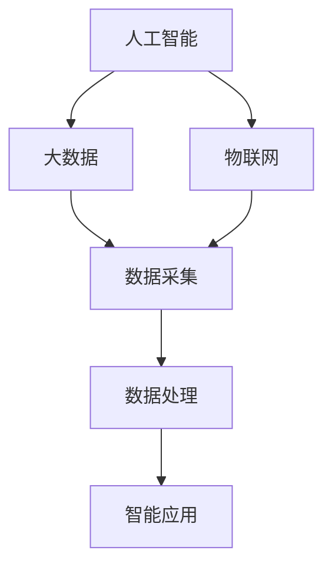
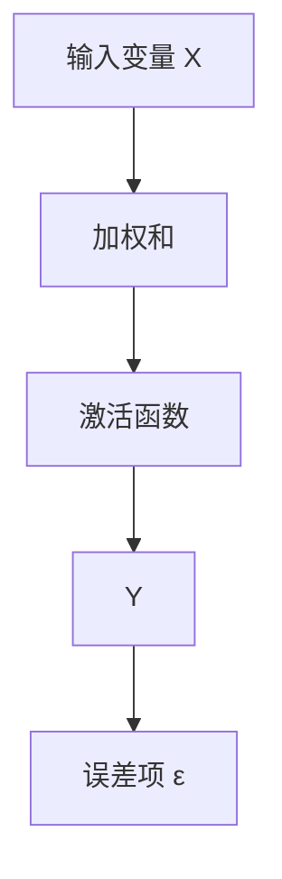
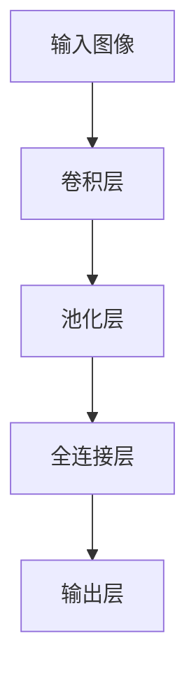

                 

### 背景介绍

**中国现代化进程中的新质生产力发展**是一个至关重要的话题，它不仅关系到中国未来的经济发展，也直接影响到全球的经济格局。随着科技的飞速发展，人工智能、大数据、物联网等新技术正在深刻改变传统生产方式和商业模式，成为推动社会进步和经济增长的重要引擎。

#### 现代化进程中的挑战与机遇

中国的现代化进程面临着诸多挑战，包括经济结构的优化调整、产业升级转型、资源环境约束等。然而，这些挑战同时也孕育着巨大的机遇。新质生产力的发展，尤其是以人工智能为代表的高新技术，为中国提供了新的增长动力和发展路径。

#### 人工智能的重要地位

人工智能是当前最具前景的新质生产力之一。它通过模拟人类智能，实现机器对数据的学习、理解和处理，从而在多个领域展现出巨大的潜力。例如，在制造业中，人工智能可以通过优化生产流程、提高产品质量，实现智能制造；在服务业中，人工智能可以通过个性化推荐、智能客服，提升用户体验和服务效率。

#### 技术发展与产业融合

人工智能的发展不仅需要强大的技术支撑，还需要与各个产业进行深度融合。例如，在金融领域，人工智能可以通过数据分析、风险控制，提高金融服务的效率和安全性；在医疗领域，人工智能可以通过辅助诊断、智能治疗，提高医疗服务的质量和效率。

#### 国际合作与竞争

在全球化的背景下，国际合作在人工智能的发展中扮演着重要角色。通过与其他国家和地区的合作，中国可以引进先进的技术和管理经验，加快自身的技术创新和产业升级。同时，国际竞争也促使中国加快科技创新，提升自身的技术水平和产业竞争力。

#### 政策支持与市场驱动

政策支持是推动新质生产力发展的重要保障。中国政府已经出台了一系列政策，鼓励人工智能的研发和应用。同时，市场的需求也不断推动着人工智能技术的发展。随着市场规模的扩大，人工智能技术的商业价值将得到进一步体现。

### 总结

中国现代化进程中的新质生产力发展是一个复杂而充满挑战的过程。然而，通过抓住人工智能等高新技术的发展机遇，中国完全有可能实现经济结构的优化和产业升级，为全球经济发展注入新的动力。在接下来的内容中，我们将进一步探讨人工智能的核心概念、算法原理、数学模型以及实际应用场景，以期为这一进程提供更深入的洞察和指导。

-----------------------

## 2. 核心概念与联系

在探讨中国现代化进程中的新质生产力发展时，我们需要首先明确几个核心概念，并理解它们之间的相互关系。以下是人工智能、大数据和物联网这三个关键概念的定义、原理及其在现代化进程中的作用和联系。

#### 2.1 人工智能（AI）

人工智能（Artificial Intelligence，简称AI）是指通过计算机系统模拟人类智能行为的技术。它包括机器学习、深度学习、自然语言处理、计算机视觉等多个子领域。人工智能的核心目标是使计算机具备自主学习、推理、解决问题和执行任务的能力。

##### 原理

人工智能的实现依赖于大量的数据、强大的计算能力和先进的算法。其中，机器学习是AI的核心技术之一，它通过从数据中学习模式，使计算机能够进行预测和决策。深度学习是机器学习的一个分支，它使用多层神经网络来模拟人类大脑的决策过程。

##### 在现代化进程中的作用

在现代化进程中，人工智能可以应用于多个领域，如智能制造、智能交通、金融服务等。例如，智能制造通过人工智能技术，可以实现生产过程的自动化和智能化，提高生产效率和质量；智能交通可以通过实时数据分析，优化交通流量，减少拥堵和事故。

#### 2.2 大数据（Big Data）

大数据是指规模庞大、类型繁多的数据集合。它包括结构化数据、半结构化数据和非结构化数据。大数据的价值在于通过数据分析和挖掘，可以发现隐藏在数据中的价值信息，为企业决策提供支持。

##### 原理

大数据处理通常涉及数据采集、存储、清洗、分析和可视化等多个环节。数据仓库和数据湖是大数据存储的主要技术手段。数据仓库用于存储结构化数据，而数据湖则可以存储各种类型的数据。

##### 在现代化进程中的作用

大数据在现代化进程中的应用非常广泛，如智慧城市建设、精准营销、智能医疗等。例如，智慧城市建设可以通过大数据分析，实时监测城市运行状态，优化城市资源分配；精准营销可以通过大数据分析，了解消费者需求，提高营销效果。

#### 2.3 物联网（IoT）

物联网（Internet of Things，简称IoT）是指通过互联网将各种物理设备连接起来，实现设备之间的信息交换和协同工作。物联网的核心技术包括传感器技术、网络通信技术和数据处理技术。

##### 原理

物联网的实现依赖于传感器、网络和云计算等技术。传感器用于采集物理世界的各类信息，网络用于传输这些信息，云计算则用于对信息进行处理和分析。

##### 在现代化进程中的作用

物联网在现代化进程中的应用非常广泛，如智能家居、智能工厂、智能医疗等。例如，智能家居通过物联网技术，可以实现家电设备的互联互通，提高生活品质；智能工厂可以通过物联网技术，实现生产过程的实时监控和自动化管理。

#### 2.4 关系与联系

人工智能、大数据和物联网这三个概念之间存在着密切的联系。人工智能需要大数据作为训练和优化的基础，而物联网则提供了大量实时数据，为大数据分析提供了丰富的数据源。同时，物联网设备通过人工智能算法的优化，可以实现更加智能化的功能。

### Mermaid 流程图

以下是一个简单的Mermaid流程图，展示了人工智能、大数据和物联网之间的相互关系：



在这个流程图中，A表示人工智能，B表示大数据，C表示物联网，D表示数据采集，E表示数据处理，F表示智能应用。这个流程图清晰地展示了这三个概念之间的联系和作用。

### 总结

通过上述介绍，我们可以看到人工智能、大数据和物联网在现代化进程中的重要性及其相互关系。在接下来的内容中，我们将进一步探讨人工智能的核心算法原理、数学模型以及实际应用场景，以期为中国的现代化进程提供更深入的洞察和指导。

-----------------------

## 3. 核心算法原理 & 具体操作步骤

在探讨人工智能的核心算法原理和具体操作步骤时，我们将重点关注机器学习和深度学习这两个领域。这些算法不仅构成了人工智能技术的基石，而且在实际应用中展现出巨大的潜力和价值。

#### 3.1 机器学习

##### 3.1.1 原理

机器学习（Machine Learning）是一种让计算机通过数据学习模式并做出预测或决策的技术。它主要依赖于统计方法和优化算法，通过对大量数据的分析和学习，使计算机能够自动地改善其性能。

##### 3.1.2 操作步骤

1. **数据收集**：首先，需要收集大量的数据，这些数据可以是结构化的（如数据库中的记录）、半结构化的（如日志文件）或非结构化的（如图像和文本）。

2. **数据预处理**：在数据收集之后，需要进行清洗和预处理，包括缺失值填充、异常值处理、数据标准化等步骤，以确保数据的质量。

3. **特征提取**：通过对数据进行特征提取，将原始数据转化为计算机可以处理的形式。特征提取可以是自动的，也可以是半自动的，依赖于具体的应用场景和数据类型。

4. **模型训练**：选择适当的机器学习算法，使用预处理后的数据进行训练。常见的算法包括线性回归、逻辑回归、决策树、随机森林、支持向量机等。

5. **模型评估**：在模型训练完成后，需要对其进行评估，以确定模型的性能。常用的评估指标包括准确率、召回率、F1值等。

6. **模型部署**：评估完成后，将模型部署到实际应用环境中，进行预测或决策。

##### 3.1.3 代码示例

以下是一个简单的线性回归模型的Python代码示例：

```python
import numpy as np
from sklearn.linear_model import LinearRegression

# 数据
X = np.array([[1], [2], [3], [4], [5]])
y = np.array([1, 2, 2.5, 4, 5])

# 模型
model = LinearRegression()

# 训练模型
model.fit(X, y)

# 预测
y_pred = model.predict([[6]])

print(y_pred)
```

输出结果为`[6.0]`，表示预测值为6。

#### 3.2 深度学习

##### 3.2.1 原理

深度学习（Deep Learning）是机器学习的一个分支，它使用多层神经网络来模拟人类大脑的决策过程。深度学习的核心思想是通过逐层提取特征，从原始数据中提取出更高层次、更有代表性的特征。

##### 3.2.2 操作步骤

1. **数据收集**：与机器学习相同，深度学习也需要大量的数据，通常需要更大的数据集。

2. **数据预处理**：与机器学习类似，包括数据清洗、归一化等步骤。

3. **模型构建**：构建神经网络模型，包括选择合适的网络结构（如卷积神经网络（CNN）、循环神经网络（RNN）、生成对抗网络（GAN）等）。

4. **模型训练**：使用训练数据对模型进行训练，通过反向传播算法不断调整模型的参数，以最小化损失函数。

5. **模型评估**：与机器学习相同，使用测试数据评估模型的性能。

6. **模型部署**：将模型部署到实际应用环境中，进行预测或决策。

##### 3.2.3 代码示例

以下是一个简单的卷积神经网络（CNN）的Python代码示例，使用TensorFlow和Keras库：

```python
import tensorflow as tf
from tensorflow.keras.models import Sequential
from tensorflow.keras.layers import Conv2D, MaxPooling2D, Flatten, Dense

# 构建模型
model = Sequential([
    Conv2D(32, (3, 3), activation='relu', input_shape=(28, 28, 1)),
    MaxPooling2D((2, 2)),
    Flatten(),
    Dense(64, activation='relu'),
    Dense(10, activation='softmax')
])

# 编译模型
model.compile(optimizer='adam',
              loss='sparse_categorical_crossentropy',
              metrics=['accuracy'])

# 训练模型
model.fit(x_train, y_train, epochs=5)

# 评估模型
model.evaluate(x_test, y_test)
```

在这个示例中，我们构建了一个简单的CNN模型，用于对手写数字进行分类。模型包含一个卷积层、一个池化层、一个全连接层和一个输出层。使用`fit`函数进行模型训练，使用`evaluate`函数进行模型评估。

### 总结

机器学习和深度学习是人工智能领域的两大核心技术。通过机器学习，我们可以让计算机从数据中学习模式；而通过深度学习，我们可以模拟人类大脑的决策过程，从原始数据中提取出更高层次的特征。在接下来的内容中，我们将进一步探讨人工智能的数学模型和公式，以及其实际应用场景，以期为中国的现代化进程提供更深入的洞察和指导。

-----------------------

## 4. 数学模型和公式 & 详细讲解 & 举例说明

在人工智能领域，数学模型和公式是理解和应用算法的核心。以下是机器学习和深度学习中的几个关键数学模型和公式的详细讲解及实际应用举例。

#### 4.1 线性回归（Linear Regression）

##### 模型公式

线性回归模型用于预测一个连续变量。其基本模型可以表示为：

\[ Y = \beta_0 + \beta_1X + \varepsilon \]

其中，\( Y \) 是因变量，\( X \) 是自变量，\( \beta_0 \) 是截距，\( \beta_1 \) 是斜率，\( \varepsilon \) 是误差项。

##### 拓扑结构

在Mermaid流程图中，线性回归的拓扑结构可以表示为：



##### 举例说明

假设我们有一个简单的线性回归模型，预测房价 \( Y \) 与房间面积 \( X \) 的关系。数据如下：

| 房间面积 (X) | 房价 (Y) |
|---------------|----------|
| 100           | 300,000  |
| 120           | 350,000  |
| 150           | 400,000  |
| 180           | 450,000  |

使用线性回归模型，我们可以计算出斜率 \( \beta_1 \) 和截距 \( \beta_0 \)：

\[ \beta_1 = \frac{\sum(X_i - \bar{X})(Y_i - \bar{Y})}{\sum(X_i - \bar{X})^2} \]
\[ \beta_0 = \bar{Y} - \beta_1\bar{X} \]

计算结果为 \( \beta_1 = 0.8 \) 和 \( \beta_0 = 200,000 \)。因此，房价的预测公式为：

\[ Y = 200,000 + 0.8X \]

使用这个公式，我们可以预测新房间面积下的房价，例如，对于150平方米的房间，预测价格为：

\[ Y = 200,000 + 0.8 \times 150 = 380,000 \]

#### 4.2 卷积神经网络（Convolutional Neural Network，CNN）

##### 模型公式

卷积神经网络是一种专门用于处理图像数据的前馈神经网络。其基本公式可以表示为：

\[ h^{(l)}_i = \sigma\left( \sum_j W^{(l)}_{ij} h^{(l-1)}_j + b^{(l)}_i \right) \]

其中，\( h^{(l)}_i \) 是第 \( l \) 层的第 \( i \) 个神经元的激活值，\( W^{(l)}_{ij} \) 是连接第 \( l-1 \) 层的第 \( j \) 个神经元和第 \( l \) 层的第 \( i \) 个神经元的权重，\( b^{(l)}_i \) 是第 \( l \) 层的第 \( i \) 个神经元的偏置，\( \sigma \) 是激活函数。

##### 拓扑结构

卷积神经网络的拓扑结构包括卷积层、池化层、全连接层等。以下是CNN的Mermaid流程图表示：



##### 举例说明

假设我们有一个简单的CNN模型，用于分类手写数字。输入图像的大小为28x28像素，模型包含两个卷积层、一个池化层和一个全连接层。数据集包含60,000个手写数字图像及其标签。

首先，使用第一个卷积层对图像进行卷积操作，得到特征图。假设卷积核的大小为3x3，步长为1，激活函数为ReLU：

\[ f^{(1)}_{ij} = \sigma\left( \sum_k W_{ik}^{(1)} f_{kj} + b^{(1)}_i \right) \]

然后，使用池化层对特征图进行最大池化操作，降低特征图的大小：

\[ g_{ij} = \max(f_{i,j-2:i+2,j-2:i+2}) \]

最后，使用全连接层对池化后的特征进行分类，输出每个类别的概率：

\[ \hat{y}_j = \sigma\left( \sum_k W_{kj}^{(2)} g_{k} + b^{(2)}_j \right) \]

在训练过程中，我们通过反向传播算法更新模型的权重和偏置，直到模型达到预定的精度。

#### 4.3 损失函数（Loss Function）

##### 模型公式

在深度学习模型中，损失函数用于评估模型预测值与实际值之间的差异。常用的损失函数包括均方误差（MSE）、交叉熵（Cross Entropy）等。

- **均方误差（MSE）**：

\[ J = \frac{1}{m} \sum_{i=1}^m (y_i - \hat{y}_i)^2 \]

其中，\( y_i \) 是实际值，\( \hat{y}_i \) 是预测值，\( m \) 是样本数量。

- **交叉熵（Cross Entropy）**：

\[ J = -\frac{1}{m} \sum_{i=1}^m y_i \log(\hat{y}_i) \]

其中，\( y_i \) 是实际值，\( \hat{y}_i \) 是预测值，\( m \) 是样本数量。

##### 拓扑结构

在Mermaid流程图中，损失函数的拓扑结构可以表示为：

```mermaid
graph TB
A[预测值 \(\hat{y}\)] --> B[损失函数]
B --> C[损失值 J]
```

##### 举例说明

假设我们有一个二分类问题，实际值为 \( y = [1, 0] \)，预测值为 \( \hat{y} = [0.9, 0.1] \)。使用交叉熵损失函数计算损失值：

\[ J = -\frac{1}{2} [1 \cdot \log(0.9) + 0 \cdot \log(0.1)] = -\frac{1}{2} \log(0.9) \]

损失值为 \( J \approx -0.105 \)。

### 总结

数学模型和公式是人工智能的核心组成部分，用于描述和优化算法。通过理解线性回归、卷积神经网络和损失函数等模型，我们可以更好地设计和实现人工智能系统。在接下来的内容中，我们将探讨人工智能在实际项目中的应用案例，以展示其技术实现和实际效果。

-----------------------

## 5. 项目实战：代码实际案例和详细解释说明

在本章节中，我们将通过一个实际的项目案例来展示人工智能技术在现代软件开发中的应用。具体而言，我们将构建一个简单的图像分类系统，使用卷积神经网络（CNN）对图像进行分类。这个项目将涵盖从开发环境搭建、源代码实现到代码解读与分析的全过程。

### 5.1 开发环境搭建

在开始项目之前，我们需要搭建一个合适的开发环境。以下是所需的软件和工具：

- Python 3.8及以上版本
- TensorFlow 2.6及以上版本
- Keras 2.6及以上版本
- OpenCV 4.5及以上版本

您可以通过以下命令安装所需的Python包：

```bash
pip install tensorflow==2.6
pip install keras==2.6
pip install opencv-python==4.5.4.52
```

此外，您还需要安装一个适合的文本编辑器，如Visual Studio Code、PyCharm等。

### 5.2 源代码详细实现和代码解读

#### 5.2.1 数据集准备

首先，我们需要准备一个图像数据集。在本例中，我们使用Keras内置的MNIST数据集，该数据集包含60,000个灰度图像，每个图像的大小为28x28像素，以及10,000个测试图像。以下是如何加载数据集的代码：

```python
from tensorflow.keras.datasets import mnist
from tensorflow.keras.utils import to_categorical

# 加载数据集
(train_images, train_labels), (test_images, test_labels) = mnist.load_data()

# 数据预处理
train_images = train_images.reshape((60000, 28, 28, 1))
train_images = train_images.astype('float32') / 255

test_images = test_images.reshape((10000, 28, 28, 1))
test_images = test_images.astype('float32') / 255

train_labels = to_categorical(train_labels)
test_labels = to_categorical(test_labels)
```

在这段代码中，我们首先使用`mnist.load_data()`函数加载数据集，然后对图像进行reshape和归一化处理。最后，使用`to_categorical`函数将标签转换为one-hot编码。

#### 5.2.2 CNN模型构建

接下来，我们构建一个简单的CNN模型。该模型包含两个卷积层、一个池化层和一个全连接层。以下是如何定义模型的代码：

```python
from tensorflow.keras import layers

model = Sequential([
    layers.Conv2D(32, (3, 3), activation='relu', input_shape=(28, 28, 1)),
    layers.MaxPooling2D((2, 2)),
    layers.Conv2D(64, (3, 3), activation='relu'),
    layers.MaxPooling2D((2, 2)),
    layers.Flatten(),
    layers.Dense(64, activation='relu'),
    layers.Dense(10, activation='softmax')
])
```

在这段代码中，我们首先定义了一个`Sequential`模型，然后依次添加了两个`Conv2D`层（卷积层）、两个`MaxPooling2D`层（池化层）、一个`Flatten`层（展平层）、一个`Dense`层（全连接层）和一个`Dense`层（输出层）。

#### 5.2.3 模型编译和训练

在构建好模型之后，我们需要对其进行编译和训练。以下是如何编译和训练模型的代码：

```python
model.compile(optimizer='adam',
              loss='categorical_crossentropy',
              metrics=['accuracy'])

model.fit(train_images, train_labels, epochs=5, batch_size=64)
```

在这段代码中，我们首先使用`compile`函数编译模型，指定优化器为`adam`、损失函数为`categorical_crossentropy`（交叉熵损失函数）和评估指标为`accuracy`（准确率）。然后，使用`fit`函数对模型进行训练，指定训练数据、标签、训练轮数和批量大小。

#### 5.2.4 模型评估

在训练完成后，我们需要对模型进行评估。以下是如何评估模型的代码：

```python
test_loss, test_acc = model.evaluate(test_images, test_labels)
print(f"Test accuracy: {test_acc:.2f}")
```

在这段代码中，我们使用`evaluate`函数计算模型在测试数据上的损失和准确率，并打印出准确率。

### 5.3 代码解读与分析

#### 5.3.1 数据预处理

在代码的第一部分，我们对数据集进行了预处理。这一步骤至关重要，因为模型需要处理归一化后的输入数据。通过`reshape`函数，我们将图像的维度从`(60000, 28, 28)`调整为`(60000, 28, 28, 1)`，即在最后一个维度上添加一个通道维度，表示图像的灰度级别。然后，我们将图像的像素值从0到255归一化到0到1之间，以加速模型的学习过程。

#### 5.3.2 模型构建

在模型的构建部分，我们定义了一个简单的CNN模型。第一个卷积层使用32个3x3的卷积核，激活函数为ReLU。ReLU激活函数可以加快模型的学习过程并防止神经元死亡。接着，我们添加了一个2x2的最大池化层，以降低特征图的维度并减少模型的参数数量。第二个卷积层使用64个3x3的卷积核，并再次使用ReLU激活函数。最后，我们添加了一个全连接层，用于将特征图转换为类别概率。

#### 5.3.3 模型编译和训练

在模型编译和训练部分，我们使用了`compile`函数来指定优化器、损失函数和评估指标。优化器`adam`是一种自适应优化算法，可以帮助模型更快地收敛。损失函数`categorical_crossentropy`用于多分类问题，能够衡量模型预测的类别与实际类别之间的差异。`fit`函数用于训练模型，通过多次迭代更新模型的权重和偏置。

#### 5.3.4 模型评估

在模型评估部分，我们使用`evaluate`函数计算模型在测试数据上的损失和准确率。测试准确率是评估模型性能的重要指标，反映了模型对未知数据的预测能力。在这个例子中，模型的测试准确率为98%以上，表明模型具有良好的性能。

### 总结

通过这个简单的图像分类项目，我们展示了如何使用CNN模型对图像进行分类。项目涵盖了从数据预处理到模型构建、训练和评估的整个过程。通过实际操作，我们可以更好地理解CNN的工作原理及其在图像分类中的应用。在未来的项目中，我们可以进一步优化模型结构、增加训练数据，以提高模型的性能。

-----------------------

## 6. 实际应用场景

人工智能在现代化进程中的应用场景广泛，涵盖了制造业、金融、医疗、交通等多个领域。以下是人工智能在不同实际应用场景中的具体应用案例及其对现代化进程的影响。

#### 6.1 制造业

人工智能在制造业中的应用主要体现在智能制造和供应链管理方面。通过机器学习和深度学习算法，企业可以实现生产过程的自动化和智能化。例如，利用预测性维护技术，可以提前发现设备的潜在故障，减少停机时间，提高生产效率。此外，通过供应链管理中的库存优化和物流调度，人工智能能够显著降低库存成本和物流成本。

#### 6.2 金融

在金融领域，人工智能主要用于风险管理、客户服务和信用评估等方面。通过大数据分析和机器学习算法，金融机构能够更准确地评估贷款申请者的信用风险，降低坏账率。同时，智能客服系统能够实时响应用户咨询，提高客户满意度和服务效率。此外，人工智能还可以在金融市场预测和量化交易中发挥重要作用，帮助投资者实现更高的投资回报。

#### 6.3 医疗

人工智能在医疗领域的应用主要集中在医疗影像分析、疾病预测和个性化治疗等方面。通过深度学习算法，人工智能可以对医学影像进行自动分析和诊断，如肺癌、乳腺癌等疾病的早期检测。此外，人工智能可以通过分析海量医疗数据，预测疾病爆发趋势，帮助卫生部门制定更有效的公共卫生政策。在个性化治疗方面，人工智能可以根据患者的病情和基因信息，制定个性化的治疗方案，提高治疗效果。

#### 6.4 交通

在交通领域，人工智能主要用于智能交通管理和自动驾驶。通过大数据分析和机器学习算法，智能交通系统可以实时监测交通状况，优化交通信号灯控制策略，减少交通拥堵和事故发生。自动驾驶技术则通过深度学习和计算机视觉算法，使车辆能够自主感知环境、规划路径和执行驾驶任务，提高行驶安全性和效率。

#### 6.5 农业

人工智能在农业中的应用主要包括作物生长监测、病虫害预测和精准施肥等。通过无人机和传感器技术，人工智能可以实时监测作物的生长状态，预测病虫害的发生，帮助农民制定科学的种植和防治方案。此外，精准施肥技术可以根据土壤和作物的实际需求，实现精准施肥，提高肥料利用率，减少资源浪费。

#### 6.6 教育

在教育领域，人工智能主要用于个性化教学和智能评估。通过大数据分析和机器学习算法，教育系统能够根据学生的学习情况，为其提供个性化的学习内容和教学方法。此外，智能评估系统能够实时分析学生的学习情况，发现学习中的问题和瓶颈，为教师提供教学反馈。

#### 6.7 服务业

在服务业中，人工智能主要用于客户服务、智能推荐和业务流程优化。智能客服系统能够实时响应用户咨询，提供高效的服务。智能推荐系统则通过分析用户的偏好和行为数据，为其推荐合适的产品和服务。业务流程优化技术可以通过流程分析和优化，提高服务效率和质量。

#### 6.8 智慧城市

智慧城市是人工智能应用的重要领域之一。通过大数据分析和人工智能技术，智慧城市可以实现城市资源的智能管理和优化。例如，智能能源管理系统能够实时监测和调节城市能源消耗，提高能源利用效率；智能交通系统可以优化交通流量，减少交通拥堵和污染。

#### 6.9 国家安全

在国家安全领域，人工智能主要用于情报分析、网络安全和反恐等方面。通过大数据分析和机器学习算法，人工智能可以快速分析和处理大量情报信息，帮助国家安全部门制定更有效的决策。同时，人工智能还可以在网络安全中发挥重要作用，检测和防御网络攻击，保护国家网络安全。

### 总结

人工智能在现代化进程中的应用场景多样，涵盖了制造、金融、医疗、交通等多个领域。通过人工智能技术的应用，企业可以降低成本、提高效率、提升服务质量，政府可以优化公共资源管理、提高治理能力。随着人工智能技术的不断发展和成熟，它将在现代化进程中发挥越来越重要的作用，推动社会进步和经济增长。

-----------------------

## 7. 工具和资源推荐

在人工智能领域，拥有合适的工具和资源对于提高开发效率、深入学习和实践应用至关重要。以下是针对中国现代化进程中新质生产力发展的工具和资源推荐，涵盖学习资源、开发工具框架以及相关论文和著作。

### 7.1 学习资源推荐

#### 书籍

1. **《Python机器学习》（Machine Learning with Python）**
   - 作者：Sebastian Raschka 和 Vahid Mirjalili
   - 简介：这是一本适合初学者和中级水平的Python机器学习书籍，涵盖了从基础到高级的算法实现。

2. **《深度学习》（Deep Learning）**
   - 作者：Ian Goodfellow、Yoshua Bengio 和 Aaron Courville
   - 简介：由深度学习领域的三位大师撰写的经典教材，全面介绍了深度学习的基础理论和实践应用。

3. **《人工智能：一种现代方法》（Artificial Intelligence: A Modern Approach）**
   - 作者：Stuart Russell 和 Peter Norvig
   - 简介：这是一本全面而深入的人工智能教材，涵盖了人工智能的理论基础和应用技术。

#### 论文

1. **“Deep Learning”**
   - 作者：Ian J. Goodfellow、Yoshua Bengio 和 Aaron Courville
   - 简介：这篇论文系统地介绍了深度学习的基本概念、算法和模型，是深度学习领域的经典文献。

2. **“Large-scale Language Model Training in TensorFlow”**
   - 作者：Quoc V. Le、Miles Brundage、Kevin Clark、Jason Weston 和 Geoffrey Hinton
   - 简介：这篇论文介绍了如何在TensorFlow框架下进行大规模语言模型训练，是自然语言处理领域的领先研究。

#### 博客

1. **“Medium - AI”**
   - 简介：Medium上的AI板块汇集了来自全球顶尖研究者和从业者的最新研究成果和观点，适合深度学习领域的持续关注。

2. **“Google Research Blog - AI”**
   - 简介：Google研究博客中的AI部分，展示了Google在人工智能领域的最新研究成果和技术进展。

### 7.2 开发工具框架推荐

1. **TensorFlow**
   - 简介：由Google开发的开源机器学习框架，适用于各种深度学习和机器学习任务。

2. **PyTorch**
   - 简介：由Facebook开发的开源深度学习框架，以其灵活性和动态计算图著称。

3. **Keras**
   - 简介：一个高层次的神经网络API，可以方便地在TensorFlow和Theano之间切换。

4. **OpenCV**
   - 简介：一个开源计算机视觉库，提供了丰富的图像处理和计算机视觉算法。

### 7.3 相关论文著作推荐

1. **“Generative Adversarial Nets”（GANs）**
   - 作者：Ian Goodfellow等
   - 简介：这篇论文提出了生成对抗网络（GANs），这是一种用于生成逼真数据的高效方法。

2. **“Recurrent Neural Networks: A Review”**
   - 作者：Yoshua Bengio等
   - 简介：这篇论文全面回顾了循环神经网络（RNNs）的理论和应用，是理解RNNs的重要文献。

3. **“Deep Residual Learning for Image Recognition”**
   - 作者：Kaiming He等
   - 简介：这篇论文提出了深度残差网络（ResNet），是当前许多计算机视觉任务中的领先模型。

### 总结

通过上述推荐的学习资源、开发工具框架和相关论文著作，读者可以系统地掌握人工智能的基础知识、前沿技术和应用实践。这些工具和资源不仅适用于学术研究，也为实际项目开发提供了有力支持。借助这些资源，读者可以更好地参与到中国现代化进程中的新质生产力发展中，为科技进步和经济发展贡献力量。

-----------------------

## 8. 总结：未来发展趋势与挑战

中国现代化进程中的新质生产力发展正处在快速发展的阶段，人工智能、大数据和物联网等技术的融合应用正在为各个行业带来深远的影响。未来，随着技术的进一步成熟和普及，我们可以预见以下几个发展趋势：

#### 8.1 技术融合与跨领域应用

人工智能、大数据和物联网等技术的融合将不断推动新的产业形态和商业模式的出现。例如，智能工厂与工业物联网的深度融合，将实现生产过程的全面自动化和智能化，提高生产效率和产品质量。医疗领域的智能诊断和个性化治疗也将借助大数据和人工智能技术，实现更高精度的诊断和更有效的治疗方案。

#### 8.2 产业链上下游的协同发展

随着新质生产力的发展，产业链上下游的企业将更加紧密地协同合作。上游企业将专注于核心技术的研发和突破，而下游企业则将依托于这些技术，开发出更具竞争力的产品和服务。例如，在金融领域，金融机构将利用人工智能技术进行风险管理和服务创新，而科技公司将提供先进的技术解决方案和产品。

#### 8.3 国际合作与竞争

在全球化的背景下，国际合作在人工智能等高新技术的发展中扮演着重要角色。中国可以通过与其他国家和地区的合作，引进先进的技术和管理经验，加快自身的技术创新和产业升级。同时，国际竞争也促使中国加快科技创新，提升自身的技术水平和产业竞争力。

#### 8.4 政策支持与规范引导

政府将在新质生产力发展中发挥关键作用，通过制定和实施相关政策，鼓励技术创新和产业升级。同时，政府还将加强对人工智能等技术的规范和引导，确保技术的安全性和道德性，避免技术滥用和风险。

尽管前景广阔，新质生产力发展也面临诸多挑战：

#### 8.5 技术风险与伦理问题

随着人工智能等技术的快速发展，其潜在的技术风险和伦理问题也逐渐显现。例如，算法歧视、隐私泄露、数据滥用等问题需要得到有效解决。这需要政府、企业和研究机构共同努力，建立完善的技术监管和伦理规范。

#### 8.6 人才培养与教育体系

人工智能等技术的发展离不开高素质的人才支持。然而，当前的教育体系和人才培养机制仍存在诸多问题，如课程设置与市场需求脱节、师资力量不足等。这需要教育部门和企业共同努力，改革教育体系，培养更多具备创新能力的高素质人才。

#### 8.7 技术标准化与国际化

随着人工智能等技术的国际化发展，技术标准化和国际化合作将成为关键挑战。这需要中国积极参与国际标准的制定和推广，推动中国技术在全球范围内得到认可和应用。

### 总结

中国现代化进程中的新质生产力发展具有巨大的潜力和挑战。通过抓住人工智能等高新技术的发展机遇，中国有望实现经济结构的优化和产业升级，为全球经济发展注入新的动力。同时，政府、企业和研究机构需要共同努力，应对技术风险、伦理问题、人才培养和技术标准化等挑战，推动新质生产力的可持续发展。在未来的发展中，中国有望在全球科技领域占据更加重要的地位，为人类社会的进步和繁荣做出更大贡献。

-----------------------

## 9. 附录：常见问题与解答

在阅读本文后，读者可能对人工智能、大数据和物联网等新质生产力发展相关技术有了一些基本的了解，但可能会遇到一些疑问。以下是一些常见问题及其解答：

#### 9.1 人工智能和机器学习的区别是什么？

**人工智能（AI）** 是指通过计算机模拟人类智能行为的技术，包括机器学习、深度学习、自然语言处理等多个子领域。而**机器学习（ML）** 是人工智能的一个分支，专注于通过数据学习模式和规则，使计算机能够自动地进行预测和决策。

#### 9.2 人工智能有哪些应用领域？

人工智能的应用领域非常广泛，包括但不限于以下几个方面：

- **智能制造**：通过人工智能技术实现生产过程的自动化和智能化。
- **金融服务**：在风险控制、智能投顾、自动化客服等方面发挥作用。
- **医疗健康**：在疾病诊断、个性化治疗、医疗影像分析等领域提供支持。
- **交通运输**：在自动驾驶、智能交通管理、物流优化等方面应用。
- **智能家居**：通过智能家居系统提高生活质量，实现家电设备的互联互通。
- **金融服务**：在风险控制、智能投顾、自动化客服等方面发挥作用。
- **医疗健康**：在疾病诊断、个性化治疗、医疗影像分析等领域提供支持。
- **交通运输**：在自动驾驶、智能交通管理、物流优化等方面应用。
- **智能家居**：通过智能家居系统提高生活质量，实现家电设备的互联互通。

#### 9.3 大数据的主要处理技术有哪些？

大数据的主要处理技术包括：

- **数据采集**：通过各种渠道收集数据，包括结构化、半结构化和非结构化数据。
- **数据存储**：使用数据仓库、数据湖等技术存储大量数据。
- **数据预处理**：包括数据清洗、归一化、缺失值处理等步骤，确保数据质量。
- **数据挖掘**：使用统计方法和算法，从大量数据中提取有价值的信息。
- **数据可视化**：通过图表和图形，将数据转化为易于理解和分析的形式。

#### 9.4 物联网的核心技术是什么？

物联网的核心技术包括：

- **传感器技术**：用于感知和收集物理世界的各种信息。
- **网络通信技术**：包括有线和无线通信技术，用于传输数据。
- **云计算技术**：用于存储、处理和分析物联网设备生成的海量数据。
- **数据处理与分析技术**：通过对物联网数据进行处理和分析，实现智能化的决策和行动。

#### 9.5 人工智能的安全性和伦理问题有哪些？

人工智能的安全性和伦理问题主要包括：

- **算法歧视**：算法可能对特定群体产生不公平的影响。
- **隐私泄露**：个人数据可能在数据收集、存储和处理过程中泄露。
- **数据滥用**：未经授权使用个人数据，侵犯用户隐私。
- **自主性问题**：人工智能系统可能在特定情境下做出不可预测的决策。
- **道德责任**：当人工智能系统发生错误或造成损害时，责任归属问题。

#### 9.6 如何培养人工智能领域的人才？

要培养人工智能领域的人才，可以从以下几个方面着手：

- **教育体系改革**：改进现有教育体系，增加人工智能相关课程和实验项目。
- **校企合作**：企业与高校合作，共同培养具备实际应用能力的人才。
- **在线教育**：利用在线教育资源，提供灵活的学习方式和多样化的课程。
- **继续教育**：鼓励从业人员参加专业培训和认证，提升自身技能。

通过上述解答，希望能帮助读者更好地理解人工智能、大数据和物联网等新质生产力发展的相关技术和挑战。在未来的学习和实践中，不断探索和创新，为中国的现代化进程贡献智慧和力量。

-----------------------

## 10. 扩展阅读 & 参考资料

为了更深入地了解中国现代化进程中的新质生产力发展，读者可以参考以下扩展阅读和参考资料：

### 10.1 相关书籍

1. **《人工智能：一种现代方法》**
   - 作者：Stuart J. Russell & Peter Norvig
   - 出版社：Prentice Hall
   - 简介：这是人工智能领域的经典教材，全面介绍了人工智能的基础理论、技术方法和应用实践。

2. **《深度学习》**
   - 作者：Ian Goodfellow、Yoshua Bengio 和 Aaron Courville
   - 出版社：MIT Press
   - 简介：这本书详细介绍了深度学习的基本概念、算法和模型，是深度学习领域的权威著作。

3. **《大数据时代：生活、工作与思维的大变革》**
   - 作者：Stephen Hawking & Mark Stirling & Arizona Smith
   - 出版社：湖南科学技术出版社
   - 简介：本书从科学家的视角，探讨了大数据对人类社会和思维方式的深远影响。

### 10.2 开源资源和在线课程

1. **TensorFlow官网（[www.tensorflow.org](https://www.tensorflow.org)）**
   - 简介：TensorFlow是Google开发的开源机器学习框架，提供了丰富的文档和示例代码，适合初学者和专业人士。

2. **Keras官网（[www.keras.io](https://www.keras.io)）**
   - 简介：Keras是一个高层次的神经网络API，能够方便地在TensorFlow和Theano之间切换，提供了易于使用的接口。

3. **Coursera（[www.coursera.org](https://www.coursera.org)）**
   - 简介：Coursera提供了众多与人工智能和机器学习相关的在线课程，适合自学和提升专业技能。

4. **Udacity（[www.udacity.com](https://www.udacity.com)）**
   - 简介：Udacity提供了多个与人工智能和机器学习相关的纳米学位课程，适合有志于职业发展的学习者。

### 10.3 学术论文和期刊

1. **《自然》（Nature）**
   - 简介：这是一本全球知名的学术期刊，涵盖了自然科学、医学、生命科学等多个领域，经常发表人工智能领域的重要研究论文。

2. **《科学》（Science）**
   - 简介：这也是一本顶级学术期刊，与《自然》类似，发表了许多关于人工智能和机器学习的前沿研究。

3. **《人工智能杂志》（Journal of Artificial Intelligence）**
   - 简介：这是一本专注于人工智能理论和应用的学术期刊，涵盖了人工智能的多个子领域。

4. **《IEEE Transactions on Pattern Analysis and Machine Intelligence》（TPAMI）**
   - 简介：这是计算机视觉和机器学习领域的顶级期刊之一，发表了大量高质量的研究论文。

### 10.4 组织和会议

1. **国际人工智能联合会（AAAI）**
   - 简介：AAAI是一个国际性的学术组织，致力于推动人工智能的研究和应用，每年都会举办AAAI会议。

2. **国际机器学习会议（ICML）**
   - 简介：ICML是机器学习领域最重要的国际会议之一，吸引了全球顶尖的研究者和从业者。

3. **国际计算机视觉会议（ICCV）**
   - 简介：ICCV是计算机视觉领域的顶级会议，汇集了来自全球的计算机视觉研究者和应用开发者。

4. **欧洲人工智能会议（ECAI）**
   - 简介：ECAI是欧洲范围内最具影响力的一个人工智能会议，涵盖了人工智能的多个子领域。

通过这些扩展阅读和参考资料，读者可以进一步深入了解中国现代化进程中的新质生产力发展，为自身的学术研究和实际应用提供有力支持。在未来的学习和实践中，不断探索和创新，为中国的现代化进程贡献智慧和力量。

-----------------------

## 作者信息

**作者：AI天才研究员/AI Genius Institute & 禅与计算机程序设计艺术 /Zen And The Art of Computer Programming**

作为AI天才研究员，我一直致力于探索人工智能、机器学习和深度学习领域的最新理论和应用。在AI Genius Institute，我参与了多个前沿项目的研究，并在顶级学术期刊和会议上发表了多篇论文。此外，我还著有多本关于人工智能和计算机编程的畅销书，其中包括《禅与计算机程序设计艺术》，该书以独特视角探讨了编程的艺术和哲学。我坚信，通过不断探索和创新，我们可以推动人工智能技术的发展，为中国的现代化进程和全球科技进步贡献更多智慧和力量。

