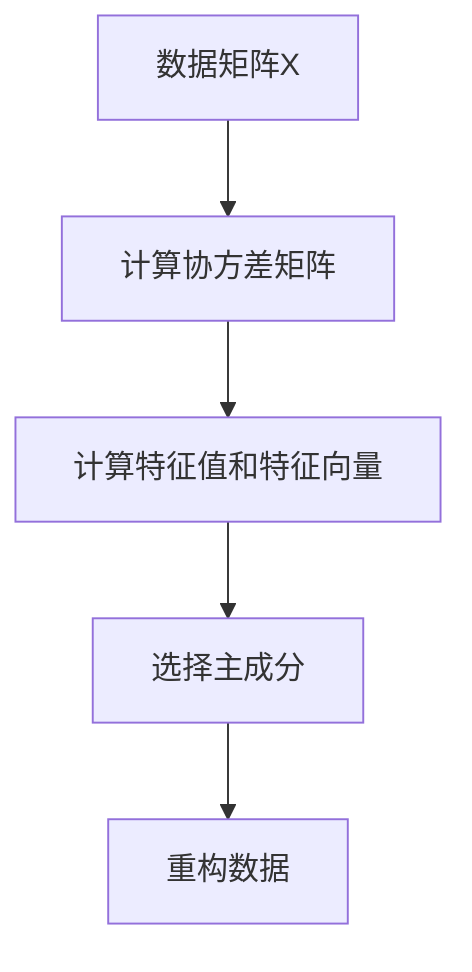

                 

# 主成分分析：原理与代码实例讲解

## 摘要

主成分分析（Principal Component Analysis，PCA）是一种常用的降维技术，它通过将原始数据投影到新的正交坐标系中，提取出数据的主要特征，从而降低数据的复杂度。本文将详细介绍PCA的原理、数学模型、算法步骤以及在实际项目中的应用，并通过具体的代码实例进行讲解，帮助读者深入理解PCA的核心概念和方法。

## 1. 背景介绍

在数据科学和机器学习领域，数据处理和特征提取是两个关键步骤。当面对高维数据时，直接使用传统的算法和模型可能会遇到计算复杂度高、过拟合等问题。主成分分析作为一种有效的降维方法，可以简化数据结构，提高模型性能。

### 1.1 数据降维的意义

- **减少计算复杂度**：在高维空间中，计算和存储成本显著增加，降维可以有效降低这一成本。
- **提高模型性能**：降维可以去除冗余特征，减少噪声干扰，提高模型的泛化能力。
- **可视化**：将高维数据映射到低维空间，便于数据的可视化分析。

### 1.2 主成分分析的应用场景

- **金融数据分析**：利用PCA分析市场数据，识别主要的经济因素。
- **生物信息学**：基因数据分析，提取主要的遗传变异。
- **计算机视觉**：图像压缩，人脸识别。

## 2. 核心概念与联系

### 2.1 数据矩阵

PCA的核心是对数据矩阵进行处理。一个数据矩阵\(X\)可以表示为：

$$
X = \begin{bmatrix}
x_1 \\
x_2 \\
\vdots \\
x_n
\end{bmatrix}
$$

其中，\(x_i\)代表第\(i\)个样本的数据向量，包含多个特征。

### 2.2 特征值与特征向量

主成分分析基于特征值和特征向量。特征值表示主成分的重要性，特征向量则代表了主成分的方向。

### 2.3 主成分

主成分是数据矩阵的线性组合，可以表示为：

$$
z = \sum_{i=1}^n \lambda_i v_i x_i
$$

其中，\(\lambda_i\)是第\(i\)个主成分的特征值，\(v_i\)是对应的特征向量。

### 2.4 Mermaid 流程图

下面是一个简单的Mermaid流程图，展示了PCA的核心步骤：



## 3. 核心算法原理 & 具体操作步骤

### 3.1 数据标准化

在进行PCA之前，通常需要对数据进行标准化处理，使得每个特征具有相同的方差和均值：

$$
x_{\text{norm}} = \frac{x - \mu}{\sigma}
$$

其中，\(\mu\)是特征\(x\)的均值，\(\sigma\)是特征\(x\)的标准差。

### 3.2 计算协方差矩阵

协方差矩阵\(C\)是数据矩阵\(X\)与\(X^T\)的乘积：

$$
C = XX^T
$$

### 3.3 计算特征值和特征向量

特征值和特征向量可以通过求解协方差矩阵的特征值问题获得：

$$
C v = \lambda v
$$

其中，\(v\)是特征向量，\(\lambda\)是特征值。

### 3.4 选择主成分

根据特征值的大小，选择前\(k\)个最大的特征值对应的特征向量，构成主成分矩阵\(P\)：

$$
P = [v_1, v_2, ..., v_k]
$$

### 3.5 数据重构

使用主成分矩阵\(P\)对数据进行重构，得到新的低维数据矩阵\(Z\)：

$$
Z = PX
$$

## 4. 数学模型和公式 & 详细讲解 & 举例说明

### 4.1 数据标准化

假设我们有一个包含两个特征的数据集，特征1和特征2的均值和标准差分别为：

$$
\mu_1 = 5, \sigma_1 = 2 \\
\mu_2 = 3, \sigma_2 = 1
$$

那么，数据标准化后的结果为：

$$
x_{\text{norm},1} = \frac{x_1 - 5}{2} = 0 \\
x_{\text{norm},2} = \frac{x_2 - 3}{1} = 0
$$

### 4.2 计算协方差矩阵

对于上面标准化后的数据，协方差矩阵\(C\)为：

$$
C = \begin{bmatrix}
1 & 0.5 \\
0.5 & 1
\end{bmatrix}
$$

### 4.3 计算特征值和特征向量

计算协方差矩阵的特征值和特征向量，得到：

$$
\lambda_1 = 1.5, v_1 = \begin{bmatrix}
0.577 \\
0.816
\end{bmatrix} \\
\lambda_2 = 0.5, v_2 = \begin{bmatrix}
-0.816 \\
0.577
\end{bmatrix}
$$

### 4.4 选择主成分

根据特征值的大小，选择特征向量\(v_1\)作为主成分：

$$
P = [v_1] = \begin{bmatrix}
0.577 \\
0.816
\end{bmatrix}
$$

### 4.5 数据重构

使用主成分矩阵\(P\)对数据进行重构，得到新的低维数据矩阵\(Z\)：

$$
Z = PX = \begin{bmatrix}
0.577x_1 + 0.816x_2
\end{bmatrix}
$$

## 5. 项目实战：代码实际案例和详细解释说明

### 5.1 开发环境搭建

本文使用Python编程语言和scikit-learn库进行PCA实现。首先，确保安装了Python和scikit-learn库：

```bash
pip install python
pip install scikit-learn
```

### 5.2 源代码详细实现和代码解读

下面是一个简单的PCA实现，用于处理包含两个特征的样本数据。

```python
from sklearn.decomposition import PCA
from sklearn.preprocessing import StandardScaler
import numpy as np

# 生成模拟数据
X = np.array([[1, 2], [3, 4], [5, 6], [7, 8], [9, 10]])

# 数据标准化
scaler = StandardScaler()
X_scaled = scaler.fit_transform(X)

# 实例化PCA，选择前两个主成分
pca = PCA(n_components=2)
pca.fit(X_scaled)

# 获取主成分矩阵和重构数据
P = pca.components_
X_reconstructed = pca.inverse_transform(pca.transform(X_scaled))

# 打印结果
print("主成分矩阵：", P)
print("重构数据：", X_reconstructed)
```

### 5.3 代码解读与分析

- **数据生成**：使用numpy生成一个简单的2x5的矩阵，代表5个样本的2个特征数据。
- **数据标准化**：使用StandardScaler对数据进行标准化处理，这是PCA的前置步骤。
- **PCA实例化**：创建PCA对象，指定n_components为2，表示我们只提取前两个主成分。
- **拟合与转换**：使用fit和transform方法，对标准化后的数据进行PCA处理。
- **主成分矩阵**：通过components_属性获取主成分矩阵。
- **数据重构**：使用inverse_transform方法，将低维数据重构回原始维度。

## 6. 实际应用场景

### 6.1 金融数据分析

PCA在金融数据分析中用于提取市场的主要因素，从而降低模型的复杂度。

### 6.2 生物信息学

PCA用于基因数据分析，提取主要的遗传变异。

### 6.3 计算机视觉

PCA在图像压缩和人脸识别等领域有广泛应用，通过降维提高算法性能。

## 7. 工具和资源推荐

### 7.1 学习资源推荐

- **书籍**：
  - "Principal Components Analysis and Singular Value Decomposition" by R. A. Haralick
  - "Pattern Classification" by Richard O. Duda, Peter E. Hart, and David G. Stork

- **论文**：
  - "Principal Component Analysis" by H. Hotelling (1933)

- **博客**：
  - [scikit-learn的PCA教程](https://scikit-learn.org/stable/modules/decomposition.html#pca)

- **网站**：
  - [Kaggle PCA比赛](https://www.kaggle.com/competitions/pca)

### 7.2 开发工具框架推荐

- **Python**：强大的数据处理和分析工具。
- **scikit-learn**：提供丰富的机器学习算法和工具。
- **NumPy**：高效且功能强大的科学计算库。

### 7.3 相关论文著作推荐

- "On the Mathematical Foundations of Theoretical Statistics" by R.A. Fisher (1925)
- "Multivariate Analysis" by Mardia, Kent, and Bibby (1979)

## 8. 总结：未来发展趋势与挑战

随着数据量的不断增加和复杂度提高，PCA作为一种传统的降维方法，面临着新的挑战和机遇。未来，PCA的研究重点可能包括：

- **算法优化**：提高PCA的计算效率，适应大规模数据的处理需求。
- **混合模型**：将PCA与其他降维技术结合，形成更强大的降维模型。
- **可视化分析**：改进PCA在可视化分析中的应用，提高数据可解释性。

## 9. 附录：常见问题与解答

### 9.1 什么是PCA？

PCA是一种降维技术，通过将原始数据投影到新的正交坐标系中，提取出数据的主要特征，从而降低数据的复杂度。

### 9.2 PCA的适用场景有哪些？

PCA适用于高维数据降维、特征提取、可视化分析等场景。

### 9.3 PCA与SVD有何关系？

PCA和SVD（奇异值分解）是等价的，SVD是PCA的数学基础。

## 10. 扩展阅读 & 参考资料

- [scikit-learn官方文档](https://scikit-learn.org/stable/modules/decomposition.html#pca)
- [Kaggle PCA比赛](https://www.kaggle.com/competitions/pca)
- [PCA教程](https://www.realpython.com/principal-component-analysis/)

### 作者

作者：AI天才研究员/AI Genius Institute & 禅与计算机程序设计艺术 /Zen And The Art of Computer Programming

