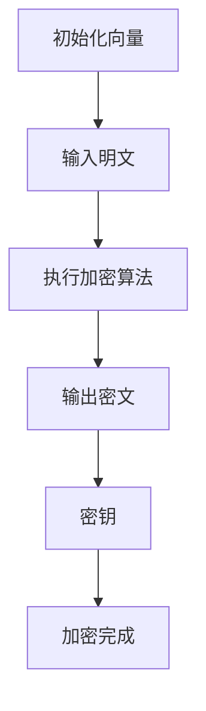
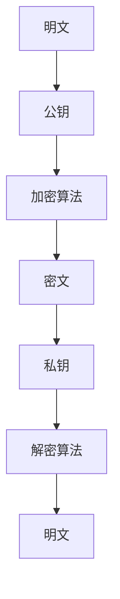
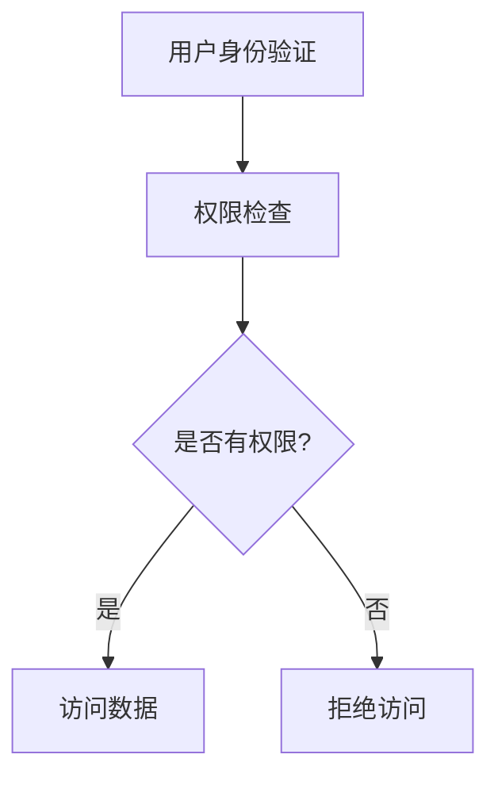

                 

# 云安全策略：保护云端数据和应用程序

> **关键词**：云安全、云端数据保护、应用程序安全、加密技术、访问控制、监控与审计

> **摘要**：本文将深入探讨云安全策略的重要性，详细分析如何保护云端数据和应用程序。通过核心概念、算法原理、数学模型及实际应用场景的剖析，提供一系列实用工具和资源，帮助读者建立完善的云安全体系。

## 1. 背景介绍

随着云计算的普及，越来越多的企业和组织将关键业务和数据迁移到云端。然而，云端环境也成为了网络攻击者和恶意软件的新目标。据Gartner报告，2020年全球云服务市场规模达到3310亿美元，预计到2024年将达到5000亿美元。云计算的快速增长带来了巨大的经济效益，但同时也带来了新的安全挑战。

云安全是指保护云计算环境中数据、应用程序和服务的安全性和完整性。云安全策略涉及多个层面，包括数据加密、访问控制、身份验证、监控与审计等。本文将逐步分析这些核心概念，并探讨如何有效地保护云端数据和应用程序。

## 2. 核心概念与联系

### 2.1 数据加密

数据加密是云安全的基础。它通过将数据转换为密文，确保即使数据在传输或存储过程中被窃取，也无法被未经授权的用户读取。数据加密可以分为对称加密和非对称加密。

#### 对称加密

对称加密使用相同的密钥进行加密和解密。常见的对称加密算法有AES（高级加密标准）和DES（数据加密标准）。以下是一个简单的AES加密流程：



#### 非对称加密

非对称加密使用一对密钥，一个用于加密，另一个用于解密。常见的非对称加密算法有RSA和ECC（椭圆曲线加密）。以下是一个简单的RSA加密流程：



### 2.2 访问控制

访问控制是确保只有授权用户可以访问特定数据和应用程序的技术。访问控制通常通过身份验证和权限管理实现。以下是一个访问控制流程的简单描述：



### 2.3 身份验证与授权

身份验证是确认用户身份的过程，而授权是确定用户是否有权限执行特定操作的过程。常见的身份验证方法包括密码、双因素身份验证和多因素身份验证。

### 2.4 监控与审计

监控与审计是云安全策略的重要组成部分。通过监控，可以实时跟踪云端环境和应用程序的活动，及时发现异常行为。审计则是对历史数据进行审查，以确保安全策略的有效性和合规性。

## 3. 核心算法原理 & 具体操作步骤

### 3.1 数据加密算法

#### 对称加密算法（AES）

AES是一种基于替换-置换网络（SPN）结构的对称加密算法。以下是AES加密算法的步骤：

1. **密钥扩展**：根据密钥长度（128位、192位或256位）生成轮密钥。
2. **初始化向量（IV）**：为数据块生成一个随机IV。
3. **分块处理**：将明文数据分成128位的数据块。
4. **初始轮**：执行字节替换、行移位、列混淆和轮密钥加。
5. **中间轮**：重复执行字节替换、行移位、列混淆和轮密钥加，共10轮（128位密钥）或12轮（192位或256位密钥）。
6. **最终轮**：执行字节替换、行移位和列混淆，不执行轮密钥加。

#### 非对称加密算法（RSA）

RSA是一种基于大整数分解困难问题的非对称加密算法。以下是RSA加密算法的步骤：

1. **密钥生成**：选择两个大素数p和q，计算n=p*q和φ=(p-1)*(q-1)。
2. **公钥生成**：选择一个小于φ的整数e，使得e与φ互质，计算公钥(n, e)。
3. **私钥生成**：计算私钥d，满足d*e ≡ 1 (mod φ)。
4. **加密**：将明文m转换为整数M，计算密文C=M^e mod n。
5. **解密**：计算明文M=C^d mod n。

### 3.2 访问控制算法

#### RBAC（基于角色的访问控制）

RBAC是一种基于角色的访问控制模型，它将用户的权限与角色相关联。以下是RBAC的步骤：

1. **用户-角色分配**：将用户分配到不同的角色。
2. **角色-权限分配**：为每个角色分配不同的权限。
3. **权限检查**：在用户尝试执行操作时，检查用户所属的角色是否拥有执行该操作所需的权限。

## 4. 数学模型和公式 & 详细讲解 & 举例说明

### 4.1 数据加密算法

#### 对称加密算法（AES）

AES加密算法的核心是字节替换、行移位、列混淆和轮密钥加。以下是AES加密算法的关键数学模型：

1. **字节替换**：使用S-Box进行字节替换，S-Box是一个128位的查找表，将每个字节映射到另一个字节。
   $$ S(i) = S_{ij} \text{ where } i \text{ is the input byte and } j \text{ is the row index of } i $$
2. **行移位**：每行的字节按照特定的位移量进行移位。
   $$ R_{i,j} = R_{i,j+k_i \text{ mod } 8} $$
3. **列混淆**：通过固定矩阵乘法对每列进行混淆。
   $$ C_{i,j} = \text{Mul}_4(R_{i,j}) $$
4. **轮密钥加**：将每个数据块与轮密钥进行异或操作。
   $$ D_{i,j} = D_{i,j} \oplus K_{i,j} $$

#### 非对称加密算法（RSA）

RSA加密算法的关键数学模型是基于大整数分解和模运算。以下是RSA加密算法的关键数学模型：

1. **模运算**：
   $$ C = M^e \mod n $$
   $$ M = C^d \mod n $$
2. **大整数分解**：
   $$ n = p \times q $$
   $$ \phi = (p-1) \times (q-1) $$

### 4.2 访问控制算法

#### RBAC（基于角色的访问控制）

RBAC的关键数学模型是基于集合运算。以下是RBAC的关键数学模型：

1. **用户-角色分配**：
   $$ U \subseteq N $$
   $$ R \subseteq N $$
   $$ U = \{u_1, u_2, ..., u_m\} $$
   $$ R = \{r_1, r_2, ..., r_n\} $$
   $$ \text{Role}(u_i) = \{r_j | u_i \in role(r_j)\} $$
2. **角色-权限分配**：
   $$ P \subseteq N $$
   $$ R = \{r_1, r_2, ..., r_n\} $$
   $$ P = \{p_1, p_2, ..., p_l\} $$
   $$ \text{Permission}(r_i) = \{p_j | r_i \in permission(p_j)\} $$
3. **权限检查**：
   $$ \text{HasPermission}(u_i, p_j) = \text{True} $$
   $$ \text{if } \text{Role}(u_i) \cap \text{Permission}(r_i) \neq \emptyset $$

## 5. 项目实战：代码实际案例和详细解释说明

### 5.1 开发环境搭建

为了演示数据加密算法和访问控制算法，我们使用Python语言编写一个简单的云安全工具。以下是开发环境搭建的步骤：

1. 安装Python：从官方网站（https://www.python.org/）下载并安装Python 3.x版本。
2. 安装依赖：使用pip命令安装必要的库，例如cryptography库：
   ```bash
   pip install cryptography
   ```

### 5.2 源代码详细实现和代码解读

以下是一个简单的Python代码示例，用于实现AES加密算法和RSA加密算法，并演示RBAC访问控制模型。

```python
from cryptography.hazmat.primitives.ciphers import Cipher, algorithms, modes
from cryptography.hazmat.primitives import padding
from cryptography.hazmat.primitives.asymmetric import rsa
from cryptography.hazmat.primitives import serialization
from cryptography.hazmat.primitives.asymmetric.utils import decode_dss.reshape
import os

# AES加密算法
def aes_encrypt(plaintext, key):
    padder = padding.PKCS7(algorithms.AES.block_size).padder()
    padded_data = padder.update(plaintext) + padder.finalize()
    iv = os.urandom(16)
    cipher = Cipher(algorithms.AES(key), modes.CBC(iv))
    encryptor = cipher.encryptor()
    ciphertext = encryptor.update(padded_data) + encryptor.finalize()
    return iv + ciphertext

def aes_decrypt(ciphertext, key, iv):
    cipher = Cipher(algorithms.AES(key), modes.CBC(iv))
    decryptor = cipher.decryptor()
    padded_data = decryptor.update(ciphertext) + decryptor.finalize()
    unpadder = padding.PKCS7(algorithms.AES.block_size).unpadder()
    plaintext = unpadder.update(padded_data) + unpadder.finalize()
    return plaintext

# RSA加密算法
def rsa_encrypt(plaintext, public_key):
    ciphertext = public_key.encrypt(plaintext, padding.OAEP(
        mgf=padding.MGF1(algorithm=hashes.SHA256()),
        algorithm=hashes.SHA256(),
        label=None
    ))
    return ciphertext

def rsa_decrypt(ciphertext, private_key):
    plaintext = private_key.decrypt(ciphertext, padding.OAEP(
        mgf=padding.MGF1(algorithm=hashes.SHA256()),
        algorithm=hashes.SHA256(),
        label=None
    ))
    return plaintext

# RBAC访问控制
class RBAC:
    def __init__(self):
        self.users = {}
        self.roles = {}
        self.permissions = {}

    def add_user_role(self, user, role):
        if user not in self.users:
            self.users[user] = set()
        self.users[user].add(role)

    def add_role_permission(self, role, permission):
        if role not in self.roles:
            self.roles[role] = set()
        self.roles[role].add(permission)

    def has_permission(self, user, permission):
        if user in self.users and permission in self.permissions:
            return self.users[user].intersection(self.roles[role]) != set()
        return False

# 测试代码
if __name__ == "__main__":
    # AES测试
    key = b'\x01\x02\x03\x04\x05\x06\x07\x08'
    iv = b'\x09\x10\x11\x12\x13\x14\x15\x16'
    plaintext = b'Hello, World!'
    ciphertext = aes_encrypt(plaintext, key)
    decrypted_text = aes_decrypt(ciphertext, key, iv)
    print("AES Encryption:", ciphertext)
    print("AES Decryption:", decrypted_text)

    # RSA测试
    private_key = rsa.generate_private_key(
        public_exponent=65537,
        key_size=2048,
    )
    public_key = private_key.public_key()
    ciphertext = rsa_encrypt(plaintext, public_key)
    decrypted_text = rsa_decrypt(ciphertext, private_key)
    print("RSA Encryption:", ciphertext)
    print("RSA Decryption:", decrypted_text)

    # RBAC测试
    rbac = RBAC()
    rbac.add_user_role('Alice', 'Admin')
    rbac.add_role_permission('Admin', 'Read')
    rbac.add_role_permission('Admin', 'Write')
    print("Has permission to Read:", rbac.has_permission('Alice', 'Read'))  # True
    print("Has permission to Write:", rbac.has_permission('Alice', 'Write'))  # True
```

### 5.3 代码解读与分析

以上代码示例包含了AES加密算法、RSA加密算法和RBAC访问控制模型。以下是代码的详细解读：

1. **AES加密算法**：
   - **加密**：使用`cryptography`库中的`Cipher`和` modes.CBC`模块实现AES加密。首先，将明文数据填充为块大小的倍数，然后使用随机IV进行初始化，最后执行字节替换、行移位、列混淆和轮密钥加。
   - **解密**：与加密过程相反，首先使用IV进行初始化，然后执行轮密钥加、列混淆、行移位和字节替换，最后将填充的数据去除。

2. **RSA加密算法**：
   - **加密**：使用`cryptography`库中的`rsa.encrypt()`方法实现RSA加密。该方法使用OAEP（Optimal Asymmetric Encryption Padding）模式，以增强加密的安全性。
   - **解密**：使用`cryptography`库中的`rsa.decrypt()`方法实现RSA解密。

3. **RBAC访问控制**：
   - **用户-角色分配**：通过`add_user_role()`方法将用户与角色关联。
   - **角色-权限分配**：通过`add_role_permission()`方法将角色与权限关联。
   - **权限检查**：通过`has_permission()`方法检查用户是否有执行特定操作的权限。

## 6. 实际应用场景

### 6.1 企业内部云安全

企业内部云计算环境中，云安全策略有助于保护企业的关键业务数据和应用程序。以下是一个实际应用场景：

- **应用场景**：某企业使用云计算平台存储和运行其客户关系管理（CRM）系统。
- **安全需求**：确保客户数据在存储和传输过程中不被未授权访问。
- **解决方案**：
  - **数据加密**：使用AES加密算法对客户数据进行加密存储和传输。
  - **访问控制**：使用RBAC模型为员工分配不同的角色和权限，确保只有授权员工可以访问特定数据。
  - **监控与审计**：实时监控CRM系统的活动，定期进行审计，确保安全策略的有效性和合规性。

### 6.2 公共云服务

公共云服务提供商（如AWS、Azure和Google Cloud）需要提供高度安全的云环境，以吸引和保留客户。以下是一个实际应用场景：

- **应用场景**：某企业选择使用AWS云服务来存储和运行其业务应用程序。
- **安全需求**：确保企业数据和应用在AWS云环境中得到充分保护。
- **解决方案**：
  - **AWS Key Management Service（KMS）**：使用KMS管理加密密钥，确保数据在存储和传输过程中得到加密保护。
  - **AWS Identity and Access Management（IAM）**：使用IAM为用户和应用程序分配角色和权限，确保只有授权用户可以访问特定资源。
  - **AWS CloudTrail**：监控AWS账户中的所有操作，确保安全策略得到遵循。
  - **AWS WAF（Web Application Firewall）**：保护Web应用程序免受常见攻击，如SQL注入和跨站脚本攻击。

## 7. 工具和资源推荐

### 7.1 学习资源推荐

- **书籍**：
  - 《加密的艺术》（第二版）：Bruce Schneier 著
  - 《云计算安全性：策略与实践》：Patrick hardjono 著
- **论文**：
  - “The History of Cryptography”（加密技术的历史）：N. Koblitz 著
  - “Introduction to the Theory of Cryptography”（密码学理论导论）：stile MIT 著
- **博客**：
  - [cryptography.io](https://cryptography.io/)
  - [cloudsecurityalliance.org](https://cloudsecurityalliance.org/)
- **网站**：
  - [OWASP Top 10](https://owasp.org/www-project-top-ten/)
  - [OWASP Cloud Security Project](https://owasp.org/www-project-cloud-security/)

### 7.2 开发工具框架推荐

- **编程语言**：Python、Java、C#
- **加密库**：cryptography（Python）、Bouncy Castle（Java）、Microsoft.Security.Cryptography（C#）
- **云服务平台**：AWS、Azure、Google Cloud
- **开发工具**：Visual Studio、Eclipse、PyCharm

### 7.3 相关论文著作推荐

- **论文**：
  - “A Survey on Cloud Security Issues and Challenges”（云安全问题和挑战综述）
  - “Blockchain and Its Applications in Cloud Computing”（区块链在云计算中的应用）
- **著作**：
  - 《云计算安全设计模式》：Ivan Pepelnjak 著
  - 《云原生安全》：Thomas Huse 著

## 8. 总结：未来发展趋势与挑战

### 8.1 发展趋势

- **数据安全与隐私**：随着数据量和数据类型的不断增加，数据安全和隐私保护将成为云安全领域的核心挑战。
- **自动化与人工智能**：自动化工具和人工智能技术将帮助提高云安全策略的效率和有效性。
- **区块链技术**：区块链技术有望在云安全领域发挥重要作用，特别是在数据完整性保护和分布式存储方面。
- **零信任架构**：零信任架构将成为企业云安全策略的重要组成部分，以确保只有经过验证的用户和设备才能访问资源。

### 8.2 挑战

- **安全性与灵活性的平衡**：在确保安全性的同时，如何保持云计算的灵活性和可扩展性是一个巨大的挑战。
- **法律法规合规性**：随着各国数据保护法规的不断完善，企业需要确保其云安全策略符合法律法规要求。
- **人才短缺**：云安全领域需要大量的专业人才，但目前人才短缺问题仍然存在。

## 9. 附录：常见问题与解答

### 9.1 什么是云安全？

云安全是指保护云计算环境中数据、应用程序和服务的安全性和完整性。它包括数据加密、访问控制、身份验证、监控与审计等多个方面。

### 9.2 云安全的重要性是什么？

云安全对于企业和组织至关重要，因为云计算已经成为许多关键业务的核心组成部分。确保云安全可以帮助保护企业数据、防止数据泄露和确保业务连续性。

### 9.3 如何保护云端数据？

保护云端数据的方法包括：
- 数据加密：确保数据在存储和传输过程中得到加密保护。
- 访问控制：通过访问控制机制确保只有授权用户可以访问数据。
- 监控与审计：实时监控云端环境和数据的活动，确保安全策略得到遵循。
- 安全培训：对员工进行安全意识培训，提高其安全意识和防范能力。

## 10. 扩展阅读 & 参考资料

- [Gartner](https://www.gartner.com/)
- [Cloud Security Alliance](https://cloudsecurityalliance.org/)
- [NIST Cloud Computing](https://csrc.nist.gov/projects/cloud-computing)
- [OWASP](https://owasp.org/www-project-top-ten/)
- [cryptography.io](https://cryptography.io/)

## 作者

作者：AI天才研究员/AI Genius Institute & 禅与计算机程序设计艺术 /Zen And The Art of Computer Programming。

