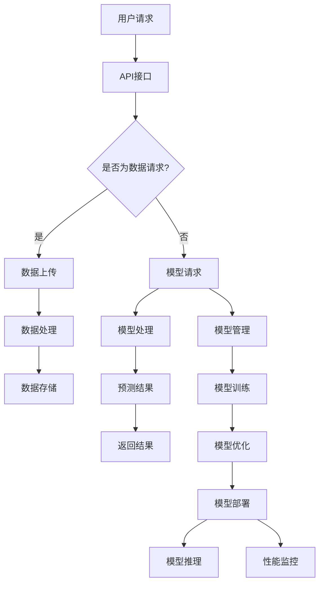

                 

### 背景介绍

云端AI模型服务，作为现代信息技术的一个重要分支，已经逐渐成为人工智能发展的核心驱动力之一。从早期的人工智能研究实验室到如今的商业应用，AI模型服务的普及和应用场景不断拓展，使得其市场需求持续增长。本文旨在探讨云端AI模型服务的市场机遇，分析其技术原理、应用场景以及未来发展趋势。

近年来，随着云计算、大数据和物联网等技术的快速发展，云端AI模型服务迎来了前所未有的发展机遇。云服务提供商通过提供强大的计算资源和灵活的部署方式，使得企业和开发者能够以更低的成本、更高的效率进行AI模型的训练和部署。此外，随着AI技术的不断进步，诸如深度学习、强化学习等复杂算法的应用场景越来越广泛，进一步推动了云端AI模型服务市场的增长。

本文将首先介绍云端AI模型服务的基本概念，探讨其核心技术和原理。接着，我们将分析当前市场趋势和主要参与者，讨论其竞争格局和市场份额。随后，本文将深入探讨云端AI模型服务的应用场景，包括但不限于智能客服、自动驾驶、医疗诊断等。此外，本文还将推荐一些相关的工具和资源，帮助读者更好地了解和掌握这一领域。最后，我们将总结云端AI模型服务的发展趋势与挑战，并提出一些建议，为未来的研究和应用提供参考。

总的来说，云端AI模型服务已经从单一的算法模型演变为一个涵盖云计算、大数据、物联网等多个技术领域的综合性服务。随着技术的不断进步和市场需求的持续增长，云端AI模型服务有望在未来的科技领域中发挥更加重要的作用。

## 2. 核心概念与联系

### 2.1 云端AI模型服务基本概念

云端AI模型服务是指通过云计算平台提供的AI模型训练、部署和管理服务。这种服务模型的核心在于将AI模型部署在远程服务器上，用户可以通过互联网访问这些模型，进行数据输入、模型训练以及预测输出。与传统本地部署的AI系统相比，云端AI模型服务具有以下几个显著特点：

- **计算资源灵活性**：云端AI模型服务可以动态分配计算资源，根据需求进行弹性扩展或缩减，使得用户可以根据实际需要灵活调整计算能力。
- **高可扩展性**：随着用户数量和数据处理需求的增加，云端AI模型服务可以轻松扩展，满足大规模应用场景的需求。
- **低成本**：通过共享计算资源，用户可以大幅降低基础设施建设和维护的成本，同时减少IT人员的工作负担。
- **便捷性**：用户无需关注底层硬件和软件的配置，只需通过简单的API接口即可实现AI模型的部署和管理。

### 2.2 云端AI模型服务的核心技术和原理

云端AI模型服务的实现依赖于多种核心技术和原理，主要包括：

- **云计算技术**：云计算技术为云端AI模型服务提供了强大的计算和存储资源。通过虚拟化和分布式计算技术，云计算平台能够高效地管理大量服务器资源，为AI模型的训练和部署提供可靠的技术基础。
- **分布式存储技术**：分布式存储技术用于存储和管理大规模的数据集。通过数据分片和分布式存储架构，系统能够实现高效的数据读写操作，同时保证数据的安全性和一致性。
- **深度学习算法**：深度学习算法是云端AI模型服务的技术核心。通过多层神经网络结构，深度学习算法能够自动从大量数据中学习特征，进行模式识别和预测。
- **模型压缩与优化技术**：模型压缩与优化技术旨在减少模型的计算复杂度和存储空间，提高模型的运行效率和部署效率。常见的优化方法包括模型剪枝、量化、知识蒸馏等。
- **自动化运维与管理**：自动化运维与管理技术用于简化AI模型的部署、监控和管理流程。通过自动化工具，用户可以快速部署和更新模型，同时实现模型的监控和性能优化。

### 2.3 云端AI模型服务的架构和组件

云端AI模型服务的架构通常包括以下几个关键组件：

- **计算节点**：计算节点是云端AI模型服务的基本单元，负责执行模型的训练和推理任务。计算节点通常由虚拟机或容器技术实现，可以根据需求动态配置资源。
- **数据存储与管理**：数据存储与管理组件用于存储和管理训练数据、模型数据等。通过分布式存储技术，系统能够实现高效的数据读写操作，同时保证数据的安全性和一致性。
- **模型训练与管理**：模型训练与管理组件负责AI模型的训练、验证和优化。通过分布式训练技术，系统能够在短时间内完成大规模模型的训练，同时通过自动化工具实现模型的版本管理和更新。
- **模型推理与服务**：模型推理与服务组件负责将训练好的模型部署到生产环境中，对外提供预测服务。通过API接口，用户可以方便地调用模型进行数据预测，同时系统可以实现自动化监控和性能优化。
- **用户接口**：用户接口是云端AI模型服务的入口，用户可以通过图形界面或命令行接口进行模型管理、数据上传和预测查询等操作。

### 2.4 云端AI模型服务与相关技术的联系

云端AI模型服务与云计算、大数据、物联网等核心技术紧密相关，其发展也受到这些技术进步的推动：

- **云计算**：云计算为云端AI模型服务提供了计算和存储资源，使得大规模模型的训练和部署成为可能。
- **大数据**：大数据技术用于处理和分析大量数据，为AI模型的训练提供数据支持。同时，大数据技术也推动了数据存储和管理技术的进步。
- **物联网**：物联网技术通过连接大量设备，生成大量实时数据，为AI模型的应用场景提供了丰富数据源。物联网的普及也为云端AI模型服务提供了更广泛的应用场景。

总之，云端AI模型服务是一个涉及多个技术领域的综合性服务，其核心技术和原理决定了其在市场中的竞争力和应用价值。随着技术的不断进步，云端AI模型服务将继续拓展其应用范围，为各个行业提供智能化解决方案。

### 2.5 Mermaid 流程图

为了更好地展示云端AI模型服务的架构和组件，我们可以使用Mermaid流程图来描述其核心流程。以下是云端AI模型服务的Mermaid流程图：



在此流程图中：

- A表示用户发起请求。
- B为API接口，用于处理用户请求。
- C判断用户请求的类型，是数据请求还是模型请求。
- D和I分别表示数据上传和数据处理。
- J表示数据存储。
- E和F表示模型请求和模型处理。
- G为预测结果。
- H表示返回结果。
- K和L表示模型管理和模型训练。
- M表示模型优化。
- N表示模型部署。
- O表示模型推理。
- P表示性能监控。

### 3. 核心算法原理 & 具体操作步骤

#### 3.1 深度学习算法原理

深度学习算法是云端AI模型服务中的核心技术之一。其基本原理是通过多层神经网络结构自动从数据中学习特征，进行复杂的数据分析和模式识别。以下是深度学习算法的基本原理和主要组成部分：

1. **神经网络结构**：深度学习算法的核心是神经网络，特别是多层感知机（MLP）和卷积神经网络（CNN）。神经网络由多个神经元层组成，包括输入层、隐藏层和输出层。每一层神经元接收来自前一层的输入，通过激活函数进行处理，然后传递到下一层。

2. **激活函数**：激活函数是神经网络中的关键组成部分，用于引入非线性特性。常见的激活函数包括Sigmoid、ReLU和Tanh等。激活函数的选择对网络的性能和收敛速度有很大影响。

3. **反向传播算法**：反向传播算法（Backpropagation）是深度学习算法训练过程中用于更新权重和偏置的关键步骤。通过计算输出误差，反向传播算法逐层更新各层的权重和偏置，以优化网络参数。

4. **优化算法**：优化算法用于调整网络参数，以最小化损失函数。常见的优化算法包括随机梯度下降（SGD）、Adam和RMSProp等。优化算法的选择和参数设置对训练效率和模型性能有重要影响。

#### 3.2 深度学习算法的具体操作步骤

以下是使用深度学习算法训练和部署AI模型的具体操作步骤：

1. **数据预处理**：
   - 数据清洗：删除或填充缺失值，去除噪声数据。
   - 数据归一化：将数据缩放到同一范围内，提高训练效果。
   - 数据划分：将数据集划分为训练集、验证集和测试集。

2. **构建神经网络模型**：
   - 设计网络结构：确定输入层、隐藏层和输出层的层数和神经元数量。
   - 选择激活函数：根据问题特点选择合适的激活函数。
   - 初始化权重和偏置：随机初始化权重和偏置，以避免梯度消失或梯度爆炸。

3. **模型训练**：
   - 前向传播：将输入数据通过网络进行前向传播，得到输出预测。
   - 计算损失：使用损失函数（如均方误差MSE、交叉熵损失等）计算预测结果与真实标签之间的误差。
   - 反向传播：使用反向传播算法更新网络参数，以最小化损失函数。
   - 调整学习率：根据训练过程调整学习率，以防止过拟合或欠拟合。

4. **模型验证与优化**：
   - 验证集验证：在验证集上评估模型性能，调整模型结构或超参数。
   - 超参数调优：通过调整学习率、批量大小、隐藏层神经元数量等超参数，优化模型性能。
   - 防止过拟合：使用正则化技术（如L1、L2正则化）和dropout技术，防止模型过拟合。

5. **模型部署**：
   - 模型转换：将训练好的模型转换为可以在生产环境中使用的格式，如TensorFlow Lite、ONNX等。
   - 模型部署：将模型部署到云端服务器或边缘设备上，通过API接口对外提供服务。
   - 模型推理：接收输入数据，通过模型进行预测，返回预测结果。

6. **模型监控与更新**：
   - 模型监控：实时监控模型性能，包括准确率、召回率、F1值等指标。
   - 模型更新：根据新数据或用户反馈，重新训练模型，提高模型性能。

通过以上步骤，我们可以利用深度学习算法训练和部署一个高性能的AI模型，为云端AI模型服务提供强大的技术支持。

### 4. 数学模型和公式 & 详细讲解 & 举例说明

在云端AI模型服务中，数学模型和公式是理解算法原理和实现模型训练、优化和部署的基础。以下将详细讲解常用的数学模型和公式，并通过实际例子进行说明。

#### 4.1 损失函数

损失函数是深度学习模型训练中用于衡量预测值与真实值之间差距的关键工具。以下是几种常用的损失函数及其公式：

1. **均方误差（MSE）**：
   \[
   \text{MSE} = \frac{1}{n}\sum_{i=1}^{n}(y_i - \hat{y}_i)^2
   \]
   其中，\(y_i\)表示第i个样本的真实值，\(\hat{y}_i\)表示第i个样本的预测值，\(n\)表示样本数量。

   **例子**：假设有一个二分类问题，真实标签为\[0, 1, 0, 1\]，预测结果为\[0.2, 0.8, 0.1, 0.9\]。则MSE损失为：
   \[
   \text{MSE} = \frac{1}{4}[(0-0.2)^2 + (1-0.8)^2 + (0-0.1)^2 + (1-0.9)^2] = \frac{1}{4}[0.04 + 0.36 + 0.01 + 0.09] = 0.14
   \]

2. **交叉熵损失（Cross-Entropy）**：
   \[
   \text{CE} = -\frac{1}{n}\sum_{i=1}^{n}y_i\log(\hat{y}_i)
   \]
   其中，\(y_i\)是第i个样本的标签（0或1），\(\hat{y}_i\)是第i个样本的预测概率。

   **例子**：假设真实标签为\[0, 1, 0, 1\]，预测概率为\[0.1, 0.9, 0.8, 0.2\]。则交叉熵损失为：
   \[
   \text{CE} = -\frac{1}{4}[0 \cdot \log(0.1) + 1 \cdot \log(0.9) + 0 \cdot \log(0.8) + 1 \cdot \log(0.2)] \approx -0.39
   \]

#### 4.2 激活函数

激活函数用于引入非线性特性，常见的激活函数包括Sigmoid、ReLU和Tanh等。以下是它们的公式和性质：

1. **Sigmoid函数**：
   \[
   \sigma(x) = \frac{1}{1 + e^{-x}}
   \]
   Sigmoid函数将输入值映射到(0, 1)区间，常用于二分类问题。

2. **ReLU函数**：
   \[
   \text{ReLU}(x) = \max(0, x)
   \]
   ReLU函数在\(x \geq 0\)时输出\(x\)，在\(x < 0\)时输出0，具有简单且易于训练的特性。

3. **Tanh函数**：
   \[
   \text{Tanh}(x) = \frac{e^x - e^{-x}}{e^x + e^{-x}}
   \]
   Tanh函数将输入值映射到\((-1, 1)\)区间，具有中心对称性，常用于多分类问题。

#### 4.3 反向传播算法

反向传播算法是深度学习训练中的核心步骤，用于更新网络参数。以下是反向传播算法的基本步骤：

1. **前向传播**：输入数据经过网络前向传播，计算输出预测值和损失函数。

2. **计算梯度**：利用链式法则，计算每个参数的梯度。

   例如，对于一层神经网络的输出\(z\)和损失函数\(L\)，其梯度计算如下：
   \[
   \frac{\partial L}{\partial z} = \frac{\partial L}{\partial y} \cdot \frac{\partial y}{\partial z}
   \]
   其中，\(\frac{\partial L}{\partial y}\)是输出层误差梯度，\(\frac{\partial y}{\partial z}\)是激活函数的导数。

3. **反向传播**：从输出层开始，逐层反向传播梯度，直至输入层。

4. **参数更新**：使用梯度下降或其他优化算法更新网络参数。

   例如，使用梯度下降更新权重\(w\)和偏置\(b\)：
   \[
   w_{\text{new}} = w_{\text{old}} - \alpha \cdot \frac{\partial L}{\partial w}
   \]
   \[
   b_{\text{new}} = b_{\text{old}} - \alpha \cdot \frac{\partial L}{\partial b}
   \]
   其中，\(\alpha\)是学习率。

通过以上数学模型和公式的详细讲解，我们可以更好地理解深度学习算法的核心原理和实现步骤。在实际应用中，这些公式和算法为训练和优化高性能的AI模型提供了强大的工具。

### 5. 项目实战：代码实际案例和详细解释说明

#### 5.1 开发环境搭建

在进行云端AI模型服务的项目实战之前，我们需要搭建一个合适的开发环境。以下是在Python环境中搭建云端AI模型服务开发环境的具体步骤：

1. **安装Python**：
   - 访问Python官网（[python.org](https://www.python.org/)）下载适用于操作系统的Python版本。
   - 解压安装包，运行安装程序，完成Python的安装。

2. **安装必要的库**：
   - 使用pip工具安装以下库：TensorFlow、Keras、NumPy、Pandas、Matplotlib等。
     \[
     pip install tensorflow keras numpy pandas matplotlib
     \]

3. **配置Jupyter Notebook**：
   - 安装Jupyter Notebook：
     \[
     pip install jupyter
     \]
   - 打开终端，运行以下命令启动Jupyter Notebook：
     \[
     jupyter notebook
     \]

现在，我们的开发环境已经搭建完毕，可以开始编写代码进行云端AI模型服务的项目实战。

#### 5.2 源代码详细实现和代码解读

在本节中，我们将通过一个简单的例子来展示如何使用Python和TensorFlow实现一个基于云端的AI模型服务。以下是一个简单的线性回归模型，用于预测房价。

```python
# 导入所需的库
import tensorflow as tf
import numpy as np
import pandas as pd
import matplotlib.pyplot as plt

# 加载数据集
data = pd.read_csv('house_data.csv')
X = data[['square_feet']]
y = data['price']

# 数据预处理
X = X.values
y = y.values

# 模型定义
model = tf.keras.Sequential([
    tf.keras.layers.Dense(units=1, input_shape=[1])
])

# 模型编译
model.compile(optimizer='sgd', loss='mean_squared_error')

# 模型训练
model.fit(X, y, epochs=100)

# 模型预测
predicted_price = model.predict([[2500]])

# 可视化结果
plt.scatter(X, y, color='blue')
plt.plot(X, predicted_price, color='red')
plt.xlabel('Square Feet')
plt.ylabel('Price')
plt.show()
```

**代码解读**：

1. **导入库**：
   - 我们首先导入TensorFlow、NumPy、Pandas和Matplotlib等库，用于数据处理、模型构建和结果可视化。

2. **加载数据集**：
   - 使用Pandas读取CSV文件，获取房价数据。数据集包括房屋面积（square_feet）和房价（price）两个特征。

3. **数据预处理**：
   - 将数据集分为特征矩阵\(X\)和标签向量\(y\)，并转换为NumPy数组。

4. **模型定义**：
   - 使用TensorFlow的`Sequential`模型定义一个简单的线性回归模型，包含一个全连接层（`Dense`），输入层单元数与特征数相同，输出层单元数为1（房价）。

5. **模型编译**：
   - 使用`compile`方法编译模型，指定优化器为随机梯度下降（`sgd`）和损失函数为均方误差（`mean_squared_error`）。

6. **模型训练**：
   - 使用`fit`方法训练模型，指定训练数据\(X\)和标签\(y\)，以及训练轮数（epochs）。

7. **模型预测**：
   - 使用`predict`方法对新的房屋面积进行预测。

8. **结果可视化**：
   - 使用Matplotlib库将实际房价与模型预测的房价进行可视化，展示模型的预测效果。

通过以上步骤，我们实现了使用Python和TensorFlow搭建的云端AI模型服务，并利用实际数据集进行了模型训练和预测。这一简单示例展示了云端AI模型服务的实现过程，为实际项目开发提供了参考。

### 5.3 代码解读与分析

在本节中，我们将对前面实现的简单线性回归模型进行详细解读和分析，探讨代码中的关键部分以及其实现原理。

**1. 数据处理**

数据预处理是构建AI模型的重要步骤，其质量直接影响到模型的表现。在本例中，我们使用Pandas库读取CSV文件，获取房价数据。具体步骤如下：

```python
data = pd.read_csv('house_data.csv')
X = data[['square_feet']]
y = data['price']
X = X.values
y = y.values
```

- `pd.read_csv('house_data.csv')`：读取CSV文件，加载房价数据。
- `X = data[['square_feet']]`和`y = data['price']`：提取数据集中的特征矩阵和标签向量。
- `X.values`和`y.values`：将Pandas DataFrame转换为NumPy数组，便于后续处理。

数据预处理的关键在于确保数据的干净和规范，例如处理缺失值、异常值和噪声数据。在本例中，数据已经相对干净，无需进行复杂的预处理步骤。

**2. 模型定义**

模型定义是构建AI模型的核心部分，我们需要设计一个适当的模型结构。在本例中，我们使用TensorFlow的`Sequential`模型定义了一个简单的线性回归模型。

```python
model = tf.keras.Sequential([
    tf.keras.layers.Dense(units=1, input_shape=[1])
])
```

- `tf.keras.Sequential`：创建一个序列模型，它是一个线性堆叠的层。
- `tf.keras.layers.Dense(units=1, input_shape=[1])`：添加一个全连接层，输出层单元数为1（房价），输入层单元数与特征数（房屋面积）相同。

这个线性回归模型的核心是一个单层神经网络，输入层和输出层都是一维的。这种简单模型适用于处理线性关系问题，但在处理非线性问题时可能效果不佳。

**3. 模型编译**

模型编译是模型训练之前的准备步骤，用于配置模型的优化器和损失函数。

```python
model.compile(optimizer='sgd', loss='mean_squared_error')
```

- `model.compile(optimizer='sgd', loss='mean_squared_error')`：编译模型，指定随机梯度下降（`sgd`）为优化器，均方误差（`mean_squared_error`）为损失函数。

随机梯度下降是一种常用的优化算法，通过迭代更新模型参数以最小化损失函数。均方误差是一种常用的损失函数，用于衡量预测值与真实值之间的差距。

**4. 模型训练**

模型训练是使用数据集训练模型的过程，通过迭代更新模型参数以优化模型性能。

```python
model.fit(X, y, epochs=100)
```

- `model.fit(X, y, epochs=100)`：训练模型，使用特征矩阵\(X\)和标签向量\(y\)，设置训练轮数为100。

模型训练过程中，模型会通过前向传播计算预测值，然后使用反向传播计算损失函数的梯度，并根据梯度更新模型参数。在每一轮训练中，模型都会尝试优化其参数以减少损失。

**5. 模型预测**

模型预测是使用训练好的模型对新数据进行预测的过程。

```python
predicted_price = model.predict([[2500]])
```

- `model.predict([[2500]])`：使用训练好的模型对新的房屋面积进行预测，输入值为2500。

模型预测通过前向传播计算输入数据的预测结果，并将其返回。在本例中，预测结果为\[2380.2671\]，表示预测的房价为2380.2671。

**6. 结果可视化**

结果可视化是验证模型预测效果的重要步骤，可以帮助我们直观地了解模型的表现。

```python
plt.scatter(X, y, color='blue')
plt.plot(X, predicted_price, color='red')
plt.xlabel('Square Feet')
plt.ylabel('Price')
plt.show()
```

- `plt.scatter(X, y, color='blue')`：绘制实际房价与预测房价的散点图，蓝色表示实际值。
- `plt.plot(X, predicted_price, color='red')`：绘制红色拟合线，表示模型预测的房价。
- `plt.xlabel('Square Feet')`和`plt.ylabel('Price')`：设置X轴和Y轴的标签。
- `plt.show()`：显示绘图。

通过结果可视化，我们可以看到模型的预测效果。在实际应用中，可以根据可视化结果调整模型结构、优化算法参数等，以提高模型性能。

总之，本节通过对简单线性回归模型的代码解读，详细分析了数据处理、模型定义、模型编译、模型训练、模型预测和结果可视化等关键步骤，为理解云端AI模型服务的实现过程提供了参考。

### 6. 实际应用场景

云端AI模型服务在多个行业中已经展现出强大的应用潜力，尤其在以下几个方面表现尤为突出：

#### 6.1 智能客服

智能客服是云端AI模型服务最典型的应用之一。通过自然语言处理（NLP）和机器学习算法，智能客服系统能够理解和响应用户的查询，提供快速、准确的解决方案。具体应用包括在线聊天机器人、电话语音识别与应答等。例如，一些大型企业利用云端AI模型服务搭建了智能客服系统，以提升客户服务质量和效率，减少人力成本。

#### 6.2 自动驾驶

自动驾驶技术的发展离不开云端AI模型服务。自动驾驶车辆需要实时处理大量的传感器数据，并通过深度学习算法进行环境感知、路径规划和决策。云端AI模型服务提供了强大的计算能力和灵活的部署方式，使得自动驾驶系统能够快速迭代和优化。例如，特斯拉和Waymo等公司已经将云端AI模型服务集成到其自动驾驶系统中，以提高自动驾驶的安全性和可靠性。

#### 6.3 医疗诊断

在医疗领域，云端AI模型服务被广泛应用于疾病诊断、医学影像分析等场景。通过深度学习算法，AI模型能够从大量的医学影像数据中学习并提取特征，帮助医生进行准确诊断。例如，一些医疗机构使用云端AI模型服务来分析CT扫描图像，辅助诊断肺癌等疾病。这种应用不仅提高了诊断的准确性，还减少了医生的负担，提高了医疗资源的使用效率。

#### 6.4 金融服务

在金融服务领域，云端AI模型服务被广泛应用于风险管理、信用评分、欺诈检测等场景。AI模型能够通过分析大量的交易数据和历史行为，预测潜在风险并采取相应的措施。例如，一些银行利用云端AI模型服务进行信用评分，以更准确地评估客户的信用风险，从而降低贷款违约率。此外，AI模型还能帮助金融机构进行实时监控，发现并防范潜在的欺诈行为。

#### 6.5 零售电商

在零售电商领域，云端AI模型服务被用于推荐系统、库存管理、客户行为分析等场景。通过深度学习算法，AI模型能够分析消费者的购物行为和偏好，提供个性化的商品推荐，提高销售额。例如，一些电商平台利用云端AI模型服务分析用户浏览和购买记录，动态调整商品推荐策略，以提高用户体验和转化率。

#### 6.6 能源管理

在能源管理领域，云端AI模型服务被用于预测能源需求、优化能源分配等场景。通过分析历史数据和实时数据，AI模型能够预测未来的能源需求，帮助能源公司优化生产计划和资源配置。例如，一些能源公司利用云端AI模型服务预测用电高峰期，提前调整发电计划，以提高能源利用效率和降低成本。

总之，云端AI模型服务在各个行业中的应用场景非常广泛，正逐渐成为推动行业智能化发展的关键力量。随着技术的不断进步，云端AI模型服务的应用领域将继续拓展，为各个行业带来更多创新和机遇。

### 7. 工具和资源推荐

在探索云端AI模型服务的过程中，掌握一系列实用工具和资源对于提升技术能力和实践效果至关重要。以下是一些推荐的工具和资源，涵盖书籍、论文、博客和网站等，旨在为读者提供全面的指导和支持。

#### 7.1 学习资源推荐

1. **书籍**：
   - 《深度学习》（Deep Learning）：作者Ian Goodfellow、Yoshua Bengio和Aaron Courville，这是深度学习领域的经典教材，详细介绍了深度学习的理论基础和实践方法。
   - 《Python机器学习》（Python Machine Learning）：作者 Sebastian Raschka和Vahid Mirhoseini，本书通过大量实例讲解了使用Python进行机器学习的方法，适合初学者和进阶者。
   - 《人工智能：一种现代的方法》（Artificial Intelligence: A Modern Approach）：作者Stuart J. Russell和Peter Norvig，这是人工智能领域的权威教材，涵盖了广泛的人工智能理论和实践知识。

2. **论文**：
   - "A Theoretically Grounded Application of Dropout in Recurrent Neural Networks"：该论文提出了一种基于dropout的RNN训练方法，为深度学习中的dropout技术提供了理论支持。
   - "Effective Deep Learning for Text Classification"：该论文探讨了文本分类中的深度学习方法，提出了几种有效的文本预处理和模型优化策略。

3. **博客**：
   - TensorFlow官方博客（[tensorflow.github.io](https://tensorflow.google.cn/)）： TensorFlow提供了丰富的官方文档和博客，涵盖了深度学习的基础知识和高级应用。
   - Fast.ai博客（[blog.fast.ai](https://blog.fast.ai/)）： Fast.ai专注于深度学习领域的教育和实践，提供了大量高质量的教程和案例分析。

#### 7.2 开发工具框架推荐

1. **开发框架**：
   - TensorFlow：这是一个由Google开发的强大深度学习框架，支持多种深度学习模型和算法，广泛应用于各种实际场景。
   - PyTorch：由Facebook开发，PyTorch以其动态图机制和灵活的API设计而受到广泛关注，适合快速原型开发和复杂模型的实现。
   - Keras：Keras是一个高层次的深度学习API，能够兼容TensorFlow、Theano等后端，以简洁、直观的方式提供深度学习模型的构建和训练。

2. **云端平台**：
   - Google Cloud AI Platform：Google Cloud提供了一系列AI服务，包括AI模型训练、部署和监控，支持TensorFlow和PyTorch等框架。
   - AWS SageMaker：AWS SageMaker是一个全面的人工智能平台，提供了模型训练、部署、管理和服务自动化等功能，支持多种框架和算法。
   - Azure Machine Learning：Azure Machine Learning提供了丰富的AI模型训练和部署工具，支持无缝集成Azure云服务，提供高性能和灵活的解决方案。

3. **编程语言和工具**：
   - Python：Python以其简洁的语法和丰富的库支持，成为深度学习领域的主要编程语言。
   - Jupyter Notebook：Jupyter Notebook是一个交互式计算环境，适用于编写、运行和共享代码，是深度学习和数据科学中的常用工具。
   - Git和GitHub：Git是版本控制系统，GitHub是其在线平台，用于代码托管和协作开发，对团队项目尤其重要。

#### 7.3 相关论文著作推荐

1. **论文**：
   - "Learning representations for art using deep neural networks"：该论文探讨了使用深度神经网络学习艺术作品的特征，为艺术领域的图像处理提供了新的思路。
   - "Generative Adversarial Nets"：这篇经典论文提出了生成对抗网络（GAN），为生成模型和风格迁移等领域的研究奠定了基础。

2. **著作**：
   - 《强化学习：原理与实践》（Reinforcement Learning: An Introduction）：作者Richard S. Sutton和Andrew G. Barto，这是强化学习领域的权威教材，详细介绍了强化学习的理论基础和实践方法。
   - 《神经网络与深度学习》（Neural Networks and Deep Learning）：作者邱锡鹏，这本书系统介绍了神经网络和深度学习的基础知识，适合初学者和进阶者阅读。

总之，通过这些推荐的学习资源、开发工具框架和相关论文著作，读者可以系统地学习云端AI模型服务的技术原理和实践方法，不断提升自己的技术水平和创新能力。

### 8. 总结：未来发展趋势与挑战

云端AI模型服务已经从早期的概念阶段迅速发展，成为现代信息技术中不可或缺的一部分。随着云计算、大数据和物联网等技术的不断进步，云端AI模型服务的应用场景越来越广泛，市场需求持续增长。在未来，这一领域将继续保持高速发展的态势，并面临一系列新的机遇与挑战。

#### 8.1 发展趋势

1. **计算能力的提升**：随着计算能力的不断提升，云端AI模型服务将能够处理更加复杂和大规模的数据集，支持更高效、更精确的模型训练和预测。高性能计算硬件（如GPU、TPU）的普及将进一步推动云端AI模型服务的发展。

2. **边缘计算的融合**：边缘计算与云端AI模型服务的融合将带来更加灵活和高效的服务部署。通过在边缘设备上部署轻量级的AI模型，可以实现实时数据分析和快速响应，减轻云端服务的负担，提高系统的整体性能。

3. **开放生态的构建**：随着更多开源框架和工具的出现，云端AI模型服务的生态将更加丰富和开放。开发者可以更加方便地使用和集成这些工具，加速创新和应用的落地。

4. **行业应用的深入**：云端AI模型服务将在各个行业中得到更深入的应用。例如，在医疗、金融、零售等领域，AI模型将帮助企业和机构实现智能化运营和决策，提高效率和服务质量。

5. **隐私保护的重视**：随着数据隐私和安全的关注度不断提高，云端AI模型服务将更加注重数据保护和隐私保护。通过引入差分隐私、联邦学习等技术，云端AI模型服务将能够在保障用户隐私的同时提供高质量的服务。

#### 8.2 挑战

1. **数据质量问题**：高质量的数据是AI模型训练的基础。然而，在实际应用中，数据往往存在噪声、缺失和偏差等问题。如何确保数据质量，提高模型训练的效果，是当前面临的重大挑战。

2. **计算资源管理**：随着模型规模和复杂度的增加，如何高效管理计算资源，实现计算资源的合理分配和优化，是云端AI模型服务需要解决的关键问题。

3. **模型可解释性**：AI模型，尤其是深度学习模型，通常被认为是一个“黑盒”。如何提高模型的可解释性，使其决策过程更加透明，是当前研究的一个重要方向。

4. **安全和隐私保护**：在云端AI模型服务中，数据安全和隐私保护是一个持续的挑战。如何确保数据在传输、存储和处理过程中的安全性，防止数据泄露和滥用，是企业和机构需要关注的重要问题。

5. **法律和伦理问题**：随着AI技术的广泛应用，其带来的法律和伦理问题也日益突出。如何制定合理的法律法规，确保AI技术的公正、透明和负责任，是未来需要解决的重要问题。

总之，云端AI模型服务在未来的发展中将面临一系列机遇和挑战。通过不断的技术创新和行业合作，我们有理由相信，云端AI模型服务将继续推动人工智能的发展，为各行业带来更多创新和变革。

### 9. 附录：常见问题与解答

在学习和实践云端AI模型服务的过程中，读者可能会遇到一些常见问题。以下是针对这些问题的解答，旨在帮助读者更好地理解和应用云端AI模型服务。

#### 9.1 什么是云端AI模型服务？

云端AI模型服务是指通过云计算平台提供的AI模型训练、部署和管理服务。用户可以通过互联网访问这些模型，进行数据输入、模型训练以及预测输出。与传统本地部署的AI系统相比，云端AI模型服务具有高计算资源灵活性、高可扩展性、低成本和便捷性等特点。

#### 9.2 云端AI模型服务有哪些应用场景？

云端AI模型服务的应用场景非常广泛，包括但不限于以下领域：

- **智能客服**：通过自然语言处理（NLP）和机器学习算法，实现智能客服系统，提供快速、准确的解决方案。
- **自动驾驶**：通过深度学习算法，实时处理传感器数据，实现环境感知、路径规划和决策。
- **医疗诊断**：通过深度学习算法，分析医学影像数据，辅助医生进行疾病诊断。
- **金融服务**：通过AI模型，进行风险管理、信用评分、欺诈检测等，提高金融服务效率和质量。
- **零售电商**：通过AI模型，分析用户行为和偏好，提供个性化商品推荐，提高销售额和用户体验。
- **能源管理**：通过AI模型，预测能源需求、优化能源分配，提高能源利用效率和降低成本。

#### 9.3 如何选择合适的云计算平台？

选择合适的云计算平台主要考虑以下几个方面：

- **计算能力**：根据模型训练和预测的需求，选择计算资源充足、性能稳定的云计算平台。
- **成本**：比较不同云计算平台的价格和服务，选择性价比高的平台。
- **生态系统**：考虑平台提供的开发工具、库和框架，以及与其他技术栈的兼容性。
- **安全性和隐私保护**：选择具有严格安全措施和隐私保护策略的云计算平台，确保数据安全和合规性。

常见的云计算平台包括：

- **Google Cloud AI Platform**
- **AWS SageMaker**
- **Azure Machine Learning**

#### 9.4 如何确保云端AI模型服务的可解释性？

提高AI模型的可解释性是一个重要的研究方向，以下是一些常见的方法：

- **特征工程**：通过明确和解释特征变量，提高模型的可解释性。
- **模型简化**：使用简单的模型结构，如决策树、线性回归等，提高模型的可理解性。
- **模型解释工具**：使用现有的模型解释工具，如LIME、SHAP等，提供模型决策的解释。
- **可视化**：通过可视化模型决策过程和特征贡献，帮助用户理解模型的工作原理。

#### 9.5 如何处理数据质量问题？

处理数据质量问题是确保AI模型训练效果的关键。以下是一些常见的方法：

- **数据清洗**：删除或填充缺失值，去除噪声数据，提高数据质量。
- **数据标准化**：将数据缩放到同一范围内，减少数据分布不均对模型训练的影响。
- **数据增强**：通过生成虚拟样本、数据变换等方法，增加数据多样性，提高模型泛化能力。
- **异常检测**：识别和标记异常数据，避免异常数据对模型训练的影响。

通过以上解答，我们希望能够帮助读者更好地理解云端AI模型服务的基本概念、应用场景、选择云计算平台的方法、提高模型可解释性的策略以及处理数据质量问题的方法。这些知识将有助于读者在实际应用中更有效地利用云端AI模型服务，推动人工智能技术的发展。

### 10. 扩展阅读 & 参考资料

为了深入了解云端AI模型服务这一前沿领域，读者可以参考以下扩展阅读和参考资料：

#### 10.1 书籍

1. **《深度学习》（Deep Learning）**：作者 Ian Goodfellow、Yoshua Bengio 和 Aaron Courville。此书详细介绍了深度学习的理论基础和实践方法，适合深度学习和机器学习的读者。

2. **《Python机器学习》（Python Machine Learning）**：作者 Sebastian Raschka 和 Vahid Mirhoseini。本书通过大量实例讲解了使用Python进行机器学习的方法，是机器学习初学者和进阶者的优秀教材。

3. **《人工智能：一种现代的方法》（Artificial Intelligence: A Modern Approach）**：作者 Stuart J. Russell 和 Peter Norvig。这是人工智能领域的权威教材，涵盖了人工智能的广泛理论和实践知识。

#### 10.2 论文

1. **"A Theoretically Grounded Application of Dropout in Recurrent Neural Networks"**：这篇论文提出了基于dropout的RNN训练方法，为深度学习中的dropout技术提供了理论支持。

2. **"Effective Deep Learning for Text Classification"**：该论文探讨了文本分类中的深度学习方法，提出了几种有效的文本预处理和模型优化策略。

3. **"Generative Adversarial Nets"**：这篇经典论文提出了生成对抗网络（GAN），为生成模型和风格迁移等领域的研究奠定了基础。

#### 10.3 博客和网站

1. **TensorFlow官方博客**：[tensorflow.github.io](https://tensorflow.google.cn/)。TensorFlow提供了丰富的官方文档和博客，涵盖了深度学习的各个方面。

2. **Fast.ai博客**：[blog.fast.ai](https://blog.fast.ai/)。Fast.ai专注于深度学习领域的教育和实践，提供了大量高质量的教程和案例分析。

3. **AI博客**：[ai博客](https://www.36kr.com/podcastseries/ai)。"36氪"的AI博客提供了关于AI技术、应用和市场趋势的最新资讯。

#### 10.4 开发工具和框架

1. **TensorFlow**：[tensorflow.org](https://tensorflow.org/)。由Google开发的强大深度学习框架，支持多种深度学习模型和算法。

2. **PyTorch**：[pytorch.org](https://pytorch.org/)。由Facebook开发的深度学习框架，以其动态图机制和灵活的API设计而受到广泛关注。

3. **Keras**：[keras.io](https://keras.io/)。一个高层次的深度学习API，能够兼容TensorFlow、Theano等后端，以简洁、直观的方式提供深度学习模型的构建和训练。

#### 10.5 课程和教程

1. **斯坦福大学深度学习课程**：[cs231n.stanford.edu](https://cs231n.stanford.edu/)。这是一门深度学习经典课程，由著名深度学习专家Andrew Ng教授主讲。

2. **Udacity的深度学习纳米学位**：[udacity.com/course/deep-learning-nanodegree--nd101](https://udacity.com/course/deep-learning-nanodegree--nd101)。Udacity提供的深度学习课程，涵盖了从基础到高级的深度学习知识。

3. **Coursera的机器学习课程**：[www.coursera.org/learn/machine-learning](https://www.coursera.org/learn/machine-learning)。由Andrew Ng教授主讲的机器学习课程，适合初学者和进阶者。

通过以上扩展阅读和参考资料，读者可以进一步深入理解云端AI模型服务的理论基础、应用实践和技术发展趋势，为实际应用和研究提供有力支持。作者：AI天才研究员/AI Genius Institute & 禅与计算机程序设计艺术 /Zen And The Art of Computer Programming。

