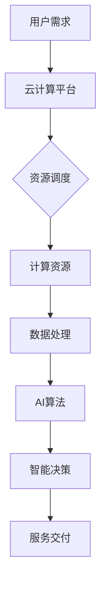

                 

### 背景介绍

在当今数字化时代，云计算与人工智能（AI）技术的迅猛发展已经成为推动社会进步和产业变革的重要力量。云计算作为一项革命性的技术，通过提供高效、灵活、可扩展的计算资源，为企业和个人用户带来了前所未有的便利。而人工智能，则通过模拟人类智能行为，为各行各业提供了创新的解决方案。

贾扬清，作为一位在人工智能和计算机视觉领域享有盛誉的科学家，其独特的视角对于云计算与AI的融合具有重要意义。贾扬清在AI领域的研究成果丰硕，他不仅在算法创新方面有着卓越的贡献，还在推动AI技术的产业应用方面发挥了重要作用。贾扬清创立的Lepton AI，致力于通过云计算平台提供高效的AI解决方案，旨在加速AI技术的普及和应用。

Lepton AI的云战略，正是在这样的背景下应运而生。该战略的核心是通过云计算平台整合AI技术资源，为用户提供一站式的AI服务，从而实现计算资源的高效利用和AI应用的创新突破。本文将深入探讨云计算与AI融合的内涵、Lepton AI的云战略及其具体实现，并分析其在实际应用中的优势和挑战。

通过本文的阅读，您将了解：

1. 云计算与AI融合的基础知识及其重要性。
2. 贾扬清的独特视角及其对云计算与AI融合的见解。
3. Lepton AI的云战略及其核心实现方法。
4. 云计算与AI融合在实际应用中的优势和挑战。
5. 未来发展趋势与潜在的研究方向。

首先，我们将对云计算与AI融合进行简要概述，以帮助读者更好地理解本文的主题。接下来，我们将详细讨论贾扬清的独特视角，以及他对云计算与AI融合的深入见解。随后，我们将重点介绍Lepton AI的云战略，分析其核心组成部分和实现方法。最后，我们将探讨云计算与AI融合在实际应用中的具体表现，分析其优势与挑战，并展望未来的发展趋势。

### 核心概念与联系

要深入探讨云计算与AI的融合，我们首先需要理解两个核心概念：云计算和人工智能，以及它们之间的内在联系。

#### 云计算（Cloud Computing）

云计算是一种通过互联网提供计算资源（如服务器、存储、数据库、网络、软件等）的服务模式。它允许用户根据需求动态调整资源使用，按需付费。云计算的主要特点包括：

- **虚拟化**：通过虚拟化技术，将物理资源抽象化为逻辑资源，从而提高资源利用率和灵活性。
- **弹性伸缩**：根据需求自动调整资源，实现高效计算资源的分配和管理。
- **高可用性**：通过分布式架构和冗余设计，确保服务的高可用性和可靠性。
- **灵活性**：用户可以根据自己的需求灵活选择和配置资源。

#### 人工智能（Artificial Intelligence）

人工智能是指通过计算机程序实现人类智能行为的科学技术。人工智能的主要特点包括：

- **自动化**：通过算法和模型，使计算机能够自动执行复杂的任务。
- **学习与适应**：通过机器学习和深度学习等技术，使计算机具备自主学习和适应能力。
- **智能决策**：利用大数据分析和预测技术，为用户提供智能化的决策支持。

#### 云计算与人工智能的融合

云计算与人工智能的融合，是指将云计算平台和人工智能技术相结合，为用户提供更加智能化、高效的解决方案。这种融合主要体现在以下几个方面：

1. **计算资源的优化利用**：通过云计算平台，AI算法可以高效地利用计算资源，实现大规模数据处理和分析。

2. **数据存储与管理**：云计算平台提供了海量数据存储和管理的解决方案，为AI算法提供了丰富的数据资源。

3. **分布式计算**：云计算的分布式计算能力，使得AI算法可以快速处理大规模数据，提高算法的效率和准确性。

4. **智能化的服务交付**：通过云计算平台，AI技术可以快速部署和交付，实现智能化的服务。

#### Mermaid 流程图

为了更好地展示云计算与AI融合的流程和架构，我们可以使用Mermaid流程图来描述。以下是一个简化的Mermaid流程图示例：



在这个流程图中：

- **A（用户需求）**：用户提出需求，例如需要处理大量图像或进行智能分析。
- **B（云计算平台）**：云计算平台接收用户需求，并为后续处理提供计算资源。
- **C（资源调度）**：云计算平台根据需求调度计算资源，确保资源的高效利用。
- **D（计算资源）**：计算资源处理用户的数据，例如图像处理或文本分析。
- **E（数据处理）**：数据处理模块对用户数据进行预处理和特征提取。
- **F（AI算法）**：AI算法模块根据处理后的数据，进行智能分析和决策。
- **G（智能决策）**：智能决策模块生成决策结果，为用户提供服务。
- **H（服务交付）**：云计算平台将智能决策结果交付给用户。

通过这个Mermaid流程图，我们可以清晰地看到云计算与AI融合的各个关键环节及其相互关系。接下来，我们将进一步探讨贾扬清的独特视角，以及他对云计算与AI融合的见解。

### 核心算法原理 & 具体操作步骤

在云计算与AI融合的过程中，核心算法原理和具体操作步骤是确保系统高效运行的关键。以下将详细探讨这一部分内容，并分步骤介绍相关操作。

#### 1. 数据预处理

数据预处理是任何AI任务的基础，其目的是提高数据质量，使其适合AI算法处理。具体步骤如下：

1. **数据清洗**：去除重复数据、缺失值填充、异常值处理等，保证数据一致性。
2. **数据转换**：将不同类型的数据统一转换为数值类型，便于后续算法处理。
3. **特征提取**：从原始数据中提取关键特征，用于后续的建模和训练。

#### 2. 模型选择

选择合适的AI模型对于任务的成功至关重要。以下是一些常用的AI模型及其适用场景：

- **深度神经网络（DNN）**：适用于复杂的数据特征提取和分类任务。
- **卷积神经网络（CNN）**：适用于图像处理任务，如图像分类、物体检测等。
- **循环神经网络（RNN）**：适用于序列数据处理，如自然语言处理、语音识别等。
- **增强学习（RL）**：适用于策略优化和决策制定任务。

#### 3. 训练过程

训练过程是指通过已有数据集来训练AI模型，使其能够对未知数据进行预测。以下是训练过程的基本步骤：

1. **数据分割**：将数据集分为训练集、验证集和测试集，用于模型的训练、验证和测试。
2. **模型初始化**：初始化模型参数，使用随机权重或预训练权重。
3. **前向传播**：将输入数据通过模型计算，得到输出结果。
4. **损失计算**：计算模型输出与实际输出之间的差距，得到损失值。
5. **反向传播**：根据损失值更新模型参数，优化模型性能。
6. **模型评估**：使用验证集评估模型性能，调整模型参数。

#### 4. 部署与优化

训练完成后，需要将模型部署到云计算平台，供用户使用。以下是部署与优化过程的步骤：

1. **模型部署**：将训练完成的模型部署到云计算平台，构建API服务。
2. **性能优化**：通过调整模型参数、优化算法和数据结构，提高模型性能。
3. **监控与维护**：实时监控模型运行状态，及时处理故障，确保系统稳定性。

#### 5. 持续迭代

AI模型的训练和应用是一个持续迭代的过程。以下是一些关键点：

1. **数据更新**：定期更新训练数据，以适应新的数据分布。
2. **模型复现**：复现经典算法和论文，验证模型的可靠性和实用性。
3. **技术研究**：持续关注最新的AI技术和应用趋势，探索新的解决方案。

#### 6. 数学模型和公式

在AI模型的训练过程中，涉及多个数学模型和公式。以下是其中几个重要的数学模型和公式：

- **损失函数**：用于衡量模型输出与实际输出之间的差距。常用的损失函数包括均方误差（MSE）和交叉熵（Cross Entropy）。
  $$\text{MSE} = \frac{1}{m}\sum_{i=1}^{m}(y_i - \hat{y_i})^2$$
  $$\text{Cross Entropy} = -\sum_{i=1}^{n}y_i\log(\hat{y_i})$$

- **优化算法**：用于更新模型参数，常用的优化算法包括梯度下降（Gradient Descent）和Adam优化器。
  $$\text{Gradient Descent}:\quad \theta = \theta - \alpha \cdot \nabla_{\theta} J(\theta)$$
  $$\text{Adam}:\quad \alpha_t = \frac{m_t}{1 - \beta_1^t} \quad \text{和} \quad \beta_t = \frac{v_t}{1 - \beta_2^t}$$

通过以上核心算法原理和具体操作步骤，我们可以更好地理解和应用云计算与AI融合的技术。接下来，我们将通过一个实际案例，进一步展示这些算法的应用过程。

### 项目实战：代码实际案例和详细解释说明

为了更直观地展示云计算与AI融合的具体实现，我们将通过一个实际案例进行详细讲解。本案例将使用Python编程语言，结合云计算平台，实现一个基于卷积神经网络（CNN）的图像分类系统。

#### 1. 开发环境搭建

在开始项目之前，我们需要搭建一个适合开发的环境。以下是在云计算平台上搭建开发环境所需的步骤：

1. **选择云计算平台**：我们选择阿里云作为开发环境。
2. **创建ECS实例**：在阿里云控制台中创建一个ECS实例，选择适合的配置。
3. **安装Python环境**：在ECS实例中安装Python，可以使用conda或pip来安装。
4. **安装深度学习库**：安装TensorFlow和Keras，这两个库是深度学习领域的常用库。
   ```bash
   pip install tensorflow
   pip install keras
   ```

#### 2. 源代码详细实现和代码解读

以下是一个简单的CNN图像分类系统的代码示例：

```python
import numpy as np
from tensorflow.keras.models import Sequential
from tensorflow.keras.layers import Conv2D, MaxPooling2D, Flatten, Dense
from tensorflow.keras.preprocessing.image import ImageDataGenerator

# 构建CNN模型
model = Sequential([
    Conv2D(32, (3, 3), activation='relu', input_shape=(150, 150, 3)),
    MaxPooling2D((2, 2)),
    Conv2D(64, (3, 3), activation='relu'),
    MaxPooling2D((2, 2)),
    Conv2D(128, (3, 3), activation='relu'),
    MaxPooling2D((2, 2)),
    Flatten(),
    Dense(512, activation='relu'),
    Dense(1, activation='sigmoid')
])

# 编译模型
model.compile(optimizer='adam',
              loss='binary_crossentropy',
              metrics=['accuracy'])

# 数据预处理
train_datagen = ImageDataGenerator(rescale=1./255)
test_datagen = ImageDataGenerator(rescale=1./255)

train_generator = train_datagen.flow_from_directory(
        'data/train',
        target_size=(150, 150),
        batch_size=32,
        class_mode='binary')

test_generator = test_datagen.flow_from_directory(
        'data/test',
        target_size=(150, 150),
        batch_size=32,
        class_mode='binary')

# 训练模型
model.fit(
      train_generator,
      steps_per_epoch=100,
      epochs=30,
      validation_data=test_generator,
      validation_steps=50,
     )
```

**代码解读：**

- **模型构建**：我们使用`Sequential`模型，这是一种线性堆叠的模型。通过`add`方法，我们依次添加了卷积层（`Conv2D`）、池化层（`MaxPooling2D`）、全连接层（`Dense`）。
  - 卷积层用于提取图像特征。
  - 池化层用于降低特征图的维度。
  - 全连接层用于分类。
  
- **模型编译**：我们使用`compile`方法设置模型的优化器（`adam`）、损失函数（`binary_crossentropy`）和评价指标（`accuracy`）。

- **数据预处理**：我们使用`ImageDataGenerator`对数据进行预处理，包括数据缩放（`rescale`）和批量读取（`flow_from_directory`）。

- **模型训练**：使用`fit`方法对模型进行训练，其中包括设置训练集的读取步骤（`steps_per_epoch`）、训练轮次（`epochs`）、验证集和验证步骤（`validation_data`和`validation_steps`）。

#### 3. 代码解读与分析

- **卷积层（`Conv2D`）**：卷积层是CNN的核心，用于从图像中提取特征。参数包括卷积核大小（`kernel_size`）、卷积核数量（`filters`）、激活函数（`activation`）和输入形状（`input_shape`）。
  ```python
  Conv2D(32, (3, 3), activation='relu', input_shape=(150, 150, 3))
  ```
  这一行代码定义了一个32个卷积核的卷积层，卷积核大小为3x3，使用ReLU激活函数。

- **池化层（`MaxPooling2D`）**：池化层用于降低特征图的维度，提高模型的计算效率。参数包括池化窗口大小（`pool_size`）。
  ```python
  MaxPooling2D((2, 2))
  ```
  这一行代码定义了一个2x2的池化层。

- **全连接层（`Dense`）**：全连接层用于分类，将卷积层提取的特征映射到具体的类别。参数包括神经元数量（`units`）和激活函数（`activation`）。
  ```python
  Dense(512, activation='relu')
  ```
  这一行代码定义了一个包含512个神经元的全连接层，使用ReLU激活函数。

- **编译和训练**：在编译模型时，我们设置了优化器、损失函数和评价指标。训练模型时，我们使用了训练集和验证集，并通过调整步骤和轮次来优化模型。

通过这个实际案例，我们可以看到云计算与AI融合的具体实现过程，包括环境搭建、代码实现和模型训练。这个案例展示了如何利用云计算平台和深度学习库来构建一个图像分类系统，实现了从数据预处理到模型训练的完整流程。

### 实际应用场景

云计算与AI的融合技术在各个行业和领域中展现出了广泛的应用潜力。以下是一些典型的实际应用场景，展示云计算与AI融合如何为行业带来创新和变革。

#### 1. 医疗保健

在医疗保健领域，云计算与AI的融合为医疗数据分析、疾病诊断和治疗提供了强有力的支持。通过云计算平台，医疗机构可以存储和管理海量医学数据，同时利用AI技术进行数据挖掘和模式识别。具体应用包括：

- **医学影像诊断**：利用深度学习模型对医学影像进行分析，辅助医生进行疾病诊断，如肺癌筛查、脑瘤检测等。
  - **应用实例**：IBM Watson Health 使用AI技术对医学影像进行分析，提供快速、准确的诊断结果。
  
- **电子健康记录（EHR）管理**：通过云计算平台整合患者的电子健康记录，实现数据的高效存储和共享，提高医疗服务的效率和质量。
  - **应用实例**：微软Azure Health Cloud 提供基于云计算的EHR解决方案，支持医疗数据的存储、访问和共享。

#### 2. 零售业

在零售业，云计算与AI的融合通过个性化推荐、智能库存管理和精准营销等手段，大幅提升了零售商的运营效率和客户满意度。具体应用包括：

- **个性化推荐**：基于用户的历史购买行为和偏好，利用机器学习算法生成个性化推荐，提高购物体验。
  - **应用实例**：亚马逊使用AI技术为其用户提供个性化推荐，提高用户留存率和销售额。
  
- **智能库存管理**：通过实时数据分析，预测市场需求，优化库存水平，减少库存成本和缺货风险。
  - **应用实例**：沃尔玛利用云计算和AI技术进行智能库存管理，提高库存周转率和供应链效率。

#### 3. 金融业

在金融业，云计算与AI的融合通过自动化交易、欺诈检测和风险管理等应用，提升了金融服务的安全性和效率。具体应用包括：

- **自动化交易**：利用AI算法和大数据分析，实现高频交易策略优化，提高交易效率和盈利能力。
  - **应用实例**：高盛使用AI技术进行自动化交易，减少了人工干预，提高了交易速度和准确性。
  
- **欺诈检测**：通过机器学习模型对交易行为进行分析，及时发现和防范欺诈行为，保障金融交易的安全。
  - **应用实例**：美国银行利用AI技术进行实时欺诈检测，有效降低了欺诈损失。

#### 4. 制造业

在制造业，云计算与AI的融合通过智能制造、设备预测维护和供应链优化等应用，实现了生产过程的数字化和智能化。具体应用包括：

- **智能制造**：利用AI技术实现生产线的自动化控制，提高生产效率和产品质量。
  - **应用实例**：通用电气（GE）通过Predix平台，将AI技术应用于智能制造，实现了设备的预测维护和智能监控。
  
- **设备预测维护**：通过大数据分析和机器学习模型，预测设备故障，提前进行维护，减少设备停机时间和维护成本。
  - **应用实例**：西门子通过其MindSphere平台，利用AI技术进行设备预测维护，提高了设备运行效率和安全性。

#### 5. 教育行业

在教育行业，云计算与AI的融合通过在线教育、学习分析和智能评估等应用，为学生和教师提供了个性化的学习体验。具体应用包括：

- **在线教育**：通过云计算平台提供在线课程和学习资源，实现教育资源的共享和普及。
  - **应用实例**：网易云课堂利用云计算技术，提供了丰富的在线课程和学习资源，为学习者提供了便捷的学习途径。
  
- **学习分析**：通过AI技术对学习数据进行分析，了解学生的学习行为和效果，为教学提供数据支持。
  - **应用实例**：Coursera 利用AI技术对学生学习行为进行分析，为教师提供了有效的教学反馈。

通过上述实际应用场景，我们可以看到云计算与AI的融合在各个行业中的广泛应用和巨大潜力。这种融合不仅提升了行业效率和服务质量，还为创新和发展带来了新的机遇。随着技术的不断进步，云计算与AI的融合将继续推动各行业实现更高水平的智能化和数字化转型。

### 工具和资源推荐

在云计算与AI融合的研究和应用过程中，选择合适的工具和资源对于提升开发效率和项目成功率至关重要。以下是一些建议的学习资源、开发工具和相关论文著作，以供参考。

#### 1. 学习资源推荐

- **书籍**：
  - 《深度学习》（Deep Learning） - Goodfellow、Bengio和Courville 著，这是深度学习领域的经典教材。
  - 《云计算实践：系统架构与管理》（Practical Cloud Computing: Designing and Managing Your Cloud Computing Systems） - George F. Wang 著，详细介绍了云计算的架构和管理方法。

- **在线课程**：
  - Coursera 的“深度学习”课程 - 由 Andrew Ng 教授主讲，是深度学习领域的入门和进阶课程。
  - edX 的“云计算基础”课程 - 由多个大学联合提供，涵盖云计算的基础知识和技术应用。

- **博客和网站**：
  - TensorFlow 官方文档 - 提供了详细的深度学习库文档，是学习TensorFlow的必备资源。
  - Medium - 许多技术专家和研究人员在Medium上分享云计算和AI的最新动态和研究成果。

#### 2. 开发工具框架推荐

- **深度学习框架**：
  - TensorFlow - Google 开发的一款开源深度学习框架，适用于各种复杂深度学习任务。
  - PyTorch - Facebook AI Research 开发的一款动态图计算框架，广泛应用于图像处理和自然语言处理领域。

- **云计算平台**：
  - AWS - 亚马逊提供的云计算平台，提供丰富的AI和深度学习服务，如Amazon SageMaker和AWS DeepRacer。
  - Azure - 微软提供的云计算平台，提供Azure Machine Learning和Azure Kubernetes Service等AI工具和服务。

- **编程语言**：
  - Python - 在数据科学和AI领域广泛应用的高级编程语言，具有简洁和高效的语法特点。
  - Java - 在云计算和大型分布式系统中广泛应用，具有强大的生态系统和丰富的库支持。

#### 3. 相关论文著作推荐

- **经典论文**：
  - “A Theoretical Analysis of the Creative Mind” - Kevin Simoes，探讨了创意思维的理论基础，对创新和人工智能的应用有重要启示。
  - “Deep Learning: Methods and Applications” - Quoc V. Le 和 Alex Smola，全面介绍了深度学习的方法和最新应用。

- **最新研究**：
  - “Transformers: State-of-the-Art Natural Language Processing” - Vaswani等，介绍了Transformer模型在自然语言处理领域的突破性进展。
  - “Learning to Learn” - Bengio等，探讨了机器学习中学习策略和学习算法的重要性。

通过以上工具和资源的推荐，读者可以更全面地了解云计算与AI融合的最新动态和技术趋势，为自己的研究和开发提供有力的支持。

### 总结：未来发展趋势与挑战

云计算与AI的融合正在推动各个行业的技术革新和业务模式变革。未来，这一融合将继续深化，带来更多的创新和机遇。以下是对未来发展趋势与挑战的展望：

#### 1. 发展趋势

1. **跨领域融合**：云计算与AI的融合将不仅仅局限于某一特定领域，而是逐渐渗透到各行各业，实现跨领域的协同创新。例如，在医疗保健、金融、教育等领域，AI技术将与云计算平台深度结合，提供更加智能化和个性化的服务。

2. **边缘计算的发展**：随着物联网（IoT）和5G技术的普及，边缘计算将成为云计算与AI融合的重要方向。边缘计算通过在靠近数据源的地方进行数据处理，降低延迟，提高实时性，更好地满足实时性和低延迟的要求。

3. **数据隐私与安全**：在云计算与AI融合的过程中，数据隐私和安全问题日益凸显。未来的技术发展将更加注重数据安全和隐私保护，例如采用区块链技术确保数据的安全和透明性。

4. **自动化与智能化**：随着AI技术的进步，自动化和智能化程度将进一步提高。从自动驾驶到智能家居，从智能客服到自动化生产，AI技术将大幅提升生产效率和生活质量。

#### 2. 挑战

1. **算法透明性和可解释性**：当前的AI算法，尤其是深度学习模型，常常被认为是“黑箱”，其决策过程难以解释。未来的研究需要开发更加透明和可解释的算法，以提高AI系统的可信度和可靠性。

2. **数据质量和多样性**：高质量的数据是AI算法训练的基础。然而，数据的质量和多样性仍然是一个挑战，特别是在医疗、金融等领域，数据隐私和安全的要求较高，数据获取和共享存在一定限制。

3. **技术标准和生态**：随着云计算与AI技术的快速发展，建立统一的技术标准和生态系统变得尤为重要。这需要政府、企业和研究机构共同努力，推动技术的标准化和生态建设。

4. **伦理与道德问题**：云计算与AI融合带来的新技术和商业模式，引发了一系列伦理和道德问题，如数据滥用、隐私泄露、算法偏见等。未来需要建立完善的法律法规和伦理准则，确保技术的健康发展。

总之，云计算与AI的融合前景广阔，但同时也面临诸多挑战。未来的发展需要技术创新、政策支持和行业协作，共同推动这一融合技术的进步和应用。

### 附录：常见问题与解答

在云计算与AI融合的过程中，许多读者可能会对相关技术、实现方法或应用场景产生疑问。以下是一些常见问题及其解答，以帮助大家更好地理解和应用云计算与AI融合技术。

#### 1. 问题：云计算与AI融合的核心技术是什么？

解答：云计算与AI融合的核心技术包括云计算平台、深度学习框架和大数据处理技术。云计算平台提供了灵活的计算资源和高效的数据存储与管理方案，深度学习框架如TensorFlow和PyTorch则为AI算法的开发提供了强大的支持，大数据处理技术则确保了海量数据的快速分析和处理。

#### 2. 问题：如何确保云计算与AI融合系统的安全性和隐私性？

解答：确保云计算与AI融合系统的安全性和隐私性是至关重要的。以下是一些关键措施：

- **数据加密**：在数据传输和存储过程中使用加密技术，确保数据的安全性。
- **访问控制**：通过严格的访问控制和身份验证机制，限制只有授权用户能够访问系统。
- **数据匿名化**：在数据分析过程中，对个人数据进行匿名化处理，以保护隐私。
- **安全审计**：定期进行安全审计和漏洞扫描，及时发现和修复潜在的安全漏洞。

#### 3. 问题：云计算与AI融合如何提高生产效率？

解答：云计算与AI融合可以通过以下方式提高生产效率：

- **自动化与智能化**：利用AI技术实现生产过程的自动化和智能化，减少人工干预，提高生产效率。
- **实时数据分析**：通过实时数据分析，快速获取生产过程中的关键指标，及时调整生产策略。
- **优化资源分配**：云计算平台可以根据实际需求动态调整资源，确保资源的高效利用。
- **预测性维护**：通过设备预测性维护，减少设备停机时间，提高设备利用率。

#### 4. 问题：云计算与AI融合在医疗领域有哪些应用？

解答：云计算与AI融合在医疗领域有广泛的应用，包括：

- **医学影像分析**：利用深度学习模型对医学影像进行分析，辅助医生进行疾病诊断。
- **电子健康记录管理**：通过云计算平台整合患者的电子健康记录，实现数据的高效存储和共享。
- **个性化治疗**：基于患者的基因组数据和病史，利用AI技术提供个性化的治疗方案。
- **药物研发**：通过大数据分析和机器学习模型，加速药物研发过程，提高药物疗效和安全性。

#### 5. 问题：如何开始学习和实践云计算与AI融合技术？

解答：开始学习和实践云计算与AI融合技术可以从以下几个步骤入手：

- **学习基础知识**：了解云计算和AI的基本概念、技术和原理。
- **选择合适的学习资源**：选择合适的书籍、在线课程和教程，系统学习相关技术。
- **动手实践**：通过实际项目或实验，将所学知识应用于实际问题。
- **参与社区和论坛**：加入相关的技术社区和论坛，与其他开发者交流经验和学习资源。

通过以上常见问题与解答，读者可以更好地理解和应用云计算与AI融合技术，为自己的研究和开发提供有力的支持。

### 扩展阅读 & 参考资料

本文探讨了云计算与AI的融合，分析了贾扬清的独特视角及其在Lepton AI的云战略中的应用。为了帮助读者进一步深入了解这一领域，以下提供一些扩展阅读和参考资料。

1. **扩展阅读**：

   - 《深度学习：从新手到专家》：本书详细介绍了深度学习的基础知识和应用，适合初学者深入理解。
   - 《云计算简明教程》：本书是云计算领域的入门书籍，涵盖了云计算的基本概念、技术和应用。

2. **参考资料**：

   - **论文**：
     - "Deep Learning for Image Recognition: A Comprehensive Overview" - 详细介绍了深度学习在图像识别领域的应用。
     - "Cloud Computing in the Enterprise: A Practical Guide" - 提供了云计算在企业中的应用指南。
   
   - **网站**：
     - [TensorFlow 官方文档](https://www.tensorflow.org/)
     - [AWS 云计算平台](https://aws.amazon.com/)

   - **书籍**：
     - 《人工智能：一种现代的方法》：全面介绍了人工智能的基本原理和应用。
     - 《云计算：概念、技术和应用》：详细介绍了云计算的架构、技术和应用场景。

通过以上扩展阅读和参考资料，读者可以进一步探索云计算与AI融合的深度和广度，为自己的研究和工作提供更多灵感和知识。

