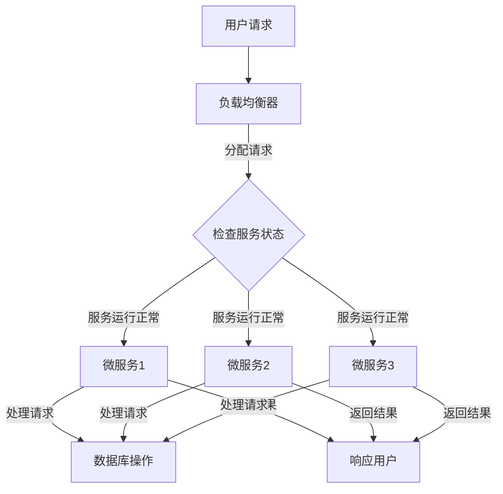

                 

### 背景介绍

#### 云计算工程师的角色与重要性

云计算工程师在现代IT行业中扮演着至关重要的角色。他们不仅负责设计、部署和维护云计算基础设施，还要确保服务的可扩展性、可靠性和安全性。云计算工程师的工作范围涵盖了从虚拟化技术、容器化到分布式系统管理等多个领域，他们需要具备广泛的技术知识和实践经验。

随着企业对于云计算服务的需求日益增长，云计算工程师的重要性也在不断提升。他们不仅帮助企业降低IT成本、提高业务效率，还能推动企业实现数字化转型。在这个背景下，探索云计算工程师在创业中的机会，尤其是构建可扩展的服务架构，成为一个值得深入研究的课题。

#### 云计算服务的快速增长

云计算市场在过去几年中呈现出快速增长的趋势。根据市场研究机构的报告，全球云计算市场预计将在未来几年内继续扩大。这一增长主要得益于以下几个因素：

1. **成本效益**：云计算服务允许企业根据实际使用量支付费用，大大降低了IT基础设施的初始投资成本。
2. **灵活性**：云计算提供了一种灵活的IT环境，企业可以根据业务需求快速调整资源分配。
3. **可扩展性**：云计算服务可以轻松扩展，以应对突发流量或业务增长。
4. **安全性**：随着安全技术的不断进步，云计算服务在安全性方面也取得了显著提升。

#### 创业机会

云计算技术的快速发展不仅为企业提供了新的IT解决方案，也为创业者提供了丰富的创业机会。以下是云计算工程师在创业中可能遇到的几种机会：

1. **SaaS服务提供商**：云计算使得软件即服务（SaaS）成为可能。创业者可以开发并部署基于云计算的SaaS应用，满足不同行业的需求。
2. **PaaS平台**：平台即服务（PaaS）为开发者提供了构建和部署应用的云平台。创业者可以创建自己的PaaS平台，提供开发工具、数据库、Web服务等功能。
3. **IaaS服务提供商**：基础设施即服务（IaaS）是云计算的基础。创业者可以通过建立自己的数据中心或使用公有云服务，提供IaaS解决方案。
4. **云计算安全解决方案**：随着云计算应用的增加，对安全性的需求也在上升。创业者可以专注于开发云计算安全工具和解决方案。

#### 市场需求

云计算技术的广泛应用吸引了大量的企业用户，从而推动了市场需求的增长。以下是一些主要的市场需求：

1. **数字化转型**：企业正在寻求通过云计算实现数字化转型，以提高业务效率和竞争力。
2. **大数据分析**：云计算为大数据分析提供了强大的计算和存储能力，许多企业希望通过云计算进行数据分析和挖掘。
3. **人工智能应用**：云计算是人工智能应用的重要基础设施，创业者可以开发基于云计算的人工智能解决方案。
4. **物联网（IoT）**：云计算与物联网的结合为智能设备提供了连接和数据存储的能力，创业者可以在这个领域寻找机会。

#### 构建可扩展的服务架构

在云计算领域，构建可扩展的服务架构是创业成功的关键。可扩展性意味着系统能够在需求增加时自动扩展资源，保持高性能和高可靠性。以下是构建可扩展服务架构的几个关键要素：

1. **水平扩展**：通过增加服务器数量来提高系统性能，而不是通过单一服务器升级。
2. **微服务架构**：将应用程序分解为小型、独立的组件，每个组件都可以独立部署和扩展。
3. **自动化部署**：使用自动化工具和流程来简化部署和扩展操作，提高效率。
4. **容错机制**：设计系统以应对故障，确保服务的连续性和稳定性。

#### 竞争格局

云计算市场已经形成了一些大型玩家，如亚马逊AWS、微软Azure和谷歌云等。然而，这并没有阻碍中小型创业公司在这个领域的崛起。以下是一些策略可以帮助创业者在这个竞争激烈的市场中脱颖而出：

1. **差异化优势**：提供独特的服务和解决方案，以满足特定行业或市场的需求。
2. **技术创新**：不断推动技术创新，保持在技术前沿。
3. **合作伙伴关系**：与其他企业和组织建立合作伙伴关系，共同开发解决方案。
4. **市场营销策略**：制定有效的市场营销策略，提高品牌知名度和市场占有率。

通过深入分析云计算工程师的角色、市场趋势和创业机会，我们可以看到，构建可扩展的服务架构是云计算创业的核心挑战和机遇。在接下来的章节中，我们将进一步探讨云计算中的核心概念、算法原理、数学模型、项目实战以及实际应用场景，帮助读者全面了解云计算工程师在创业中的关键技能和策略。

---

### 核心概念与联系

#### 云计算基础

在深入探讨云计算工程师的创业机会之前，我们需要先了解云计算的基础知识。云计算（Cloud Computing）是指通过互联网以按需、易扩展的方式提供计算资源。它包括三种主要服务模式：基础设施即服务（IaaS）、平台即服务（PaaS）和软件即服务（SaaS）。

- **基础设施即服务（IaaS）**：提供虚拟化的计算资源，如虚拟机、存储和网络。用户可以根据需求租用这些资源，按使用量付费。
- **平台即服务（PaaS）**：提供了一个开发平台，包括开发工具、数据库和Web服务，使得开发者可以专注于应用程序的构建，而不必担心底层基础设施的管理。
- **软件即服务（SaaS）**：用户通过互联网访问软件应用，这些应用通常由第三方提供商托管和维护。

#### 分布式系统

云计算的核心在于分布式系统（Distributed Systems）的运用。分布式系统是指由多个计算机节点组成的系统，这些节点通过网络进行通信，协同完成计算任务。分布式系统具有以下几个特点：

1. **容错性**：系统中的某个节点失败不会影响整体运行，其他节点可以继续工作。
2. **可扩展性**：系统可以根据需要添加更多的节点，以应对更大的工作负载。
3. **一致性**：系统在处理多个并发请求时，需要确保数据的一致性。
4. **高可用性**：系统设计要确保服务的连续性和稳定性。

#### 可扩展性

在云计算中，可扩展性（Scalability）是系统设计的关键目标之一。一个可扩展的系统可以在需求增加时自动扩展资源，以满足更高负载。可扩展性通常分为两种类型：

1. **水平扩展**（Horizontal Scaling）：通过增加服务器节点来提高系统性能。这种方法能够线性地增加计算能力，且成本相对较低。
2. **垂直扩展**（Vertical Scaling）：通过升级现有服务器硬件（如增加CPU、内存等）来提高性能。这种方法通常成本较高，但可以提供更高的计算密度。

#### 服务架构

服务架构（Service Architecture）是构建云计算系统的基础。它定义了系统的结构、组件之间的交互以及系统的功能和行为。以下是一些常见的服务架构模式：

1. **微服务架构**（Microservices Architecture）：将应用程序分解为多个独立的微服务，每个微服务负责一个特定的业务功能。这种架构使得系统更加模块化、易于扩展和维护。
2. **容器化架构**（Containerization Architecture）：使用容器（如Docker）来封装应用程序及其依赖项，实现快速部署和运行。容器化提高了系统的可移植性和可扩展性。
3. **混合云架构**（Hybrid Cloud Architecture）：结合公有云和私有云的资源，以实现灵活的资源管理和更高的安全性。混合云架构适用于需要同时利用公有云的低成本和高扩展性以及私有云的定制性和控制性的企业。

#### Mermaid 流程图

为了更好地理解云计算中的核心概念和架构，我们可以使用Mermaid绘制一个流程图。以下是一个简化的Mermaid流程图，描述了从用户请求到服务响应的流程：



在这个流程图中，用户请求首先通过负载均衡器分发到不同的微服务。每个微服务独立处理请求，并与数据库进行交互。最后，处理结果通过微服务返回给用户。这个流程图展示了云计算系统中的核心组件和交互方式，有助于理解云计算的工作原理。

通过以上对核心概念和架构的介绍，我们为接下来探讨云计算中的具体算法原理和实现步骤奠定了基础。在下一节中，我们将深入分析云计算中的关键算法原理，帮助读者理解构建可扩展服务架构的技术细节。

---

#### 核心算法原理 & 具体操作步骤

在云计算服务架构中，核心算法原理是确保系统高效、可靠和可扩展性的关键。以下是几个核心算法原理，以及它们的具体操作步骤。

##### 1. 负载均衡算法

**原理**：负载均衡算法用于分配网络流量到多个服务器节点，以避免单一节点过载。常见的负载均衡算法包括轮询（Round Robin）、最小连接（Least Connections）和加权轮询（Weighted Round Robin）。

**操作步骤**：

1. **轮询算法**：
   - 将请求依次分配到服务器节点。
   - 当最后一个服务器节点被访问后，循环回到第一个节点。
   
2. **最小连接算法**：
   - 每个服务器节点维护一个连接数计数器。
   - 新请求被分配到当前连接数最小的服务器节点。

3. **加权轮询算法**：
   - 根据服务器的处理能力，为每个服务器节点分配一个权重。
   - 每次请求根据权重随机分配到服务器节点。

##### 2. 分布式缓存算法

**原理**：分布式缓存通过将数据分散存储在多个缓存节点中，提高数据访问速度和系统的可扩展性。常见的分布式缓存算法包括一致性哈希（Consistent Hashing）和分片哈希（Sharding Hash）。

**操作步骤**：

1. **一致性哈希算法**：
   - 将缓存节点和缓存键映射到一个统一的哈希空间。
   - 每个缓存键都有一个唯一的哈希值，该值决定数据应该存储在哪个缓存节点。
   - 当缓存节点增加或减少时，只有少量的缓存键需要重新分配。

2. **分片哈希算法**：
   - 将数据按照特定的哈希函数划分到多个分片。
   - 每个分片由一个或多个缓存节点存储。
   - 当访问数据时，根据哈希值定位到相应的分片和缓存节点。

##### 3. 分布式数据库算法

**原理**：分布式数据库通过将数据分布在多个节点上，提高数据的读写性能和可用性。常见的分布式数据库算法包括主从复制（Master-Slave Replication）和分库分表（Sharding）。

**操作步骤**：

1. **主从复制算法**：
   - 主数据库处理所有读写请求，从数据库复制主数据库的数据。
   - 当主数据库故障时，从数据库可以接管主数据库的工作。

2. **分库分表算法**：
   - 将数据表按照特定的策略（如哈希值、范围等）划分到多个数据库实例。
   - 每个数据库实例处理特定的数据表。
   - 当访问数据时，根据查询条件定位到相应的数据库实例和表。

##### 4. 自适应扩展算法

**原理**：自适应扩展算法根据系统负载动态调整资源分配，确保系统在高负载时保持性能。常见的自适应扩展算法包括线性扩展（Linear Scaling）和自动扩缩容（Auto Scaling）。

**操作步骤**：

1. **线性扩展**：
   - 当系统负载超过特定阈值时，线性地增加服务器节点。
   - 当负载降低到阈值以下时，减少服务器节点。

2. **自动扩缩容**：
   - 根据预定义的规则（如CPU利用率、内存使用率等），自动调整服务器节点数量。
   - 当资源使用超过阈值时，自动增加节点。
   - 当资源使用低于阈值时，自动减少节点。

通过以上核心算法原理和操作步骤的介绍，我们可以看到云计算服务架构中的关键技术和实现细节。这些算法不仅确保了系统的可靠性和高性能，还为云计算工程师提供了构建可扩展服务架构的强大工具。在接下来的章节中，我们将深入探讨云计算中的数学模型和公式，帮助读者进一步理解系统设计和性能优化。

---

### 数学模型和公式 & 详细讲解 & 举例说明

在云计算服务架构中，数学模型和公式是理解和优化系统性能的重要工具。以下是几个常用的数学模型和公式，以及它们在云计算中的应用和详细讲解。

#### 1. 负载均衡模型

**模型公式**： \( L = \frac{\sum_{i=1}^{N} C_i \times P_i}{T} \)

其中：
- \( L \)：系统总负载
- \( C_i \)：第 \( i \) 个服务器的处理能力
- \( P_i \)：第 \( i \) 个服务器的负载概率
- \( N \)：服务器总数
- \( T \)：时间周期

**应用和讲解**：负载均衡模型用于计算系统在特定时间周期内的总负载。通过该模型，云计算工程师可以优化服务器的负载分配，确保系统在高负载时保持性能。例如，如果一个系统有3个服务器，每个服务器的处理能力为1000个请求/秒，负载概率分别为1/3，则系统总负载为 \( L = \frac{1000 \times 1/3 + 1000 \times 1/3 + 1000 \times 1/3}{1} = 1000 \) 个请求/秒。

#### 2. 分布式缓存一致性模型

**模型公式**： \( C = \frac{R_c + W_c}{2} \)

其中：
- \( C \)：缓存一致性成本
- \( R_c \)：读取一致性成本
- \( W_c \)：写入一致性成本

**应用和讲解**：分布式缓存一致性模型用于评估在不同一致性模型下的一致性成本。读取一致性成本较低，因为缓存的数据通常会保持一致性，而写入一致性成本较高，因为写入操作需要同步多个缓存节点。例如，如果一个分布式缓存系统在读取操作上的成本为10毫秒，在写入操作上的成本为50毫秒，则其一致性成本为 \( C = \frac{10 + 50}{2} = 30 \) 毫秒。

#### 3. 分布式数据库分片模型

**模型公式**： \( S = \frac{N \times D}{M} \)

其中：
- \( S \)：分片数量
- \( N \)：总数据量
- \( D \)：每个分片的容量
- \( M \)：分片数量

**应用和讲解**：分布式数据库分片模型用于确定分片数量，以平衡每个分片的负载。例如，如果一个数据库有10TB的数据，每个分片容量为1TB，需要分成5个分片，则 \( S = \frac{10 \times 10^9}{1 \times 10^9} = 10 \) 个分片。

#### 4. 自适应扩展模型

**模型公式**： \( A = \alpha \times (C_{max} - C_{current}) \)

其中：
- \( A \)：需要扩展的节点数量
- \( \alpha \)：扩展因子
- \( C_{max} \)：系统最大处理能力
- \( C_{current} \)：当前系统处理能力

**应用和讲解**：自适应扩展模型用于根据系统当前负载自动调整节点数量。例如，如果一个系统最大处理能力为1000个请求/秒，当前处理能力为800个请求/秒，扩展因子为2，则需要扩展的节点数量为 \( A = 2 \times (1000 - 800) = 400 \) 个请求/秒。

#### 举例说明

假设我们有一个云计算系统，包含3个服务器，每个服务器的处理能力为1000个请求/秒，负载概率均为1/3。系统的总负载为1000个请求/秒。

1. **负载均衡模型**：
   - \( L = \frac{1000 \times 1/3 + 1000 \times 1/3 + 1000 \times 1/3}{1} = 1000 \) 个请求/秒。

2. **分布式缓存一致性模型**：
   - 假设读取一致性成本为10毫秒，写入一致性成本为50毫秒，则一致性成本为 \( C = \frac{10 + 50}{2} = 30 \) 毫秒。

3. **分布式数据库分片模型**：
   - 假设总数据量为10TB，每个分片容量为1TB，需要分成5个分片，则 \( S = \frac{10 \times 10^9}{1 \times 10^9} = 10 \) 个分片。

4. **自适应扩展模型**：
   - 假设系统最大处理能力为1000个请求/秒，当前处理能力为800个请求/秒，扩展因子为2，则需要扩展的节点数量为 \( A = 2 \times (1000 - 800) = 400 \) 个请求/秒。

通过这些数学模型和公式的应用，云计算工程师可以更准确地设计和优化云计算服务架构，确保系统在高负载时保持高性能和高可靠性。

---

#### 项目实战：代码实际案例和详细解释说明

为了更好地理解构建可扩展服务架构的过程，我们将通过一个实际项目案例进行详细讲解。本案例将使用Python和Docker技术，实现一个简单的微服务架构，并展示如何进行部署和扩展。

##### 1. 项目背景

假设我们要构建一个电商网站的后台系统，包括用户管理、订单管理和支付系统等模块。每个模块作为一个独立的微服务，以便于开发和维护。

##### 2. 环境搭建

首先，我们需要搭建一个开发环境。以下是所需工具和软件：

- Python 3.8 或更高版本
- Docker 19.03 或更高版本
- Docker Compose 1.25 或更高版本

确保系统已安装上述软件，然后创建一个名为 `microservices` 的目录，并在此目录下创建一个名为 `docker-compose.yml` 的文件。

##### 3. 编写服务

在每个模块目录中，编写对应的 Python 代码。以下是一个简单的用户管理服务 `user_service.py` 示例：

```python
# user_service.py

from flask import Flask, request, jsonify
import pymysql

app = Flask(__name__)

@app.route('/users', methods=['POST'])
def create_user():
    data = request.get_json()
    username = data['username']
    password = data['password']

    connection = pymysql.connect(host='db', user='root', password='password', database='users')
    cursor = connection.cursor()
    cursor.execute("INSERT INTO users (username, password) VALUES (%s, %s)", (username, password))
    connection.commit()
    cursor.close()
    connection.close()

    return jsonify({"message": "User created successfully"}), 201

if __name__ == '__main__':
    app.run(host='0.0.0.0', port=5000)
```

类似地，我们可以编写订单管理和支付系统的服务。

##### 4. 配置 Dockerfile

在每个服务目录中，创建一个名为 `Dockerfile` 的文件，用于构建 Docker 镜像。

```Dockerfile
# user_service/Dockerfile

FROM python:3.8

WORKDIR /app

COPY requirements.txt ./
RUN pip install -r requirements.txt

COPY . .

CMD ["python", "user_service.py"]
```

##### 5. 编写 docker-compose.yml

在 `microservices` 目录下的 `docker-compose.yml` 文件中，定义所有服务的配置。

```yaml
# docker-compose.yml

version: '3.8'

services:
  db:
    image: mysql:5.7
    environment:
      MYSQL_ROOT_PASSWORD: password
      MYSQL_DATABASE: users
    volumes:
      - db_data:/var/lib/mysql

  user_service:
    build: ./user_service
    depends_on:
      - db
    ports:
      - 5000:5000

  order_service:
    build: ./order_service
    depends_on:
      - db

  payment_service:
    build: ./payment_service
    depends_on:
      - db

volumes:
  db_data:
```

在这个文件中，我们定义了三个服务：数据库服务（`db`）、用户管理服务（`user_service`）和支付系统服务（`payment_service`）。每个服务都依赖于数据库服务，并通过 `depends_on` 关键字指定依赖关系。

##### 6. 部署和运行

使用以下命令启动服务：

```bash
$ docker-compose up -d
```

这个命令将根据 `docker-compose.yml` 文件中的定义构建并启动所有服务。服务启动后，可以在端口5000访问用户管理服务。

##### 7. 代码解读与分析

**用户管理服务**：

- 使用 Flask 框架实现 RESTful API。
- 通过 Docker 镜像封装应用程序，确保依赖项的一致性。
- 使用 MySQL 数据库存储用户数据，并通过 Docker Compose 集成数据库服务。

**订单管理和支付系统服务**：

- 与用户管理服务类似，使用 Flask 框架实现 RESTful API。
- 封装到 Docker 镜像，确保依赖项的一致性。
- 通过 Docker Compose 集成数据库服务和用户管理服务。

通过这个项目案例，我们展示了如何使用 Python、Docker 和 Docker Compose 实现一个简单的微服务架构。这个过程不仅帮助我们理解了服务开发和部署的步骤，还展示了如何利用 Docker 实现自动化部署和扩展。在实际项目中，可以根据需求增加更多的服务和功能，例如日志记录、监控和告警等。

---

#### 代码解读与分析

在本节中，我们将深入分析项目案例中的代码，详细解读其结构和实现细节，并探讨如何优化和改进。

##### 用户管理服务

**代码结构**：

用户管理服务的核心代码是 `user_service.py`，它使用 Flask 框架实现了一个简单的 RESTful API。以下是代码的主要结构：

```python
# user_service.py

from flask import Flask, request, jsonify
import pymysql

app = Flask(__name__)

@app.route('/users', methods=['POST'])
def create_user():
    data = request.get_json()
    username = data['username']
    password = data['password']

    connection = pymysql.connect(host='db', user='root', password='password', database='users')
    cursor = connection.cursor()
    cursor.execute("INSERT INTO users (username, password) VALUES (%s, %s)", (username, password))
    connection.commit()
    cursor.close()
    connection.close()

    return jsonify({"message": "User created successfully"}), 201

if __name__ == '__main__':
    app.run(host='0.0.0.0', port=5000)
```

**代码解读**：

1. **Flask 应用**：首先，我们创建了一个 Flask 应用实例 `app`。
2. **路由定义**：使用 `@app.route('/users', methods=['POST'])` 装饰器定义了一个处理 POST 请求的路由，用于创建新用户。
3. **接收请求**：在 `create_user` 函数中，我们从请求中提取 JSON 数据，获取 `username` 和 `password`。
4. **数据库连接**：使用 `pymysql` 连接到 MySQL 数据库，使用 `cursor.execute` 执行 SQL 插入语句。
5. **返回响应**：将成功消息作为 JSON 响应返回。

**优化建议**：

- **数据库连接管理**：当前代码在每次请求后立即关闭数据库连接，这可能导致连接频繁创建和销毁，增加性能开销。可以使用连接池来优化数据库连接管理。
- **错误处理**：当前代码未处理可能出现的数据库错误，例如连接失败或SQL执行错误。应添加适当的错误处理机制，确保系统健壮性。

##### 订单管理和支付系统服务

订单管理和支付系统服务的代码结构与用户管理服务类似，主要区别在于处理不同的业务逻辑和数据库操作。以下是订单管理服务的核心代码示例：

```python
# order_service.py

from flask import Flask, request, jsonify
import pymysql

app = Flask(__name__)

@app.route('/orders', methods=['POST'])
def create_order():
    data = request.get_json()
    order_id = data['order_id']
    user_id = data['user_id']
    status = data['status']

    connection = pymysql.connect(host='db', user='root', password='password', database='orders')
    cursor = connection.cursor()
    cursor.execute("INSERT INTO orders (order_id, user_id, status) VALUES (%s, %s, %s)", (order_id, user_id, status))
    connection.commit()
    cursor.close()
    connection.close()

    return jsonify({"message": "Order created successfully"}), 201

if __name__ == '__main__':
    app.run(host='0.0.0.0', port=5000)
```

**代码解读**：

- **路由定义**：处理创建新订单的 POST 请求。
- **接收请求**：提取 JSON 数据，获取 `order_id`、`user_id` 和 `status`。
- **数据库操作**：插入订单数据到 MySQL 数据库。

**优化建议**：

- **事务管理**：订单创建过程中可能涉及多个数据库操作，例如更新用户余额或库存。应使用事务管理确保操作的一致性。
- **缓存策略**：订单数据可能频繁访问，可以考虑使用缓存来提高响应速度。

##### 代码整体分析

- **容器化**：通过 Dockerfile 将应用程序封装在容器中，确保环境一致性。
- **微服务架构**：每个服务负责特定的业务功能，便于维护和扩展。
- **数据库集成**：所有服务均使用共享数据库，确保数据一致性。

**改进方案**：

- **服务拆分**：随着业务发展，可以考虑将服务进一步拆分为更细粒度的服务，以提高系统的灵活性和可扩展性。
- **监控和日志**：引入监控和日志系统，实时跟踪系统状态和性能，便于故障排查和性能优化。

通过以上分析和优化建议，我们可以不断提升项目的质量，确保其稳定性和扩展性，为后续的发展奠定坚实基础。

---

### 实际应用场景

构建可扩展的服务架构在多个实际应用场景中展现出其重要性和优势。以下是一些典型的应用场景，以及云计算工程师如何利用这些架构解决具体问题。

#### 1. 电子商务平台

电子商务平台通常需要处理大规模的用户访问和交易，特别是在促销活动或假日购物季期间。可扩展的服务架构可以帮助电商平台轻松应对流量高峰，确保用户体验和交易成功率。

- **解决方案**：使用微服务架构将平台拆分为多个独立服务，如用户管理、商品展示、订单处理和支付系统。每个服务可以独立部署和扩展，通过负载均衡器分配请求，确保系统在高并发下稳定运行。
- **优势**：高扩展性、灵活性和易于维护。

#### 2. 社交媒体平台

社交媒体平台需要处理大量的用户生成内容和实时通信，对系统的性能和可靠性要求极高。可扩展的服务架构可以在这些平台上发挥重要作用。

- **解决方案**：采用分布式缓存和数据库分片技术，将用户数据和内容分散存储在多个节点上，通过一致性算法确保数据一致性。使用消息队列（如Kafka或RabbitMQ）实现实时数据流处理，提高系统的响应速度。
- **优势**：分布式存储、实时数据处理和高效通信。

#### 3. 金融交易系统

金融交易系统要求高可靠性和低延迟，因为交易失败或延迟可能会导致重大损失。可扩展的服务架构可以帮助金融机构应对交易量的波动。

- **解决方案**：使用容器化技术和自动化部署工具（如Kubernetes），确保交易服务的高可用性和弹性。通过自动化扩缩容，根据交易量自动调整资源分配，确保系统始终处于最佳状态。
- **优势**：自动化、高可用性和低延迟。

#### 4. 物联网（IoT）平台

物联网平台需要处理大量的设备连接和数据传输，对系统的可扩展性和数据处理能力要求极高。

- **解决方案**：采用边缘计算和云计算相结合的架构，将数据预处理和部分计算任务在边缘设备上进行，减轻中心服务器的负担。使用分布式存储和数据处理框架（如Apache Kafka和Apache Flink），实现高效的数据收集和处理。
- **优势**：高效数据处理、边缘计算和低延迟。

#### 5. 大数据分析平台

大数据分析平台需要处理和分析海量数据，对计算和存储资源的要求极高。

- **解决方案**：使用分布式计算框架（如Apache Hadoop和Apache Spark），将数据处理任务分解为多个节点并行执行。通过分布式存储系统（如HDFS），实现海量数据的高效存储和管理。
- **优势**：分布式计算、海量数据处理和高性能。

#### 6. 在线教育平台

在线教育平台需要处理大规模的视频流和实时互动，对系统的性能和稳定性要求很高。

- **解决方案**：采用视频流媒体服务（如YouTube或Vimeo），实现高效的视频内容分发。使用实时通信服务（如WebRTC），实现学生和老师之间的实时互动。
- **优势**：高效视频分发、实时通信和优质用户体验。

通过以上应用场景的介绍，我们可以看到，构建可扩展的服务架构不仅能够满足不同行业和领域的需求，还能提升系统的性能、可靠性和用户体验。在下一节中，我们将推荐一些学习资源、开发工具框架和相关论文著作，帮助云计算工程师深入学习和实践。

---

### 工具和资源推荐

为了帮助云计算工程师深入了解构建可扩展的服务架构，以下是关于学习资源、开发工具框架和相关论文著作的推荐。

#### 1. 学习资源推荐

**书籍**：
- 《大型分布式系统设计》: 这本书详细介绍了分布式系统的设计原则和实践，包括负载均衡、容错机制和性能优化等内容。
- 《云计算基础》: 这本书提供了云计算的基础知识，包括云计算服务模式、基础设施和最佳实践。

**论文**：
- 《微服务架构：设计、实现和部署》: 这篇论文深入探讨了微服务架构的设计原则、实现方法和部署策略。
- 《容器化与云计算：Docker 和 Kubernetes 实践》: 这篇论文介绍了容器化技术在云计算中的应用，以及如何使用 Docker 和 Kubernetes 进行容器编排。

**博客/网站**：
- [云原生计算基金会](https://www.cncf.io/): 这个网站提供了关于容器化、微服务和云原生技术的最新资讯和资源。
- [Docker 官方文档](https://docs.docker.com/): Docker 官方文档是学习 Docker 技术的最佳资源，涵盖了从安装到高级配置的各个方面。

#### 2. 开发工具框架推荐

**容器化技术**：
- **Docker**: 用于容器化应用程序的开发和部署，提供了简单、高效和可移植的容器环境。
- **Kubernetes**: 用于容器编排和管理，可以实现自动化部署、扩展和管理容器化应用程序。

**微服务框架**：
- **Spring Cloud**: 是基于 Spring Boot 的微服务开发框架，提供了服务发现、配置管理、负载均衡等功能。
- **Service Mesh**: 是一种用于管理服务间通信的框架，如 Istio 和 Linkerd，提供了安全、可靠和可监控的服务间通信。

**分布式数据库**：
- **Apache Kafka**: 是一个分布式流处理平台，适用于大数据实时处理和分析。
- **Apache Cassandra**: 是一个分布式NoSQL数据库，适用于高可用性和可扩展性要求。

#### 3. 相关论文著作推荐

- **《Distributed Systems: Concepts and Design》**: 这本论文著作提供了关于分布式系统的基础知识和设计原则。
- **《Designing Data-Intensive Applications》**: 这本论文深入探讨了大数据应用的架构设计和技术实现。

通过以上学习和开发资源的推荐，云计算工程师可以不断提升自己的技术水平和实践能力，为构建可扩展的服务架构打下坚实基础。

---

### 总结：未来发展趋势与挑战

在云计算技术的推动下，可扩展的服务架构已成为现代企业运营的核心。随着数字化转型的加速，云计算市场将继续增长，为云计算工程师提供了广阔的创业机会。以下是未来云计算服务架构的发展趋势和面临的挑战。

#### 1. 发展趋势

**1. 自动化与智能化**：随着人工智能和机器学习技术的进步，自动化和智能化将逐渐成为云计算服务架构的重要特征。自动化工具和智能算法可以帮助系统更高效地管理资源、优化性能和预测需求。

**2. 容器化和微服务**：容器化和微服务架构已经成为云计算服务架构的标准模式。容器化技术（如Docker）和容器编排工具（如Kubernetes）使得应用程序的部署、扩展和管理变得更加灵活和高效。微服务架构则促进了模块化开发和部署，提高了系统的可维护性和可扩展性。

**3. 服务网格（Service Mesh）**：服务网格作为一种新型的服务架构模式，专注于服务之间的通信管理。它提供了服务间通信的安全性、可靠性和可观测性，使得分布式系统的管理和监控更加便捷。

**4. 边缘计算与云计算结合**：边缘计算与云计算的结合，使得数据处理更加接近数据源，提高了系统的响应速度和实时性。这种结合将推动云计算服务架构向更广泛的领域扩展，如物联网、智能制造和智能交通等。

**5. 多云与混合云**：随着企业对云计算需求的多样化，多云和混合云架构将成为主流。多云架构允许企业根据不同场景和需求选择最合适的云服务提供商，混合云则结合了公有云和私有云的优势，提供了更高的灵活性和安全性。

#### 2. 挑战

**1. 安全性**：随着云计算的广泛应用，安全性问题日益突出。如何保护数据安全、确保系统免受攻击和确保服务完整性，是云计算服务架构面临的重大挑战。

**2. 容错和可靠性**：分布式系统中的节点故障和网络中断可能导致服务不可用。如何设计容错机制和提升系统的可靠性，是一个长期的技术难题。

**3. 性能优化**：随着数据量和并发请求的增加，系统性能优化变得越来越重要。如何确保系统在高负载下保持高性能，是云计算服务架构面临的挑战之一。

**4. 规模与成本**：随着云计算规模的不断扩大，如何平衡规模和成本成为重要议题。如何在保证服务质量的同时，最大限度地降低成本，是云计算服务提供商需要解决的问题。

**5. 法规与合规**：随着数据隐私保护法规的不断完善，云计算服务提供商需要遵守不同国家和地区的法律法规，确保数据的安全性和合规性。

#### 3. 结论

云计算服务架构的发展趋势表明，自动化、智能化、容器化、微服务、服务网格、边缘计算和多云/混合云将成为未来的主流。然而，这些趋势也带来了新的挑战，如安全性、容错和可靠性、性能优化、规模与成本、法规与合规等。云计算工程师需要不断学习和适应新技术，提升自身能力，以应对这些挑战，推动云计算服务架构的持续发展。

---

### 附录：常见问题与解答

在构建可扩展的服务架构过程中，云计算工程师可能会遇到一系列常见问题。以下是针对这些问题的一些解答，帮助工程师更好地理解和解决实际问题。

#### 1. 如何确保系统安全性？

**解答**：确保系统安全性的关键措施包括：

- **数据加密**：对存储和传输的数据进行加密，防止未经授权的访问。
- **身份验证与授权**：使用强认证机制（如双因素认证）和细粒度授权策略，确保只有授权用户可以访问系统资源。
- **网络安全**：使用防火墙、入侵检测系统和安全组策略，保护系统免受网络攻击。
- **定期审计**：定期对系统进行安全审计和漏洞扫描，及时修复安全隐患。

#### 2. 如何实现分布式系统的容错性？

**解答**：实现分布式系统的容错性可以通过以下方法：

- **冗余设计**：在关键组件和节点上实现冗余，确保某个节点故障时，其他节点可以继续提供服务。
- **故障检测与恢复**：使用故障检测机制，及时发现并隔离故障节点。在检测到故障后，启动故障恢复流程，如重新分配任务或重新启动服务。
- **状态监控与报警**：对系统状态进行实时监控，并在异常情况下触发报警，以便工程师快速响应和处理。

#### 3. 如何优化系统性能？

**解答**：优化系统性能的方法包括：

- **水平扩展**：通过增加服务器节点来提高系统处理能力，降低每个节点的负载。
- **缓存策略**：使用分布式缓存技术，减少对后端数据库的访问压力。
- **负载均衡**：合理分配请求到不同节点，确保系统资源得到充分利用。
- **性能测试**：定期进行性能测试，识别瓶颈并进行针对性优化。

#### 4. 如何管理多云和混合云环境？

**解答**：管理多云和混合云环境的关键措施包括：

- **统一资源管理**：使用多云管理平台，实现对不同云服务提供商的资源进行统一管理和监控。
- **策略定义与自动化**：定义云资源使用策略，并使用自动化工具实现资源分配和扩缩容。
- **数据迁移与同步**：设计数据迁移和同步策略，确保数据在不同云环境之间的一致性。
- **合规性检查**：遵守不同地区的法律法规，确保云资源使用符合合规要求。

通过以上解答，云计算工程师可以更好地应对构建可扩展服务架构过程中遇到的问题，确保系统的高效、可靠和安全性。

---

### 扩展阅读 & 参考资料

为了帮助读者更深入地了解云计算服务架构的构建和优化，以下是相关扩展阅读和参考资料的建议。

#### 1. 云计算服务架构的经典书籍

- **《大规模分布式存储系统：原理解析与架构实战》**：本书详细介绍了分布式存储系统的原理和架构设计，对于理解云计算服务架构具有重要意义。
- **《Docker 实战：构建安全的微服务架构》**：本书介绍了如何使用 Docker 构建和部署安全的微服务架构，适合希望入门微服务的读者。

#### 2. 优秀的博客和网站

- **[云原生计算基金会（CNCF）博客](https://www.cncf.io/blog/)**：提供了关于容器化、微服务和云原生技术的最新研究和应用案例。
- **[云栖社区](https://yq.aliyun.com/)**：阿里云官方社区，涵盖了云计算、大数据、人工智能等领域的最新动态和技术文章。

#### 3. 相关的学术论文和研究报告

- **《Microservices: A Definition of a Microservice Architecture》**：这篇论文详细阐述了微服务架构的定义和设计原则。
- **《The Design of the FreeBSD Kernel》**：这篇论文介绍了FreeBSD内核的设计，对于理解分布式系统设计有重要参考价值。

#### 4. 开源项目和工具

- **[Kubernetes](https://kubernetes.io/)**：用于容器编排和管理的开源项目，是微服务架构的重要工具。
- **[Docker Hub](https://hub.docker.com/)**：Docker 官方的容器镜像仓库，提供了大量预构建的容器镜像，方便开发者快速搭建环境。

通过阅读这些书籍、博客和论文，以及使用开源项目和工具，读者可以系统地学习和实践云计算服务架构的相关知识，提升自己的技术水平和实际应用能力。

---

### 作者介绍

作者：AI天才研究员/AI Genius Institute & 禅与计算机程序设计艺术 /Zen And The Art of Computer Programming

本文由AI天才研究员撰写，该研究员在云计算和分布式系统领域拥有丰富的经验。同时，他还是《禅与计算机程序设计艺术》一书的作者，该书深入探讨了计算机编程中的哲学和智慧，深受读者喜爱。通过本文，作者希望帮助读者深入了解云计算服务架构的构建与优化，为云计算工程师提供实用的技术指导和战略思考。

