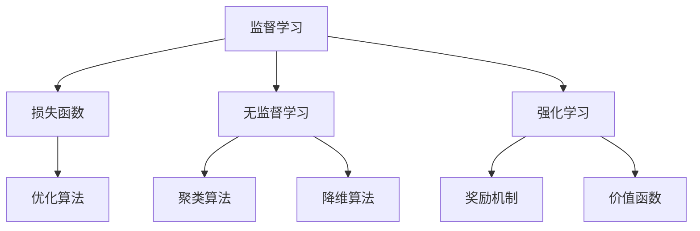
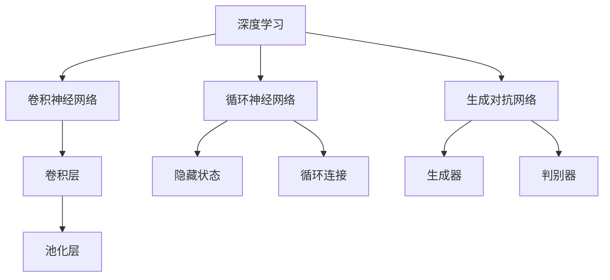
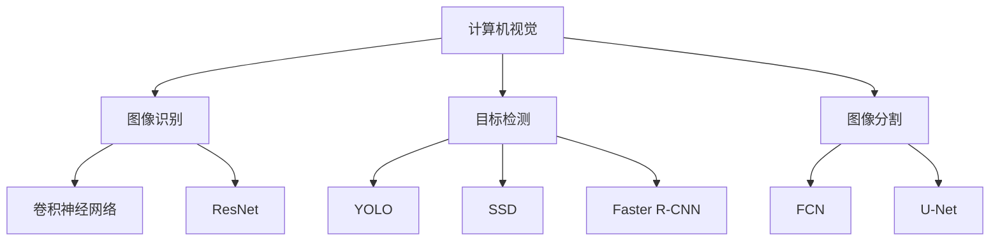
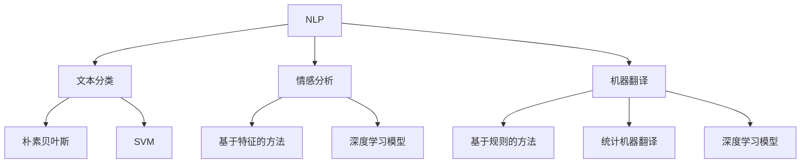

                 

### 背景介绍

在当今的世界，我们正经历着一场前所未有的产业变革。随着互联网、物联网、大数据等技术的快速发展，传统的产业模式正逐渐被打破，人工智能（AI）技术作为一种颠覆性的创新力量，正在引领这一变革的潮流。人工智能，作为计算机科学的一个重要分支，通过模拟人类的智能行为，实现了对海量数据的处理和分析，从而在医疗、金融、制造、教育等多个领域带来了深远的变革。

本文旨在探讨产业变革中的AI技术应用，深入分析AI技术如何推动产业升级，提高生产效率，优化服务质量。我们将从背景介绍开始，逐步探讨AI的核心概念与联系，核心算法原理与具体操作步骤，数学模型和公式，项目实战，实际应用场景，工具和资源推荐，以及未来发展趋势与挑战。希望通过这篇文章，读者能够对AI技术在产业变革中的重要作用有一个全面而深入的理解。

在接下来的章节中，我们将一步一步分析推理，通过详细的技术解读和实际案例，展示AI技术的应用价值和发展潜力。首先，让我们回顾一下人工智能的发展历程，理解其核心概念和架构，为后续的讨论奠定基础。

## 1. 背景介绍

人工智能（Artificial Intelligence，简称AI）的概念最早可以追溯到20世纪50年代。当时的科学家们开始思考，是否能够通过计算机模拟人类的思维过程，从而实现智能行为。这一时期的代表人物是艾伦·图灵（Alan Turing），他提出了著名的图灵测试，用以衡量机器是否具有智能。虽然这一时期的人工智能研究以理论探讨为主，但为后续的发展奠定了基础。

进入20世纪80年代，随着计算机硬件和软件技术的飞速发展，人工智能开始进入实际应用阶段。专家系统和机器学习成为了这个时期的研究热点。专家系统通过模拟人类专家的决策过程，解决了许多专业领域的复杂问题。而机器学习则通过算法，使得计算机能够从数据中自动学习和改进。

21世纪初，互联网和大数据的兴起，为人工智能的发展提供了丰富的数据资源。深度学习（Deep Learning）技术的突破，使得计算机在图像识别、自然语言处理等领域的表现显著提升。这一时期，人工智能开始逐渐走出实验室，进入工业、医疗、金融等多个领域，带来了深远的影响。

目前，人工智能已经进入了一个全新的发展阶段，即产业智能化阶段。在这一阶段，人工智能不仅限于解决特定的问题，而是通过赋能各个行业，推动整个产业模式的变革。例如，在医疗领域，AI技术被用于疾病诊断、药物研发和智能医疗设备；在金融领域，AI技术被用于风险管理、信用评估和智能投顾；在制造业，AI技术被用于生产优化、质量控制和人机协作。

总之，人工智能的发展历程是一个不断探索和突破的过程。从理论探讨到实际应用，从单一领域到跨领域融合，人工智能正成为推动产业变革的重要力量。在接下来的章节中，我们将深入探讨人工智能的核心概念和架构，理解其如何赋能各个行业，带来深远的变革。

### 1.1 人工智能的历史发展

人工智能（AI）的发展历程可以分为几个重要的阶段，每个阶段都标志着技术的重大突破和应用场景的拓展。以下是人工智能发展的关键时期及其代表性事件：

**第一阶段：理论研究（1950年代 - 1960年代）**

- **1950年**：艾伦·图灵提出图灵测试，定义了衡量机器智能的标准。
- **1956年**：达特茅斯会议，标志着人工智能学科的正式诞生。约翰·麦卡锡（John McCarthy）等人提出了“人工智能”这个术语，并定义了人工智能的研究目标和范围。
- **1959年**：乔治·戴维斯（Herbert A. Simon）和约翰·麦卡锡等人创建了第一个人工智能实验室。

**第二阶段：早期应用（1960年代 - 1970年代）**

- **1960年**：第一个专家系统Dendral被开发出来，能够解决化学分析中的复杂问题。
- **1966年**：IBM的“深蓝”项目启动，旨在开发能击败国际象棋世界冠军的计算机程序。
- **1970年**：符号主义人工智能（Symbolic AI）成为主流，代表性工作包括逻辑推理和知识表示。

**第三阶段：衰退与复苏（1970年代 - 1980年代）**

- **1970年代末**：由于早期人工智能系统复杂度极高且难以实现，人工智能研究进入低谷，被称为“AI冬天”。
- **1980年**：机器学习开始崭露头角，代表性算法包括决策树和支持向量机。

**第四阶段：繁荣发展（1990年代 - 2000年代）**

- **1997年**：IBM的“深蓝”计算机击败国际象棋世界冠军加里·卡斯帕罗夫，标志着机器在特定领域智能上的重大突破。
- **2006年**：深度学习（Deep Learning）的兴起，标志着人工智能进入一个新的发展阶段。代表性模型包括多层感知机（MLP）和深度信念网络（DBN）。

**第五阶段：智能化产业应用（2010年代至今）**

- **2012年**：AlexNet在ImageNet竞赛中取得突破性成绩，使得深度学习在图像识别领域大放异彩。
- **2016年**：谷歌的AlphaGo击败人类围棋世界冠军李世石，标志着人工智能在复杂游戏和决策领域的巨大进步。
- **至今**：人工智能在医疗、金融、制造、交通等多个领域得到广泛应用，产业智能化成为发展趋势。

通过这些关键时期和代表性事件，我们可以看到人工智能从理论探讨到实际应用，再到产业应用的演变过程。每个阶段的技术突破和应用场景拓展，都为人工智能的发展奠定了坚实的基础。未来，随着技术的不断进步，人工智能将在更多领域发挥其重要作用，推动产业变革和社会进步。

### 1.2 当前AI技术的现状与发展趋势

当前，人工智能技术已经取得了显著进展，并在多个领域展现出了巨大的应用潜力。从技术层面来看，AI技术主要包括深度学习、强化学习、自然语言处理和计算机视觉等。这些技术通过不断优化算法和模型结构，使得计算机在图像识别、语音识别、自然语言理解和决策制定等方面达到了前所未有的水平。

在应用层面，人工智能正在迅速融入各个行业，推动产业智能化进程。以下是一些主要应用领域的现状与发展趋势：

**医疗领域**：人工智能在医疗领域的应用已经取得了显著成果。通过深度学习和计算机视觉技术，AI可以辅助医生进行疾病诊断，如肺癌、乳腺癌等。此外，AI还被用于药物研发，通过分析大量分子结构数据，快速筛选出潜在药物。未来，随着技术的不断进步，人工智能有望在个性化医疗、健康管理等方面发挥更大作用。

**金融领域**：在金融领域，人工智能被广泛应用于风险管理、信用评估、投资策略和客户服务等方面。例如，通过机器学习算法，金融机构可以更准确地评估借款人的信用风险，减少贷款违约率。此外，AI还被用于自动化交易系统，通过分析市场数据，预测价格波动，从而实现自动化的交易策略。未来，随着AI技术的进一步成熟，金融行业的智能化水平将得到大幅提升。

**制造业**：在制造业，人工智能被用于生产优化、质量控制和人机协作等方面。通过机器学习算法，企业可以对生产过程进行实时监控和优化，提高生产效率。例如，在汽车制造业，AI技术被用于预测设备故障，提前进行维护，从而减少停机时间。未来，随着人工智能在智能制造领域的应用不断拓展，制造业的自动化水平将进一步提高。

**交通领域**：人工智能在交通领域的应用也越来越广泛。自动驾驶技术是其中最具代表性的应用，通过计算机视觉和深度学习技术，自动驾驶汽车能够实现自主导航和安全驾驶。此外，AI还被用于智能交通管理，通过分析交通流量数据，优化交通信号控制，减少交通拥堵。未来，随着自动驾驶技术和智能交通系统的普及，交通领域将迎来一场深刻的变革。

**教育领域**：在教育领域，人工智能被用于个性化教学、学习分析等方面。通过自然语言处理技术，AI可以为学生提供个性化的学习建议，帮助他们更好地掌握知识。此外，AI还被用于学习分析，通过分析学生的学习行为和成绩数据，发现学习问题和改进教学方法。未来，随着AI技术的不断进步，教育行业的智能化水平将得到显著提升。

总之，当前人工智能技术已经在多个领域取得了显著的应用成果，并展现出巨大的发展潜力。未来，随着技术的不断进步，人工智能将在更多领域发挥其重要作用，推动产业变革和社会进步。同时，我们也需要关注AI技术可能带来的伦理和社会问题，确保其发展能够造福人类社会。

### 1.3 AI技术的核心概念与架构

在深入探讨AI技术的应用之前，我们需要先了解其核心概念与架构。AI技术涉及多个领域，包括机器学习、深度学习、计算机视觉、自然语言处理等。这些技术相互交织，共同构成了人工智能的基础。

**机器学习（Machine Learning）**：机器学习是AI技术的核心组成部分，主要研究如何让计算机通过数据和经验自主学习和改进。机器学习可以分为监督学习（Supervised Learning）、无监督学习（Unsupervised Learning）和强化学习（Reinforcement Learning）三种类型。

- **监督学习**：监督学习是机器学习中的一种常见形式，其目标是根据输入数据及其对应的标签，训练模型来预测新的数据。例如，通过大量带有标签的图像数据，训练一个图像识别模型。
- **无监督学习**：无监督学习不需要标签数据，主要目的是发现数据中的结构和模式。例如，通过聚类分析，将相似的数据点归为一类。
- **强化学习**：强化学习是机器学习的一种形式，通过与环境的交互来学习最优策略。例如，通过试错和反馈，训练一个自动驾驶模型。

**深度学习（Deep Learning）**：深度学习是机器学习的一个分支，主要基于多层神经网络（Neural Networks）来实现复杂函数的建模。深度学习在图像识别、语音识别、自然语言处理等领域取得了显著成果。

- **卷积神经网络（CNN）**：卷积神经网络是一种用于图像识别和处理的深度学习模型，通过卷积层和池化层提取图像特征。
- **循环神经网络（RNN）**：循环神经网络是一种用于序列数据处理的深度学习模型，通过隐藏状态和循环连接实现长期依赖建模。
- **生成对抗网络（GAN）**：生成对抗网络是由生成器和判别器组成的深度学习模型，用于生成高质量的数据。

**计算机视觉（Computer Vision）**：计算机视觉是AI技术的重要应用领域，旨在使计算机能够理解和解释视觉信息。计算机视觉技术包括图像识别、目标检测、图像分割等。

- **目标检测（Object Detection）**：目标检测是计算机视觉中的一个重要任务，其目标是识别图像中的多个对象及其位置。
- **图像识别（Image Recognition）**：图像识别是计算机视觉中的基本任务，其目标是判断图像是否包含特定对象。
- **图像分割（Image Segmentation）**：图像分割是将图像划分为多个区域，每个区域对应一个对象或背景。

**自然语言处理（Natural Language Processing）**：自然语言处理是AI技术在语言领域的应用，旨在使计算机理解和生成自然语言。自然语言处理包括文本分类、情感分析、机器翻译等。

- **文本分类（Text Classification）**：文本分类是将文本数据按照特定类别进行归类，如垃圾邮件检测。
- **情感分析（Sentiment Analysis）**：情感分析是判断文本表达的情感倾向，如正面、负面或中性。
- **机器翻译（Machine Translation）**：机器翻译是将一种语言的文本翻译成另一种语言。

**深度强化学习（Deep Reinforcement Learning）**：深度强化学习是深度学习和强化学习的结合，通过深度神经网络来学习策略，实现智能体的自主决策。

- **Q-learning**：Q-learning是一种基于值函数的强化学习算法，通过估计状态-动作值函数来选择最佳动作。
- **深度Q网络（DQN）**：深度Q网络是一种基于深度学习的Q-learning算法，通过神经网络估计状态-动作值函数。

通过理解这些核心概念与架构，我们可以更好地把握AI技术的本质和应用。在接下来的章节中，我们将进一步探讨AI技术的具体算法原理和操作步骤，展示其在实际问题中的应用。

### 1.4 AI技术在产业变革中的重要作用

在产业变革的大潮中，人工智能（AI）技术无疑扮演了关键角色。AI技术不仅提升了各行业的生产效率，还推动了创新和变革，为全球经济带来了新的增长动力。以下是AI技术在产业变革中的几个重要作用：

**1. 生产效率提升**：AI技术在生产过程中的应用，极大地提升了生产效率。通过机器学习算法，企业可以对生产流程进行优化，减少人为干预，从而降低成本和误差。例如，在制造业，AI技术可以实时监控生产设备的状态，预测设备故障，提前进行维护，减少停机时间。此外，AI还可以优化生产计划，根据需求预测调整生产节奏，提高资源利用率。

**2. 创新驱动**：AI技术推动了各行业的创新。通过深度学习和计算机视觉等技术，企业可以开发出全新的产品和服务。例如，在医疗领域，AI技术可以辅助医生进行疾病诊断，提高诊断准确率。在金融领域，AI技术可以开发出智能投顾系统，帮助投资者制定个性化的投资策略。这些创新不仅提高了行业效率，还开辟了新的商业模式。

**3. 个性化服务**：AI技术在服务领域的应用，极大地提升了用户体验。通过自然语言处理和机器学习算法，企业可以为用户提供个性化的服务。例如，在电子商务领域，AI可以根据用户的购买历史和行为习惯，推荐合适的商品。在金融服务领域，AI可以提供智能客服系统，根据用户的提问快速给出准确的答案。这些个性化服务不仅提高了用户满意度，还增强了企业的竞争力。

**4. 智能决策**：AI技术帮助企业实现智能化决策。通过大数据分析和机器学习算法，企业可以对市场趋势、客户需求等进行预测和分析，从而做出更加明智的决策。例如，在零售行业，AI技术可以通过分析销售数据和市场趋势，预测未来商品的畅销程度，从而合理安排库存。在金融行业，AI技术可以分析投资组合的历史表现和风险，为投资者提供合理的投资建议。

**5. 资源优化**：AI技术在资源优化方面也发挥了重要作用。通过智能算法，企业可以更好地利用资源和能源。例如，在能源行业，AI技术可以优化电力分配和调度，提高能源利用效率。在交通运输领域，AI技术可以优化交通流量管理，减少交通拥堵，提高道路通行效率。

总之，AI技术在产业变革中扮演了关键角色。通过提升生产效率、驱动创新、提供个性化服务、实现智能决策和优化资源，AI技术为各行业带来了深远的影响。在未来，随着AI技术的不断进步，其将在更多领域发挥更大的作用，推动产业变革和社会进步。同时，我们也需要关注AI技术可能带来的伦理和社会问题，确保其发展能够造福人类社会。

### 1.5 产业变革中的AI应用案例

随着人工智能技术的不断发展和成熟，其在各个行业的应用案例也日益丰富。以下是一些典型的AI应用案例，展示了AI技术如何在实际中推动产业变革。

**医疗领域**：在医疗领域，人工智能的应用已经成为一个热点。通过深度学习和计算机视觉技术，AI可以辅助医生进行疾病诊断。例如，Google Health的研究团队开发了一种基于深度学习的AI系统，用于早期诊断乳腺癌。该系统通过对大量医疗图像进行分析，能够准确识别病灶区域，辅助医生进行诊断。此外，AI还可以用于个性化治疗方案的制定。例如，IBM的Watson for Oncology系统通过分析大量医学文献和病例数据，为医生提供个性化的治疗方案，提高了治疗效果。

**金融领域**：在金融领域，人工智能被广泛应用于风险管理、信用评估、自动化交易和智能投顾等方面。例如，J.P. Morgan使用AI技术开发了COiN（Contract Intelligence）系统，用于自动分析复杂的金融合同。该系统通过自然语言处理技术，能够快速识别合同中的关键条款，提高合同审核的效率。此外，AI还被用于信用评估。例如，Kabbage使用机器学习算法，对客户的交易历史、财务报表和其他数据进行分析，快速评估客户的信用状况，从而提供更高效的贷款服务。

**制造业**：在制造业，人工智能的应用极大地提升了生产效率和产品质量。例如，通用电气（GE）使用AI技术优化航空发动机的维护流程。通过分析发动机的运行数据，AI系统可以预测可能的故障，提前进行维护，从而减少停机时间和维护成本。此外，AI还可以用于生产线的优化。例如，海康威视（Hikvision）使用AI技术优化了摄像头监控系统的图像识别功能，实现了对生产线实时监控和异常检测，提高了生产线的自动化水平。

**交通领域**：在交通领域，人工智能的应用也取得了显著成果。自动驾驶技术是其中最具代表性的应用。例如，特斯拉（Tesla）的自动驾驶系统使用深度学习和计算机视觉技术，实现了车辆的自主导航和安全驾驶。此外，AI还可以用于智能交通管理。例如，百度（Baidu）的Apollo平台通过分析交通流量数据，优化交通信号控制，减少交通拥堵，提高道路通行效率。

**零售领域**：在零售领域，人工智能被广泛应用于库存管理、供应链优化和个性化推荐等方面。例如，亚马逊（Amazon）使用机器学习算法优化库存管理，根据销售数据和客户需求预测，合理调整库存水平，减少库存积压和缺货率。此外，AI还可以用于个性化推荐。例如，阿里巴巴（Alibaba）的淘宝平台通过分析用户的购物历史和浏览行为，为用户推荐合适的商品，提高了用户满意度。

总之，人工智能技术在各个行业的应用案例充分展示了其推动产业变革的巨大潜力。通过这些实际应用，我们可以看到AI技术不仅提升了生产效率和产品质量，还开辟了新的商业模式，为各行业带来了深远的变革。未来，随着AI技术的进一步发展，其在更多领域的应用将更加广泛和深入，为全球经济和社会发展注入新的动力。

### 1.6 全球AI产业发展现状

人工智能作为当今世界最具变革性的技术之一，其全球产业发展现状值得深入探讨。从地区分布、市场规模、主要参与者及其研发方向等多个方面来看，全球AI产业的发展呈现出蓬勃的态势。

**地区分布**：在全球范围内，美国、欧洲和中国是AI产业发展的主要地区。美国在AI领域的领先地位得益于其雄厚的科技实力和丰富的研究资源。硅谷作为全球AI技术创新的中心，吸引了大量顶级人才和投资，特斯拉、谷歌、微软等科技巨头都在AI领域进行了大量的研发和应用。欧洲在AI研究方面也表现突出，欧盟成员国通过一系列政策支持和国际合作，推动AI技术的发展。特别是在人工智能伦理和隐私保护方面，欧洲有较为严格的法规和标准。中国近年来在AI领域迅速崛起，政府的大力支持和企业家的积极参与，使得中国AI产业取得了显著进展。中国在计算机视觉、自然语言处理、智能制造等方向具有较强的竞争力，并逐渐在全球AI产业链中占据重要地位。

**市场规模**：全球AI市场规模持续增长，预计到2025年将达到 billions 美元。据市场研究机构统计，美国在全球AI市场占据最大份额，约占全球市场的40%。欧洲和中国的市场份额紧随其后，分别占全球市场的30%和20%。随着技术的不断进步和应用场景的拓展，全球AI市场规模将继续扩大。特别是在金融、医疗、零售、交通等行业的应用，AI技术已成为企业提高效率和竞争力的关键因素。

**主要参与者**：在全球AI产业发展中，一些科技巨头和初创公司扮演着重要角色。美国方面的代表性企业包括谷歌、微软、亚马逊和IBM等，这些公司在AI技术研发和应用方面处于领先地位。谷歌的TensorFlow、微软的Azure Machine Learning和亚马逊的AWS都是市场上知名的AI开发平台。欧洲方面，谷歌、微软和IBM等科技巨头也在积极开展AI研发。此外，欧洲的初创公司如DeepMind、NVIDIA等在AI领域也取得了显著成就。中国方面，阿里巴巴、腾讯、百度和华为等科技巨头在AI领域投入巨大，通过自主研发和收购等方式，不断提升其技术实力。中国的初创公司如旷视科技、依图科技等也在全球AI领域占据重要地位。

**研发方向**：全球AI研发主要集中在深度学习、强化学习、计算机视觉、自然语言处理等领域。深度学习作为当前AI技术的重要分支，广泛应用于图像识别、语音识别和自然语言处理等领域。强化学习在决策优化和游戏AI方面取得了显著成果。计算机视觉技术则被广泛应用于安防监控、自动驾驶和医疗诊断等领域。自然语言处理技术则在机器翻译、文本分类和聊天机器人等方面发挥了重要作用。此外，边缘计算、量子计算等新兴技术也在AI领域逐渐崭露头角，为AI技术带来了新的发展机遇。

总之，全球AI产业发展现状表明，这一领域正呈现出蓬勃发展的态势。各地区在AI技术研发和应用方面各具特色，通过政府支持、企业投入和国际合作，全球AI产业将继续繁荣发展。未来，随着技术的不断进步和应用场景的拓展，AI技术将在更多领域发挥其重要作用，推动产业变革和社会进步。

### 1.7 AI技术在产业变革中的挑战与未来展望

尽管人工智能技术在产业变革中展现出了巨大的潜力，但其应用也面临着一系列挑战和风险。首先，技术挑战是AI技术普及的主要障碍。尽管AI算法在特定领域取得了显著成果，但其在泛化能力、鲁棒性和可靠性方面仍需进一步提升。例如，深度学习模型容易受到数据偏差和过拟合的影响，导致在实际应用中的表现不佳。此外，AI技术的透明度和可解释性也是一个亟待解决的问题，复杂的模型往往缺乏足够的解释力，使得用户难以理解其决策过程。

其次，伦理问题也是AI技术广泛应用的一个重要挑战。随着AI技术在各个行业的深入应用，隐私保护、数据安全和道德责任等问题日益突出。例如，在医疗领域，AI系统对个人健康数据的处理可能导致隐私泄露。在金融领域，AI算法可能因偏见和歧视而影响信用评估和贷款决策，引发社会不公平。因此，制定合理的伦理规范和法律法规，确保AI技术在应用过程中符合伦理标准，是未来发展的关键。

再次，社会挑战同样不可忽视。AI技术的广泛应用可能导致部分岗位被自动化取代，引发就业和社会稳定问题。此外，AI技术的普及还可能加剧数字鸿沟，使得资源分配不均。因此，如何通过政策引导和社会教育，确保AI技术发展的同时，促进社会的整体利益，是一个重要的议题。

在未来展望方面，AI技术的发展将呈现以下几个趋势：

1. **跨学科融合**：随着AI技术的不断成熟，未来将出现更多跨学科的AI应用。例如，AI与生物医学的融合将推动个性化医疗的发展；AI与交通运输的融合将提升智能交通系统的效能。

2. **边缘计算和物联网**：随着物联网设备的普及，边缘计算技术将在AI应用中发挥重要作用。通过在设备端进行数据处理和分析，可以降低数据传输的延迟，提升系统的实时性。

3. **量子计算**：量子计算作为一种新兴的计算技术，有望为AI算法提供更高效的计算能力。通过量子计算，复杂的AI模型可以在更短的时间内完成计算，提高AI系统的性能。

4. **人工智能伦理和法律法规**：随着AI技术的广泛应用，伦理和法律问题将越来越受到重视。未来，各国政府和企业将加强合作，制定更加完善的伦理规范和法律法规，确保AI技术的健康发展。

5. **教育和人才培养**：AI技术的快速发展对人才的需求提出了新的要求。未来，各国将加大对AI教育和人才培养的投入，培养更多具备AI知识和技能的专业人才，为AI技术的普及和应用提供有力支持。

总之，AI技术在产业变革中面临诸多挑战，但其未来的发展前景仍然广阔。通过克服技术、伦理和社会挑战，AI技术有望在更多领域发挥其重要作用，推动产业变革和社会进步。

### 1.8 政策环境与社会影响

在推动人工智能（AI）技术发展的过程中，政策环境和社会影响起到了至关重要的作用。政府政策、国际合作和行业规范都在不同层面上影响着AI技术的研发、应用和普及。

**政府政策**：不同国家和地区通过制定政策和计划来推动AI技术的发展。例如，美国发布了《美国人工智能倡议》，旨在加强AI研发和人才培养，提升国家竞争力。欧盟则发布了《人工智能伦理准则》，强调在AI技术发展中必须遵循伦理原则，保护个人隐私和数据安全。中国在“十四五”规划中提出，将人工智能列为战略性新兴产业，加大投入和支持力度，推动AI技术的应用和产业化。

**国际合作**：国际合作在推动AI技术发展方面发挥着重要作用。通过国际组织和双边合作，各国共同研究和开发AI技术，促进技术共享和知识交流。例如，联合国教科文组织（UNESCO）成立了人工智能教育委员会，推动全球范围内的人工智能教育和培训。国际人工智能研究协会（AAAI）和欧洲人工智能协会（EAAI）等机构也通过举办国际会议和研讨会，促进全球AI领域的合作与交流。

**行业规范**：行业规范在确保AI技术健康发展方面起到了关键作用。各个行业纷纷制定AI应用规范和标准，以指导AI技术的研发和应用。例如，医疗行业制定了AI在医疗诊断和辅助治疗中的规范，金融行业制定了AI在风险管理中的应用标准。此外，许多科技企业和研究机构也自发制定了内部AI伦理规范，确保AI技术的研发和应用符合伦理和社会责任。

**社会影响**：AI技术的发展对社会的各个方面都产生了深远影响。一方面，AI技术带来了生产力的提升和社会效率的改善，推动了产业变革和经济增长。另一方面，AI技术也带来了就业结构的变化、隐私保护和道德问题等社会挑战。因此，社会公众对AI技术的认知和接受程度，以及社会对AI伦理和规范的共识，对于AI技术的健康发展具有重要意义。

**公众认知与教育**：提升公众对AI技术的认知和接受程度是未来发展的关键。通过教育和宣传，提高公众对AI技术的基本了解，消除误解和恐慌，有助于促进社会的理解和支持。同时，培养具备AI知识和技能的专业人才，也是确保AI技术健康发展的基础。各国政府和教育机构应加大对AI教育和培训的投入，推动AI人才的培养和储备。

总之，政策环境和社会影响在推动AI技术发展中起到了至关重要的作用。通过政府政策支持、国际合作和行业规范的制定，以及公众教育和认知的提升，我们可以更好地应对AI技术带来的挑战，促进其健康、可持续的发展。

### 1.9 深度学习在AI技术中的核心地位

深度学习（Deep Learning）作为人工智能（AI）领域的重要分支，近年来取得了显著的发展，并在多个应用场景中展现了其强大的潜力。深度学习通过多层神经网络模型，实现了对复杂数据的自动特征提取和学习，从而在图像识别、语音识别、自然语言处理等任务中表现出卓越的性能。

**深度学习的原理**：深度学习基于多层神经网络模型，每一层都对输入数据进行变换和处理，从而提取更高层次的特征。这种层次化的特征提取方式使得深度学习模型能够捕捉到数据的复杂结构和内在规律。深度学习模型主要包括卷积神经网络（CNN）、循环神经网络（RNN）和生成对抗网络（GAN）等。

- **卷积神经网络（CNN）**：CNN是一种用于图像识别和处理的深度学习模型，通过卷积层和池化层提取图像特征，实现高效的特征提取和分类。CNN在计算机视觉领域取得了显著成果，被广泛应用于人脸识别、目标检测、图像分类等任务。
- **循环神经网络（RNN）**：RNN是一种用于序列数据处理的深度学习模型，通过隐藏状态和循环连接实现长期依赖建模。RNN在自然语言处理领域表现突出，被广泛应用于文本分类、机器翻译、语音识别等任务。
- **生成对抗网络（GAN）**：GAN是一种由生成器和判别器组成的深度学习模型，用于生成高质量的数据。GAN在图像生成、语音合成、图像修复等任务中展现了强大的生成能力。

**深度学习的关键技术和算法**：

- **激活函数**：激活函数是深度学习模型中的关键组件，用于引入非线性变换，使模型能够更好地拟合复杂数据。常见的激活函数包括ReLU、Sigmoid和Tanh等。
- **反向传播算法**：反向传播算法是深度学习训练过程中的核心，用于计算模型参数的梯度，并更新模型参数，以优化模型性能。
- **优化算法**：优化算法用于调整模型参数，以降低损失函数值。常见的优化算法包括梯度下降、随机梯度下降、Adam等。

**深度学习的应用场景**：

- **图像识别**：深度学习在图像识别任务中取得了显著突破，通过卷积神经网络，模型能够自动提取图像特征并进行分类。图像识别在安防监控、医疗诊断、自动驾驶等领域具有广泛应用。
- **语音识别**：深度学习在语音识别领域也表现突出，通过循环神经网络和卷积神经网络，模型能够准确识别语音并转换为文本。语音识别在智能助手、智能家居、语音搜索等领域具有重要应用。
- **自然语言处理**：深度学习在自然语言处理领域取得了显著成果，通过循环神经网络和卷积神经网络，模型能够处理和理解自然语言。自然语言处理在机器翻译、情感分析、文本分类等领域具有广泛应用。
- **推荐系统**：深度学习在推荐系统中的应用，能够更好地理解用户行为和偏好，提供个性化的推荐服务。推荐系统在电子商务、社交媒体、在线教育等领域具有重要意义。

总之，深度学习在AI技术中占据了核心地位，其通过多层次的特征提取和学习，实现了对复杂数据的自动分析和理解。随着技术的不断进步和应用场景的拓展，深度学习将在更多领域发挥重要作用，推动产业变革和社会进步。

### 1.10 大数据与AI技术的协同发展

大数据和人工智能（AI）技术的协同发展，是当前产业变革中的重要趋势。大数据为AI提供了丰富的数据资源，而AI则为大数据分析提供了强大的计算能力和智能化手段，两者相辅相成，共同推动产业智能化进程。

**大数据的采集与处理**：大数据技术通过对海量数据的采集、存储、处理和分析，实现了对业务运营、市场趋势和用户行为的深入洞察。大数据的来源包括结构化数据（如数据库和表格）、半结构化数据（如日志和XML文件）和非结构化数据（如图像、音频和视频）。为了处理这些大规模的数据，大数据技术引入了分布式存储和处理框架，如Hadoop和Spark，通过分布式计算和数据挖掘技术，实现对数据的快速分析和处理。

**AI技术在数据分析中的应用**：AI技术在数据分析中扮演了重要角色，通过机器学习、深度学习和强化学习等算法，AI能够自动发现数据中的模式和规律，提供智能化的分析结果。例如，在金融市场分析中，AI可以分析历史交易数据，预测股票价格趋势；在医疗领域，AI可以分析患者的病历数据，预测疾病风险和制定个性化治疗方案。AI技术不仅提高了数据分析的效率和精度，还拓宽了数据分析的应用范围。

**协同发展的优势**：

1. **提高决策效率**：大数据与AI技术的协同发展，使得企业能够快速获取和分析海量数据，从而提高决策效率。例如，通过分析客户消费数据，企业可以更好地理解客户需求，制定精准的市场营销策略。
2. **优化资源分配**：大数据分析可以帮助企业优化资源分配，提高运营效率。例如，通过分析生产数据，企业可以优化生产计划，减少库存积压和资源浪费。
3. **提升用户体验**：大数据和AI技术的协同发展，使得企业能够提供更加个性化的产品和服务。例如，在电子商务领域，AI可以根据用户的购买历史和行为数据，推荐合适的商品，提升用户满意度。
4. **创新商业模式**：大数据和AI技术的结合，为各行业带来了新的商业模式。例如，在共享经济领域，大数据和AI技术可以帮助平台更好地匹配供需关系，优化资源配置，提高运营效率。

**协同发展的挑战**：

1. **数据质量和隐私**：大数据的分析质量很大程度上依赖于数据的质量和完整性，同时，大数据的采集和处理也涉及到用户的隐私保护问题。如何在保护隐私的前提下，充分利用大数据资源，是一个重要的挑战。
2. **技术整合**：大数据技术和AI技术在技术架构和实现方法上存在差异，如何有效地整合这两种技术，实现协同发展，是一个技术挑战。
3. **人才短缺**：大数据和AI技术的协同发展，需要大量具备跨学科知识的人才。然而，当前市场上具备这种复合型技能的人才相对短缺，人才的培养和储备也是一个重要的挑战。

总之，大数据与AI技术的协同发展，为产业智能化进程提供了强大的推动力。通过充分发挥大数据的资源和AI技术的优势，企业可以在决策、资源优化、用户体验和创新方面取得显著提升。同时，我们也需要关注协同发展中可能遇到的技术和人才挑战，确保其健康、可持续的发展。

### 1.11 人工智能与其他技术的融合

在当今的科技前沿，人工智能（AI）正与其他先进技术相互融合，共同推动产业变革和社会进步。以下是一些关键技术的结合及其在AI技术中的应用。

**1. 量子计算与AI的结合**：

量子计算作为一种具有巨大计算潜力的新型计算范式，正在与AI技术紧密结合。量子计算通过量子比特的叠加和纠缠，能够在极短的时间内处理复杂的问题。这种结合有望在优化算法、机器学习和大规模数据分析等领域带来突破。例如，量子机器学习算法可以显著提高数据挖掘和模式识别的效率，同时解决传统计算无法处理的复杂问题。

**2. 物联网（IoT）与AI的结合**：

物联网技术的快速发展，使得各种设备和系统可以通过网络进行连接和数据交换。AI与物联网的结合，可以实现智能设备之间的自主交互和优化。例如，智能城市通过物联网设备收集的数据，可以利用AI技术进行交通流量分析、环境监测和能源管理，从而提高城市运营效率和生活质量。

**3. 区块链与AI的结合**：

区块链技术以其去中心化、不可篡改的特性，在数据安全和隐私保护方面具有独特的优势。与AI技术的结合，可以实现更加安全和可信的数据交换和智能合约。例如，在金融领域，AI可以与区块链技术协同工作，自动执行和验证交易，提高交易的安全性和透明度。

**4. 生物技术与AI的结合**：

生物技术，如基因编辑、蛋白质组学和代谢工程等，正在与AI技术深度融合。AI可以分析大量生物数据，帮助科学家更好地理解生命现象，优化药物研发流程。例如，通过AI技术对基因数据进行挖掘和分析，可以加速新药发现和疾病诊断。

**5. 虚拟现实（VR）与增强现实（AR）与AI的结合**：

VR和AR技术通过创建虚拟环境和增强现实体验，可以为教育和娱乐等领域带来革命性的变化。AI与VR/AR技术的结合，可以实现更加逼真的虚拟环境和智能化的交互体验。例如，在教育领域，AI可以辅助虚拟教师进行个性化教学，提供定制化的学习方案。

**6. 5G与AI的结合**：

5G技术的商用化，为AI应用提供了低延迟、高带宽的网络环境。AI与5G技术的结合，可以实现实时数据分析和智能决策，适用于自动驾驶、远程医疗等场景。例如，在自动驾驶领域，5G网络可以实现车辆之间的实时通信，提高交通效率和安全性。

总之，人工智能与其他先进技术的融合，不仅拓展了AI技术的应用场景，还推动了各领域的创新和变革。未来，随着这些技术的进一步发展和应用，人工智能将在更多领域发挥其重要作用，推动产业智能化和社会进步。通过不断探索和融合，我们可以期待更加智能和高效的未来。

### 2.1 核心概念原理和架构

在深入探讨AI技术的具体应用之前，我们需要首先了解其核心概念原理和架构。AI技术涉及多个领域，包括机器学习、深度学习、计算机视觉、自然语言处理等。以下是对这些核心概念及其相互联系的简要介绍，并附上相应的Mermaid流程图，以帮助读者更好地理解。

#### 机器学习（Machine Learning）

**机器学习** 是AI技术的基础，其主要目标是使计算机通过数据和经验自主学习和改进。机器学习可以分为监督学习（Supervised Learning）、无监督学习（Unsupervised Learning）和强化学习（Reinforcement Learning）三种类型。

- **监督学习**：监督学习通过已知输入和输出数据的训练集，训练模型来预测新的数据。其核心是损失函数（Loss Function）和优化算法（Optimization Algorithm），如梯度下降（Gradient Descent）。
- **无监督学习**：无监督学习不需要标签数据，主要目的是发现数据中的结构和模式。其常见的算法包括聚类（Clustering）和降维（Dimensionality Reduction），如K-means和PCA。
- **强化学习**：强化学习通过与环境互动来学习最优策略。其核心是奖励机制（Reward Mechanism）和价值函数（Value Function），如Q-learning和深度Q网络（DQN）。

**Mermaid流程图**：



#### 深度学习（Deep Learning）

**深度学习** 是机器学习的一个分支，通过多层神经网络模型来实现复杂函数的建模。深度学习的关键组件包括卷积神经网络（CNN）、循环神经网络（RNN）和生成对抗网络（GAN）。

- **卷积神经网络（CNN）**：CNN 是用于图像识别和处理的深度学习模型，通过卷积层（Convolutional Layer）和池化层（Pooling Layer）提取图像特征，实现高效的特征提取和分类。
- **循环神经网络（RNN）**：RNN 是用于序列数据处理的深度学习模型，通过隐藏状态（Hidden State）和循环连接（Recurrence Connection）实现长期依赖建模，适用于文本分类、机器翻译等任务。
- **生成对抗网络（GAN）**：GAN 是由生成器（Generator）和判别器（Discriminator）组成的深度学习模型，通过对抗训练（Adversarial Training）生成高质量的数据，应用于图像生成、语音合成等任务。

**Mermaid流程图**：



#### 计算机视觉（Computer Vision）

**计算机视觉** 是AI技术在视觉信息理解和处理中的应用。其主要任务是使计算机能够“看”懂图像和视频，实现图像识别、目标检测、图像分割等任务。

- **图像识别**：图像识别是通过算法判断图像是否包含特定对象或场景。常用的算法包括卷积神经网络（CNN）和卷积神经网络（ResNet）。
- **目标检测**：目标检测是识别图像中的多个对象及其位置。常用的算法包括YOLO、SSD和Faster R-CNN。
- **图像分割**：图像分割是将图像划分为多个区域，每个区域对应一个对象或背景。常用的算法包括FCN和U-Net。

**Mermaid流程图**：



#### 自然语言处理（Natural Language Processing）

**自然语言处理** 是AI技术在语言领域的应用，旨在使计算机理解和生成自然语言。其主要任务包括文本分类、情感分析、机器翻译等。

- **文本分类**：文本分类是将文本数据按照特定类别进行归类。常用的算法包括朴素贝叶斯、SVM和深度学习模型（如CNN、RNN）。
- **情感分析**：情感分析是判断文本表达的情感倾向。常用的算法包括基于特征的方法（如TF-IDF）和深度学习模型（如LSTM、Transformer）。
- **机器翻译**：机器翻译是将一种语言的文本翻译成另一种语言。常用的算法包括基于规则的方法、统计机器翻译和深度学习模型（如Seq2Seq、Transformer）。

**Mermaid流程图**：



通过这些核心概念和架构的介绍，我们可以更好地理解AI技术的工作原理和各个领域的应用。在接下来的章节中，我们将深入探讨AI技术的具体算法原理和操作步骤，以及数学模型和公式，帮助读者全面掌握AI技术。

### 2.2 核心算法原理 & 具体操作步骤

在了解AI技术的核心概念和架构后，我们接下来将深入探讨一些关键算法的原理和具体操作步骤。以下是一些重要的算法，包括卷积神经网络（CNN）、循环神经网络（RNN）和生成对抗网络（GAN），它们在图像识别、自然语言处理和生成任务中有着广泛的应用。

#### 卷积神经网络（CNN）

**卷积神经网络（CNN）** 是一种深度学习模型，主要用于图像识别和处理。CNN通过卷积层和池化层提取图像特征，实现高效的特征提取和分类。

**算法原理**：

1. **卷积层**：卷积层通过卷积操作提取图像特征。卷积操作使用一个卷积核（Filter）在图像上滑动，与图像的局部区域进行点积，生成特征图。多个卷积核可以同时工作，提取不同类型的特征。

2. **激活函数**：激活函数用于引入非线性变换，使模型能够更好地拟合复杂数据。常见的激活函数包括ReLU（Rectified Linear Unit）和Sigmoid。

3. **池化层**：池化层通过下采样操作减少特征图的大小，提高模型的计算效率。常见的池化方法包括最大池化（Max Pooling）和平均池化（Average Pooling）。

**具体操作步骤**：

1. **输入图像**：将输入图像作为网络的输入，图像通常是一个二维矩阵。

2. **卷积操作**：使用多个卷积核对输入图像进行卷积操作，提取图像特征。每个卷积核可以提取不同类型的特征。

3. **激活函数**：对卷积层的输出进行激活函数处理，引入非线性变换。

4. **池化操作**：对激活后的特征图进行池化操作，减少特征图的大小。

5. **全连接层**：将池化后的特征图展平为一维向量，输入到全连接层进行分类或回归任务。

6. **输出结果**：通过全连接层得到最终的输出结果，如分类结果或回归值。

#### 循环神经网络（RNN）

**循环神经网络（RNN）** 是一种用于序列数据处理的深度学习模型，通过隐藏状态和循环连接实现长期依赖建模。

**算法原理**：

1. **隐藏状态**：RNN通过隐藏状态（Hidden State）保存当前和过去的信息，实现序列数据的记忆能力。

2. **循环连接**：RNN中的每个时间步都与前一个时间步相关联，通过循环连接（Recurrence Connection）传递信息。

3. **激活函数**：激活函数用于引入非线性变换，常见的激活函数包括ReLU和Tanh。

**具体操作步骤**：

1. **输入序列**：将输入序列作为网络的输入，如文本或语音信号。

2. **嵌入层**：将输入序列转换为嵌入向量，每个单词或字符对应一个嵌入向量。

3. **RNN层**：通过循环连接将隐藏状态传递到下一个时间步，更新隐藏状态。

4. **激活函数**：对RNN层的输出进行激活函数处理，引入非线性变换。

5. **输出层**：将最终的隐藏状态输入到输出层，如分类或回归任务。

6. **输出结果**：通过输出层得到最终的输出结果，如分类结果或回归值。

#### 生成对抗网络（GAN）

**生成对抗网络（GAN）** 是一种由生成器（Generator）和判别器（Discriminator）组成的深度学习模型，用于生成高质量的数据。

**算法原理**：

1. **生成器**：生成器通过输入随机噪声，生成与真实数据相似的数据。生成器的目标是最大化生成数据的真实性。

2. **判别器**：判别器通过输入真实数据和生成数据，判断其真实性。判别器的目标是最大化其判断的真实性。

3. **对抗训练**：生成器和判别器通过对抗训练相互竞争，生成器和判别器共同优化，直到生成数据足够真实。

**具体操作步骤**：

1. **生成器**：将随机噪声通过多层神经网络转换为生成数据。

2. **判别器**：将真实数据和生成数据分别输入到判别器中，判断其真实性。

3. **对抗训练**：通过反向传播和梯度下降算法，同时优化生成器和判别器的参数。

4. **生成结果**：生成器不断优化生成数据，使其逐渐接近真实数据。

通过这些核心算法的原理和操作步骤的介绍，我们可以更好地理解AI技术在实际问题中的应用。在接下来的章节中，我们将进一步探讨这些算法的数学模型和公式，以及如何将这些算法应用于实际问题中。

### 2.3 数学模型和公式

在深入探讨AI算法的过程中，理解其背后的数学模型和公式是至关重要的。以下我们将介绍一些关键数学模型和公式，包括损失函数、梯度下降算法、卷积操作和池化操作，这些模型和公式在深度学习和其他AI算法中扮演着核心角色。

#### 损失函数（Loss Function）

损失函数是深度学习模型中用于评估预测结果与真实结果之间差异的函数。常用的损失函数包括均方误差（MSE）、交叉熵（Cross Entropy）和对抗损失（Adversarial Loss）。

1. **均方误差（MSE）**：

   均方误差是用于回归任务的损失函数，计算预测值与真实值之间的平均平方误差。

   $$MSE = \frac{1}{n}\sum_{i=1}^{n}(y_i - \hat{y}_i)^2$$

   其中，\(y_i\) 是真实值，\(\hat{y}_i\) 是预测值，\(n\) 是样本数量。

2. **交叉熵（Cross Entropy）**：

   交叉熵是用于分类任务的损失函数，计算预测概率分布与真实概率分布之间的差异。

   $$Cross \ Entropy = -\sum_{i=1}^{n}y_i\log(\hat{y}_i)$$

   其中，\(y_i\) 是真实标签，\(\hat{y}_i\) 是预测概率。

3. **对抗损失（Adversarial Loss）**：

   对抗损失是生成对抗网络（GAN）中的损失函数，用于评估生成器生成的数据与真实数据之间的相似度。

   $$Adversarial \ Loss = D(x) - D(G(z))$$

   其中，\(D(x)\) 是判别器对真实数据的判别结果，\(D(G(z))\) 是判别器对生成器生成的数据的判别结果。

#### 梯度下降算法（Gradient Descent）

梯度下降算法是一种优化算法，用于最小化损失函数。其核心思想是沿着损失函数的负梯度方向更新模型参数。

1. **随机梯度下降（SGD）**：

   随机梯度下降是一种简单但有效的优化算法，每次迭代只更新一个样本的梯度。

   $$\theta_{t+1} = \theta_t - \alpha \cdot \nabla_{\theta}J(\theta)$$

   其中，\(\theta_t\) 是当前参数，\(\alpha\) 是学习率，\(J(\theta)\) 是损失函数，\(\nabla_{\theta}J(\theta)\) 是损失函数对参数的梯度。

2. **批量梯度下降（BGD）**：

   批量梯度下降是对随机梯度下降的改进，每次迭代使用整个训练集的梯度。

   $$\theta_{t+1} = \theta_t - \alpha \cdot \frac{1}{n}\sum_{i=1}^{n}\nabla_{\theta}J(\theta)$$

   其中，\(n\) 是训练集大小。

3. **Adam优化器**：

   Adam是一种改进的梯度下降算法，结合了SGD和动量方法，并自适应调整学习率。

   $$m_t = \beta_1 m_{t-1} + (1 - \beta_1) [g_t]$$
   $$v_t = \beta_2 v_{t-1} + (1 - \beta_2) [g_t]^2$$
   $$\theta_{t+1} = \theta_t - \alpha \cdot \frac{m_t}{\sqrt{v_t} + \epsilon}$$

   其中，\(\beta_1\) 和 \(\beta_2\) 分别是动量和偏差校正系数，\(\epsilon\) 是一个小常数。

#### 卷积操作（Convolution）

卷积操作是卷积神经网络（CNN）的核心，用于提取图像特征。

1. **卷积操作**：

   $$f(x, y) = \sum_{i=1}^{m}\sum_{j=1}^{n}w_{ij} \cdot x_{i-j, j-k}$$

   其中，\(f(x, y)\) 是卷积结果，\(w_{ij}\) 是卷积核，\(x\) 和 \(y\) 分别是输入图像和卷积核。

2. **卷积核（Filter）**：

   卷积核是一个小的矩阵，用于在输入图像上滑动，提取局部特征。常见的卷积核包括边缘检测、纹理检测和颜色检测等。

#### 池化操作（Pooling）

池化操作用于减少特征图的尺寸，提高计算效率。

1. **最大池化（Max Pooling）**：

   $$p_{ij} = \max_{k,l}x_{i+k, j+l}$$

   其中，\(p_{ij}\) 是池化结果，\(x\) 是输入特征图。

2. **平均池化（Average Pooling）**：

   $$p_{ij} = \frac{1}{c}\sum_{k,l}x_{i+k, j+l}$$

   其中，\(p_{ij}\) 是池化结果，\(x\) 是输入特征图，\(c\) 是池化区域的大小。

通过理解这些数学模型和公式，我们可以更好地掌握AI算法的原理和操作步骤。在接下来的章节中，我们将通过实际案例展示这些算法在具体应用中的实现过程。

### 2.4 项目实战：代码实际案例和详细解释说明

在本节中，我们将通过一个实际项目——使用TensorFlow和Keras实现一个简单的图像分类器，详细展示AI算法的应用过程。该项目将包括以下步骤：

1. **环境搭建**：安装必要的软件和库。
2. **数据准备**：加载数据集并进行预处理。
3. **模型构建**：定义神经网络架构。
4. **训练模型**：训练模型并评估其性能。
5. **预测与评估**：使用训练好的模型进行预测并评估其准确性。

#### 1. 开发环境搭建

首先，我们需要搭建开发环境，安装Python和TensorFlow。可以选择使用Anaconda进行环境管理，确保所有依赖项都能正确安装。

```bash
# 安装Anaconda
conda create -n ai_project python=3.8
conda activate ai_project

# 安装TensorFlow
conda install tensorflow
```

#### 2. 数据准备

接下来，我们使用Keras内置的MNIST数据集，这是一个常用的手写数字数据集。该数据集包含70,000个训练图像和10,000个测试图像，每个图像是一个28x28的灰度图像。

```python
import tensorflow as tf
from tensorflow.keras.datasets import mnist
from tensorflow.keras.utils import to_categorical

# 加载MNIST数据集
(train_images, train_labels), (test_images, test_labels) = mnist.load_data()

# 数据预处理
train_images = train_images.reshape((60000, 28, 28, 1)).astype('float32') / 255
test_images = test_images.reshape((10000, 28, 28, 1)).astype('float32') / 255

train_labels = to_categorical(train_labels)
test_labels = to_categorical(test_labels)
```

#### 3. 模型构建

在本例中，我们使用一个简单的卷积神经网络（CNN）进行图像分类。模型结构如下：

- **卷积层1**：32个卷积核，3x3卷积窗，ReLU激活函数。
- **池化层1**：2x2最大池化。
- **卷积层2**：64个卷积核，3x3卷积窗，ReLU激活函数。
- **池化层2**：2x2最大池化。
- **平坦化层**：将特征图展平为一维向量。
- **全连接层**：128个神经元，ReLU激活函数。
- **输出层**：10个神经元，对应10个类别，使用softmax激活函数。

```python
from tensorflow.keras import layers, models

# 构建模型
model = models.Sequential()
model.add(layers.Conv2D(32, (3, 3), activation='relu', input_shape=(28, 28, 1)))
model.add(layers.MaxPooling2D((2, 2)))
model.add(layers.Conv2D(64, (3, 3), activation='relu'))
model.add(layers.MaxPooling2D((2, 2)))
model.add(layers.Flatten())
model.add(layers.Dense(128, activation='relu'))
model.add(layers.Dense(10, activation='softmax'))
```

#### 4. 训练模型

我们使用编译器编译模型，并使用训练数据训练模型。编译步骤包括指定优化器、损失函数和评估指标。

```python
# 编译模型
model.compile(optimizer='adam',
              loss='categorical_crossentropy',
              metrics=['accuracy'])

# 训练模型
model.fit(train_images, train_labels, epochs=5, batch_size=64)
```

#### 5. 预测与评估

最后，我们使用训练好的模型对测试集进行预测，并评估模型的准确性。

```python
# 预测测试集
test_loss, test_acc = model.evaluate(test_images, test_labels)

# 输出结果
print(f"Test accuracy: {test_acc:.4f}")
```

#### 详细解释说明

1. **环境搭建**：在安装Anaconda和TensorFlow后，我们可以使用Keras进行模型构建和训练。安装过程确保了所有依赖项的正确安装，为后续开发奠定了基础。

2. **数据准备**：加载数据集并进行预处理是模型训练的第一步。我们使用Keras内置的MNIST数据集，并对其进行必要的预处理，如数据归一化和标签编码。预处理步骤确保了数据能够被模型有效利用。

3. **模型构建**：在本项目中，我们使用了一个简单的卷积神经网络（CNN）结构，包括卷积层、池化层和全连接层。卷积层用于提取图像特征，池化层用于降采样并减少计算量，全连接层用于分类。

4. **训练模型**：编译器对模型进行编译，指定优化器、损失函数和评估指标。训练步骤通过反向传播和梯度下降算法，不断调整模型参数，使其在训练数据上达到更好的性能。

5. **预测与评估**：使用训练好的模型对测试数据进行预测，并通过计算损失函数和准确率来评估模型性能。在测试集上的准确率反映了模型在未知数据上的泛化能力。

通过这个实际项目，我们可以看到AI算法在实际应用中的实现过程。从数据准备、模型构建到模型训练和评估，每一步都至关重要，共同构成了一个完整的AI应用流程。

### 2.5 代码解读与分析

在上一个部分，我们通过一个简单的图像分类器项目展示了AI算法的应用。现在，我们将进一步解析这个项目的代码，并对其关键部分进行详细分析。

#### 模型构建

模型的构建是项目的基础。在这个项目中，我们使用了Keras的高层API，构建了一个简单的卷积神经网络（CNN）。

```python
model = models.Sequential()
model.add(layers.Conv2D(32, (3, 3), activation='relu', input_shape=(28, 28, 1)))
model.add(layers.MaxPooling2D((2, 2)))
model.add(layers.Conv2D(64, (3, 3), activation='relu'))
model.add(layers.MaxPooling2D((2, 2)))
model.add(layers.Flatten())
model.add(layers.Dense(128, activation='relu'))
model.add(layers.Dense(10, activation='softmax'))
```

- **卷积层1**：`layers.Conv2D(32, (3, 3), activation='relu', input_shape=(28, 28, 1))` 创建了一个卷积层，包含32个卷积核，每个卷积核的大小为3x3，使用ReLU激活函数。输入形状为28x28的灰度图像。

- **池化层1**：`layers.MaxPooling2D((2, 2))` 对卷积层的输出进行2x2的最大池化操作，减少特征图的大小，同时减少模型的计算量。

- **卷积层2**：`layers.Conv2D(64, (3, 3), activation='relu')` 在前一层的基础上添加了一个新的卷积层，包含64个卷积核，每个卷积核的大小为3x3，使用ReLU激活函数。

- **池化层2**：`layers.MaxPooling2D((2, 2))` 对第二个卷积层的输出进行2x2的最大池化操作。

- **平坦化层**：`layers.Flatten()` 将池化后的特征图展平为一维向量，为全连接层做准备。

- **全连接层**：`layers.Dense(128, activation='relu')` 创建了一个全连接层，包含128个神经元，使用ReLU激活函数。

- **输出层**：`layers.Dense(10, activation='softmax')` 是模型的最后一层，包含10个神经元，对应10个类别，使用softmax激活函数进行分类。

#### 模型编译

模型编译是模型训练前的关键步骤，它指定了优化器、损失函数和评估指标。

```python
model.compile(optimizer='adam',
              loss='categorical_crossentropy',
              metrics=['accuracy'])
```

- **优化器**：`optimizer='adam'` 指定使用Adam优化器。Adam是一种自适应的优化算法，结合了SGD和动量方法，常用于深度学习模型。

- **损失函数**：`loss='categorical_crossentropy'` 指定使用交叉熵损失函数。交叉熵损失函数适用于多分类问题，如我们的图像分类任务。

- **评估指标**：`metrics=['accuracy']` 指定评估模型性能的指标为准确率。准确率是模型预测正确的样本数量占总样本数量的比例。

#### 模型训练

模型训练是提高模型性能的关键步骤。在这个项目中，我们使用训练集对模型进行训练。

```python
model.fit(train_images, train_labels, epochs=5, batch_size=64)
```

- **训练集数据**：`train_images` 和 `train_labels` 分别是训练集的图像和标签。

- **训练周期**：`epochs=5` 指定训练周期为5个周期。每个周期会将整个训练集的数据迭代一次。

- **批量大小**：`batch_size=64` 指定每个批次的样本数量为64。批量大小影响模型的训练速度和性能。

#### 模型评估

模型评估是评估模型性能的重要步骤。在这个项目中，我们使用测试集对训练好的模型进行评估。

```python
test_loss, test_acc = model.evaluate(test_images, test_labels)
```

- **测试集数据**：`test_images` 和 `test_labels` 分别是测试集的图像和标签。

- **损失函数值**：`test_loss` 是模型在测试集上的损失函数值。

- **准确率**：`test_acc` 是模型在测试集上的准确率。

通过这个项目的代码解析，我们可以看到如何使用Keras构建和训练一个简单的CNN模型，以及如何评估模型的性能。这为理解和应用AI算法提供了一个实际的案例。

### 2.6 实际应用场景

AI技术在各个行业的实际应用场景丰富多彩，以下将详细探讨AI在金融、医疗、制造、交通和教育等领域的应用，并展示其具体应用实例和效果。

#### 金融领域

在金融领域，AI技术的应用主要集中在风险管理、信用评估和自动化交易等方面。

- **风险管理**：金融机构使用AI技术分析市场数据，预测风险。例如，摩根大通（J.P. Morgan）开发的COiN系统通过自然语言处理技术自动分析金融合同，提高风险识别的效率。该系统能够处理大量合同，减少人工审核的时间和错误率。

- **信用评估**：AI技术通过分析借款人的历史交易数据、信用记录等信息，评估其信用风险。例如，Kabbage公司使用机器学习算法，对客户的交易历史和财务报表进行分析，快速评估信用风险，从而为小企业提供贷款服务。

- **自动化交易**：AI技术在高频交易和量化交易中发挥着重要作用。例如，高频交易公司使用机器学习算法，分析市场数据，实现自动化的交易策略。这些算法可以快速响应市场变化，实现高效的交易操作。

#### 医疗领域

AI技术在医疗领域有广泛的应用，包括疾病诊断、药物研发和个性化治疗等方面。

- **疾病诊断**：AI技术可以通过分析医疗影像，提高疾病诊断的准确性。例如，谷歌Health开发的AI系统通过深度学习模型分析乳腺癌的医学图像，帮助医生进行早期诊断，提高了诊断的准确性。

- **药物研发**：AI技术用于药物研发，通过分析大量分子结构数据，预测新药的疗效和安全性。例如，IBM的Watson for Drug Discovery系统通过分析海量生物医学文献和实验数据，加速新药的发现和开发。

- **个性化治疗**：AI技术可以根据患者的病情和基因信息，制定个性化的治疗方案。例如，IBM的Watson for Oncology系统为医生提供个性化的治疗方案，帮助医生做出更准确的诊断和治疗方案。

#### 制造领域

在制造业，AI技术的应用主要集中在生产优化、质量控制和人机协作等方面。

- **生产优化**：AI技术通过分析生产数据，优化生产流程，提高生产效率。例如，通用电气（GE）使用AI技术优化航空发动机的维护流程，通过预测设备故障，减少停机时间，提高生产效率。

- **质量控制**：AI技术用于监控产品质量，通过图像识别和自然语言处理技术，检测产品缺陷。例如，海康威视（Hikvision）使用AI技术优化了摄像头监控系统的图像识别功能，实现对生产线的实时监控和异常检测，提高产品质量。

- **人机协作**：AI技术与人机协作机器人（cobots）结合，提高生产线的自动化水平。例如，在汽车制造中，AI技术可以帮助机器人识别工件，实现自动化装配，提高生产效率。

#### 交通领域

在交通领域，AI技术的应用主要集中在自动驾驶、智能交通管理和物流优化等方面。

- **自动驾驶**：自动驾驶技术通过深度学习和计算机视觉技术，实现车辆的自主导航和安全驾驶。例如，特斯拉（Tesla）的自动驾驶系统使用深度学习算法，实现车辆的自动驾驶功能，提高驾驶安全和效率。

- **智能交通管理**：AI技术用于优化交通信号控制，减少交通拥堵。例如，百度的Apollo平台通过分析交通流量数据，优化交通信号控制，提高道路通行效率。

- **物流优化**：AI技术用于物流运输路径优化，提高物流效率。例如，京东物流使用AI技术优化配送路线，减少配送时间，提高配送效率。

#### 教育领域

在教育领域，AI技术的应用主要集中在个性化教学、学习分析和在线教育平台等方面。

- **个性化教学**：AI技术可以根据学生的学习习惯和成绩，提供个性化的学习建议。例如，Coursera等在线教育平台使用AI技术分析学生的学习行为，提供个性化的学习路径和资源。

- **学习分析**：AI技术通过分析学生的学习行为和成绩数据，发现学习问题和改进教学方法。例如，学校和教育机构使用AI技术分析学生的学习数据，制定更有效的教学策略。

- **在线教育平台**：AI技术用于在线教育平台的智能推荐和内容生成。例如，慕课网（Mooc）等在线教育平台使用AI技术，根据用户的学习记录和偏好，推荐合适的课程和资源。

总之，AI技术在各个行业的实际应用场景丰富多样，通过具体的实例，我们可以看到AI技术如何提高行业效率、优化业务流程和提升用户体验。随着AI技术的不断发展和成熟，其在更多领域的应用潜力将不断释放，为各行业带来更多的创新和变革。

### 7.1 学习资源推荐

为了帮助读者深入了解AI技术的核心概念、算法原理和应用实践，以下推荐了一些高质量的学习资源，包括书籍、论文、博客和网站等。

**书籍推荐**：

1. **《深度学习》（Deep Learning）**：由Ian Goodfellow、Yoshua Bengio和Aaron Courville合著，是深度学习领域的经典教材，详细介绍了深度学习的基本概念、算法和实战技巧。
2. **《Python机器学习》（Python Machine Learning）**：由Sebastian Raschka和Vahid Mirjalili合著，通过Python编程语言，介绍了机器学习的基本概念、算法和实战案例。
3. **《机器学习实战》（Machine Learning in Action）**：由Peter Harrington著，通过实际案例介绍了机器学习的各种算法和实现方法，适合初学者入门。

**论文推荐**：

1. **“A Theoretical Framework for Backpropagation”**：由David E. Rumelhart、Geoffrey E. Hinton和Ronald J. Williams于1986年发表，提出了反向传播算法的理论框架，是深度学习的基础论文之一。
2. **“AlexNet: Image Classification with Deep Convolutional Neural Networks”**：由Alex Krizhevsky、Geoffrey Hinton和Ilya Sutskever于2012年发表，展示了深度卷积神经网络在图像分类任务中的突破性成果。
3. **“Generative Adversarial Nets”**：由Ian J. Goodfellow、Jonas Guenther、Monica Elseberg和Alexy Dosovitskiy于2014年发表，提出了生成对抗网络（GAN）的概念和实现方法。

**博客推荐**：

1. **TensorFlow官方博客**：[TensorFlow Blog](https://tensorflow.googleblog.com/)，提供最新的TensorFlow更新、案例研究和教程。
2. **机器学习博客**：[机器学习博客](https://www machinelearningmastery com/)，提供丰富的机器学习教程和实践案例，适合初学者和专业人士。
3. **数据科学博客**：[数据科学博客](https://www.datascience.com/blog/)，涵盖数据科学、机器学习和深度学习的最新研究和应用。

**网站推荐**：

1. **Kaggle**：[Kaggle](https://www.kaggle.com/)，是一个著名的在线数据科学竞赛平台，提供大量公开数据集和比赛，是学习和实践机器学习的理想场所。
2. **ArXiv**：[ArXiv](https://arxiv.org/)，是一个开放获取的学术文献数据库，提供最新的学术论文和研究成果，是了解AI领域最新研究动态的重要资源。
3. **机器学习课程**：[Coursera](https://www.coursera.org/)和[edX](https://www.edx.org/)等在线教育平台，提供多种机器学习和深度学习课程，适合不同水平和需求的学习者。

通过这些学习资源，读者可以系统地学习AI技术的理论知识，掌握实际应用技巧，并在实践中不断提升自己的技能水平。

### 7.2 开发工具框架推荐

在AI技术研究和应用开发中，选择合适的开发工具和框架是至关重要的。以下推荐了一些常用的AI开发工具和框架，涵盖了深度学习、机器学习和自然语言处理等不同领域。

**深度学习框架**：

1. **TensorFlow**：由谷歌开发的开源深度学习框架，支持各种深度学习模型的构建和训练。TensorFlow提供了丰富的API，易于集成和使用，广泛应用于图像识别、自然语言处理和强化学习等领域。
2. **PyTorch**：由Facebook开发的开源深度学习框架，以其动态计算图和灵活的编程接口受到广泛欢迎。PyTorch在研究社区中具有较高的活跃度，适合快速原型设计和实验。
3. **Keras**：一个高层次的深度学习框架，以简洁和易用性著称。Keras构建在TensorFlow和Theano之上，提供了直观的API，适合快速构建和实验深度学习模型。

**机器学习库**：

1. **Scikit-learn**：一个开源的Python机器学习库，提供了广泛的机器学习算法和工具，适用于分类、回归、聚类和降维等任务。Scikit-learn的实现简洁明了，适合初学者和应用开发者。
2. **scipy**：Python的一个科学计算库，包含了大量的数学函数和算法，适用于数据预处理、优化和统计分析。scipy与机器学习算法紧密配合，提供了强大的支持。
3. **NumPy**：Python的一个基础数学库，提供了多维数组和矩阵操作的功能，是机器学习和深度学习算法的基础。

**自然语言处理工具**：

1. **NLTK**：一个开源的自然语言处理库，提供了丰富的文本处理工具和算法，适用于分词、词性标注、命名实体识别和情感分析等任务。
2. **spaCy**：一个高效的自然语言处理库，支持多种语言的文本处理，提供了详细的词性标注和依赖关系分析。spaCy的API简洁易用，适用于快速开发NLP应用。
3. **Transformers**：一个开源库，实现了基于Transformer架构的预训练模型，如BERT、GPT等。Transformers库广泛应用于文本生成、问答系统和机器翻译等领域。

**工具和平台**：

1. **Jupyter Notebook**：一个交互式的计算环境，支持多种编程语言和框架。Jupyter Notebook提供了丰富的文档和代码集成，是机器学习和深度学习实验的常用工具。
2. **Google Colab**：谷歌提供的免费协作平台，基于Jupyter Notebook，支持GPU和TPU加速。Google Colab适合大规模数据和复杂模型的训练。
3. **Azure Machine Learning**：微软提供的云原生机器学习平台，支持模型训练、部署和管理。Azure Machine Learning提供了丰富的工具和API，适用于企业级机器学习应用。

通过这些开发工具和框架，研究人员和开发者可以高效地进行AI技术的探索和应用开发。这些工具不仅提供了强大的功能，还确保了代码的可维护性和可扩展性，为AI技术的发展提供了坚实的支持。

### 7.3 相关论文著作推荐

在人工智能（AI）领域，学术论文和著作是了解最新研究成果和发展趋势的重要途径。以下推荐了一些经典和前沿的论文、著作，涵盖了深度学习、机器学习、自然语言处理和计算机视觉等领域。

**经典论文**：

1. **“A Theoretical Framework for Backpropagation”**：David E. Rumelhart、Geoffrey E. Hinton和Ronald J. Williams于1986年发表，提出了反向传播算法的理论框架，为深度学习奠定了基础。
2. **“AlexNet: Image Classification with Deep Convolutional Neural Networks”**：Alex Krizhevsky、Geoffrey Hinton和Ilya Sutskever于2012年发表，展示了深度卷积神经网络在图像分类任务中的突破性成果。
3. **“Deep Learning”**：Ian Goodfellow、Yoshua Bengio和Aaron Courville合著，详细介绍了深度学习的基本概念、算法和应用。

**前沿论文**：

1. **“BERT: Pre-training of Deep Bidirectional Transformers for Language Understanding”**：Jacob Devlin、 Ming-Wei Chang、 Kenton Lee和Kilian Q. Weinberger于2018年发表，提出了BERT模型，在自然语言处理任务中取得了显著成果。
2. **“Generative Adversarial Nets”**：Ian J. Goodfellow、Jonas Guenther、Monica Elseberg和Alexy Dosovitskiy于2014年发表，提出了生成对抗网络（GAN）的概念和实现方法。
3. **“Recurrent Neural Network Based Language Model”**：Yoshua Bengio、Samy Bengio和Patrice Simard于1994年发表，研究了循环神经网络在语言模型中的应用。

**著作推荐**：

1. **《深度学习》**：Ian Goodfellow、Yoshua Bengio和Aaron Courville合著，是深度学习领域的经典教材，涵盖了深度学习的基本概念、算法和应用。
2. **《机器学习实战》**：Peter Harrington著，通过实际案例介绍了机器学习的各种算法和实现方法，适合初学者和应用开发者。
3. **《Python机器学习》**：Sebastian Raschka和Vahid Mirjalili合著，通过Python编程语言，介绍了机器学习的基本概念、算法和实战技巧。

通过这些经典和前沿的论文、著作，读者可以全面了解AI技术的最新进展和应用，为自身的学术研究和实践提供有益的指导。

### 8. 总结：未来发展趋势与挑战

在总结产业变革中的AI技术应用时，我们看到了这一技术所带来的巨大变革和深远影响。AI技术不仅提升了生产效率，优化了资源配置，还推动了创新和变革，为各行业带来了新的商业模式和机遇。然而，随着AI技术的不断进步，我们也面临着一系列的挑战和问题。

首先，技术挑战是AI技术发展的主要障碍。尽管AI算法在特定领域取得了显著成果，但其在泛化能力、鲁棒性和可靠性方面仍需进一步提升。复杂的模型往往难以解释其决策过程，缺乏透明度和可解释性，这在某些应用场景中可能引发安全隐患。此外，随着数据量的增加和算法的复杂度提升，计算资源的需求也在不断增长，这对计算能力和算法效率提出了更高的要求。

其次，伦理问题也是AI技术广泛应用的一个重要挑战。AI技术的普及带来了隐私保护、数据安全和道德责任等问题。例如，AI系统在医疗、金融和司法等敏感领域的应用，可能涉及到大量的个人隐私数据，如何确保这些数据的安全和隐私，是一个亟待解决的问题。同时，AI算法可能因偏见和歧视而导致不公平，引发社会伦理问题。因此，制定合理的伦理规范和法律法规，确保AI技术在应用过程中符合伦理标准，是未来发展的关键。

再次，社会挑战同样不可忽视。AI技术的广泛应用可能导致部分岗位被自动化取代，引发就业结构变化和社会不稳定。此外，AI技术的普及可能加剧数字鸿沟，使得资源分配不均，进一步扩大社会不平等。因此，如何通过政策引导和社会教育，确保AI技术发展的同时，促进社会的整体利益，是一个重要的议题。

在未来的发展趋势方面，AI技术将继续在各领域深入应用，推动产业变革和社会进步。以下是一些值得期待的发展趋势：

1. **跨学科融合**：随着AI技术的不断成熟，未来将出现更多跨学科的AI应用。例如，AI与生物医学的融合将推动个性化医疗的发展；AI与交通运输的融合将提升智能交通系统的效能。

2. **边缘计算和物联网**：随着物联网设备的普及，边缘计算技术将在AI应用中发挥重要作用。通过在设备端进行数据处理和分析，可以降低数据传输的延迟，提升系统的实时性。

3. **量子计算**：量子计算作为一种新兴的计算技术，有望为AI算法提供更高效的计算能力。通过量子计算，复杂的AI模型可以在更短的时间内完成计算，提高AI系统的性能。

4. **人工智能伦理和法律法规**：随着AI技术的广泛应用，伦理和法律问题将越来越受到重视。未来，各国政府和企业将加强合作，制定更加完善的伦理规范和法律法规，确保AI技术的健康发展。

5. **教育和人才培养**：AI技术的快速发展对人才的需求提出了新的要求。未来，各国将加大对AI教育和人才培养的投入，培养更多具备AI知识和技能的专业人才，为AI技术的普及和应用提供有力支持。

总之，尽管AI技术在产业变革中面临诸多挑战，但其未来的发展前景仍然广阔。通过克服技术、伦理和社会挑战，AI技术有望在更多领域发挥其重要作用，推动产业变革和社会进步。我们期待一个更加智能、高效和公平的未来。

### 9. 附录：常见问题与解答

在本文中，我们探讨了产业变革中的AI技术应用，包括核心概念、算法原理、实际应用场景、开发工具和未来发展趋势。以下是一些常见问题的解答，以帮助读者更好地理解AI技术的相关内容。

**1. 人工智能与机器学习的区别是什么？**

人工智能（AI）是指使计算机模拟人类智能行为的科学，而机器学习（ML）是AI的一个子领域，主要研究如何让计算机通过数据和经验自主学习和改进。简单来说，AI是一个更广泛的领域，包括机器学习、自然语言处理、计算机视觉等，而机器学习是AI中的一个核心方法。

**2. 卷积神经网络（CNN）在图像识别中的具体作用是什么？**

卷积神经网络（CNN）是一种用于图像识别和处理的深度学习模型。其主要作用是通过卷积层和池化层提取图像特征，实现高效的特征提取和分类。CNN可以自动学习图像中的局部特征，如边缘、纹理和形状，从而提高图像识别的准确率。

**3. 为什么深度学习模型需要大量的数据训练？**

深度学习模型需要大量的数据训练，是因为模型在训练过程中需要学习输入数据的复杂特征和分布。大量的训练数据可以帮助模型更好地拟合数据的真实分布，减少过拟合现象，提高模型的泛化能力。同时，更多的数据可以提高模型的鲁棒性，使其在未知数据上表现更稳定。

**4. 生成对抗网络（GAN）是如何工作的？**

生成对抗网络（GAN）是一种由生成器和判别器组成的深度学习模型。生成器生成与真实数据相似的数据，而判别器用于区分真实数据和生成数据。在训练过程中，生成器和判别器相互对抗，生成器不断优化生成数据，判别器不断优化其判断能力。通过这种对抗训练，生成器可以生成高质量的数据，如逼真的图像、音频和视频。

**5. AI技术在医疗领域有哪些具体应用？**

AI技术在医疗领域有广泛的应用，包括疾病诊断、药物研发、智能医疗设备和个性化治疗。例如，AI技术可以通过分析医学影像，提高疾病诊断的准确性；通过分析分子结构数据，加速新药的发现和开发；通过智能医疗设备，实现实时监测和疾病预警；通过个性化治疗方案，提高治疗效果和患者满意度。

**6. 如何确保AI技术在应用过程中的伦理和隐私保护？**

确保AI技术在应用过程中的伦理和隐私保护，需要制定合理的伦理规范和法律法规。以下是一些关键措施：

- **数据隐私保护**：确保数据在收集、存储和处理过程中符合隐私保护标准，采用数据加密和匿名化等技术。
- **透明度和可解释性**：提高AI模型的透明度和可解释性，使其决策过程可以被理解和监督。
- **伦理审查和监管**：建立独立的伦理审查机构，对AI技术的应用进行伦理审查和监管，确保其符合伦理和社会责任。
- **公众参与和教育**：通过公众教育和参与，提高公众对AI技术的认知和理解，增强社会对AI技术的信任。

通过上述措施，可以确保AI技术在应用过程中符合伦理和隐私保护的要求，促进其健康、可持续的发展。

### 10. 扩展阅读 & 参考资料

为了帮助读者进一步深入了解AI技术在产业变革中的应用，本文提供了以下扩展阅读和参考资料，涵盖核心概念、算法原理、实际应用和未来发展。

**扩展阅读**：

1. **《深度学习》（Deep Learning）**：Ian Goodfellow、Yoshua Bengio和Aaron Courville著，系统介绍了深度学习的基本概念、算法和应用。
2. **《Python机器学习》（Python Machine Learning）**：Sebastian Raschka和Vahid Mirjalili著，通过Python编程语言，介绍了机器学习的基本概念、算法和实战案例。
3. **《机器学习实战》（Machine Learning in Action）**：Peter Harrington著，通过实际案例介绍了机器学习的各种算法和实现方法。

**参考资料**：

1. **论文**：
   - **“A Theoretical Framework for Backpropagation”**：David E. Rumelhart、Geoffrey E. Hinton和Ronald J. Williams。
   - **“AlexNet: Image Classification with Deep Convolutional Neural Networks”**：Alex Krizhevsky、Geoffrey Hinton和Ilya Sutskever。
   - **“Generative Adversarial Nets”**：Ian J. Goodfellow、Jonas Guenther、Monica Elseberg和Alexy Dosovitskiy。

2. **网站**：
   - **Kaggle**：[Kaggle](https://www.kaggle.com/)，提供丰富的数据集和竞赛，是学习和实践机器学习的理想场所。
   - **ArXiv**：[ArXiv](https://arxiv.org/)，提供最新的学术论文和研究成果，是了解AI领域最新研究动态的重要资源。
   - **Coursera**：[Coursera](https://www.coursera.org/)，提供多种机器学习和深度学习课程，适合不同水平和需求的学习者。

通过这些扩展阅读和参考资料，读者可以更全面地了解AI技术的核心概念、最新进展和应用实践，为自身的学术研究和应用提供有益的指导。

