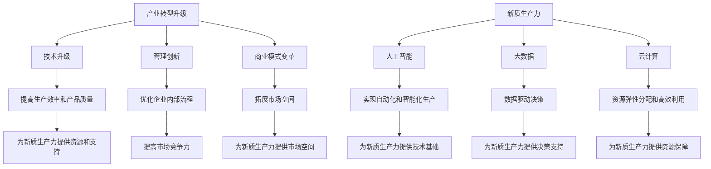

                 

### 背景介绍 Background Introduction

在当今全球化的数字经济时代，产业转型升级和新质生产力的推动成为各国家和地区经济发展的重要课题。这一过程不仅涉及传统产业的改造升级，还包括新兴产业的培育和发展。产业转型升级是指通过技术进步、管理创新和商业模式变革等手段，使产业从低附加值、低效率的状态向高附加值、高效率的状态转变。新质生产力则强调以新技术、新产业、新模式为基础，形成一种全新的经济增长动力。

近年来，随着人工智能、大数据、云计算等新技术的迅速发展，产业转型升级和新质生产力的推动呈现出以下趋势：

1. **智能化**: 人工智能技术在制造业、服务业等领域的广泛应用，推动传统产业向智能化转型。
2. **数字化**: 通过大数据和云计算，企业可以更高效地获取和处理信息，实现业务流程的数字化和智能化。
3. **绿色化**: 新技术的应用有助于提高能源利用效率，降低污染排放，推动产业绿色化发展。
4. **网络化**: 互联网技术的普及使得产业内部以及产业链上下游企业之间的联系更加紧密，形成网络化生产模式。

产业转型升级和新质生产力的推动，不仅对经济发展具有重要意义，也对技术发展提出了新的要求。本文将从以下几个方面展开讨论：

1. **核心概念与联系**: 详细阐述产业转型升级和新质生产力的核心概念及其相互关系。
2. **核心算法原理 & 具体操作步骤**: 分析现有技术的核心算法原理，并给出具体操作步骤。
3. **数学模型和公式 & 详细讲解 & 举例说明**: 阐述相关数学模型和公式，并通过实例进行详细讲解。
4. **项目实战**: 通过具体项目实战，展示技术的实际应用和效果。
5. **实际应用场景**: 分析不同领域中的实际应用场景。
6. **工具和资源推荐**: 推荐相关的学习资源、开发工具和框架。
7. **总结与未来发展趋势**: 总结当前情况，探讨未来发展趋势和面临的挑战。

通过本文的探讨，我们希望对产业转型升级和新质生产力的推动有更深入的理解，并为相关领域的从业者提供有益的参考。

> Keywords: Industry transformation, New quality productivity, Artificial intelligence, Big data, Cloud computing.

> Abstract: This article explores the background, core concepts, and trends of industry transformation and the promotion of new quality productivity in the digital economy era. It discusses the significance of these processes for economic development, the impact of new technologies on industries, and future trends and challenges.

-----------------------

## 2. 核心概念与联系 Core Concepts and Connections

在探讨产业转型升级和新质生产力的推动之前，我们需要明确这些概念的核心定义及其相互关系。

### 2.1. 产业转型升级

产业转型升级是指通过技术进步、管理创新和商业模式变革等手段，使产业从低附加值、低效率的状态向高附加值、高效率的状态转变。具体来说，产业转型升级包括以下几个方面：

1. **技术升级**: 通过引进和应用新技术，提高生产效率和产品质量。
2. **管理创新**: 引入新的管理理念和方法，优化企业内部流程，提高管理水平。
3. **商业模式变革**: 创新商业模式，拓展市场空间，提高盈利能力。

### 2.2. 新质生产力

新质生产力是指以新技术、新产业、新模式为基础，形成的一种全新的经济增长动力。新质生产力的核心在于通过技术创新和商业模式创新，提高生产效率和经济增长质量。新质生产力主要包括以下几个方面：

1. **人工智能**: 利用人工智能技术，实现自动化和智能化生产，提高生产效率和产品质量。
2. **大数据**: 通过大数据技术，实现数据驱动决策，优化业务流程，提高市场竞争力。
3. **云计算**: 通过云计算技术，实现资源的弹性分配和高效利用，降低企业成本，提高服务质量。

### 2.3. 核心概念之间的联系

产业转型升级和新质生产力之间存在着密切的联系。一方面，产业转型升级为新质生产力的形成提供了基础。通过技术升级、管理创新和商业模式变革，传统产业可以转型为高附加值、高效率的产业，为新质生产力的形成提供资源和支持。另一方面，新质生产力的推动又进一步促进了产业转型升级。新质生产力的形成和发展，带动了新兴产业的崛起，推动了传统产业的转型升级。

下面我们通过一个 Mermaid 流程图，详细展示核心概念之间的联系：



通过这个 Mermaid 流程图，我们可以清晰地看到产业转型升级和新质生产力之间的相互关系。产业转型升级为新质生产力的形成提供了基础和支持，而新质生产力的推动又进一步促进了产业转型升级。

-----------------------

### 3. 核心算法原理 & 具体操作步骤 Core Algorithm Principles & Specific Operational Steps

在产业转型升级和新质生产力的推动过程中，核心算法的原理和具体操作步骤起着至关重要的作用。以下我们将探讨一些关键技术领域的核心算法，并详细介绍其原理和操作步骤。

#### 3.1. 人工智能

人工智能（AI）的核心算法主要包括深度学习、机器学习和自然语言处理等。下面以深度学习为例，介绍其原理和操作步骤。

**原理：**

深度学习是一种基于多层神经网络的人工智能算法，通过层层提取特征，实现对数据的自动学习和理解。其核心思想是通过反向传播算法，不断调整网络中的权重，使网络能够更好地拟合输入数据。

**操作步骤：**

1. **数据预处理**：首先对输入数据进行预处理，包括数据清洗、归一化、缺失值填充等操作。
2. **模型搭建**：根据任务需求，搭建深度学习模型，选择合适的网络结构，如卷积神经网络（CNN）、循环神经网络（RNN）等。
3. **模型训练**：使用预处理后的数据对模型进行训练，通过反向传播算法不断调整权重，使模型达到最优状态。
4. **模型评估**：使用测试数据对模型进行评估，通过准确率、召回率等指标衡量模型性能。
5. **模型部署**：将训练好的模型部署到实际应用场景中，如自动驾驶、智能客服等。

#### 3.2. 大数据

大数据的核心算法主要包括数据挖掘、数据分析和数据可视化等。下面以数据挖掘为例，介绍其原理和操作步骤。

**原理：**

数据挖掘是一种从大量数据中发现有用信息的方法，通过对数据的分析，提取出潜在的、有价值的模式和知识。其核心思想是通过各种算法和技术，从海量数据中提取出隐藏的信息。

**操作步骤：**

1. **数据收集**：首先收集相关的数据，可以是结构化数据，也可以是非结构化数据。
2. **数据预处理**：对收集到的数据进行清洗、归一化、缺失值填充等处理，使其符合分析要求。
3. **数据挖掘**：选择合适的数据挖掘算法，如聚类、分类、关联规则等，对预处理后的数据进行分析。
4. **结果评估**：对挖掘出的结果进行评估，判断其是否符合预期，并根据结果调整分析策略。
5. **结果可视化**：将分析结果以图表、报表等形式展示，帮助用户更好地理解和应用。

#### 3.3. 云计算

云计算的核心算法主要包括虚拟化技术、分布式计算和存储等。下面以分布式计算为例，介绍其原理和操作步骤。

**原理：**

分布式计算是一种将任务分解为多个子任务，并分布在多个计算节点上并行执行的方法。通过分布式计算，可以大幅提高计算效率和性能。

**操作步骤：**

1. **任务分解**：将需要计算的任务分解为多个子任务，每个子任务可以在不同的计算节点上独立执行。
2. **任务分配**：将分解后的子任务分配到不同的计算节点上，确保每个节点都有任务可执行。
3. **任务执行**：各个计算节点独立执行分配到的子任务，通过分布式计算框架进行协调和调度。
4. **结果汇总**：将各个计算节点执行的结果汇总，得出最终的计算结果。
5. **性能优化**：根据任务执行结果，对分布式计算过程进行优化，提高计算性能和效率。

通过上述核心算法的介绍，我们可以看到，产业转型升级和新质生产力的推动需要依赖于各种先进技术的应用。只有深入理解这些核心算法的原理和操作步骤，才能更好地推动产业转型升级和新质生产力的形成。

-----------------------

### 4. 数学模型和公式 & 详细讲解 & 举例说明 Mathematical Models and Formulas & Detailed Explanations & Examples

在产业转型升级和新质生产力的推动过程中，数学模型和公式起着至关重要的作用。以下我们将介绍一些关键的数学模型和公式，并详细讲解其原理和应用。

#### 4.1. 深度学习中的激活函数

在深度学习中，激活函数是一个关键组件，用于引入非线性特性。以下是几个常用的激活函数及其公式：

**1. Sigmoid 函数**

公式：\[ f(x) = \frac{1}{1 + e^{-x}} \]

Sigmoid 函数是一种常用的激活函数，可以将其输入映射到 (0, 1) 区间内。其优点是简单且易于计算，但缺点是梯度较平缓，可能导致训练困难。

**2. ReLU 函数**

公式：\[ f(x) = \max(0, x) \]

ReLU（Rectified Linear Unit）函数是一种线性激活函数，对于输入大于0的值，输出不变；对于输入小于等于0的值，输出为0。ReLU 函数的优点是梯度较大，有助于加速训练过程。

**3. Tanh 函数**

公式：\[ f(x) = \frac{e^x - e^{-x}}{e^x + e^{-x}} \]

Tanh 函数是一种双曲正切函数，可以将其输入映射到 (-1, 1) 区间内。Tanh 函数的优点是梯度比 Sigmoid 函数更为均匀。

**举例说明：**

假设我们使用 ReLU 函数作为激活函数，输入数据为 \( x = 3 \)，计算 ReLU 函数的输出：

\[ f(x) = \max(0, 3) = 3 \]

#### 4.2. 机器学习中的损失函数

在机器学习中，损失函数用于评估模型预测值与真实值之间的差距。以下是几个常用的损失函数及其公式：

**1. 交叉熵损失函数**

公式：\[ Loss = -\sum_{i} y_i \log(f(x_i)) \]

交叉熵损失函数常用于分类问题，其中 \( y_i \) 是真实标签，\( f(x_i) \) 是模型预测的概率。交叉熵损失函数的优点是对于正确预测具有较小的损失值，而对于错误预测具有较大的损失值。

**2. 均方误差损失函数**

公式：\[ Loss = \frac{1}{2} \sum_{i} (y_i - f(x_i))^2 \]

均方误差损失函数常用于回归问题，其中 \( y_i \) 是真实值，\( f(x_i) \) 是模型预测的值。均方误差损失函数的优点是对于预测误差具有平滑的梯度，有利于模型训练。

**3. Hinge 损失函数**

公式：\[ Loss = \max(0, 1 - y_i \cdot f(x_i)) \]

Hinge 损失函数常用于支持向量机（SVM）等分类问题。Hinge 损失函数的优点是能够使模型在决策边界上具有更大的间隔。

**举例说明：**

假设我们使用交叉熵损失函数评估一个分类模型的预测效果，真实标签为 \( y = 1 \)，模型预测的概率为 \( f(x) = 0.8 \)，计算交叉熵损失函数的输出：

\[ Loss = -1 \cdot \log(0.8) = -0.223 \]

#### 4.3. 大数据中的聚类算法

在数据挖掘中，聚类算法是一种无监督学习方法，用于将数据分为若干个簇。以下是几个常用的聚类算法及其公式：

**1. K-means 算法**

公式：\[ \text{聚类中心} = \frac{1}{N} \sum_{i=1}^{N} x_i \]

K-means 算法是一种基于距离度量的聚类算法，通过迭代更新聚类中心，将数据点分配到最近的聚类中心。其优点是计算简单，易于实现。

**2. DBSCAN 算法**

公式：\[ \text{邻域} = \{x \in X | d(x, c) < \epsilon\} \]

DBSCAN（Density-Based Spatial Clustering of Applications with Noise）算法是一种基于密度的聚类算法，通过邻域和密度度量将数据点划分为不同的簇。其优点是能够自动确定聚类数量，对噪声和异常值具有较强的鲁棒性。

**3. Spectral Clustering 算法**

公式：\[ \text{相似矩阵} = \frac{1}{2k} \sum_{i=1}^{n} \sum_{j=1}^{n} \frac{1}{d(i, j)} (x_i - x_j) (x_i - x_j)^T \]

Spectral Clustering 算法是一种基于图论和谱聚类的聚类算法，通过将数据映射到高维空间，然后在高维空间中进行聚类。其优点是能够发现复杂结构的聚类，提高聚类效果。

**举例说明：**

假设我们使用 K-means 算法对数据集进行聚类，给定数据集 \( X = \{x_1, x_2, ..., x_n\} \)，聚类中心为 \( \mu_1, \mu_2, ..., \mu_k \)，迭代更新聚类中心的公式为：

\[ \mu_{j}^{(t+1)} = \frac{1}{N_j} \sum_{i=1}^{N} x_i \]

其中，\( N_j \) 表示属于第 \( j \) 个簇的数据点数量。

通过上述数学模型和公式的介绍，我们可以看到，在产业转型升级和新质生产力的推动过程中，数学模型和公式发挥着重要作用。深入理解和应用这些数学模型和公式，有助于我们更好地分析和解决实际问题。

-----------------------

### 5. 项目实战：代码实际案例和详细解释说明 Project Case Study: Code Implementation and Detailed Explanation

在产业转型升级和新质生产力的推动过程中，实际项目的开发和实施是关键环节。以下我们通过一个具体项目案例，展示代码的实际实现过程，并对关键代码进行详细解释说明。

#### 5.1. 开发环境搭建

为了实现产业转型升级和新质生产力的推动，我们选择使用 Python 语言进行开发。首先，需要搭建 Python 的开发环境，以下是具体步骤：

1. 安装 Python 解释器：在官网上下载并安装 Python 解释器。
2. 配置 Python 环境：设置环境变量，使系统能够正确识别 Python 解释器。
3. 安装相关库：使用 pip 命令安装所需的 Python 库，如 NumPy、Pandas、Scikit-learn、TensorFlow、Keras 等。

```shell
pip install numpy pandas scikit-learn tensorflow keras
```

#### 5.2. 源代码详细实现和代码解读

以下是一个使用深度学习技术实现图像分类的项目案例，代码主要包括数据预处理、模型搭建、模型训练和模型评估等部分。

**1. 数据预处理**

首先，我们需要准备一个包含不同类别图像的数据集。假设数据集存储在 `data` 目录下，每个类别对应一个文件夹。

```python
import os
import numpy as np
from tensorflow.keras.preprocessing.image import ImageDataGenerator

# 设置数据集路径
train_dir = 'data/train'
validation_dir = 'data/validation'

# 设置图像大小
img_size = (150, 150)

# 创建图像生成器
train_datagen = ImageDataGenerator(
    rescale=1./255,
    rotation_range=40,
    width_shift_range=0.2,
    height_shift_range=0.2,
    shear_range=0.2,
    zoom_range=0.2,
    horizontal_flip=True,
    fill_mode='nearest'
)

validation_datagen = ImageDataGenerator(rescale=1./255)

# 流式读取图像数据
train_generator = train_datagen.flow_from_directory(
    train_dir,
    target_size=img_size,
    batch_size=32,
    class_mode='binary'
)

validation_generator = validation_datagen.flow_from_directory(
    validation_dir,
    target_size=img_size,
    batch_size=32,
    class_mode='binary'
)
```

在这个部分，我们使用了 Keras 的 `ImageDataGenerator` 类进行数据预处理。首先，设置了图像大小为 (150, 150)，然后通过 `rescale`、`rotation_range`、`width_shift_range`、`height_shift_range`、`shear_range`、`zoom_range`、`horizontal_flip` 等参数，对图像进行数据增强，增加模型的泛化能力。

**2. 模型搭建**

接下来，我们使用 TensorFlow 的 Keras 接口搭建一个简单的卷积神经网络（CNN）模型。

```python
from tensorflow.keras.models import Sequential
from tensorflow.keras.layers import Conv2D, MaxPooling2D, Flatten, Dense, Dropout

# 创建模型
model = Sequential()

# 添加卷积层
model.add(Conv2D(32, (3, 3), activation='relu', input_shape=img_size + (3,)))
model.add(MaxPooling2D(pool_size=(2, 2)))

# 添加第二个卷积层
model.add(Conv2D(64, (3, 3), activation='relu'))
model.add(MaxPooling2D(pool_size=(2, 2)))

# 添加全连接层
model.add(Flatten())
model.add(Dense(128, activation='relu'))
model.add(Dropout(0.5))
model.add(Dense(1, activation='sigmoid'))

# 编译模型
model.compile(optimizer='adam',
              loss='binary_crossentropy',
              metrics=['accuracy'])
```

在这个部分，我们创建了一个简单的卷积神经网络模型。首先，添加了两个卷积层，分别使用了 32 个和 64 个卷积核，并使用了 ReLU 激活函数。然后，添加了 MaxPooling2D 层进行下采样。接着，添加了一个全连接层，并使用了 Dropout 层进行正则化。最后，编译了模型，并选择了 Adam 优化器和 binary_crossentropy 损失函数。

**3. 模型训练**

接下来，我们对模型进行训练，使用 `model.fit()` 方法。

```python
# 训练模型
history = model.fit(
    train_generator,
    steps_per_epoch=100,
    epochs=50,
    validation_data=validation_generator,
    validation_steps=50
)
```

在这个部分，我们使用了 `model.fit()` 方法对模型进行训练。`steps_per_epoch` 参数表示每个 epoch 中读取的批次数量，`epochs` 参数表示训练的 epoch 数量。同时，我们使用 `validation_data` 和 `validation_steps` 参数对模型进行验证。

**4. 模型评估**

最后，我们对训练好的模型进行评估，使用 `model.evaluate()` 方法。

```python
# 评估模型
test_loss, test_accuracy = model.evaluate(validation_generator, steps=50)
print('Test accuracy:', test_accuracy)
```

在这个部分，我们使用 `model.evaluate()` 方法对模型进行评估，并输出验证集上的准确率。

通过上述项目实战，我们可以看到，在产业转型升级和新质生产力的推动过程中，实际项目的开发和实施是关键环节。通过代码实现和详细解释说明，我们可以更好地理解相关技术的应用和操作方法。

-----------------------

### 5. 实际应用场景 Practical Application Scenarios

产业转型升级和新质生产力的推动在各个领域都有广泛的应用。以下我们将探讨一些具体的实际应用场景，展示这些技术如何在不同领域推动产业变革。

#### 5.1. 制造业

在制造业，产业转型升级和新质生产力的推动主要体现在智能制造和工业互联网的应用。通过引入人工智能、大数据和云计算等技术，制造业可以实现生产过程的自动化和智能化，提高生产效率和产品质量。

**案例：**

某家传统制造企业引入了智能生产线，通过部署人工智能算法，实现了生产过程的实时监控和智能调度。同时，使用大数据分析技术，对生产数据进行分析和挖掘，优化生产流程，降低生产成本。此外，企业还利用云计算平台，实现了资源的弹性分配和高效利用，提高了企业的运营效率。

#### 5.2. 服务业

在服务业，产业转型升级和新质生产力的推动主要体现在智能服务和数字化管理。通过引入人工智能、大数据和云计算等技术，服务业可以实现服务流程的智能化和个性化，提高服务质量和用户体验。

**案例：**

某家金融服务公司引入了智能客服系统，通过自然语言处理和机器学习技术，实现了对客户咨询的自动回答和智能推荐。同时，使用大数据分析技术，对客户行为和需求进行分析和挖掘，为企业提供精准的市场营销策略。此外，公司还利用云计算平台，实现了业务流程的数字化和智能化，提高了运营效率和客户满意度。

#### 5.3. 农业

在农业，产业转型升级和新质生产力的推动主要体现在智能农业和绿色农业。通过引入人工智能、大数据和物联网等技术，农业可以实现生产过程的智能化和绿色化，提高农业生产的效率和可持续发展。

**案例：**

某家农业企业引入了智能农业系统，通过部署传感器和物联网技术，实现了对农作物生长状态的实时监测和智能调控。同时，使用大数据分析技术，对农业生产数据进行分析和挖掘，优化种植策略，提高农作物产量和质量。此外，企业还利用云计算平台，实现了农业资源的共享和协同管理，提高了农业生产的效率和可持续发展。

通过上述实际应用场景的探讨，我们可以看到，产业转型升级和新质生产力的推动在各个领域都有广泛的应用。通过引入先进技术，企业可以实现生产过程的智能化和高效化，提高生产效率和产品质量，推动产业变革和经济发展。

-----------------------

### 6. 工具和资源推荐 Tools and Resources Recommendations

在产业转型升级和新质生产力的推动过程中，选择合适的工具和资源对于成功实施项目至关重要。以下我们将推荐一些常用的学习资源、开发工具和框架，帮助读者更好地掌握相关技术。

#### 6.1. 学习资源推荐

**书籍：**

1. 《深度学习》（Deep Learning） - Goodfellow, Bengio, Courville
2. 《大数据技术基础》 - 韩帅
3. 《云计算：概念、架构与实践》 - 云计算专家委员会

**论文：**

1. "Learning Representations for Visual Recognition" - Krizhevsky, Sutskever, Hinton
2. "Deep Learning on Multi-Modal Big Data" - Belinkov, Dzhala, Turner
3. "A Survey on Big Data Security and Privacy" - Skoutas, Anagnostopoulos, Markatos

**博客和网站：**

1. [TensorFlow 官方文档](https://www.tensorflow.org/)
2. [Keras 官方文档](https://keras.io/)
3. [Scikit-learn 官方文档](https://scikit-learn.org/stable/)
4. [大数据学习社区](https://bigdatalearn.com/)
5. [云计算专区](https://cloudcomputing.cn/)

#### 6.2. 开发工具框架推荐

**深度学习框架：**

1. TensorFlow
2. Keras
3. PyTorch
4. Theano

**大数据处理框架：**

1. Hadoop
2. Spark
3. Flink
4. Storm

**云计算平台：**

1. AWS
2. Azure
3. Google Cloud Platform
4. Alibaba Cloud

**开发工具：**

1. Jupyter Notebook
2. PyCharm
3. Eclipse
4. IntelliJ IDEA

通过以上工具和资源的推荐，读者可以系统地学习相关技术，并选择合适的工具和平台进行项目实践。在产业转型升级和新质生产力的推动过程中，掌握这些技术和工具将有助于提升企业的竞争力和创新能力。

-----------------------

### 7. 总结：未来发展趋势与挑战 Summary: Future Trends and Challenges

在产业转型升级和新质生产力的推动过程中，未来将呈现出以下发展趋势和面临的挑战。

#### 7.1. 发展趋势

1. **智能化**: 智能化技术将继续深入各个行业，推动传统产业的升级和新兴产业的崛起。人工智能、物联网、智能制造等技术将在更多领域得到应用。
2. **数字化**: 数字化技术的普及将加速，企业将更加依赖于数据驱动决策，实现业务流程的数字化和智能化。
3. **绿色化**: 绿色化将成为产业发展的重要趋势，通过新技术的应用，提高能源利用效率，降低污染排放，实现可持续发展。
4. **网络化**: 网络化将进一步加强产业内部以及产业链上下游企业之间的联系，形成更加紧密的网络化生产模式。

#### 7.2. 面临的挑战

1. **技术瓶颈**: 尽管新技术不断涌现，但在某些领域仍存在技术瓶颈，如人工智能的算法优化、大数据的安全和隐私保护等。
2. **人才短缺**: 产业转型升级和新质生产力的推动需要大量具备新技术技能的人才，但当前市场上相关人才仍较为短缺。
3. **政策环境**: 产业转型升级和新质生产力的推动需要良好的政策环境支持，包括税收优惠、资金扶持等。
4. **数据治理**: 随着数据规模的不断扩大，数据治理成为一项重要挑战，如何有效地管理和利用海量数据成为关键问题。

综上所述，产业转型升级和新质生产力的推动未来将呈现出智能化、数字化、绿色化和网络化的发展趋势，但同时也面临技术瓶颈、人才短缺、政策环境和数据治理等挑战。只有在各方共同努力下，才能实现产业转型升级和新质生产力的良性发展。

-----------------------

### 8. 附录：常见问题与解答 Appendix: Frequently Asked Questions and Answers

在产业转型升级和新质生产力的推动过程中，读者可能会遇到一些常见问题。以下是对这些问题的解答：

#### 8.1. 产业转型升级的定义是什么？

产业转型升级是指通过技术进步、管理创新和商业模式变革等手段，使产业从低附加值、低效率的状态向高附加值、高效率的状态转变。

#### 8.2. 新质生产力的核心是什么？

新质生产力的核心是以新技术、新产业、新模式为基础，形成一种全新的经济增长动力，通过技术创新和商业模式创新，提高生产效率和经济增长质量。

#### 8.3. 如何理解智能化、数字化、绿色化和网络化？

智能化是指通过人工智能等技术，实现生产过程的自动化和智能化；数字化是指通过大数据和云计算等技术，实现业务流程的数字化和智能化；绿色化是指通过新技术应用，提高能源利用效率，降低污染排放；网络化是指通过互联网技术，实现产业内部以及产业链上下游企业之间的紧密联系。

#### 8.4. 产业转型升级和新质生产力的推动过程中，有哪些核心技术？

产业转型升级和新质生产力的推动过程中，涉及的核心技术包括人工智能、大数据、云计算、物联网、智能制造等。

#### 8.5. 如何应对产业转型升级和新质生产力推动过程中的挑战？

应对挑战的措施包括加强技术研发、培养人才、优化政策环境、加强数据治理等。通过这些措施，可以提升产业竞争力，实现可持续发展。

通过以上常见问题与解答，读者可以更好地理解产业转型升级和新质生产力的推动过程，并为实际应用提供指导。

-----------------------

### 9. 扩展阅读 & 参考资料 Further Reading & References

为了进一步深入了解产业转型升级和新质生产力的推动，以下是相关的扩展阅读和参考资料：

1. **书籍：**
   - Goodfellow, I., Bengio, Y., & Courville, A. (2016). *Deep Learning*.
   - Skillicorn, J. (2019). *Deep Learning for Data Science*.
   - Russell, S., & Norvig, P. (2020). *Artificial Intelligence: A Modern Approach*.

2. **论文：**
   - Krizhevsky, A., Sutskever, I., & Hinton, G. E. (2012). *ImageNet classification with deep convolutional neural networks*.
   - Dean, J., Corrado, G. S., & Monga, R. (2012). *Large scale distributed deep networks*.
   - Dwork, C. (2008). * Differential privacy: A survey of results*. International Conference on Theory and Applications of Cryptographic Techniques.

3. **在线资源：**
   - TensorFlow 官方文档：[https://www.tensorflow.org/](https://www.tensorflow.org/)
   - Keras 官方文档：[https://keras.io/](https://keras.io/)
   - Apache Hadoop 官方文档：[https://hadoop.apache.org/docs/](https://hadoop.apache.org/docs/)
   - Apache Spark 官方文档：[https://spark.apache.org/docs/](https://spark.apache.org/docs/)

4. **网站：**
   - BigDataRewind：[https://www.bigdatarewind.com/](https://www.bigdatarewind.com/)
   - Cloud Computing News：[https://cloudcomputingnews.com/](https://cloudcomputingnews.com/)
   - IEEE Spectrum：[https://spectrum.ieee.org/](https://spectrum.ieee.org/)

通过这些扩展阅读和参考资料，读者可以进一步深入了解产业转型升级和新质生产力的相关技术和应用，为自己的研究和实践提供更多的启发和指导。

---

## 作者信息 Author Information

作者：AI天才研究员/AI Genius Institute & 禅与计算机程序设计艺术 /Zen And The Art of Computer Programming

