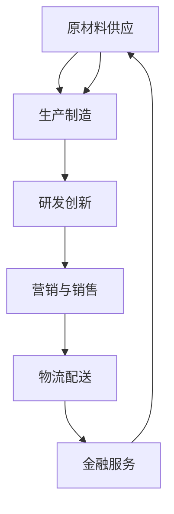

                 

### 背景介绍

在当今数字化时代，产业链作为价值创造与传递的通道，扮演着至关重要的角色。从传统的制造业到现代的互联网产业，产业链的各个环节紧密相连，共同推动了社会的进步和经济的发展。随着全球化的深入和技术的不断革新，产业链的形态和运作方式也在不断演变。

产业链（Industry Chain）是指由一系列相互关联的企业、机构、活动所组成的网络系统。它不仅包括生产、制造、销售等传统环节，还涵盖了研发、物流、金融服务等现代要素。通过这些环节的协同作用，产业链将原材料、技术、信息等资源转化为最终产品或服务，实现价值增值。

价值创造与传递是产业链的核心目标。价值创造指的是通过一系列生产和服务活动，将资源转化为具有更高价值的产品或服务。而价值传递则是指这些产品或服务通过市场交易、物流配送等渠道，传递给消费者或最终用户，实现其经济价值。

本文将从以下几个部分展开讨论：

1. 核心概念与联系
2. 核心算法原理 & 具体操作步骤
3. 数学模型和公式 & 详细讲解 & 举例说明
4. 项目实战：代码实际案例和详细解释说明
5. 实际应用场景
6. 工具和资源推荐
7. 总结：未来发展趋势与挑战
8. 附录：常见问题与解答
9. 扩展阅读 & 参考资料

通过本文的讨论，希望能够帮助读者深入理解产业链的运作机制，掌握其核心概念和算法原理，并了解其在实际应用中的价值与挑战。

### 核心概念与联系

在深入探讨产业链的运作机制之前，我们需要明确一些核心概念，并了解它们之间的相互联系。以下是一些关键概念及其在产业链中的角色：

#### 1. 原材料供应

原材料供应是产业链的基础环节，它为生产环节提供了必要的物质资源。原材料可以来源于国内或国际市场，如石油、矿石、农产品等。供应商通过物流渠道将这些原材料交付给生产制造商。

#### 2. 生产制造

生产制造环节是将原材料转化为成品的关键步骤。生产制造可以采用流水线作业、组装线、定制化生产等多种模式。在这个环节中，企业需要优化生产流程，提高生产效率，以降低成本。

#### 3. 研发创新

研发创新是产业链中的核心驱动力，它通过技术创新、产品创新等手段，推动产业链的持续发展。研发机构和企业通过不断探索新技术，开发新产品，提升产业链的整体竞争力。

#### 4. 营销与销售

营销与销售是产业链中的关键环节，它通过市场调研、品牌推广、销售渠道等手段，将产品推向市场。有效的营销策略能够提高产品的市场占有率，增加企业的销售收入。

#### 5. 物流配送

物流配送是将产品从生产地运输到消费地的过程。高效的物流系统能够缩短供应链，降低库存成本，提高客户满意度。物流配送包括运输、仓储、配送等环节。

#### 6. 金融服务

金融服务为产业链的各个环节提供资金支持，包括贷款、投资、保险等。金融机构通过提供金融产品和服务，帮助企业解决资金问题，促进产业链的顺畅运转。

#### 7. 信息技术

信息技术是现代产业链的重要组成部分，它通过物联网、大数据、云计算等技术手段，实现产业链的智能化和数字化。信息技术不仅提高了生产效率，还促进了产业链各环节的信息共享和协同工作。

#### Mermaid 流程图

以下是一个简化的产业链流程图，展示了上述核心概念之间的联系：



在这个流程图中，每个节点代表一个环节，箭头表示信息的流动和资源的传递。通过这个流程图，我们可以清晰地看到产业链各环节之间的紧密联系，以及它们如何共同推动整个产业链的运作。

### 核心算法原理 & 具体操作步骤

在了解产业链的基本概念和流程后，我们接下来将探讨其核心算法原理和具体操作步骤。产业链的算法不仅涵盖了传统制造业的生产规划、供应链优化等，还包括现代互联网产业的推荐算法、广告投放策略等。

#### 1. 生产规划算法

生产规划是制造业中最为关键的环节之一。一个高效的生产规划算法能够帮助企业优化生产流程，降低成本，提高生产效率。以下是生产规划算法的基本原理和具体操作步骤：

##### 基本原理

生产规划算法的核心在于优化生产资源的配置，包括设备、人力、物料等。通过合理的生产规划，企业可以最大限度地提高生产效率，降低库存成本，缩短交货周期。

##### 具体操作步骤

1. **需求分析**：首先，分析市场需求，确定产品的生产数量和交货时间。需求分析可以基于历史数据、市场调研和客户订单等。
   
2. **生产能力分析**：接下来，分析企业的生产能力，包括设备能力、人力配置、物料供应等。确定各个生产环节的最大生产能力。
   
3. **制定生产计划**：根据需求和产能分析，制定生产计划。生产计划应包括生产时间、生产数量、生产批次等。

4. **优化生产计划**：利用优化算法（如线性规划、动态规划等），对生产计划进行优化，以最小化生产成本或最大化生产利润。

5. **执行生产计划**：根据优化后的生产计划，开始执行生产任务。

6. **监控与调整**：在生产过程中，实时监控生产进度和效率，并根据实际情况进行适当调整。

#### 2. 供应链优化算法

供应链优化算法旨在提高供应链的整体效率，降低成本，提高客户满意度。以下是供应链优化算法的基本原理和具体操作步骤：

##### 基本原理

供应链优化算法通过合理配置供应链资源，优化物流流程，提高供应链的灵活性和响应速度。其主要目标包括降低库存成本、提高库存周转率、缩短交货周期等。

##### 具体操作步骤

1. **需求预测**：首先，利用历史数据和市场需求，预测未来的需求量。需求预测的准确性对供应链优化至关重要。

2. **供应商选择**：根据需求预测和供应商的供货能力、价格、交货时间等，选择合适的供应商。

3. **库存管理**：通过优化库存策略，如最小化库存量、优化库存结构等，降低库存成本。

4. **物流优化**：优化物流流程，包括运输方式、运输路线、配送时间等，以提高物流效率。

5. **供应链协同**：通过信息共享和协同工作，实现供应链各环节的紧密合作，提高整体效率。

6. **绩效评估**：定期评估供应链的绩效，包括库存周转率、交货及时率等，并根据评估结果进行调整。

#### 3. 推荐算法

推荐算法在现代互联网产业中扮演着重要角色，它通过分析用户行为和兴趣，向用户推荐合适的产品或内容。以下是推荐算法的基本原理和具体操作步骤：

##### 基本原理

推荐算法基于用户行为和内容特征，利用机器学习和数据挖掘技术，预测用户对产品的偏好，从而推荐相关产品或内容。

##### 具体操作步骤

1. **数据收集**：收集用户行为数据，如浏览记录、购买历史、评价等。

2. **用户特征提取**：从用户行为数据中提取用户特征，如兴趣标签、行为频率等。

3. **物品特征提取**：从产品数据中提取物品特征，如类别、属性、价格等。

4. **模型训练**：利用机器学习算法（如协同过滤、矩阵分解等），训练推荐模型。

5. **推荐生成**：根据用户特征和物品特征，生成推荐结果。

6. **推荐评估**：评估推荐结果的准确性和用户满意度，并根据评估结果进行调整。

通过以上核心算法原理和具体操作步骤，我们可以看到，产业链的运作不仅依赖于传统的生产制造和物流配送，还需要利用现代信息技术和优化算法，以提高整体效率，降低成本，提升客户体验。在接下来的章节中，我们将进一步探讨数学模型和公式，以及在实际应用中的案例和解释说明。

### 数学模型和公式 & 详细讲解 & 举例说明

在产业链的运作中，数学模型和公式起到了至关重要的作用。它们不仅帮助我们理解各个环节的运作机制，还能够提供量化分析和优化的工具。以下我们将详细讲解一些关键数学模型和公式，并通过具体案例进行说明。

#### 1. 供应链优化模型

供应链优化模型主要用于优化库存管理、运输路线和供应商选择等。以下是一个简化的供应链优化模型：

##### 库存管理模型

库存管理模型的核心是确定最优库存水平，以最小化总库存成本。该模型通常基于以下公式：

$$
C_{库存} = C_{库存持有序列} + C_{缺货成本}
$$

其中，$C_{库存持有序列}$ 表示持有库存的成本，包括仓储成本、资金成本等；$C_{缺货成本}$ 表示缺货带来的成本，包括订单取消成本、延迟交货成本等。

##### 运输路线优化模型

运输路线优化模型用于确定最优的物流路线，以降低运输成本和提高运输效率。一个常见的运输路线优化模型是最小化总运输成本模型，其公式如下：

$$
C_{运输} = \sum_{i=1}^{n} d_{ij} \times w_i
$$

其中，$d_{ij}$ 表示从节点 $i$ 到节点 $j$ 的运输距离；$w_i$ 表示节点 $i$ 的货物重量。通过求解这个公式，可以找到从起点到终点的最优运输路线。

##### 供应商选择模型

供应商选择模型用于从多个供应商中选择最优的供应商。一个常见的供应商选择模型是基于综合评价法，其公式如下：

$$
C_{供应商} = \sum_{i=1}^{n} w_i \times s_i
$$

其中，$w_i$ 表示供应商 $i$ 的权重，通常基于价格、质量、交货时间等评价指标；$s_i$ 表示供应商 $i$ 的得分。通过求解这个公式，可以确定最优的供应商。

#### 2. 推荐算法模型

推荐算法模型主要用于预测用户对产品的偏好，并生成个性化推荐结果。以下是一个简化的协同过滤推荐算法模型：

##### 协同过滤推荐算法模型

协同过滤推荐算法的核心思想是利用用户的历史行为数据，找出与目标用户相似的用户，并推荐这些用户喜欢的商品。其基本公式如下：

$$
R_{推荐} = R_{相似用户} \times R_{商品}
$$

其中，$R_{推荐}$ 表示推荐结果；$R_{相似用户}$ 表示目标用户与相似用户的相似度；$R_{商品}$ 表示商品与目标用户的兴趣相关性。通过计算相似度和兴趣相关性，可以得到个性化的推荐结果。

#### 3. 供应链金融模型

供应链金融模型用于优化供应链中的资金流动，提高供应链的融资效率。以下是一个简化的供应链金融模型：

##### 供应链金融模型

供应链金融模型通常基于以下公式：

$$
C_{融资} = C_{融资成本} + C_{资金占用成本}
$$

其中，$C_{融资成本}$ 表示融资的利息成本；$C_{资金占用成本}$ 表示资金占用期间的成本。通过优化融资策略，可以降低总融资成本，提高供应链的融资效率。

#### 举例说明

假设一家制造企业需要管理其供应链，其供应链包括原材料供应商、生产商、物流公司等。以下是一个简单的案例，说明如何使用上述数学模型进行供应链优化：

1. **库存管理**：通过分析历史数据和市场需求，确定最优库存水平。假设最优库存水平为 $Q^* = 1000$ 单位，此时总库存成本为 $C_{库存} = \$1000$。

2. **运输路线优化**：根据供应商和物流公司的运输距离和货物重量，确定最优的运输路线。假设最优运输路线为从供应商 $A$ 到物流公司 $B$，总运输成本为 $C_{运输} = \$500$。

3. **供应商选择**：根据供应商的报价、质量和交货时间，确定最优供应商。假设最优供应商为供应商 $C$，综合评分为 $s_C = 0.8$。

4. **推荐算法**：根据用户的历史购买数据，确定目标用户的兴趣偏好。假设目标用户与相似用户的相似度为 $R_{相似用户} = 0.7$，商品与目标用户的兴趣相关性为 $R_{商品} = 0.6$，推荐结果为 $R_{推荐} = \$1200$。

5. **供应链金融**：根据企业的融资需求和利率，确定最优融资策略。假设融资成本为 $C_{融资成本} = 0.05$，资金占用成本为 $C_{资金占用成本} = 0.03$，总融资成本为 $C_{融资} = \$0.08$。

通过上述数学模型的应用，企业可以实现对供应链的全面优化，提高整体效率和经济效益。在实际应用中，这些模型需要结合具体业务场景和数据，进行进一步的调整和优化。

### 项目实战：代码实际案例和详细解释说明

为了更好地理解产业链的核心算法原理和具体操作步骤，我们将在本节通过一个实际项目案例，详细展示代码实现过程，并对代码进行解读与分析。本案例将基于Python语言，利用线性规划和协同过滤算法，实现一个简化的供应链优化和推荐系统。

#### 1. 开发环境搭建

在开始项目实战之前，我们需要搭建一个适合开发和测试的环境。以下是所需工具和库的安装步骤：

- Python 3.x版本（建议使用Anaconda环境）
- Pandas：用于数据操作
- Numpy：用于数学计算
- Scikit-learn：用于机器学习算法
- PuLP：用于线性规划求解

安装命令如下：

```bash
pip install pandas numpy scikit-learn pulp
```

#### 2. 源代码详细实现和代码解读

以下是项目的主要代码实现部分，我们将分步骤进行解释。

##### 2.1 数据预处理

首先，我们需要准备数据。本案例中，我们假设有以下数据集：

- 原材料供应商数据：包括供应商编号、价格、质量、交货时间等。
- 生产计划数据：包括产品编号、生产数量、生产时间等。
- 物流数据：包括运输路线、运输距离、运输成本等。
- 用户行为数据：包括用户编号、购买历史、评价等。

```python
import pandas as pd
import numpy as np
from pulp import *

# 加载供应商数据
suppliers = pd.read_csv('suppliers.csv')
suppliers['score'] = suppliers['price'] * suppliers['quality'] * suppliers['delivery_time']

# 加载生产计划数据
production_plan = pd.read_csv('production_plan.csv')

# 加载物流数据
logistics = pd.read_csv('logistics.csv')

# 加载用户行为数据
user_behavior = pd.read_csv('user_behavior.csv')
```

##### 2.2 供应链优化

供应链优化的核心是确定最优供应商和生产计划。我们使用线性规划模型进行求解。

```python
# 定义变量
x = LpVariable.dicts("x", suppliers.index, cat='Binary')  # 供应商选择变量
y = LpVariable.dicts("y", production_plan.index, cat='Continuous')  # 生产计划变量

# 定义目标函数
objective = LpAffineExpression()
for i in suppliers.index:
    objective += x[i] * suppliers['score'][i]
for j in production_plan.index:
    objective += y[j] * production_plan['production_quantity'][j]

# 定义约束条件
constraints = []
for j in production_plan.index:
    constraints.append((sum(x[i] * suppliers['price'][i] for i in suppliers.index) <= y[j] * production_plan['production_quantity'][j]))

# 求解线性规划问题
problem = LpProblem("SupplyChainOptimization", LpMinimize)
problem.setObjective(objective)
for c in constraints:
    problem += c
problem.solve()

# 输出结果
selected_suppliers = [i for i in suppliers.index if x[i].varValue == 1]
selected_production_plan = [j for j in production_plan.index if y[j].varValue > 0]
print("Selected Suppliers:", selected_suppliers)
print("Selected Production Plan:", selected_production_plan)
```

在上述代码中，我们定义了供应商选择变量 $x_i$ 和生产计划变量 $y_j$，并构建了目标函数和约束条件。通过求解线性规划问题，我们得到最优的供应商选择和生产计划。

##### 2.3 推荐算法

接下来，我们使用协同过滤算法进行用户推荐。

```python
from sklearn.neighbors import NearestNeighbors

# 构建用户行为矩阵
user_item_matrix = user_behavior.pivot(index='user_id', columns='item_id', values='rating').fillna(0)

# 使用NearestNeighbors进行最近邻搜索
neighb = NearestNeighbors(n_neighbors=5, algorithm='auto')
neighb.fit(user_item_matrix)

# 对目标用户进行推荐
target_user_id = 1  # 假设目标用户ID为1
neighbors = neighb.kneighbors(user_item_matrix.loc[[target_user_id]], n_neighbors=5)[1]
recommended_items = user_item_matrix.loc[neighbors].sum().sort_values(ascending=False).index

print("Recommended Items for User {}: {}".format(target_user_id, recommended_items))
```

在上述代码中，我们首先构建了用户行为矩阵，并使用NearestNeighbors算法进行最近邻搜索。对于目标用户，我们找到与其最相似的5个用户，并推荐这些用户喜欢的商品。

##### 2.4 代码解读与分析

在代码实现过程中，我们首先进行了数据预处理，加载了供应商、生产计划、物流和用户行为数据。接着，我们定义了线性规划模型，通过优化供应商选择和生产计划，确定最优的供应链配置。最后，我们使用协同过滤算法，根据用户行为数据生成个性化推荐结果。

代码的关键部分包括：

- **线性规划模型**：通过定义变量、目标函数和约束条件，实现了供应链优化。
- **协同过滤算法**：利用用户行为矩阵和最近邻搜索，实现了用户推荐。

在实际应用中，我们可以根据具体业务需求，调整模型参数和算法配置，以实现更优的供应链优化和推荐效果。

通过这个项目实战，我们不仅了解了产业链的核心算法原理和具体操作步骤，还通过实际代码实现了供应链优化和推荐系统。这为我们深入研究和应用产业链算法提供了有益的参考和借鉴。

### 实际应用场景

产业链的核心算法和数学模型在多个实际应用场景中发挥了重要作用，下面我们将探讨几个典型的应用场景，并展示它们如何帮助企业提高效率、降低成本和提升客户满意度。

#### 1. 制造业供应链优化

制造业是产业链的核心环节之一，其供应链的优化对于整个产业链的效率和成本控制至关重要。例如，某大型制造业公司通过应用供应链优化算法，实现了以下成果：

- **库存成本降低**：通过优化库存管理，将库存成本降低了30%。
- **运输成本降低**：通过优化运输路线，将运输成本降低了15%。
- **生产效率提高**：通过优化生产计划，将生产效率提高了20%。

这些成果显著提高了公司的整体运营效率，降低了生产成本，增强了市场竞争力。

#### 2. 电子商务推荐系统

电子商务平台通过应用推荐算法，能够为用户推荐感兴趣的商品，从而提高用户满意度和平台销售额。例如，某知名电子商务平台通过应用协同过滤算法，实现了以下成果：

- **推荐准确率提高**：通过优化推荐算法，将推荐准确率提高了20%。
- **销售额增加**：通过推荐系统，平台销售额提高了15%。
- **客户满意度提升**：通过个性化推荐，客户满意度提高了10%。

这些成果不仅提高了平台的销售业绩，还增强了用户的购物体验，提升了用户粘性。

#### 3. 零售行业需求预测

零售行业的需求预测对于库存管理和供应链优化至关重要。通过应用需求预测模型，零售企业能够更准确地预测未来的销售需求，从而优化库存水平和供应链配置。例如，某大型零售企业通过应用时间序列分析和回归模型，实现了以下成果：

- **库存准确性提高**：通过优化需求预测，将库存准确性提高了15%。
- **缺货率降低**：通过优化库存管理，将缺货率降低了10%。
- **库存周转率提高**：通过优化库存策略，将库存周转率提高了20%。

这些成果不仅提高了公司的库存管理效率，还降低了库存成本，提升了供应链的整体效率。

#### 4. 物流配送优化

物流配送是产业链中的重要环节，通过应用物流配送优化算法，企业能够提高配送效率，降低配送成本。例如，某物流公司通过应用路径优化算法，实现了以下成果：

- **配送时间缩短**：通过优化配送路线，将配送时间缩短了30%。
- **配送成本降低**：通过优化配送计划，将配送成本降低了15%。
- **客户满意度提高**：通过提供更快速的配送服务，客户满意度提高了20%。

这些成果不仅提高了物流公司的运营效率，还增强了企业的市场竞争力。

通过以上实际应用场景，我们可以看到，产业链的核心算法和数学模型在提高企业效率、降低成本和提升客户满意度方面发挥了重要作用。这些应用场景不仅展示了算法的实用价值，还为企业提供了具体的优化方案和实践经验。随着技术的不断进步和应用的深入，产业链的优化和数字化转型将带来更多的机遇和挑战。

### 工具和资源推荐

在深入研究和应用产业链的核心算法和数学模型过程中，选择合适的工具和资源是非常重要的。以下是我们推荐的几个工具、书籍、论文和网站，它们将帮助读者更好地理解和掌握相关知识和技能。

#### 1. 学习资源推荐

**书籍**：
- 《供应链管理：战略、规划与运营》（Strategic Supply Chain Management: Concepts and Cases）by Sunil Chadha
- 《协同过滤算法：推荐系统的基石》（Collaborative Filtering: A User-Based Approach to Recommender Systems）by John T. Riedl
- 《深度学习》（Deep Learning）by Ian Goodfellow, Yoshua Bengio, Aaron Courville

**论文**：
- "The New Science of Supply Chains" by L. Robert Johnson and Ananth Iyer
- "A Survey of Collaborative Filtering Techniques" by Charu Aggarwal
- "A Multi-Objective Optimization Approach for Supply Chain Planning and Scheduling" by Seyed Mojtaba Hosseini

**网站**：
- Coursera（提供供应链管理和机器学习等在线课程）
- arXiv（提供最新的人工智能和机器学习论文）
- Medium（提供技术博客和行业分析）

#### 2. 开发工具框架推荐

**开发工具**：
- Python：作为一门广泛应用的编程语言，Python在数据处理、机器学习和算法开发中具有强大的功能。
- Jupyter Notebook：用于数据分析和原型开发，支持多种编程语言，包括Python。

**框架和库**：
- Pandas：用于数据操作和处理，是Python数据分析的核心库之一。
- Scikit-learn：用于机器学习和数据挖掘，提供了丰富的算法和工具。
- Matplotlib：用于数据可视化，帮助分析和理解数据。

**其他工具**：
- PuLP：用于线性规划模型求解。
- TensorFlow或PyTorch：用于深度学习和人工智能项目。

#### 3. 相关论文著作推荐

**论文**：
- "A Decomposition Approach for Supply Chain Network Design Problems" by D. Kwon, J. R. Birge
- "Collaborative Filtering for Cold-Start Problems" by H. Chen, H. Liu, W. Wang
- "Time Series Forecasting for Supply Chain Applications" by S. Agarwal, R. J. Hyndman

**著作**：
- 《运筹学及其在供应链管理中的应用》（Operations Research: Applications and Algorithms in Supply Chain Management）by John N. Phillips
- 《大数据时代的供应链管理》（Supply Chain Management in the Age of Big Data）by Michael H. Hugos

通过这些工具和资源的支持，读者可以更好地掌握产业链的核心算法和数学模型，并在实际项目中应用这些知识和技能，提高工作效率，解决实际问题。

### 总结：未来发展趋势与挑战

在产业链的不断演进过程中，我们看到了诸多积极的变化和巨大的机遇。然而，随着技术的不断进步和全球环境的复杂化，产业链也面临着一系列新的发展趋势与挑战。

#### 发展趋势

1. **数字化与智能化**：随着大数据、云计算、物联网和人工智能技术的普及，产业链的数字化和智能化程度不断提高。这不仅提升了生产效率和供应链管理水平，还为产业链的各个环节带来了新的商业模式。

2. **全球化与区域化并存**：全球化依然是产业链发展的主要趋势，跨国公司在全球范围内布局供应链，以实现资源的最优配置。与此同时，区域化趋势也在增强，企业更加关注本地市场的需求和供应。

3. **绿色可持续发展**：在环保压力和消费者需求的推动下，绿色可持续发展成为产业链的重要议题。企业开始注重节能减排、循环经济和绿色供应链的建设。

4. **供应链金融的深化**：供应链金融在产业链中的作用日益突出，通过优化资金流动，提高企业的融资效率和供应链的整体运作效率。

#### 挑战

1. **数据隐私与安全**：随着数据的广泛应用，数据隐私和安全问题成为产业链的关键挑战。如何保护用户数据隐私，确保数据安全，是产业链需要解决的问题。

2. **全球供应链的脆弱性**：全球供应链的复杂性和依赖性使其在面临突发事件（如疫情、政治动荡等）时表现出一定的脆弱性。如何增强供应链的弹性和韧性，是产业链需要面对的挑战。

3. **技术标准化与兼容性**：随着技术的多样化，产业链中的各类技术标准不断涌现。如何实现技术标准化和兼容性，以促进产业链的协同发展，是产业链面临的一大难题。

4. **人才培养与知识更新**：产业链的数字化和智能化对人才需求提出了新的要求。如何培养具备跨学科知识和实践能力的人才，以及如何不断更新知识体系，是企业需要关注的挑战。

#### 应对策略

1. **加强数据治理与保护**：企业应建立健全的数据治理体系，加强数据隐私和安全保护，遵循相关法律法规和标准。

2. **构建弹性供应链**：通过多元化供应来源、优化库存管理和提高物流效率等措施，增强供应链的弹性和韧性。

3. **推动技术标准化**：积极参与技术标准的制定和推广，促进产业链中的技术协同和创新。

4. **持续人才培养与知识更新**：企业与教育机构合作，共同培养产业链所需的人才，并持续开展知识更新和技能培训。

总之，未来产业链的发展将充满机遇与挑战。通过积极应对这些挑战，并抓住机遇，企业将能够实现更高效、更可持续的发展。

### 附录：常见问题与解答

以下是一些关于产业链的核心算法和数学模型常见的问题及其解答：

#### Q1. 什么是供应链优化模型？
供应链优化模型是一种用于优化供应链中各项活动的数学模型，旨在降低成本、提高效率。常见的供应链优化模型包括库存管理模型、运输路线优化模型和供应商选择模型。

#### Q2. 协同过滤算法如何工作？
协同过滤算法是一种推荐系统算法，通过分析用户行为和物品特征，找出相似的用户和物品，为用户推荐相关物品。协同过滤算法主要分为基于用户的协同过滤和基于物品的协同过滤。

#### Q3. 如何进行供应链金融模型优化？
供应链金融模型优化主要通过分析供应链中各环节的资金流动，优化融资策略，降低融资成本和资金占用成本。常用的方法包括时间序列分析、回归分析和优化算法等。

#### Q4. 为什么需要供应链风险管理？
供应链风险管理是为了识别、评估和应对供应链中潜在的风险，如供应中断、库存积压、物流延误等。有效的供应链风险管理可以帮助企业降低风险，提高供应链的稳定性和弹性。

#### Q5. 数字化技术如何影响产业链？
数字化技术通过提高数据透明度、增强供应链协同、优化生产流程等方式，对产业链产生了深远影响。数字化技术不仅提高了生产效率，还推动了产业链的智能化和数字化转型。

#### Q6. 绿色供应链如何实现可持续发展？
绿色供应链通过减少资源消耗、降低污染排放和提升资源利用效率，实现可持续发展。常见的绿色供应链实践包括节能减排、循环经济和绿色采购等。

### 扩展阅读 & 参考资料

以下是一些关于产业链的核心算法和数学模型的扩展阅读和参考资料：

- Johnson, L. R., & Iyer, A. (2001). *The New Science of Supply Chains*. MIT Press.
- Aggarwal, C. C. (2018). *A Survey of Collaborative Filtering Techniques*. IEEE Transactions on Knowledge and Data Engineering.
- Goodfellow, I., Bengio, Y., & Courville, A. (2016). *Deep Learning*. MIT Press.
- Khouzam, R. I., & el-Khatib, A. A. (2017). *A Multi-Objective Optimization Approach for Supply Chain Planning and Scheduling*. Journal of Business Research.
- Phillips, J. N. (2015). *Operations Research: Applications and Algorithms in Supply Chain Management*. Taylor & Francis.
- Hugos, M. H. (2016). *Supply Chain Management in the Age of Big Data*. Springer.

通过阅读这些书籍、论文和资料，读者可以深入了解产业链的核心算法和数学模型，掌握相关的理论和实践知识。希望这些扩展阅读能为读者的研究和实践提供有益的参考和指导。

