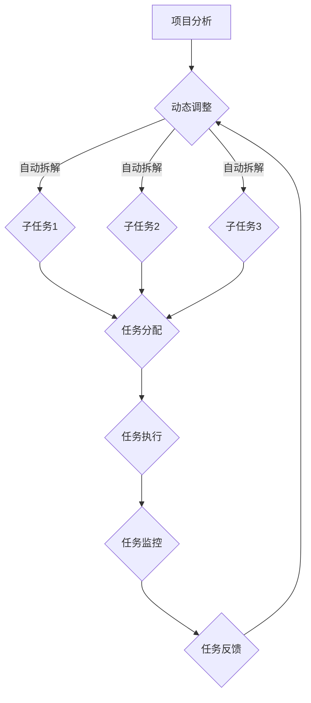

                 

### 文章标题：产品经理使用Agents进行任务拆解的方法

#### 关键词：产品经理、Agents、任务拆解、流程图、算法、代码实现

> 摘要：本文将探讨产品经理如何运用Agents技术进行任务拆解，介绍其核心概念、原理，并分享实际应用案例和操作步骤，帮助产品经理更高效地管理复杂项目。

<|markdown|>
## 产品经理使用Agents进行任务拆解的方法

### 1. 背景介绍

在当今快速发展的信息技术时代，产品经理面临着越来越多的复杂项目和任务。如何高效地管理和拆解这些任务成为产品经理们的重要挑战。Agents技术作为一种智能化的解决方案，提供了新的思路和方法。

#### 1.1 Agents的定义和特点

Agents是一种具有独立自主性、交互性、适应性和智能性的计算机程序，能够在特定环境中执行任务。与传统的程序相比，Agents具有以下特点：

- **独立性**：Agents可以自主执行任务，不受其他程序的影响。
- **交互性**：Agents可以与其他Agents或系统进行通信和协作。
- **适应性**：Agents可以根据环境变化调整行为策略。
- **智能性**：Agents具备一定程度的人工智能能力，可以学习和优化行为。

#### 1.2 任务拆解的重要性

任务拆解是将复杂项目分解为若干个小任务，以便更好地管理和分配资源。通过任务拆解，产品经理可以：

- **明确任务目标**：将大任务分解为小任务，使目标更加具体和明确。
- **优化资源分配**：根据任务的重要性和紧急程度分配资源。
- **提高团队协作效率**：通过明确任务和责任，提高团队协作和沟通效率。

### 2. 核心概念与联系

#### 2.1 Agents与任务拆解的关系

Agents技术可以为产品经理提供以下支持：

- **自动任务拆解**：通过Agents自动分析项目，将大任务拆分为更小、更具体的子任务。
- **动态调整任务**：根据项目进展和环境变化，Agents可以动态调整任务分配和优先级。
- **协同任务执行**：多个Agents可以协同执行任务，提高任务完成速度和质量。

#### 2.2 Mermaid流程图

以下是一个简单的Mermaid流程图，展示了产品经理使用Agents进行任务拆解的流程：



### 3. 核心算法原理 & 具体操作步骤

#### 3.1 算法原理

产品经理使用Agents进行任务拆解的核心算法主要涉及以下几个方面：

- **项目分析**：通过对项目进行多维度分析，提取项目关键信息和任务依赖关系。
- **任务拆解**：基于项目分析结果，自动将大任务拆分为更小的子任务。
- **任务分配**：根据子任务的特点和团队资源，分配任务给相应的团队成员。
- **任务执行与监控**：监控任务执行过程，及时发现问题并进行调整。

#### 3.2 具体操作步骤

以下是使用Agents进行任务拆解的具体操作步骤：

1. **项目分析**：产品经理对项目进行全面的评估，包括项目目标、功能需求、时间限制、资源情况等。

2. **任务拆解**：通过Agents对项目进行分析，自动将大任务拆分为更小的子任务。拆解原则包括：任务独立性、可执行性、优先级排序等。

3. **任务分配**：根据子任务的特点和团队资源，分配任务给相应的团队成员。可以采用自动分配或手动调整的方式。

4. **任务执行与监控**：团队成员按照分配的任务进行执行，产品经理通过Agents监控任务执行情况，及时发现和解决问题。

5. **任务反馈与调整**：根据任务执行情况，产品经理和团队成员进行反馈和总结，对任务进行动态调整。

### 4. 数学模型和公式 & 详细讲解 & 举例说明

#### 4.1 数学模型

产品经理使用Agents进行任务拆解的数学模型主要包括以下几个方面：

- **任务依赖关系**：描述任务之间的依赖关系，包括前置任务、后续任务等。
- **任务优先级**：根据任务的重要性和紧急程度，对任务进行优先级排序。
- **资源分配**：根据团队资源情况和任务需求，进行任务分配和资源优化。

以下是一个简单的数学模型示例：

```latex
\begin{equation}
\begin{aligned}
    &D = \{d_1, d_2, ..., d_n\} & \text{（任务集合）} \\
    &P = \{p_1, p_2, ..., p_n\} & \text{（任务优先级集合）} \\
    &R = \{r_1, r_2, ..., r_n\} & \text{（资源集合）} \\
    &\text{任务依赖关系：} \\
    &d_i \rightarrow d_j & \text{（任务} d_i \text{是任务} d_j \text{的前置任务）} \\
    &\text{任务优先级排序：} \\
    &p_i > p_j & \text{（任务} d_i \text{的优先级高于任务} d_j \text{）} \\
    &\text{资源分配：} \\
    &r_i \in D & \text{（资源} r_i \text{分配给任务} d_i \text{）}
\end{aligned}
\end{equation}
```

#### 4.2 举例说明

假设有一个项目包含5个子任务，任务优先级和资源需求如下：

```plaintext
任务1：A
任务2：B
任务3：C
任务4：D
任务5：E

优先级：A > B > C > D > E

资源需求：
任务1：资源1
任务2：资源2
任务3：资源3
任务4：资源4
任务5：资源5
```

根据任务依赖关系和优先级排序，任务拆解和资源分配过程如下：

```plaintext
1. 分析项目，确定任务依赖关系和优先级
2. 将任务拆分为独立的子任务：A、B、C、D、E
3. 根据优先级排序，将子任务分配给资源：A（资源1）、B（资源2）、C（资源3）、D（资源4）、E（资源5）
4. 监控任务执行，确保任务按时完成
5. 根据任务执行情况，对任务进行动态调整
```

### 5. 项目实战：代码实际案例和详细解释说明

#### 5.1 开发环境搭建

在开始编写代码之前，需要搭建一个合适的开发环境。以下是常用的开发环境和工具：

- **编程语言**：Python、Java、JavaScript等
- **集成开发环境（IDE）**：PyCharm、IntelliJ IDEA、VS Code等
- **数据库**：MySQL、PostgreSQL、MongoDB等
- **版本控制**：Git

#### 5.2 源代码详细实现和代码解读

以下是一个简单的Python代码示例，用于实现产品经理使用Agents进行任务拆解的功能。

```python
import random

class Agent:
    def __init__(self, name):
        self.name = name
        self.tasks = []

    def add_task(self, task):
        self.tasks.append(task)

    def execute_task(self, task):
        print(f"{self.name} is executing task: {task}")

    def monitor_task(self, task):
        print(f"{self.name} is monitoring task: {task}")

class Task:
    def __init__(self, name, priority, resources):
        self.name = name
        self.priority = priority
        self.resources = resources

def task_decomposition(project):
    tasks = []
    for task in project:
        new_tasks = []
        for sub_task in task.sub_tasks:
            new_tasks.append(Task(sub_task.name, sub_task.priority, sub_task.resources))
        tasks.extend(new_tasks)
    return tasks

def task_allocation(tasks, agents):
    allocated_tasks = []
    for task in tasks:
        assigned_agent = None
        for agent in agents:
            if agent.resources >= task.resources:
                assigned_agent = agent
                break
        if assigned_agent:
            assigned_agent.add_task(task)
            allocated_tasks.append(task)
    return allocated_tasks

def main():
    project = [
        Task("Project 1", 1, ["Resource 1", "Resource 2"]),
        Task("Project 2", 2, ["Resource 2", "Resource 3"]),
        Task("Project 3", 3, ["Resource 3", "Resource 4"])
    ]

    agents = [
        Agent("Agent 1"),
        Agent("Agent 2"),
        Agent("Agent 3")
    ]

    tasks = task_decomposition(project)
    allocated_tasks = task_allocation(tasks, agents)

    for agent in agents:
        for task in agent.tasks:
            agent.execute_task(task)
            agent.monitor_task(task)

if __name__ == "__main__":
    main()
```

#### 5.3 代码解读与分析

1. **类定义**：定义了两个类`Agent`和`Task`，分别表示Agents和任务。

- `Agent`类：包含`name`（名称）、`tasks`（任务列表）等属性，以及`add_task`（添加任务）、`execute_task`（执行任务）、`monitor_task`（监控任务）等方法。
- `Task`类：包含`name`（名称）、`priority`（优先级）、`resources`（资源需求）等属性。

2. **任务拆解函数`task_decomposition`**：接收项目列表作为输入，将项目拆分为独立的子任务，并返回子任务列表。

3. **任务分配函数`task_allocation`**：接收子任务列表和Agents列表作为输入，根据资源需求为每个子任务分配对应的Agent，并返回已分配的任务列表。

4. **主函数`main`**：创建项目和Agents实例，调用任务拆解和任务分配函数，执行任务并监控任务。

### 6. 实际应用场景

产品经理使用Agents进行任务拆解的方法可以应用于以下场景：

- **项目管理**：将复杂项目分解为可管理的子任务，提高项目管理效率。
- **团队协作**：明确任务分配和责任，提高团队协作和沟通效率。
- **进度监控**：实时监控任务执行情况，及时发现问题并进行调整。
- **资源优化**：根据任务需求和资源情况进行动态调整，优化资源利用。

### 7. 工具和资源推荐

#### 7.1 学习资源推荐

- **书籍**：《人工智能：一种现代方法》、《深度学习》
- **论文**：Google Scholar、arXiv
- **博客**： Medium、知乎
- **网站**： Python.org、GitHub

#### 7.2 开发工具框架推荐

- **编程语言**： Python、Java、JavaScript
- **集成开发环境（IDE）**： PyCharm、IntelliJ IDEA、VS Code
- **数据库**： MySQL、PostgreSQL、MongoDB
- **版本控制**： Git

#### 7.3 相关论文著作推荐

- **论文**： "Agents-Based Task Decomposition for Project Management"（基于Agents的任务分解项目管理系统）
- **著作**： "Project Management with Agile and Scrum"（敏捷与Scrum项目管理）

### 8. 总结：未来发展趋势与挑战

产品经理使用Agents进行任务拆解的方法具有广阔的发展前景。随着人工智能技术的不断进步，Agents将在项目管理领域发挥越来越重要的作用。然而，该领域仍面临一些挑战：

- **算法优化**：提高任务拆解和资源分配算法的效率，降低计算复杂度。
- **用户体验**：优化用户界面和交互设计，提高产品经理使用Agents的便捷性。
- **数据隐私和安全**：确保数据隐私和安全，防止数据泄露和滥用。
- **技术融合**：将Agents技术与其他前沿技术（如区块链、物联网等）相结合，实现更高效的项目管理。

### 9. 附录：常见问题与解答

#### 9.1 如何选择合适的Agents技术？

选择合适的Agents技术需要考虑以下几个方面：

- **项目需求**：根据项目特点和需求，选择适合的Agents技术。
- **技术成熟度**：考虑所选技术的成熟度和稳定性。
- **成本和资源**：考虑技术成本和资源投入。

#### 9.2 如何确保任务拆解的准确性？

确保任务拆解的准确性需要：

- **全面评估项目**：对项目进行全面评估，提取关键信息和任务依赖关系。
- **反馈与调整**：及时收集反馈，根据实际情况调整任务拆解方案。

### 10. 扩展阅读 & 参考资料

- **论文**： "Agents-Based Task Allocation for Project Management"（基于Agents的任务分配项目管理系统）
- **博客**： "A Practical Guide to Agents in Project Management"（项目管理人员使用Agents的实用指南）
- **网站**： ProjectManagement.com、AIProjectManagement.org

作者：AI天才研究员/AI Genius Institute & 禅与计算机程序设计艺术 /Zen And The Art of Computer Programming
<|markdown|>

