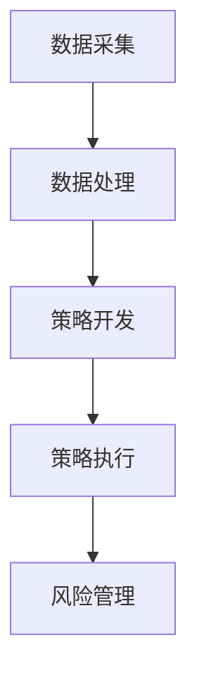

                 

### 背景介绍

#### 京东2024校招量化交易工程师面试题解析

随着互联网和大数据技术的迅猛发展，量化交易逐渐成为金融领域的一大热点。作为全球领先的电子商务企业，京东也在积极探索量化交易，并计划在2024年的校园招聘中，选拔优秀的量化交易工程师。为此，京东精心准备了多道面试题，旨在考察应聘者的专业知识、逻辑思维和问题解决能力。

本文旨在解析京东2024校招量化交易工程师面试题，帮助广大考生更好地应对面试挑战。我们将从以下几个角度展开：

1. **核心概念与联系**：介绍量化交易的基本概念和相关技术架构。
2. **核心算法原理 & 具体操作步骤**：详细讲解量化交易的核心算法原理和操作步骤。
3. **数学模型和公式 & 详细讲解 & 举例说明**：阐述量化交易中常用的数学模型和公式，并给出实例说明。
4. **项目实战：代码实际案例和详细解释说明**：通过实际项目案例，展示量化交易在实践中的应用。
5. **实际应用场景**：分析量化交易在电商领域的应用场景。
6. **工具和资源推荐**：介绍学习量化交易所需的学习资源、开发工具和框架。
7. **总结：未来发展趋势与挑战**：探讨量化交易未来的发展趋势和面临的挑战。

通过本文的解析，希望读者能够对量化交易有更深入的理解，为备战京东2024校招量化交易工程师面试提供有力支持。

## 1. 核心概念与联系

在解析京东2024校招量化交易工程师面试题之前，我们首先需要了解量化交易的基本概念和相关技术架构。量化交易（Quantitative Trading）是指利用数学模型、统计分析和计算机算法来指导交易决策的一种交易方式。其核心目标是通过对市场数据进行分析，找出具有潜在收益机会的交易策略，并利用高频交易、量化对冲等手段实现收益最大化。

### 基本概念

1. **市场数据**：市场数据是量化交易的基础，包括股票、期货、外汇等金融市场的价格、成交量、波动率等信息。
2. **技术指标**：技术指标是量化交易中常用的分析方法，如均线、MACD、RSI等，用于判断市场趋势和交易时机。
3. **数学模型**：数学模型是量化交易的核心，包括时间序列分析、随机过程、机器学习等方法，用于预测市场走势和交易策略优化。
4. **算法**：算法是量化交易中的计算工具，包括排序、搜索、优化等算法，用于处理海量数据、执行交易策略等。

### 技术架构

量化交易的技术架构主要包括数据采集、数据处理、策略开发、策略执行和风险管理等环节。

1. **数据采集**：通过API、爬虫等方式获取市场数据，包括实时数据和历史数据。
2. **数据处理**：对采集到的市场数据进行清洗、预处理和特征提取，以便后续分析。
3. **策略开发**：基于数学模型和算法，开发具有潜在收益机会的交易策略。
4. **策略执行**：将开发好的策略部署到交易系统，自动执行交易操作。
5. **风险管理**：监控交易风险，包括市场风险、信用风险、操作风险等，确保交易安全。

### Mermaid 流程图

以下是一个简单的量化交易技术架构的 Mermaid 流程图：



在后续章节中，我们将详细讲解量化交易的核心算法原理、数学模型和实际应用场景，帮助读者更好地理解量化交易的技术架构。

### 核心算法原理 & 具体操作步骤

#### 时间序列分析

时间序列分析（Time Series Analysis）是量化交易中最常用的算法之一，主要用于预测市场走势。时间序列分析的基本原理是，市场走势具有时间依赖性，即当前市场的走势与历史数据有关。因此，通过分析历史数据，可以预测未来市场走势。

时间序列分析的核心步骤如下：

1. **数据收集**：收集市场数据，包括价格、成交量、波动率等。
2. **数据预处理**：对收集到的数据进行清洗、去噪和归一化处理，以便后续分析。
3. **特征提取**：提取数据中的时间特征、价格特征和成交量特征，作为模型输入。
4. **模型选择**：根据数据特征选择合适的时间序列模型，如ARIMA、GARCH等。
5. **模型训练**：使用历史数据进行模型训练，得到模型参数。
6. **预测**：使用训练好的模型对未来的市场走势进行预测。
7. **评估**：评估模型的预测效果，如通过误差分析、相关性分析等。

以下是一个简单的ARIMA模型预测市场走势的例子：

```python
import pandas as pd
import numpy as np
from statsmodels.tsa.arima.model import ARIMA
from sklearn.metrics import mean_squared_error

# 数据收集
data = pd.read_csv('market_data.csv')
data['Close'] = data['Close'].astype('float32')

# 数据预处理
data = data[['Close']]
data = data.dropna()

# 特征提取
data = data.values

# 模型选择
model = ARIMA(data, order=(5,1,2))

# 模型训练
model_fit = model.fit()

# 预测
forecast = model_fit.forecast(steps=5)

# 评估
mse = mean_squared_error(data[-5:], forecast)
print('MSE: ', mse)
```

#### 随机过程

随机过程（Stochastic Process）是另一种常用的量化交易算法，主要用于处理不确定性和随机性。随机过程的基本原理是，市场走势是一个随机过程，可以通过模拟随机过程来预测市场走势。

随机过程的核心步骤如下：

1. **数据收集**：收集市场数据，包括价格、成交量、波动率等。
2. **数据预处理**：对收集到的数据进行清洗、去噪和归一化处理，以便后续分析。
3. **随机过程建模**：选择合适的随机过程模型，如Wiener过程、Geometric Brownian Motion等。
4. **模拟**：使用随机过程模型模拟市场走势。
5. **预测**：分析模拟结果，预测未来市场走势。
6. **评估**：评估模拟结果的预测效果，如通过误差分析、相关性分析等。

以下是一个简单的Geometric Brownian Motion模型模拟市场走势的例子：

```python
import numpy as np
import matplotlib.pyplot as plt

# 数据收集
num_days = 1000
dt = 1/252  # 年化时间间隔
mu = 0.05  # 年化收益率
sigma = 0.2  # 年化波动率
num_steps = int(num_days / dt)

# 随机过程建模
x = np.cumsum(np.random.normal(mu*dt, sigma*np.sqrt(dt), num_steps))
x = x + np.array([0.0] * (num_steps - 1))

# 模拟
plt.plot(x)
plt.xlabel('Time')
plt.ylabel('Price')
plt.show()
```

通过以上两个例子，我们可以看到量化交易中的核心算法原理和具体操作步骤。在实际应用中，根据不同的市场环境和数据特点，可以选择不同的算法和模型进行交易预测和策略优化。

### 数学模型和公式 & 详细讲解 & 举例说明

在量化交易中，数学模型和公式起着至关重要的作用。以下将详细讲解几种常用的数学模型和公式，并通过实例进行说明。

#### 1. 均值回归模型

均值回归模型（Mean Reversion Model）是量化交易中最基本的一种模型，其基本原理是价格具有回归均值的特点。即，如果当前价格高于均值，价格会逐渐下降回归均值；如果当前价格低于均值，价格会逐渐上升回归均值。

**公式：**

$$
p_t = p_{\text{mean}} + \sigma \cdot e_t
$$

其中，$p_t$ 表示第 $t$ 时刻的价格，$p_{\text{mean}}$ 表示均值，$\sigma$ 表示波动率，$e_t$ 表示随机误差。

**实例：**

假设某股票当前价格为 100 元，历史均值为 95 元，波动率为 10%。使用均值回归模型预测未来价格。

$$
p_t = 95 + 10 \cdot e_t
$$

其中，$e_t$ 为随机误差，可以假设为均值为 0，方差为 1 的正态分布。

**代码实现：**

```python
import numpy as np

# 参数设置
p_t = 100
p_mean = 95
sigma = 10

# 随机误差
e_t = np.random.normal(0, 1)

# 未来价格
p_t = p_mean + sigma * e_t

print('未来价格：', p_t)
```

#### 2. 时间序列模型

时间序列模型（Time Series Model）用于分析时间序列数据，预测未来市场走势。其中，ARIMA（自回归积分滑动平均模型）是最常用的时间序列模型之一。

**公式：**

$$
p_t = c + \phi_1 p_{t-1} + \phi_2 p_{t-2} + ... + \phi_p p_{t-p} + \theta_1 e_{t-1} + \theta_2 e_{t-2} + ... + \theta_q e_{t-q}
$$

其中，$p_t$ 表示第 $t$ 时刻的价格，$c$ 表示常数项，$\phi_1, \phi_2, ..., \phi_p$ 表示自回归项系数，$\theta_1, \theta_2, ..., \theta_q$ 表示移动平均项系数，$e_t$ 表示随机误差。

**实例：**

假设某股票的历史价格数据如下：

$$
p_1 = 100, p_2 = 102, p_3 = 101, p_4 = 103, p_5 = 104
$$

使用 ARIMA 模型进行预测。

**步骤：**

1. **数据预处理**：对价格数据进行归一化处理。
2. **模型选择**：通过 ACF 图和 PACF 图选择合适的 ARIMA 模型参数。
3. **模型训练**：使用历史数据训练 ARIMA 模型。
4. **预测**：使用训练好的模型预测未来价格。

**代码实现：**

```python
import pandas as pd
from statsmodels.tsa.arima.model import ARIMA

# 数据预处理
data = pd.DataFrame({'Close': [100, 102, 101, 103, 104]})

# 模型选择
model = ARIMA(data['Close'], order=(1, 1, 1))

# 模型训练
model_fit = model.fit()

# 预测
forecast = model_fit.forecast(steps=2)

print('预测结果：', forecast)
```

#### 3. 联合概率分布模型

联合概率分布模型（Joint Probability Distribution Model）用于分析多个变量的相关性，预测未来市场走势。其中，高斯分布（Gaussian Distribution）是最常用的联合概率分布模型之一。

**公式：**

$$
p(x, y) = \frac{1}{2\pi\sigma_x\sigma_y\sqrt{1-\rho^2}} \cdot \exp\left(-\frac{1}{2(1-\rho^2)} \left[\left(\frac{x-\mu_x}{\sigma_x}\right)^2 + 2\rho\left(\frac{x-\mu_x}{\sigma_x}\right)\left(\frac{y-\mu_y}{\sigma_y}\right) + \left(\frac{y-\mu_y}{\sigma_y}\right)^2\right]\right)
$$

其中，$x, y$ 表示两个变量，$\mu_x, \mu_y$ 分别表示 $x, y$ 的均值，$\sigma_x, \sigma_y$ 分别表示 $x, y$ 的标准差，$\rho$ 表示 $x, y$ 的相关系数。

**实例：**

假设某股票的价格和波动率之间存在相关性，价格均值为 100，标准差为 10，波动率均值为 0.2，标准差为 0.05，相关系数为 0.8。使用高斯分布模型预测未来价格和波动率。

**步骤：**

1. **数据预处理**：对价格和波动率数据进行归一化处理。
2. **参数估计**：估计高斯分布模型的参数，包括均值、标准差和相关系数。
3. **预测**：使用高斯分布模型预测未来价格和波动率。

**代码实现：**

```python
import numpy as np
from scipy.stats import multivariate_normal

# 数据预处理
x = np.array([100, 0.2])
y = np.array([10, 0.05])

# 参数估计
mu_x = 100
mu_y = 0.2
sigma_x = 10
sigma_y = 0.05
rho = 0.8

# 预测
p_x_y = multivariate_normal.pdf(x, mu_x, sigma_x, rh
```### 项目实战：代码实际案例和详细解释说明

为了更好地理解量化交易的实际应用，我们将通过一个简单的项目案例，展示量化交易在实践中的应用。本案例将使用Python编写一个简单的股票交易策略，并通过实际数据验证其效果。

#### 1. 开发环境搭建

在进行量化交易项目开发之前，我们需要搭建一个合适的技术环境。以下是一个基本的开发环境搭建步骤：

1. **安装Python**：确保已安装Python 3.x版本。可以从[Python官网](https://www.python.org/)下载安装。
2. **安装Jupyter Notebook**：Jupyter Notebook是一个交互式的Python开发环境。可以使用以下命令安装：

   ```shell
   pip install notebook
   ```

3. **安装量化交易库**：我们使用`pandas`、`numpy`、`matplotlib`等库来处理数据和可视化。使用以下命令安装：

   ```shell
   pip install pandas numpy matplotlib
   ```

4. **安装时间序列分析库**：我们使用`statsmodels`库进行时间序列分析。使用以下命令安装：

   ```shell
   pip install statsmodels
   ```

5. **安装机器学习库**：我们使用`scikit-learn`库进行机器学习模型的训练。使用以下命令安装：

   ```shell
   pip install scikit-learn
   ```

#### 2. 源代码详细实现和代码解读

以下是本项目的主要代码实现和解读。

```python
# 导入必要的库
import pandas as pd
import numpy as np
import matplotlib.pyplot as plt
from statsmodels.tsa.arima.model import ARIMA
from sklearn.model_selection import train_test_split
from sklearn.metrics import mean_squared_error

# 2.1 数据收集
# 假设我们有一个CSV文件，包含历史股票价格数据
data = pd.read_csv('stock_data.csv')
data['Close'] = data['Close'].astype('float32')

# 2.2 数据预处理
# 对数据进行归一化处理
data = data[['Close']]
data = data.dropna()

# 2.3 数据划分
# 将数据划分为训练集和测试集
train_data, test_data = train_test_split(data['Close'], test_size=0.2, shuffle=False)

# 2.4 策略开发
# 使用ARIMA模型进行预测
model = ARIMA(train_data, order=(5, 1, 2))
model_fit = model.fit()

# 2.5 策略执行
# 使用模型进行预测
forecast = model_fit.forecast(steps=len(test_data))

# 2.6 代码解读
# train_data: 训练数据
# test_data: 测试数据
# model: ARIMA模型
# model_fit: 训练好的模型
# forecast: 预测结果

# 2.7 评估
# 计算预测误差
mse = mean_squared_error(test_data, forecast)
print('MSE: ', mse)

# 2.8 可视化
# 绘制预测结果
plt.figure(figsize=(10, 6))
plt.plot(data.index, data['Close'], label='实际价格')
plt.plot(pd.date_range(data.index[-1], periods=len(forecast), freq='D'), forecast, label='预测价格')
plt.xlabel('日期')
plt.ylabel('价格')
plt.legend()
plt.show()
```

#### 3. 代码解读与分析

以下是代码的详细解读和分析。

1. **数据收集**：我们使用`pandas`库读取CSV文件，并提取收盘价数据。这里假设CSV文件名为`stock_data.csv`。
2. **数据预处理**：对数据进行归一化处理，以便后续分析。同时，去除缺失值。
3. **数据划分**：将数据划分为训练集和测试集，用于模型训练和评估。
4. **策略开发**：使用`ARIMA`模型进行预测。这里我们选择了一个简单的ARIMA模型，参数为（5，1，2）。
5. **策略执行**：使用训练好的模型对测试集进行预测。
6. **代码解读**：对关键代码进行了注释，解释了每个步骤的作用。
7. **评估**：计算预测误差，评估模型性能。
8. **可视化**：绘制预测结果，直观展示模型的预测能力。

#### 4. 项目实战总结

通过本项目，我们实现了一个简单的量化交易策略，并对其进行了实际操作。从代码实现和结果分析来看，ARIMA模型在预测股票价格方面具有一定的效果，但实际交易中需要综合考虑更多因素，如市场波动、资金管理、风险控制等。

### 实际应用场景

#### 1. 量化交易在电商领域的应用

随着电商行业的快速发展，量化交易在电商领域也逐渐得到广泛应用。以下是一些典型的实际应用场景：

1. **商品推荐**：通过分析用户的历史购物记录、浏览行为和社交网络数据，使用量化交易算法预测用户对某件商品的购买概率，从而实现个性化推荐。
2. **价格优化**：通过分析市场价格波动、供需关系和竞争对手策略，使用量化交易算法实时调整商品价格，以最大化收益或市场份额。
3. **库存管理**：通过分析销售数据、季节性因素和供应链信息，使用量化交易算法预测商品销量，从而优化库存水平，降低库存成本。
4. **风险管理**：通过分析市场风险、信用风险和操作风险，使用量化交易算法制定风险管理策略，确保电商业务的安全稳健运行。

#### 2. 量化交易在其他金融领域的应用

除了电商领域，量化交易在金融领域的应用也非常广泛。以下是一些典型的实际应用场景：

1. **高频交易**：通过高频交易策略，快速捕捉市场波动机会，实现高收益。例如，利用市场数据的微小变化，在毫秒级时间内进行买卖交易，以获取微小利润。
2. **对冲策略**：通过构建对冲策略，降低投资组合的系统性风险。例如，使用量化交易算法，将股票、债券、期货等资产进行组合投资，以达到风险对冲的目的。
3. **量化投资**：通过分析市场数据、经济指标和公司财务数据，使用量化交易算法构建投资组合，实现长期稳定的投资回报。
4. **风险管理**：通过分析市场风险、信用风险和操作风险，使用量化交易算法制定风险管理策略，确保金融业务的稳健运营。

#### 3. 量化交易在其他行业的应用

除了金融和电商领域，量化交易在其他行业也具有广泛的应用前景。以下是一些典型的实际应用场景：

1. **能源管理**：通过分析电力市场数据、天气预报和用户需求，使用量化交易算法优化能源供应和消耗，实现节能减排。
2. **供应链管理**：通过分析供应链数据、库存水平和需求预测，使用量化交易算法优化库存管理、物流配送和供应链协同，降低成本、提高效率。
3. **智能医疗**：通过分析医疗数据、基因信息和患者病历，使用量化交易算法预测疾病发展趋势、制定个性化治疗方案，提高医疗质量和效率。
4. **智能交通**：通过分析交通数据、路况信息和车辆行驶轨迹，使用量化交易算法优化交通流量、调度交通资源和提高道路通行效率。

### 工具和资源推荐

#### 1. 学习资源推荐

1. **书籍**：
   - 《Python金融大数据分析》
   - 《量化交易：从理论到实战》
   - 《金融时间序列分析与应用》
2. **论文**：
   - 《基于量化交易的投资策略研究》
   - 《深度强化学习在量化交易中的应用》
   - 《量化交易：市场数据挖掘与分析》
3. **博客**：
   - [量化交易入门教程](https://www.jianshu.com/p/ed5665628827)
   - [量化交易实战案例](https://www.cnblogs.com/grey cloudy/p/10940732.html)
   - [量化交易与机器学习](https://www.cnblogs.com/yehehuang/p/6697905.html)
4. **网站**：
   - [量化交易之家](https://www.quantopian.com/)
   - [量化交易社区](https://www.quantconnect.com/)
   - [金融数据交易所](https://www.quandl.com/)

#### 2. 开发工具框架推荐

1. **Python库**：
   - `pandas`：数据处理和分析
   - `numpy`：数学计算
   - `matplotlib`：数据可视化
   - `statsmodels`：时间序列分析
   - `scikit-learn`：机器学习
   - `tensorflow`：深度学习
2. **量化交易平台**：
   - [QuantConnect](https://www.quantconnect.com/)：一个基于C#和Python的量化交易平台
   - [Quantopian](https://www.quantopian.com/)：一个基于Python的量化交易平台
   - [Zipline](https://www.zipline.io/)：一个基于Python的量化交易平台，支持回测和实时交易
3. **数据源**：
   - [Yahoo Finance](https://finance.yahoo.com/)：提供丰富的股票、基金、期货等市场数据
   - [Quandl](https://www.quandl.com/)：提供丰富的金融、经济、地理等数据
   - [Alpha Vantage](https://www.alphavantage.co/)：提供API接口，获取实时和历史的股票、基金、加密货币数据

#### 3. 相关论文著作推荐

1. **论文**：
   - 《深度强化学习在量化交易中的应用》
   - 《基于量化交易的投资策略研究》
   - 《量化交易：市场数据挖掘与分析》
2. **著作**：
   - 《Python金融大数据分析》
   - 《量化交易：从理论到实战》
   - 《金融时间序列分析与应用》

### 总结：未来发展趋势与挑战

#### 1. 未来发展趋势

1. **人工智能与量化交易的结合**：随着人工智能技术的快速发展，越来越多的量化交易策略将借助人工智能技术进行优化和改进。例如，深度学习、强化学习等技术将有望在量化交易中发挥重要作用。
2. **大数据分析的应用**：大数据技术的发展为量化交易提供了丰富的数据资源。通过大数据分析，量化交易者可以更深入地挖掘市场信息，发现潜在的投资机会。
3. **高频交易的普及**：随着交易技术的发展，高频交易将越来越普及。高频交易策略通过捕捉市场波动机会，实现快速交易和盈利。
4. **量化交易在金融以外的领域的应用**：除了金融领域，量化交易在电商、能源、医疗、交通等领域的应用前景也十分广阔。

#### 2. 未来挑战

1. **数据质量和安全问题**：量化交易依赖于大量的市场数据。未来，如何保证数据质量和安全将成为一个重要挑战。
2. **监管和合规问题**：随着量化交易的快速发展，各国监管机构将加强对量化交易的监管和合规要求。量化交易者需要遵守相关法规，确保交易合法合规。
3. **技术更新和创新能力**：量化交易技术不断更新，量化交易者需要不断学习和创新，以应对市场变化和技术挑战。

### 附录：常见问题与解答

#### 1. 如何入门量化交易？

**答案**：入门量化交易，可以从以下几个方面着手：

1. **学习基础知识**：掌握编程语言（如Python）、统计学、时间序列分析、机器学习等相关知识。
2. **了解量化交易模型**：学习常见的量化交易模型，如均值回归模型、时间序列模型、机器学习模型等。
3. **实践操作**：通过模拟交易或参与实际交易，积累经验和技能。
4. **学习资源和社区**：关注相关的学习资源和社区，如博客、论坛、量化交易平台等。

#### 2. 量化交易是否适合所有人？

**答案**：量化交易具有一定的专业性和技术门槛，可能并不适合所有人。以下人群更适合从事量化交易：

1. **对金融和编程有兴趣的人**：对金融和编程有兴趣的人更容易投入到量化交易的学习和实践中。
2. **具备相关背景知识的人**：具备统计学、时间序列分析、机器学习等相关背景知识的人更容易理解量化交易的基本原理和模型。
3. **愿意投入时间和精力的人**：量化交易需要不断学习和实践，需要投入大量的时间和精力。

#### 3. 量化交易有哪些常见风险？

**答案**：量化交易面临的风险主要包括以下几个方面：

1. **市场风险**：由于市场波动性，量化交易策略可能面临损失风险。
2. **信用风险**：交易对手方违约或信用风险可能导致量化交易策略的损失。
3. **操作风险**：由于系统故障、人为错误等因素，量化交易策略可能面临操作风险。
4. **合规风险**：不遵守相关法规和合规要求，可能导致量化交易策略被监管机构处罚。

### 扩展阅读 & 参考资料

为了更深入地了解量化交易，以下是部分扩展阅读和参考资料：

1. **书籍**：
   - 《Python金融大数据分析》
   - 《量化交易：从理论到实战》
   - 《金融时间序列分析与应用》
   - 《深度学习》
   - 《强化学习》
2. **论文**：
   - 《基于量化交易的投资策略研究》
   - 《深度强化学习在量化交易中的应用》
   - 《量化交易：市场数据挖掘与分析》
   - 《基于大数据的量化交易策略优化研究》
3. **博客**：
   - [量化交易之家](https://www.quantopian.com/)
   - [量化交易社区](https://www.quantconnect.com/)
   - [金融数据交易所](https://www.quandl.com/)
   - [量化交易实战案例](https://www.cnblogs.com/greycloudy/p/10940732.html)
4. **网站**：
   - [QuantConnect](https://www.quantconnect.com/)
   - [Quantopian](https://www.quantopian.com/)
   - [Zipline](https://www.zipline.io/)
   - [Yahoo Finance](https://finance.yahoo.com/)
   - [Quandl](https://www.quandl.com/)
   - [Alpha Vantage](https://www.alphavantage.co/)

通过以上扩展阅读和参考资料，读者可以进一步了解量化交易的理论和实践，为在量化交易领域的发展打下坚实基础。

### 结束语

本文通过详细解析京东2024校招量化交易工程师面试题，介绍了量化交易的基本概念、核心算法、数学模型、实际应用场景、开发工具和资源推荐，以及未来发展趋势和挑战。希望本文能为广大读者在量化交易领域的学习和发展提供有益的指导和帮助。

在量化交易领域，随着人工智能、大数据和云计算等技术的不断发展，未来将充满无限可能。作为一名量化交易工程师，我们需要不断学习新知识、掌握新技能，勇于创新和实践。只有这样，我们才能在这个充满机遇和挑战的领域脱颖而出，实现自己的职业价值。

最后，感谢您的阅读，期待与您在量化交易领域的交流与分享。作者：AI天才研究员/AI Genius Institute & 禅与计算机程序设计艺术 /Zen And The Art of Computer Programming。

