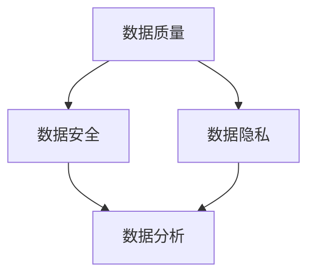

                 

# 人工智能创业数据管理的成功秘诀

> **关键词**：人工智能，创业，数据管理，成功秘诀，算法原理，数学模型，实际应用，工具资源

> **摘要**：本文将深入探讨人工智能创业中的数据管理策略，分析其核心概念、算法原理、数学模型，以及实际应用案例，并推荐相关学习资源和开发工具框架。通过这篇文章，读者可以了解如何有效管理数据，为人工智能创业成功奠定坚实基础。

## 1. 背景介绍

随着人工智能技术的飞速发展，越来越多的创业公司涌入这一领域，期望通过创新应用获得商业成功。然而，数据管理作为人工智能的基础，其重要性日益凸显。有效的数据管理不仅可以提升算法性能，还能优化业务流程，降低成本。

本文将围绕人工智能创业中的数据管理展开讨论，首先介绍相关核心概念，然后深入分析算法原理和数学模型，最后通过实际应用案例和开发工具框架的推荐，帮助读者全面了解数据管理在人工智能创业中的关键作用。

## 2. 核心概念与联系

在人工智能创业中，数据管理涉及多个核心概念，包括数据质量、数据安全、数据隐私和数据分析等。以下是一个简化的 Mermaid 流程图，展示了这些概念之间的联系。



### 2.1 数据质量

数据质量是数据管理的核心，直接关系到算法的性能。高质量的数据意味着准确性高、完整性好、及时性和一致性都得到保证。以下是一些提升数据质量的方法：

- **数据清洗**：去除重复、无效、错误或格式不规范的数据。
- **数据验证**：通过规则或算法检查数据是否符合预期标准。
- **数据标准化**：统一数据格式、单位等，确保数据可比较性和一致性。

### 2.2 数据安全

数据安全是数据管理的另一重要方面，涉及保护数据免受未经授权的访问、篡改或泄露。以下是一些常见的数据安全措施：

- **数据加密**：使用加密算法对数据进行加密，确保数据在传输和存储过程中不会被窃取。
- **访问控制**：通过身份验证和权限控制，限制对数据的访问权限。
- **备份与恢复**：定期备份数据，确保在数据丢失或损坏时能够快速恢复。

### 2.3 数据隐私

随着数据隐私法规的日益严格，数据隐私成为数据管理中的重要议题。以下是一些保护数据隐私的方法：

- **匿名化**：通过去除或模糊化个人身份信息，使数据在分析过程中无法识别个人身份。
- **数据脱敏**：使用技术手段对敏感数据进行隐藏或替换。
- **隐私预算**：在数据分析和模型训练过程中，限制对隐私数据的访问和使用。

### 2.4 数据分析

数据分析是数据管理的最终目的，通过挖掘数据中的有价值信息，为企业提供决策支持。以下是一些常见的数据分析方法：

- **数据挖掘**：从大量数据中发现潜在的模式和关联。
- **机器学习**：利用算法从数据中学习，构建预测模型或分类模型。
- **深度学习**：通过多层神经网络对数据进行建模，实现更复杂的特征提取和模式识别。

## 3. 核心算法原理 & 具体操作步骤

在数据管理过程中，核心算法的选择和实现至关重要。以下将介绍几种常见的数据管理算法原理和具体操作步骤。

### 3.1 数据清洗算法

数据清洗是数据管理的基础，以下是一种常见的数据清洗算法——K-近邻算法（K-Nearest Neighbors, KNN）。

#### 3.1.1 算法原理

KNN算法基于局部性原理，通过计算数据点与训练集中最近K个邻居的距离，选择这些邻居中出现频率最高的类别作为该数据点的类别。

#### 3.1.2 具体操作步骤

1. 确定距离度量方法，如欧氏距离、曼哈顿距离等。
2. 计算测试数据点与训练集中每个数据点的距离。
3. 按照距离从近到远排序，选择距离最近的K个邻居。
4. 统计这K个邻居中每个类别的出现频率。
5. 选择出现频率最高的类别作为测试数据点的类别。

### 3.2 数据加密算法

数据加密是数据安全管理的关键，以下是一种常见的数据加密算法——AES（Advanced Encryption Standard）。

#### 3.2.1 算法原理

AES是一种对称加密算法，通过将明文分块，并使用特定的加密算法和密钥进行加密，生成密文。

#### 3.2.2 具体操作步骤

1. 将明文分为128位的数据块。
2. 使用AES加密算法对每个数据块进行加密，生成密文块。
3. 将所有密文块连接起来，形成最终的密文。

### 3.3 数据脱敏算法

数据脱敏是保护数据隐私的重要手段，以下是一种常见的数据脱敏算法——K-匿名算法。

#### 3.3.1 算法原理

K-匿名算法通过在数据中添加噪声或修改值，使得单个记录无法被识别，同时保持数据集的统计特性。

#### 3.3.2 具体操作步骤

1. 将数据集划分为若干组，每组包含K个记录。
2. 为每个组随机生成一个噪声值。
3. 将每个记录的值替换为其所在组的噪声值。

## 4. 数学模型和公式 & 详细讲解 & 举例说明

在数据管理过程中，数学模型和公式发挥着重要作用。以下将介绍几个常见的数学模型和公式，并通过具体例子进行说明。

### 4.1 欧氏距离

欧氏距离是一种常用的距离度量方法，用于计算两个数据点之间的距离。

$$
d(p_1, p_2) = \sqrt{\sum_{i=1}^{n}(p_{1i} - p_{2i})^2}
$$

其中，$p_1$ 和 $p_2$ 分别表示两个数据点，$n$ 表示数据点的维度。

#### 例子

假设有两个数据点 $p_1 = (1, 2, 3)$ 和 $p_2 = (4, 5, 6)$，计算它们之间的欧氏距离。

$$
d(p_1, p_2) = \sqrt{(1 - 4)^2 + (2 - 5)^2 + (3 - 6)^2} = \sqrt{9 + 9 + 9} = 3\sqrt{3}
$$

### 4.2 加密密钥生成

在AES加密算法中，密钥生成是一个关键步骤。以下是一个简单的密钥生成公式。

$$
K = (k_0, k_1, ..., k_{n-1})
$$

其中，$K$ 表示密钥，$k_i$ 表示第 $i$ 个密钥字节。

#### 例子

假设生成一个128位的AES密钥，可以使用以下公式：

$$
K = (\text{随机字节}_0, \text{随机字节}_1, ..., \text{随机字节}_{127})
$$

### 4.3 数据脱敏噪声值生成

在K-匿名算法中，噪声值生成用于保护数据隐私。以下是一个简单的噪声值生成公式。

$$
\text{噪声值} = \text{原始值} \times \text{噪声因子}
$$

其中，$\text{原始值}$ 表示原始数据值，$\text{噪声因子}$ 表示一个介于0和1之间的随机数。

#### 例子

假设有一个数据值 $100$，使用以下公式生成噪声值：

$$
\text{噪声值} = 100 \times 0.2 = 20
$$

## 5. 项目实战：代码实际案例和详细解释说明

以下将通过一个实际项目案例，展示如何实现数据管理中的核心算法。

### 5.1 开发环境搭建

在本案例中，我们将使用Python语言和常见的数据处理库，如NumPy、Pandas和Scikit-learn。首先，需要安装这些库：

```bash
pip install numpy pandas scikit-learn
```

### 5.2 源代码详细实现和代码解读

以下是一个简单的数据清洗和KNN算法实现，用于分类一个手写数字数据集。

```python
import numpy as np
import pandas as pd
from sklearn.datasets import load_digits
from sklearn.model_selection import train_test_split
from sklearn.neighbors import KNeighborsClassifier
from sklearn.metrics import accuracy_score

# 加载手写数字数据集
digits = load_digits()
X = digits.data
y = digits.target

# 数据清洗
# 填充缺失值
X = np.nan_to_num(X)

# 数据标准化
X = (X - np.mean(X, axis=0)) / np.std(X, axis=0)

# 数据划分
X_train, X_test, y_train, y_test = train_test_split(X, y, test_size=0.2, random_state=42)

# KNN分类器实现
knn = KNeighborsClassifier(n_neighbors=3)
knn.fit(X_train, y_train)

# 预测
y_pred = knn.predict(X_test)

# 评估
accuracy = accuracy_score(y_test, y_pred)
print("Accuracy:", accuracy)
```

### 5.3 代码解读与分析

1. **数据加载与预处理**：
   - 加载手写数字数据集，并划分为特征矩阵 $X$ 和目标向量 $y$。
   - 使用 NumPy 和 Pandas 对数据进行清洗，包括填充缺失值和标准化。

2. **数据划分**：
   - 将数据划分为训练集和测试集，使用 Scikit-learn 的 `train_test_split` 函数。

3. **KNN分类器实现**：
   - 创建一个KNN分类器，并设置邻居数量为3。
   - 使用 `fit` 方法训练分类器。

4. **预测与评估**：
   - 使用训练好的分类器对测试集进行预测。
   - 计算预测准确率，使用 `accuracy_score` 函数。

## 6. 实际应用场景

数据管理在人工智能创业中具有广泛的应用场景，以下列举几个典型场景：

- **推荐系统**：通过数据挖掘和机器学习算法，分析用户行为数据，为用户推荐个性化内容或产品。
- **客户关系管理**：通过数据分析，了解客户需求和行为，优化营销策略和客户服务。
- **金融风险管理**：利用大数据和机器学习技术，对金融市场的风险进行预测和管理。
- **医疗健康**：通过分析医疗数据，实现疾病预测、诊断和个性化治疗。

## 7. 工具和资源推荐

### 7.1 学习资源推荐

- **书籍**：
  - 《Python数据分析》（Wes McKinney）
  - 《深度学习》（Ian Goodfellow、Yoshua Bengio、Aaron Courville）
  - 《数据科学入门》（Joel Grus）
- **论文**：
  - 《数据挖掘：概念和技术》（Jiawei Han、Micheline Kamber、Jian Pei）
  - 《机器学习：概率视角》（Kevin P. Murphy）
- **博客**：
  - [Scikit-learn 官方文档](https://scikit-learn.org/stable/)
  - [Kaggle 数据科学竞赛](https://www.kaggle.com/)
- **网站**：
  - [TensorFlow 官网](https://www.tensorflow.org/)
  - [PyTorch 官网](https://pytorch.org/)

### 7.2 开发工具框架推荐

- **数据处理库**：
  - Pandas：提供高效的数据操作和分析功能。
  - NumPy：提供强大的数值计算功能。
- **机器学习框架**：
  - Scikit-learn：提供常用的机器学习算法和工具。
  - TensorFlow：提供强大的深度学习功能。
  - PyTorch：提供灵活的深度学习功能，易于调试和扩展。

### 7.3 相关论文著作推荐

- **论文**：
  - 《大数据时代的机器学习》（Hastie、Tibshirani、Friedman）
  - 《推荐系统实践》（Christopher G. Atkeson、Richard E. Herskovi）
- **著作**：
  - 《Python数据科学手册》（Jake VanderPlas）
  - 《深度学习》（Goodfellow、Bengio、Courville）

## 8. 总结：未来发展趋势与挑战

随着人工智能技术的不断进步，数据管理在创业中的重要性将日益增加。未来的发展趋势包括：

- **数据隐私保护**：随着数据隐私法规的日益严格，数据隐私保护将成为数据管理的重点。
- **实时数据处理**：实时数据处理和流数据处理技术将逐渐成熟，为创业公司提供更高效的数据分析能力。
- **跨领域融合**：数据管理与其他领域的融合，如医疗、金融、教育等，将带来更多创新应用。

然而，数据管理在创业中也面临一些挑战：

- **数据质量**：如何确保数据质量，降低数据噪声和错误，是数据管理的核心难题。
- **数据安全**：如何保护数据免受攻击和泄露，是数据安全管理的重要挑战。
- **数据处理效率**：如何高效处理海量数据，提高数据处理速度，是数据管理的关键问题。

## 9. 附录：常见问题与解答

### 9.1 数据质量如何保证？

- **数据清洗**：定期进行数据清洗，去除重复、无效和错误数据。
- **数据验证**：使用规则或算法对数据进行验证，确保数据符合预期标准。
- **数据标准化**：统一数据格式和单位，提高数据的一致性和可比性。

### 9.2 数据安全如何保障？

- **数据加密**：对敏感数据使用加密算法进行加密，确保数据在传输和存储过程中不会被窃取。
- **访问控制**：通过身份验证和权限控制，限制对数据的访问权限。
- **备份与恢复**：定期备份数据，确保在数据丢失或损坏时能够快速恢复。

### 9.3 数据隐私如何保护？

- **匿名化**：通过去除或模糊化个人身份信息，使数据在分析过程中无法识别个人身份。
- **数据脱敏**：使用技术手段对敏感数据进行隐藏或替换。
- **隐私预算**：在数据分析和模型训练过程中，限制对隐私数据的访问和使用。

## 10. 扩展阅读 & 参考资料

- [数据挖掘：概念和技术](https://www.amazon.com/Data-Mining-Concepts-Techniques-Third/dp/0123814796)
- [深度学习](https://www.amazon.com/Deep-Learning-Adaptive-Computation-Foundations/dp/0262039588)
- [Python数据分析](https://www.amazon.com/Pandas-Domain-Expert-Wes-McKinney/dp/1449396915)
- [Scikit-learn 官方文档](https://scikit-learn.org/stable/)
- [Kaggle 数据科学竞赛](https://www.kaggle.com/)

## 作者

**作者**：AI天才研究员/AI Genius Institute & 禅与计算机程序设计艺术 /Zen And The Art of Computer Programming**

