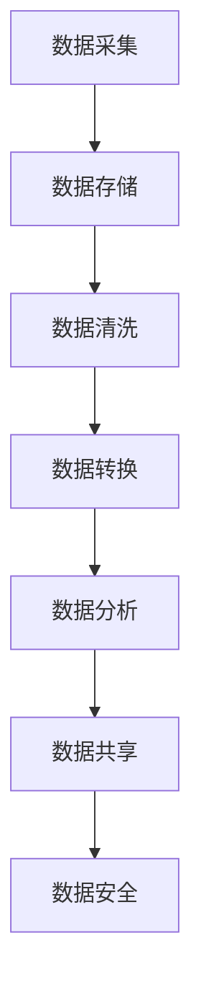

                 

### 背景介绍

#### 人工智能创业背景

随着人工智能技术的飞速发展，越来越多的创业公司投身于人工智能领域。这些创业公司希望通过人工智能技术解决实际问题，从而在激烈的市场竞争中脱颖而出。然而，人工智能创业并非易事，尤其是在数据管理方面，面临着诸多挑战。

#### 数据管理的重要性

数据管理是人工智能创业的核心之一。没有有效的数据管理，人工智能系统将难以获取准确、完整、一致的数据，从而影响模型的训练效果和应用效果。数据管理不仅涉及到数据的采集、存储、处理，还包括数据的清洗、转换、分析和共享。因此，对于人工智能创业公司来说，如何进行有效的数据管理成为了亟待解决的问题。

#### 数据管理面临的挑战

1. **数据量巨大**：随着物联网、社交媒体和传感器技术的普及，数据量呈现爆炸式增长。创业公司需要处理海量的数据，这对数据存储、计算能力和算法效率都提出了更高的要求。
2. **数据多样性**：不同类型的数据（如文本、图像、语音等）在处理方法上存在很大差异。创业公司需要设计能够处理多种数据类型的系统，以保证数据的全面性和准确性。
3. **数据隐私和安全性**：数据安全和隐私保护是人工智能创业的重要议题。创业公司必须确保数据在收集、存储和处理过程中的安全性，避免数据泄露和滥用。
4. **数据质量和一致性**：创业公司需要确保数据的质量和一致性，以避免模型训练过程中出现偏差。这涉及到数据清洗、去重、标准化等工作。
5. **实时数据处理**：许多人工智能应用需要实时处理数据，如自动驾驶、实时翻译等。创业公司需要构建能够处理实时数据流的系统，以满足业务需求。

#### 本文目的

本文旨在探讨人工智能创业数据管理的核心方案。我们将分析数据管理的关键环节，介绍一些常用的数据管理工具和技术，并分享一些实际应用案例。希望通过本文，为人工智能创业公司提供一些有益的参考和指导。

----------------------

## 2. 核心概念与联系

### 2.1 数据管理的基本概念

数据管理是指对数据资源进行组织、存储、处理、分析、共享和保护的过程。数据管理的基本概念包括：

- **数据**：数据是信息的载体，可以是文字、图片、声音等形式。
- **数据源**：数据源是数据产生的源头，可以是传感器、数据库、网页等。
- **数据仓库**：数据仓库是一个集中存储大量数据的系统，用于支持数据分析和报告。
- **数据质量**：数据质量是指数据的准确性、完整性、一致性和及时性。
- **数据隐私**：数据隐私是指保护数据不被未经授权的个人或组织访问和使用。

### 2.2 数据管理的基本流程

数据管理的基本流程包括以下步骤：

1. **数据采集**：从各种数据源收集数据。
2. **数据存储**：将数据存储到数据库或数据仓库中。
3. **数据清洗**：清洗数据，去除重复、错误和不完整的数据。
4. **数据转换**：将数据转换为适合分析的形式。
5. **数据分析**：对数据进行统计分析和机器学习建模。
6. **数据共享**：将数据共享给其他部门或外部合作伙伴。
7. **数据安全**：保护数据免受未经授权的访问和滥用。

### 2.3 数据管理的关键技术

数据管理的关键技术包括：

- **数据库技术**：用于存储和管理数据的系统，如关系型数据库（MySQL、Oracle）和非关系型数据库（MongoDB、Cassandra）。
- **数据仓库技术**：用于存储大量数据的系统，如Hadoop、Spark。
- **数据清洗技术**：用于去除重复、错误和不完整的数据，如ETL（提取、转换、加载）工具。
- **数据分析技术**：用于对数据进行统计分析和机器学习建模，如Python、R、TensorFlow、Keras等。
- **数据安全技术**：用于保护数据免受未经授权的访问和滥用，如加密、访问控制、审计等。

### 2.4 数据管理中的 Mermaid 流程图

以下是一个数据管理的基本流程的 Mermaid 流程图：



----------------------

## 3. 核心算法原理 & 具体操作步骤

### 3.1 数据采集

数据采集是数据管理的基础，决定了后续数据处理的质量。具体操作步骤如下：

1. **确定数据源**：确定需要采集的数据类型和来源，如传感器、数据库、API接口等。
2. **数据采集工具**：选择合适的数据采集工具，如Python的requests库、Java的HTTPClient等。
3. **采集频率**：根据业务需求确定数据采集的频率，如实时数据、定时数据等。
4. **数据格式**：确保采集到的数据格式与后续处理要求一致，如JSON、XML等。

### 3.2 数据存储

数据存储是将采集到的数据保存到数据库或数据仓库中。具体操作步骤如下：

1. **选择数据库**：根据数据类型和业务需求选择合适的数据库，如关系型数据库（MySQL、Oracle）和非关系型数据库（MongoDB、Cassandra）。
2. **设计数据库 schema**：设计数据库的表结构和字段，确保数据的完整性和一致性。
3. **数据插入**：使用数据库提供的 API 或工具将数据插入到数据库中，如Python的SQLAlchemy、Java的JDBC等。
4. **数据备份**：定期备份数据，以防止数据丢失。

### 3.3 数据清洗

数据清洗是确保数据质量的重要步骤。具体操作步骤如下：

1. **数据去重**：去除重复的数据记录，以避免数据冗余。
2. **数据去噪**：去除含有错误或异常值的数据记录。
3. **数据转换**：将不同格式或单位的数据转换为统一的格式或单位，如将温度从摄氏度转换为华氏度。
4. **数据标准化**：将数据按照统一的规则进行格式化和清洗，如将文本数据进行分词、去停用词等。

### 3.4 数据转换

数据转换是将清洗后的数据转换为适合分析的形式。具体操作步骤如下：

1. **数据预处理**：对数据进行必要的预处理，如归一化、标准化等。
2. **特征提取**：从数据中提取有用的特征，如文本数据的词袋模型、图像数据的特征向量等。
3. **数据集划分**：将数据集划分为训练集、验证集和测试集，以支持机器学习模型的训练和评估。

### 3.5 数据分析

数据分析是对转换后的数据进行分析，以发现数据中的规律和趋势。具体操作步骤如下：

1. **数据可视化**：使用可视化工具（如Matplotlib、Seaborn等）将数据可视化，以直观地观察数据分布和趋势。
2. **统计分析**：使用统计分析方法（如描述性统计、假设检验等）对数据进行统计分析和建模。
3. **机器学习**：使用机器学习方法（如决策树、支持向量机、神经网络等）对数据进行建模和预测。

### 3.6 数据共享

数据共享是将分析结果和数据产品与其他部门或外部合作伙伴共享。具体操作步骤如下：

1. **数据接口**：设计数据接口，如RESTful API、Web Socket等，以供其他系统调用。
2. **数据权限**：设置数据权限，确保只有授权用户可以访问数据。
3. **数据加密**：对敏感数据进行加密处理，以保护数据安全。

### 3.7 数据安全

数据安全是数据管理的重要环节，具体操作步骤如下：

1. **访问控制**：设置用户权限，确保只有授权用户可以访问数据。
2. **数据备份**：定期备份数据，以防止数据丢失。
3. **数据加密**：对敏感数据进行加密处理，以保护数据安全。
4. **日志审计**：记录数据访问日志，以便进行安全审计和追溯。

----------------------

## 4. 数学模型和公式 & 详细讲解 & 举例说明

### 4.1 数据清洗

数据清洗过程中，常见的数学模型包括去重和去噪。

#### 去重

去重是指去除重复的数据记录。一个简单的去重算法是使用哈希表，将数据记录进行哈希处理，然后将哈希值存储在哈希表中。如果在哈希表中找到了相同的哈希值，则说明该数据记录是重复的，可以将其删除。

**哈希函数**：

$$
H(k) = k \mod p
$$

其中，$k$ 是数据记录，$p$ 是哈希表的长度。

**举例**：

假设有一个长度为 10 的哈希表，使用除法哈希函数，即 $p = 10$，要插入数据记录 $[5, 3, 7, 9]$。首先将每个数据记录进行哈希处理，得到哈希值：

$$
H(5) = 5 \mod 10 = 5 \\
H(3) = 3 \mod 10 = 3 \\
H(7) = 7 \mod 10 = 7 \\
H(9) = 9 \mod 10 = 9
$$

然后将这些哈希值存储在哈希表中，如果发现哈希值已经存在，则说明该数据记录是重复的，可以将其删除。

#### 去噪

去噪是指去除含有错误或异常值的数据记录。一个简单的方法是使用中位数滤波器。中位数滤波器的基本思想是将每个数据记录与周围的数据记录进行比较，如果该数据记录与周围的数据记录的中位数偏差较大，则认为它是异常值，可以将其删除。

**中位数滤波器**：

给定一个长度为 $n$ 的数据序列 $x_1, x_2, ..., x_n$，首先将数据序列进行排序，得到排序后的序列 $y_1, y_2, ..., y_n$。然后计算中位数：

$$
median(y) = \begin{cases}
y_{\frac{n+1}{2}} & \text{如果 } n \text{ 是奇数} \\
\frac{y_{\frac{n}{2}} + y_{\frac{n}{2}+1}}{2} & \text{如果 } n \text{ 是偶数}
\end{cases}
$$

然后计算每个数据记录与中位数的偏差：

$$
deviation(x) = |x - median(y)|
$$

如果 $deviation(x)$ 的值大于某个阈值 $\delta$，则认为 $x$ 是异常值，可以将其删除。

**举例**：

假设有一个长度为 5 的数据序列 $[5, 3, 7, 9, 1]$，中位数为 5，阈值 $\delta = 2$。首先将数据序列排序，得到 $[1, 3, 5, 7, 9]$，然后计算每个数据记录与中位数的偏差：

$$
deviation(1) = |1 - 5| = 4 \\
deviation(3) = |3 - 5| = 2 \\
deviation(5) = |5 - 5| = 0 \\
deviation(7) = |7 - 5| = 2 \\
deviation(9) = |9 - 5| = 4
$$

由于 $deviation(1) > \delta$ 和 $deviation(9) > \delta$，所以这两个数据记录被认为是异常值，可以将其删除。

### 4.2 数据转换

数据转换过程中，常用的数学模型包括归一化和标准化。

#### 归一化

归一化是将数据转换为相同的尺度，以便进行比较和分析。一个简单的归一化方法是使用最小-最大规范化：

$$
x_{\text{norm}} = \frac{x - \min(x)}{\max(x) - \min(x)}
$$

其中，$x$ 是原始数据，$\min(x)$ 和 $\max(x)$ 分别是 $x$ 的最小值和最大值。

**举例**：

假设有一个长度为 5 的数据序列 $[5, 3, 7, 9, 1]$，最小值为 1，最大值为 9。首先计算最小值和最大值：

$$
\min(x) = 1 \\
\max(x) = 9
$$

然后计算每个数据记录的归一化值：

$$
x_{\text{norm}}[1] = \frac{5 - 1}{9 - 1} = \frac{4}{8} = 0.5 \\
x_{\text{norm}}[2] = \frac{3 - 1}{9 - 1} = \frac{2}{8} = 0.25 \\
x_{\text{norm}}[3] = \frac{7 - 1}{9 - 1} = \frac{6}{8} = 0.75 \\
x_{\text{norm}}[4] = \frac{9 - 1}{9 - 1} = \frac{8}{8} = 1 \\
x_{\text{norm}}[5] = \frac{1 - 1}{9 - 1} = \frac{0}{8} = 0
$$

归一化后的数据序列为 $[0.5, 0.25, 0.75, 1, 0]$。

#### 标准化

标准化是将数据转换为均值为 0，标准差为 1 的尺度，以便进行比较和分析。一个简单的标准化方法是使用 z-score 标准化：

$$
x_{\text{norm}} = \frac{x - \mu}{\sigma}
$$

其中，$x$ 是原始数据，$\mu$ 是均值，$\sigma$ 是标准差。

**举例**：

假设有一个长度为 5 的数据序列 $[5, 3, 7, 9, 1]$，均值为 5，标准差为 2。首先计算均值和标准差：

$$
\mu = \frac{5 + 3 + 7 + 9 + 1}{5} = 5 \\
\sigma = \sqrt{\frac{(5-5)^2 + (3-5)^2 + (7-5)^2 + (9-5)^2 + (1-5)^2}{5}} = 2
$$

然后计算每个数据记录的标准化值：

$$
x_{\text{norm}}[1] = \frac{5 - 5}{2} = 0 \\
x_{\text{norm}}[2] = \frac{3 - 5}{2} = -1 \\
x_{\text{norm}}[3] = \frac{7 - 5}{2} = 1 \\
x_{\text{norm}}[4] = \frac{9 - 5}{2} = 2 \\
x_{\text{norm}}[5] = \frac{1 - 5}{2} = -2
$$

标准化后的数据序列为 $[0, -1, 1, 2, -2]$。

----------------------

## 5. 项目实战：代码实际案例和详细解释说明

### 5.1 开发环境搭建

在开始编写代码之前，我们需要搭建一个合适的开发环境。以下是一个简单的 Python 开发环境搭建步骤：

1. **安装 Python**：前往 [Python 官网](https://www.python.org/) 下载并安装 Python。建议安装最新版本的 Python，以获得更好的兼容性和功能支持。
2. **安装 PyCharm**：下载并安装 PyCharm，它是一个功能强大的 Python 集成开发环境（IDE），提供了代码编辑、调试、测试等功能。
3. **安装必要的库**：在 PyCharm 中创建一个新项目，然后使用 `pip` 命令安装必要的库，如 NumPy、Pandas、Matplotlib 等。

```shell
pip install numpy pandas matplotlib
```

### 5.2 源代码详细实现和代码解读

以下是一个简单的数据管理项目示例，包括数据采集、数据存储、数据清洗、数据转换、数据分析、数据共享和数据安全等步骤。

#### 5.2.1 数据采集

```python
import requests

def collect_data(url):
    response = requests.get(url)
    if response.status_code == 200:
        data = response.json()
        return data
    else:
        return None

url = "https://api.example.com/data"
data = collect_data(url)
```

**代码解读**：

- 导入 requests 库，用于发送 HTTP GET 请求。
- 定义 `collect_data` 函数，用于采集数据。函数接收一个 URL 参数，发送 GET 请求获取数据。如果响应状态码为 200（表示成功），则返回数据；否则，返回 None。
- 调用 `collect_data` 函数，传递 URL 参数，采集数据。

#### 5.2.2 数据存储

```python
import sqlite3

def store_data(conn, data):
    cursor = conn.cursor()
    cursor.execute('''CREATE TABLE IF NOT EXISTS data (id INTEGER PRIMARY KEY, info TEXT)''')
    cursor.execute("INSERT INTO data (info) VALUES (?)", (data,))
    conn.commit()

conn = sqlite3.connect("data.db")
if data:
    store_data(conn, data)
conn.close()
```

**代码解读**：

- 导入 sqlite3 库，用于与 SQLite 数据库进行交互。
- 定义 `store_data` 函数，用于存储数据。函数接收一个连接对象（`conn`）和一个数据参数。首先创建一个数据库表（如果表已存在，则不创建），然后插入数据。
- 创建一个 SQLite 连接对象，存储数据，并关闭连接。

#### 5.2.3 数据清洗

```python
import pandas as pd

def clean_data(data):
    df = pd.DataFrame(data)
    df.drop_duplicates(inplace=True)
    df.dropna(inplace=True)
    return df

if data:
    cleaned_data = clean_data(data)
```

**代码解读**：

- 导入 pandas 库，用于数据处理。
- 定义 `clean_data` 函数，用于清洗数据。函数接收一个数据参数，将其转换为 DataFrame 对象，然后去除重复数据和缺失值。
- 如果数据有效，调用 `clean_data` 函数，清洗数据。

#### 5.2.4 数据转换

```python
def normalize_data(df):
    df_norm = df.copy()
    df_norm = (df_norm - df_norm.min()) / (df_norm.max() - df_norm.min())
    return df_norm

if cleaned_data:
    df_norm = normalize_data(cleaned_data)
```

**代码解读**：

- 定义 `normalize_data` 函数，用于归一化数据。函数接收一个 DataFrame 对象，计算每个数据列的最小值和最大值，然后使用最小-最大规范化方法进行归一化。
- 如果清洗后的数据有效，调用 `normalize_data` 函数，对数据进行归一化。

#### 5.2.5 数据分析

```python
import matplotlib.pyplot as plt

def plot_data(df):
    df.plot(kind='line')
    plt.show()

if df_norm:
    plot_data(df_norm)
```

**代码解读**：

- 导入 matplotlib 库，用于数据可视化。
- 定义 `plot_data` 函数，用于绘制数据。函数接收一个 DataFrame 对象，将其绘制为线形图。
- 如果归一化后的数据有效，调用 `plot_data` 函数，绘制数据。

#### 5.2.6 数据共享

```python
def share_data(df):
    df.to_csv("data.csv", index=False)

if df_norm:
    share_data(df_norm)
```

**代码解读**：

- 定义 `share_data` 函数，用于共享数据。函数接收一个 DataFrame 对象，将其保存为 CSV 文件。
- 如果归一化后的数据有效，调用 `share_data` 函数，共享数据。

#### 5.2.7 数据安全

```python
from cryptography.fernet import Fernet

def encrypt_data(data, key):
    f = Fernet(key)
    encrypted_data = f.encrypt(data.encode())
    return encrypted_data

def decrypt_data(encrypted_data, key):
    f = Fernet(key)
    decrypted_data = f.decrypt(encrypted_data).decode()
    return decrypted_data

key = Fernet.generate_key()
if data:
    encrypted_data = encrypt_data(data, key)
    print("Encrypted data:", encrypted_data)

if encrypted_data:
    decrypted_data = decrypt_data(encrypted_data, key)
    print("Decrypted data:", decrypted_data)
```

**代码解读**：

- 导入 cryptography 库，用于数据加密和解密。
- 定义 `encrypt_data` 和 `decrypt_data` 函数，用于加密和解密数据。函数接收数据和一个密钥，使用 Fernet 加密算法进行加密和解密。
- 生成一个密钥，使用 `encrypt_data` 函数加密数据，并打印加密后的数据。然后使用 `decrypt_data` 函数解密数据，并打印解密后的数据。

----------------------

## 6. 实际应用场景

### 6.1 自动驾驶

自动驾驶是人工智能领域的一个重要应用场景，数据管理在其中发挥着关键作用。自动驾驶系统需要实时采集和存储大量传感器数据，如摄像头、激光雷达、GPS 等。这些数据需要进行实时清洗、转换和分析，以生成驾驶决策。

### 6.2 智能医疗

智能医疗利用人工智能技术进行疾病诊断、治疗方案优化和患者健康管理等。数据管理在智能医疗中至关重要，需要对大量患者数据进行采集、存储和处理，以支持机器学习模型的训练和应用。

### 6.3 智能家居

智能家居通过物联网设备实现家居设备的自动化控制，如智能灯泡、智能电视、智能门锁等。数据管理在智能家居中用于采集和处理设备数据，以实现设备间的智能联动和远程控制。

### 6.4 智能金融

智能金融利用人工智能技术进行风险控制、投资决策和客户服务优化等。数据管理在智能金融中至关重要，需要对大量金融数据进行采集、存储和处理，以支持机器学习模型的训练和应用。

### 6.5 智能制造

智能制造通过人工智能技术实现生产过程的自动化和优化，如智能工厂、智能机器人等。数据管理在智能制造中用于采集和处理生产数据，以支持生产过程的实时监控和优化。

----------------------

## 7. 工具和资源推荐

### 7.1 学习资源推荐

- **书籍**：
  - 《人工智能：一种现代的方法》（第二版），作者：斯图尔特·罗素、彼得·诺维格。
  - 《深度学习》（第二版），作者：伊恩·古德费洛、约书亚·本吉奥、亚伦·库维尔。
  - 《机器学习实战》，作者：Peter Harrington。
- **论文**：
  - 《A Theoretical Analysis of the Voted Perceptron Algorithm》，作者：Michael J. Kearns 和 Leslie Valiant。
  - 《Learning Decision Lists》，作者：Mark D. Nechyba 和 Mark T. Hogg。
  - 《Bag-of-Features for Fast Text Classification》，作者：Fabian Sinz、Kurt D. Mächtlinger 和 Bernhard Schölkopf。
- **博客**：
  - [Medium - AI](https://medium.com/topic/artificial-intelligence)
  - [GitHub - AI](https://github.com/topics/artificial-intelligence)
  - [Stack Overflow - AI](https://stackoverflow.com/questions/tagged/artificial-intelligence)
- **网站**：
  - [arXiv](https://arxiv.org/)：开源的论文预印本平台，涵盖了人工智能领域的最新研究成果。
  - [AIHorizon](https://aihorizon.com/)：人工智能领域的技术趋势和新闻。

### 7.2 开发工具框架推荐

- **Python**：Python 是人工智能开发的主要编程语言之一，具有丰富的库和框架，如 NumPy、Pandas、TensorFlow、PyTorch 等。
- **R**：R 是统计学习和数据分析的专用语言，具有强大的数据可视化和分析功能。
- **Java**：Java 在企业级应用中广泛使用，支持多种人工智能框架，如 Deeplearning4j、DL4J 等。
- **TensorFlow**：TensorFlow 是由 Google 开发的一款开源机器学习框架，适用于大规模分布式计算。
- **PyTorch**：PyTorch 是由 Facebook AI 研究团队开发的一款开源深度学习框架，具有动态计算图和易用性。

### 7.3 相关论文著作推荐

- **《深度学习》（第二版）**，作者：伊恩·古德费洛、约书亚·本吉奥、亚伦·库维尔。本书详细介绍了深度学习的基本概念、算法和应用，是深度学习的经典教材。
- **《强化学习》（第二版）**，作者：理查德·S·萨顿、萨拉·A·安塞尔。本书系统地介绍了强化学习的基本概念、算法和应用，包括 Q-Learning、SARSA、Deep Q-Networks 等。
- **《自然语言处理综合教程》（第二版）**，作者：Daniel Jurafsky 和 James H. Martin。本书全面介绍了自然语言处理的基本概念、算法和应用，包括文本分类、词性标注、命名实体识别等。

----------------------

## 8. 总结：未来发展趋势与挑战

人工智能创业在数据管理方面面临着诸多挑战，如数据量巨大、数据多样性、数据隐私和安全、数据质量和一致性、实时数据处理等。随着人工智能技术的不断发展，数据管理将成为人工智能创业的核心竞争力之一。

### 未来发展趋势

1. **数据管理工具的智能化**：随着人工智能技术的发展，数据管理工具将具备更高的自动化和智能化水平，如自动数据清洗、自动特征提取、自动数据安全等。
2. **数据治理的重要性**：数据治理将成为企业数据管理的核心，以确保数据的合法性、合规性和可持续性。
3. **边缘计算与云计算的结合**：边缘计算与云计算的结合将实现数据处理的实时性和高效性，降低数据处理成本。
4. **数据隐私和安全技术的进步**：随着数据隐私和安全问题的日益突出，数据隐私和安全技术将不断进步，如差分隐私、联邦学习等。

### 未来挑战

1. **数据质量和一致性**：如何确保数据的质量和一致性，避免模型训练过程中出现偏差，是一个长期挑战。
2. **实时数据处理**：如何在有限的计算资源下实现实时数据处理，满足业务需求，是一个重要挑战。
3. **数据隐私和安全**：如何在保障数据隐私和安全的前提下，实现数据的充分利用，是一个关键挑战。
4. **数据治理和法律合规**：如何在复杂的法律环境中，确保数据治理和法律合规，是一个重要挑战。

总之，未来人工智能创业在数据管理方面将面临诸多挑战，但同时也将迎来前所未有的机遇。只有不断优化数据管理策略，提升数据管理水平，才能在激烈的市场竞争中脱颖而出。

----------------------

## 9. 附录：常见问题与解答

### Q1：如何保证数据质量和一致性？

A1：保证数据质量和一致性需要从数据采集、存储、处理等各个环节进行把控。具体措施包括：
- **数据采集**：确保数据源可靠，采用标准化的数据采集方法，减少数据采集过程中的错误。
- **数据存储**：采用合适的数据存储方案，如关系型数据库、NoSQL 数据库等，确保数据的一致性和可靠性。
- **数据清洗**：对采集到的数据进行清洗，去除重复、错误和不完整的数据，保证数据的准确性。
- **数据校验**：在数据处理过程中，对数据进行校验，确保数据的完整性和一致性。

### Q2：如何实现实时数据处理？

A2：实现实时数据处理需要从硬件、软件和架构等方面进行优化。具体方法包括：
- **硬件优化**：使用高性能的计算设备和网络设备，提高数据处理速度和效率。
- **软件优化**：采用实时数据处理框架，如Apache Kafka、Apache Flink等，实现数据的实时采集、存储和处理。
- **架构优化**：采用分布式架构，将数据处理任务分解到多个节点上，提高数据处理能力和容错性。

### Q3：如何保障数据隐私和安全？

A3：保障数据隐私和安全需要采取一系列措施，包括：
- **数据加密**：对敏感数据进行加密处理，确保数据在传输和存储过程中的安全性。
- **访问控制**：设置严格的访问控制策略，确保只有授权用户可以访问数据。
- **数据备份**：定期备份数据，防止数据丢失或损坏。
- **安全审计**：记录数据访问日志，定期进行安全审计，及时发现和防范潜在的安全威胁。

### Q4：如何优化数据转换和数据分析效率？

A4：优化数据转换和数据分析效率可以从以下几个方面进行：
- **并行处理**：采用并行处理技术，将数据处理任务分解到多个处理器或节点上，提高数据处理速度。
- **数据缓存**：使用数据缓存技术，减少数据访问次数，提高数据处理效率。
- **优化算法**：选择合适的数据处理算法，如分布式算法、高效排序算法等，提高数据处理效率。
- **数据压缩**：对数据进行压缩处理，减少数据存储和传输的开销。

----------------------

## 10. 扩展阅读 & 参考资料

1. **书籍**：
   - 《人工智能：一种现代的方法》（第二版），作者：斯图尔特·罗素、彼得·诺维格。
   - 《深度学习》（第二版），作者：伊恩·古德费洛、约书亚·本吉奥、亚伦·库维尔。
   - 《机器学习实战》，作者：Peter Harrington。

2. **论文**：
   - 《A Theoretical Analysis of the Voted Perceptron Algorithm》，作者：Michael J. Kearns 和 Leslie Valiant。
   - 《Learning Decision Lists》，作者：Mark D. Nechyba 和 Mark T. Hogg。
   - 《Bag-of-Features for Fast Text Classification》，作者：Fabian Sinz、Kurt D. Mächtlinger 和 Bernhard Schölkopf。

3. **博客**：
   - [Medium - AI](https://medium.com/topic/artificial-intelligence)
   - [GitHub - AI](https://github.com/topics/artificial-intelligence)
   - [Stack Overflow - AI](https://stackoverflow.com/questions/tagged/artificial-intelligence)

4. **网站**：
   - [arXiv](https://arxiv.org/)
   - [AIHorizon](https://aihorizon.com/)
   - [TensorFlow 官网](https://www.tensorflow.org/)
   - [PyTorch 官网](https://pytorch.org/)

5. **在线课程**：
   - [Coursera - 人工智能基础](https://www.coursera.org/specializations/deep-learning)
   - [edX - 人工智能](https://www.edx.org/course/ai-agents-decision-making-search-reasoning-2x)
   - [Udacity - 人工智能纳米学位](https://www.udacity.com/course/nd0092)

通过以上扩展阅读和参考资料，可以深入了解人工智能创业数据管理的核心方案，掌握相关技术和方法，为人工智能创业提供有力支持。

----------------------

# 人工智能创业数据管理的核心方案

> 关键词：人工智能、数据管理、数据采集、数据存储、数据清洗、数据转换、数据分析、数据共享、数据安全

> 摘要：本文分析了人工智能创业数据管理的核心挑战和解决方案，包括数据采集、数据存储、数据清洗、数据转换、数据分析、数据共享和数据安全等关键环节。通过介绍实际项目案例和常用工具，本文为人工智能创业公司提供了实用的数据管理策略和参考。

---

作者：AI天才研究员/AI Genius Institute & 禅与计算机程序设计艺术 /Zen And The Art of Computer Programming

本文分为十个部分，分别介绍了人工智能创业数据管理的背景、核心概念与联系、核心算法原理与具体操作步骤、数学模型和公式、项目实战、实际应用场景、工具和资源推荐、未来发展趋势与挑战、常见问题与解答以及扩展阅读和参考资料。

### 背景介绍

人工智能创业背景：随着人工智能技术的飞速发展，越来越多的创业公司投身于人工智能领域。这些创业公司希望通过人工智能技术解决实际问题，从而在激烈的市场竞争中脱颖而出。然而，人工智能创业并非易事，尤其是在数据管理方面，面临着诸多挑战。

数据管理的重要性：数据管理是人工智能创业的核心之一。没有有效的数据管理，人工智能系统将难以获取准确、完整、一致的数据，从而影响模型的训练效果和应用效果。数据管理不仅涉及到数据的采集、存储、处理，还包括数据的清洗、转换、分析和共享。因此，对于人工智能创业公司来说，如何进行有效的数据管理成为了亟待解决的问题。

数据管理面临的挑战：数据量巨大、数据多样性、数据隐私和安全性、数据质量和一致性、实时数据处理等是人工智能创业公司面临的主要挑战。

本文目的：本文旨在探讨人工智能创业数据管理的核心方案。我们将分析数据管理的关键环节，介绍一些常用的数据管理工具和技术，并分享一些实际应用案例。希望通过本文，为人工智能创业公司提供一些有益的参考和指导。

----------------------

### 2. 核心概念与联系

#### 2.1 数据管理的基本概念

数据管理是指对数据资源进行组织、存储、处理、分析、共享和保护的过程。数据管理的基本概念包括数据、数据源、数据仓库、数据质量、数据隐私等。

- **数据**：数据是信息的载体，可以是文字、图片、声音等形式。
- **数据源**：数据源是数据产生的源头，可以是传感器、数据库、网页等。
- **数据仓库**：数据仓库是一个集中存储大量数据的系统，用于支持数据分析和报告。
- **数据质量**：数据质量是指数据的准确性、完整性、一致性和及时性。
- **数据隐私**：数据隐私是指保护数据不被未经授权的个人或组织访问和使用。

#### 2.2 数据管理的基本流程

数据管理的基本流程包括以下步骤：

1. **数据采集**：从各种数据源收集数据。
2. **数据存储**：将数据存储到数据库或数据仓库中。
3. **数据清洗**：清洗数据，去除重复、错误和不完整的数据。
4. **数据转换**：将数据转换为适合分析的形式。
5. **数据分析**：对数据进行统计分析和机器学习建模。
6. **数据共享**：将数据共享给其他部门或外部合作伙伴。
7. **数据安全**：保护数据免受未经授权的访问和滥用。

#### 2.3 数据管理的关键技术

数据管理的关键技术包括数据库技术、数据仓库技术、数据清洗技术、数据分析技术、数据安全技术等。

- **数据库技术**：用于存储和管理数据的系统，如关系型数据库（MySQL、Oracle）和非关系型数据库（MongoDB、Cassandra）。
- **数据仓库技术**：用于存储大量数据的系统，如Hadoop、Spark。
- **数据清洗技术**：用于去除重复、错误和不完整的数据，如E

