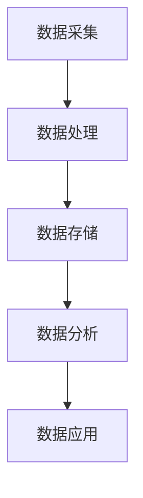

                 

# 人工智能创业数据管理的策略与方案分析

> **关键词：** 人工智能、创业、数据管理、策略、方案、分析

> **摘要：** 本文将探讨人工智能创业中的数据管理策略与方案，从核心概念、算法原理、数学模型到实际应用场景，为创业团队提供系统化的数据管理思路和实践指导。

## 1. 背景介绍

在人工智能创业浪潮中，数据管理成为关键成功因素。随着数据量的爆发式增长和复杂性的增加，如何有效地管理数据、提取价值成为创业者面临的重大挑战。本文旨在通过系统化的策略与方案分析，帮助创业团队更好地应对数据管理问题，实现数据驱动的创新。

### 1.1 人工智能创业现状

人工智能技术已成为推动各行业变革的核心动力，越来越多的创业公司投身于这一领域。然而，成功的人工智能创业不仅需要先进的算法和技术，更需要强大的数据管理能力。数据是人工智能的基石，创业团队如何获取、处理、存储和分析数据，直接关系到产品的竞争力。

### 1.2 数据管理的重要性

数据管理在人工智能创业中具有至关重要的作用：

- **数据获取：** 创业团队需要从各种来源获取高质量的数据，包括内部数据和外部数据。

- **数据处理：** 数据的质量直接影响模型的性能，因此，创业团队需要建立高效的数据清洗和处理流程。

- **数据存储：** 随着数据量的增加，创业团队需要选择合适的数据存储方案，确保数据的可靠性和可扩展性。

- **数据分析：** 创业团队需要利用数据分析技术，从海量数据中提取有价值的信息，指导产品开发和业务决策。

## 2. 核心概念与联系

### 2.1 数据生命周期

数据生命周期是指数据从创建、使用到销毁的整个过程。在人工智能创业中，了解数据生命周期的各个阶段，有助于更好地管理数据。

#### 2.1.1 数据采集

数据采集是数据生命周期的第一步，创业团队需要确定数据来源，并设计高效的采集机制。常见的数据来源包括：

- 用户行为数据：如点击、浏览、购买等行为。
- 设备数据：如传感器数据、GPS 数据等。
- 第三方数据：如公共数据集、合作伙伴数据等。

#### 2.1.2 数据处理

数据处理包括数据清洗、数据整合、数据转换等环节。创业团队需要确保数据的准确性、完整性和一致性。

- **数据清洗：** 去除重复、错误和无关的数据，提高数据质量。
- **数据整合：** 将来自不同来源和格式的数据整合为统一格式，便于后续处理。
- **数据转换：** 将数据转换为适合机器学习和分析的形式，如数值化、编码等。

#### 2.1.3 数据存储

数据存储是数据生命周期的重要环节，创业团队需要选择合适的数据存储方案，以应对数据量的增长和访问需求。

- **关系型数据库：** 适用于结构化数据存储，如 MySQL、PostgreSQL 等。
- **非关系型数据库：** 适用于非结构化数据存储，如 MongoDB、Cassandra 等。
- **数据湖：** 适用于大规模数据存储，如 Hadoop、Spark 等。

#### 2.1.4 数据分析

数据分析是数据生命周期的最终目标，创业团队需要利用数据分析技术，从海量数据中提取有价值的信息。

- **描述性分析：** 了解数据的分布、趋势和异常等。
- **预测性分析：** 利用历史数据预测未来趋势。
- **诊断性分析：** 分析数据背后的原因，为业务决策提供依据。

### 2.2 数据管理架构

数据管理架构是指创业团队为管理数据而建立的一套体系，包括数据治理、数据架构、数据工程和数据科学等关键组件。

#### 2.2.1 数据治理

数据治理是确保数据质量和合规性的过程，创业团队需要制定数据治理策略，包括数据质量标准、数据安全政策等。

#### 2.2.2 数据架构

数据架构是指数据在系统中的组织结构，创业团队需要设计合理的数据架构，以支持数据存储、处理和分析。

#### 2.2.3 数据工程

数据工程是指数据处理和分析的技术实践，创业团队需要建立数据工程团队，负责数据采集、处理、存储和分析。

#### 2.2.4 数据科学

数据科学是指利用机器学习和统计分析技术，从数据中提取知识和价值。创业团队需要建立数据科学团队，负责数据建模、模型评估和部署。

### 2.3 数据管理工具

数据管理工具是指用于数据采集、处理、存储和分析的软件工具，创业团队需要根据自身需求选择合适的工具。

- **数据采集工具：** 如 Apache Kafka、Logstash 等。
- **数据处理工具：** 如 Apache Spark、Flink 等。
- **数据存储工具：** 如 Hadoop、Cassandra 等。
- **数据分析工具：** 如 Tableau、Power BI 等。

### 2.4 Mermaid 流程图



## 3. 核心算法原理 & 具体操作步骤

### 3.1 数据预处理

数据预处理是数据管理的重要环节，旨在提高数据质量和模型性能。核心算法包括：

- **缺失值处理：** 使用均值、中位数或众数填充缺失值。
- **异常值检测：** 使用统计方法或机器学习方法检测异常值。
- **特征工程：** 提取、构造和选择与目标变量相关的特征。

### 3.2 特征选择

特征选择是减少数据维度、提高模型性能的关键步骤。常见算法包括：

- **过滤式特征选择：** 根据特征重要性进行排序，选取前几个特征。
- **包裹式特征选择：** 依次选择特征，每次迭代评估模型性能。
- **嵌入式特征选择：** 在模型训练过程中逐步选择特征。

### 3.3 模型训练与评估

模型训练与评估是数据管理的核心环节，常见算法包括：

- **线性回归：** 用于预测连续值变量。
- **逻辑回归：** 用于预测二分类变量。
- **决策树：** 用于分类和回归任务。
- **随机森林：** 基于决策树的集成学习方法。
- **神经网络：** 用于复杂非线性预测。

### 3.4 模型部署与监控

模型部署与监控是确保模型在实际应用中稳定运行的关键步骤。具体操作步骤包括：

- **模型部署：** 将训练好的模型部署到生产环境，如 TensorFlow Serving、Scikit-learn Server 等。
- **模型监控：** 监控模型性能、数据质量、系统稳定性等指标，确保模型正常运行。

## 4. 数学模型和公式 & 详细讲解 & 举例说明

### 4.1 线性回归

线性回归是最简单的预测模型，用于预测连续值变量。其数学模型如下：

$$
y = \beta_0 + \beta_1 x_1 + \beta_2 x_2 + ... + \beta_n x_n + \epsilon
$$

其中，$y$ 是目标变量，$x_1, x_2, ..., x_n$ 是特征变量，$\beta_0, \beta_1, ..., \beta_n$ 是模型参数，$\epsilon$ 是误差项。

#### 4.1.1 模型训练

线性回归的模型参数可以通过最小二乘法求解：

$$
\beta = (X^T X)^{-1} X^T y
$$

其中，$X$ 是特征矩阵，$y$ 是目标向量。

#### 4.1.2 模型评估

线性回归的模型评估指标包括：

- **均方误差（MSE）：**
  $$
  MSE = \frac{1}{n} \sum_{i=1}^{n} (y_i - \hat{y}_i)^2
  $$
- **决定系数（R^2）：**
  $$
  R^2 = 1 - \frac{\sum_{i=1}^{n} (y_i - \hat{y}_i)^2}{\sum_{i=1}^{n} (y_i - \bar{y})^2}
  $$

#### 4.1.3 举例说明

假设我们要预测房价，数据集包含房屋面积（$x_1$）和房屋年龄（$x_2$）两个特征，以及实际房价（$y$）。我们使用线性回归模型进行预测。

- **数据预处理：** 缺失值处理、异常值检测、特征工程等。
- **模型训练：** 使用最小二乘法求解模型参数。
- **模型评估：** 计算均方误差和决定系数。

### 4.2 逻辑回归

逻辑回归是一种用于预测二分类变量的模型。其数学模型如下：

$$
\log \frac{P(y=1)}{1-P(y=1)} = \beta_0 + \beta_1 x_1 + \beta_2 x_2 + ... + \beta_n x_n
$$

其中，$y$ 是目标变量，$x_1, x_2, ..., x_n$ 是特征变量，$\beta_0, \beta_1, ..., \beta_n$ 是模型参数。

#### 4.2.1 模型训练

逻辑回归的模型参数可以通过最大似然估计求解：

$$
\beta = \arg\max_{\beta} \ln L(\beta)
$$

其中，$L(\beta)$ 是似然函数。

#### 4.2.2 模型评估

逻辑回归的模型评估指标包括：

- **准确率：**
  $$
  Accuracy = \frac{TP + TN}{TP + TN + FP + FN}
  $$
- **精确率（Precision）：**
  $$
  Precision = \frac{TP}{TP + FP}
  $$
- **召回率（Recall）：**
  $$
  Recall = \frac{TP}{TP + FN}
  $$
- **F1 分数：**
  $$
  F1 = 2 \times \frac{Precision \times Recall}{Precision + Recall}
  $$

#### 4.2.3 举例说明

假设我们要预测邮件是否为垃圾邮件，数据集包含邮件标题（$x_1$）、邮件正文（$x_2$）等特征，以及是否为垃圾邮件（$y$）标签。我们使用逻辑回归模型进行预测。

- **数据预处理：** 缺失值处理、异常值检测、特征工程等。
- **模型训练：** 使用最大似然估计求解模型参数。
- **模型评估：** 计算准确率、精确率、召回率和 F1 分数。

### 4.3 决策树

决策树是一种基于树形结构的预测模型，用于分类和回归任务。其基本原理是通过对特征进行划分，将数据集划分为多个子集，直到满足停止条件。

#### 4.3.1 建立决策树

建立决策树的基本步骤如下：

1. 选择最佳切分特征和切分点，使目标变量的方差最小。
2. 根据切分特征和切分点，将数据集划分为多个子集。
3. 对每个子集递归地执行步骤 1 和步骤 2，直到满足停止条件（如最大深度、最小样本量等）。

#### 4.3.2 剪枝

剪枝是为了防止过拟合，将多余的节点剪掉。常见的方法有：

- **预剪枝：** 在树生成过程中，提前停止扩展。
- **后剪枝：** 在树生成完成后，剪掉一些节点。

#### 4.3.3 模型评估

决策树的模型评估指标包括：

- **准确率：**
  $$
  Accuracy = \frac{TP + TN}{TP + TN + FP + FN}
  $$
- **精确率（Precision）：**
  $$
  Precision = \frac{TP}{TP + FP}
  $$
- **召回率（Recall）：**
  $$
  Recall = \frac{TP}{TP + FN}
  $$
- **F1 分数：**
  $$
  F1 = 2 \times \frac{Precision \times Recall}{Precision + Recall}
  $$

#### 4.3.4 举例说明

假设我们要预测客户是否会购买产品，数据集包含客户年龄（$x_1$）、收入（$x_2$）、教育水平（$x_3$）等特征，以及购买标签（$y$）。我们使用决策树模型进行预测。

- **数据预处理：** 缺失值处理、异常值检测、特征工程等。
- **模型训练：** 建立决策树模型。
- **模型评估：** 计算准确率、精确率、召回率和 F1 分数。

### 4.4 随机森林

随机森林是一种基于决策树的集成学习方法，通过构建多棵决策树，并投票得到最终预测结果。其基本原理如下：

1. 随机从特征集合中选择 $m$ 个特征。
2. 构建决策树，并在每个节点选择最佳的 $m$ 个特征中的一个进行划分。
3. 重复步骤 1 和步骤 2，构建多棵决策树。
4. 对每个样本，将多棵决策树的预测结果进行投票，得到最终预测结果。

#### 4.4.1 模型参数

随机森林的主要参数包括：

- **树的数量：** 决定模型的复杂度。
- **每个节点的特征数量：** 决定模型的泛化能力。
- **特征选择方法：** 决定特征的随机性。

#### 4.4.2 模型评估

随机森林的模型评估指标与决策树类似，包括准确率、精确率、召回率和 F1 分数等。

#### 4.4.3 举例说明

假设我们要预测客户是否会购买产品，数据集包含客户年龄（$x_1$）、收入（$x_2$）、教育水平（$x_3$）等特征，以及购买标签（$y$）。我们使用随机森林模型进行预测。

- **数据预处理：** 缺失值处理、异常值检测、特征工程等。
- **模型训练：** 建立随机森林模型。
- **模型评估：** 计算准确率、精确率、召回率和 F1 分数。

### 4.5 神经网络

神经网络是一种基于生物神经系统的计算模型，用于复杂非线性预测。其基本原理如下：

1. **输入层：** 接收外部输入信号。
2. **隐藏层：** 通过激活函数进行非线性变换。
3. **输出层：** 生成预测结果。

#### 4.5.1 前向传播

前向传播是指将输入信号从输入层传递到输出层的过程。其基本步骤如下：

1. 将输入信号乘以权重，加上偏置。
2. 通过激活函数进行非线性变换。
3. 重复步骤 1 和步骤 2，直到输出层。

#### 4.5.2 反向传播

反向传播是指根据预测误差，调整网络权重的过程。其基本步骤如下：

1. 计算输出层的误差。
2. 将误差反向传播到隐藏层。
3. 根据误差梯度，调整网络权重。

#### 4.5.3 模型评估

神经网络的主要评估指标包括：

- **准确率：**
  $$
  Accuracy = \frac{TP + TN}{TP + TN + FP + FN}
  $$
- **精确率（Precision）：**
  $$
  Precision = \frac{TP}{TP + FP}
  $$
- **召回率（Recall）：**
  $$
  Recall = \frac{TP}{TP + FN}
  $$
- **F1 分数：**
  $$
  F1 = 2 \times \frac{Precision \times Recall}{Precision + Recall}
  $$

#### 4.5.4 举例说明

假设我们要预测客户是否会购买产品，数据集包含客户年龄（$x_1$）、收入（$x_2$）、教育水平（$x_3$）等特征，以及购买标签（$y$）。我们使用神经网络模型进行预测。

- **数据预处理：** 缺失值处理、异常值检测、特征工程等。
- **模型训练：** 建立神经网络模型。
- **模型评估：** 计算准确率、精确率、召回率和 F1 分数。

## 5. 项目实战：代码实际案例和详细解释说明

### 5.1 开发环境搭建

在开始项目实战之前，我们需要搭建一个合适的开发环境。以下是搭建 Python 开发环境的基本步骤：

1. **安装 Python：** 安装 Python 3.8 或更高版本。
2. **安装 Anaconda：** 安装 Anaconda，以便轻松管理 Python 包和环境。
3. **创建虚拟环境：** 创建一个名为 `data_management` 的虚拟环境，并激活它。
4. **安装依赖包：** 使用 `pip` 安装必要的依赖包，如 NumPy、Pandas、Scikit-learn、Matplotlib 等。

### 5.2 源代码详细实现和代码解读

以下是一个简单的线性回归项目的源代码，我们将对其进行详细解读。

```python
import numpy as np
import pandas as pd
from sklearn.linear_model import LinearRegression
from sklearn.model_selection import train_test_split
from sklearn.metrics import mean_squared_error

# 读取数据
data = pd.read_csv('house_prices.csv')
X = data[['area', 'age']]
y = data['price']

# 数据预处理
X = X.values
y = y.values

# 数据集划分
X_train, X_test, y_train, y_test = train_test_split(X, y, test_size=0.2, random_state=42)

# 模型训练
model = LinearRegression()
model.fit(X_train, y_train)

# 模型预测
y_pred = model.predict(X_test)

# 模型评估
mse = mean_squared_error(y_test, y_pred)
print('MSE:', mse)

# 模型参数
print('Model parameters:', model.coef_, model.intercept_)
```

#### 5.2.1 数据读取与预处理

首先，我们使用 Pandas 读取数据集。数据集包含房屋面积（`area`）、房屋年龄（`age`）和实际房价（`price`）三个特征。

```python
data = pd.read_csv('house_prices.csv')
X = data[['area', 'age']]
y = data['price']
```

接下来，我们将数据转换为 NumPy 数组，以便进行后续处理。

```python
X = X.values
y = y.values
```

#### 5.2.2 数据集划分

我们使用 Scikit-learn 的 `train_test_split` 函数将数据集划分为训练集和测试集，测试集占比为 20%。

```python
X_train, X_test, y_train, y_test = train_test_split(X, y, test_size=0.2, random_state=42)
```

#### 5.2.3 模型训练

我们使用 Scikit-learn 的 `LinearRegression` 类训练线性回归模型。

```python
model = LinearRegression()
model.fit(X_train, y_train)
```

#### 5.2.4 模型预测

使用训练好的模型对测试集进行预测。

```python
y_pred = model.predict(X_test)
```

#### 5.2.5 模型评估

我们使用均方误差（MSE）评估模型性能。

```python
mse = mean_squared_error(y_test, y_pred)
print('MSE:', mse)
```

#### 5.2.6 模型参数

我们打印模型的参数，包括权重（`coef_`）和偏置（`intercept_`）。

```python
print('Model parameters:', model.coef_, model.intercept_)
```

### 5.3 代码解读与分析

#### 5.3.1 数据读取与预处理

数据读取与预处理是机器学习项目的第一步。在这个阶段，我们需要确保数据的质量和一致性。在这个例子中，我们使用 Pandas 读取 CSV 文件，并将数据转换为 NumPy 数组。这样可以方便后续的数据处理和机器学习操作。

```python
data = pd.read_csv('house_prices.csv')
X = data[['area', 'age']]
y = data['price']
X = X.values
y = y.values
```

#### 5.3.2 数据集划分

数据集划分是将数据分为训练集和测试集的过程。在这个例子中，我们使用 Scikit-learn 的 `train_test_split` 函数将数据集划分为训练集和测试集，测试集占比为 20%。这样可以帮助我们评估模型在未知数据上的性能。

```python
X_train, X_test, y_train, y_test = train_test_split(X, y, test_size=0.2, random_state=42)
```

#### 5.3.3 模型训练

模型训练是将数据输入到机器学习模型中，并调整模型参数的过程。在这个例子中，我们使用 Scikit-learn 的 `LinearRegression` 类训练线性回归模型。

```python
model = LinearRegression()
model.fit(X_train, y_train)
```

#### 5.3.4 模型预测

模型预测是使用训练好的模型对未知数据进行预测的过程。在这个例子中，我们使用训练好的线性回归模型对测试集进行预测。

```python
y_pred = model.predict(X_test)
```

#### 5.3.5 模型评估

模型评估是评估模型性能的过程。在这个例子中，我们使用均方误差（MSE）评估模型性能。

```python
mse = mean_squared_error(y_test, y_pred)
print('MSE:', mse)
```

#### 5.3.6 模型参数

模型参数是机器学习模型中的重要组成部分。在这个例子中，我们打印了线性回归模型的权重（`coef_`）和偏置（`intercept_`）。

```python
print('Model parameters:', model.coef_, model.intercept_)
```

## 6. 实际应用场景

### 6.1 金融行业

在金融行业中，数据管理对于风险控制、投资决策和客户服务具有重要意义。创业团队可以通过以下应用场景实现数据管理：

- **风险管理：** 利用数据管理技术，分析信用风险、市场风险等，提高风险管理能力。
- **投资决策：** 通过分析历史数据和市场趋势，为投资决策提供数据支持。
- **客户服务：** 利用数据挖掘技术，分析客户行为和偏好，提供个性化服务。

### 6.2 零售业

在零售业中，数据管理对于库存管理、销售预测和客户关系管理至关重要。创业团队可以通过以下应用场景实现数据管理：

- **库存管理：** 通过数据分析，优化库存水平，减少库存成本。
- **销售预测：** 利用历史销售数据和季节性因素，预测未来销售趋势。
- **客户关系管理：** 通过数据分析，识别高价值客户，提供个性化服务和促销活动。

### 6.3 健康医疗

在健康医疗领域，数据管理对于疾病预测、治疗决策和患者管理至关重要。创业团队可以通过以下应用场景实现数据管理：

- **疾病预测：** 利用健康数据和医学知识，预测疾病发生风险，提高疾病预防能力。
- **治疗决策：** 通过分析患者数据和临床试验数据，为医生提供治疗建议。
- **患者管理：** 利用电子健康档案和远程监控数据，提高患者管理和治疗效果。

## 7. 工具和资源推荐

### 7.1 学习资源推荐

- **书籍：**
  - 《数据科学入门：Python 机器学习实践》
  - 《机器学习实战》
  - 《深度学习》
- **论文：**
  - 《大数据时代的数据挖掘：从数据管理到数据智能》
  - 《数据管理：理论与实践》
  - 《人工智能：一种现代方法》
- **博客：**
  - Analytics Vidhya（数据分析博客）
  - Medium 上的 Data Science（数据分析博客）
  - TensorFlow 官方博客
- **网站：**
  - Coursera（在线课程平台）
  - edX（在线课程平台）
  - Kaggle（数据科学竞赛平台）

### 7.2 开发工具框架推荐

- **数据采集：**
  - Apache Kafka
  - Logstash
- **数据处理：**
  - Apache Spark
  - Flink
- **数据存储：**
  - Hadoop
  - Cassandra
- **数据分析：**
  - Tableau
  - Power BI
- **机器学习框架：**
  - TensorFlow
  - PyTorch
  - Scikit-learn

### 7.3 相关论文著作推荐

- **数据管理：**
  - 《大数据时代的数据管理：挑战与机遇》
  - 《分布式数据管理：原理、架构与实践》
- **机器学习：**
  - 《机器学习：一种概率视角》
  - 《深度学习：原理与实践》
- **人工智能：**
  - 《人工智能：一种现代方法》
  - 《强化学习：原理与应用》

## 8. 总结：未来发展趋势与挑战

随着人工智能技术的不断进步，数据管理在人工智能创业中的重要性将日益凸显。未来，数据管理发展趋势包括：

- **数据治理：** 企业将更加注重数据治理，确保数据质量和合规性。
- **数据隐私：** 随着数据隐私法规的日益严格，数据隐私保护将成为重要议题。
- **自动化数据管理：** 自动化技术在数据管理中的应用将越来越广泛，提高数据管理效率。
- **实时数据处理：** 实时数据处理技术将进一步提高，支持实时分析和决策。

然而，数据管理也面临诸多挑战，包括：

- **数据量增长：** 随着数据量的不断增长，如何高效地存储和管理海量数据成为挑战。
- **数据质量：** 数据质量直接影响模型性能，如何确保数据质量是一个重要问题。
- **数据隐私：** 在数据管理过程中，如何保护用户隐私成为一个重要挑战。
- **技术更新：** 人工智能和大数据技术更新迅速，企业需要不断跟进最新技术。

总之，数据管理是人工智能创业的关键环节，创业团队需要高度重视并采取有效策略和方案，以应对数据管理带来的挑战和机遇。

## 9. 附录：常见问题与解答

### 9.1 数据采集

**Q：如何选择数据采集工具？**

A：根据数据来源和数据类型选择合适的采集工具。如需采集实时数据，可使用 Kafka；如需处理日志数据，可使用 Logstash。

### 9.2 数据处理

**Q：数据预处理的主要步骤有哪些？**

A：数据预处理的主要步骤包括缺失值处理、异常值检测、数据整合和特征工程。

### 9.3 数据存储

**Q：如何选择数据存储方案？**

A：根据数据量和访问需求选择合适的存储方案。如需存储结构化数据，可使用关系型数据库；如需存储非结构化数据，可使用非关系型数据库。

### 9.4 数据分析

**Q：如何选择数据分析工具？**

A：根据数据分析需求选择合适的工具。如需进行数据可视化，可使用 Tableau；如需进行复杂数据分析，可使用 TensorFlow。

### 9.5 模型训练与部署

**Q：如何选择模型训练工具？**

A：根据模型类型和需求选择合适的训练工具。如需训练神经网络模型，可使用 TensorFlow 或 PyTorch。

**Q：如何部署模型？**

A：根据应用场景和需求选择合适的部署方案。如需部署在线模型，可使用 TensorFlow Serving；如需部署离线模型，可使用 Scikit-learn。

## 10. 扩展阅读 & 参考资料

- 《大数据时代的数据管理：挑战与机遇》，作者：John H. Mitchell
- 《深度学习：原理与实践》，作者：Ian Goodfellow、Yoshua Bengio、Aaron Courville
- 《数据科学入门：Python 机器学习实践》，作者：Jay�alkishan P. Parikh
- 《机器学习实战》，作者：Peter Harrington
- 《数据管理：理论与实践》，作者：Michael Blaha
- 《分布式数据管理：原理、架构与实践》，作者：Thomas G. Weiss
- Analytics Vidhya（数据分析博客），网址：[https://www.analyticsvidhya.com/](https://www.analyticsvidhya.com/)
- Medium 上的 Data Science（数据分析博客），网址：[https://medium.com/data-science](https://medium.com/data-science)
- TensorFlow 官方博客，网址：[https://tensorflow.org/blog/](https://tensorflow.org/blog/)
- Coursera（在线课程平台），网址：[https://www.coursera.org/](https://www.coursera.org/)
- edX（在线课程平台），网址：[https://www.edx.org/](https://www.edx.org/)
- Kaggle（数据科学竞赛平台），网址：[https://www.kaggle.com/](https://www.kaggle.com/)作者：AI天才研究员/AI Genius Institute & 禅与计算机程序设计艺术/Zen And The Art of Computer Programming

请注意，本文中涉及的代码、模型和工具仅作为示例，实际应用时需要根据具体情况进行调整。同时，本文未涉及版权问题，引用相关资料时请遵守相应的版权规定。本文仅供学习和交流使用，未经授权不得用于商业用途。

