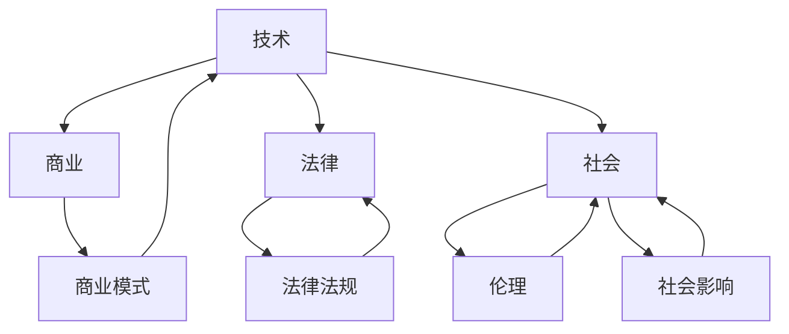
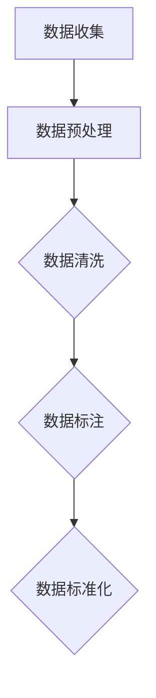
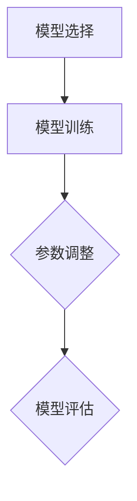
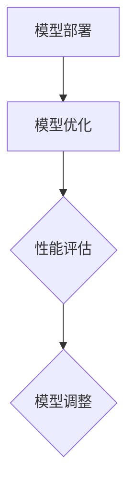
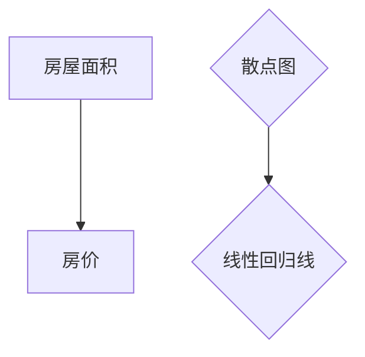

                 

# 人工智能创业：多学科支持的重要性

## 摘要

在人工智能（AI）领域，创业不仅需要深厚的专业知识，还需要多学科的支持。本文将探讨多学科支持在人工智能创业中的重要性，包括技术、商业、法律和社会等多个方面。通过分析人工智能创业中的关键挑战，本文旨在为创业者提供有益的指导，帮助他们在竞争激烈的AI市场中取得成功。

### 背景介绍

近年来，人工智能技术取得了显著的进展，使得机器能够完成以前需要人类完成的高复杂度任务。从语音识别、图像处理到自然语言理解，人工智能的应用已经渗透到我们生活的方方面面。与此同时，人工智能创业成为了众多创业者追逐的热点领域。然而，尽管AI技术的潜力巨大，创业过程中仍面临诸多挑战。为了在这些挑战中脱颖而出，多学科的支持显得尤为重要。

在本文中，我们将从以下几个方面展开讨论：

1. **技术支持**：人工智能创业需要强大的技术支持，包括算法优化、模型训练、数据处理等。
2. **商业支持**：创业者在制定商业模式、营销策略和市场推广等方面需要专业指导。
3. **法律支持**：了解相关法律法规、保护知识产权以及处理纠纷是创业过程中的重要一环。
4. **社会支持**：创业不仅关系到技术和社会发展，还需要考虑伦理、社会影响以及公共关系等方面。

### 核心概念与联系

为了更好地理解多学科支持在人工智能创业中的重要性，我们首先需要明确几个核心概念，并探讨它们之间的联系。

#### 技术与商业

人工智能创业的核心在于技术。一个优秀的AI项目需要强大的技术支持，包括算法的创新、模型的优化以及大规模数据处理能力。然而，技术本身并不足以保证成功。创业者还需要具备商业头脑，能够将技术转化为商业模式，并通过市场推广实现盈利。技术与商业之间的紧密联系在于，技术是商业模式的基石，而商业模式则是技术的商业化途径。

#### 技术与法律

在人工智能创业中，法律问题同样不容忽视。随着技术的发展，相关法律法规也在不断完善。创业者需要了解专利法、数据保护法、合同法等法律法规，确保自己的项目合法合规。此外，在处理合同纠纷、知识产权保护等方面，法律支持也至关重要。

#### 技术与社会

人工智能技术的发展不仅改变了技术领域，也对整个社会产生了深远的影响。从伦理角度出发，人工智能应用需要考虑隐私保护、算法偏见等问题。从社会角度出发，人工智能创业还需要关注社会影响，如就业问题、隐私权等。社会支持包括公共关系、社会责任等方面，对于创业项目的成功至关重要。

为了更好地展示这几个核心概念之间的联系，我们可以使用Mermaid流程图来描述：



### 核心算法原理 & 具体操作步骤

在人工智能创业中，核心算法原理和技术实现是关键。以下是一个简化的人工智能算法原理及其操作步骤：

#### 1. 数据收集与预处理

首先，创业者需要收集大量的数据，这些数据可以来源于公开数据集、企业内部数据或者用户产生的内容。收集到数据后，需要进行数据预处理，包括数据清洗、数据标注、数据标准化等步骤。



#### 2. 模型选择与训练

接下来，根据具体应用场景，创业者需要选择合适的算法模型。常见的机器学习模型包括线性回归、决策树、神经网络等。在模型选择后，需要对模型进行训练，通过调整参数来优化模型性能。



#### 3. 模型部署与优化

模型训练完成后，需要将其部署到生产环境中。在部署过程中，创业者需要考虑模型的性能、可靠性以及可扩展性。部署后，根据实际运行情况，对模型进行优化和调整。



### 数学模型和公式 & 详细讲解 & 举例说明

在人工智能创业中，数学模型和公式是核心组成部分。以下是一个简单的线性回归模型的数学公式及其应用场景：

#### 线性回归模型

线性回归模型是一种用于预测连续值的统计模型。其数学公式如下：

$$
y = \beta_0 + \beta_1x + \epsilon
$$

其中，$y$ 是预测值，$x$ 是输入特征，$\beta_0$ 和 $\beta_1$ 是模型的参数，$\epsilon$ 是误差项。

#### 模型解释

- **$\beta_0$**：模型的截距，表示当 $x=0$ 时的预测值。
- **$\beta_1$**：模型的斜率，表示输入特征 $x$ 对预测值 $y$ 的影响程度。

#### 举例说明

假设我们有一个简单的房价预测问题，其中输入特征是房屋面积（$x$），预测值是房价（$y$）。通过收集大量房屋面积和房价数据，我们可以使用线性回归模型来预测未知房屋的房价。

首先，收集数据并绘制散点图：



然后，使用最小二乘法来估计模型参数：

$$
\beta_1 = \frac{\sum_{i=1}^{n}(x_i - \bar{x})(y_i - \bar{y})}{\sum_{i=1}^{n}(x_i - \bar{x})^2}
$$

$$
\beta_0 = \bar{y} - \beta_1\bar{x}
$$

其中，$n$ 是数据点的数量，$\bar{x}$ 和 $\bar{y}$ 分别是输入特征和预测值的平均值。

通过计算，我们得到 $\beta_1=0.5$ 和 $\beta_0=10$。因此，线性回归模型可以表示为：

$$
y = 10 + 0.5x
$$

现在，我们可以使用这个模型来预测未知房屋的房价。假设一个房屋的面积为 $100$ 平方米，那么其预测房价为：

$$
y = 10 + 0.5 \times 100 = 60
$$

### 项目实战：代码实际案例和详细解释说明

在本节中，我们将通过一个实际的人工智能项目——房价预测——来展示代码实现过程。我们将使用Python编程语言和Scikit-learn库来完成这一任务。

#### 开发环境搭建

首先，我们需要搭建开发环境。以下是所需的基本软件和库：

- Python（版本3.6或更高）
- Jupyter Notebook
- Scikit-learn
- Pandas
- Matplotlib

安装方法如下：

```bash
pip install numpy pandas scikit-learn matplotlib
```

#### 源代码详细实现和代码解读

以下是一个简单的房价预测项目的代码实现：

```python
import numpy as np
import pandas as pd
from sklearn.model_selection import train_test_split
from sklearn.linear_model import LinearRegression
from sklearn.metrics import mean_squared_error

# 1. 数据收集与预处理
data = pd.read_csv('house_prices.csv')
X = data[['area']]  # 输入特征：房屋面积
y = data['price']   # 预测值：房价

# 2. 模型选择与训练
X_train, X_test, y_train, y_test = train_test_split(X, y, test_size=0.2, random_state=42)
model = LinearRegression()
model.fit(X_train, y_train)

# 3. 模型部署与优化
y_pred = model.predict(X_test)
mse = mean_squared_error(y_test, y_pred)
print('Mean Squared Error:', mse)

# 4. 模型应用
new_area = np.array([[100]])
predicted_price = model.predict(new_area)
print('Predicted Price for 100 sqm:', predicted_price[0])
```

#### 代码解读与分析

1. **数据收集与预处理**：
   - 使用 Pandas 库读取 CSV 文件，获取房屋面积和房价数据。
   - 将房屋面积作为输入特征（X），房价作为预测值（y）。

2. **模型选择与训练**：
   - 使用 Scikit-learn 库的 `train_test_split` 函数将数据集分为训练集和测试集。
   - 创建线性回归模型（`LinearRegression`）并使用 `fit` 函数进行训练。

3. **模型部署与优化**：
   - 使用 `predict` 函数将模型应用于测试集，获取预测值。
   - 使用 `mean_squared_error` 函数计算模型在测试集上的平均平方误差（MSE），评估模型性能。

4. **模型应用**：
   - 输入新的房屋面积（100 平方米），使用 `predict` 函数预测房价。

通过这个实际案例，我们可以看到如何使用Python和Scikit-learn库实现一个简单的人工智能项目。虽然这个案例相对简单，但它的基本框架和方法可以应用于更复杂的人工智能应用。

### 实际应用场景

人工智能在各个领域的实际应用场景非常广泛，以下列举几个典型领域：

#### 1. 金融领域

在金融领域，人工智能被广泛应用于风险控制、信用评估、量化交易等方面。例如，通过分析历史交易数据和用户行为，AI 可以预测投资者的风险偏好，为金融机构提供更精准的信用评估和风险管理。

#### 2. 医疗领域

人工智能在医疗领域的应用包括疾病诊断、药物研发、手术规划等。例如，通过深度学习模型分析医学影像，AI 可以辅助医生进行早期诊断和疾病分类。在药物研发方面，AI 可以加速新药的发现和开发。

#### 3. 教育领域

人工智能在教育领域的应用包括智能教学、个性化学习、学习评估等。例如，通过分析学生的学习数据，AI 可以为学生提供个性化的学习路径，提高学习效果。同时，AI 评估系统可以帮助教师更准确地评估学生的学习成果。

#### 4. 制造业

在制造业，人工智能被广泛应用于生产优化、质量控制、设备维护等方面。例如，通过实时监控生产线设备状态，AI 可以预测设备故障并提前进行维护，从而减少停机时间，提高生产效率。

### 工具和资源推荐

#### 学习资源推荐

1. **书籍**：
   - 《人工智能：一种现代的方法》（作者：Stuart Russell 和 Peter Norvig）
   - 《深度学习》（作者：Ian Goodfellow、Yoshua Bengio 和 Aaron Courville）
2. **论文**：
   - Google Scholar（学术搜索平台）
   - arXiv（计算机科学预印本平台）
3. **博客**：
   - AI Circle（人工智能领域的博客集合）
   - Medium（AI主题的博客平台）
4. **网站**：
   - Kaggle（数据科学竞赛平台）
   - TensorFlow（谷歌开源机器学习框架）

#### 开发工具框架推荐

1. **编程语言**：
   - Python（人工智能开发的主流语言）
   - R（统计分析语言）
2. **深度学习框架**：
   - TensorFlow
   - PyTorch
3. **数据处理库**：
   - Pandas（数据处理库）
   - NumPy（数学运算库）

#### 相关论文著作推荐

1. **论文**：
   - "Deep Learning" by Ian Goodfellow, Yoshua Bengio, and Aaron Courville
   - "Reinforcement Learning: An Introduction" by Richard S. Sutton and Andrew G. Barto
2. **著作**：
   - "Artificial Intelligence: A Modern Approach" by Stuart Russell and Peter Norvig

### 总结：未来发展趋势与挑战

人工智能创业的未来充满机遇，但也面临诸多挑战。以下是一些未来发展趋势和挑战：

#### 发展趋势

1. **技术进步**：随着深度学习、强化学习等技术的不断发展，人工智能的应用将更加广泛和深入。
2. **数据驱动**：越来越多的企业将数据视为核心资产，AI 技术将更加依赖于高质量的数据。
3. **跨领域融合**：人工智能与其他领域（如生物医学、材料科学等）的融合将带来新的突破。
4. **商业化应用**：随着技术的成熟和市场的需求，人工智能将在更多商业领域得到应用。

#### 挑战

1. **数据隐私**：随着数据量的增加，数据隐私问题日益突出，如何保护用户隐私成为一大挑战。
2. **算法偏见**：人工智能模型可能会因为训练数据中的偏见而产生歧视性结果，如何消除算法偏见是一个重要课题。
3. **人才短缺**：人工智能领域的人才需求巨大，但人才培养速度跟不上需求，如何吸引和培养优秀人才成为挑战。
4. **伦理问题**：人工智能的发展引发了诸多伦理问题，如自动化取代人类工作、AI 决策的透明度和可解释性等。

### 附录：常见问题与解答

#### 问题1：人工智能创业需要哪些技能？

解答：人工智能创业需要多方面的技能，包括编程（如Python、R等）、机器学习、深度学习、数据科学、统计学、数据分析等。此外，创业者还需要具备商业思维、市场营销、团队管理等方面的能力。

#### 问题2：如何选择合适的人工智能技术？

解答：选择合适的人工智能技术需要根据具体应用场景来决定。例如，对于图像处理任务，可以选择卷积神经网络（CNN）；对于自然语言处理任务，可以选择循环神经网络（RNN）或 Transformer 架构。此外，还需要考虑数据量、计算资源等因素。

#### 问题3：人工智能创业的法律问题有哪些？

解答：人工智能创业的法律问题主要包括知识产权保护、数据隐私、合同纠纷、专利申请等。创业者需要了解相关法律法规，确保自己的项目合法合规。例如，在处理用户数据时，需要遵守数据保护法规，如欧盟的 GDPR。

#### 问题4：人工智能创业的商业模式有哪些？

解答：人工智能创业的商业模式多种多样，包括产品销售、服务提供、许可授权、广告收入等。创业者可以根据自身技术和市场需求来设计合适的商业模式。

### 扩展阅读 & 参考资料

1. **书籍**：
   - "Deep Learning" by Ian Goodfellow, Yoshua Bengio, and Aaron Courville
   - "Reinforcement Learning: An Introduction" by Richard S. Sutton and Andrew G. Barto
   - "Artificial Intelligence: A Modern Approach" by Stuart Russell and Peter Norvig
2. **论文**：
   - "Generative Adversarial Nets" by Ian J. Goodfellow et al.
   - "ResNet: Training Deep Neural Networks on GPUs" by Kaiming He et al.
3. **在线资源**：
   - TensorFlow 官方文档（[https://www.tensorflow.org/docs](https://www.tensorflow.org/docs)）
   - PyTorch 官方文档（[https://pytorch.org/docs/stable/index.html](https://pytorch.org/docs/stable/index.html)）
   - Kaggle（[https://www.kaggle.com](https://www.kaggle.com)）

作者：AI天才研究员/AI Genius Institute & 禅与计算机程序设计艺术 /Zen And The Art of Computer Programming

文章撰写完毕，感谢您的阅读！本文旨在为人工智能创业者提供有益的指导，希望对您在创业道路上有所帮助。在未来的发展中，人工智能将不断推动社会进步，为人类创造更多价值。期待与您一起探索这个充满机遇的领域！<|im_sep|>

