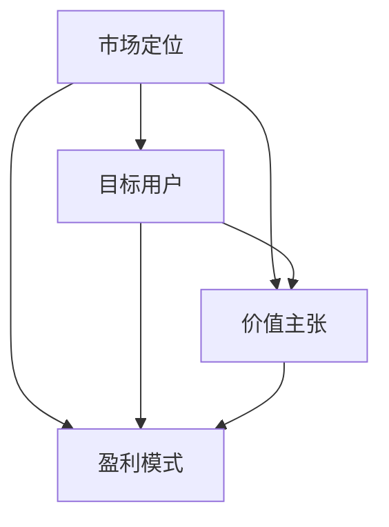

                 

### 背景介绍

在当今这个充满机遇和挑战的时代，人工智能（AI）技术的发展和应用已经深入到各行各业，成为推动社会进步的重要力量。无论是医疗、金融、交通、教育，还是零售、制造、能源，人工智能技术都在不断改变着我们的生活方式和商业模式。随着大数据、云计算、物联网等技术的快速发展，人工智能的市场潜力也越来越大。

在这个背景下，越来越多的创业者开始关注人工智能领域的创业机会。他们希望通过创新的技术和商业模式，抓住市场的风口，实现商业价值的最大化。然而，人工智能创业并非易事，其中涉及到技术难题、市场定位、商业策略等多方面的考量。对于许多创业者来说，明确自己的商业模式是成功的关键一步。

本文将围绕人工智能创业的商业模式展开讨论。我们将首先介绍人工智能创业的背景和趋势，然后深入探讨商业模式的核心概念，包括市场定位、目标用户、价值主张、盈利模式等。接着，我们将分析成功的人工智能创业案例，总结其商业模式的特点和成功经验。最后，我们将讨论人工智能创业面临的挑战和未来发展趋势，为读者提供一些实用的建议和启示。

通过这篇文章，我们希望帮助那些对人工智能创业充满热情的创业者们，明确自己的商业模式，找到适合自己的发展路径，从而在激烈的市场竞争中脱颖而出。

### 核心概念与联系

在探讨人工智能创业的商业模式之前，我们需要首先明确一些核心概念，并理解它们之间的联系。这些核心概念包括市场定位（Market Positioning）、目标用户（Target User）、价值主张（Value Proposition）和盈利模式（Revenue Model）。接下来，我们将通过Mermaid流程图来展示这些概念之间的关系，以便更直观地理解它们如何共同作用，构建一个成功的人工智能创业项目。

以下是核心概念的Mermaid流程图：



**市场定位（Market Positioning）**：市场定位是指企业在目标市场中所占据的位置，包括产品特性、品牌形象、价格定位等方面。对于人工智能创业项目，市场定位需要明确产品或服务在市场上的独特价值，以及如何与竞争对手区分开来。例如，是提供高效的人工智能解决方案，还是专注于特定的垂直领域，如医疗、金融或制造业。

**目标用户（Target User）**：目标用户是指那些最有可能使用或购买企业产品或服务的人群。在人工智能创业中，明确目标用户至关重要，因为这直接影响到产品的设计、功能和营销策略。例如，目标用户可能是需要提高生产效率的制造业企业，还是需要改善客户服务体验的零售企业。

**价值主张（Value Proposition）**：价值主张是企业向目标用户传递的核心价值和利益，是产品或服务的独特卖点。在人工智能创业中，价值主张需要明确产品如何解决用户的实际问题，提高效率、降低成本、提升用户体验等。例如，一款能够自动诊断医疗影像的人工智能系统，其价值主张可能是提高诊断准确性，减少误诊率。

**盈利模式（Revenue Model）**：盈利模式是企业通过提供产品或服务获取收益的方式。在人工智能创业中，常见的盈利模式包括订阅费、一次性销售、服务费、广告收入等。选择合适的盈利模式需要考虑市场需求、用户消费习惯、竞争对手策略等因素。

这些核心概念之间的联系如下：

- **市场定位**帮助创业者确定目标市场和产品特性，从而吸引目标用户。
- **目标用户**的需求和反馈可以指导企业的产品设计和优化，从而形成有效的**价值主张**。
- **价值主张**直接关系到用户的购买决策，进而影响**盈利模式**的选择和实施。

通过上述流程图，我们可以更清晰地看到这些核心概念在商业模式中的相互关系。市场定位决定了企业的市场策略，而目标用户的需求和反馈则影响了产品设计和价值主张的制定。最终，价值主张和盈利模式共同决定了企业的收入来源和盈利能力。

在接下来的章节中，我们将进一步探讨这些核心概念在实际创业中的应用，并通过具体案例来分析它们如何共同构建一个成功的人工智能创业项目。

### 核心算法原理 & 具体操作步骤

在人工智能创业项目中，算法原理是核心驱动力，决定了产品的性能和用户体验。在本章节中，我们将详细介绍一种常见的人工智能算法——深度学习（Deep Learning），并探讨其在商业模式中的应用。

#### 深度学习原理

深度学习是一种基于多层神经网络的学习方法，通过模拟人脑的神经元结构，实现数据的自动特征提取和模式识别。以下是深度学习的基本原理：

1. **神经网络结构**：深度学习模型通常由多个层次组成，包括输入层、隐藏层和输出层。每个层次由多个神经元（或节点）组成，神经元之间通过权重进行连接。

2. **前向传播（Forward Propagation）**：输入数据通过输入层传递到隐藏层，每一层的神经元对输入数据进行加权求和，并通过激活函数（如ReLU、Sigmoid或Tanh）进行非线性变换，最终传递到输出层。

3. **反向传播（Back Propagation）**：在输出层得到预测结果后，将实际结果与预测结果进行比较，计算误差。然后，通过反向传播算法，将误差反向传递到隐藏层和输入层，逐层调整权重，使模型不断优化。

4. **优化算法**：深度学习常用的优化算法包括梯度下降（Gradient Descent）、Adam（Adaptive Moment Estimation）等，用于调整模型参数，减少预测误差。

#### 具体操作步骤

1. **数据收集与预处理**：首先，需要收集大量与目标问题相关的数据，并进行清洗和预处理，如去除噪声、缺失值填充、数据标准化等。

2. **数据划分**：将数据集划分为训练集、验证集和测试集，用于模型训练、参数调整和性能评估。

3. **模型搭建**：设计神经网络结构，包括选择适当的激活函数、损失函数和优化算法。常用的深度学习框架如TensorFlow、PyTorch等提供了丰富的API和工具，方便搭建和训练模型。

4. **模型训练**：使用训练集数据对模型进行训练，通过多次迭代（Epoch）调整模型参数，使模型不断优化。

5. **模型评估**：使用验证集和测试集评估模型性能，通过准确率（Accuracy）、召回率（Recall）、F1分数（F1 Score）等指标评估模型的预测效果。

6. **模型部署**：将训练好的模型部署到生产环境中，如服务器、云平台或移动设备，为用户提供实时服务。

#### 案例分析

以医疗诊断为例，一个创业项目可能开发一款基于深度学习的心电图（ECG）诊断系统，具体步骤如下：

1. **数据收集与预处理**：收集大量心电图数据，包括正常和异常数据，对数据进行预处理，如去除噪声、基线漂移等。

2. **数据划分**：将数据集划分为训练集、验证集和测试集。

3. **模型搭建**：使用TensorFlow或PyTorch搭建深度学习模型，选择适当的神经网络结构、激活函数和损失函数。

4. **模型训练**：使用训练集数据对模型进行训练，通过多次迭代调整模型参数。

5. **模型评估**：使用验证集和测试集评估模型性能，如准确率、召回率等。

6. **模型部署**：将训练好的模型部署到服务器，为医生提供实时的心电图诊断服务。

通过上述步骤，创业项目可以为医疗机构提供高效、准确的心电图诊断服务，从而降低误诊率、提高诊断效率，实现商业价值。

在后续章节中，我们将进一步探讨如何将深度学习算法与商业模式相结合，为创业者提供实用的商业策略和启示。

### 数学模型和公式 & 详细讲解 & 举例说明

在深度学习算法中，数学模型和公式起到了至关重要的作用，它们不仅是算法设计和实现的基础，也是评估和优化模型性能的关键工具。在本章节中，我们将详细讲解深度学习中的几个核心数学模型和公式，并通过具体例子来说明它们的实际应用。

#### 损失函数（Loss Function）

损失函数是深度学习中的一个关键概念，用于衡量模型预测值与真实值之间的差距。常见的损失函数包括均方误差（MSE）、交叉熵损失（Cross-Entropy Loss）等。

1. **均方误差（MSE）**：
   均方误差是回归任务中常用的损失函数，用于计算预测值与真实值之间差异的平方和的平均值。

   公式如下：
   $$
   MSE = \frac{1}{n} \sum_{i=1}^{n} (y_i - \hat{y}_i)^2
   $$
   其中，$y_i$ 是真实值，$\hat{y}_i$ 是预测值，$n$ 是样本数量。

2. **交叉熵损失（Cross-Entropy Loss）**：
   交叉熵损失是分类任务中常用的损失函数，用于衡量预测概率分布与真实概率分布之间的差异。

   公式如下：
   $$
   Cross-Entropy = -\sum_{i=1}^{n} y_i \log(\hat{y}_i)
   $$
   其中，$y_i$ 是真实标签，$\hat{y}_i$ 是预测概率。

#### 激活函数（Activation Function）

激活函数用于引入非线性特性，使神经网络能够拟合复杂的非线性关系。常见的激活函数包括ReLU、Sigmoid和Tanh等。

1. **ReLU（Rectified Linear Unit）**：
   ReLU函数是最常用的激活函数之一，具有计算简单、参数少的特点。

   公式如下：
   $$
   f(x) = \max(0, x)
   $$

2. **Sigmoid**：
   Sigmoid函数将输入映射到$(0, 1)$区间，常用于二分类问题。

   公式如下：
   $$
   f(x) = \frac{1}{1 + e^{-x}}
   $$

3. **Tanh**：
   Tanh函数与Sigmoid函数类似，但输出范围在$(-1, 1)$之间，可以缓解梯度消失问题。

   公式如下：
   $$
   f(x) = \frac{e^x - e^{-x}}{e^x + e^{-x}}
   $$

#### 反向传播算法（Back Propagation Algorithm）

反向传播算法是深度学习训练过程中至关重要的步骤，用于计算损失函数对每个权重的梯度，并更新权重以最小化损失。

1. **前向传播**：
   输入数据通过神经网络的前向传播，逐层计算每个神经元的输出。

2. **计算误差**：
   将实际输出与预测输出进行比较，计算损失函数的值。

3. **反向传播**：
   从输出层开始，将误差反向传播到每一层，计算每个权重和偏置的梯度。

   假设神经网络中某一层的权重为$W$，偏置为$b$，激活函数为$f$，损失函数为$L$，则有：

   - 输出层误差梯度：
     $$
     \frac{\partial L}{\partial z} = \frac{\partial L}{\partial y} \cdot \frac{\partial y}{\partial z} = (y - \hat{y}) \cdot f'(z)
     $$
   - 隐藏层误差梯度：
     $$
     \frac{\partial L}{\partial z^{(l-1)}} = \frac{\partial L}{\partial z^l} \cdot \frac{\partial z^l}{\partial z^{(l-1)}} = \frac{\partial L}{\partial z^l} \cdot W^l \cdot f^{'}(z^{(l-1)})
     $$
   - 权重和偏置更新：
     $$
     W^{(l)} = W^{(l)} - \alpha \cdot \frac{\partial L}{\partial W^{(l)}}
     $$
     $$
     b^{(l)} = b^{(l)} - \alpha \cdot \frac{\partial L}{\partial b^{(l)}}
     $$
   其中，$\alpha$ 是学习率。

#### 案例说明

假设我们使用一个简单的神经网络进行二分类任务，数据集包含100个样本，每个样本有5个特征。网络结构为输入层（5个神经元）-隐藏层（3个神经元）-输出层（2个神经元）。我们使用交叉熵损失函数和ReLU激活函数。

1. **前向传播**：
   输入样本通过输入层传递到隐藏层，然后传递到输出层，得到预测概率。

2. **计算误差**：
   将实际标签与预测概率进行比较，计算交叉熵损失。

3. **反向传播**：
   从输出层开始，计算每个权重和偏置的梯度，并更新权重和偏置。

具体计算过程如下：

- 输出层误差梯度：
  $$
  \frac{\partial L}{\partial z^2} = (y - \hat{y}) \cdot (1 - \hat{y})
  $$
- 隐藏层误差梯度：
  $$
  \frac{\partial L}{\partial z^1} = \frac{\partial L}{\partial z^2} \cdot \frac{\partial z^2}{\partial z^1} \cdot W^2 = (y - \hat{y}) \cdot (1 - \hat{y}) \cdot W^2 \cdot f'(z^1)
  $$
- 权重和偏置更新：
  $$
  W^2 = W^2 - \alpha \cdot \frac{\partial L}{\partial W^2}
  $$
  $$
  b^2 = b^2 - \alpha \cdot \frac{\partial L}{\partial b^2}
  $$
  $$
  W^1 = W^1 - \alpha \cdot \frac{\partial L}{\partial W^1}
  $$
  $$
  b^1 = b^1 - \alpha \cdot \frac{\partial L}{\partial b^1}
  $$

通过上述步骤，我们可以不断优化神经网络模型，提高预测准确性。

通过以上对深度学习中的数学模型和公式的讲解，我们可以更好地理解深度学习算法的原理和实现方法，为实际应用提供理论基础。在接下来的章节中，我们将进一步探讨如何将深度学习算法与商业模式相结合，为创业者提供实用的商业策略和启示。

### 项目实战：代码实际案例和详细解释说明

在本章节中，我们将通过一个实际案例——基于深度学习的手写数字识别项目，详细讲解代码的实现过程和各个步骤。这个项目将帮助我们更好地理解深度学习在商业应用中的实际操作，并提供一些实用的编程技巧和经验。

#### 开发环境搭建

在进行深度学习项目之前，首先需要搭建合适的开发环境。以下是推荐的开发工具和库：

- **Python**：深度学习常用的编程语言。
- **TensorFlow**：一个强大的开源深度学习框架。
- **Numpy**：用于数值计算的库。
- **Matplotlib**：用于数据可视化。

确保已安装上述工具和库，可以选择使用Anaconda环境来简化安装过程。

#### 数据集介绍

我们使用MNIST手写数字数据集，该数据集包含60,000个训练图像和10,000个测试图像，每个图像是28x28的灰度图像，包含0到9的数字。

#### 源代码详细实现

以下是基于TensorFlow的MNIST手写数字识别项目的完整代码实现：

```python
import tensorflow as tf
from tensorflow.keras import layers
import numpy as np
import matplotlib.pyplot as plt

# 加载MNIST数据集
mnist = tf.keras.datasets.mnist
(train_images, train_labels), (test_images, test_labels) = mnist.load_data()

# 数据预处理
train_images = train_images / 255.0
test_images = test_images / 255.0

# 构建模型
model = tf.keras.Sequential([
    layers.Flatten(input_shape=(28, 28)),
    layers.Dense(128, activation='relu'),
    layers.Dense(10, activation='softmax')
])

# 编译模型
model.compile(optimizer='adam',
              loss='sparse_categorical_crossentropy',
              metrics=['accuracy'])

# 训练模型
model.fit(train_images, train_labels, epochs=5)

# 评估模型
test_loss, test_acc = model.evaluate(test_images,  test_labels, verbose=2)
print('\nTest accuracy:', test_acc)

# 可视化预测结果
predictions = model.predict(test_images)
predicted_labels = np.argmax(predictions, axis=1)

plt.figure(figsize=(10,10))
for i in range(25):
    plt.subplot(5,5,i+1)
    plt.imshow(test_images[i], cmap=plt.cm.binary)
    plt.xticks([])
    plt.yticks([])
    plt.grid(False)
    plt.xlabel(str(predicted_labels[i]))
plt.show()
```

#### 代码解读与分析

1. **数据集加载与预处理**：
   使用TensorFlow的`keras.datasets.mnist.load_data()`函数加载MNIST数据集，并进行归一化处理，将图像的像素值缩放到0到1之间，以提高模型训练效果。

2. **模型构建**：
   使用`tf.keras.Sequential`创建一个序列模型，包括一个`Flatten`层将28x28的图像展平为1维数组，一个`Dense`层（包含128个神经元，激活函数为ReLU）用于提取特征，另一个`Dense`层（包含10个神经元，激活函数为softmax）用于分类。

3. **模型编译**：
   使用`model.compile()`函数配置模型，指定优化器（adam）、损失函数（sparse_categorical_crossentropy，适用于多分类问题）和评估指标（accuracy）。

4. **模型训练**：
   使用`model.fit()`函数训练模型，指定训练数据和迭代次数（epochs）。在此过程中，模型会自动进行前向传播和反向传播，更新权重和偏置。

5. **模型评估**：
   使用`model.evaluate()`函数评估模型在测试集上的性能，输出测试损失和准确率。

6. **可视化预测结果**：
   使用`model.predict()`函数对测试集进行预测，获取预测标签。然后，通过Matplotlib绘制预测结果，展示模型的识别能力。

#### 编程技巧与经验

1. **数据预处理**：在深度学习项目中，数据预处理非常重要。归一化、标准化、数据增强等方法可以有效提高模型性能。

2. **模型选择**：选择合适的模型结构对于深度学习项目成功至关重要。在项目初期，可以尝试简单的模型，如全连接神经网络（Dense Layer），然后根据实验结果逐步调整模型复杂度。

3. **模型训练**：调整学习率、批量大小和迭代次数对于模型训练效果有显著影响。可以使用学习率调度策略（如余弦退火）和早停（Early Stopping）技术来优化训练过程。

4. **模型评估**：使用多种评估指标（如准确率、召回率、F1分数等）来全面评估模型性能，以避免过度拟合。

通过上述实际案例和代码解读，我们可以看到深度学习在人工智能创业中的应用是如何具体实现的。在接下来的章节中，我们将探讨人工智能在各个行业的实际应用场景，为创业者提供更多的商业启示。

### 实际应用场景

人工智能（AI）技术的迅猛发展已经深刻改变了各个行业的商业模式，带来了前所未有的机遇和挑战。以下是人工智能在医疗、金融、零售和制造业等领域的实际应用场景，以及它们对商业模式的影响。

#### 医疗

在医疗领域，人工智能的应用主要集中在诊断、治疗和患者管理等方面。例如，基于深度学习的图像识别技术可以用于辅助医生进行肿瘤检测、骨折诊断和皮肤病诊断。这种技术的引入不仅提高了诊断的准确性和效率，还减少了人力成本。

- **商业模式**：医疗AI企业可以通过提供定制化的诊断系统或服务来获取收入。例如，开发面向医院或诊所的肿瘤检测软件，并通过订阅模式收取费用。此外，通过与医疗机构合作，提供大数据分析服务，为企业提供个性化治疗方案，也是一种有效的商业模式。

#### 金融

在金融领域，人工智能被广泛应用于风险管理、投资分析和客户服务等方面。例如，使用机器学习算法进行市场预测和风险评估，可以提高投资决策的准确性。同时，自然语言处理技术（NLP）可以帮助银行和金融机构提供智能客服，提升用户体验。

- **商业模式**：金融AI企业可以通过提供高级数据分析和预测工具来获取收入。例如，开发用于市场预测的AI平台，并向金融机构收取订阅费用。另外，提供智能客服解决方案，通过为企业节省人力成本来创造价值，也是一种可行的商业模式。

#### 零售

在零售领域，人工智能技术被用于库存管理、个性化推荐和客户服务等方面。例如，通过使用机器学习算法分析消费者行为数据，零售商可以更准确地预测需求，优化库存管理。个性化推荐系统可以根据消费者的偏好推荐商品，提高销售额。

- **商业模式**：零售AI企业可以通过提供智能库存管理和个性化推荐系统来获取收入。例如，开发面向零售商的库存管理软件，通过订阅或提成模式收费。此外，通过与零售商合作，提供个性化推荐解决方案，也是一种有效的商业模式。

#### 制造业

在制造业领域，人工智能被广泛应用于生产优化、设备维护和质量管理等方面。例如，通过使用计算机视觉技术进行质量检测，可以提高生产效率，减少缺陷率。此外，预测性维护技术可以提前发现设备故障，减少停机时间。

- **商业模式**：制造业AI企业可以通过提供智能生产优化和设备维护解决方案来获取收入。例如，开发面向制造商的智能质量检测系统，并通过订阅或提成模式收费。另外，提供预测性维护服务，通过减少设备故障和停机时间来为企业创造价值，也是一种可行的商业模式。

通过在各个行业的实际应用，人工智能技术不仅提高了企业的运营效率，还带来了全新的商业模式。对于创业者来说，深入了解这些应用场景，并找到合适的切入点，将有助于他们在竞争激烈的市场中脱颖而出。

### 工具和资源推荐

在人工智能创业项目中，选择合适的工具和资源对于项目的成功至关重要。以下是一些推荐的工具、书籍、论文和网站，可以帮助创业者更好地进行研究和开发。

#### 开发工具框架

1. **TensorFlow**：一款由Google开发的强大开源深度学习框架，支持多种神经网络结构和优化算法，是深度学习项目开发的理想选择。
2. **PyTorch**：由Facebook开发的开源深度学习框架，具有灵活的动态计算图和易于理解的编程模型，适合快速原型开发和实验。
3. **Keras**：一个高层神经网络API，可以简化深度学习模型的构建和训练过程，与TensorFlow和PyTorch兼容。

#### 学习资源推荐

1. **《深度学习》（Deep Learning）**：由Ian Goodfellow、Yoshua Bengio和Aaron Courville合著的深度学习经典教材，涵盖了深度学习的基本概念、算法和技术。
2. **《机器学习实战》（Machine Learning in Action）**：由Peter Harrington编写的实用指南，通过具体案例介绍机器学习算法的应用和实践。
3. **《Python机器学习》（Python Machine Learning）**：由Michael Bowles编写的教材，介绍如何使用Python和Scikit-learn等库进行机器学习项目的开发。

#### 相关论文著作推荐

1. **“A Tutorial on Deep Learning Methods for NLP”**：这篇综述文章由N.L. Yih和J. Zhu撰写，详细介绍了深度学习在自然语言处理中的应用。
2. **“Convolutional Neural Networks for Visual Recognition”**：由K. Simonyan和A. Zisserman撰写的这篇论文，介绍了卷积神经网络在图像识别任务中的成功应用。

#### 开发工具框架推荐

1. **Jupyter Notebook**：一款流行的交互式开发环境，适合进行数据分析和模型实验。
2. **Docker**：一个开源的应用容器引擎，用于打包、交付和管理应用程序，可以简化开发、测试和部署流程。
3. **Google Colab**：Google提供的免费云计算平台，为开发者提供了强大的计算资源和丰富的深度学习库，适合进行大规模实验和训练。

#### 网站推荐

1. **arXiv**：一个开放的学术论文数据库，涵盖了计算机科学、物理学、数学等多个领域，是获取最新研究成果的重要资源。
2. **Kaggle**：一个数据科学竞赛平台，提供了大量的公开数据集和竞赛项目，适合进行实践和验证。
3. **Medium**：一个在线出版平台，上面有许多优秀的机器学习和深度学习博客，适合进行学习和交流。

通过使用这些工具和资源，创业者可以更好地掌握人工智能技术，提升项目开发的效率和质量。

### 总结：未来发展趋势与挑战

随着人工智能技术的不断进步，其应用范围和商业模式也在持续拓展。未来，人工智能创业将面临以下几大发展趋势和挑战。

#### 发展趋势

1. **技术成熟度提升**：人工智能算法和框架的成熟度不断提升，使得创业者能够更加高效地开发和部署智能系统。例如，Transformer架构的广泛应用推动了自然语言处理领域的突破，深度学习模型在图像识别、语音识别等领域的表现也达到了前所未有的水平。

2. **跨学科融合**：人工智能与生物医学、材料科学、经济学等领域的深度融合，将带来全新的应用场景和商业模式。例如，人工智能在药物发现、疾病预测和个性化医疗方面的应用，正逐步改变传统医药行业的商业模式。

3. **智能化转型**：各行业都在积极进行智能化转型，从制造、物流到金融、医疗，人工智能技术的应用正在深刻改变传统的生产和服务模式，提高效率和降低成本。

4. **数据隐私与安全**：随着人工智能技术的广泛应用，数据隐私和安全问题愈发重要。创业者需要重视数据保护和合规性，确保用户数据的隐私和安全。

5. **政策法规**：各国政府和国际组织正在制定相关政策法规，以规范人工智能技术的发展和应用。创业者需要密切关注政策动态，确保企业的合规性和可持续发展。

#### 挑战

1. **技术挑战**：人工智能技术的复杂性使得创业者需要具备深厚的专业知识和技能。如何设计高效的算法、优化模型性能，以及处理大规模数据和实时计算等，都是需要解决的难题。

2. **数据获取与处理**：人工智能项目高度依赖数据，但高质量的数据获取和处理是一个巨大的挑战。创业者需要解决数据标注、数据清洗和数据隐私保护等问题。

3. **商业模式创新**：在激烈的市场竞争中，创业者需要不断创新商业模式，找到合适的盈利模式。如何平衡技术投资和商业收益，确保项目的可持续发展，是一个重要的问题。

4. **人才短缺**：人工智能领域人才短缺问题日益严重，创业者需要招聘和培养高素质的技术人才，以满足项目需求。

5. **伦理和社会问题**：人工智能技术的广泛应用也带来了一些伦理和社会问题，如算法偏见、隐私侵犯等。创业者需要在这些方面进行深入思考，并采取相应的措施。

#### 建议与启示

1. **持续学习和创新**：创业者应保持对新技术的好奇心和学习能力，不断探索和应用最新的研究成果，提升自身的竞争力。

2. **合作与开放**：在技术快速发展的背景下，合作与开放变得更加重要。创业者可以通过与学术界、行业协会和产业伙伴的合作，共同推动技术创新和产业发展。

3. **聚焦垂直领域**：选择具有明确市场需求的垂直领域进行深耕，可以降低竞争压力，提高成功率。

4. **关注数据质量和隐私**：确保数据质量和合规性，建立用户信任，是创业项目成功的关键。

5. **注重可持续发展**：在追求商业利益的同时，创业者应关注企业的社会责任，确保技术的可持续发展。

总之，人工智能创业充满机遇和挑战。通过不断创新、合作和聚焦垂直领域，创业者可以在激烈的市场竞争中脱颖而出，实现商业价值和社会贡献。

### 附录：常见问题与解答

在撰写这篇关于人工智能创业的商业模式文章时，我们收集了一些读者可能遇到的问题，并提供相应的解答。以下是常见问题及其解答。

#### 问题1：什么是商业模式？

**解答**：商业模式是指企业如何创造、传递和获取价值的一种商业策略。它包括企业的目标市场、价值主张、盈利模式、客户关系和关键资源等方面。在人工智能创业中，商业模式尤为重要，因为它决定了企业如何通过技术创新实现商业价值。

#### 问题2：什么是市场定位？

**解答**：市场定位是指企业如何在目标市场中确定自己的位置，包括产品特性、品牌形象、价格定位等。对于人工智能创业项目，市场定位需要明确产品或服务的独特价值和竞争优势，以便在激烈的市场竞争中脱颖而出。

#### 问题3：如何确定目标用户？

**解答**：确定目标用户是商业模式设计的关键步骤。创业者需要通过市场调研、用户访谈等方式了解潜在用户的需求、痛点和行为习惯。通过深入了解目标用户，企业可以更好地设计产品和服务，满足用户需求。

#### 问题4：什么是价值主张？

**解答**：价值主张是企业向目标用户传递的核心价值和利益，是产品或服务的独特卖点。在人工智能创业中，价值主张需要明确产品如何解决用户的实际问题，提高效率、降低成本、提升用户体验等。

#### 问题5：如何选择合适的盈利模式？

**解答**：选择盈利模式需要考虑市场需求、用户消费习惯、竞争对手策略等因素。常见的人工智能创业盈利模式包括订阅费、一次性销售、服务费和广告收入等。创业者可以根据自身产品特性和市场需求，选择最合适的盈利模式。

#### 问题6：如何确保数据质量和隐私？

**解答**：确保数据质量和隐私是人工智能创业的重要挑战。创业者需要采用高质量的数据源，进行数据清洗和预处理，确保数据的一致性和可靠性。同时，需要遵守相关法律法规，采取技术措施保护用户数据，建立用户信任。

#### 问题7：如何进行市场推广？

**解答**：市场推广是提高企业知名度、吸引客户的重要手段。创业者可以通过社交媒体、广告、活动营销等方式进行市场推广。同时，与行业内的合作伙伴建立合作关系，参与行业会议和论坛，也是提高品牌影响力的重要途径。

通过以上解答，我们希望读者能够对人工智能创业的商业模式有更深入的理解，并在实践中更好地应用这些概念和策略。

### 扩展阅读 & 参考资料

为了帮助读者更深入地了解人工智能创业的相关知识，以下推荐一些扩展阅读和参考资料，涵盖了人工智能的基础理论、应用案例以及商业模式的详细探讨。

#### 基础理论

1. **《深度学习》（Deep Learning）**：作者 Ian Goodfellow、Yoshua Bengio 和 Aaron Courville，这是一本经典的深度学习教材，系统地介绍了深度学习的基本概念、算法和技术。

2. **《机器学习》（Machine Learning）**：作者 Tom Mitchell，这是一本经典的机器学习教材，全面介绍了机器学习的基础理论、方法和应用。

3. **《自然语言处理综论》（Speech and Language Processing）**：作者 Daniel Jurafsky 和 James H. Martin，系统地介绍了自然语言处理的基本理论、方法和应用。

#### 应用案例

1. **《谷歌如何运作》（How Google Works）**：作者 Eric Schmidt 和 Jonathan Rosenberg，介绍了谷歌在人工智能和大数据技术方面的创新应用和实践。

2. **《苹果公司与iPhone：商业创新的力量》（The Innovator's Dilemma）**：作者 Clayton M. Christensen，通过分析苹果公司和iPhone的成功案例，探讨了商业模式创新的重要性。

3. **《深度学习在医疗领域的应用》（Deep Learning in Medicine）**：作者 Shashank K. Shekhar 等，介绍了深度学习在医疗领域的应用案例，包括图像识别、疾病预测等。

#### 商业模式

1. **《商业模式新生代》（Business Model Generation）**：作者 Alexander Osterwalder 和 Yves Pigneur，系统地介绍了商业模式的构建方法和工具。

2. **《精益创业》（The Lean Startup）**：作者 Eric Ries，介绍了精益创业方法，强调通过快速迭代和用户反馈来验证和优化商业模式。

3. **《战略谈判》（Negotiation Genius）**：作者 Jeffrey Pfeffer，探讨了如何通过谈判技巧来优化商业合作和资源获取。

#### 参考资料

1. **arXiv**：一个开放的科学论文预印本数据库，涵盖了计算机科学、物理学、数学等多个领域，是获取最新研究成果的重要资源。

2. **Kaggle**：一个数据科学竞赛平台，提供了大量的公开数据集和竞赛项目，适合进行实践和验证。

3. **Medium**：一个在线出版平台，上面有许多优秀的机器学习和深度学习博客，适合进行学习和交流。

通过阅读这些书籍和参考资料，读者可以更全面地了解人工智能创业的基础知识、应用案例和商业模式，为自己的创业之路提供有价值的指导。

