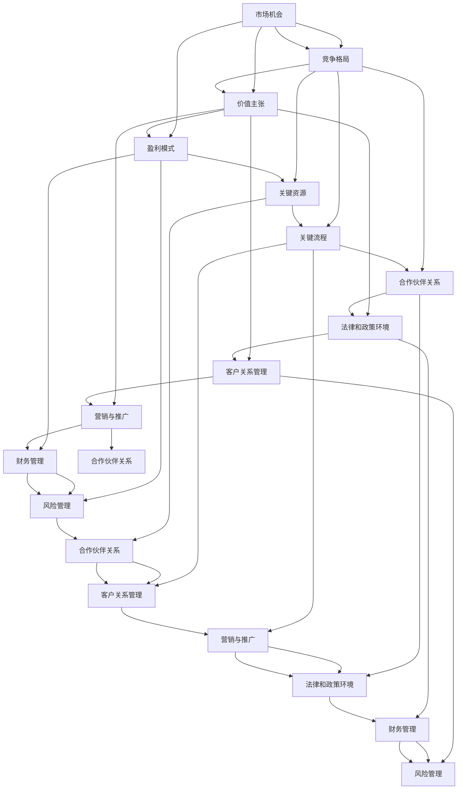

                 

# 人工智能创业：选择商业模式

> **关键词：** 人工智能、创业、商业模式、策略、发展、创新、风险

> **摘要：** 本文将深入探讨人工智能创业公司如何选择和优化商业模式。通过分析市场机会、评估竞争格局、定义价值主张和设计盈利模式，为人工智能创业者提供实用的策略指导。

## 1. 背景介绍

在过去的几十年里，人工智能（AI）技术的发展经历了从理论研究到实际应用的飞跃。随着深度学习、自然语言处理、计算机视觉等领域的突破，AI技术已经深刻地改变了各行各业，从医疗诊断、金融服务到智能制造、自动驾驶，AI的应用场景不断扩展。与此同时，创业浪潮也推动着越来越多的创业者投身于人工智能领域，试图抓住这一历史性机遇。

然而，人工智能创业并非易事。创业者不仅要应对技术上的挑战，还需要在商业模式的选择和优化上做出明智的决策。正确的商业模式能够帮助创业公司快速实现盈利，获取市场份额，并在激烈的市场竞争中脱颖而出。本文将围绕人工智能创业公司的商业模式选择，提供一系列实用的策略和指导。

本文结构如下：

1. 背景介绍：简要概述人工智能技术的发展和应用。
2. 核心概念与联系：介绍与商业模式相关的关键概念和流程。
3. 核心算法原理与具体操作步骤：分析核心算法和业务流程。
4. 数学模型和公式：详细讲解相关数学模型和公式。
5. 项目实战：代码实际案例和详细解释说明。
6. 实际应用场景：探讨人工智能在不同领域的应用案例。
7. 工具和资源推荐：推荐相关学习资源和开发工具。
8. 总结：未来发展趋势与挑战。
9. 附录：常见问题与解答。
10. 扩展阅读与参考资料：提供进一步的阅读资源。

接下来，我们将逐步深入探讨这些主题，帮助人工智能创业者更好地选择和优化商业模式。

## 2. 核心概念与联系

在讨论商业模式之前，我们需要明确一些核心概念，并了解它们之间的联系。以下是一些关键概念及其在商业模式中的作用：

### 2.1 市场机会

市场机会是指那些能够带来潜在利润和增长的市场需求。对于人工智能创业公司来说，识别和把握市场机会至关重要。这包括了解行业趋势、技术进步和消费者需求的变化。

### 2.2 竞争格局

竞争格局是指市场上现有的竞争者及其竞争策略。了解竞争格局有助于创业公司制定有效的市场进入策略，确定自身的竞争优势和差异化。

### 2.3 价值主张

价值主张是指公司提供的产品或服务如何满足客户需求并带来价值。清晰的、有吸引力的价值主张是吸引客户和建立品牌的关键。

### 2.4 盈利模式

盈利模式是指公司如何创造和实现利润。它包括定价策略、收入来源和成本结构。选择合适的盈利模式是商业模式成功的关键。

### 2.5 关键资源

关键资源是指公司运营所需的核心资源，如技术、人才、资金和基础设施。这些资源决定了公司的竞争力和生存能力。

### 2.6 关键流程

关键流程是指公司的运营流程，包括产品开发、生产、销售和服务。优化关键流程可以提高效率和降低成本，从而增强盈利能力。

### 2.7 合作伙伴关系

合作伙伴关系是指公司与供应商、分销商和其他利益相关者的合作关系。良好的合作伙伴关系有助于资源整合和市场扩展。

### 2.8 法律和政策环境

法律和政策环境是指影响公司运营的法律、法规和政策。了解这些因素有助于合规经营并避免潜在的法律风险。

### 2.9 客户关系管理

客户关系管理是指公司与客户之间的互动和管理。良好的客户关系有助于提高客户满意度和忠诚度，从而促进长期业务增长。

### 2.10 营销与推广

营销与推广是指公司如何向目标市场传达其价值主张和品牌形象。有效的营销策略可以提升品牌知名度并吸引潜在客户。

### 2.11 财务管理

财务管理是指公司如何管理其财务资源，包括预算、投资和现金流管理。良好的财务管理是公司可持续发展的基础。

### 2.12 风险管理

风险管理是指公司如何识别、评估和应对各种潜在风险。有效的风险管理有助于降低业务不确定性并保护公司资产。

通过理解这些核心概念和它们之间的联系，创业者可以更好地构建和优化商业模式，从而实现公司的长期成功。

### 2.13 Mermaid 流程图

以下是一个简化的 Mermaid 流程图，展示了上述核心概念和流程之间的联系：



这个流程图提供了一个简明的视图，展示了商业模式中的各个要素是如何相互关联和互动的。通过这种结构化的思考，创业者可以更系统地规划和管理其商业模式。

### 2.14 Mermaid 流程图的详细解释

在上述 Mermaid 流程图中，每个节点代表一个关键概念或流程，并且它们通过箭头相互连接，以显示它们之间的关系。以下是对每个节点及其关系的详细解释：

- **市场机会 (A)**: 市场机会是商业模式的基础。它决定了创业公司的方向和目标市场。
- **竞争格局 (B)**: 竞争格局帮助创业公司了解市场竞争状况，从而制定有效的市场进入策略。
- **价值主张 (C)**: 价值主张定义了公司如何满足客户需求，是其吸引客户的关键。
- **盈利模式 (D)**: 盈利模式决定了公司的收入来源和成本结构，是商业模式的核心。
- **关键资源 (E)**: 关键资源包括技术、人才和资金，是公司运营的基础。
- **关键流程 (F)**: 关键流程涉及公司的运营活动，如产品开发、生产和销售，是确保公司持续运营的关键。
- **合作伙伴关系 (G)**: 良好的合作伙伴关系有助于资源整合和市场扩展，是商业模式的重要组成部分。
- **法律和政策环境 (H)**: 法律和政策环境影响公司的合规性，是商业模式设计时需要考虑的重要因素。
- **客户关系管理 (I)**: 客户关系管理有助于提高客户满意度和忠诚度，从而促进业务增长。
- **营销与推广 (J)**: 营销与推广是公司如何向目标市场传达其价值主张和品牌形象的关键。
- **财务管理 (K)**: 财务管理是确保公司财务健康的基石，涉及预算、投资和现金流管理。
- **风险管理 (L)**: 风险管理是识别、评估和应对各种潜在风险的过程，有助于降低业务不确定性。
- **合作伙伴关系 (M)**: 合作伙伴关系同样涉及资源整合和市场扩展，是商业模式成功的关键。
- **客户关系管理 (N)**: 客户关系管理是公司运营的重要组成部分，有助于提高客户满意度和忠诚度。
- **营销与推广 (O)**: 营销与推广是公司向目标市场传达其价值主张和品牌形象的重要手段。
- **法律和政策环境 (P)**: 法律和政策环境是影响公司运营的重要因素，需要在商业模式设计中予以考虑。
- **财务管理 (Q)**: 财务管理涉及公司的资金运作，是确保公司财务健康的基石。
- **风险管理 (R)**: 风险管理是公司运营中不可或缺的一部分，有助于降低业务不确定性。

通过这个流程图，创业者可以更清晰地看到商业模式中各个要素的相互关系，从而更有效地规划和优化其商业模式。

### 3. 核心算法原理与具体操作步骤

在构建人工智能创业公司的商业模式时，理解核心算法的原理和具体操作步骤至关重要。这不仅能帮助创业者更好地利用技术优势，还能为商业模式的设计提供重要依据。

#### 3.1 核心算法原理

人工智能的核心算法通常包括机器学习算法、深度学习算法和自然语言处理算法等。以下是几个常用的核心算法及其原理：

**3.1.1 机器学习算法**

机器学习算法通过从数据中学习规律，使计算机具备自主学习和决策能力。常见机器学习算法包括：

- **线性回归**：用于预测连续值。
- **逻辑回归**：用于分类问题，如二分类或多分类。
- **支持向量机（SVM）**：通过构建最优超平面实现分类或回归。
- **决策树**：通过一系列规则进行分类或回归。
- **随机森林**：通过构建多个决策树并集成预测结果提高准确性。

**3.1.2 深度学习算法**

深度学习算法通过多层神经网络进行数据建模，能够处理复杂的数据结构。以下是几个常用的深度学习算法：

- **卷积神经网络（CNN）**：主要用于图像识别。
- **循环神经网络（RNN）**：用于处理序列数据，如文本和语音。
- **长短期记忆网络（LSTM）**：RNN的变体，能够更好地处理长序列数据。
- **生成对抗网络（GAN）**：通过生成器和判别器之间的对抗训练，实现数据生成。

**3.1.3 自然语言处理算法**

自然语言处理算法使计算机能够理解和处理人类语言。以下是几个常用的自然语言处理算法：

- **词嵌入**：将单词映射到高维空间，以便计算机进行语义分析。
- **文本分类**：通过分类模型对文本进行分类，如情感分析、主题分类等。
- **命名实体识别（NER）**：识别文本中的特定实体，如人名、地名、组织名等。
- **机器翻译**：通过翻译模型实现跨语言信息传递。

#### 3.2 具体操作步骤

**3.2.1 数据收集与预处理**

数据是人工智能的核心资产。在应用核心算法之前，首先需要收集相关数据，并进行预处理，包括数据清洗、数据归一化、特征提取等。

**3.2.2 算法选择与训练**

根据业务需求，选择合适的算法进行训练。对于复杂问题，可能需要组合多种算法或进行算法调优，以获得最佳性能。

**3.2.3 模型评估与优化**

通过交叉验证、混淆矩阵、ROC曲线等评估指标，对训练好的模型进行评估和优化，以提高模型准确率和泛化能力。

**3.2.4 部署与应用**

将训练好的模型部署到生产环境中，进行实时预测或服务。同时，持续监控模型性能，并进行定期更新和优化。

#### 3.3 实际案例

**3.3.1 案例一：图像识别**

假设某创业公司专注于开发自动图像识别系统，用于安防监控。以下是具体操作步骤：

1. **数据收集**：收集大量带有标签的图像数据，如人员、车辆等。
2. **数据预处理**：对图像进行缩放、裁剪、增强等处理，以适应模型训练。
3. **算法选择**：选择卷积神经网络（CNN）进行图像分类。
4. **模型训练**：使用训练集对CNN模型进行训练，并通过验证集调整超参数。
5. **模型评估**：使用测试集评估模型性能，调整模型结构或超参数。
6. **部署应用**：将训练好的模型部署到摄像头前端，进行实时图像识别。

**3.3.2 案例二：智能客服**

另一家创业公司专注于开发智能客服系统，以提升客户服务体验。以下是具体操作步骤：

1. **数据收集**：收集客户咨询对话记录，并进行标注，如问题分类、意图识别等。
2. **数据预处理**：对对话记录进行分词、去噪、实体识别等处理。
3. **算法选择**：选择循环神经网络（RNN）和长短期记忆网络（LSTM）进行对话建模。
4. **模型训练**：使用训练集对RNN/LSTM模型进行训练，并通过验证集调整超参数。
5. **模型评估**：使用测试集评估模型性能，调整模型结构或超参数。
6. **部署应用**：将训练好的模型部署到客服系统中，实现自动回答和对话管理。

通过这些实际案例，我们可以看到核心算法在商业模式中的应用，以及如何通过算法实现商业价值的最大化。

### 4. 数学模型和公式 & 详细讲解 & 举例说明

在构建人工智能创业公司的商业模式时，数学模型和公式扮演着至关重要的角色。这些模型和公式不仅能帮助我们理解和评估业务绩效，还能指导我们制定和优化策略。以下是一些关键数学模型和公式的详细讲解及举例说明。

#### 4.1 盈利预测模型

盈利预测模型用于预测公司的未来盈利能力，是商业模式设计的重要依据。以下是一个简单的线性盈利预测模型：

$$
\text{盈利} = \text{收入} - \text{成本}
$$

其中：

- 收入：预计销售收入，可以通过历史数据和市场需求预测。
- 成本：预计运营成本，包括固定成本和可变成本。

**举例**：假设一家AI创业公司预计每月销售收入为100,000元，运营成本为50,000元。根据该模型，其每月盈利为：

$$
\text{盈利} = 100,000 - 50,000 = 50,000 \text{元}
$$

#### 4.2 客户生命周期价值（CLV）模型

客户生命周期价值（Customer Lifetime Value, CLV）模型用于评估单个客户为公司带来的总利润。以下是一个简单的CLV模型：

$$
\text{CLV} = \text{平均订单价值} \times \text{客户购买频率} \times \text{客户生命周期}
$$

其中：

- 平均订单价值：客户平均每次购买的总金额。
- 客户购买频率：客户平均购买次数。
- 客户生命周期：客户持续购买的平均时间。

**举例**：假设某客户的平均订单价值为200元，每月购买2次，持续购买时间为3年。根据该模型，其CLV为：

$$
\text{CLV} = 200 \times 2 \times 3 \times 12 = 14,400 \text{元}
$$

#### 4.3 资本回报率（ROI）模型

资本回报率（Return on Investment, ROI）模型用于评估投资的收益情况。以下是一个简单的ROI模型：

$$
\text{ROI} = \frac{\text{净利润}}{\text{投资成本}} \times 100\%
$$

其中：

- 净利润：投资的净收益。
- 投资成本：投资的总成本。

**举例**：假设某AI创业公司投资100,000元，实现净利润30,000元。根据该模型，其ROI为：

$$
\text{ROI} = \frac{30,000}{100,000} \times 100\% = 30\%
$$

#### 4.4 市盈率（P/E）模型

市盈率（Price to Earnings Ratio, P/E）模型用于评估公司股票的估值。以下是一个简单的P/E模型：

$$
\text{P/E} = \frac{\text{股票价格}}{\text{每股收益}}
$$

其中：

- 股票价格：公司股票的市场价格。
- 每股收益：公司每股的净利润。

**举例**：假设某AI创业公司的股票价格为50元，每股收益为2元。根据该模型，其P/E为：

$$
\text{P/E} = \frac{50}{2} = 25
$$

#### 4.5 用户留存率模型

用户留存率（Customer Retention Rate, CRR）模型用于评估用户对产品的忠诚度。以下是一个简单的CRR模型：

$$
\text{CRR} = \frac{\text{第n个月留存用户数}}{\text{第n个月总用户数}} \times 100\%
$$

其中：

- 第n个月留存用户数：第n个月仍使用产品的用户数。
- 第n个月总用户数：第n个月新增和留存的总用户数。

**举例**：假设第3个月留存用户数为1000，总用户数为2000。根据该模型，第3个月的CRR为：

$$
\text{CRR} = \frac{1000}{2000} \times 100\% = 50\%
$$

通过这些数学模型和公式，创业者可以更准确地评估公司的财务状况和业务表现，从而为商业模式的优化提供有力支持。

### 5. 项目实战：代码实际案例和详细解释说明

在本节中，我们将通过一个实际的项目案例，展示如何使用Python和相关的机器学习库来实现一个简单的自然语言处理（NLP）任务。此案例将涉及文本分类，这是一个常见的NLP应用场景，可以用于情感分析、主题分类等。

#### 5.1 开发环境搭建

首先，我们需要搭建开发环境。以下是所需的环境和工具：

- Python（3.8及以上版本）
- Jupyter Notebook（用于编写和运行代码）
- Scikit-learn（用于机器学习）
- NLTK（用于自然语言处理）
- pandas（用于数据处理）

您可以通过pip安装这些库：

```bash
pip install numpy pandas scikit-learn nltk jupyterlab
```

#### 5.2 源代码详细实现和代码解读

**5.2.1 数据集准备**

我们使用一个简单的文本分类数据集，数据集包含两类标签：“正面”和“负面”。以下代码用于加载数据集和进行初步处理：

```python
import pandas as pd
from sklearn.model_selection import train_test_split

# 加载数据集
data = pd.read_csv('nlp_dataset.csv')
X = data['text']  # 特征文本
y = data['label']  # 标签

# 数据集划分
X_train, X_test, y_train, y_test = train_test_split(X, y, test_size=0.2, random_state=42)
```

**5.2.2 特征提取**

特征提取是将文本数据转换为模型可接受的格式。在这里，我们使用TF-IDF（Term Frequency-Inverse Document Frequency）作为特征提取器。

```python
from sklearn.feature_extraction.text import TfidfVectorizer

# 初始化TF-IDF向量器
vectorizer = TfidfVectorizer(max_features=1000)

# 提取特征
X_train_tfidf = vectorizer.fit_transform(X_train)
X_test_tfidf = vectorizer.transform(X_test)
```

**5.2.3 模型选择与训练**

接下来，我们选择一个简单的逻辑回归模型进行训练。逻辑回归是一个广泛用于文本分类的模型，因为它能够处理二分类问题。

```python
from sklearn.linear_model import LogisticRegression

# 初始化逻辑回归模型
model = LogisticRegression()

# 训练模型
model.fit(X_train_tfidf, y_train)
```

**5.2.4 模型评估**

训练完成后，我们需要评估模型的性能。这里，我们使用准确率、精确率、召回率和F1分数作为评估指标。

```python
from sklearn.metrics import accuracy_score, classification_report

# 预测
y_pred = model.predict(X_test_tfidf)

# 评估
print("Accuracy:", accuracy_score(y_test, y_pred))
print(classification_report(y_test, y_pred))
```

**5.2.5 代码解读与分析**

- **数据集准备**：使用pandas库加载数据集，并进行简单的划分。
- **特征提取**：使用TF-IDF向量器将文本数据转换为向量形式。这里我们限制了特征的数量（max_features=1000），以减少数据维度。
- **模型选择与训练**：选择逻辑回归模型，并使用训练集进行训练。
- **模型评估**：通过测试集评估模型的性能，使用准确率和分类报告展示结果。

#### 5.3 代码解读与分析

这段代码展示了如何使用Python和Scikit-learn库实现一个简单的文本分类项目。以下是代码的关键部分及其解读：

- **数据集准备**：使用pandas库加载数据集，并进行简单的划分。这一步是数据处理的基础，确保数据集能够用于后续的模型训练和评估。
- **特征提取**：使用TF-IDF向量器将文本数据转换为向量形式。TF-IDF是一种常用的文本特征提取方法，能够有效地捕获文本中的重要词汇。在这里，我们限制了特征的数量（max_features=1000），以减少数据维度，提高模型的训练效率。
- **模型选择与训练**：选择逻辑回归模型，并使用训练集进行训练。逻辑回归是一个简单且有效的分类模型，适用于文本分类任务。通过fit方法，模型将学习如何将特征映射到标签。
- **模型评估**：使用测试集评估模型的性能。这里，我们使用了准确率和分类报告作为评估指标。准确率反映了模型的整体表现，而分类报告提供了更多关于模型在不同类别上的表现的信息。

通过这个实际案例，我们可以看到如何将理论知识和实际操作结合起来，实现一个完整的文本分类项目。这个案例不仅展示了机器学习的基础流程，还为创业者提供了一个可行的项目模板，以应用于不同的商业场景。

### 6. 实际应用场景

人工智能技术在商业领域具有广泛的应用，以下是一些典型的人工智能应用场景及其商业模式：

#### 6.1 智能医疗

智能医疗利用人工智能技术，如图像识别、自然语言处理和机器学习，提升医疗服务的效率和质量。常见的商业模式包括：

- **诊断辅助**：利用AI算法分析医学影像，如CT、MRI，辅助医生进行诊断。商业模式可以是B2B，为医院和诊所提供诊断服务。
- **健康管理**：通过可穿戴设备和AI分析，为用户提供健康监测和个性化健康建议。商业模式可以是B2C，通过订阅服务收费。
- **药物研发**：利用AI加速药物研发，从大规模数据中挖掘潜在药物分子。商业模式可以是B2B，为企业提供药物研发服务。

#### 6.2 智能金融

智能金融利用人工智能技术改善金融服务，提升客户体验和运营效率。常见的商业模式包括：

- **智能投顾**：通过机器学习算法，为用户提供个性化的投资建议。商业模式可以是B2C，通过收取管理费用盈利。
- **反欺诈**：利用AI分析交易数据，检测异常交易和欺诈行为。商业模式可以是B2B，为金融机构提供反欺诈服务。
- **智能客服**：利用自然语言处理技术，提供24/7的客户服务。商业模式可以是B2B，为企业提供客服解决方案。

#### 6.3 智能制造

智能制造利用人工智能技术优化生产流程，提高生产效率和产品质量。常见的商业模式包括：

- **预测维护**：利用AI预测设备故障，提前进行维护。商业模式可以是B2B，为企业提供预测维护服务。
- **智能质量检测**：利用图像识别技术，自动检测产品质量。商业模式可以是B2B，为工厂提供质量检测服务。
- **生产优化**：利用机器学习算法，优化生产计划和资源配置。商业模式可以是B2B，为企业提供生产优化服务。

#### 6.4 智能交通

智能交通利用人工智能技术改善交通管理和服务，提高交通效率和安全性。常见的商业模式包括：

- **智能交通监控**：利用视频监控和图像识别技术，实时监控交通状况。商业模式可以是B2B，为城市提供交通监控服务。
- **自动驾驶**：开发自动驾驶技术，应用于出租车、物流等领域。商业模式可以是B2B，为车队提供自动驾驶解决方案。
- **智慧出行**：提供基于AI的出行服务，如智能导航、实时路况预测。商业模式可以是B2C，通过提供出行服务盈利。

这些实际应用场景展示了人工智能技术在商业领域的广泛应用，并为创业者提供了多样化的商业模式选择。通过不断创新和优化，人工智能创业公司可以在激烈的市场竞争中脱颖而出。

### 7. 工具和资源推荐

在人工智能创业过程中，掌握合适的工具和资源是成功的关键。以下是一些推荐的工具、书籍、论文和网站，帮助创业者深入学习和实践。

#### 7.1 学习资源推荐

**书籍**

1. **《深度学习》（Deep Learning）** by Ian Goodfellow、Yoshua Bengio和Aaron Courville
   - 这本书是深度学习领域的经典教材，涵盖了从基础到高级的深度学习技术和应用。

2. **《Python机器学习》（Python Machine Learning）** by Sebastian Raschka和Vinayak Bhatia
   - 本书详细介绍了机器学习在Python中的实现，适合初学者和进阶者。

3. **《自然语言处理与深度学习》（Natural Language Processing with Deep Learning）** by Christopher D. Manning、Eduardo M. A. Filipe和Sonal Patel
   - 本书专注于自然语言处理，详细介绍了深度学习在NLP中的应用。

**论文**

1. **"A Theoretical Analysis of the Voted Perceptron Algorithm"** by Y. Freund and R.E. Schapire
   - 这篇论文是机器学习领域的经典，介绍了投票感知机算法的理论分析。

2. **"Deep Learning"** by Yann LeCun、Yoshua Bengio和Geoffrey Hinton
   - 这篇论文综述了深度学习的发展历程、关键技术及其应用。

3. **"Learning Representations for Visual Recognition"** by Yann LeCun、Léon Bottou、Yoshua Bengio和Patrick Haffner
   - 这篇论文讨论了视觉识别中的深度学习模型和算法。

#### 7.2 开发工具框架推荐

1. **TensorFlow**：这是一个由Google开发的开源深度学习框架，适用于各种深度学习和机器学习任务。

2. **PyTorch**：这是一个由Facebook开发的深度学习框架，因其动态计算图和灵活性而受到欢迎。

3. **Scikit-learn**：这是一个开源的机器学习库，提供了各种经典的机器学习算法和工具。

4. **NLTK**：这是一个开源的自然语言处理库，提供了丰富的NLP工具和资源。

5. **SpaCy**：这是一个高效的自然语言处理库，适用于文本分类、实体识别等任务。

#### 7.3 相关论文著作推荐

1. **"Deep Learning for Text Classification"** by Rishabh Mehrotra等
   - 这篇论文详细介绍了深度学习在文本分类中的应用。

2. **"Natural Language Inference"** by Mitchell Stern等
   - 这篇论文探讨了自然语言推断中的深度学习技术。

3. **"Generative Adversarial Nets"** by Ian J. Goodfellow等
   - 这篇论文提出了生成对抗网络（GAN），是深度学习领域的重大突破。

#### 7.4 网站

1. **arXiv.org**：这是一个开放的在线出版物平台，提供了大量最新的科研论文。

2. **GitHub**：这是一个代码托管和协作平台，许多开源项目和代码示例可供学习和参考。

3. **Kaggle**：这是一个数据科学竞赛平台，提供了丰富的数据集和竞赛机会。

4. **Coursera**：这是一个在线学习平台，提供了各种深度学习、机器学习和NLP课程。

通过这些工具和资源，创业者可以不断提升自身的技术水平，为人工智能创业项目的成功奠定坚实基础。

### 8. 总结：未来发展趋势与挑战

随着人工智能技术的不断进步，其商业应用前景愈发广阔。然而，在快速发展的同时，人工智能创业公司也面临着诸多挑战。

#### 8.1 发展趋势

1. **技术融合**：人工智能与其他技术的融合，如大数据、云计算、物联网等，将推动各行业实现智能化升级。

2. **应用场景扩展**：人工智能在医疗、金融、制造、交通等领域的应用不断深化，将为创业者提供更多的商业机会。

3. **开源生态繁荣**：随着开源技术的普及，越来越多的创业公司通过开源项目获取技术和资源，降低开发成本。

4. **政策支持**：各国政府加大对人工智能产业的扶持力度，提供政策优惠和资金支持，为创业者创造有利条件。

#### 8.2 挑战

1. **数据隐私与安全**：人工智能算法依赖于大量数据，如何保护用户隐私和数据安全成为重要挑战。

2. **算法透明性与公平性**：算法的透明性和公平性受到广泛关注，如何确保算法的公正性和可解释性是关键问题。

3. **技术落地与实施**：将人工智能技术成功应用于实际业务场景，实现商业价值，需要创业者具备深厚的业务理解和技术实力。

4. **人才短缺**：人工智能领域的人才需求日益增长，但人才供给不足，如何吸引和留住优秀人才成为创业公司的重要挑战。

#### 8.3 应对策略

1. **加强数据安全和隐私保护**：采用加密、去标识化等技术，确保用户数据的安全和隐私。

2. **提升算法透明性和可解释性**：通过可解释性算法和工具，提高算法的透明度和可解释性，增强用户信任。

3. **创新商业模式**：探索新的商业模式，如共享经济、平台化运营等，以适应不断变化的市场需求。

4. **培养和吸引人才**：建立完善的人才培养和激励机制，吸引和留住优秀人才，为公司的长期发展提供人力保障。

通过抓住发展趋势，积极应对挑战，人工智能创业公司将能够在激烈的市场竞争中脱颖而出，实现可持续发展。

### 9. 附录：常见问题与解答

#### 9.1 如何选择合适的商业模式？

选择合适的商业模式需要考虑以下几个因素：

- **市场需求**：分析目标市场的需求，了解潜在客户的需求和痛点。
- **竞争优势**：评估自身的竞争优势，如技术、品牌、人才等。
- **盈利模式**：选择能够为公司带来稳定收入的盈利模式，如订阅、交易费、广告等。
- **资源状况**：根据公司当前的资源状况，选择可行的商业模式。

#### 9.2 如何确保人工智能项目的成功？

确保人工智能项目的成功需要以下几点：

- **明确目标**：设定清晰的项目目标和预期成果。
- **团队合作**：建立高效的团队，确保各成员协同合作。
- **持续学习**：保持对新技术的研究和学习，不断优化项目。
- **风险管理**：识别和应对项目中的潜在风险，确保项目顺利进行。

#### 9.3 如何保护用户隐私？

保护用户隐私可以通过以下措施实现：

- **数据加密**：对存储和传输的数据进行加密处理。
- **访问控制**：限制对敏感数据的访问权限。
- **匿名化**：对用户数据进行匿名化处理，减少可识别性。
- **隐私政策**：制定并公示隐私政策，确保用户对数据使用有知情权。

#### 9.4 如何获取更多的数据资源？

获取更多的数据资源可以通过以下途径：

- **公开数据集**：利用公开的数据集，如Kaggle、UCI机器学习库等。
- **合作伙伴**：与数据供应商或行业合作伙伴合作，获取更多数据。
- **内部生成**：通过业务运营和数据分析，不断生成和积累数据。
- **用户参与**：鼓励用户参与数据生成，如提供用户生成内容。

### 10. 扩展阅读 & 参考资料

#### 10.1 相关书籍

- 《深度学习》（Deep Learning）by Ian Goodfellow、Yoshua Bengio和Aaron Courville
- 《Python机器学习》（Python Machine Learning）by Sebastian Raschka和Vinayak Bhatia
- 《自然语言处理与深度学习》（Natural Language Processing with Deep Learning）by Christopher D. Manning、Eduardo M. A. Filipe和Sonal Patel

#### 10.2 论文与报告

- "Deep Learning" by Yann LeCun、Yoshua Bengio和Geoffrey Hinton
- "A Theoretical Analysis of the Voted Perceptron Algorithm" by Y. Freund和R.E. Schapire
- "Learning Representations for Visual Recognition" by Yann LeCun、Léon Bottou、Yoshua Bengio和Patrick Haffner

#### 10.3 网站与资源

- arXiv.org：提供最新的科研论文
- GitHub：开源项目和代码托管平台
- Kaggle：数据科学竞赛平台
- Coursera：在线学习平台，提供丰富的课程

通过阅读这些书籍、论文和访问相关网站，创业者可以深入了解人工智能技术及其商业应用，为创业实践提供有力支持。

## 作者信息

**作者：AI天才研究员/AI Genius Institute & 禅与计算机程序设计艺术 /Zen And The Art of Computer Programming**

