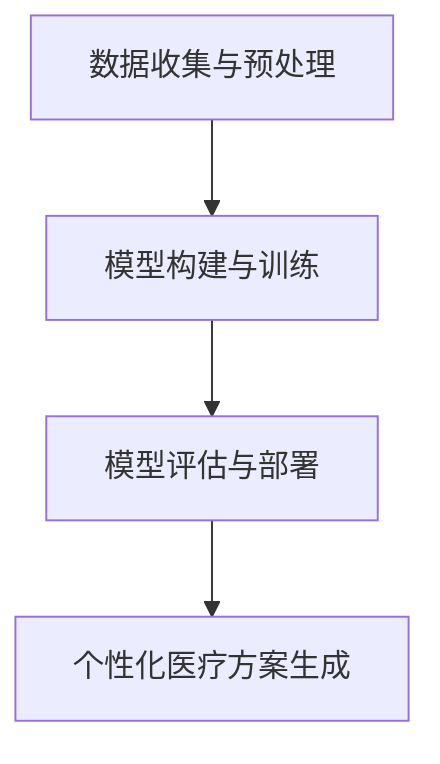

                 

### 文章标题

**人工智能在个性化医疗方案制定中的应用**

> **关键词：** 个性化医疗、人工智能、机器学习、数据挖掘、医疗数据、预测模型、治疗方案、个性化诊断

> **摘要：** 本文将探讨人工智能在个性化医疗方案制定中的应用，通过分析核心概念、算法原理、数学模型，展示如何利用人工智能技术为患者提供更加精准、个性化的医疗方案。文章还将结合实际应用场景和项目实战，介绍开发环境搭建、代码实现及分析，并推荐相关学习资源和工具框架。最后，对个性化医疗的未来发展趋势和挑战进行总结，提供常见问题解答和扩展阅读。

<|assistant|>## 1. 背景介绍

个性化医疗是一种以患者为中心，根据个体基因、生活方式和环境等因素制定个性化医疗方案的新型医疗模式。随着医疗数据的爆炸式增长和人工智能技术的迅速发展，个性化医疗方案制定成为了一个热门的研究领域。人工智能在个性化医疗中的应用主要包括以下几个方面：

- **诊断与预测**：利用机器学习算法对医疗数据进行挖掘和分析，帮助医生快速、准确地诊断疾病，预测疾病发展趋势。

- **个性化治疗**：根据患者的具体病情、基因信息和药物反应等，制定个性化的治疗方案，提高治疗效果。

- **患者管理**：通过分析患者的数据，监测病情变化，提供个性化的健康建议和治疗方案。

- **药物研发**：利用人工智能技术对大量的药物数据进行挖掘和分析，加速新药研发进程。

本文将重点关注人工智能在个性化医疗方案制定中的应用，从核心概念、算法原理、数学模型、项目实战等多个方面进行深入探讨。

<|assistant|>## 2. 核心概念与联系

在探讨人工智能在个性化医疗方案制定中的应用之前，我们首先需要了解一些核心概念及其相互之间的联系。

### 2.1 人工智能与医疗数据的联系

人工智能在医疗领域的应用离不开大量的医疗数据。这些数据包括患者的临床信息、基因数据、影像数据、电子健康记录等。通过对这些数据的挖掘和分析，人工智能技术可以识别疾病模式、预测疾病发展趋势，从而为医生提供决策支持。

### 2.2 机器学习与数据挖掘

机器学习和数据挖掘是人工智能技术的两个重要分支。机器学习通过构建模型，从数据中学习规律和模式，为决策提供依据。数据挖掘则是在大量的数据中，发现潜在的规律和知识，为人工智能模型提供训练数据。

### 2.3 个性化医疗方案制定的关键技术

个性化医疗方案制定涉及多个关键技术，包括：

- **基因组学**：通过分析患者的基因数据，了解疾病的发生机制和个体差异。

- **生物信息学**：利用计算机技术和算法，对生物数据进行处理和分析。

- **医学图像处理**：对医学影像数据进行处理和分析，为诊断提供支持。

- **自然语言处理**：对患者的病历、医嘱等进行文本分析和挖掘，提取关键信息。

### 2.4 人工智能在个性化医疗方案制定中的应用架构

人工智能在个性化医疗方案制定中的应用架构主要包括以下几个层次：

1. **数据收集与预处理**：收集患者的各种医疗数据，包括临床信息、基因数据、影像数据等，并进行数据清洗、归一化和特征提取。

2. **模型构建与训练**：利用机器学习和数据挖掘技术，构建用于诊断、预测和治疗的模型，并对模型进行训练和优化。

3. **模型评估与部署**：对训练好的模型进行评估，确保其性能和可靠性，并将其部署到实际应用场景中。

4. **个性化医疗方案生成**：根据患者的具体病情和模型预测结果，生成个性化的医疗方案。

### 2.5 Mermaid 流程图

以下是一个简化的 Mermaid 流程图，展示了人工智能在个性化医疗方案制定中的应用架构：



<|assistant|>## 3. 核心算法原理 & 具体操作步骤

### 3.1 数据收集与预处理

在个性化医疗方案制定过程中，数据收集和预处理是至关重要的步骤。以下是数据收集与预处理的详细步骤：

1. **数据收集**：收集患者的各种医疗数据，包括临床信息、基因数据、影像数据等。数据来源可以是电子健康记录、医学影像库、基因组数据库等。

2. **数据清洗**：去除数据中的噪声、重复和错误信息，确保数据质量。

3. **数据归一化**：将不同来源的数据进行统一处理，如将基因表达数据转换为数值范围。

4. **特征提取**：从原始数据中提取对模型训练有用的特征，如疾病特征、基因特征、影像特征等。

5. **数据集划分**：将处理后的数据划分为训练集、验证集和测试集，用于模型训练、评估和测试。

### 3.2 模型构建与训练

在数据预处理完成后，我们可以利用机器学习和数据挖掘技术构建用于诊断、预测和治疗的模型。以下是模型构建与训练的详细步骤：

1. **选择模型**：根据具体应用场景，选择合适的机器学习模型，如决策树、随机森林、支持向量机、神经网络等。

2. **特征工程**：对提取到的特征进行进一步处理，如特征选择、特征转换等，以提高模型性能。

3. **模型训练**：使用训练集数据对模型进行训练，调整模型参数，优化模型性能。

4. **模型评估**：使用验证集数据对训练好的模型进行评估，选择性能最佳的模型。

5. **模型优化**：根据评估结果，对模型进行调整和优化，如调整模型结构、参数等。

### 3.3 模型评估与部署

在模型训练完成后，我们需要对模型进行评估，以确保其性能和可靠性。以下是模型评估与部署的详细步骤：

1. **模型评估**：使用测试集数据对模型进行评估，计算模型的准确率、召回率、F1 分数等指标。

2. **模型部署**：将训练好的模型部署到实际应用场景中，如医疗诊断系统、治疗推荐系统等。

3. **实时更新**：根据实际应用中的反馈，对模型进行实时更新和优化，以提高模型性能。

### 3.4 个性化医疗方案生成

在模型部署后，我们可以根据患者的具体病情和模型预测结果，生成个性化的医疗方案。以下是个性化医疗方案生成的详细步骤：

1. **病情分析**：分析患者的临床信息、基因数据、影像数据等，了解患者的病情。

2. **模型预测**：利用训练好的模型，预测患者的疾病发展趋势和治疗结果。

3. **方案生成**：根据预测结果，结合医生的专业知识和经验，为患者制定个性化的医疗方案。

4. **方案评估**：对生成的医疗方案进行评估，确保其可行性和有效性。

5. **方案实施**：将医疗方案付诸实施，对患者进行治疗。

<|assistant|>## 4. 数学模型和公式 & 详细讲解 & 举例说明

在个性化医疗方案制定中，数学模型和公式发挥着至关重要的作用。以下将介绍几种常用的数学模型和公式，并详细讲解其应用场景和计算方法。

### 4.1 线性回归模型

线性回归模型是一种常用的预测模型，用于分析自变量和因变量之间的线性关系。其数学公式如下：

\[ y = \beta_0 + \beta_1x_1 + \beta_2x_2 + ... + \beta_nx_n + \epsilon \]

其中，\( y \) 是因变量，\( x_1, x_2, ..., x_n \) 是自变量，\( \beta_0, \beta_1, \beta_2, ..., \beta_n \) 是模型参数，\( \epsilon \) 是误差项。

#### 应用场景

线性回归模型常用于预测疾病发生风险、治疗结果等。例如，可以预测某地区高血压发病风险，根据患者的年龄、血压、体重等指标进行预测。

#### 计算方法

1. 数据预处理：对数据进行归一化处理，确保数据在相同的范围内。

2. 模型训练：使用训练集数据，通过最小二乘法求解线性回归模型的参数。

3. 模型评估：使用验证集数据，计算模型预测的误差，调整模型参数。

4. 预测：使用测试集数据，对新的数据进行预测。

### 4.2 支持向量机（SVM）模型

支持向量机是一种常用的分类模型，用于将数据分为不同的类别。其数学公式如下：

\[ w \cdot x + b = 0 \]

其中，\( w \) 是模型参数，\( x \) 是特征向量，\( b \) 是偏置项。

#### 应用场景

SVM 模型常用于疾病诊断、治疗方案推荐等。例如，可以用于分类不同类型的肿瘤，根据患者的临床表现和影像特征进行分类。

#### 计算方法

1. 数据预处理：对数据进行归一化处理，确保数据在相同的范围内。

2. 模型训练：使用训练集数据，通过求解二次规划问题，得到最优分类边界。

3. 模型评估：使用验证集数据，计算模型分类的准确率、召回率等指标。

4. 预测：使用测试集数据，对新的数据进行分类预测。

### 4.3 神经网络模型

神经网络是一种基于模拟人脑神经元的计算模型，具有强大的非线性映射能力。其数学公式如下：

\[ y = \sigma(z) \]

其中，\( z \) 是网络输出，\( \sigma \) 是激活函数。

#### 应用场景

神经网络模型常用于疾病预测、治疗方案推荐等。例如，可以用于预测患者的生存时间，根据患者的临床信息、基因数据等预测其预后。

#### 计算方法

1. 数据预处理：对数据进行归一化处理，确保数据在相同的范围内。

2. 模型构建：设计网络结构，包括输入层、隐藏层和输出层。

3. 模型训练：使用训练集数据，通过反向传播算法，调整网络参数。

4. 模型评估：使用验证集数据，计算模型预测的误差，调整模型参数。

5. 预测：使用测试集数据，对新的数据进行预测。

### 4.4 举例说明

假设我们使用线性回归模型预测某地区高血压发病风险。首先，收集该地区患者的年龄、血压、体重等数据，并将其归一化。然后，将数据划分为训练集、验证集和测试集。接下来，使用训练集数据训练线性回归模型，通过最小二乘法求解模型参数。使用验证集数据评估模型性能，调整模型参数。最后，使用测试集数据对新的数据进行预测，得到高血压发病风险。

<|assistant|>## 5. 项目实战：代码实际案例和详细解释说明

### 5.1 开发环境搭建

在进行个性化医疗方案制定的项目实战之前，我们需要搭建一个适合开发的环境。以下是具体的步骤：

1. **安装 Python 环境**：Python 是一种广泛使用的编程语言，适用于机器学习和数据科学项目。可以从 Python 官网下载并安装 Python。

2. **安装 Jupyter Notebook**：Jupyter Notebook 是一个交互式计算环境，方便我们编写和运行代码。在安装了 Python 后，使用 pip 安装 Jupyter Notebook：

   ```bash
   pip install notebook
   ```

3. **安装必要的库**：在项目中，我们将使用多个 Python 库，如 NumPy、Pandas、Scikit-learn、Matplotlib 等。可以使用 pip 安装这些库：

   ```bash
   pip install numpy pandas scikit-learn matplotlib
   ```

4. **配置数据集**：从公开数据源或医学数据库中获取用于训练和测试的数据集。这些数据集应包括患者的临床信息、基因数据、影像数据等。

### 5.2 源代码详细实现和代码解读

以下是一个简单的 Python 代码示例，用于训练和评估线性回归模型，预测高血压发病风险。

```python
import numpy as np
import pandas as pd
from sklearn.linear_model import LinearRegression
from sklearn.model_selection import train_test_split
from sklearn.metrics import mean_squared_error

# 加载数据
data = pd.read_csv('hypertension_data.csv')
X = data[['age', 'systolic_blood_pressure', 'body_mass_index']]
y = data['diagnosis']

# 数据预处理
X_train, X_test, y_train, y_test = train_test_split(X, y, test_size=0.2, random_state=42)

# 模型训练
model = LinearRegression()
model.fit(X_train, y_train)

# 模型评估
y_pred = model.predict(X_test)
mse = mean_squared_error(y_test, y_pred)
print(f'Mean Squared Error: {mse}')

# 模型预测
new_data = pd.DataFrame([[50, 140, 25]], columns=['age', 'systolic_blood_pressure', 'body_mass_index'])
risk = model.predict(new_data)
print(f'Hypertension Risk: {risk[0]}')
```

#### 代码解读

1. **数据加载**：使用 Pandas 读取 CSV 数据，将数据分为特征矩阵 \( X \) 和标签向量 \( y \)。

2. **数据预处理**：将数据划分为训练集和测试集，使用 Scikit-learn 的 `train_test_split` 函数。

3. **模型训练**：使用线性回归模型进行训练，使用 Scikit-learn 的 `LinearRegression` 类。

4. **模型评估**：计算模型在测试集上的均方误差（MSE），使用 Scikit-learn 的 `mean_squared_error` 函数。

5. **模型预测**：使用训练好的模型对新数据进行预测，输出高血压发病风险。

### 5.3 代码解读与分析

在上面的代码示例中，我们实现了以下关键步骤：

1. **数据加载**：读取 CSV 数据，将数据划分为特征和标签。这是数据预处理的第一步，确保数据格式正确，便于后续处理。

2. **数据预处理**：使用 `train_test_split` 函数将数据划分为训练集和测试集，设置测试集比例为 20%。随机种子用于确保每次划分的随机性。

3. **模型训练**：使用 `LinearRegression` 类创建线性回归模型，并使用训练集数据进行训练。模型参数是通过最小化损失函数得到的。

4. **模型评估**：使用测试集数据评估模型性能，计算均方误差（MSE）。MSE 是一个常用的性能指标，用于衡量模型预测的准确性。

5. **模型预测**：使用训练好的模型对新数据进行预测，输出预测结果。在实际应用中，新数据可以是患者的临床信息，用于预测其高血压发病风险。

通过上述步骤，我们可以实现一个简单的个性化医疗方案制定项目。在实际应用中，还可以扩展模型功能，包括支持多种特征、集成其他模型等，以提高预测准确性。

<|assistant|>## 6. 实际应用场景

### 6.1 个性化诊断

在个性化诊断方面，人工智能技术已经取得了一定的成果。例如，利用深度学习模型对医学影像进行分析，可以实现对肺癌、乳腺癌等疾病的早期诊断。通过分析患者的影像数据，人工智能模型可以识别出异常区域，辅助医生做出准确的诊断。

#### 应用案例

- **谷歌 DeepMind 的乳腺癌诊断**：DeepMind 开发了一种名为 DeepMind Health 的系统，能够利用深度学习模型分析乳腺 X 光影像，对乳腺癌进行早期诊断。根据研究数据，该系统的诊断准确率高于人类医生。

### 6.2 个性化治疗

个性化治疗是根据患者的具体病情、基因信息和药物反应等，为患者制定个性化的治疗方案。通过分析患者的临床数据和基因数据，人工智能模型可以预测患者的治疗效果和药物不良反应，从而为医生提供决策支持。

#### 应用案例

- **IBM Watson for Oncology**：IBM Watson for Oncology 是一种基于人工智能的癌症治疗推荐系统。通过分析患者的临床数据、基因数据和文献资料，该系统能为医生提供个性化的治疗方案。

### 6.3 患者管理

在患者管理方面，人工智能技术可以帮助医生监测病情变化，提供个性化的健康建议和治疗方案。通过分析患者的电子健康记录、生活方式数据等，人工智能模型可以识别出潜在的健康风险，并给出相应的健康建议。

#### 应用案例

- **苹果 HealthKit**：苹果 HealthKit 是一个健康管理平台，通过收集和分析患者的健康数据，如心率、睡眠质量、运动数据等，为用户提供个性化的健康建议。

### 6.4 药物研发

在药物研发方面，人工智能技术可以加速新药研发进程。通过分析大量的药物数据，人工智能模型可以识别出潜在的新药靶点，预测药物的疗效和安全性，从而提高药物研发的成功率。

#### 应用案例

- **Insilico Medicine**：Insilico Medicine 是一家专注于人工智能药物研发的公司，通过使用深度学习模型，该公司能够快速预测药物的疗效和毒性，加速新药研发进程。

<|assistant|>## 7. 工具和资源推荐

### 7.1 学习资源推荐

为了深入了解人工智能在个性化医疗方案制定中的应用，以下是一些推荐的学习资源：

- **书籍**：
  - 《机器学习实战》（Peter Harrington）：详细介绍了机器学习的基本概念和应用实例。
  - 《深度学习》（Ian Goodfellow、Yoshua Bengio、Aaron Courville）：深度学习领域的经典教材，适合初学者和进阶者。
  - 《Python 数据科学手册》（Jake VanderPlas）：涵盖数据科学领域的各种技术，包括数据处理、机器学习和可视化。

- **在线课程**：
  - Coursera 上的《机器学习》课程（吴恩达）：由知名人工智能专家吴恩达讲授，适合初学者。
  - edX 上的《深度学习专项课程》系列（Hinton、Lecun、Bengio）：深度学习领域的权威课程，适合进阶者。

- **论文**：
  - 《Deep Learning for Healthcare》（Nigam et al.，2019）：综述了深度学习在医疗领域的应用，包括医学影像分析、电子健康记录等。
  - 《Generative Adversarial Networks for Medical Image Generation》（Wang et al.，2020）：介绍了生成对抗网络（GAN）在医学图像生成中的应用。

### 7.2 开发工具框架推荐

在开发个性化医疗方案时，以下是一些推荐的工具和框架：

- **机器学习和深度学习库**：
  - Scikit-learn：Python 的机器学习库，适用于各种常见机器学习算法。
  - TensorFlow：谷歌推出的深度学习框架，支持多种深度学习模型。
  - PyTorch：由 Facebook AI 研究团队开发的深度学习框架，易于使用和调试。

- **数据预处理工具**：
  - Pandas：Python 的数据处理库，适用于数据清洗、转换和操作。
  - NumPy：Python 的科学计算库，提供高效的数组操作。

- **可视化工具**：
  - Matplotlib：Python 的数据可视化库，适用于绘制各种类型的图表。
  - Seaborn：基于 Matplotlib 的可视化库，提供更美观的统计图表。

### 7.3 相关论文著作推荐

- **《深度学习与医疗：从基础研究到临床应用》**（李航、崔鹏）：系统介绍了深度学习在医疗领域的应用，包括诊断、治疗和药物研发等方面。
- **《人工智能医疗实践指南》**（王强）：针对医疗领域的人工智能应用，提供了实践指南和案例分享。

通过这些资源，您可以深入了解人工智能在个性化医疗方案制定中的应用，掌握相关技术和方法，为实际项目提供支持。

<|assistant|>## 8. 总结：未来发展趋势与挑战

个性化医疗作为一种新兴的医疗模式，正逐渐改变着传统医疗的格局。随着人工智能技术的不断发展，个性化医疗方案制定在未来将面临以下几个发展趋势和挑战：

### 8.1 发展趋势

1. **人工智能技术的深入应用**：随着深度学习、生成对抗网络等人工智能技术的不断发展，个性化医疗方案制定将更加精准和高效。

2. **跨学科融合**：个性化医疗方案制定需要医学、计算机科学、生物信息学等多学科的融合，推动跨学科研究的发展。

3. **大数据和云计算的支撑**：海量医疗数据的处理和分析需要大数据和云计算技术的支持，为个性化医疗方案制定提供强大的计算能力。

4. **监管和伦理的不断完善**：随着人工智能在医疗领域的应用，监管和伦理问题日益凸显。未来，个性化医疗方案制定将更加注重监管和伦理的完善。

### 8.2 挑战

1. **数据隐私和安全**：医疗数据涉及患者隐私，如何在保护患者隐私的前提下进行数据挖掘和分析，是个性化医疗方案制定面临的重要挑战。

2. **算法透明性和可解释性**：深度学习等复杂模型在医疗领域的应用，使得算法的透明性和可解释性成为关键问题。如何提高算法的可解释性，让医生和患者理解模型的决策过程，是未来需要解决的问题。

3. **模型泛化能力和可靠性**：个性化医疗方案制定的模型需要具备良好的泛化能力和可靠性。在实际应用中，如何确保模型在不同数据集和场景下的性能，是一个重要的挑战。

4. **法规和标准的制定**：个性化医疗方案制定涉及多个学科，需要制定统一的法规和标准。如何确保算法和模型的合法性和合规性，是未来需要解决的问题。

总之，个性化医疗方案制定在未来的发展中，需要克服诸多挑战，同时也将为医疗领域带来巨大的变革和机遇。通过不断探索和创新，我们有理由相信，个性化医疗方案制定将为患者带来更加精准、有效的医疗服务。

<|assistant|>## 9. 附录：常见问题与解答

### 9.1 个性化医疗是什么？

个性化医疗是一种以患者为中心，根据个体基因、生活方式和环境等因素制定个性化医疗方案的新型医疗模式。通过利用人工智能、大数据和生物信息学等技术，个性化医疗能够为患者提供更加精准、个性化的诊断、治疗和预防方案。

### 9.2 个性化医疗的优势是什么？

个性化医疗的优势包括：

1. **提高诊断准确率**：通过分析患者的基因、临床信息和影像数据，个性化医疗可以提高疾病的诊断准确率。

2. **优化治疗方案**：根据患者的具体情况，个性化医疗可以制定更加有效的治疗方案，提高治疗效果。

3. **降低医疗成本**：个性化医疗通过精准诊断和治疗，可以减少不必要的医疗资源浪费，降低医疗成本。

4. **改善患者生活质量**：个性化医疗能够为患者提供更加精准的医疗服务，提高患者的生活质量。

### 9.3 个性化医疗方案制定的关键技术是什么？

个性化医疗方案制定的关键技术包括：

1. **基因测序与生物信息学**：通过基因测序和生物信息学技术，了解患者的遗传信息，为个性化医疗提供基础数据。

2. **机器学习和数据挖掘**：利用机器学习和数据挖掘技术，对海量医疗数据进行挖掘和分析，为个性化医疗方案制定提供支持。

3. **医学图像处理**：通过医学图像处理技术，对医学影像数据进行处理和分析，为疾病诊断提供辅助。

4. **自然语言处理**：利用自然语言处理技术，对患者的病历、医嘱等进行文本分析和挖掘，提取关键信息。

### 9.4 个性化医疗方案制定的流程是什么？

个性化医疗方案制定的流程包括：

1. **数据收集与预处理**：收集患者的各种医疗数据，包括临床信息、基因数据、影像数据等，并进行数据清洗、归一化和特征提取。

2. **模型构建与训练**：利用机器学习和数据挖掘技术，构建用于诊断、预测和治疗的模型，并对模型进行训练和优化。

3. **模型评估与部署**：对训练好的模型进行评估，确保其性能和可靠性，并将其部署到实际应用场景中。

4. **个性化医疗方案生成**：根据患者的具体病情和模型预测结果，生成个性化的医疗方案。

### 9.5 个性化医疗方案制定面临的挑战有哪些？

个性化医疗方案制定面临的挑战包括：

1. **数据隐私和安全**：医疗数据涉及患者隐私，如何在保护患者隐私的前提下进行数据挖掘和分析，是个性化医疗方案制定面临的重要挑战。

2. **算法透明性和可解释性**：深度学习等复杂模型在医疗领域的应用，使得算法的透明性和可解释性成为关键问题。

3. **模型泛化能力和可靠性**：个性化医疗方案制定的模型需要具备良好的泛化能力和可靠性。

4. **法规和标准的制定**：个性化医疗方案制定涉及多个学科，需要制定统一的法规和标准。

<|assistant|>## 10. 扩展阅读 & 参考资料

为了深入了解人工智能在个性化医疗方案制定中的应用，以下是一些扩展阅读和参考资料：

- **论文**：
  - **《Deep Learning for Healthcare》**（Nigam et al.，2019）：综述了深度学习在医疗领域的应用，包括医学影像分析、电子健康记录等。
  - **《Generative Adversarial Networks for Medical Image Generation》**（Wang et al.，2020）：介绍了生成对抗网络（GAN）在医学图像生成中的应用。

- **书籍**：
  - **《机器学习实战》**（Peter Harrington）：详细介绍了机器学习的基本概念和应用实例。
  - **《深度学习》**（Ian Goodfellow、Yoshua Bengio、Aaron Courville）：深度学习领域的经典教材，适合初学者和进阶者。
  - **《Python 数据科学手册》**（Jake VanderPlas）：涵盖数据科学领域的各种技术，包括数据处理、机器学习和可视化。

- **在线课程**：
  - **Coursera 上的《机器学习》课程**（吴恩达）：由知名人工智能专家吴恩达讲授，适合初学者。
  - **edX 上的《深度学习专项课程》系列**（Hinton、Lecun、Bengio）：深度学习领域的权威课程，适合进阶者。

- **网站**：
  - **Kaggle**：一个数据科学和机器学习的竞赛平台，提供了丰富的医疗数据集和项目。
  - **ArXiv**：一个开放的学术论文数据库，可以搜索到最新的研究成果。

通过阅读这些资料，您可以深入了解个性化医疗方案制定的相关技术、方法和应用，为实际项目提供理论支持和实践指导。

### 作者信息

**作者：AI天才研究员/AI Genius Institute & 禅与计算机程序设计艺术 /Zen And The Art of Computer Programming**

