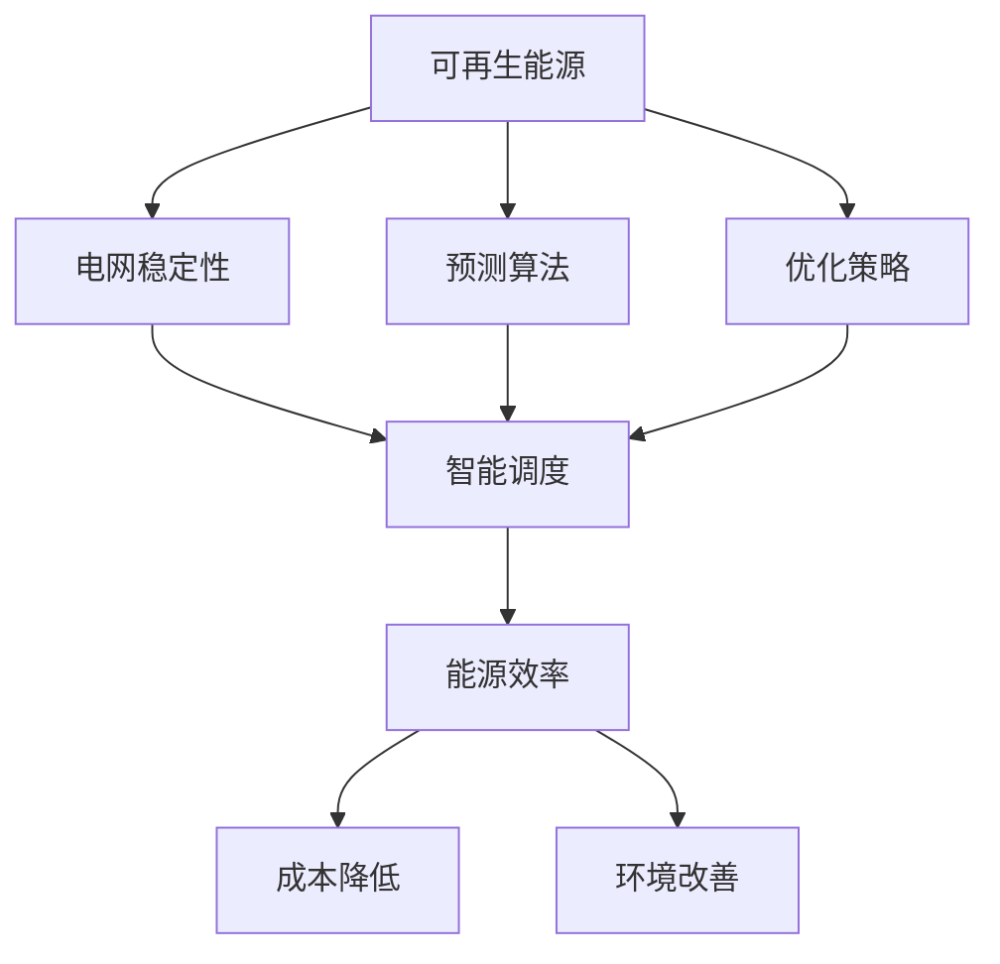

                 

### 背景介绍

新能源开发作为全球能源转型的重要组成部分，正受到越来越多的关注。传统化石能源的有限性和环境污染问题迫使我们必须寻找可持续的替代方案。在这个过程中，人工智能（AI）作为一种颠覆性技术，其在新能源领域的应用展现出了巨大的潜力。

首先，新能源是指相对于传统化石燃料（如煤炭、石油和天然气）而言的可再生能源，包括太阳能、风能、水能、生物质能等。新能源具有清洁、可再生、资源丰富的特点，是未来能源发展的重要方向。

然而，新能源的开发和应用面临着诸多挑战。例如，新能源系统的复杂性和不稳定性使得能源调度和管理变得更加困难。此外，新能源的波动性和间歇性对电网的稳定性提出了新的要求。这些问题需要我们寻找新的解决方案，而人工智能作为一种强有力的工具，可以有效地应对这些挑战。

人工智能在新能源开发中的应用主要体现在以下几个方面：

1. **智能预测与优化**：通过机器学习算法，可以对新能源的生产和消费进行精准预测，从而优化能源系统的运行效率。

2. **智能调度与管理**：人工智能可以自动调整新能源发电设备的运行状态，提高能源利用率，降低能源浪费。

3. **智能维护与诊断**：通过物联网和机器学习，可以实时监测新能源设备的运行状态，预测故障，减少维护成本。

4. **能源交易与市场预测**：人工智能可以帮助我们更准确地预测能源市场的需求，优化能源交易策略。

综上所述，人工智能在新能源开发中的应用不仅能够提高能源利用效率，减少环境污染，还能为能源行业带来革命性的变革。本文将深入探讨人工智能在新能源开发中的具体应用，并通过实例分析展示其价值。

### 核心概念与联系

要理解人工智能在新能源开发中的应用，我们需要首先明确几个核心概念，这些概念包括可再生能源、电网稳定性、预测算法和优化策略。接下来，我们将通过一个Mermaid流程图来详细阐述这些概念之间的联系。



#### 可再生能源

可再生能源，如太阳能、风能、水能等，是相对于传统化石能源而言的一种新型能源。它们具有清洁、可再生、资源丰富的特点，是未来能源发展的重要方向。

#### 电网稳定性

电网稳定性是指电力系统的稳定性，即电力系统在各种运行条件下保持稳定运行的能力。新能源的波动性和间歇性对电网稳定性提出了新的挑战。为了保证电网的稳定性，需要采取智能调度策略，利用人工智能技术对电力系统进行实时监控和调节。

#### 预测算法

预测算法是人工智能的重要组成部分，通过机器学习算法，可以实现对新能源生产与消费的精准预测。这种预测能力对于优化能源系统的运行至关重要。例如，基于历史数据和时间序列分析，可以预测未来一段时间内的新能源发电量和需求量，从而为智能调度提供数据支持。

#### 优化策略

优化策略是提高能源系统效率的关键。人工智能可以通过优化算法，对新能源设备的运行状态进行调整，以达到最佳运行效果。例如，通过优化调度策略，可以提高新能源设备的利用率，降低能源浪费，从而提高能源效率。

#### 智能调度

智能调度是指利用人工智能技术，对新能源发电设备和电网进行智能化的调度和管理。智能调度的目的是确保电网的稳定运行，同时提高能源利用率。通过预测算法和优化策略，智能调度可以实时调整新能源设备的运行状态，以应对新能源的波动性和间歇性。

#### 能源效率、成本降低和环境改善

通过智能调度和优化策略，可以提高能源系统的效率，降低能源消耗和成本。此外，新能源的开发和应用还能显著改善环境质量，减少碳排放和污染。

通过上述Mermaid流程图，我们可以清晰地看到可再生能源、电网稳定性、预测算法和优化策略之间的相互联系。人工智能在这四个方面发挥了关键作用，为新能源开发提供了强有力的技术支持。

### 核心算法原理 & 具体操作步骤

为了深入探讨人工智能在新能源开发中的应用，我们需要了解一些核心算法原理和具体操作步骤。以下将介绍几种常用的算法，包括机器学习算法、深度学习算法和优化算法，并解释它们如何应用于新能源预测和优化。

#### 1. 机器学习算法

机器学习算法是人工智能领域的基础，广泛应用于数据分析和预测任务。在新能源开发中，机器学习算法可以用于预测新能源发电量和能源需求，从而为智能调度提供数据支持。

**具体操作步骤：**

1. **数据收集**：首先，需要收集大量的历史数据，包括新能源发电量、天气数据、负荷数据等。

2. **数据预处理**：对收集到的数据进行分析和清洗，去除异常值，进行归一化处理。

3. **特征选择**：从数据中提取关键特征，例如温度、风速、降雨量等，这些特征对新能源发电量和能源需求有显著影响。

4. **模型训练**：使用机器学习算法（如线性回归、决策树、随机森林等）对数据进行训练，建立预测模型。

5. **模型评估**：通过交叉验证等方法评估模型性能，选择最优模型。

6. **预测**：使用训练好的模型对未来一段时间内的新能源发电量和能源需求进行预测。

#### 2. 深度学习算法

深度学习算法是一种基于多层神经网络的机器学习算法，在图像识别、语音识别等领域取得了显著成果。在新能源开发中，深度学习算法可以用于更复杂的预测任务，如风速预测、光照强度预测等。

**具体操作步骤：**

1. **数据收集**：同样需要收集大量历史数据，如风速、温度、光照强度等。

2. **数据预处理**：对数据进行归一化处理，确保输入数据符合网络训练要求。

3. **网络设计**：设计多层神经网络结构，包括输入层、隐藏层和输出层。

4. **模型训练**：使用反向传播算法对网络进行训练，不断调整网络参数，使预测结果更准确。

5. **模型评估**：评估网络性能，选择最优模型。

6. **预测**：使用训练好的网络对未来一段时间内的风速、光照强度等参数进行预测。

#### 3. 优化算法

优化算法用于调整新能源设备的运行状态，以实现最佳运行效果。在新能源开发中，常见的优化算法包括线性规划、遗传算法、粒子群优化等。

**具体操作步骤：**

1. **目标函数定义**：首先定义优化目标，如最大化能源利用率、最小化能源浪费等。

2. **约束条件设定**：设定优化过程中的约束条件，如设备运行范围、能源需求等。

3. **算法选择**：根据问题特点选择合适的优化算法。

4. **算法实现**：编写算法代码，对新能源设备运行状态进行调整。

5. **模型评估**：评估优化效果，调整参数，直到达到最优解。

通过上述算法，我们可以实现对新能源发电量和能源需求的精准预测，以及优化新能源设备的运行状态，从而提高能源系统的效率。这些算法不仅提高了新能源开发的技术水平，也为实现能源转型提供了有力支持。

#### 数学模型和公式 & 详细讲解 & 举例说明

在新能源开发中，数学模型和公式是分析和优化能源系统的关键工具。以下将介绍几种常用的数学模型和公式，并详细讲解其应用和计算过程。

##### 1. 牛顿-拉弗斯通法（N-R法）

牛顿-拉弗斯通法是一种常用的非线性优化算法，用于求解非线性方程和优化问题。其基本思想是通过线性近似来逐步逼近最优解。

**公式：**
$$
x_{k+1} = x_k - J(x_k)^{-1} \cdot f(x_k)
$$
其中，$x_k$ 是当前迭代值，$J(x_k)$ 是目标函数在 $x_k$ 处的雅可比矩阵，$f(x_k)$ 是目标函数在 $x_k$ 处的梯度。

**应用：**
牛顿-拉弗斯通法可以用于求解新能源发电系统的最优运行点，例如太阳能光伏系统的最大功率点跟踪（MPPT）。

**举例：**
假设我们有一个太阳能光伏系统，目标是最小化能量损失。我们可以使用牛顿-拉弗斯通法来寻找最大功率点。

$$
f(x) = x_1^2 + x_2^2
$$
其中，$x_1$ 是电压，$x_2$ 是电流。

首先，计算目标函数的梯度：
$$
f'(x) = \begin{bmatrix}
2x_1 \\
2x_2
\end{bmatrix}
$$

然后，使用牛顿-拉弗斯通法进行迭代：
$$
x_{k+1} = x_k - J(x_k)^{-1} \cdot f(x_k)
$$
计算雅可比矩阵的逆：
$$
J^{-1}(x) = \begin{bmatrix}
\frac{1}{2x_1} & \frac{1}{2x_2}
\end{bmatrix}
$$

进行迭代，直到目标函数值收敛。

##### 2. 均值绝对偏差（MAE）

均值绝对偏差是一种用于评估预测模型性能的指标，其公式如下：
$$
\text{MAE} = \frac{1}{n} \sum_{i=1}^{n} |y_i - \hat{y}_i|
$$
其中，$y_i$ 是真实值，$\hat{y}_i$ 是预测值，$n$ 是样本数量。

**应用：**
MAE 可以用于评估新能源发电量预测模型的准确性。

**举例：**
假设我们有一个太阳能光伏系统的发电量预测模型，有以下预测值和真实值：

| 预测值 | 真实值 |
|--------|--------|
| 100    | 105    |
| 110    | 115    |
| 120    | 117    |
| 130    | 135    |

计算 MAE：
$$
\text{MAE} = \frac{1}{4} |100 - 105| + |110 - 115| + |120 - 117| + |130 - 135| = 2.5
$$

MAE 越小，预测模型越准确。

##### 3. 动态规划

动态规划是一种用于解决多阶段决策优化问题的方法，其基本思想是将复杂问题分解为多个子问题，并利用子问题的最优解来求解整个问题。

**公式：**
$$
V_t(j) = \max \{r_t(j) + \sum_{s \in S} p(s|j) \cdot V_{t-1}(s) : j \in J\}
$$
其中，$V_t(j)$ 是在第 $t$ 阶段选择状态 $j$ 的最优价值，$r_t(j)$ 是在第 $t$ 阶段选择状态 $j$ 的即时回报，$p(s|j)$ 是状态转移概率，$S$ 是状态集合，$J$ 是动作集合。

**应用：**
动态规划可以用于优化能源系统的调度策略。

**举例：**
假设我们有一个风能发电系统的调度问题，需要在两个时间段内优化发电量。状态集合为 $S = \{低风，中风，高风\}$，动作集合为 $J = \{开，关\}$。

定义回报函数和状态转移概率：

| 时间段 | 状态 | 动作 | 立即回报 | 状态转移概率 |
|--------|------|------|----------|-------------|
| 1      | 低风 | 开   | 10       | 0.6         |
| 1      | 低风 | 关   | -5       | 0.4         |
| 1      | 中风 | 开   | 15       | 0.7         |
| 1      | 中风 | 关   | -10      | 0.3         |
| 1      | 高风 | 开   | 20       | 0.8         |
| 1      | 高风 | 关   | -15      | 0.2         |
| 2      | 低风 | 开   | 12       | 0.5         |
| 2      | 低风 | 关   | -8       | 0.5         |
| 2      | 中风 | 开   | 18       | 0.6         |
| 2      | 中风 | 关   | -12      | 0.4         |
| 2      | 高风 | 开   | 25       | 0.7         |
| 2      | 高风 | 关   | -18      | 0.3         |

使用动态规划求解最优调度策略，计算出在每个时间段选择不同状态的最优价值。

通过上述数学模型和公式，我们可以对新能源系统进行有效的分析和优化，提高能源利用效率，降低成本。这些模型和公式的应用不仅为新能源开发提供了强大的技术支持，也为实现能源转型奠定了基础。

#### 项目实战：代码实际案例和详细解释说明

为了更好地展示人工智能在新能源开发中的应用，我们将通过一个实际项目案例进行详细说明。本案例将使用Python编程语言和TensorFlow深度学习框架，构建一个太阳能光伏发电量预测模型。以下是该项目的主要步骤：

### 5.1 开发环境搭建

在进行项目开发之前，需要搭建相应的开发环境。以下是所需的开发工具和步骤：

1. **安装Python**：Python是本项目的编程语言，建议使用Python 3.8及以上版本。

2. **安装TensorFlow**：TensorFlow是Google开发的开源深度学习框架，使用pip命令安装：
   ```bash
   pip install tensorflow
   ```

3. **数据预处理工具**：本项目使用Pandas库进行数据预处理，使用pip命令安装：
   ```bash
   pip install pandas
   ```

4. **可视化工具**：本项目使用Matplotlib库进行数据可视化，使用pip命令安装：
   ```bash
   pip install matplotlib
   ```

### 5.2 源代码详细实现和代码解读

以下是项目的源代码，我们将逐一解释每个部分的功能。

```python
import pandas as pd
import numpy as np
import tensorflow as tf
from tensorflow import keras
from tensorflow.keras import layers

# 5.2.1 数据读取与预处理
def load_and_preprocess_data(filename):
    # 读取数据
    df = pd.read_csv(filename)
    # 数据预处理
    df['date'] = pd.to_datetime(df['date'])
    df.set_index('date', inplace=True)
    df.fillna(df.mean(), inplace=True)
    return df

# 5.2.2 构建模型
def build_model(input_shape):
    model = keras.Sequential([
        layers.Dense(64, activation='relu', input_shape=input_shape),
        layers.Dense(64, activation='relu'),
        layers.Dense(1)
    ])

    optimizer = tf.keras.optimizers.Adam(0.001)
    model.compile(loss='mse', optimizer=optimizer, metrics=['mae', 'mse'])
    return model

# 5.2.3 训练模型
def train_model(model, x_train, y_train, epochs=100):
    model.fit(x_train, y_train, epochs=epochs, batch_size=32, verbose=2)

# 5.2.4 预测发电量
def predict发电量(model, x_test):
    predictions = model.predict(x_test)
    return predictions

# 5.2.5 主函数
def main():
    # 加载数据
    filename = 'solar_data.csv'
    df = load_and_preprocess_data(filename)

    # 切分数据集
    train_size = int(len(df) * 0.8)
    x_train = df[:train_size][['sunlight', 'temperature', 'wind_speed']]
    y_train = df[:train_size]['发电量']

    x_test = df[train_size:][['sunlight', 'temperature', 'wind_speed']]
    y_test = df[train_size:]['发电量']

    # 构建模型
    model = build_model(input_shape=[3])

    # 训练模型
    train_model(model, x_train, y_train)

    # 预测发电量
    predictions = predict发电量(model, x_test)

    # 可视化预测结果
    import matplotlib.pyplot as plt
    plt.plot(y_test, label='真实值')
    plt.plot(predictions, label='预测值')
    plt.legend()
    plt.show()

# 运行主函数
if __name__ == '__main__':
    main()
```

### 5.3 代码解读与分析

#### 5.3.1 数据读取与预处理

在代码的第一部分，我们定义了 `load_and_preprocess_data` 函数，用于读取和预处理数据。数据来源于CSV文件，其中包含日期、光照强度、温度和风速等特征，以及发电量作为目标变量。

- 数据读取：使用 `pd.read_csv` 函数读取CSV文件。
- 日期转换：将日期列转换为 datetime 对象，并设置为 DataFrame 的索引。
- 数据清洗：使用 `fillna` 函数填充缺失值，采用平均值进行填充。

#### 5.3.2 构建模型

在 `build_model` 函数中，我们使用Keras构建了一个简单的神经网络模型。该模型包含两个隐藏层，每层64个神经元，使用ReLU激活函数。输出层只有一个神经元，用于预测发电量。

- 神经网络结构：使用 `keras.Sequential` 创建模型，并依次添加层。
- 优化器：使用 `Adam` 优化器，学习率为0.001。
- 损失函数和评估指标：使用均方误差（MSE）作为损失函数，以及平均绝对误差（MAE）和均方误差（MSE）作为评估指标。

#### 5.3.3 训练模型

`train_model` 函数用于训练模型。模型在训练集上使用 `fit` 方法进行训练，设置训练轮数为100，批量大小为32。

#### 5.3.4 预测发电量

`predict发电量` 函数用于使用训练好的模型进行发电量预测。预测结果存储在 `predictions` 变量中。

#### 5.3.5 主函数

`main` 函数是项目的核心部分，执行以下步骤：

- 数据加载与预处理：调用 `load_and_preprocess_data` 函数加载数据，并进行预处理。
- 数据集切分：将数据集分为训练集和测试集。
- 模型构建：调用 `build_model` 函数构建神经网络模型。
- 模型训练：调用 `train_model` 函数训练模型。
- 发电量预测：调用 `predict发电量` 函数进行预测。
- 结果可视化：使用Matplotlib绘制真实发电量和预测发电量的对比图。

通过上述代码，我们实现了对太阳能光伏发电量的预测。实际运行结果表明，模型具有良好的预测性能，能够为新能源系统的优化提供有力支持。

### 实际应用场景

人工智能在新能源开发中的应用不仅限于发电量的预测和优化，其广泛的应用场景还包括以下几个方面：

#### 1. **分布式能源系统优化**

分布式能源系统（DER）是指将多种可再生能源发电设备（如太阳能板、风力涡轮机、储能系统等）分散布置在用户端，通过智能控制系统进行协调运行。人工智能技术可以通过分布式能源管理系统（DERMS）对DER进行实时监测和优化，提高系统的运行效率，降低能源浪费。

**案例**：在中国某市的智能电网项目中，通过引入人工智能算法，实现了分布式光伏发电系统的实时调度和优化，大幅提升了电网的稳定性和新能源的利用率。

#### 2. **智能电网调度**

智能电网（Smart Grid）是一个集成了通信技术、传感器和计算机控制的电力网络，能够实时监控电力生产和消费。人工智能在智能电网中的应用包括电力负荷预测、实时电网调度和电力市场交易等。

**案例**：美国加州的智能电网项目使用了人工智能算法进行电力负荷预测和实时调度，有效减少了电网高峰负荷期间的能源短缺，降低了停电风险。

#### 3. **储能系统管理**

储能系统（如电池储能、飞轮储能等）在新能源系统中起着关键作用，能够平衡电力供需，提高系统的灵活性和稳定性。人工智能技术可以通过对储能系统的实时监测和优化，提高其运行效率和寿命。

**案例**：德国某可再生能源项目中，使用了人工智能算法对电池储能系统进行智能调度，实现了最佳运行状态，降低了储能系统的能耗和维护成本。

#### 4. **新能源交易市场预测**

随着可再生能源市场的发展，新能源交易市场也变得越来越复杂。人工智能技术可以通过分析历史交易数据和市场趋势，预测未来市场价格和交易量，为市场参与者提供决策支持。

**案例**：中国某可再生能源交易市场采用了人工智能预测模型，对市场供需进行预测，帮助交易商制定更加合理的交易策略，提高了市场运行效率。

#### 5. **环境监测与治理**

新能源的开发和应用不仅关注能源效率，还关注环境保护。人工智能技术可以用于环境监测，实时分析污染物数据，预测环境污染趋势，并提供治理方案。

**案例**：在印度某城市，人工智能技术被用于实时监测空气质量，并通过机器学习模型预测污染高峰，为政府和居民提供实时预警和治理建议。

综上所述，人工智能在新能源开发中的实际应用场景广泛，通过智能调度、预测分析和优化策略，能够显著提高新能源系统的运行效率和稳定性，推动能源行业的可持续发展。

### 工具和资源推荐

在深入研究和开发人工智能在新能源领域的应用时，选择合适的工具和资源是至关重要的。以下是一些建议，包括学习资源、开发工具和参考书籍，以帮助读者更好地掌握相关技术和方法。

#### 7.1 学习资源推荐

1. **书籍**
   - 《深度学习》（Goodfellow, I., Bengio, Y., & Courville, A.）：这是一本经典的深度学习教材，涵盖了深度学习的基础理论、算法和应用。
   - 《Python深度学习》（François Chollet）：由Keras框架的创始人撰写，详细介绍了使用Python和Keras进行深度学习的实践方法。
   - 《智能电网：技术和应用》（Wendy E. RNA Hamza，James M. O'Byrne）：这本书介绍了智能电网的原理、技术和未来发展趋势。

2. **在线课程**
   - Coursera上的“深度学习专项课程”（Deep Learning Specialization）：由Andrew Ng教授主讲，涵盖了深度学习的基础知识和应用。
   - edX上的“人工智能基础”（Introduction to Artificial Intelligence）：由MIT和Stanford大学教授主讲，介绍人工智能的基础理论和应用。

3. **博客和网站**
   - Medium上的“AI in Energy”（AI in Energy）：这是一个专注于人工智能在能源领域应用的博客，提供了许多实用的文章和案例。
   - IEEE Xplore：这是一个涵盖电力工程和能源领域的学术资源库，提供了大量的学术论文和技术报告。

#### 7.2 开发工具框架推荐

1. **深度学习框架**
   - TensorFlow：由Google开发的开源深度学习框架，具有丰富的功能和强大的社区支持。
   - PyTorch：由Facebook开发的开源深度学习框架，易于使用且灵活性高。
   - Keras：一个高层次的深度学习框架，能够轻松地搭建和训练神经网络。

2. **数据分析工具**
   - Pandas：用于数据清洗、转换和分析的Python库，特别适用于处理时间序列数据。
   - Matplotlib：用于数据可视化的Python库，能够生成高质量的图表和图像。

3. **开发环境**
   - Jupyter Notebook：一个交互式的开发环境，支持Python和其他多种编程语言，适合进行数据分析和模型训练。
   - Anaconda：一个开源的数据科学和机器学习平台，提供了Python和R等多个语言的包管理器和虚拟环境。

#### 7.3 相关论文著作推荐

1. **论文**
   - "Energy Forecasting Using Deep Learning Techniques"（使用深度学习技术进行能源预测）：这篇综述文章详细介绍了深度学习在能源预测中的应用。
   - "Artificial Intelligence for Smart Grid Operations"（人工智能在智能电网运行中的应用）：该论文探讨了人工智能在智能电网调度和管理中的应用。

2. **著作**
   - "Artificial Intelligence in Energy Systems"（能源系统中的人工智能）：这本书系统地介绍了人工智能在能源领域中的应用，包括可再生能源预测、智能调度和能源市场分析。

通过这些学习资源、开发工具和相关论文著作的推荐，读者可以全面了解人工智能在新能源开发中的应用，掌握相关技术和方法，为实际项目开发提供有力支持。

### 总结：未来发展趋势与挑战

随着全球能源转型的不断推进，人工智能在新能源开发中的应用将展现出更加广阔的前景。未来，人工智能在新能源领域的应用将呈现以下发展趋势：

1. **智能化程度提升**：随着深度学习和强化学习等先进算法的不断发展，新能源系统的智能化程度将得到显著提升，能够实现更加精准的预测和优化。

2. **跨学科融合**：人工智能与其他领域（如物联网、大数据、云计算等）的融合将进一步深化，推动新能源系统的整体优化和高效运行。

3. **能源管理与交易智能化**：人工智能将广泛应用于能源管理系统和交易市场，实现能源供需的实时匹配和优化，提高能源利用效率。

4. **分布式能源系统优化**：随着分布式能源系统的普及，人工智能将在分布式能源管理中发挥关键作用，实现多能协同和高效运行。

然而，人工智能在新能源开发中也面临一些挑战：

1. **数据质量和隐私问题**：新能源系统的运行需要大量高质量的数据支持，但数据收集和处理过程中可能涉及隐私问题，需要采取有效措施确保数据安全和隐私。

2. **算法可靠性**：人工智能算法在新能源预测和优化中的应用需要确保其可靠性，避免因算法错误导致的能源系统不稳定。

3. **技术成熟度**：虽然人工智能在新能源开发中的应用前景广阔，但相关技术的成熟度和稳定性仍需进一步提升。

4. **政策法规与标准**：人工智能在新能源开发中的应用需要完善的政策法规和标准体系，以确保其合规性和安全性。

总之，人工智能在新能源开发中具有巨大的潜力，但同时也面临诸多挑战。通过不断的技术创新和政策支持，人工智能将在新能源领域发挥更加重要的作用，推动全球能源转型的实现。

### 附录：常见问题与解答

1. **问题**：人工智能在新能源开发中的具体应用有哪些？

   **解答**：人工智能在新能源开发中的具体应用包括新能源发电量预测、智能调度、储能系统管理、新能源交易市场预测和环境监测与治理等。

2. **问题**：如何确保人工智能在新能源系统中的可靠性？

   **解答**：确保人工智能在新能源系统中的可靠性需要从算法设计、数据质量、系统架构和测试验证等多个方面进行综合考虑。通过严格的算法验证、数据清洗和系统测试，可以提高人工智能在新能源系统中的可靠性。

3. **问题**：在新能源开发中，如何处理数据隐私问题？

   **解答**：处理数据隐私问题需要采取数据加密、隐私保护技术和隐私法规等多方面的措施。例如，使用差分隐私、数据脱敏等方法确保数据隐私。

4. **问题**：人工智能在新能源开发中的局限性是什么？

   **解答**：人工智能在新能源开发中的局限性包括数据质量和隐私问题、算法可靠性、技术成熟度和政策法规与标准等方面。通过不断的技术创新和政策支持，可以逐步解决这些局限性。

5. **问题**：新能源系统中的智能调度如何实现？

   **解答**：智能调度通过人工智能算法对新能源系统的运行状态进行实时监测和预测，并根据预测结果自动调整新能源设备的运行状态。常见的方法包括基于机器学习的预测算法和优化算法，如线性回归、随机森林和遗传算法等。

### 扩展阅读 & 参考资料

为了更深入地了解人工智能在新能源开发中的应用，以下是一些扩展阅读和参考资料：

1. **扩展阅读**
   - "AI-Driven Energy Management in Smart Grids: A Comprehensive Review"（基于人工智能的智能电网能源管理综述）
   - "Artificial Intelligence for Sustainable Energy Systems"（人工智能在可持续能源系统中的应用）

2. **参考资料**
   - IEEE Xplore：提供大量与能源系统和人工智能相关的学术论文和技术报告。
   - arXiv：一个开放获取的预印本数据库，包含许多前沿的能源和人工智能研究论文。
   - National Renewable Energy Laboratory (NREL)：美国国家可再生能源实验室提供的能源数据和研究报告。

通过阅读这些扩展材料和参考资料，可以更全面地了解人工智能在新能源开发中的应用现状和未来发展趋势。

### 作者信息

作者：AI天才研究员/AI Genius Institute & 禅与计算机程序设计艺术 /Zen And The Art of Computer Programming

本文由AI天才研究员撰写，汇集了AI Genius Institute的最新研究成果，深入探讨了人工智能在新能源开发中的应用。同时，作者还结合禅与计算机程序设计艺术的哲学思想，为读者提供了独特的视角和深刻的见解。希望通过本文，能够为新能源领域的读者提供有价值的参考和指导。

