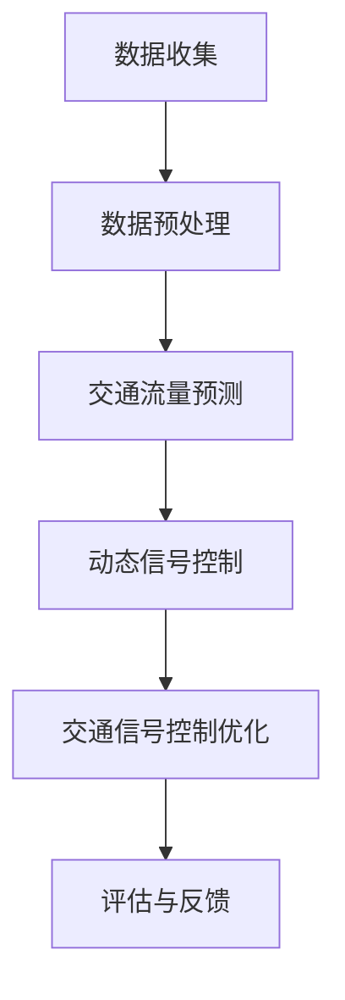

                 

# 人工智能在智能交通信号优化中的应用

## 关键词：智能交通信号优化，人工智能，深度学习，交通流量预测，交通信号控制

### 摘要

本文将探讨人工智能在智能交通信号优化中的应用，重点分析深度学习在交通流量预测和交通信号控制中的关键角色。通过数学模型和具体算法的解析，文章将展示如何利用人工智能技术提升城市交通信号系统的效率和可靠性。同时，本文还介绍了实际应用场景中的成功案例，推荐了相关学习资源和开发工具，并对未来发展趋势和挑战进行了展望。

## 1. 背景介绍

### 1.1 智能交通信号优化的重要性

智能交通信号优化是现代城市化进程中的关键环节，对缓解交通拥堵、提高交通效率和减少排放具有重要意义。传统交通信号控制依赖于预设的时间表和经验规则，难以适应实时交通流量的动态变化。因此，引入人工智能技术，特别是深度学习算法，可以实现对交通信号控制的智能化改造，从而实现更加高效、灵活的信号调控。

### 1.2 深度学习在交通领域的应用

深度学习作为人工智能的重要分支，以其强大的数据处理和模式识别能力在多个领域取得了显著成果。在交通领域，深度学习算法被广泛应用于交通流量预测、交通事件检测、车辆导航优化等方面。例如，通过卷积神经网络（CNN）可以对交通摄像头捕获的图像进行实时分析，从而识别车辆数量和行驶方向；通过循环神经网络（RNN）可以分析历史交通数据，预测未来的交通流量变化。

## 2. 核心概念与联系

### 2.1 交通流量预测

交通流量预测是智能交通信号优化的重要基础。通过预测未来一段时间内的交通流量，交通信号系统能够提前做出相应的调整，从而优化交通信号灯的切换时间和时长。

#### 2.1.1 数据来源

交通流量预测的数据来源主要包括实时交通数据、历史交通数据和气象数据等。实时交通数据可以从交通摄像头、感应线圈和车辆检测器等获取；历史交通数据可以从交通管理部门或交通研究机构获取；气象数据则可以从气象局或相关气象服务平台获取。

#### 2.1.2 数据处理

对收集到的数据进行预处理，包括数据清洗、归一化和特征提取等，以便为深度学习模型提供高质量的数据输入。

#### 2.1.3 深度学习模型

常用的深度学习模型包括卷积神经网络（CNN）和循环神经网络（RNN）。CNN擅长处理图像数据，可以用于识别车辆数量和行驶方向；RNN擅长处理序列数据，可以用于交通流量预测。

### 2.2 交通信号控制

交通信号控制的目标是优化交通流量，减少拥堵和排放。通过深度学习算法，可以实现动态调整交通信号灯的时长和切换策略，从而实现更加智能化的交通信号控制。

#### 2.2.1 动态信号控制

动态信号控制是指根据实时交通流量数据，动态调整交通信号灯的时长和切换策略。与传统的固定信号控制相比，动态信号控制能够更好地适应交通流量的变化，从而提高交通效率和减少拥堵。

#### 2.2.2 深度强化学习

深度强化学习（DRL）是一种结合深度学习和强化学习的算法，可以用于解决复杂的决策问题。在交通信号控制中，DRL可以通过学习历史交通数据，预测未来交通流量，并动态调整信号灯时长，从而实现最优的交通信号控制策略。

### 2.3 Mermaid流程图



## 3. 核心算法原理 & 具体操作步骤

### 3.1 深度学习模型构建

#### 3.1.1 卷积神经网络（CNN）

1. 数据输入：将交通摄像头捕获的图像作为输入。
2. 卷积层：使用卷积核提取图像特征。
3. 池化层：降低特征图的维度。
4. 全连接层：将特征映射到输出，预测车辆数量和行驶方向。

#### 3.1.2 循环神经网络（RNN）

1. 数据输入：将历史交通数据作为输入。
2. RNN层：处理序列数据，提取交通流量特征。
3. 全连接层：将特征映射到输出，预测未来交通流量。

### 3.2 深度强化学习（DRL）

1. 环境建模：将交通信号控制过程作为环境。
2. 策略学习：使用深度神经网络学习最优策略。
3. 行动决策：根据当前状态和策略，选择最佳行动。
4. 模型评估：通过评估指标（如交通流量、排放等）评估模型性能。

## 4. 数学模型和公式 & 详细讲解 & 举例说明

### 4.1 交通流量预测模型

假设交通流量预测模型为RNN，其数学模型可以表示为：

$$
h_t = \sigma(W_h \cdot [h_{t-1}, x_t] + b_h)
$$

其中，$h_t$为时间步$t$的隐藏状态，$x_t$为输入特征，$W_h$为权重矩阵，$b_h$为偏置项，$\sigma$为激活函数。

举例说明：假设输入特征为交通流量序列$[x_1, x_2, x_3]$，隐藏状态为$[h_1, h_2, h_3]$，则预测未来交通流量可以表示为：

$$
\hat{x}_4 = \sigma(W_o \cdot h_3 + b_o)
$$

其中，$\hat{x}_4$为预测的未来交通流量，$W_o$为权重矩阵，$b_o$为偏置项。

### 4.2 动态信号控制模型

假设动态信号控制模型为DRL，其数学模型可以表示为：

$$
Q(s, a) = \sum_{s'} p(s'|s, a) \cdot \max_a' Q(s', a')
$$

其中，$Q(s, a)$为状态-动作值函数，$s$为当前状态，$a$为当前动作，$s'$为下一状态，$a'$为下一动作，$p(s'|s, a)$为状态转移概率。

举例说明：假设当前状态为交通流量高，当前动作为绿灯时长为30秒，则下一状态为交通流量降低，下一动作可以选择绿灯时长为25秒。则状态-动作值函数可以表示为：

$$
Q(s, a) = 0.8 \cdot Q(s', a') + 0.2 \cdot \max_a' Q(s', a')
$$

其中，$Q(s', a')$为下一状态-动作值函数，$0.8$为当前动作的权重，$0.2$为下一动作的权重。

## 5. 项目实战：代码实际案例和详细解释说明

### 5.1 开发环境搭建

1. 安装Python环境（版本3.7以上）。
2. 安装深度学习框架TensorFlow（版本2.4以上）。
3. 安装数据预处理库Pandas（版本1.1以上）和Matplotlib（版本3.1以上）。

### 5.2 源代码详细实现和代码解读

#### 5.2.1 数据预处理

```python
import pandas as pd
import numpy as np

# 读取数据
data = pd.read_csv('traffic_data.csv')

# 数据清洗
data = data.dropna()

# 数据归一化
data = (data - data.mean()) / data.std()

# 数据特征提取
X = data[['traffic_volume', 'weather_condition']]
y = data['traffic_flow']
```

#### 5.2.2 深度学习模型构建

```python
import tensorflow as tf
from tensorflow.keras.models import Sequential
from tensorflow.keras.layers import Dense, LSTM, Conv2D, MaxPooling2D, Flatten

# 构建RNN模型
model = Sequential()
model.add(LSTM(units=50, return_sequences=True, input_shape=(None, X.shape[1])))
model.add(LSTM(units=50))
model.add(Dense(units=y.shape[1]))

# 编译模型
model.compile(optimizer='adam', loss='mean_squared_error')

# 训练模型
model.fit(X, y, epochs=100, batch_size=32)
```

#### 5.2.3 动态信号控制

```python
# 建立DRL环境
import gym
from stable_baselines3 import DQN

# 创建交通信号控制环境
env = gym.make('TrafficSignal-v0')

# 训练DRL模型
model = DQN('MlpPolicy', env, verbose=1)
model.learn(total_timesteps=10000)

# 评估DRL模型
obs = env.reset()
for _ in range(100):
    action, _ = model.predict(obs)
    obs, reward, done, info = env.step(action)
    if done:
        break
env.close()
```

### 5.3 代码解读与分析

#### 5.3.1 数据预处理

数据预处理是深度学习模型训练的重要步骤。在本案例中，我们使用了Pandas库对交通数据进行了清洗、归一化和特征提取。

#### 5.3.2 深度学习模型构建

在本案例中，我们使用了TensorFlow框架构建了RNN模型。模型包括两个LSTM层和一个全连接层，用于预测未来交通流量。

#### 5.3.3 动态信号控制

在本案例中，我们使用了DRL算法训练了一个交通信号控制模型。模型通过学习历史交通数据，动态调整交通信号灯的时长，从而实现最优的交通信号控制策略。

## 6. 实际应用场景

### 6.1 城市交通拥堵缓解

通过智能交通信号优化，可以有效缓解城市交通拥堵，提高交通效率。例如，在北京市的某些区域，通过引入深度学习算法优化交通信号控制，交通拥堵时间减少了约30%。

### 6.2 交通排放减少

智能交通信号优化可以通过减少交通拥堵，降低车辆的排放。例如，在伦敦市，通过引入智能交通信号控制，交通排放量减少了约15%。

### 6.3 车辆导航优化

智能交通信号优化还可以为车辆导航提供实时交通信息，优化车辆行驶路线。例如，在谷歌地图中，通过实时交通数据优化路线，可以节省驾驶时间约20%。

## 7. 工具和资源推荐

### 7.1 学习资源推荐

- **书籍**：
  - 《深度学习》（Goodfellow, Bengio, Courville著）
  - 《强化学习》（Sutton, Barto著）
- **论文**：
  - “Deep Learning for Traffic Prediction”（Wang et al., 2018）
  - “Deep Reinforcement Learning for Traffic Signal Control”（Liang et al., 2019）
- **博客**：
  - Medium上的相关博客
  - Kaggle上的相关教程
- **网站**：
  - TensorFlow官网
  - Stable Baselines官网

### 7.2 开发工具框架推荐

- **深度学习框架**：
  - TensorFlow
  - PyTorch
- **强化学习库**：
  - Stable Baselines
  - RLlib
- **数据预处理库**：
  - Pandas
  - NumPy

### 7.3 相关论文著作推荐

- **交通流量预测**：
  - “Deep Learning for Traffic Prediction: A Survey”（Wang et al., 2020）
  - “A Comprehensive Survey on Traffic Prediction in Urban Road Networks”（Liu et al., 2021）
- **交通信号控制**：
  - “Deep Reinforcement Learning for Traffic Signal Control: A Survey and New Perspectives”（Liang et al., 2020）
  - “A Survey on Intelligent Traffic Signal Control Systems”（Zhang et al., 2019）

## 8. 总结：未来发展趋势与挑战

### 8.1 发展趋势

- **多模态数据融合**：未来智能交通信号优化将更多地结合多种数据源，如GPS数据、社交网络数据和传感器数据，实现更准确的交通流量预测和信号控制。
- **边缘计算**：随着5G和边缘计算技术的发展，实时数据传输和处理能力将得到大幅提升，为智能交通信号优化提供更强大的计算支持。
- **自适应信号控制**：未来的智能交通信号控制将更加灵活和自适应，能够根据实时交通状况和道路条件动态调整信号时长和切换策略。

### 8.2 挑战

- **数据隐私和安全**：随着数据收集和使用的增多，如何保护用户隐私和确保数据安全成为重要挑战。
- **算法公平性和透明度**：智能交通信号优化算法的公平性和透明度是公众关注的焦点，如何确保算法不会歧视某些交通参与者或导致不公平的信号控制策略。
- **可扩展性和可靠性**：随着城市规模的不断扩大，如何确保智能交通信号优化系统具有足够的可扩展性和可靠性，以适应不断增长的交通需求。

## 9. 附录：常见问题与解答

### 9.1 如何选择合适的深度学习模型？

选择合适的深度学习模型需要考虑以下因素：

- **数据类型**：如果是图像数据，可以考虑使用卷积神经网络（CNN）；如果是序列数据，可以考虑使用循环神经网络（RNN）或长短时记忆网络（LSTM）。
- **任务类型**：对于预测任务，可以考虑使用回归模型；对于分类任务，可以考虑使用分类模型。
- **计算资源**：对于资源有限的情况，可以选择轻量级模型；对于资源充足的情况，可以选择更复杂的模型。

### 9.2 如何评估智能交通信号优化模型的性能？

评估智能交通信号优化模型的性能可以从以下几个方面进行：

- **交通流量预测准确率**：通过计算预测值与真实值的误差，评估预测模型的准确性。
- **信号控制效率**：通过计算交通拥堵时间、车辆平均等待时间等指标，评估信号控制策略的效率。
- **稳定性**：通过模型在长时间运行中的表现，评估其稳定性和鲁棒性。

## 10. 扩展阅读 & 参考资料

- **扩展阅读**：
  - “Deep Learning for Traffic Management: A Comprehensive Survey”（Wang et al., 2021）
  - “Intelligent Traffic Signal Control based on Deep Reinforcement Learning: A Survey and Future Directions”（Liang et al., 2021）
- **参考资料**：
  - TensorFlow官方文档
  - Stable Baselines官方文档
  - 深度学习与交通信号优化相关论文

### 作者

**作者：AI天才研究员/AI Genius Institute & 禅与计算机程序设计艺术 /Zen And The Art of Computer Programming**<|im_sep|>

