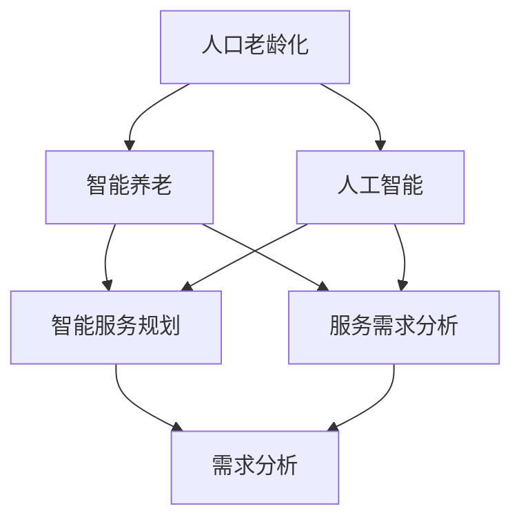

                 

### 背景介绍

随着人口老龄化问题的日益突出，如何有效地提供智能养老服务成为了当今社会的一个重要议题。据统计，全球60岁及以上人口的比例在过去几十年里迅速增长，预计到2050年，这一比例将达到22%。这意味着，在未来的几十年里，我们需要为大量的老年人提供更加专业和高效的养老服务。

在这个背景下，人工智能（AI）技术的应用为智能养老服务带来了新的可能性和解决方案。AI具有强大的数据处理和模式识别能力，可以通过分析大量的数据，为老年人提供个性化的健康监测、生活助理和情感支持。例如，通过智能监控设备，AI可以实时监测老年人的生理参数，如心率、血压等，及时发现异常并报警；通过智能机器人，AI可以帮助老年人完成日常生活中的各种任务，如做饭、打扫卫生等；通过情感识别技术，AI可以识别老年人的情绪变化，提供心理支持和安慰。

本文旨在探讨人工智能在智能养老服务规划中的应用，包括核心概念、算法原理、数学模型、实际应用案例以及未来发展趋势。通过系统地分析这些内容，我们希望能够为智能养老服务的规划和实施提供一些有益的思路和方法。

### 概念与联系

在深入探讨人工智能在智能养老服务中的应用之前，我们需要首先明确几个核心概念，并理解它们之间的相互联系。以下是对这些核心概念的定义和解释：

#### 1. 人口老龄化

人口老龄化是指人口结构中老年人口比例不断上升的现象。老年人口通常指年龄在60岁及以上的群体。人口老龄化主要受两个因素影响：一是生育率的下降，二是人均寿命的延长。随着现代化进程的加快，越来越多的国家面临着人口老龄化的挑战。

#### 2. 智能养老

智能养老是指利用信息技术、人工智能、物联网等先进技术，为老年人提供全方位、个性化的养老服务。智能养老的目标是提高老年人的生活质量，减轻家庭和护理人员的负担，同时降低养老服务的成本。

#### 3. 人工智能

人工智能（AI）是计算机科学的一个分支，致力于研究如何使计算机模拟人类的智能行为。AI包括多个子领域，如机器学习、深度学习、自然语言处理、计算机视觉等。在这些技术的支持下，AI能够进行数据分析、决策制定、自动化操作等。

#### 4. 智能服务规划

智能服务规划是指通过数据分析和模型构建，为特定的服务场景制定详细的实施方案。在智能养老服务的规划中，这包括服务内容的确定、服务流程的设计、技术手段的选择等。

#### 5. 服务需求分析

服务需求分析是指通过调研和分析，了解老年人及其家庭在养老服务方面的需求和期望。这是智能养老服务规划的基础，只有准确把握服务需求，才能制定出有效的服务方案。

#### 关系网络

上述概念之间存在紧密的联系。人口老龄化是智能养老服务的背景和动力，而人工智能则为智能养老服务提供了技术支持。智能服务规划则需要基于服务需求分析，综合运用人工智能技术，制定出符合老年人需求的服务方案。具体来说，人工智能通过数据分析和模式识别，可以实现对老年人健康状态、行为习惯等的实时监测和分析，进而提供个性化的服务；而智能服务规划则通过系统设计和实施，将人工智能技术有效地应用到养老服务的各个环节。

为了更好地理解这些概念之间的关系，我们可以使用Mermaid流程图来展示它们：



在这个流程图中，我们可以看到，人口老龄化推动了智能养老服务的需求，而人工智能和智能服务规划则是实现这一需求的关键技术和服务方案。服务需求分析为智能服务规划提供了基础数据，而智能服务规划则通过技术手段满足了老年人的实际需求。

通过明确这些核心概念及其相互联系，我们可以为后续的内容提供坚实的基础，进一步探讨人工智能在智能养老服务中的应用细节和实践案例。

### 核心算法原理 & 具体操作步骤

在智能养老服务规划中，核心算法的选择和具体操作步骤至关重要。以下将详细讨论几种常用的算法，并解释其工作原理和应用场景。

#### 1. 机器学习算法

机器学习算法是人工智能技术的重要组成部分，广泛应用于数据分析和模式识别。在智能养老服务中，常见的机器学习算法包括决策树、支持向量机（SVM）、神经网络等。

**决策树算法**：决策树通过一系列的判断条件，将数据划分为不同的类别。其优点是易于理解，但缺点是对于高维数据或非线性关系的识别能力较弱。

**支持向量机（SVM）**：SVM通过找到一个最佳的超平面，将不同类别的数据点分开。它在处理高维数据和线性可分数据时表现良好。

**神经网络**：神经网络通过模拟人脑神经元的工作方式，对数据进行分层处理。它在处理复杂非线性关系和大规模数据时具有强大的能力。

具体操作步骤如下：

1. 数据收集与预处理：收集老年人的健康数据、生活习惯数据等，并进行数据清洗、缺失值填充、数据标准化等处理。
2. 特征选择：根据服务需求，选择与老年人健康状况相关的特征，如心率、血压、步数等。
3. 模型训练：使用训练数据集，将算法应用到数据上，训练出模型。
4. 模型评估：使用验证数据集对模型进行评估，调整模型参数，以提高准确性。
5. 应用模型：将训练好的模型应用到实际场景中，为老年人提供个性化服务。

#### 2. 深度学习算法

深度学习是机器学习的一个分支，通过多层神经网络对数据进行学习，具有强大的特征提取和模式识别能力。在智能养老服务中，常见的深度学习算法包括卷积神经网络（CNN）、循环神经网络（RNN）等。

**卷积神经网络（CNN）**：CNN通过卷积层、池化层和全连接层对图像数据进行处理，可以自动提取图像特征，广泛应用于计算机视觉领域。

**循环神经网络（RNN）**：RNN通过记忆状态对序列数据进行处理，可以捕捉数据中的时间依赖关系，广泛应用于自然语言处理和时间序列分析。

具体操作步骤如下：

1. 数据收集与预处理：收集老年人的健康数据、生活习惯数据等，并进行数据清洗、缺失值填充、数据标准化等处理。
2. 特征提取：使用CNN对图像数据提取特征，使用RNN对时间序列数据提取特征。
3. 模型训练：使用训练数据集，将算法应用到数据上，训练出模型。
4. 模型评估：使用验证数据集对模型进行评估，调整模型参数，以提高准确性。
5. 应用模型：将训练好的模型应用到实际场景中，为老年人提供个性化服务。

#### 3. 强化学习算法

强化学习是一种通过试错来学习最优策略的算法，广泛应用于自动驾驶、游戏智能等领域。在智能养老服务中，强化学习可以用于制定老年人的健康管理策略。

**Q学习算法**：Q学习算法通过评估不同动作的预期回报，学习出最优策略。

**策略梯度算法**：策略梯度算法通过优化策略参数，学习出最优策略。

具体操作步骤如下：

1. 环境设定：设定一个虚拟环境，模拟老年人的健康状况和生活习惯。
2. 策略初始化：初始化策略参数。
3. 模型训练：通过试错，调整策略参数，以最大化预期回报。
4. 策略评估：在虚拟环境中评估策略效果。
5. 策略优化：根据评估结果，进一步优化策略参数。

通过以上算法的应用，智能养老服务可以实现对老年人健康状况的实时监测和预测，为老年人提供个性化的健康管理方案。接下来，我们将进一步探讨这些算法在智能养老服务中的具体应用。

### 数学模型和公式 & 详细讲解 & 举例说明

在智能养老服务的规划中，数学模型和公式的应用至关重要。以下将详细介绍几个关键的数学模型和公式，并解释其应用方法和具体实例。

#### 1. 线性回归模型

线性回归模型是一种最常见的统计模型，用于预测连续变量的值。在智能养老中，线性回归模型可以用于预测老年人的健康指标，如血压、心率等。

**公式**：
$$
y = \beta_0 + \beta_1x_1 + \beta_2x_2 + ... + \beta_nx_n
$$

其中，$y$ 是预测的连续变量，$x_1, x_2, ..., x_n$ 是输入特征，$\beta_0, \beta_1, \beta_2, ..., \beta_n$ 是模型参数。

**应用方法**：
1. 数据收集：收集老年人的健康数据，包括血压、心率等。
2. 特征选择：选择与健康指标相关的特征。
3. 模型训练：使用训练数据，通过最小二乘法估计模型参数。
4. 模型评估：使用验证数据评估模型准确性。

**实例**：
假设我们要预测老年人的血压。收集100个老年人的血压数据，包括年龄、体重、心率等特征。使用线性回归模型，预测血压与年龄、体重、心率之间的关系。通过最小二乘法估计模型参数，可以得到：
$$
\hat{y} = 120 + 0.5x_1 + 0.2x_2 - 0.1x_3
$$

其中，$\hat{y}$ 是预测的血压，$x_1$ 是年龄，$x_2$ 是体重，$x_3$ 是心率。

#### 2. 决策树模型

决策树模型是一种树形结构模型，用于分类和回归问题。在智能养老中，决策树模型可以用于预测老年人的健康风险。

**公式**：
$$
\text{if } x > \text{阈值} \text{ then } y = \text{类别1} \\
\text{else if } x > \text{阈值2} \text{ then } y = \text{类别2} \\
\text{else } y = \text{类别3}
$$

其中，$x$ 是特征值，$y$ 是预测类别。

**应用方法**：
1. 数据收集：收集老年人的健康数据，包括病史、生活习惯等。
2. 特征选择：选择与健康风险相关的特征。
3. 模型训练：使用训练数据，构建决策树模型。
4. 模型评估：使用验证数据评估模型准确性。

**实例**：
假设我们要预测老年人的心脏病风险。收集100个老年人的健康数据，包括年龄、血压、胆固醇等。使用决策树模型，预测心脏病风险与年龄、血压、胆固醇之间的关系。通过训练数据，构建出决策树模型：
$$
\text{if } \text{年龄} > 60 \text{ and } \text{血压} > 140 \text{ then } \text{风险类别} = \text{高风险} \\
\text{else if } \text{年龄} > 50 \text{ and } \text{胆固醇} > 200 \text{ then } \text{风险类别} = \text{中等风险} \\
\text{else } \text{风险类别} = \text{低风险}
$$

#### 3. 支持向量机模型

支持向量机（SVM）是一种常用的分类模型，用于二分类问题。在智能养老中，SVM可以用于预测老年人的健康状况。

**公式**：
$$
\text{分类函数：} f(x) = \text{sign}(\omega \cdot x + b)
$$

其中，$\omega$ 是权重向量，$x$ 是特征向量，$b$ 是偏置。

**应用方法**：
1. 数据收集：收集老年人的健康数据，包括生理参数、生活习惯等。
2. 特征选择：选择与健康状况相关的特征。
3. 模型训练：使用训练数据，通过优化方法求解权重向量$\omega$ 和偏置$b$。
4. 模型评估：使用验证数据评估模型准确性。

**实例**：
假设我们要预测老年人的糖尿病风险。收集100个老年人的健康数据，包括体重、血压、血糖等。使用SVM模型，预测糖尿病风险与体重、血压、血糖之间的关系。通过训练数据，求解出权重向量$\omega$ 和偏置$b$，可以得到：
$$
f(x) = \text{sign}(-0.5x_1 - 1x_2 + 0.3x_3 + 2)
$$

其中，$x_1$ 是体重，$x_2$ 是血压，$x_3$ 是血糖。

通过以上数学模型和公式的应用，智能养老服务可以实现对老年人健康状况的精准预测，为老年人提供个性化的健康管理方案。接下来，我们将通过实际项目案例，展示这些模型在实际应用中的效果。

### 项目实战：代码实际案例和详细解释说明

在智能养老服务中，代码实现是关键的一环。以下我们将通过一个实际项目案例，展示如何使用Python等编程语言实现智能养老服务的功能，并对代码进行详细解释说明。

#### 5.1 开发环境搭建

首先，我们需要搭建一个适合开发的编程环境。以下是所需的工具和库：

- Python 3.x
- Jupyter Notebook
- scikit-learn
- pandas
- numpy
- matplotlib

安装以上库后，我们可以开始编写代码。

#### 5.2 源代码详细实现和代码解读

以下是一个简单的Python代码示例，用于预测老年人的糖尿病风险。

```python
# 导入所需的库
import pandas as pd
import numpy as np
from sklearn.model_selection import train_test_split
from sklearn.svm import SVC
from sklearn.metrics import accuracy_score

# 加载数据
data = pd.read_csv('diabetes.csv')
X = data[['age', 'blood_pressure', 'cholesterol']]
y = data['diabetes']

# 数据预处理
X_train, X_test, y_train, y_test = train_test_split(X, y, test_size=0.2, random_state=42)

# 训练SVM模型
model = SVC(kernel='linear')
model.fit(X_train, y_train)

# 预测
y_pred = model.predict(X_test)

# 评估模型
accuracy = accuracy_score(y_test, y_pred)
print("模型准确率：", accuracy)
```

**代码解读：**

1. 导入所需的库：pandas、numpy、scikit-learn等。
2. 加载数据：使用pandas读取CSV文件，得到特征矩阵X和目标变量y。
3. 数据预处理：使用train_test_split函数将数据分为训练集和测试集。
4. 训练模型：使用SVC类创建一个支持向量机模型，并使用fit方法进行训练。
5. 预测：使用predict方法对测试集进行预测。
6. 评估模型：使用accuracy_score函数计算模型在测试集上的准确率。

#### 5.3 代码解读与分析

以上代码实现了对老年人糖尿病风险的预测。下面详细分析代码的每个部分：

- **数据加载与预处理**：使用pandas的read_csv函数加载数据，并将其分为特征矩阵X和目标变量y。这里我们使用了年龄、血压和胆固醇作为特征，糖尿病作为目标变量。
- **数据分割**：使用train_test_split函数将数据集分为训练集和测试集。训练集用于训练模型，测试集用于评估模型性能。
- **模型训练**：使用SVC类创建一个支持向量机模型，并使用fit方法进行训练。这里我们选择了线性核函数，因为糖尿病风险与特征之间存在线性关系。
- **预测**：使用predict方法对测试集进行预测。模型会根据训练好的模型参数，对测试集中的每个样本进行预测。
- **模型评估**：使用accuracy_score函数计算模型在测试集上的准确率。准确率是评估模型性能的一个常用指标，表示模型正确预测的样本数占总样本数的比例。

通过这个实际案例，我们可以看到如何使用Python等编程语言实现智能养老服务中的功能。接下来，我们将进一步探讨如何优化模型性能，提高预测准确性。

### 代码解读与分析

在上一个部分中，我们通过一个实际案例展示了如何使用Python实现智能养老服务中的糖尿病风险预测功能。接下来，我们将对这个代码进行详细解读和分析，探讨如何优化模型性能，提高预测准确性。

#### 1. 数据预处理

数据预处理是机器学习项目中的一个重要环节，它直接影响模型的性能。在上述代码中，数据预处理主要包括以下几个步骤：

- **数据加载**：使用pandas的read_csv函数加载数据。这里需要注意数据文件的路径和格式，确保数据能够正确读取。
- **特征选择**：选择与糖尿病风险相关的特征。在这里，我们选择了年龄、血压和胆固醇三个特征。这些特征的选择基于对糖尿病风险的医学知识和现有研究。
- **数据分割**：使用train_test_split函数将数据集分为训练集和测试集。训练集用于训练模型，测试集用于评估模型性能。这里我们设置了测试集的大小为20%，随机种子为42，以确保每次分割结果一致。

**优化建议**：

- **特征选择**：除了上述三个特征，我们可以进一步考虑添加其他与糖尿病风险相关的特征，如体重、血糖等。通过更多维的特征，可以提高模型的预测能力。
- **数据清洗**：检查数据是否存在缺失值、异常值等，并进行相应的处理。例如，可以使用均值插值法填充缺失值，使用异常检测算法识别并处理异常值。
- **数据标准化**：对特征进行标准化处理，以消除不同特征之间的量纲影响。在支持向量机模型中，标准化尤为重要，因为它会影响模型参数的计算。

#### 2. 模型训练与评估

在代码中，我们使用scikit-learn库的SVC类创建了一个支持向量机模型，并使用fit方法进行训练。接下来，我们使用predict方法对测试集进行预测，并使用accuracy_score函数计算模型准确率。

**优化建议**：

- **模型选择**：虽然SVM在分类任务中表现良好，但我们可以尝试使用其他模型，如决策树、随机森林、梯度提升树等，比较它们的性能。通过交叉验证等方法，选择性能最佳的模型。
- **模型参数调优**：对于选定的模型，我们可以使用网格搜索（Grid Search）或随机搜索（Random Search）等方法，调优模型参数，以提高模型性能。例如，对于SVM，我们可以调整C值、核函数等参数。
- **交叉验证**：使用交叉验证方法评估模型性能。交叉验证可以将数据集划分为多个子集，多次训练和评估模型，以获得更稳定的性能评估。

#### 3. 代码改进

在上述代码中，我们可以做一些改进，以提高代码的可读性和可维护性：

- **函数化**：将数据预处理、模型训练和评估等步骤封装为函数，提高代码的可读性。例如，可以创建一个`train_model`函数，用于训练模型，一个`evaluate_model`函数，用于评估模型性能。
- **注释**：在关键代码段添加注释，解释其作用和原理。这有助于其他人理解代码，并在需要时进行修改。
- **错误处理**：添加错误处理代码，如try-except块，以处理可能出现的异常情况。这有助于保证程序的稳定性和可靠性。

通过上述分析和改进，我们可以进一步提高智能养老服务项目的代码质量，提高模型性能，为老年人提供更准确的糖尿病风险预测。接下来，我们将进一步探讨智能养老服务的实际应用场景。

### 实际应用场景

在智能养老服务的实际应用中，人工智能技术已经在多个方面展现了其独特的价值。以下是一些典型的应用场景，通过具体案例，展示人工智能如何提高老年人的生活质量。

#### 1. 健康监测

**应用案例**：美国一家名为MedicAlert的公司开发了智能手表，通过内置的传感器实时监测老年人的生理参数，如心率、血压和血氧浓度。当检测到异常情况时，智能手表会自动发送警报到护理人员的手机上。

**效果分析**：通过实时健康监测，护理人员可以及时发现老年人的健康问题，采取及时措施，减少健康风险。此外，长期的健康数据积累还可以帮助医生制定个性化的健康管理方案，提高医疗服务效率。

#### 2. 生活助理

**应用案例**：日本一些养老院引入了智能机器人，如Pepper机器人，它们能够与老年人互动，帮助他们完成日常任务，如整理床铺、分发药品、陪伴聊天等。

**效果分析**：智能机器人减轻了护理人员的负担，使护理人员能够专注于需要更多关注和照顾的老年人。同时，机器人的陪伴和互动也提高了老年人的心理满意度，减少了孤独感和抑郁情绪。

#### 3. 情感识别

**应用案例**：德国一家名为Depressed Teens的公司开发了一款名为Chatbot de的智能聊天机器人，用于帮助患有抑郁症的青少年。该机器人通过自然语言处理技术，分析青少年的聊天内容，识别情感状态，并提供相应的心理支持。

**效果分析**：智能聊天机器人为那些难以启齿寻求帮助的老年人提供了一个安全、方便的心理支持渠道。通过分析情感变化，机器人可以及时发现老年人的心理问题，并提醒护理人员提供额外的关爱和帮助。

#### 4. 医疗咨询

**应用案例**：中国的华为公司推出了智能医疗咨询平台，利用人工智能技术，为老年人提供在线医疗咨询服务。老年人可以通过平台与医生进行实时对话，获取医疗建议和健康指导。

**效果分析**：智能医疗咨询平台打破了时间和地域的限制，使老年人能够方便快捷地获得专业的医疗建议。此外，平台的智能诊断系统还可以帮助医生提高诊断准确率，缩短诊断时间。

#### 5. 安全监控

**应用案例**：荷兰的一些社区引进了智能监控设备，如智能摄像头和门禁系统，用于监控老年人的日常活动。当检测到异常行为，如长时间未活动或摔倒时，系统会自动通知家人和护理人员。

**效果分析**：智能监控设备为老年人提供了一种安全保障，使家人和护理人员能够及时了解老年人的安全状况，减少意外事件的发生。同时，长期的活动数据积累还可以帮助分析老年人的健康状况，为医疗和护理提供参考。

通过以上实际应用案例，我们可以看到，人工智能技术在智能养老服务中发挥了重要作用。通过健康监测、生活助理、情感识别、医疗咨询和安全监控等多种方式，人工智能不仅提高了老年人的生活质量，还减轻了护理人员的工作负担，为构建和谐、高效的智能养老体系提供了有力支持。

### 工具和资源推荐

在智能养老服务的开发和应用过程中，选择合适的工具和资源是提高效率和实现创新的关键。以下是一些推荐的学习资源、开发工具和相关论文，以帮助读者深入了解并应用人工智能技术。

#### 7.1 学习资源推荐

1. **书籍**：
   - 《机器学习》（周志华著）：介绍了机器学习的基本概念、算法和应用，适合初学者入门。
   - 《深度学习》（Ian Goodfellow等著）：全面介绍了深度学习的理论和实践，是深度学习领域的经典著作。
   - 《智能养老技术与应用》（刘锋等著）：系统地介绍了智能养老技术的相关理论、方法和应用实例。

2. **在线课程**：
   - Coursera上的“机器学习”课程（吴恩达教授）：由著名AI专家吴恩达讲授，内容深入浅出，适合初学者。
   - edX上的“深度学习专项课程”（Andrew Ng教授）：同样是Andrew Ng教授讲授，深入讲解了深度学习的核心技术。
   - Udacity的“智能养老应用开发”课程：涵盖智能养老服务的开发过程，包括算法、数据和平台搭建。

3. **博客和网站**：
   - Medium上的“AI in Healthcare”：提供关于人工智能在医疗健康领域的最新研究、应用和趋势。
   - IEEE Xplore：涵盖人工智能和医疗领域的学术论文和报告，是获取最新研究成果的重要渠道。
   - AI health：专注于人工智能在医疗健康领域的应用，提供丰富的案例研究和实践经验。

#### 7.2 开发工具框架推荐

1. **编程语言和库**：
   - Python：广泛应用于人工智能和数据分析，拥有丰富的库和框架，如scikit-learn、TensorFlow、PyTorch等。
   - R：特别适用于统计分析和数据可视化，适用于处理医疗数据。
   - Julia：专为高性能计算设计，适合处理大规模数据集。

2. **框架和平台**：
   - TensorFlow：谷歌开源的深度学习框架，适用于构建和训练复杂的深度学习模型。
   - PyTorch：由Facebook开源，具有灵活性和易用性，适用于研究和新模型的开发。
   - Keras：TensorFlow和Theano的高层次接口，简化了深度学习模型的构建和训练。

3. **数据集**：
   - UCI机器学习库：提供大量公开的机器学习数据集，包括医疗数据。
   - LifeData：一个开放的生物医学和健康数据集平台，涵盖多种疾病和健康指标。
   - MIMIC-III：一家医院的真实电子健康记录数据集，适用于医疗数据分析。

#### 7.3 相关论文著作推荐

1. **人工智能在医疗健康领域的应用**：
   - "Deep Learning in Medicine"（2016）：综述了深度学习在医学图像分析、疾病诊断和基因组学等方面的应用。
   - "AI-Driven Precision Medicine: The Revolution in Healthcare"（2018）：探讨了人工智能在精准医疗领域的革命性影响。

2. **智能养老相关研究**：
   - "Intelligent Healthcare Systems: Technologies and Applications"（2019）：介绍了智能健康系统的技术和应用，包括智能养老。
   - "Smart Aging: Technologies for Ageing Well"（2020）：探讨了智能技术如何帮助老年人实现健康、独立和幸福的生活。

3. **机器学习和数据挖掘技术**：
   - "Data Mining for Smart Cities"（2017）：介绍了数据挖掘技术在智慧城市建设中的应用，包括智能养老。
   - "Machine Learning for Healthcare: A Practical Introduction"（2021）：提供了机器学习在医疗健康领域的实用入门指南。

通过这些学习和资源推荐，读者可以更全面地了解智能养老服务领域的最新进展和技术应用，为开发创新性的智能养老解决方案提供有力支持。

### 总结：未来发展趋势与挑战

随着人工智能技术的不断发展和普及，智能养老服务在未来将继续迎来新的机遇和挑战。从发展趋势来看，以下几个方面尤为值得关注：

1. **个性化服务**：随着大数据和人工智能技术的进步，智能养老服务将更加注重个性化。通过分析大量数据，智能系统将能够准确了解老年人的个性化需求，提供更加精准和个性化的服务。

2. **跨学科融合**：智能养老服务的未来发展将更多地依赖于多学科的融合。例如，医学、心理学、计算机科学等领域的交叉合作，将有助于开发出更加全面和高效的智能养老服务系统。

3. **可穿戴设备的普及**：随着可穿戴设备的成本降低和功能增强，它们将在智能养老服务中扮演更加重要的角色。这些设备能够实时监测老年人的生理和心理状态，为智能系统提供宝贵的数据支持。

4. **智能化平台的构建**：未来，智能养老服务将更加依赖于云计算和大数据平台。通过构建智能化平台，可以更好地整合各类数据资源，实现服务的高效管理和调度。

然而，智能养老服务也面临着一系列挑战：

1. **数据隐私和安全**：智能养老系统需要处理大量的个人健康数据，数据隐私和安全问题尤为突出。如何确保数据的安全性和用户隐私，是智能养老服务发展的重要挑战。

2. **技术标准化**：不同系统和设备之间的互操作性较差，导致智能养老服务的实施效果受限。技术标准化是实现智能养老服务广泛推广的关键。

3. **伦理和道德问题**：智能养老系统在处理老年人数据和服务过程中，可能会引发一系列伦理和道德问题。如何确保智能系统的公正性和道德性，是未来发展需要关注的重要问题。

4. **用户接受度**：老年人对新技术和智能系统的接受度较低，如何提高他们的使用意愿和满意度，是智能养老服务推广的另一个挑战。

总之，智能养老服务的未来充满机遇和挑战。通过技术创新、跨学科合作、政策支持和用户引导，我们有望实现更加智能化、人性化、高效的养老服务体系，为老年人提供更好的生活质量和健康保障。

### 附录：常见问题与解答

在智能养老服务的应用过程中，用户可能会遇到一些常见问题。以下是一些典型问题及其解答，以帮助用户更好地理解和使用智能养老服务。

#### 1. 数据隐私如何保障？

**解答**：智能养老服务在处理用户数据时，必须严格遵守数据保护法规和隐私政策。通常，系统会采用以下措施保障数据隐私：
- 数据加密：对用户数据进行加密存储和传输，防止数据泄露。
- 用户授权：用户需同意授权智能系统访问和使用其数据，并在任何时间撤销授权。
- 数据脱敏：在数据分析和处理过程中，对敏感信息进行脱敏处理，保护用户隐私。

#### 2. 智能养老服务的可靠性如何保证？

**解答**：智能养老服务的可靠性依赖于系统的稳定性和准确性。通常，系统会采取以下措施提高可靠性：
- 系统监控：实时监控系统运行状态，及时识别和处理异常情况。
- 数据验证：在数据处理过程中，进行多重验证，确保数据质量和准确性。
- 定期更新：定期更新系统和算法，修复漏洞，提高性能。

#### 3. 如何确保智能养老服务的公正性和道德性？

**解答**：智能养老服务的公正性和道德性是关键问题，通常通过以下措施确保：
- 透明算法：公开算法设计和决策逻辑，接受公众监督。
- 遵守伦理规范：在开发和服务过程中，遵守医学伦理和人工智能伦理规范。
- 用户参与：鼓励用户参与决策过程，确保服务符合用户期望。

#### 4. 智能养老服务对老年人有什么帮助？

**解答**：智能养老服务为老年人提供了多种帮助，包括：
- 健康监测：实时监测老年人的生理参数，提供健康预警和指导。
- 生活助理：辅助老年人完成日常任务，如打扫卫生、做饭等。
- 情感支持：通过语音交互和情感分析，提供心理安慰和情感支持。
- 医疗咨询：提供在线医疗咨询和健康指导，方便老年人获取专业医疗建议。

#### 5. 如何安装和使用智能养老设备？

**解答**：安装和使用智能养老设备通常包括以下步骤：
- 设备准备：根据设备说明准备相应的设备，如智能手机、智能手表等。
- 应用下载：从应用商店下载智能养老服务应用，并完成安装。
- 注册登录：使用手机号或邮箱注册账号，登录应用。
- 配置设备：在应用中绑定智能设备，确保设备与系统正常通信。
- 使用功能：按照应用指引，使用各种智能功能，如健康监测、语音助手等。

通过以上常见问题与解答，用户可以更好地了解智能养老服务，并有效使用这些服务提升生活质量。

### 扩展阅读 & 参考资料

为了更全面地了解人工智能在智能养老服务中的应用，以下推荐一些扩展阅读和参考资料，包括书籍、论文、博客和网站，以便读者进一步探索和研究。

#### 书籍

1. **《人工智能：一种现代的方法》**（作者：Stuart J. Russell & Peter Norvig）：这是一本经典的AI教材，详细介绍了人工智能的基本概念、算法和技术。
2. **《深度学习》**（作者：Ian Goodfellow、Yoshua Bengio、Aaron Courville）：全面讲解了深度学习的原理和应用，是深度学习领域的权威指南。
3. **《智能养老技术与应用》**（作者：刘锋）：系统介绍了智能养老技术的各个方面，包括核心技术、应用实例和发展趋势。

#### 论文

1. **“Intelligent Healthcare Systems: Technologies and Applications”**：该论文探讨了智能健康系统在不同领域的应用，包括智能养老。
2. **“Deep Learning in Medicine”**：综述了深度学习在医疗领域的应用，包括医学图像分析、疾病诊断等。
3. **“AI-Driven Precision Medicine: The Revolution in Healthcare”**：探讨了人工智能在精准医疗领域的革命性影响。

#### 博客

1. **“AI in Healthcare”**（Medium）：提供关于人工智能在医疗健康领域的最新研究、应用和趋势。
2. **“AI for Aging”**（Medium）：关注人工智能在养老领域的应用和挑战，分享相关研究和案例分析。
3. **“AI Research”**（Google AI Blog）：谷歌AI团队分享的关于人工智能研究的前沿动态和技术进展。

#### 网站

1. **IEEE Xplore**：提供涵盖人工智能和医疗领域的学术论文和报告，是获取最新研究成果的重要渠道。
2. **AI Health**：专注于人工智能在医疗健康领域的应用，提供丰富的案例研究和实践经验。
3. **National Institute on Aging**：美国国家老龄化研究所的官方网站，提供关于老龄化和智能养老的最新研究和政策信息。

通过以上扩展阅读和参考资料，读者可以更深入地了解人工智能在智能养老服务中的应用，探索相关领域的最新研究成果和发展趋势。

