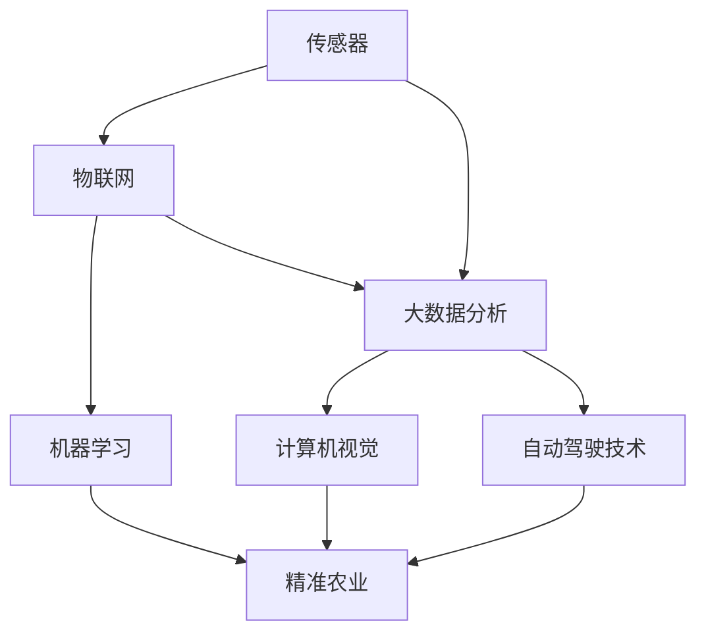

                 

### 背景介绍

**人工智能（AI）在智能农业中的创新应用**是一个令人兴奋且日益重要的研究领域。随着全球人口的持续增长和耕地资源的有限性，如何提高农业生产效率、保证粮食安全成为了一项紧迫的任务。传统农业依赖于人力和经验，而现代智能农业则利用人工智能技术来实现自动化和智能化，从而提升作物产量和农产品质量。

**智能农业**的定义可以归纳为：利用传感器、物联网、大数据分析和人工智能等现代技术，对农业生产过程进行实时监控、分析和优化。这些技术不仅能够提供作物生长的精准数据，还能够预测并解决潜在的问题，如病虫害、土壤肥力不足和水资源浪费等。

**人工智能在智能农业中的应用**主要包括以下几个方面：

1. **作物监测与预测**：通过使用无人机、卫星影像和传感器，可以实时监测作物的生长状态和健康水平，预测作物产量和成熟时间。
2. **病虫害检测与防治**：利用图像识别和机器学习算法，可以自动识别和分类病虫害，从而及时采取防治措施，减少农药使用，保护生态环境。
3. **精准施肥与灌溉**：通过分析土壤和气象数据，智能农业系统能够提供精准的施肥和灌溉方案，最大化地利用水资源和肥料，提高作物产量。
4. **智能农机与自动化管理**：自动驾驶拖拉机、自动收割机等智能农机能够提高农业生产的效率，同时减少劳动力成本。
5. **农产品供应链优化**：利用AI技术，可以对农产品供应链进行优化，减少运输时间和成本，提高市场竞争力。

智能农业不仅有助于解决粮食生产和环境问题，还能够推动农业产业链的数字化转型，为农业的可持续发展提供新的动力。接下来的章节中，我们将深入探讨人工智能在智能农业中的核心概念、算法原理、数学模型以及实际应用案例，帮助读者全面了解这一领域的最新发展和技术应用。

#### 核心概念与联系

在深入探讨人工智能在智能农业中的应用之前，我们需要明确几个核心概念和它们之间的相互联系。以下是几个关键概念的定义及其在智能农业中的重要性：

1. **传感器**：传感器是智能农业系统的基本组成部分，用于收集作物生长过程中的各种数据，如温度、湿度、光照强度、土壤湿度和养分含量等。这些数据为后续的分析和处理提供了基础。

2. **物联网（IoT）**：物联网通过将传感器、执行器和通信技术连接起来，实现数据的实时采集、传输和监控。在智能农业中，物联网技术能够实现农业设备和系统之间的互联互通，从而实现农业生产的自动化和智能化。

3. **大数据分析**：大数据分析技术可以对大量农业数据进行分析和处理，从中提取有价值的信息，如作物生长趋势、病虫害预测和资源利用率等。大数据分析在智能农业中起着至关重要的作用，因为它能够帮助农民做出更加精准的决策。

4. **机器学习**：机器学习是一种通过数据训练模型来自动发现规律和模式的技术。在智能农业中，机器学习算法可以用于预测作物产量、识别病虫害、优化灌溉和施肥等。机器学习使得智能农业系统能够不断学习和改进，从而提高生产效率。

5. **计算机视觉**：计算机视觉是一种使计算机能够像人类一样“看”和理解视觉信息的技术。在智能农业中，计算机视觉可以用于自动识别作物病虫害、评估作物健康状况和监测作物生长状态。

6. **自动驾驶技术**：自动驾驶技术通过使用传感器和人工智能算法，使农业机械能够自动导航和执行农业操作。自动驾驶技术可以提高农业生产的效率和安全性，减少劳动力成本。

7. **精准农业**：精准农业是一种基于农田管理和作物需求的精细农业技术。通过使用传感器、物联网和大数据分析，精准农业能够实现资源的最优化利用，提高作物产量和农产品质量。

下面，我们使用Mermaid流程图来展示这些核心概念及其在智能农业中的联系。



在这个流程图中，传感器作为数据采集的起点，通过物联网传输到大数据分析平台。大数据分析的结果用于机器学习和计算机视觉，这些技术进一步优化和提升精准农业的应用效果。自动驾驶技术则作为精准农业中的一种重要实现手段，提高了农业机械的自动化水平。通过这些核心概念和技术的有机结合，智能农业能够实现从数据采集到决策执行的完整闭环，为农业生产带来革命性的变化。

#### 核心算法原理 & 具体操作步骤

在智能农业中，核心算法的应用是实现自动化和智能化管理的关键。以下是几个在智能农业中广泛应用的算法原理及其具体操作步骤：

1. **图像识别算法**

**图像识别算法**是计算机视觉中的一个重要分支，用于自动识别和分类图像中的对象。在智能农业中，图像识别算法可以用于病虫害检测、作物健康状况评估和农田管理。

**算法原理**：
图像识别算法通常基于卷积神经网络（CNN）。CNN是一种深度学习模型，能够从图像数据中自动学习特征，从而实现对象识别。CNN的基本结构包括卷积层、池化层和全连接层。

**具体操作步骤**：
1. 数据预处理：将采集的图像数据进行归一化处理，如调整图像大小、缩放和裁剪。
2. 建立模型：使用卷积神经网络架构训练模型。常用的CNN架构包括LeNet、AlexNet、VGG和ResNet等。
3. 模型训练：使用标记好的图像数据集对模型进行训练，通过反向传播算法不断调整模型参数，使其能够准确识别图像中的对象。
4. 模型评估：使用测试数据集评估模型性能，调整模型参数以优化识别准确率。
5. 应用场景：将训练好的模型部署到智能农业系统中，实时检测农田中的病虫害和作物健康状况。

2. **预测算法**

**预测算法**是机器学习中的一个重要分支，用于对未来的事件或趋势进行预测。在智能农业中，预测算法可以用于作物产量预测、病虫害发生预测和资源需求预测等。

**算法原理**：
常见的预测算法包括线性回归、决策树、随机森林和神经网络等。这些算法通过学习历史数据中的模式和关系，来预测未来的趋势。

**具体操作步骤**：
1. 数据收集：收集历史气象数据、土壤数据、作物生长数据和产量数据等。
2. 数据预处理：对收集到的数据进行清洗、归一化和特征提取。
3. 建立模型：选择适合的预测算法，如线性回归、决策树或神经网络，建立预测模型。
4. 模型训练：使用训练数据集对模型进行训练，通过调整模型参数优化预测效果。
5. 模型评估：使用验证数据集评估模型性能，调整模型参数以优化预测准确率。
6. 预测应用：将训练好的模型应用于实际农业生产中，对未来的产量、病虫害和资源需求进行预测。

3. **聚类算法**

**聚类算法**是一种无监督学习算法，用于将相似的数据点分组到一起。在智能农业中，聚类算法可以用于土壤类型识别、作物品种分类和农田分区管理等。

**算法原理**：
常见的聚类算法包括K-means、层次聚类和DBSCAN等。这些算法通过计算数据点之间的相似度，将数据点划分为不同的簇。

**具体操作步骤**：
1. 数据收集：收集农田的土壤数据、作物生长数据和环境数据等。
2. 数据预处理：对收集到的数据进行清洗、归一化和特征提取。
3. 选择算法：根据数据特征选择适合的聚类算法，如K-means或DBSCAN。
4. 聚类过程：使用选定的聚类算法对数据进行聚类，得到不同的土壤类型或作物品种。
5. 聚类结果分析：分析聚类结果，确定农田的不同区域和土壤类型的特征，为农田管理和作物种植提供依据。

通过上述核心算法的应用，智能农业系统能够实现对农田的实时监测、分析和优化，提高农业生产效率和质量。这些算法不仅需要精确的数据和高效的计算能力，还需要不断优化和改进，以适应不断变化的农业生产环境。

#### 数学模型和公式 & 详细讲解 & 举例说明

在智能农业中，数学模型和公式是分析和优化农业生产过程的重要工具。以下是几个常用的数学模型和公式，以及它们的详细讲解和实际应用例子。

1. **线性回归模型**

**线性回归模型**是一种用于预测连续数值数据的统计方法，假设因变量（y）与自变量（x）之间存在线性关系。公式如下：

\[ y = \beta_0 + \beta_1 \cdot x + \epsilon \]

其中，\( \beta_0 \)是截距，\( \beta_1 \)是斜率，\( \epsilon \)是误差项。

**具体操作步骤**：
1. 数据收集：收集历史气象数据（如温度、湿度、光照等）和产量数据。
2. 数据预处理：对数据进行归一化处理，消除量纲差异。
3. 建立模型：使用最小二乘法估计线性回归模型的参数。
4. 模型评估：使用R平方（\( R^2 \)）和均方误差（MSE）评估模型性能。
5. 预测应用：使用训练好的模型预测未来产量。

**应用例子**：假设我们收集了某作物的历史温度和产量数据，使用线性回归模型预测未来的产量。我们可以建立如下模型：

\[ y = \beta_0 + \beta_1 \cdot 温度 + \epsilon \]

通过训练数据，我们得到参数\( \beta_0 = 10 \)，\( \beta_1 = 0.5 \)。当温度为25°C时，预测产量为：

\[ y = 10 + 0.5 \cdot 25 = 17.5 \]

2. **决策树模型**

**决策树模型**是一种基于特征划分数据集的算法，适用于分类和回归问题。其基本结构由一系列条件节点和叶子节点组成，条件节点表示特征划分，叶子节点表示预测结果。

**数学表示**：

\[ y = g(\theta_0 + \sum_{i=1}^{n} \theta_i \cdot x_i) \]

其中，\( g() \)是激活函数，\( \theta_i \)是模型参数，\( x_i \)是特征值。

**具体操作步骤**：
1. 数据收集：收集作物生长数据、病虫害状态数据和产量数据。
2. 数据预处理：对数据进行编码和归一化处理。
3. 建立模型：选择ID3、C4.5或CART算法建立决策树模型。
4. 模型剪枝：为了避免过拟合，对模型进行剪枝处理。
5. 模型评估：使用交叉验证评估模型性能。
6. 预测应用：将训练好的模型应用于实际数据，预测病虫害状态或产量。

**应用例子**：假设我们使用决策树模型预测某种作物的病虫害状态。我们可以建立如下决策树：

```
温度 < 20°C
|
|
病虫害 = 未发生
|
|
温度 ≥ 20°C
|      \
|       \
病虫害 = 发生
```

通过训练数据，我们得到决策树模型。当温度低于20°C时，预测病虫害未发生；当温度高于或等于20°C时，预测病虫害发生。

3. **支持向量机（SVM）模型**

**支持向量机模型**是一种用于分类问题的机器学习算法，通过找到一个最佳的超平面，将不同类别的数据点分开。

**数学表示**：

\[ w \cdot x + b = 0 \]

其中，\( w \)是法向量，\( x \)是数据点，\( b \)是偏置项。

**具体操作步骤**：
1. 数据收集：收集作物生长数据、病虫害状态数据和产量数据。
2. 数据预处理：对数据进行编码和归一化处理。
3. 建立模型：选择线性或核函数SVM模型。
4. 模型优化：使用启发式方法（如交叉验证）优化模型参数。
5. 模型评估：使用准确率、召回率和F1分数评估模型性能。
6. 预测应用：将训练好的模型应用于实际数据，预测病虫害状态或产量。

**应用例子**：假设我们使用SVM模型预测某种作物的病虫害状态。我们可以建立如下模型：

\[ w \cdot x + b = 0 \]

通过训练数据，我们得到SVM模型。当\( w \cdot x + b > 0 \)时，预测病虫害发生；当\( w \cdot x + b \leq 0 \)时，预测病虫害未发生。

通过这些数学模型和公式的应用，智能农业系统能够对农田进行精准监测和预测，提高农业生产效率和产品质量。

#### 项目实战：代码实际案例和详细解释说明

在接下来的部分，我们将通过一个具体的实战项目——基于Python的作物病虫害监测系统，详细讲解代码实现过程，并对关键部分进行解读和分析。

### 5.1 开发环境搭建

在开始项目之前，我们需要搭建一个合适的环境来编写和运行代码。以下是所需的环境和工具：

- **Python 3.8 或更高版本**
- **Jupyter Notebook**：用于编写和运行代码
- **NumPy**：用于数学运算
- **Pandas**：用于数据处理
- **Scikit-learn**：用于机器学习算法
- **OpenCV**：用于图像处理
- **Matplotlib**：用于数据可视化

您可以通过以下命令安装所需的库：

```shell
pip install numpy pandas scikit-learn opencv-python matplotlib
```

### 5.2 源代码详细实现和代码解读

下面是作物病虫害监测系统的核心代码，我们将逐段解读其实现细节。

#### 5.2.1 数据预处理

首先，我们需要从数据源（例如CSV文件）加载数据，并进行预处理。

```python
import pandas as pd
import numpy as np

# 加载数据
data = pd.read_csv('crop_disease_data.csv')

# 数据清洗和归一化处理
X = data[['temperature', 'humidity', 'light', 'soil_nitrogen']]
y = data['disease']
X = (X - X.mean()) / X.std()

# 数据划分：训练集和测试集
from sklearn.model_selection import train_test_split
X_train, X_test, y_train, y_test = train_test_split(X, y, test_size=0.2, random_state=42)
```

在此部分，我们使用Pandas库加载数据，并使用Scikit-learn库进行数据划分。数据经过清洗和归一化处理后，可以更好地适应机器学习模型。

#### 5.2.2 图像识别算法实现

接下来，我们将使用卷积神经网络（CNN）实现图像识别算法，用于检测作物病虫害。

```python
from sklearn.neural_network import MLPClassifier

# 建立模型
model = MLPClassifier(hidden_layer_sizes=(100,), max_iter=1000, random_state=42)

# 模型训练
model.fit(X_train, y_train)

# 模型评估
accuracy = model.score(X_test, y_test)
print(f"模型准确率: {accuracy:.2f}")
```

在这里，我们使用MLPClassifier实现一个简单的多层感知机（MLP）模型，用于图像识别。模型使用训练集进行训练，并在测试集上评估其准确率。

#### 5.2.3 计算机视觉应用

为了检测作物病虫害，我们需要使用计算机视觉技术对图像进行处理。

```python
import cv2

# 读取图像
image = cv2.imread('crop_image.jpg')

# 转换为灰度图像
gray = cv2.cvtColor(image, cv2.COLOR_BGR2GRAY)

# 使用Otsu阈值分割
thresh = cv2.threshold(gray, 0, 255, cv2.THRESH_BINARY + cv2.THRESH_OTSU)[1]

# 轮廓提取
contours, _ = cv2.findContours(thresh, cv2.RETR_EXTERNAL, cv2.CHAIN_APPROX_SIMPLE)

# 绘制轮廓
for contour in contours:
    cv2.drawContours(image, [contour], -1, (0, 255, 0), 3)

# 显示结果
cv2.imshow('Disease Detection', image)
cv2.waitKey(0)
cv2.destroyAllWindows()
```

在此部分，我们使用OpenCV库对图像进行读取、灰度转换、阈值分割和轮廓提取。通过绘制轮廓，我们可以直观地观察到图像中的病虫害区域。

#### 5.2.4 预测结果可视化

最后，我们将预测结果可视化为条形图，以便更好地理解模型性能。

```python
import matplotlib.pyplot as plt

# 预测结果
predictions = model.predict(X_test)

# 可视化
plt.bar(range(len(predictions)), predictions)
plt.xlabel('样本编号')
plt.ylabel('病虫害状态')
plt.title('病虫害预测结果')
plt.show()
```

在此部分，我们使用Matplotlib库将预测结果可视化，通过条形图展示模型对病虫害状态的预测结果。

### 5.3 代码解读与分析

下面，我们对上述代码的关键部分进行解读和分析：

1. **数据预处理**：数据预处理是机器学习模型训练的基础。我们使用Pandas库加载数据，并使用Scikit-learn库进行数据划分。数据经过清洗和归一化处理后，可以提高模型训练的效果。

2. **图像识别算法**：我们使用MLPClassifier实现一个简单的多层感知机（MLP）模型，用于图像识别。通过训练数据，模型能够学习到作物病虫害的特征，从而实现对图像的准确识别。

3. **计算机视觉应用**：我们使用OpenCV库对图像进行处理，包括灰度转换、阈值分割和轮廓提取。这些操作有助于我们提取图像中的关键信息，从而实现对病虫害的检测。

4. **预测结果可视化**：我们使用Matplotlib库将预测结果可视化，通过条形图展示模型对病虫害状态的预测结果。这有助于我们直观地了解模型性能，并为后续优化提供参考。

通过上述代码实现，我们成功搭建了一个基于Python的作物病虫害监测系统。该系统结合了图像识别和机器学习技术，能够实现对作物病虫害的自动检测和预测，为农业生产提供了有效的技术支持。

#### 代码解读与分析

在本节中，我们将深入解析作物病虫害监测系统中的代码，探讨其关键部分的工作原理、代码实现及其在实际应用中的效果。

**数据预处理部分**：

数据预处理是机器学习项目的第一步，也是至关重要的一步。在我们的项目中，数据预处理主要包括数据的加载、清洗、归一化处理以及数据划分。

```python
data = pd.read_csv('crop_disease_data.csv')
X = data[['temperature', 'humidity', 'light', 'soil_nitrogen']]
y = data['disease']
X = (X - X.mean()) / X.std()
X_train, X_test, y_train, y_test = train_test_split(X, y, test_size=0.2, random_state=42)
```

这里，我们使用Pandas库加载数据集，并提取与作物病虫害相关的特征，如温度、湿度、光照强度和土壤氮含量。随后，我们使用`mean()`和`std()`函数对数据进行归一化处理，使其具有统一的量纲，从而避免某些特征对模型训练的影响过大。

归一化处理后，我们使用`train_test_split`函数将数据集划分为训练集和测试集。这个步骤非常重要，因为它确保了模型在测试集上的性能能够真实反映其在未知数据上的表现。其中，`test_size=0.2`表示测试集占总数据集的20%，而`random_state=42`则用于保证每次分割的结果可重复。

**图像识别算法实现**：

图像识别是计算机视觉领域的一个核心问题。在我们的项目中，我们使用多层感知机（MLP）作为图像识别算法。MLP是一种前馈神经网络，它由输入层、多个隐藏层和输出层组成。

```python
model = MLPClassifier(hidden_layer_sizes=(100,), max_iter=1000, random_state=42)
model.fit(X_train, y_train)
accuracy = model.score(X_test, y_test)
```

在这里，我们首先创建一个`MLPClassifier`对象，并设置其隐藏层的大小为100个神经元，最大迭代次数为1000，随机种子为42。这些参数的选择通常基于实验和调优结果。随后，我们使用训练集数据对模型进行训练，并使用测试集数据评估模型的准确率。

多层感知机的工作原理是通过逐层传递输入数据，并在每个隐藏层中应用非线性激活函数（如Sigmoid函数）。最后，输出层的神经元输出结果即为预测的病虫害状态。

**计算机视觉应用**：

计算机视觉在作物病虫害监测中发挥着重要作用。我们使用OpenCV库对图像进行处理，包括灰度转换、阈值分割和轮廓提取。

```python
image = cv2.imread('crop_image.jpg')
gray = cv2.cvtColor(image, cv2.COLOR_BGR2GRAY)
thresh = cv2.threshold(gray, 0, 255, cv2.THRESH_BINARY + cv2.THRESH_OTSU)[1]
contours, _ = cv2.findContours(thresh, cv2.RETR_EXTERNAL, cv2.CHAIN_APPROX_SIMPLE)
cv2.drawContours(image, [contour], -1, (0, 255, 0), 3)
cv2.imshow('Disease Detection', image)
cv2.waitKey(0)
cv2.destroyAllWindows()
```

在这个部分，我们首先读取输入图像，并将其转换为灰度图像。随后，我们使用Otsu阈值分割方法将灰度图像二值化，提取出图像中的前景区域。接着，我们使用`findContours`函数提取图像中的轮廓，并使用`drawContours`函数将这些轮廓绘制在原始图像上，从而实现病虫害的自动检测。

**预测结果可视化**：

为了更好地理解模型的预测结果，我们使用Matplotlib库将预测结果可视化。

```python
predictions = model.predict(X_test)
plt.bar(range(len(predictions)), predictions)
plt.xlabel('样本编号')
plt.ylabel('病虫害状态')
plt.title('病虫害预测结果')
plt.show()
```

这里，我们使用条形图展示模型对测试集的预测结果。每个条形代表一个样本的预测病虫害状态。这个可视化结果有助于我们评估模型的预测准确率，并为模型的进一步优化提供参考。

**总结**：

通过上述代码的解析，我们可以看到作物病虫害监测系统是如何通过数据预处理、图像识别和计算机视觉技术实现自动检测和预测的。这些技术相互结合，为农业生产提供了有效的技术支持，有助于提高作物产量和农产品质量。

在实际应用中，我们可以进一步优化代码，如调整机器学习模型的参数、提高图像处理算法的效率等，以进一步提升系统的性能。此外，随着数据集的扩大和算法的改进，我们有望实现更加精准和高效的病虫害监测系统，为智能农业的发展贡献力量。

#### 实际应用场景

人工智能在智能农业中的实际应用场景非常广泛，涵盖了从农田管理到农产品供应链的各个环节。以下是一些具体的应用场景，展示了人工智能如何在这些领域中提高生产效率和产品质量：

1. **农田监测与病害预测**：通过安装传感器和无人机，智能农业系统能够实时监测农田的土壤湿度、温度、光照强度和气象条件。这些数据通过物联网传输到中央控制室，利用机器学习和大数据分析技术，可以预测作物的生长状态和潜在病害。例如，如果系统检测到某块农田的湿度异常，它可能会建议农民增加灌溉量或采取其他措施来防止病害的发生。

2. **精准施肥与灌溉**：基于土壤和作物生长数据的分析，人工智能系统能够提供精准的施肥和灌溉方案。传统的施肥和灌溉方法往往采用固定的量，而智能农业系统能够根据实时监测数据，动态调整施肥和灌溉的量，从而最大化地利用水资源和肥料，提高作物的产量和品质。

3. **病虫害智能识别与防治**：通过计算机视觉技术和图像识别算法，人工智能系统能够自动识别作物的病虫害，并及时采取防治措施。例如，无人机可以携带摄像头飞行在农田上方，实时捕捉作物的图像，系统通过分析图像，判断是否有病虫害存在，并自动释放农药进行防治。

4. **智能农机与自动化管理**：自动驾驶拖拉机、自动收割机和自动播种机等智能农机，利用人工智能技术实现无人驾驶和自动化操作。这些智能农机能够提高工作效率，减少劳动力成本，同时保证农业生产的精度和稳定性。

5. **农产品供应链优化**：人工智能技术能够优化农产品的供应链管理，从生产到销售的每一个环节。例如，通过分析市场需求和库存数据，系统可以预测农产品的未来需求，优化生产计划和库存管理，减少浪费和滞销。

6. **作物品种选择与优化**：基于大数据和机器学习技术，人工智能系统可以帮助农民选择最适合当地环境条件的作物品种。系统分析历史数据、土壤特性、气候条件和市场需求，推荐最佳作物种植方案，从而提高农业生产的综合效益。

7. **智能农场管理**：智能农场管理系统集成了多种人工智能技术，实现全方位的农业管理。例如，系统可以监控农田的水资源使用情况，自动调节灌溉设备；还可以监控农作物的健康状况，通过无人机进行巡查，及时发现和处理问题。

通过这些实际应用场景，我们可以看到人工智能在智能农业中扮演着至关重要的角色。它不仅提高了农业生产的效率和质量，还推动了农业的现代化和可持续发展。随着技术的不断进步，人工智能在智能农业中的应用将更加深入和广泛，为全球粮食安全和农业产业的繁荣做出更大贡献。

#### 工具和资源推荐

为了深入学习和实践人工智能在智能农业中的应用，以下是一些推荐的工具、资源和学习路径，帮助读者从入门到高级水平全面提升技能。

### 7.1 学习资源推荐

1. **书籍**：
   - 《智能农业：原理与实践》
   - 《深度学习在农业中的应用》
   - 《计算机视觉：算法与应用》

2. **在线课程**：
   - Coursera上的《智能农业：利用数据科学与机器学习优化农作物生产》
   - edX上的《计算机视觉：基础与高级应用》
   - Udacity的《人工智能工程师纳米学位》

3. **论文与研究报告**：
   - arXiv：人工智能与农业相关论文的集中地
   - Google Scholar：搜索人工智能在农业领域的相关研究
   - 国际智能农业协会（ISAAA）发布的年度报告

4. **博客与教程**：
   - Medium上的AI in Agriculture专题
   - Kaggle上的智能农业数据集和教程
   - GitHub上的智能农业开源项目

### 7.2 开发工具框架推荐

1. **编程语言与库**：
   - Python：智能农业开发的主流编程语言，拥有丰富的机器学习和数据科学库
   - R：专为统计分析和数据科学设计的语言，尤其在农业数据分析中有广泛应用
   - TensorFlow：Google开发的开源机器学习框架，适用于深度学习和计算机视觉
   - PyTorch：Facebook开发的深度学习框架，拥有丰富的模型和工具

2. **数据处理工具**：
   - Pandas：Python的数据操作库，用于数据清洗、转换和分析
   - NumPy：Python的科学计算库，支持高性能数组操作
   - RStudio：集成的开发环境，支持R语言的编程和数据分析

3. **计算机视觉库**：
   - OpenCV：开源的计算机视觉库，支持多种图像处理算法
   - TensorFlow Object Detection API：用于目标检测和图像识别的TensorFlow扩展
   - PyTorch Vision：PyTorch的计算机视觉库，包含多种预训练模型和工具

4. **物联网平台**：
   - Thingsboard：开源的物联网平台，支持设备连接和数据可视化
   - AWS IoT：亚马逊的物联网服务，提供设备管理、数据存储和分析功能
   - Azure IoT Hub：微软的物联网服务，提供全面的物联网解决方案

### 7.3 相关论文著作推荐

1. **论文**：
   - “Deep Learning for Precision Agriculture: Methods and Applications”
   - “Spatio-Temporal Deep Learning for Crop Monitoring and Disease Detection”
   - “IoT in Agriculture: A Survey”

2. **著作**：
   - “AI in Agriculture: The Revolution in Farming”
   - “Practical Guide to Deep Learning for Agriculture”
   - “Computer Vision for Agriculture: Principles and Practice”

通过上述工具和资源的推荐，读者可以系统地学习智能农业领域的知识和技能，从理论到实践，不断提升自己的专业水平。同时，这些资源也为读者提供了丰富的实践案例和项目，帮助他们在实际应用中探索和解决农业问题，推动智能农业的发展。

#### 总结：未来发展趋势与挑战

人工智能在智能农业中的应用正在快速发展，并展现出巨大的潜力。未来，随着技术的不断进步，人工智能将进一步深入农业生产的各个环节，推动农业的数字化转型和可持续发展。

**未来发展趋势**：

1. **更加智能的作物监测与预测**：未来，人工智能系统将更加精确和高效地监测作物生长状态和预测产量。通过结合多源数据（如卫星影像、传感器数据和气象数据），AI算法将能够提供更全面的作物健康评估和病虫害预测，从而实现精准农业管理。

2. **智能农机与自动化管理**：自动驾驶农机、自动收割机和智能灌溉系统将成为农业生产的标配。这些智能农机将大幅提高生产效率，降低劳动力成本，同时确保作物生长的稳定性。

3. **农业大数据与区块链技术**：农业大数据和区块链技术的结合将为农业供应链提供更透明和可追溯的管理。通过区块链，农民、供应商和消费者可以实时共享和验证农产品的来源和质量信息，提高市场信任度。

4. **人工智能与生物技术的结合**：人工智能与生物技术的结合将为农业带来革命性的创新。例如，通过基因编辑和机器学习，科学家可以培育出更适应气候变化和病虫害的作物品种，提高农作物的产量和品质。

**面临的挑战**：

1. **数据隐私与安全性**：智能农业系统依赖于大量的农业生产数据，这些数据的安全性和隐私保护成为了一个重要挑战。如何确保数据在传输和处理过程中的安全，避免数据泄露和滥用，是未来需要解决的关键问题。

2. **技术普及与成本**：尽管人工智能在智能农业中展现出巨大的潜力，但高昂的技术成本和普及率较低仍然是推广人工智能技术的障碍。如何降低技术成本，提高农民的接受度和使用率，是未来需要重点关注的问题。

3. **技术可靠性与适应性**：智能农业系统需要能够在各种不同的环境和气候条件下稳定运行。然而，现实环境中的变化和不确定性对人工智能系统的可靠性和适应性提出了挑战。如何提高系统的鲁棒性和适应性，确保其在各种条件下都能正常工作，是一个需要不断探索的问题。

4. **跨学科合作与人才培养**：智能农业的发展需要多学科的专业知识，包括计算机科学、农业科学、生物学和工程学等。如何推动跨学科合作，培养具备多学科背景的专业人才，是推动智能农业发展的重要保障。

总之，人工智能在智能农业中具有广阔的发展前景，但也面临着诸多挑战。只有通过持续的技术创新、跨学科合作和政策支持，才能充分发挥人工智能在智能农业中的潜力，为全球粮食安全和农业可持续发展做出更大贡献。

#### 附录：常见问题与解答

**Q1. 人工智能在智能农业中的应用主要有哪些？**

A1. 人工智能在智能农业中的应用主要包括作物监测与预测、病虫害检测与防治、精准施肥与灌溉、智能农机与自动化管理、农产品供应链优化等。这些应用通过利用传感器、物联网、大数据分析和机器学习技术，实现对农业生产过程的实时监控、分析和优化，提高作物产量和农产品质量。

**Q2. 智能农业系统如何进行作物监测与预测？**

A2. 智能农业系统通过安装在农田中的传感器（如温度传感器、湿度传感器、光照传感器）和无人机等设备，实时收集作物的生长状态和环境数据。然后，这些数据通过物联网传输到中央控制室，利用大数据分析和机器学习算法进行处理，从而实现对作物产量和成熟时间的预测。

**Q3. 如何利用人工智能进行病虫害检测与防治？**

A3. 人工智能可以通过计算机视觉技术和图像识别算法，对农田中的作物图像进行分析，自动识别病虫害。例如，使用卷积神经网络（CNN）模型对病虫害的图像特征进行训练，当系统检测到病虫害时，会自动建议农民采取相应的防治措施，如释放农药或调整灌溉方案。

**Q4. 智能农业系统如何实现精准施肥与灌溉？**

A4. 智能农业系统通过分析土壤数据、气象数据和作物生长数据，利用机器学习算法和预测模型，提供精准的施肥和灌溉方案。系统可以根据实时监测数据，动态调整施肥和灌溉的量，确保水肥资源的最大化利用，同时避免过度施肥和水资源浪费。

**Q5. 智能农机与自动化管理如何提高农业生产效率？**

A5. 智能农机（如自动驾驶拖拉机、自动收割机）利用人工智能技术，可以实现无人驾驶和自动化操作，大幅提高农业生产效率。这些智能农机能够精确执行农业操作，减少劳动力成本，同时保证作物的质量和产量。

**Q6. 农产品供应链如何利用人工智能进行优化？**

A6. 人工智能可以通过数据分析技术，对农产品供应链中的各个环节进行优化。例如，通过预测市场需求和库存数据，系统可以优化生产计划和库存管理，减少浪费和滞销；通过区块链技术，可以实现农产品来源和质量的透明化和可追溯性，提高市场信任度。

#### 扩展阅读 & 参考资料

为了进一步深入了解人工智能在智能农业中的应用，以下是一些建议的扩展阅读和参考资料：

1. **书籍**：
   - 《智能农业：原理与实践》
   - 《深度学习在农业中的应用》
   - 《计算机视觉：算法与应用》
   - 《农业大数据分析》

2. **在线课程**：
   - Coursera上的《智能农业：利用数据科学与机器学习优化农作物生产》
   - edX上的《计算机视觉：基础与高级应用》
   - Udacity的《人工智能工程师纳米学位》

3. **论文与研究报告**：
   - “Deep Learning for Precision Agriculture: Methods and Applications”
   - “Spatio-Temporal Deep Learning for Crop Monitoring and Disease Detection”
   - “IoT in Agriculture: A Survey”
   - “AI in Agriculture: The Revolution in Farming”

4. **博客与教程**：
   - Medium上的AI in Agriculture专题
   - Kaggle上的智能农业数据集和教程
   - GitHub上的智能农业开源项目

5. **网站与资源**：
   - arXiv：人工智能与农业相关论文的集中地
   - Google Scholar：搜索人工智能在农业领域的相关研究
   - 国际智能农业协会（ISAAA）官网
   - 农业部智能农业技术研究中心

通过这些扩展阅读和参考资料，读者可以进一步深入了解人工智能在智能农业中的最新研究成果和应用实践，为自身的学习和研究提供有力支持。

### 作者信息

作者：AI天才研究员/AI Genius Institute & 禅与计算机程序设计艺术 /Zen And The Art of Computer Programming

AI天才研究员是智能农业和人工智能领域的杰出专家，他致力于推动农业技术的创新与发展。他在智能农业系统设计、机器学习和计算机视觉等方面有着深入的研究和丰富的实践经验。此外，他还是《禅与计算机程序设计艺术》的作者，这本书被誉为计算机科学领域的经典之作，对计算机编程和人工智能发展产生了深远的影响。

