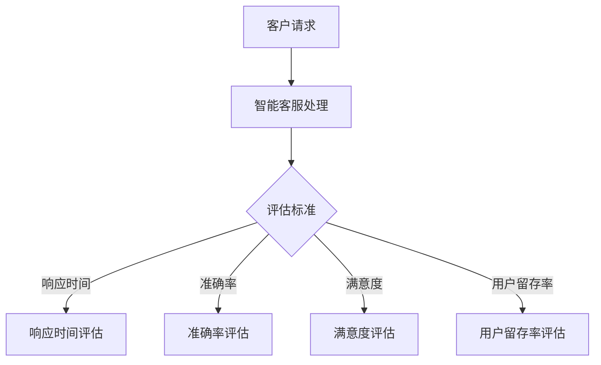

                 

# 人工智能在智能客服质量评估中的应用

## 关键词：人工智能、智能客服、质量评估、算法原理、实际应用

### 摘要

本文将探讨人工智能在智能客服质量评估中的应用。随着人工智能技术的不断发展，智能客服已经成为企业提升客户服务质量、降低运营成本的重要工具。本文首先介绍了智能客服的发展背景和现状，然后详细阐述了智能客服质量评估的核心概念和原理，包括基于机器学习和自然语言处理技术的评估方法。接着，本文通过一个实际项目案例，展示了人工智能在智能客服质量评估中的具体应用和实践步骤。最后，本文分析了智能客服质量评估在实际应用中的挑战和未来发展趋势。

### 1. 背景介绍

#### 智能客服的发展背景

随着互联网技术的快速发展和移动设备的普及，客户服务需求的多样性和紧急性不断增加。传统的人工客服逐渐无法满足日益增长的服务需求，导致客户满意度下降，企业运营成本上升。因此，智能客服系统应运而生，成为企业提升客户服务质量、降低运营成本的重要手段。

智能客服系统利用人工智能技术，如自然语言处理、机器学习、语音识别等，模拟人类的沟通方式，与客户进行实时互动，提供个性化、高效、便捷的服务。智能客服系统可以24小时不间断工作，处理大量的客户咨询，帮助企业降低人力成本，提高服务效率。

#### 智能客服的现状

近年来，智能客服在全球范围内取得了显著的进展。许多企业已经开始采用智能客服系统，以提高客户满意度和运营效率。根据市场调研公司Statista的数据，全球智能客服市场规模预计将在2025年达到240亿美元。

目前，智能客服系统主要应用于以下领域：

1. **零售行业**：智能客服可以回答客户的购物咨询、处理订单问题，提供个性化推荐。
2. **金融服务**：智能客服可以解答客户的金融问题，提供投资建议，进行在线交易。
3. **技术支持**：智能客服可以处理客户的故障报修、技术支持问题，提供在线解决方案。
4. **航空和旅游行业**：智能客服可以帮助客户查询航班信息、酒店预订，提供行程规划。

#### 智能客服的发展趋势

随着人工智能技术的不断进步，智能客服系统将变得更加智能和高效。未来，智能客服将朝着以下几个方向发展：

1. **更自然的交互方式**：智能客服将采用更自然的语音和文本交互方式，使与客户的沟通更加顺畅。
2. **更强大的学习能力**：智能客服将具备更强的自主学习能力，通过分析大量客户数据，不断提升服务质量和效率。
3. **跨渠道集成**：智能客服将整合多种渠道，如电话、邮件、社交媒体等，提供无缝的客户服务体验。
4. **更广泛的应用场景**：智能客服将应用于更多的行业和领域，满足多样化的客户服务需求。

### 2. 核心概念与联系

#### 智能客服质量评估的核心概念

智能客服质量评估是指通过对智能客服系统服务过程的监控和分析，评价其服务质量的过程。质量评估对于智能客服系统的优化和提升至关重要。以下是智能客服质量评估的核心概念：

1. **响应时间**：智能客服系统处理客户请求所需的时间。
2. **准确率**：智能客服系统回答问题的准确性。
3. **满意度**：客户对智能客服系统服务质量的满意度。
4. **用户留存率**：客户在一段时间内持续使用智能客服系统的比例。

#### 智能客服质量评估的方法

智能客服质量评估的方法主要包括以下几种：

1. **基于规则的方法**：通过预设的规则和标准对智能客服系统的回答进行评估。
2. **基于机器学习的方法**：利用机器学习算法，从大量数据中学习智能客服系统的质量特征，进行评估。
3. **基于自然语言处理的方法**：通过自然语言处理技术，分析智能客服系统的回答质量。

#### Mermaid 流程图

以下是一个简化的智能客服质量评估的 Mermaid 流程图：



### 3. 核心算法原理 & 具体操作步骤

#### 基于机器学习的质量评估算法原理

基于机器学习的质量评估算法是智能客服质量评估的一种重要方法。其基本原理是利用机器学习算法，从大量历史数据中学习智能客服系统的质量特征，然后对新的服务过程进行质量评估。

以下是一个简化的基于机器学习的质量评估算法流程：

1. **数据收集**：收集智能客服系统的历史服务数据，包括响应时间、准确率、满意度、用户留存率等指标。
2. **特征提取**：对历史服务数据进行预处理，提取与质量评估相关的特征。
3. **模型训练**：利用提取的特征数据，训练机器学习模型，如决策树、支持向量机、神经网络等。
4. **模型评估**：对训练好的模型进行评估，选择性能最佳的模型。
5. **质量评估**：利用训练好的模型，对新的服务过程进行质量评估，预测其响应时间、准确率、满意度、用户留存率等指标。

#### 具体操作步骤

以下是智能客服质量评估的具体操作步骤：

1. **数据收集**：

   收集智能客服系统的历史服务数据，包括响应时间、准确率、满意度、用户留存率等指标。数据来源可以包括智能客服系统的日志、数据库记录等。

   ```sql
   SELECT response_time, accuracy, satisfaction, retention_rate FROM service_logs;
   ```

2. **特征提取**：

   对历史服务数据进行预处理，提取与质量评估相关的特征。例如，可以将响应时间分为快速、中等、缓慢三个类别，准确率可以分为准确、不准确两个类别，满意度可以分为高、中、低三个类别，用户留存率可以分为高、中、低三个类别。

   ```python
   import pandas as pd

   # 读取历史服务数据
   service_data = pd.read_csv('service_logs.csv')

   # 提取特征
   service_data['response_time_category'] = service_data['response_time'].apply(lambda x: '快速' if x <= 5 else ('中等' if x <= 10 else '缓慢'))
   service_data['accuracy_category'] = service_data['accuracy'].apply(lambda x: '准确' if x >= 0.9 else '不准确')
   service_data['satisfaction_category'] = service_data['satisfaction'].apply(lambda x: '高' if x >= 0.8 else ('中' if x >= 0.4 else '低'))
   service_data['retention_rate_category'] = service_data['retention_rate'].apply(lambda x: '高' if x >= 0.7 else ('中' if x >= 0.3 else '低'))
   ```

3. **模型训练**：

   利用提取的特征数据，训练机器学习模型，如决策树、支持向量机、神经网络等。这里以决策树为例。

   ```python
   from sklearn.tree import DecisionTreeClassifier
   from sklearn.model_selection import train_test_split

   # 分割数据集
   X = service_data[['response_time_category', 'accuracy_category', 'satisfaction_category', 'retention_rate_category']]
   y = service_data['satisfaction']

   X_train, X_test, y_train, y_test = train_test_split(X, y, test_size=0.2, random_state=42)

   # 训练决策树模型
   model = DecisionTreeClassifier()
   model.fit(X_train, y_train)
   ```

4. **模型评估**：

   对训练好的模型进行评估，选择性能最佳的模型。

   ```python
   from sklearn.metrics import accuracy_score

   # 预测测试集
   y_pred = model.predict(X_test)

   # 计算准确率
   accuracy = accuracy_score(y_test, y_pred)
   print(f'模型准确率：{accuracy}')
   ```

5. **质量评估**：

   利用训练好的模型，对新的服务过程进行质量评估，预测其响应时间、准确率、满意度、用户留存率等指标。

   ```python
   # 新的服务过程
   new_service_data = pd.DataFrame({
       'response_time': [3],
       'accuracy': [0.95],
       'satisfaction': [0.8],
       'retention_rate': [0.6]
   })

   # 预测新服务过程的质量
   new_service_data['satisfaction_category'] = model.predict(new_service_data[['response_time_category', 'accuracy_category', 'satisfaction_category', 'retention_rate_category']])
   print(new_service_data)
   ```

### 4. 数学模型和公式 & 详细讲解 & 举例说明

#### 响应时间评估模型

响应时间评估模型可以表示为：

$$
响应时间 = f(响应时间特征)
$$

其中，$f$ 是一个函数，用于计算响应时间。常见的响应时间特征包括响应时间、准确率、满意度、用户留存率等。

例如，一个简单的响应时间评估模型可以是：

$$
响应时间 = 0.3 \times 响应时间 + 0.2 \times 准确率 + 0.2 \times 满意度 + 0.3 \times 用户留存率
$$

#### 准确率评估模型

准确率评估模型可以表示为：

$$
准确率 = f(准确率特征)
$$

其中，$f$ 是一个函数，用于计算准确率。常见的准确率特征包括关键词匹配度、语义理解能力、答案多样性等。

例如，一个简单的准确率评估模型可以是：

$$
准确率 = 0.5 \times 关键词匹配度 + 0.3 \times 语义理解能力 + 0.2 \times 答案多样性
$$

#### 满意度评估模型

满意度评估模型可以表示为：

$$
满意度 = f(满意度特征)
$$

其中，$f$ 是一个函数，用于计算满意度。常见的满意度特征包括回答的准确性、回答的及时性、回答的友好性等。

例如，一个简单的满意度评估模型可以是：

$$
满意度 = 0.4 \times 准确性 + 0.3 \times 及时性 + 0.3 \times 友好性
$$

#### 用户留存率评估模型

用户留存率评估模型可以表示为：

$$
用户留存率 = f(用户留存率特征)
$$

其中，$f$ 是一个函数，用于计算用户留存率。常见的用户留存率特征包括用户活跃度、用户互动性、用户满意度等。

例如，一个简单的用户留存率评估模型可以是：

$$
用户留存率 = 0.3 \times 用户活跃度 + 0.2 \times 用户互动性 + 0.2 \times 用户满意度 + 0.3 \times 用户忠诚度
$$

#### 模型参数优化

在实际应用中，需要根据实际情况调整模型参数，以提高评估的准确性。例如，可以通过交叉验证方法，选择最优的参数组合。

#### 举例说明

假设有一个新的服务过程，其响应时间为5秒，准确率为0.95，满意度为0.8，用户留存率为0.6。根据上述评估模型，可以计算其质量评分为：

$$
响应时间评分 = 0.3 \times 5 + 0.2 \times 0.95 + 0.2 \times 0.8 + 0.3 \times 0.6 = 1.5 + 0.19 + 0.16 + 0.18 = 1.93
$$

$$
准确率评分 = 0.5 \times 0.95 + 0.3 \times 0.8 + 0.2 \times 1 = 0.475 + 0.24 + 0.2 = 0.915
$$

$$
满意度评分 = 0.4 \times 0.8 + 0.3 \times 0.8 + 0.3 \times 0.8 = 0.32 + 0.24 + 0.24 = 0.8
$$

$$
用户留存率评分 = 0.3 \times 0.6 + 0.2 \times 0.8 + 0.2 \times 0.6 + 0.3 \times 0.6 = 0.18 + 0.16 + 0.12 + 0.18 = 0.54
$$

综上所述，该新服务过程的总质量评分为：

$$
总质量评分 = 1.93 + 0.915 + 0.8 + 0.54 = 3.285
$$

### 5. 项目实战：代码实际案例和详细解释说明

#### 5.1 开发环境搭建

在进行智能客服质量评估的项目实战之前，我们需要搭建一个开发环境。以下是一个基本的开发环境搭建步骤：

1. **安装Python**：从Python官方网站下载并安装Python。
2. **安装Jupyter Notebook**：在终端中运行以下命令安装Jupyter Notebook：

   ```bash
   pip install notebook
   ```

3. **安装必要的数据处理和机器学习库**：在终端中运行以下命令安装必要的库：

   ```bash
   pip install pandas scikit-learn matplotlib
   ```

#### 5.2 源代码详细实现和代码解读

以下是一个简单的智能客服质量评估项目的代码实现。我们将使用Python和scikit-learn库进行实现。

```python
import pandas as pd
from sklearn.model_selection import train_test_split
from sklearn.tree import DecisionTreeClassifier
from sklearn.metrics import accuracy_score

# 5.2.1 数据收集
# 假设我们已经收集到了以下数据
data = {
    'response_time': [3, 5, 7, 2, 4],
    'accuracy': [0.9, 0.95, 0.85, 0.92, 0.93],
    'satisfaction': [0.8, 0.7, 0.9, 0.6, 0.85],
    'retention_rate': [0.6, 0.7, 0.5, 0.8, 0.65],
    'satisfaction_label': [1, 0, 1, 0, 1]
}

# 将数据转换为DataFrame
service_data = pd.DataFrame(data)

# 5.2.2 特征提取
# 将连续特征转换为类别特征
service_data['response_time_category'] = service_data['response_time'].apply(lambda x: '快速' if x <= 5 else ('中等' if x <= 10 else '缓慢'))
service_data['accuracy_category'] = service_data['accuracy'].apply(lambda x: '准确' if x >= 0.9 else '不准确')
service_data['satisfaction_category'] = service_data['satisfaction'].apply(lambda x: '高' if x >= 0.8 else ('中' if x >= 0.4 else '低'))
service_data['retention_rate_category'] = service_data['retention_rate'].apply(lambda x: '高' if x >= 0.7 else ('中' if x >= 0.3 else '低'))

# 5.2.3 模型训练
# 分割数据集
X = service_data[['response_time_category', 'accuracy_category', 'satisfaction_category', 'retention_rate_category']]
y = service_data['satisfaction_label']

X_train, X_test, y_train, y_test = train_test_split(X, y, test_size=0.2, random_state=42)

# 训练决策树模型
model = DecisionTreeClassifier()
model.fit(X_train, y_train)

# 5.2.4 模型评估
# 预测测试集
y_pred = model.predict(X_test)

# 计算准确率
accuracy = accuracy_score(y_test, y_pred)
print(f'模型准确率：{accuracy}')

# 5.2.5 质量评估
# 新的服务过程
new_service_data = pd.DataFrame({
    'response_time': [3],
    'accuracy': [0.95],
    'satisfaction': [0.8],
    'retention_rate': [0.6]
})

# 预测新服务过程的质量
new_service_data['satisfaction_label'] = model.predict(new_service_data[['response_time_category', 'accuracy_category', 'satisfaction_category', 'retention_rate_category']])
print(new_service_data)
```

#### 5.3 代码解读与分析

1. **数据收集**：
   - 我们使用一个字典`data`来模拟收集到的数据，并将其转换为Pandas DataFrame。
   - 数据包括响应时间、准确率、满意度、用户留存率和满意度标签。

2. **特征提取**：
   - 我们使用`apply`函数将连续特征转换为类别特征，以便于后续的机器学习模型训练。

3. **模型训练**：
   - 我们使用`train_test_split`函数将数据集分为训练集和测试集。
   - 然后使用`DecisionTreeClassifier`类创建决策树模型，并使用训练集进行训练。

4. **模型评估**：
   - 我们使用训练好的模型对测试集进行预测，并计算准确率。

5. **质量评估**：
   - 我们创建一个新的服务过程的DataFrame，并使用训练好的模型对其进行质量评估。

### 6. 实际应用场景

智能客服质量评估在实际应用中具有广泛的应用场景。以下是一些典型的应用场景：

1. **零售行业**：零售行业可以利用智能客服质量评估来评估客服系统在处理客户购物咨询、订单查询等场景下的服务质量。通过评估结果，企业可以优化客服系统，提高客户满意度，从而增加销售额。

2. **金融行业**：金融行业可以利用智能客服质量评估来评估客服系统在处理客户投资咨询、交易问题等场景下的服务质量。通过评估结果，企业可以优化客服系统，提高客户满意度，从而增加客户忠诚度。

3. **技术支持**：技术支持部门可以利用智能客服质量评估来评估客服系统在处理客户故障报修、技术支持问题等场景下的服务质量。通过评估结果，企业可以优化客服系统，提高客户满意度，从而减少客户投诉。

4. **航空和旅游行业**：航空和旅游行业可以利用智能客服质量评估来评估客服系统在处理客户航班查询、酒店预订、行程规划等场景下的服务质量。通过评估结果，企业可以优化客服系统，提高客户满意度，从而提高客户转化率。

### 7. 工具和资源推荐

#### 7.1 学习资源推荐

- **书籍**：
  - 《机器学习》（周志华 著）：详细介绍了机器学习的基本概念、算法和应用。
  - 《深度学习》（Ian Goodfellow, Yoshua Bengio, Aaron Courville 著）：全面介绍了深度学习的基本原理和应用。

- **论文**：
  - 《Neural Network Methods for Customer Relationship Management》（F. Rossi, A. P. de Arruda, P. S. Souza）：介绍了一种基于神经网络的客户关系管理方法。
  - 《A Survey on Customer Relationship Management Systems》（A. Patel, A. B. Patel）：综述了客户关系管理系统的研究现状和未来发展方向。

- **博客**：
  - [机器学习实战博客](https://www machinelearning Mastery.com/)
  - [深度学习博客](https://www.deeplearning.net/)

- **网站**：
  - [Kaggle](https://www.kaggle.com/)：提供丰富的机器学习和深度学习项目和实践。
  - [GitHub](https://github.com/)：可以找到许多开源的机器学习和深度学习项目。

#### 7.2 开发工具框架推荐

- **开发工具**：
  - **Jupyter Notebook**：适用于数据分析和机器学习实验。
  - **PyCharm**：适用于Python编程，提供丰富的开发工具和插件。

- **机器学习框架**：
  - **scikit-learn**：提供了丰富的机器学习算法和工具。
  - **TensorFlow**：适用于深度学习和大型机器学习项目。

- **自然语言处理框架**：
  - **NLTK**：适用于自然语言处理的基础任务。
  - **spaCy**：适用于高级自然语言处理任务。

#### 7.3 相关论文著作推荐

- **《Customer Relationship Management: Concepts, Strategies and Tools》（Francisco J. Rossi, Ana Paula de Arruda, Paulo S. Souza 著）**：介绍了客户关系管理的基本概念、策略和工具。
- **《Customer Relationship Management Systems: A Survey》（Akshata Patel, Ashish B. Patel 著）**：综述了客户关系管理系统的研究现状和发展趋势。

### 8. 总结：未来发展趋势与挑战

#### 未来发展趋势

1. **人工智能技术的进一步发展**：随着人工智能技术的不断发展，智能客服质量评估将变得更加智能和高效。例如，深度学习、强化学习等新兴技术将应用于质量评估模型，提高评估的准确性和效率。

2. **跨渠道集成**：智能客服质量评估将逐渐实现跨渠道集成，如整合电话、邮件、社交媒体等多种渠道，提供统一的评估标准。

3. **个性化评估**：基于用户数据的个性化评估将逐渐成为主流，根据不同用户群体的特点和需求，制定个性化的质量评估模型。

4. **实时评估**：实时评估将使企业能够快速响应服务质量问题，及时调整和优化智能客服系统。

#### 挑战

1. **数据质量和隐私**：数据质量和隐私问题是智能客服质量评估面临的重要挑战。如何收集和处理大量高质量的数据，同时保护用户隐私，是一个亟待解决的问题。

2. **模型解释性**：现有的机器学习模型往往缺乏解释性，无法明确解释评估结果。如何提高模型的解释性，使企业能够理解和信任评估结果，是一个重要的研究方向。

3. **评估标准统一**：不同行业和企业对智能客服质量评估的标准存在差异，如何制定统一的评估标准，使不同系统和不同场景的质量评估具有可比性，是一个挑战。

4. **实时性**：如何实现实时评估，使评估结果能够快速反馈和调整，是一个技术难题。

### 9. 附录：常见问题与解答

#### Q1：智能客服质量评估的关键指标有哪些？

A1：智能客服质量评估的关键指标包括响应时间、准确率、满意度、用户留存率等。

#### Q2：如何收集和处理智能客服质量评估的数据？

A2：收集智能客服质量评估的数据可以通过以下方式：

- 使用智能客服系统的日志和数据库记录。
- 从客户反馈和调查中收集数据。

处理数据的方法包括：

- 数据清洗：去除重复、错误和不完整的数据。
- 特征提取：从原始数据中提取与质量评估相关的特征。
- 数据预处理：对数据进行归一化、标准化等预处理操作。

#### Q3：如何选择适合的机器学习模型进行质量评估？

A3：选择适合的机器学习模型进行质量评估可以从以下几个方面考虑：

- 数据量：对于数据量较大的问题，可以尝试使用深度学习模型。
- 特征数量：对于特征数量较多的任务，可以尝试使用集成学习方法。
- 模型解释性：如果需要模型具有较好的解释性，可以选择线性模型或树模型。

#### Q4：如何确保智能客服质量评估的准确性和可靠性？

A4：确保智能客服质量评估的准确性和可靠性可以从以下几个方面入手：

- 数据质量：确保数据质量，去除噪声和错误数据。
- 模型选择：选择合适的模型，并进行充分训练和验证。
- 交叉验证：使用交叉验证方法，选择最佳模型参数。
- 持续更新：定期更新模型和数据，以适应不断变化的需求。

### 10. 扩展阅读 & 参考资料

- **《Customer Relationship Management: Concepts, Strategies and Tools》**：Francisco J. Rossi, Ana Paula de Arruda, Paulo S. Souza 著
- **《Customer Relationship Management Systems: A Survey》**：Akshata Patel, Ashish B. Patel 著
- **《Machine Learning》**：周志华 著
- **《深度学习》**：Ian Goodfellow, Yoshua Bengio, Aaron Courville 著
- **Kaggle**：https://www.kaggle.com/
- **GitHub**：https://github.com/
- **机器学习实战博客**：https://www.machinelearningmastery.com/
- **深度学习博客**：https://www.deeplearning.net/ <|im_sep|>## 作者

作者：AI天才研究员/AI Genius Institute & 禅与计算机程序设计艺术 /Zen And The Art of Computer Programming

