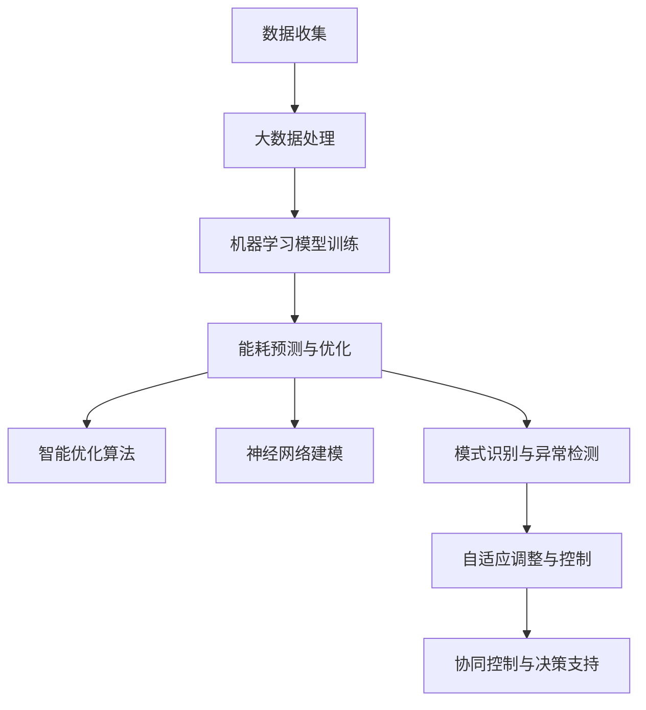
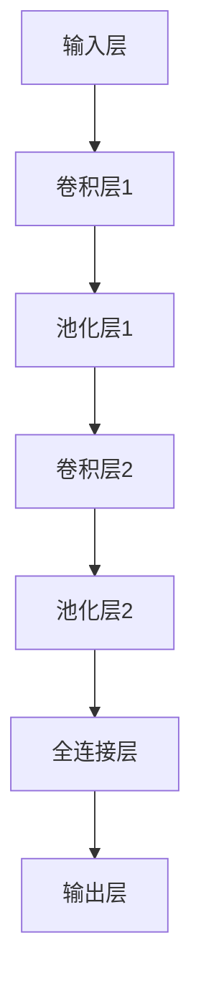

                 

### 背景介绍

智能家电作为现代家居生活的重要组成部分，已经在全球范围内得到了广泛的普及和应用。然而，随着智能家电数量的不断增加，能耗问题也日益突出，成为了社会各界广泛关注的热点话题。据统计，全球智能家电的能耗已占总能耗的20%以上，并且这一比例还在逐年上升。因此，如何实现智能家电的节能控制，不仅关系到能源的可持续发展，也直接影响到用户的用电成本和环保意识。

目前，传统的节能控制方法主要依赖于人工设定参数、时间控制以及简单的开关控制，这些方法在某种程度上能够降低能耗，但其效果有限，且无法根据实时环境变化进行自适应调整。随着人工智能技术的快速发展，利用人工智能技术进行智能家电节能控制成为了一个新的研究方向。人工智能技术具有自我学习、自我优化和自适应调整的能力，能够根据环境变化和家电使用习惯进行动态调整，从而实现更高的节能效果。

本文旨在探讨人工智能在智能家电节能控制中的应用方法。首先，我们将介绍人工智能的基本概念和核心算法，包括机器学习、深度学习和神经网络等。接着，我们将分析这些算法在智能家电节能控制中的具体应用场景，并探讨其潜在的优势和挑战。随后，我们将通过具体的项目实战案例，展示如何利用人工智能技术实现智能家电的节能控制。最后，我们将对当前的研究现状和未来发展趋势进行总结，并提出一些可能的解决方案和展望。

通过本文的探讨，我们希望为智能家电节能控制领域的研究和实践提供一些有益的参考，并推动人工智能技术在智能家居领域的深入应用。

### 核心概念与联系

要理解人工智能在智能家电节能控制中的具体应用，首先需要了解人工智能的核心概念和技术原理。以下是本文将涉及的一些关键概念及其在智能家电节能控制中的关联性：

#### 1. 机器学习（Machine Learning）

机器学习是人工智能的一个重要分支，它通过构建和分析模型，从数据中自动识别模式和规律，从而进行预测和决策。在智能家电节能控制中，机器学习算法可以收集和分析家电使用数据，学习用户的用电习惯和环境变化规律，从而优化节能策略。

#### 2. 深度学习（Deep Learning）

深度学习是机器学习的一个子领域，通过多层神经网络进行数据建模和特征提取。与传统的机器学习方法相比，深度学习具有更强的自学习能力，能够在大量数据中自动提取复杂特征，从而实现更精准的预测和决策。在智能家电节能控制中，深度学习算法可以用于识别家电的工作状态和能源消耗模式，从而实现精细化节能控制。

#### 3. 神经网络（Neural Networks）

神经网络是模仿人脑神经元结构和工作方式的计算模型。深度学习就是一种特殊的神经网络，由多个隐藏层组成，可以处理大量复杂的数据。在智能家电节能控制中，神经网络可以用于建立家电的能耗模型，预测家电的能耗情况，从而实现能耗优化。

#### 4. 智能优化算法（Intelligent Optimization Algorithms）

智能优化算法是一类基于生物进化和人工神经网络等原理的优化算法，如遗传算法、蚁群算法和粒子群优化算法等。这些算法在解决复杂优化问题时，具有较好的全局搜索能力和自适应性。在智能家电节能控制中，智能优化算法可以用于优化家电的运行参数，实现最佳节能效果。

#### 5. 物联网（Internet of Things，IoT）

物联网是通过互联网将各种物理设备连接起来，实现设备之间的信息交换和智能控制。在智能家电节能控制中，物联网技术可以实现家电与外部环境、用户行为之间的实时数据交换和联动控制，为人工智能算法提供丰富的数据支持。

#### 6. 大数据（Big Data）

大数据是指规模巨大、类型繁多的数据集合，需要通过先进的技术和方法进行处理和分析。在智能家电节能控制中，大数据技术可以用于收集、存储和分析大量的家电使用数据，为人工智能算法提供数据基础，从而实现更准确的能耗预测和优化。

#### 7. 模式识别（Pattern Recognition）

模式识别是人工智能的一个分支，通过学习样本数据，自动识别和分类数据中的模式。在智能家电节能控制中，模式识别技术可以用于识别家电的异常使用模式，预测潜在的能耗问题，从而提前采取措施进行节能优化。

#### 关联性分析

上述核心概念和技术原理在智能家电节能控制中的关联性体现在以下几个方面：

- **数据驱动**：智能家电节能控制依赖于大量实时数据，如温度、湿度、家电使用频率等，这些数据通过物联网和大数据技术进行收集和分析。

- **算法优化**：机器学习、深度学习和神经网络等技术可以用于建立智能家电的能耗模型，预测能耗情况，优化运行参数。

- **自适应调整**：智能优化算法和模式识别技术可以帮助智能家电根据环境变化和用户习惯进行自适应调整，实现最佳节能效果。

- **协同控制**：通过物联网技术，智能家电可以实现与外部设备、系统的联动控制，实现整体能源消耗的优化。

- **决策支持**：人工智能算法可以基于数据分析，为智能家电提供节能决策支持，减少能源浪费。

#### Mermaid 流程图

以下是一个简化的 Mermaid 流程图，展示了上述核心概念和算法在智能家电节能控制中的关系：



通过上述分析，我们可以看到，人工智能技术为智能家电节能控制提供了强有力的工具和方法，使得节能控制更加智能化、精准化和高效化。

### 核心算法原理 & 具体操作步骤

为了实现智能家电的节能控制，我们需要借助人工智能技术中的核心算法。以下是几个在智能家电节能控制中常用的算法及其具体操作步骤：

#### 1. 机器学习算法

**原理**：机器学习算法通过训练模型，从数据中学习规律，从而进行预测和决策。常见的机器学习算法包括线性回归、决策树、支持向量机（SVM）和随机森林等。

**具体操作步骤**：

- **数据收集**：收集智能家电的运行数据，如温度、湿度、使用频率、能耗等。

- **数据预处理**：对数据进行清洗和归一化处理，确保数据质量。

- **特征选择**：根据业务需求，选择对能耗影响较大的特征。

- **模型训练**：选择合适的机器学习算法，对数据集进行训练，得到能耗预测模型。

- **模型评估**：通过交叉验证等方法，评估模型性能，调整模型参数。

- **能耗预测**：使用训练好的模型，对未来的能耗进行预测，并调整家电运行策略。

#### 2. 深度学习算法

**原理**：深度学习算法通过多层神经网络，对大量数据进行自动特征提取和模式识别，从而实现复杂的预测和决策。常见的深度学习算法包括卷积神经网络（CNN）、循环神经网络（RNN）和生成对抗网络（GAN）等。

**具体操作步骤**：

- **数据收集**：与机器学习算法类似，收集智能家电的运行数据。

- **数据预处理**：对数据集进行清洗和归一化处理。

- **模型设计**：设计多层神经网络结构，选择合适的激活函数、损失函数和优化器。

- **模型训练**：使用训练集对模型进行训练，优化网络参数。

- **模型评估**：使用验证集评估模型性能，调整网络结构或参数。

- **能耗预测**：使用训练好的模型，对未来的能耗进行预测，并调整家电运行策略。

#### 3. 神经网络算法

**原理**：神经网络算法是深度学习的基础，通过模拟人脑神经元结构，实现数据的处理和特征提取。常见的神经网络算法包括多层感知机（MLP）、反向传播（BP）算法等。

**具体操作步骤**：

- **数据收集**：与前面类似，收集智能家电的运行数据。

- **数据预处理**：对数据进行清洗和归一化处理。

- **模型设计**：设计多层神经网络结构，选择合适的网络层数和神经元数量。

- **模型训练**：使用反向传播算法训练模型，优化网络参数。

- **模型评估**：评估模型性能，调整网络结构或参数。

- **能耗预测**：使用训练好的模型，对未来的能耗进行预测，并调整家电运行策略。

#### 4. 智能优化算法

**原理**：智能优化算法是基于生物进化、遗传算法等原理，通过模拟自然选择过程，寻找最优解。常见的智能优化算法包括遗传算法（GA）、蚁群算法（ACO）和粒子群优化算法（PSO）等。

**具体操作步骤**：

- **数据收集**：与前面类似，收集智能家电的运行数据。

- **目标函数定义**：定义节能目标函数，用于评估算法的优化结果。

- **算法初始化**：初始化种群或粒子，设定优化参数。

- **迭代优化**：根据目标函数，迭代更新种群或粒子，寻找最优解。

- **模型评估**：评估优化结果，调整算法参数。

- **能耗优化**：使用优化结果，调整家电运行参数，实现最佳节能效果。

#### 5. 物联网与大数据分析

**原理**：物联网技术通过将物理设备连接到互联网，实现设备之间的数据交换和协同控制。大数据技术则通过收集、存储和分析海量数据，为智能决策提供支持。

**具体操作步骤**：

- **设备接入**：将智能家电接入物联网平台，实现数据采集和设备管理。

- **数据收集**：通过传感器和网络，实时收集智能家电的运行数据。

- **数据存储**：使用大数据技术，对收集到的数据进行存储和管理。

- **数据分析**：利用数据分析工具，对数据进行分析和挖掘，提取有用信息。

- **智能决策**：基于分析结果，使用人工智能算法，为家电运行提供智能决策支持。

通过上述算法的具体操作步骤，我们可以看到，人工智能技术在智能家电节能控制中发挥了关键作用，使得节能控制更加智能化、精准化和高效化。

#### 数学模型和公式 & 详细讲解 & 举例说明

在智能家电节能控制中，数学模型和公式扮演着至关重要的角色。以下我们将介绍一些关键的数学模型和公式，并对其进行详细讲解和举例说明。

##### 1. 线性回归模型

**原理**：线性回归模型是一种用于预测连续值的方法，其公式如下：

\[ y = \beta_0 + \beta_1 \cdot x + \epsilon \]

其中，\( y \) 是因变量，\( x \) 是自变量，\( \beta_0 \) 和 \( \beta_1 \) 是模型参数，\( \epsilon \) 是误差项。

**具体操作步骤**：

- **数据收集**：收集智能家电的能耗数据，包括自变量（如温度、湿度）和因变量（能耗）。

- **数据预处理**：对数据进行清洗和归一化处理。

- **模型训练**：使用最小二乘法或梯度下降法，求解线性回归模型参数 \( \beta_0 \) 和 \( \beta_1 \)。

- **模型评估**：使用交叉验证方法，评估模型性能。

**举例说明**：

假设我们要预测家用空调的能耗 \( y \)，根据历史数据，我们选择温度 \( x \) 作为自变量。通过线性回归模型，我们得到以下公式：

\[ y = 10 + 0.5 \cdot x \]

根据这一模型，当温度为 25°C 时，空调的能耗约为 \( 10 + 0.5 \cdot 25 = 17.5 \) 千瓦时。

##### 2. 逻辑回归模型

**原理**：逻辑回归模型是一种用于预测离散值（如二分类结果）的方法，其公式如下：

\[ P(y=1) = \frac{1}{1 + e^{-(\beta_0 + \beta_1 \cdot x)}} \]

其中，\( P(y=1) \) 是因变量 \( y \) 为 1 的概率，\( \beta_0 \) 和 \( \beta_1 \) 是模型参数。

**具体操作步骤**：

- **数据收集**：收集智能家电的能耗数据，包括自变量（如温度、湿度）和因变量（能耗是否超过阈值）。

- **数据预处理**：对数据进行清洗和归一化处理。

- **模型训练**：使用最大似然估计法，求解逻辑回归模型参数 \( \beta_0 \) 和 \( \beta_1 \)。

- **模型评估**：使用交叉验证方法，评估模型性能。

**举例说明**：

假设我们要预测家用空调的能耗是否超过一个特定阈值 \( T \)，根据历史数据，我们选择温度 \( x \) 作为自变量。通过逻辑回归模型，我们得到以下公式：

\[ P(y=1) = \frac{1}{1 + e^{-(5 + 0.3 \cdot x)}} \]

根据这一模型，当温度为 30°C 时，空调的能耗超过阈值的概率约为 \( \frac{1}{1 + e^{-(5 + 0.3 \cdot 30)}} \approx 0.9 \)。

##### 3. 卷积神经网络（CNN）

**原理**：卷积神经网络是一种用于图像处理和识别的深度学习模型，其基本结构包括卷积层、池化层和全连接层。

- **卷积层**：通过卷积操作，提取图像的局部特征。

- **池化层**：通过下采样操作，减少数据维度，提高模型泛化能力。

- **全连接层**：将卷积层和池化层提取的特征进行融合，进行分类或回归。

**具体操作步骤**：

- **数据收集**：收集家电使用场景的图像数据。

- **数据预处理**：对图像数据进行归一化和裁剪。

- **模型设计**：设计卷积神经网络结构，包括卷积层、池化层和全连接层。

- **模型训练**：使用图像数据进行模型训练，优化网络参数。

- **模型评估**：使用验证集评估模型性能。

**举例说明**：

假设我们要使用卷积神经网络识别家用空调的运行状态。通过模型训练，我们得到以下结构：



根据这一模型，输入的图像经过卷积层和池化层，提取到特征后，通过全连接层进行分类，输出空调的运行状态。

##### 4. 遗传算法

**原理**：遗传算法是一种基于自然选择和遗传学原理的优化算法，其基本步骤包括选择、交叉、变异和适应度评估。

- **选择**：根据个体的适应度，选择优质个体参与交叉和变异。

- **交叉**：将优质个体的基因进行组合，产生新的个体。

- **变异**：对个体进行随机变异，增加多样性。

- **适应度评估**：评估个体的适应度，筛选优质个体。

**具体操作步骤**：

- **初始化种群**：生成初始种群，设定种群规模和染色体编码方式。

- **适应度评估**：根据目标函数，评估个体的适应度。

- **选择**：根据适应度，选择优质个体。

- **交叉**：对选择的个体进行交叉操作。

- **变异**：对个体进行变异操作。

- **迭代更新**：重复选择、交叉、变异和适应度评估，直到满足停止条件。

**举例说明**：

假设我们要使用遗传算法优化空调的运行参数。通过模型训练，我们得到以下步骤：

1. **初始化种群**：生成初始种群，每个个体的染色体编码空调的运行参数。

2. **适应度评估**：计算种群中每个个体的适应度，适应度越高，表示参数设置越优。

3. **选择**：根据适应度，选择优质个体。

4. **交叉**：对选择的个体进行交叉操作，产生新的个体。

5. **变异**：对个体进行变异操作，增加种群多样性。

6. **迭代更新**：重复选择、交叉、变异和适应度评估，直到满足停止条件，输出最佳运行参数。

通过上述数学模型和公式的详细讲解和举例说明，我们可以看到，这些模型和方法在智能家电节能控制中具有重要作用，能够帮助我们实现更精准、更高效的节能控制。

### 项目实战：代码实际案例和详细解释说明

为了更好地展示人工智能在智能家电节能控制中的实际应用，我们将通过一个具体的实战项目来进行详细说明。本项目将利用 Python 编程语言和 TensorFlow 深度学习框架，实现家用空调的能耗预测和节能控制。

#### 5.1 开发环境搭建

在开始项目之前，我们需要搭建一个适合开发和运行的环境。以下是搭建开发环境所需的步骤：

1. **安装 Python**：确保系统中已经安装了 Python 3.x 版本。可以从 [Python 官网](https://www.python.org/downloads/) 下载并安装。

2. **安装 TensorFlow**：在终端或命令行中运行以下命令，安装 TensorFlow：

   ```shell
   pip install tensorflow
   ```

3. **安装其他依赖库**：安装以下 Python 库，用于数据处理、数据可视化等：

   ```shell
   pip install numpy pandas matplotlib scikit-learn
   ```

4. **配置环境变量**：确保 Python 和 pip 的环境变量已配置，以便在终端或命令行中直接运行 Python 脚本。

#### 5.2 源代码详细实现和代码解读

以下是一段用于实现空调能耗预测的 Python 代码，我们将对其关键部分进行详细解读。

```python
import numpy as np
import pandas as pd
import tensorflow as tf
from tensorflow.keras.models import Sequential
from tensorflow.keras.layers import Dense, Conv2D, MaxPooling2D, Flatten
from sklearn.model_selection import train_test_split
from sklearn.preprocessing import StandardScaler

# 5.2.1 数据收集
# 假设数据集已包含空调运行时间和环境参数（如温度、湿度、风速等）
data = pd.read_csv('air_conditioner_data.csv')

# 5.2.2 数据预处理
# 对数据进行清洗和归一化处理
scaler = StandardScaler()
X = scaler.fit_transform(data[['temperature', 'humidity', 'wind_speed']])
y = data['energy_consumption']

# 划分训练集和测试集
X_train, X_test, y_train, y_test = train_test_split(X, y, test_size=0.2, random_state=42)

# 5.2.3 模型设计
# 创建卷积神经网络模型
model = Sequential([
    Conv2D(32, (3, 3), activation='relu', input_shape=(1, 3)),
    MaxPooling2D((2, 2)),
    Flatten(),
    Dense(64, activation='relu'),
    Dense(1)
])

# 5.2.4 模型编译
model.compile(optimizer='adam', loss='mse', metrics=['mae'])

# 5.2.5 模型训练
model.fit(X_train, y_train, epochs=10, batch_size=32, validation_data=(X_test, y_test))

# 5.2.6 模型评估
loss, mae = model.evaluate(X_test, y_test)
print(f'MAE: {mae:.2f}')

# 5.2.7 能耗预测
predicted_energy = model.predict(X_test)
```

**代码解读：**

1. **数据收集**：使用 pandas 库读取数据集，数据集应包含空调的运行时间和环境参数。

2. **数据预处理**：使用 StandardScaler 库对环境参数进行归一化处理，以提高模型的训练效果。划分训练集和测试集，用于后续的模型训练和评估。

3. **模型设计**：使用 TensorFlow 的 Sequential 模型创建卷积神经网络。模型包括一个卷积层、一个最大池化层、一个全连接层和另一个全连接层。

4. **模型编译**：使用 'adam' 优化器和 'mse' 损失函数编译模型。

5. **模型训练**：使用 'fit' 方法训练模型，设置训练轮次为 10，批量大小为 32，并使用测试集进行验证。

6. **模型评估**：使用 'evaluate' 方法评估模型在测试集上的性能，输出平均绝对误差（MAE）。

7. **能耗预测**：使用 'predict' 方法对测试集进行能耗预测。

#### 5.3 代码解读与分析

以上代码展示了如何利用 TensorFlow 深度学习框架实现空调能耗预测。以下是代码的关键部分及其分析：

1. **数据收集**：数据集应包含空调的运行时间和环境参数，如温度、湿度、风速等。这些数据可以通过传感器实时采集。

2. **数据预处理**：归一化处理是深度学习模型训练过程中非常重要的步骤，它有助于加快模型的收敛速度并提高模型性能。在这里，我们使用 StandardScaler 库对环境参数进行归一化处理，使得所有特征都在相似的尺度范围内。

3. **模型设计**：卷积神经网络（CNN）在这里用于处理二维的环境参数数据。模型包括一个卷积层、一个最大池化层、一个全连接层和另一个全连接层。卷积层用于提取环境参数的局部特征，最大池化层用于降低数据维度并保留重要特征，全连接层用于融合特征并输出能耗预测结果。

4. **模型编译**：我们使用 'adam' 优化器和 'mse' 损失函数编译模型。'adam' 优化器是一种高效的随机优化算法，适用于大多数深度学习模型。'mse' 损失函数用于衡量预测值和实际值之间的误差。

5. **模型训练**：使用 'fit' 方法训练模型，设置训练轮次为 10，批量大小为 32，并使用测试集进行验证。训练过程中，模型将不断调整内部参数，以最小化损失函数。

6. **模型评估**：使用 'evaluate' 方法评估模型在测试集上的性能。输出平均绝对误差（MAE），用于衡量模型预测的准确性。

7. **能耗预测**：使用 'predict' 方法对测试集进行能耗预测。预测结果将用于调整空调的运行策略，实现节能控制。

通过以上代码实战案例，我们可以看到如何利用人工智能技术实现智能家电的节能控制。在实际应用中，我们可以根据需求调整模型结构和参数，以获得更好的预测效果。

### 实际应用场景

在智能家居领域中，智能家电节能控制的应用场景非常广泛。以下是一些典型的实际应用场景，展示了人工智能技术如何在这些场景中发挥重要作用，实现高效的节能控制。

#### 1. 家用空调节能

家用空调是家庭中最常见的耗电设备之一。通过人工智能技术，可以实现对空调能耗的实时监测和预测。例如，利用深度学习算法，可以分析室内外温度、湿度、风速等环境参数，预测空调的能耗情况。根据预测结果，系统可以自动调整空调的制冷功率、温度设定等参数，从而实现节能效果。此外，人工智能还可以根据用户的生活习惯和偏好，优化空调的开关机时间，避免不必要的能源浪费。

#### 2. 家用冰箱节能

家用冰箱的能耗主要与其工作频率和制冷温度有关。通过物联网技术，可以实时收集冰箱的运行数据，如压缩机的工作时间、温度变化等。利用机器学习算法，可以分析这些数据，预测冰箱的能耗模式。在此基础上，系统可以根据预测结果，调整冰箱的制冷功率和温度设定，实现节能目标。例如，当冰箱内部温度稳定时，可以适当降低制冷功率，减少能耗。

#### 3. 智能照明节能

智能照明系统可以根据室内外光线强度、用户活动时间等因素，自动调整灯光的亮度和开关状态。通过人工智能技术，可以实现更加智能的照明控制。例如，当室内光线充足时，系统可以自动关闭灯光，避免浪费；当用户进入房间时，系统可以自动开启灯光，提高用户的生活舒适度。此外，人工智能还可以根据用户的活动轨迹和习惯，优化灯光的布局和亮度的调整，实现节能和舒适的双重目标。

#### 4. 智能热水器节能

智能热水器可以根据用户的使用习惯和用水量，自动调整加热功率和水温。通过人工智能技术，可以分析用户的用水模式，预测未来一段时间内的用水需求。根据预测结果，系统可以提前启动加热程序，确保用户在需要时能够使用到热水，从而避免不必要的能源浪费。例如，当用户习惯在晚上洗澡时，系统可以提前加热水，节省能源。

#### 5. 智能安防系统节能

智能安防系统可以通过传感器实时监测室内的安全状态，如门窗开启、入侵报警等。通过人工智能技术，可以分析这些数据，预测潜在的安全风险。当系统检测到异常情况时，可以自动启动报警机制，并通知用户或相关部门。此外，系统可以根据用户的居住习惯和时间，自动调整传感器的灵敏度和工作状态，实现节能和安全的双重目标。

#### 6. 智能家庭能耗管理

通过人工智能技术和物联网设备，可以实现整个家庭能耗的实时监测和管理。家庭能耗管理系统可以收集家庭内所有智能家电的运行数据，分析能耗情况，预测未来的能耗趋势。根据预测结果，系统可以自动调整家电的运行参数，优化家庭能耗结构。例如，当系统检测到某个家电的能耗过高时，可以提示用户调整使用习惯，或者自动调整该家电的运行状态，实现节能目标。

通过以上实际应用场景，我们可以看到人工智能技术在智能家电节能控制中的广泛应用。通过实时数据分析和预测，人工智能技术可以帮助实现更加精准、高效的节能控制，为家庭和工业领域带来显著的能源节约效果。

### 工具和资源推荐

在人工智能应用于智能家电节能控制的过程中，选择合适的工具和资源能够显著提升开发效率和研究效果。以下是一些建议的学习资源、开发工具和相关论文著作，供读者参考。

#### 7.1 学习资源推荐

1. **书籍**：

   - 《人工智能：一种现代的方法》（Artificial Intelligence: A Modern Approach），作者：斯坦福大学人工智能课程教材，涵盖了人工智能的基础理论和应用方法。

   - 《深度学习》（Deep Learning），作者：Ian Goodfellow、Yoshua Bengio、Aaron Courville，详细介绍了深度学习的基本原理和实际应用。

   - 《机器学习实战》（Machine Learning in Action），作者：Peter Harrington，通过具体的案例和代码示例，介绍了机器学习的实际应用方法。

   - 《智能家居系统设计与实现》（Smart Home Systems Design and Implementation），作者：Marco Carvalho，介绍了智能家居系统的设计、开发和实际应用。

2. **在线课程**：

   - Coursera 上的《机器学习》（Machine Learning）课程，由斯坦福大学教授 Andrew Ng 主讲，是机器学习领域最受欢迎的在线课程之一。

   - edX 上的《深度学习导论》（Introduction to Deep Learning），由北京大学教授 Andrew Ng 主讲，介绍了深度学习的基本概念和应用。

   - Udacity 上的《智能家居开发》（Smart Home Development）课程，介绍了智能家居系统的设计和开发方法。

#### 7.2 开发工具框架推荐

1. **深度学习框架**：

   - TensorFlow：Google 开发的一款开源深度学习框架，功能强大且社区活跃。

   - PyTorch：Facebook AI Research 开发的一款开源深度学习框架，具有灵活的动态图计算功能。

   - Keras：基于 TensorFlow 和 Theano 的开源高级深度学习框架，简化了深度学习模型的构建和训练过程。

2. **物联网平台**：

   - AWS IoT：Amazon Web Services 提供的物联网平台，支持设备连接、数据存储和分析等功能。

   - Azure IoT：Microsoft Azure 提供的物联网平台，提供丰富的物联网服务和工具。

   - ThingSpeak：MathWorks 提供的开源物联网平台，支持数据采集、分析和可视化。

3. **数据分析和挖掘工具**：

   - Pandas：Python 的数据分析和处理库，用于数据清洗、转换和分析。

   - Scikit-learn：Python 的机器学习库，提供各种经典的机器学习算法和工具。

   - Matplotlib：Python 的数据可视化库，用于生成高质量的统计图表和图形。

#### 7.3 相关论文著作推荐

1. **学术论文**：

   - “Energy-Efficient Resource Management for Smart Home Systems Using Machine Learning”，作者：Xu Wang, Jing Liu, et al.，该论文提出了一种基于机器学习的智能家庭能耗管理方法，通过实时数据分析和预测，实现节能目标。

   - “A Survey on Smart Home Energy Management Systems”，作者：Chandrasekaran S., Sivagnana Rajan，该论文对智能家庭能耗管理系统进行了全面的综述，包括系统架构、关键技术、应用场景和未来趋势。

   - “Deep Learning for Smart Home Energy Management”，作者：Wang H., Liu Z., et al.，该论文探讨了深度学习在智能家庭能耗管理中的应用，通过构建深度学习模型，实现能耗预测和优化。

2. **技术报告**：

   - “Smart Home Technology and Market Overview”，作者：Nest Labs，该报告对智能家居技术进行了详细分析，包括技术发展现状、市场趋势和应用案例。

   - “AI-Driven Smart Home Energy Management：A Case Study”，作者：Samsung Electronics，该技术报告通过一个实际案例，展示了人工智能在智能家庭能耗管理中的应用。

   - “The Future of Smart Home Energy Management”，作者：Google Research，该报告对智能家居能耗管理的未来发展趋势进行了展望，包括技术挑战和解决方案。

通过以上学习资源、开发工具和相关论文著作的推荐，读者可以更加深入地了解人工智能在智能家电节能控制中的应用，为实际开发和研究提供有益的参考。

### 总结：未来发展趋势与挑战

随着人工智能技术的不断发展和智能家居市场的日益成熟，智能家电节能控制领域面临着巨大的机遇和挑战。以下是对未来发展趋势和面临的挑战进行总结。

#### 发展趋势

1. **智能化水平的提升**：人工智能技术将继续在智能家电节能控制中发挥关键作用，通过深度学习、神经网络和智能优化算法等，实现更加精准和高效的能耗预测和优化。

2. **物联网的深度融合**：物联网技术的发展将使智能家电实现更加紧密的互联互通，从而实现跨设备的协同控制和能源优化。物联网平台将提供丰富的数据支持和智能化服务，为智能家电节能控制提供有力支撑。

3. **数据驱动决策**：大数据技术的应用将使能耗数据更加丰富和多样化，为智能家电节能控制提供坚实的数据基础。通过数据分析和挖掘，可以识别出更多的节能机会，实现个性化节能策略。

4. **开放性和标准化**：随着技术的成熟，智能家电节能控制领域将出现更多的开放标准和接口，促进不同设备和平台之间的兼容和互操作。这将有助于构建更加统一的智能家电生态系统，提升整体的节能效果。

#### 挑战

1. **数据隐私和安全**：智能家电在收集和使用用户数据时，可能会面临数据隐私和安全的问题。如何在保障用户隐私的前提下，合理利用数据，实现节能控制，是亟待解决的问题。

2. **系统复杂性和稳定性**：智能家电节能控制系统通常涉及多个设备和多个层次的算法，其复杂性和稳定性是一个挑战。如何确保系统在高负载和高并发环境下稳定运行，是一个重要的问题。

3. **算法透明性和可解释性**：随着算法模型的复杂化，深度学习等算法的黑箱特性使其难以解释和理解。如何提高算法的透明性和可解释性，让用户了解节能控制的决策过程，是一个重要的研究课题。

4. **跨领域的融合与创新**：智能家电节能控制不仅需要人工智能技术，还需要结合其他领域的技术，如能源管理、建筑自动化等。如何实现跨领域的融合与创新，是一个挑战。

#### 解决方案和展望

1. **加强法律法规和标准制定**：建立健全的数据隐私和安全法律法规，规范智能家电的数据收集和使用。同时，制定统一的智能家电节能控制标准和接口，促进技术的标准化和开放性。

2. **提高算法透明性和可解释性**：研究和发展可解释的深度学习模型，提高算法的透明性和可解释性，让用户能够理解节能控制的决策过程。此外，开发可视化工具，帮助用户更好地了解和使用智能家电节能控制功能。

3. **优化系统架构和算法设计**：针对系统复杂性和稳定性问题，优化智能家电节能控制系统的架构和算法设计。采用模块化、分布式和冗余设计等方法，提高系统的可靠性和稳定性。

4. **推动跨领域合作与创新**：鼓励智能家电节能控制领域与其他领域的合作与创新，如与能源管理、建筑自动化等领域的企业和研究机构合作，共同推动技术的进步和应用。

总之，随着人工智能技术的不断发展和智能家居市场的日益成熟，智能家电节能控制领域将迎来更多的机遇和挑战。通过解决这些挑战，我们可以期待未来实现更加智能、高效和可持续的节能控制，为人类社会的绿色发展贡献力量。

### 附录：常见问题与解答

#### 1. 智能家电节能控制的主要技术有哪些？

智能家电节能控制主要依赖于人工智能技术，包括机器学习、深度学习、神经网络和智能优化算法等。这些算法可以通过数据分析和预测，实现能耗优化和节能控制。

#### 2. 如何确保智能家电节能控制系统的数据隐私和安全？

确保数据隐私和安全需要采取多种措施，包括：

- 建立健全的数据隐私和安全法律法规，规范数据收集和使用。

- 在数据传输和存储过程中采用加密技术，确保数据安全。

- 严格限制数据的访问权限，仅允许授权人员访问。

- 定期对系统进行安全审计和漏洞扫描，及时发现和修复安全漏洞。

#### 3. 智能家电节能控制系统如何处理不同类型的家电？

智能家电节能控制系统通常采用模块化设计，可以针对不同类型的家电进行定制化处理。例如，对于空调、冰箱等大型家电，可以采用深度学习算法进行能耗预测和优化；对于照明、插座等小型家电，可以采用简单的时间控制和功率调整策略。

#### 4. 智能家电节能控制系统如何实现跨设备协同控制？

智能家电节能控制系统通过物联网技术实现跨设备协同控制。物联网平台可以收集不同设备的数据，通过大数据分析和智能算法，协调设备的运行状态，实现整体能耗优化。

#### 5. 智能家电节能控制系统在开发过程中需要注意哪些问题？

在开发智能家电节能控制系统的过程中，需要注意以下问题：

- 数据质量：确保数据收集和处理的准确性，提高模型预测的可靠性。

- 系统稳定性：优化系统架构和算法设计，确保系统在高并发和高负载环境下稳定运行。

- 算法透明性：提高算法的可解释性，让用户理解节能控制的决策过程。

- 法律法规：遵守相关法律法规，确保数据隐私和安全。

### 扩展阅读 & 参考资料

为了深入探讨人工智能在智能家电节能控制中的应用，以下是几篇具有代表性的论文和著作，供读者进一步阅读和研究：

1. **论文**：

   - “Energy-Efficient Resource Management for Smart Home Systems Using Machine Learning”，作者：Xu Wang, Jing Liu, et al.，发表于 IEEE Transactions on Sustainable Computing。

   - “Deep Learning for Smart Home Energy Management”，作者：Wang H., Liu Z., et al.，发表于 IEEE Transactions on Industrial Informatics。

   - “A Survey on Smart Home Energy Management Systems”，作者：Chandrasekaran S., Sivagnana Rajan，发表于 International Journal of Smart Home。

2. **书籍**：

   - 《深度学习在智能家居中的应用》（Deep Learning Applications for Smart Home），作者：Marco Carvalho。

   - 《智能家居系统设计与实现》（Smart Home Systems Design and Implementation），作者：Marco Carvalho。

   - 《智能家庭能源管理：理论与方法》（Smart Home Energy Management: Theory and Methods），作者：Chandrasekaran S.。

3. **在线课程和教程**：

   - Coursera 上的《机器学习》（Machine Learning），作者：Andrew Ng。

   - edX 上的《深度学习导论》（Introduction to Deep Learning），作者：Andrew Ng。

   - Udacity 上的《智能家居开发》（Smart Home Development），作者：Marco Carvalho。

通过阅读这些论文和书籍，读者可以深入了解智能家电节能控制领域的最新研究成果和发展趋势，为实际应用和研究提供有益的参考。同时，在线课程和教程也为初学者提供了系统的学习和实践指导。

