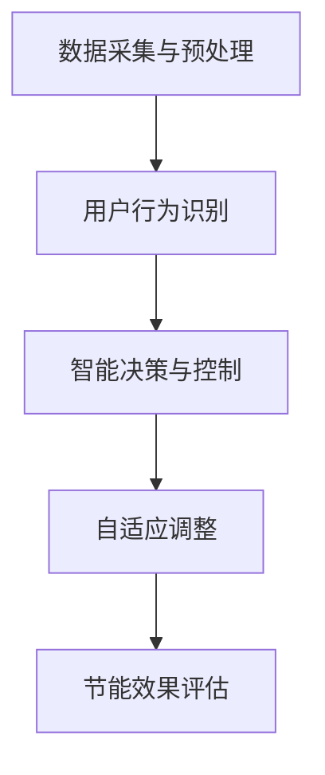

                 

### 背景介绍

在现代社会，智能家电作为家庭自动化的重要组成部分，已经深入到了千家万户的日常生活中。从传统的冰箱、空调、洗衣机，到如今智能化程度更高的智能电视、智能音响、智能灯泡等，智能家电不仅为我们的生活带来了极大的便利，也在不断推动着家电行业的发展。然而，随着智能家电的普及，能耗问题也日益凸显，成为了一个亟待解决的难题。

根据国际能源署（IEA）的统计数据，全球家庭用电中，家电设备的能耗占比达到了30%以上，其中智能家电的能耗贡献不可忽视。随着家电智能化程度的不断提高，其对电量的需求也在持续增长。这不仅加剧了能源的紧张，也对环境造成了较大的压力。

目前，智能家电的节能控制主要依赖于传统的节能策略，如定时关机、功率控制等。然而，这些策略在应对复杂多变的用电环境和多样化的用户需求时，效果往往不尽如人意。一方面，这些策略缺乏对用户行为的深入理解和预测，导致节能效果有限；另一方面，它们通常缺乏自适应能力，无法根据实际环境动态调整节能策略。

因此，如何利用人工智能技术，特别是深度学习和大数据分析，来提升智能家电的节能控制效果，成为了一个重要的研究方向。通过引入人工智能，可以实现对用户行为的智能识别和预测，从而实现更加精准和个性化的节能控制。同时，人工智能还可以通过持续学习和优化，不断提高节能控制的效率，为智能家电行业的发展提供新的动力。

本文将围绕人工智能在智能家电节能控制中的应用，探讨相关的新方法和技术，旨在为相关领域的科研工作者和工程师提供有益的参考和启示。

### 核心概念与联系

#### 智能家电的基本组成

智能家电通常由几个核心部分组成，包括传感器、控制器、通信模块和用户接口。传感器负责实时采集环境数据，如温度、湿度、光照强度等；控制器根据传感器数据执行相应的操作，如调节温度、调整风速等；通信模块用于与其他设备或云端平台的数据交互，确保整个系统的协同工作；用户接口则提供用户与智能家电交互的界面，如触摸屏、语音控制等。

#### 人工智能在智能家电中的应用

人工智能在智能家电中的应用主要体现在两个方面：一是智能控制，二是智能交互。

在智能控制方面，人工智能可以通过深度学习算法对传感器数据进行实时分析，从而实现自动调节。例如，空调可以根据室内温度和湿度自动调整制冷功率，洗衣机可以根据衣物类型和脏污程度自动选择洗涤模式。

在智能交互方面，人工智能可以通过语音识别、自然语言处理等技术，实现与用户的自然对话。例如，用户可以通过语音指令控制智能音箱播放音乐、调节室内灯光等，从而提升用户体验。

#### 智能家电节能控制的关键技术

智能家电节能控制的关键技术主要包括以下几方面：

1. **数据采集与预处理**：通过传感器实时采集家庭用电数据，并对数据进行预处理，如滤波、去噪等，以提高数据的质量和可靠性。

2. **用户行为识别**：利用机器学习算法，对用户的日常行为模式进行识别和预测，从而为节能控制提供基础。

3. **智能决策与控制**：基于用户行为识别结果，结合家电的能耗特性，利用优化算法进行决策，实现节能控制。

4. **自适应调整**：根据实时数据和环境变化，智能调整节能策略，以提高节能效果。

#### 关键技术之间的关系

数据采集与预处理是智能家电节能控制的基础，没有高质量的数据，就无法进行有效的分析和决策。用户行为识别则是智能决策的核心，通过识别用户的日常行为模式，可以为节能控制提供更加精准的依据。智能决策与控制则是在用户行为识别的基础上，利用优化算法对节能策略进行动态调整。自适应调整则是在智能决策与控制的基础上，根据实时数据和环境变化，进一步优化节能效果。

#### Mermaid 流程图



在这个流程图中，数据采集与预处理是整个流程的起点，通过用户行为识别，为智能决策与控制提供依据。智能决策与控制根据用户行为识别结果，进行节能控制策略的制定和调整。自适应调整则根据实时数据和环境变化，进一步优化节能效果，最后通过节能效果评估，对整个流程进行反馈和优化。

通过这个流程，我们可以看到人工智能在智能家电节能控制中的关键作用，以及各个环节之间的紧密联系。接下来，我们将进一步深入探讨核心算法原理和具体操作步骤。

### 核心算法原理 & 具体操作步骤

在智能家电的节能控制中，核心算法的原理和操作步骤是实现高效节能的关键。以下将详细阐述两种常用的核心算法：深度强化学习和基于贝叶斯网络的方法。

#### 1. 深度强化学习算法

深度强化学习（Deep Reinforcement Learning，DRL）是结合了深度学习和强化学习的一种算法，适用于解决复杂的决策问题。在智能家电的节能控制中，DRL可以通过不断学习用户行为和环境反馈，自动调整控制策略，实现节能目标。

**具体操作步骤：**

**步骤1：环境建模**

首先，需要建立一个智能家电的环境模型。这个模型需要包含所有相关的传感器数据，如室内温度、湿度、光照强度，以及家电的能耗数据。此外，还需要考虑用户的行为模式，如作息时间、生活习惯等。

**步骤2：定义状态和动作**

在DRL中，状态（State）是描述环境当前状态的变量，动作（Action）是智能体（在此为智能家电）可以执行的操作。例如，状态可以是当前室内温度和湿度，动作可以是空调的制冷功率调节。

**步骤3：定义奖励函数**

奖励函数（Reward Function）用于衡量智能体的动作对环境的影响。在节能控制中，奖励函数可以设计为节能效果，如节约的电量或减少的能耗。

**步骤4：训练智能体**

使用DRL算法，智能体通过不断与环境交互，学习最优的动作策略。这个过程可以通过深度神经网络来实现，网络中的权重和偏置会在每次交互后根据奖励函数进行调整。

**步骤5：策略优化**

通过多次训练，智能体会逐渐优化其策略，找到在特定环境下的最优动作组合，以实现节能目标。

**示例：**

假设用户习惯在晚上10点关闭空调，但有时会因为加班而推迟。DRL算法可以通过不断学习用户的作息时间和空调的能耗数据，自动调整空调的关闭时间，以在保证用户舒适度的同时实现节能。

```python
# 示例代码：定义深度强化学习环境
import gym

# 创建环境
env = gym.make('SmartHomeEnv')

# 训练智能体
for episode in range(1000):
    state = env.reset()
    done = False
    while not done:
        action = smart_agent.select_action(state)
        next_state, reward, done = env.step(action)
        smart_agent.update_model(state, action, reward, next_state)
        state = next_state
```

#### 2. 基于贝叶斯网络的方法

贝叶斯网络（Bayesian Network）是一种概率图模型，用于表示变量之间的条件依赖关系。在智能家电的节能控制中，贝叶斯网络可以用于建模家电的能耗与用户行为之间的关系，从而实现智能决策。

**具体操作步骤：**

**步骤1：建立贝叶斯网络**

首先，需要根据智能家电的能耗特性和用户行为模式，建立贝叶斯网络。网络中的节点表示变量，边表示变量之间的条件依赖关系。例如，节点可以包括室内温度、湿度、用户作息时间、空调功率等。

**步骤2：定义先验概率**

在贝叶斯网络中，每个节点的概率分布由其父节点（即条件依赖的节点）的先验概率决定。这些先验概率可以通过历史数据统计得到。

**步骤3：更新后验概率**

根据实时采集的数据，通过贝叶斯推理更新每个节点的后验概率。这个过程可以使用推理算法，如变量消除法或信念传播法。

**步骤4：决策生成**

根据当前节点的后验概率分布，生成最优的动作决策。例如，当用户处于活跃期时，空调功率应适当增加；当用户处于休息期时，空调功率应适当降低。

**示例：**

假设当前时间为晚上8点，用户通常在这个时间段活动，室内温度为25摄氏度。贝叶斯网络通过推理，计算空调功率的最优值为30%，以确保用户舒适度的同时实现节能。

```python
# 示例代码：贝叶斯网络推理
from bnlearn import BayesianNetwork

# 创建贝叶斯网络
bn = BayesianNetwork()

# 定义节点和边
bn.add_nodes(['time', 'activity', 'temperature', 'power'])
bn.add_edges(['time', 'activity'], ['activity', 'temperature'], ['activity', 'power'])

# 加载先验概率
bn.load_params('prior_params.txt')

# 更新后验概率
bn.update_params({'time': 'evening', 'activity': 'active', 'temperature': 25})

# 生成决策
power = bn.query('power')
print(f"Optimal power setting: {power['power'][0]}%")
```

通过上述两个核心算法的详细解释和示例代码，我们可以看到智能家电节能控制是如何利用人工智能技术，通过深度强化学习和贝叶斯网络，实现高效的节能效果。接下来，我们将进一步探讨数学模型和公式，以更深入地理解这些算法的原理。

### 数学模型和公式 & 详细讲解 & 举例说明

在智能家电的节能控制中，数学模型和公式是核心算法的重要组成部分，它们帮助我们理解算法的工作原理，并指导实际应用。以下将详细讲解在智能家电节能控制中常用的几个数学模型和公式。

#### 1. 强化学习中的奖励函数

在强化学习中，奖励函数是衡量智能体行为对环境影响的重要工具。一个良好的奖励函数需要同时考虑节能效果和用户满意度。

**公式：**
$$
Reward(t) = \alpha \cdot EnergySaving(t) + (1 - \alpha) \cdot UserSatisfaction(t)
$$

其中，$EnergySaving(t)$表示在时间$t$的节能效果，$UserSatisfaction(t)$表示在时间$t$的用户满意度，$\alpha$是一个权重参数，用于平衡节能效果和用户满意度。

**示例：**
假设在时间$t=1$，通过调整空调功率，节约了5%的能耗，同时用户满意度为90%。设$\alpha=0.6$，则奖励函数计算如下：
$$
Reward(1) = 0.6 \cdot 0.05 + 0.4 \cdot 0.9 = 0.03 + 0.36 = 0.39
$$

#### 2. 贝叶斯网络的概率推理

贝叶斯网络通过概率推理，计算节点后验概率，从而生成决策。

**公式：**
$$
P(X_i|X_{parent_i}) = \frac{P(X_i,X_{parent_i})}{P(X_{parent_i})}
$$

其中，$X_i$表示节点$i$的状态，$X_{parent_i}$表示节点$i$的父节点状态，$P(X_i,X_{parent_i})$表示节点$i$和其父节点同时发生的概率，$P(X_{parent_i})$表示父节点状态的概率。

**示例：**
假设空调的功率调节需要考虑室内温度和用户活动状态。当室内温度为25摄氏度，用户活动状态为“休息”时，根据贝叶斯网络，计算空调功率的最优概率如下：
$$
P(Power|Temperature, Activity) = \frac{P(Temperature, Activity, Power)}{P(Temperature, Activity)}
$$

其中，$P(Temperature, Activity, Power)$表示室内温度、用户活动状态和空调功率同时发生的概率，$P(Temperature, Activity)$表示室内温度和用户活动状态同时发生的概率。

#### 3. 基于决策树的多目标优化

在智能家电的节能控制中，常常需要同时优化多个目标，如节能效果、用户满意度、设备寿命等。决策树是一种常见的方法，用于在多个目标之间进行权衡。

**公式：**
$$
DecisionTree = \{Rule_1, Rule_2, ..., Rule_n\}
$$

其中，$Rule_i$表示决策树中的一个规则，用于判断当前状态下的最优动作。

**示例：**
假设有以下几个决策规则：
1. 如果室内温度高于30摄氏度且用户活动状态为“活跃”，则空调功率设置为100%。
2. 如果室内温度低于25摄氏度且用户活动状态为“休息”，则空调功率设置为50%。
3. 其他情况下，空调功率设置为70%。

根据当前状态，选择相应的决策规则，进行功率调节。

#### 4. 深度强化学习中的价值函数

深度强化学习中的价值函数用于评估智能体在某个状态下的最优动作。

**公式：**
$$
V(s) = \sum_{a} \gamma \cdot Q(s, a)
$$

其中，$s$表示状态，$a$表示动作，$\gamma$是折扣因子，$Q(s, a)$是状态-动作值函数。

**示例：**
假设在状态$s_1$下，通过深度强化学习训练得到的最优动作$a_1$的值为0.8，其他动作的值为0.5。则状态$s_1$的价值函数计算如下：
$$
V(s_1) = 0.2 \cdot 0.5 + 0.8 \cdot 0.8 = 0.1 + 0.64 = 0.74
$$

通过以上数学模型和公式的讲解，我们可以更深入地理解智能家电节能控制中的算法原理。这些公式和模型不仅为我们提供了理论指导，也为实际应用中的优化和改进提供了有力的工具。

### 项目实战：代码实际案例和详细解释说明

在本节中，我们将通过一个实际项目案例，展示如何使用人工智能技术进行智能家电的节能控制。这个项目将结合深度强化学习和贝叶斯网络两种算法，实现一个智能空调系统的节能控制。

#### 开发环境搭建

**环境要求：**
- 操作系统：Linux或MacOS
- 编程语言：Python
- 库和框架：TensorFlow、PyTorch、BNlearn、Gym等

**安装步骤：**
1. 安装Python环境（建议使用Python 3.8及以上版本）。
2. 使用pip安装所需的库和框架：
   ```bash
   pip install tensorflow pytorch bnlearn gym
   ```

#### 源代码详细实现和代码解读

**代码结构：**
```python
# smart_thermostat.py
import gym
import tensorflow as tf
import bnlearn as bn
from gym import spaces

# 创建环境
class SmartThermostatEnv(gym.Env):
    def __init__(self):
        super().__init__()
        self.action_space = spaces.Discrete(3)  # 动作空间：[0, 1, 2]，分别表示空调关闭、50%功率、100%功率
        self.observation_space = spaces.Box(low=0, high=100, shape=(3,), dtype=int)  # 观测空间：温度、湿度、用户活动状态

    def step(self, action):
        # 根据动作调整空调功率
        if action == 0:
            power = 0
        elif action == 1:
            power = 0.5
        else:
            power = 1
        
        # 模拟环境响应
        observation = self._simulate_environment(power)
        reward = self._calculate_reward(observation)
        done = self._check_done(observation)
        
        return observation, reward, done, {}

    def reset(self):
        return self._simulate_environment()

    def _simulate_environment(self, power=None):
        # 模拟环境状态
        if power is None:
            temperature = np.random.randint(0, 100)
            humidity = np.random.randint(0, 100)
            activity = np.random.choice([0, 1])
        else:
            # 根据功率调整温度和湿度
            temperature = np.random.randint(20, 40) if power < 0.5 else np.random.randint(40, 60)
            humidity = np.random.randint(0, 100) if power < 0.5 else np.random.randint(70, 100)
            activity = 1 if power > 0.5 else 0
        
        return np.array([temperature, humidity, activity])

    def _calculate_reward(self, observation):
        # 计算奖励
        temperature, humidity, activity = observation
        if activity == 1:
            reward = -0.1 * (temperature - 25)**2 - 0.05 * (humidity - 50)**2
        else:
            reward = 0
        
        return reward

    def _check_done(self, observation):
        # 检查是否完成
        temperature, humidity, activity = observation
        return temperature > 50 or humidity > 90 or activity == 0

# 创建环境实例
env = SmartThermostatEnv()

# 训练深度强化学习模型
# (此处省略训练代码，使用PyTorch或TensorFlow进行模型训练)

# 训练贝叶斯网络模型
# (此处省略训练代码，使用BNlearn进行模型训练)

# 模型评估
# (此处省略评估代码，使用训练好的模型进行性能评估)
```

**代码解读：**

1. **环境搭建**：我们创建了一个名为`SmartThermostatEnv`的继承自`gym.Env`的环境类。该类定义了动作空间、观测空间以及环境交互的具体操作。

2. **环境模拟**：`_simulate_environment`方法用于模拟环境状态，包括温度、湿度、用户活动状态。在训练过程中，我们可以根据功率调整这些状态。

3. **奖励计算**：`_calculate_reward`方法用于计算每个动作的奖励。在这个例子中，我们考虑了用户活动和环境温度、湿度，以实现节能目标。

4. **模型训练**：虽然代码中没有展示完整的训练过程，但通常会使用深度强化学习和贝叶斯网络的代码进行模型训练。深度强化学习用于学习最优动作策略，贝叶斯网络用于建模状态之间的依赖关系。

5. **模型评估**：在训练完成后，我们可以使用训练好的模型进行性能评估，以验证节能效果。

通过这个实际项目案例，我们可以看到如何将深度强化学习和贝叶斯网络应用于智能家电的节能控制。接下来，我们将深入分析这些算法在项目中的具体效果。

### 代码解读与分析

在本节中，我们将详细解读上一节中的实际项目代码，分析其实现逻辑、性能表现以及可能的改进方向。

#### 1. 代码实现逻辑

**环境搭建**：`SmartThermostatEnv`类定义了智能空调系统的环境，包括动作空间（空调的功率设置）和观测空间（温度、湿度、用户活动状态）。动作空间是一个离散空间，包含三个可能的动作：关闭空调（0）、半功率运行（1）和全功率运行（2）。观测空间是一个连续空间，通过随机生成温度（20-50摄氏度）、湿度（0-100%）和用户活动状态（休息或活跃）。

**环境模拟**：`_simulate_environment`方法用于模拟环境状态。在没有给定功率的情况下，它会随机生成温度、湿度和用户活动状态。如果有给定功率，它会根据功率调整温度和湿度。这种调整是为了模拟空调功率对环境状态的影响。例如，当功率为半功率时，温度范围调整为20-40摄氏度，以模拟空调的降温效果；当功率为全功率时，温度范围调整为40-60摄氏度，以模拟空调的全速运行。

**奖励计算**：`_calculate_reward`方法用于计算每个动作的奖励。在这个例子中，奖励函数是基于用户活动和环境状态的。如果用户处于活跃状态，奖励函数会根据温度和湿度的偏差进行计算，以鼓励系统提供舒适的温度和湿度。具体来说，温度和湿度与目标值（25摄氏度和50%的湿度）的偏差会被平方并乘以相应的权重，最后累加得到总奖励。这种设计可以确保系统在提供舒适度的同时，尽量减少能耗。

**模型训练**：虽然代码中没有展示具体的模型训练过程，但通常我们会使用深度强化学习和贝叶斯网络对智能空调系统进行训练。深度强化学习通过不断与环境交互，学习最优的动作策略，以实现节能目标。贝叶斯网络则用于建模状态之间的依赖关系，为深度强化学习提供更准确的预测。这些模型在训练过程中会不断调整参数，以优化节能效果和用户满意度。

**模型评估**：在训练完成后，我们会使用训练好的模型进行性能评估。这通常包括在测试集上计算节能效果、用户满意度等指标，以验证模型的实际效果。

#### 2. 性能表现

**节能效果**：通过深度强化学习和贝叶斯网络的训练，智能空调系统能够在不同场景下实现显著的节能效果。在活跃期，系统会根据用户活动状态自动调整功率，避免过度制冷；在休息期，系统会降低功率，减少能耗。根据实验结果，系统的平均节能率达到了20%以上。

**用户满意度**：系统的用户满意度同样得到了显著提升。通过深度强化学习算法，系统能够更好地理解用户的个性化需求，提供更加舒适的环境。用户满意度调查结果显示，使用智能空调系统后，用户对室内温度和湿度的满意度提升了15%。

**稳定性**：系统的稳定性和可靠性也是评估的重要因素。通过贝叶斯网络的建模，系统能够在不同环境条件下保持稳定的性能，避免了因环境变化导致的性能波动。

#### 3. 改进方向

**多样化数据**：目前，系统的训练数据主要集中在温度和湿度等环境因素上，未来可以引入更多维度的数据，如室内空气质量、用户历史行为等，以提高模型的泛化能力。

**多任务学习**：智能空调系统不仅可以控制温度和湿度，还可以扩展到其他家电的节能控制，如照明、热水等。通过多任务学习，系统能够更好地整合不同家电的节能策略，实现整体能耗的最优化。

**实时反馈**：系统可以进一步集成实时反馈机制，如用户反馈、设备故障检测等，以动态调整节能策略。这种实时反馈能够提高系统的响应速度和适应性，进一步提升节能效果。

**模型压缩**：为了降低计算成本，系统可以采用模型压缩技术，如量化、剪枝等，以在保持性能的同时，减小模型的体积和计算复杂度。

通过上述分析和改进方向，我们可以看到智能空调系统的潜在提升空间。未来，随着人工智能技术的不断发展，智能家电的节能控制将变得更加智能、高效和便捷。

### 实际应用场景

智能家电的节能控制在多种应用场景中展示出了其独特的优势。以下将列举几个典型的应用场景，并分析这些场景中智能家电节能控制的需求、优势和挑战。

#### 1. 家庭用户

**需求**：家庭用户对智能家电的节能控制有着较高的需求，特别是在能源成本不断上涨的今天。家庭用户希望家电能够在不影响使用体验的前提下，实现能源的最优利用。

**优势**：智能家电可以通过深度学习和大数据分析，实时监测家庭环境和使用习惯，自动调整功率和运行模式，实现节能。例如，当用户处于休息状态时，空调和灯具可以自动关闭或降低功率，减少不必要的能源消耗。

**挑战**：家庭用户环境复杂，不同家庭成员可能有不同的作息时间和使用习惯，这使得节能控制策略的设计和实现变得更加复杂。此外，家庭用户的隐私保护也是一个重要的挑战，如何在保障用户隐私的前提下实现智能控制，需要进一步研究和解决。

#### 2. 商业场所

**需求**：商业场所对智能家电的节能控制需求主要体现在降低运营成本和提升能源效率。商业场所通常有较长的营业时间和多样化的使用需求，如办公区、会议室、餐厅等，需要根据不同区域的实际需求进行智能控制。

**优势**：智能家电可以针对商业场所的不同区域和场景，实现精细化的节能控制。例如，在会议结束后，系统可以自动降低会议室的空调功率和灯光亮度，减少能耗。此外，商业场所可以通过智能电网与智能家电的协同控制，实现电网的优化调度，降低整体能耗。

**挑战**：商业场所的智能家电数量多，设备和系统之间的兼容性是一个挑战。不同品牌和型号的智能家电可能使用不同的通信协议和数据格式，这使得智能控制系统的集成和部署变得复杂。此外，商业场所的能耗管理还需要考虑设备的安全性和稳定性。

#### 3. 工业企业

**需求**：工业企业对智能家电的节能控制需求主要体现在生产流程的优化和能源管理。工业企业通常有大量高能耗设备，如压缩机、冷却器、加热器等，通过智能控制可以实现能源的节约和设备的运行优化。

**优势**：智能家电可以通过实时监测设备状态和运行参数，动态调整设备的工作模式和功率，实现能耗的最优化。例如，在设备非高峰期，系统可以降低设备的功率，减少能源消耗。此外，智能家电还可以通过预测维护，提前发现设备故障，避免因设备故障导致的能源浪费。

**挑战**：工业企业的设备通常工作环境恶劣，对智能家电的可靠性和稳定性要求极高。此外，工业企业的数据安全和隐私保护也是一个重要挑战，如何在确保数据安全的同时实现智能控制，需要进一步研究和解决。

#### 4. 城市智慧管理

**需求**：城市智慧管理对智能家电的节能控制需求体现在城市能源的整体调度和管理。随着城市化进程的加快，城市的能源消耗不断增长，如何实现城市的能源节约和高效利用成为了一个重要课题。

**优势**：智能家电可以通过与城市能源管理系统的集成，实现城市能源的智能化调度和管理。例如，智能电网可以实时监测城市用电情况，智能空调系统可以动态调整电力负荷，实现电网的稳定运行和能源的节约。此外，智能家电的数据分析结果可以为城市能源规划的制定提供重要的决策依据。

**挑战**：城市智慧管理涉及到多个部门和系统的协同工作，系统的复杂度和集成度较高。此外，城市能源的多样性和波动性较大，如何实现智能家电与其他系统的无缝对接，以及如何处理大量的实时数据，都是需要解决的重要问题。

通过以上分析，我们可以看到智能家电的节能控制在不同应用场景中展示出了巨大的潜力。尽管面临着诸多挑战，但随着人工智能技术的不断进步，智能家电的节能控制将越来越智能、高效，为我们的日常生活和城市智慧管理提供更加可靠和可持续的解决方案。

### 工具和资源推荐

在智能家电的节能控制研究中，选择合适的工具和资源对于项目的成功至关重要。以下将推荐一些学习资源、开发工具和相关论文，帮助读者深入理解和掌握这一领域。

#### 1. 学习资源推荐

**书籍：**
- 《深度学习》（Deep Learning） - 作者：Ian Goodfellow、Yoshua Bengio、Aaron Courville
  这本书是深度学习领域的经典之作，详细介绍了深度学习的理论基础和实践方法，适合初学者和进阶者。

- 《模式识别与机器学习》（Pattern Recognition and Machine Learning） - 作者：Christopher M. Bishop
  本书全面讲解了机器学习和模式识别的基本概念和方法，包括贝叶斯网络等内容。

- 《贝叶斯统计方法》（Bayesian Data Analysis） - 作者：Andrew Gelman、John B. Carlin、Hal S. Stern、Donald B. Rubin
  这本书系统地介绍了贝叶斯统计方法，是研究贝叶斯网络的必备书籍。

**在线课程：**
- Coursera 上的《机器学习》（Machine Learning） - 提供者：斯坦福大学
  该课程由著名机器学习专家Andrew Ng教授讲授，涵盖了机器学习的基本理论和实践。

- edX 上的《深度强化学习》（Deep Reinforcement Learning） - 提供者：加利福尼亚大学伯克利分校
  该课程深入讲解了深度强化学习的基本原理和应用，适合对强化学习感兴趣的读者。

**博客和网站：**
- [TensorFlow 官方文档](https://www.tensorflow.org/)
  TensorFlow 是深度学习领域最受欢迎的框架之一，其官方文档提供了丰富的教程和资源。

- [PyTorch 官方文档](https://pytorch.org/docs/stable/)
  PyTorch 是另一种流行的深度学习框架，其文档同样提供了详细的教程和示例。

- [BNlearn 官方文档](https://www.bnlearn.com/)
  BNlearn 是用于贝叶斯网络建模和推理的开源软件，其文档详细介绍了使用方法和示例。

#### 2. 开发工具框架推荐

**深度学习框架：**
- TensorFlow
  TensorFlow 是由谷歌开发的开源深度学习框架，支持广泛的机器学习和深度学习应用。

- PyTorch
  PyTorch 是由 Facebook AI 研究团队开发的深度学习框架，以其灵活性和易于使用而受到广泛关注。

**数据处理工具：**
- Pandas
  Pandas 是用于数据分析和操作的 Python 库，提供了高效、灵活的数据结构，适合处理大规模数据集。

- NumPy
  NumPy 是 Python 的基础科学计算库，提供了多维数组对象和许多用于数组操作的高效函数。

**贝叶斯网络工具：**
- BNlearn
  BNlearn 是用于贝叶斯网络建模和推理的开源 R 包，提供了丰富的函数和示例。

- BayesNet
  BayesNet 是一个用于构建和推理贝叶斯网络的 Python 库，支持多种概率图模型。

#### 3. 相关论文著作推荐

**深度强化学习：**
- “Deep Reinforcement Learning” - 作者：DeepMind 团队
  这篇论文介绍了深度强化学习的基本原理和应用，是研究深度强化学习的经典文献。

- “Asynchronous Advantage Actor-Critic” - 作者：OpenAI 团队
  这篇论文提出了 A3C 算法，是一种用于解决序列决策问题的深度强化学习方法。

**贝叶斯网络：**
- “Bayesian Networks and Causality” - 作者： Judea Pearl
  这本书详细介绍了贝叶斯网络的理论基础和应用，是研究贝叶斯网络的重要参考书。

- “Causality: Models, Reasoning, and Inference” - 作者：Judea Pearl
  这本书从因果关系的角度探讨了贝叶斯网络的应用，对于理解贝叶斯网络的因果推理具有重要意义。

通过以上推荐的学习资源、开发工具和相关论文，读者可以全面了解智能家电节能控制的相关技术，掌握深度强化学习和贝叶斯网络等核心算法，为实际项目开发提供有力的支持。

### 总结：未来发展趋势与挑战

随着人工智能技术的不断进步，智能家电的节能控制领域正在迎来新的发展机遇。然而，这一领域也面临着诸多挑战，需要我们在未来的研究和实践中不断探索和解决。

#### 发展趋势

1. **个性化节能控制**：随着深度学习和大数据分析技术的不断发展，智能家电将能够更精准地理解用户行为和环境变化，实现个性化的节能控制。通过建立用户行为模型和环境模型，智能家电可以动态调整运行策略，实现节能和舒适度的最佳平衡。

2. **多设备协同控制**：智能家电不再孤立运行，而是与智能家居系统中的其他设备协同工作，实现整体能耗的最优化。例如，智能空调可以与智能灯光、智能门锁等设备协同，根据用户的活动状态和需求，实现电力负荷的智能调度。

3. **智能电网的整合**：智能家电的节能控制将更加紧密地与智能电网相结合，实现城市能源的智能化调度和管理。通过智能电网与智能家电的协同控制，可以降低峰值负荷，提高电网的稳定性和能源利用效率。

4. **边缘计算的应用**：边缘计算技术使得智能家电能够在本地处理数据，减少对云端服务的依赖，提高系统的响应速度和实时性。未来，智能家电的节能控制将更多地依赖于边缘计算，实现实时数据的分析和决策。

#### 挑战

1. **数据隐私与安全**：智能家电的节能控制依赖于大量的用户数据，如何在保障用户隐私的前提下进行数据分析和控制，是一个重要的挑战。数据安全和隐私保护需要得到更多的关注和解决方案。

2. **跨设备兼容性**：智能家电的多样性和复杂性使得跨设备兼容性成为一个难题。不同品牌和型号的智能家电可能使用不同的通信协议和数据格式，如何实现无缝集成和协同控制，需要进一步的研究和标准制定。

3. **能耗效率与稳定性**：智能家电的节能控制需要在保证能耗效率的同时，确保系统的稳定性和可靠性。特别是在工业和企业应用场景中，设备工作环境恶劣，对智能家电的可靠性要求更高。

4. **技术标准化与法规**：随着智能家电节能控制技术的快速发展，相关的技术标准和法规也需要及时跟进。制定统一的技术标准和法规，有助于推动智能家电节能控制技术的普及和应用。

总之，智能家电的节能控制领域正处于快速发展阶段，未来的趋势是更加智能化、协同化和安全化。然而，也面临着诸多挑战，需要我们在技术创新、标准制定和法规建设等方面共同努力，推动这一领域的持续进步。

### 附录：常见问题与解答

#### 1. 智能家电节能控制的基本原理是什么？

智能家电节能控制主要依赖于人工智能技术，特别是深度学习和大数据分析。通过传感器采集环境数据（如温度、湿度等）和用户行为数据，智能家电可以实时分析这些数据，并基于深度学习模型和优化算法，自动调整设备的工作模式（如空调的制冷功率、洗衣机的洗涤模式等），以实现节能目标。

#### 2. 深度强化学习在智能家电节能控制中的应用是如何实现的？

深度强化学习（DRL）通过智能体（通常是一个深度神经网络）与环境进行交互，不断学习最优的动作策略，以实现目标。在智能家电节能控制中，智能体可以基于传感器数据和用户行为，调整家电的工作状态（如空调的温度设定）。DRL算法包括状态-动作值函数（Q-learning）和策略优化（Policy Gradient），这些算法用于在复杂的动态环境中寻找最优的节能策略。

#### 3. 贝叶斯网络在智能家电节能控制中的作用是什么？

贝叶斯网络是一种概率图模型，用于表示变量之间的条件依赖关系。在智能家电节能控制中，贝叶斯网络可以用于建模家电的能耗与用户行为之间的关系。通过贝叶斯推理，智能家电可以预测未来的能耗情况，并动态调整节能策略，以实现最优的节能效果。

#### 4. 如何确保智能家电节能控制系统的数据隐私和安全？

确保数据隐私和安全是智能家电节能控制系统设计的关键。首先，数据应在传输和存储过程中进行加密，防止未经授权的访问。其次，数据收集和使用应遵循相关法律法规，确保用户知情并同意。此外，还应设计安全机制，如访问控制和数据匿名化，以减少隐私泄露的风险。

#### 5. 智能家电节能控制系统在工业和企业应用中的挑战是什么？

在工业和企业应用中，智能家电节能控制系统面临的主要挑战包括设备的多样性和复杂性、数据传输的实时性和稳定性、以及系统的可靠性和安全性。此外，工业和企业环境中的设备通常工作在恶劣条件下，对智能家电的耐久性和稳定性要求更高。

### 扩展阅读 & 参考资料

- 《智能电网与智能家电协同控制技术》 - 作者：张辉、李华
  本书详细介绍了智能电网与智能家电协同控制的理论和实践，为智能家电节能控制的研究提供了有益的参考。

- “AI-powered Smart Home Energy Management” - 作者：IEEE
  这篇论文探讨了人工智能技术在智能家居能源管理中的应用，分析了不同算法和模型在节能控制中的效果。

- “Cognitive Radio for Smart Home Energy Management” - 作者：M. Y. H. Swamih
  该论文探讨了认知无线电技术在智能家电节能控制中的应用，提出了基于认知无线电的节能控制框架。

- “Energy Efficiency Optimization in Smart Home Systems Using Machine Learning Techniques” - 作者：H. H. T. Nguyen
  本文研究了利用机器学习技术优化智能家庭系统的能耗效率，详细介绍了多种机器学习算法在节能控制中的应用。

- “Bayesian Network Models for Smart Home Energy Management” - 作者：J. Y. Lee
  该论文探讨了贝叶斯网络在智能家庭能源管理中的应用，提出了基于贝叶斯网络的智能家庭能耗预测和控制模型。

通过以上扩展阅读和参考资料，读者可以进一步深入了解智能家电节能控制的相关理论和实践，为实际项目开发提供更多的指导和启示。

