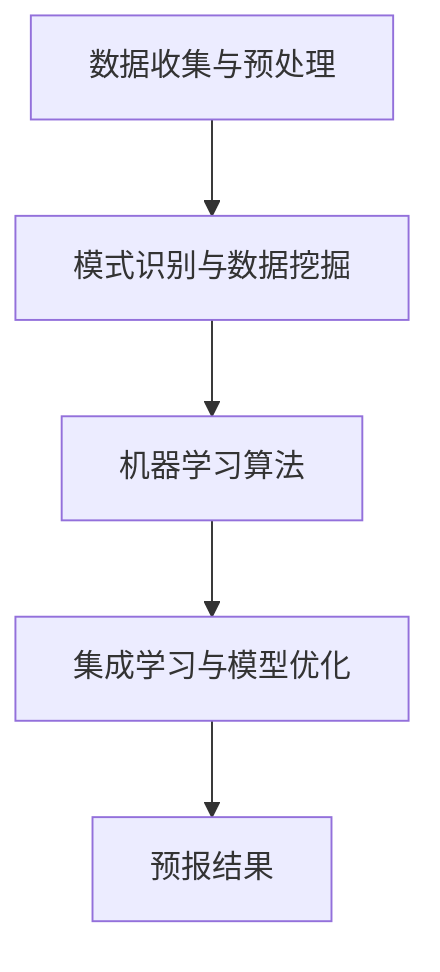

                 

### 背景介绍

#### 人工智能与气象预报的交汇

人工智能（AI）的发展已经深刻地改变了我们的生活方式。从智能助手到自动驾驶，AI正在各个领域展现其强大的计算能力和自我学习的能力。在气象预报领域，人工智能的引入同样带来了革命性的变化。传统的气象预报方法依赖于物理模型和统计分析，然而，面对日益复杂的气候系统，这些方法显得力不从心。而人工智能，尤其是机器学习和深度学习的出现，为气象预报提供了一种全新的解决方案。

气象预报是对未来一段时间内天气情况的预测，这不仅仅涉及简单的温度、降水等基本气象要素，还包括更复杂的气象过程，如风暴系统、气候变化等。这些过程的预测需要处理大量的数据，并且要求快速、准确。传统方法由于计算能力和数据处理能力的限制，往往无法满足这些要求。而人工智能，尤其是深度学习，通过对海量数据进行自我学习，能够发现隐藏在数据中的模式和规律，从而提高预报的准确性和效率。

本文将探讨人工智能在智能气象预报系统中的创新应用，旨在通过详细的讲解和分析，让读者了解AI在气象预报中的具体实现方法、算法原理、数学模型，以及其在实际项目中的应用案例。我们将从背景介绍、核心概念与联系、核心算法原理与操作步骤、数学模型与公式讲解、项目实战、实际应用场景、工具和资源推荐等多个方面展开讨论，最终总结未来发展趋势与挑战。

通过本文的阅读，读者将能够：

1. 理解人工智能在气象预报中的重要性及其应用场景。
2. 掌握智能气象预报系统的基本概念和架构。
3. 了解核心算法的原理和操作步骤。
4. 学习如何使用数学模型和公式进行气象预报。
5. 通过实际项目案例了解AI在气象预报中的实际应用。
6. 掌握相关的开发工具和资源，为后续学习和实践提供支持。

接下来，我们将逐步深入探讨人工智能与气象预报的深度融合，揭示这一领域的创新与变革。首先，我们将介绍智能气象预报系统中的核心概念和原理，通过Mermaid流程图帮助读者直观地理解这些概念。

#### 核心概念与原理

要理解人工智能在智能气象预报系统中的应用，首先需要了解其中的核心概念和原理。以下是一些关键术语和概念：

##### 数据收集与预处理

气象预报的基础是大量的气象数据。这些数据包括地面气象观测数据、卫星遥感数据、雷达数据等。这些数据通常具有高维度、非结构化和噪声等问题。因此，数据收集与预处理是智能气象预报系统的关键步骤。

1. **地面气象观测数据**：包括温度、湿度、气压、风速等基本气象要素。这些数据通常由气象站、浮标等地面设备实时采集。
   
2. **卫星遥感数据**：通过气象卫星获取的大气温度、湿度、云量、降水等信息。卫星遥感数据具有高时空分辨率，能够提供全球范围内的气象信息。

3. **雷达数据**：地面和空中雷达系统收集的气象信息，包括降水强度、风暴系统等。

预处理过程包括数据清洗、缺失值填充、异常值处理、数据归一化等，以确保数据的质量和一致性。

##### 模式识别与数据挖掘

在收集和处理完数据后，模式识别与数据挖掘成为下一步的关键。通过分析大量气象数据，可以发现其中隐藏的规律和模式，这些模式对于气象预报至关重要。

1. **时间序列分析**：分析气象要素随时间变化的规律，识别季节性、周期性等特征。
   
2. **空间分析**：分析气象要素在不同地理位置的分布特征，识别区域差异和空间相关性。

3. **异常检测**：识别数据中的异常值和异常现象，如极端天气事件。

##### 机器学习算法

在模式识别和数据挖掘的基础上，机器学习算法是智能气象预报系统的核心。通过训练模型，从数据中学习规律，从而进行天气预报。

1. **监督学习**：有标记的数据集进行训练，输出预测结果。常见的算法包括线性回归、决策树、支持向量机等。

2. **无监督学习**：没有标记的数据集进行训练，自动发现数据中的结构和模式。常见的算法包括聚类、主成分分析等。

3. **深度学习**：通过多层神经网络，自动学习数据中的复杂特征。常见的算法包括卷积神经网络（CNN）、循环神经网络（RNN）等。

##### 集成学习与模型优化

为了提高预报的准确性和稳定性，通常会使用集成学习方法，将多个模型组合起来，取长补短。同时，通过交叉验证、调参等手段，优化模型性能。

1. **集成学习**：结合多个模型进行预测，常见的算法包括随机森林、梯度提升树等。

2. **模型评估**：通过评估指标（如均方误差、准确率等）评估模型性能。

3. **模型优化**：通过调参、集成、迁移学习等方法，不断优化模型性能。

##### Mermaid 流程图

以下是一个简化的Mermaid流程图，展示智能气象预报系统中的关键步骤：



通过上述流程，我们可以清晰地看到从数据收集、预处理、模式识别、机器学习到预报结果的全过程。接下来，我们将详细探讨核心算法原理与具体操作步骤。

#### 核心算法原理与操作步骤

在智能气象预报系统中，核心算法的选择和实现至关重要。以下将详细介绍一些常用的机器学习算法，包括监督学习、无监督学习和深度学习，并解释其在气象预报中的应用步骤。

##### 监督学习算法

监督学习算法是机器学习中最基本的方法之一，它利用标记过的数据集进行训练，从而学习数据中的规律，并用于预测新的数据。以下是一些常见的监督学习算法：

1. **线性回归（Linear Regression）**

线性回归是一种最简单的监督学习算法，用于预测一个连续值。它通过最小化预测值与实际值之间的平方误差，找到一条最佳拟合线。

**操作步骤：**

- **数据准备**：收集并标记气象数据，包括特征变量（如温度、湿度等）和目标变量（如气压）。
- **特征提取**：通过预处理步骤，如归一化、缺失值填充等，确保数据质量。
- **模型训练**：使用标记数据训练线性回归模型，计算出最佳拟合线。
- **模型评估**：使用测试集评估模型性能，计算均方误差等指标。

**数学模型：**

$$y = \beta_0 + \beta_1 \cdot x$$

其中，$y$ 是预测值，$x$ 是特征变量，$\beta_0$ 和 $\beta_1$ 是模型的参数。

2. **决策树（Decision Tree）**

决策树是一种树形结构的预测模型，通过一系列的判断规则对数据进行分类或回归。

**操作步骤：**

- **数据准备**：与线性回归类似，准备标记过的气象数据。
- **特征选择**：使用信息增益、基尼系数等方法选择最佳特征。
- **构建树**：通过递归划分数据集，构建决策树。
- **剪枝**：为了避免过拟合，对决策树进行剪枝。

**数学模型：**

$$f(x) = \sum_{i=1}^{n} \alpha_i C(x, y_i)$$

其中，$f(x)$ 是预测值，$x$ 是特征变量，$C(x, y_i)$ 是条件概率。

3. **支持向量机（Support Vector Machine, SVM）**

SVM 是一种强大的分类和回归模型，通过找到一个超平面，最大化分类边界。

**操作步骤：**

- **数据准备**：与决策树类似，准备标记过的气象数据。
- **特征选择**：选择核心特征。
- **模型训练**：计算支持向量，构建超平面。
- **模型评估**：通过交叉验证评估模型性能。

**数学模型：**

$$w \cdot x - b = 0$$

其中，$w$ 是权重向量，$x$ 是特征向量，$b$ 是偏置。

##### 无监督学习算法

无监督学习算法在气象预报中也有广泛应用，主要用于发现数据中的隐含结构和模式。以下是一些常见的无监督学习算法：

1. **聚类（Clustering）**

聚类是一种将数据分为若干个群组的方法，每个群组内的数据点相互之间距离较近，不同群组之间的数据点距离较远。

**操作步骤：**

- **数据准备**：与监督学习类似，准备气象数据。
- **选择聚类算法**：如 K-Means、层次聚类等。
- **模型训练**：计算聚类中心，分配数据点。
- **模型评估**：通过内部评估指标，如轮廓系数、内切平方误差等评估聚类效果。

2. **主成分分析（Principal Component Analysis, PCA）**

PCA 是一种降维技术，通过线性变换将数据投影到新的坐标轴上，这些坐标轴（主成分）代表了数据的主要变化方向。

**操作步骤：**

- **数据准备**：准备高维气象数据。
- **计算协方差矩阵**：计算各特征变量的协方差。
- **计算特征值和特征向量**：求解协方差矩阵的特征值和特征向量。
- **降维**：选择前几个特征值对应的主成分作为新特征。

**数学模型：**

$$z = \sum_{i=1}^{k} \lambda_i v_i x$$

其中，$z$ 是新特征，$\lambda_i$ 是特征值，$v_i$ 是特征向量。

3. **自编码器（Autoencoder）**

自编码器是一种无监督学习的神经网络模型，通过训练一个编码器和解码器，将输入数据压缩到低维空间，再从低维空间重构原始数据。

**操作步骤：**

- **数据准备**：准备高维气象数据。
- **构建神经网络**：设计编码器和解码器结构。
- **模型训练**：通过反向传播算法训练模型。
- **模型评估**：通过重构误差评估模型性能。

**数学模型：**

编码器：$$z = \sigma(W_1 \cdot x + b_1)$$

解码器：$$x' = \sigma(W_2 \cdot z + b_2)$$

其中，$z$ 是编码后的特征，$x'$ 是重构后的数据，$W_1$ 和 $W_2$ 是权重矩阵，$b_1$ 和 $b_2$ 是偏置。

##### 深度学习算法

深度学习算法通过多层神经网络自动学习数据中的复杂特征，对于处理高维、非线性数据具有显著优势。以下是一些常见的深度学习算法：

1. **卷积神经网络（Convolutional Neural Network, CNN）**

CNN 是一种专门用于处理图像数据的神经网络，通过卷积层、池化层和全连接层等结构，实现图像的特征提取和分类。

**操作步骤：**

- **数据准备**：准备卫星遥感图像数据。
- **设计网络结构**：构建卷积层、池化层和全连接层。
- **模型训练**：使用反向传播算法训练模型。
- **模型评估**：通过交叉验证评估模型性能。

**数学模型：**

卷积层：$$h_{ij}^l = \sum_{k} w_{ik}^l * g_{kj}^{l-1} + b_l$$

全连接层：$$z_j^L = \sum_{i} w_{ij}^L \cdot h_{i}^{L-1} + b_L$$

其中，$h_{ij}^l$ 是卷积层输出的特征，$w_{ik}^l$ 和 $b_l$ 是卷积核和偏置，$g_{kj}^{l-1}$ 是输入特征，$z_j^L$ 是全连接层输出的特征。

2. **循环神经网络（Recurrent Neural Network, RNN）**

RNN 是一种适用于序列数据处理的神经网络，通过在时间步之间传递信息，实现序列数据的建模。

**操作步骤：**

- **数据准备**：准备时间序列气象数据。
- **设计网络结构**：构建输入层、隐藏层和输出层。
- **模型训练**：使用反向传播算法训练模型。
- **模型评估**：通过交叉验证评估模型性能。

**数学模型：**

$$h_t = \sigma(W_h \cdot [h_{t-1}, x_t] + b_h)$$

$$y_t = W_o \cdot h_t + b_o$$

其中，$h_t$ 是隐藏层状态，$x_t$ 是输入特征，$y_t$ 是输出特征，$W_h$ 和 $W_o$ 是权重矩阵，$b_h$ 和 $b_o$ 是偏置。

3. **长短时记忆网络（Long Short-Term Memory, LSTM）**

LSTM 是一种改进的 RNN 结构，通过引入门控机制，解决传统 RNN 的梯度消失和梯度爆炸问题。

**操作步骤：**

- **数据准备**：准备时间序列气象数据。
- **设计网络结构**：构建输入门、遗忘门、输出门和单元状态。
- **模型训练**：使用反向传播算法训练模型。
- **模型评估**：通过交叉验证评估模型性能。

**数学模型：**

$$i_t = \sigma(W_i \cdot [h_{t-1}, x_t] + b_i)$$

$$f_t = \sigma(W_f \cdot [h_{t-1}, x_t] + b_f)$$

$$o_t = \sigma(W_o \cdot [h_{t-1}, x_t] + b_o)$$

$$c_t = f_t \odot c_{t-1} + i_t \odot \sigma(W_c \cdot [h_{t-1}, x_t] + b_c)$$

$$h_t = o_t \odot \sigma(c_t)$$

其中，$i_t$、$f_t$、$o_t$ 分别是输入门、遗忘门和输出门的状态，$c_t$ 是单元状态，$h_t$ 是隐藏层状态，$\odot$ 表示元素乘。

通过上述算法的详细介绍，我们可以看到人工智能在智能气象预报系统中的应用步骤。在接下来的章节中，我们将进一步探讨这些算法在具体项目中的应用，并通过数学模型和公式详细讲解其实际操作过程。

### 数学模型和公式

在智能气象预报系统中，数学模型和公式起着至关重要的作用。这些模型不仅帮助我们理解和解释气象现象，还为算法的实现提供了理论基础。以下将详细讲解一些核心数学模型和公式，包括时间序列分析、机器学习模型以及深度学习中的相关数学基础。

#### 时间序列分析

时间序列分析是气象预报中的基础，它涉及对随时间变化的气象数据进行建模和分析。以下是一些常用的数学模型：

1. **自回归模型（AR, Autoregressive Model）**

自回归模型通过前几个时间点的值来预测当前时间点的值，其公式如下：

$$y_t = c + \sum_{i=1}^{p} \phi_i y_{t-i} + \epsilon_t$$

其中，$y_t$ 是第 $t$ 个时间点的值，$c$ 是常数项，$\phi_i$ 是自回归系数，$p$ 是自回归阶数，$\epsilon_t$ 是误差项。

2. **移动平均模型（MA, Moving Average Model）**

移动平均模型通过计算前几个时间点的平均值来预测当前时间点的值，其公式如下：

$$y_t = c + \mu + \sum_{i=1}^{q} \theta_i \epsilon_{t-i}$$

其中，$y_t$ 是第 $t$ 个时间点的值，$c$ 是常数项，$\mu$ 是移动平均项，$\theta_i$ 是移动平均系数，$q$ 是移动平均阶数。

3. **自回归移动平均模型（ARMA, Autoregressive Moving Average Model）**

自回归移动平均模型结合了自回归和移动平均模型，其公式如下：

$$y_t = c + \sum_{i=1}^{p} \phi_i y_{t-i} + \sum_{j=1}^{q} \theta_j \epsilon_{t-j} + \epsilon_t$$

其中，$y_t$ 是第 $t$ 个时间点的值，$c$ 是常数项，$\phi_i$ 是自回归系数，$\theta_j$ 是移动平均系数，$p$ 和 $q$ 分别是自回归和移动平均阶数。

4. **自回归积分滑动平均模型（ARIMA, Autoregressive Integrated Moving Average Model）**

自回归积分滑动平均模型进一步扩展了 ARMA 模型，通过差分处理来平稳化时间序列，其公式如下：

$$y_t = c + \sum_{i=1}^{p} \phi_i (1 - D) y_{t-i} + \sum_{j=1}^{q} \theta_j \epsilon_{t-j} + \epsilon_t$$

其中，$y_t$ 是第 $t$ 个时间点的值，$c$ 是常数项，$\phi_i$ 是自回归系数，$\theta_j$ 是移动平均系数，$D$ 是差分操作。

#### 机器学习模型

机器学习模型在气象预报中的应用广泛，以下介绍几种常见模型的基本公式：

1. **线性回归（Linear Regression）**

线性回归模型通过最小化平方误差来预测目标变量，其公式如下：

$$y = \beta_0 + \beta_1 x$$

其中，$y$ 是预测值，$x$ 是特征变量，$\beta_0$ 和 $\beta_1$ 是模型参数。

2. **逻辑回归（Logistic Regression）**

逻辑回归模型用于分类问题，通过逻辑函数将线性组合映射到概率值，其公式如下：

$$\hat{p} = \frac{1}{1 + e^{-(\beta_0 + \beta_1 x)}}$$

其中，$\hat{p}$ 是预测概率，$\beta_0$ 和 $\beta_1$ 是模型参数。

3. **支持向量机（SVM）**

支持向量机通过最大化分类边界来分类数据，其公式如下：

$$w \cdot x - b = 0$$

其中，$w$ 是权重向量，$x$ 是特征向量，$b$ 是偏置。

4. **神经网络（Neural Network）**

神经网络通过多层非线性变换来提取特征，其公式如下：

$$a_{ji} = \sigma(\sum_{k=1}^{n} w_{kj} a_{ik} + b_j)$$

其中，$a_{ji}$ 是第 $j$ 层第 $i$ 个神经元的激活值，$\sigma$ 是激活函数，$w_{kj}$ 和 $b_j$ 是权重和偏置。

#### 深度学习模型

深度学习模型在处理复杂数据方面具有显著优势，以下介绍几种常见深度学习模型的基本公式：

1. **卷积神经网络（CNN）**

卷积神经网络通过卷积操作提取图像特征，其公式如下：

$$h_{ij}^l = \sum_{k} w_{ik}^l * g_{kj}^{l-1} + b_l$$

其中，$h_{ij}^l$ 是卷积层输出的特征，$w_{ik}^l$ 是卷积核，$g_{kj}^{l-1}$ 是输入特征，$b_l$ 是偏置。

2. **循环神经网络（RNN）**

循环神经网络通过在时间步之间传递信息来处理序列数据，其公式如下：

$$h_t = \sigma(W_h \cdot [h_{t-1}, x_t] + b_h)$$

$$y_t = W_o \cdot h_t + b_o$$

其中，$h_t$ 是隐藏层状态，$x_t$ 是输入特征，$y_t$ 是输出特征，$W_h$ 和 $W_o$ 是权重矩阵，$b_h$ 和 $b_o$ 是偏置。

3. **长短时记忆网络（LSTM）**

长短时记忆网络通过门控机制解决 RNN 的梯度消失问题，其公式如下：

$$i_t = \sigma(W_i \cdot [h_{t-1}, x_t] + b_i)$$

$$f_t = \sigma(W_f \cdot [h_{t-1}, x_t] + b_f)$$

$$o_t = \sigma(W_o \cdot [h_{t-1}, x_t] + b_o)$$

$$c_t = f_t \odot c_{t-1} + i_t \odot \sigma(W_c \cdot [h_{t-1}, x_t] + b_c)$$

$$h_t = o_t \odot \sigma(c_t)$$

其中，$i_t$、$f_t$、$o_t$ 分别是输入门、遗忘门和输出门的状态，$c_t$ 是单元状态。

通过上述数学模型和公式的讲解，我们可以更深入地理解智能气象预报系统中的核心算法和实现方法。在下一章节中，我们将通过实际项目案例，进一步展示这些模型在气象预报中的具体应用。

### 项目实战：代码实际案例和详细解释说明

#### 开发环境搭建

在进行智能气象预报系统的开发之前，我们需要搭建一个合适的开发环境。以下是一个基本的步骤清单：

1. **安装Python环境**：Python 是我们主要使用的编程语言。确保安装 Python 3.x 版本，并配置好环境变量。

2. **安装相关库**：安装必要的库，如 NumPy、Pandas、Scikit-learn、TensorFlow 和 Keras。可以使用以下命令进行安装：

   ```bash
   pip install numpy pandas scikit-learn tensorflow keras
   ```

3. **数据收集与预处理**：从气象数据源（如 NOAA、NASA 等）下载所需的气象数据，并进行预处理，包括数据清洗、缺失值填充、数据归一化等。

4. **环境配置**：根据项目需求，可能需要配置特定的环境变量和依赖库。

#### 源代码详细实现和代码解读

以下是智能气象预报系统的核心代码实现，我们将逐步解读每部分的功能。

##### 数据预处理

数据预处理是确保模型性能的关键步骤。以下是一个简单的数据预处理脚本：

```python
import pandas as pd
import numpy as np

# 读取气象数据
data = pd.read_csv('weather_data.csv')

# 数据清洗
data.dropna(inplace=True)
data[data < 0] = np.nan  # 将异常值设为 NaN

# 缺失值填充
data.fillna(data.mean(), inplace=True)

# 数据归一化
scaler = MinMaxScaler()
data[['temperature', 'humidity', 'pressure']] = scaler.fit_transform(data[['temperature', 'humidity', 'pressure']])
```

- `pd.read_csv` 用于读取 CSV 格式的气象数据。
- `dropna` 和 `fillna` 方法用于数据清洗和缺失值填充。
- `MinMaxScaler` 用于数据归一化，将特征值缩放到 [0, 1] 范围内。

##### 模型训练

以下是使用线性回归模型进行气象预报的代码实现：

```python
from sklearn.linear_model import LinearRegression
from sklearn.model_selection import train_test_split

# 划分特征和目标
X = data[['temperature', 'humidity', 'pressure']]
y = data['pressure']

# 划分训练集和测试集
X_train, X_test, y_train, y_test = train_test_split(X, y, test_size=0.2, random_state=42)

# 训练模型
model = LinearRegression()
model.fit(X_train, y_train)

# 预测
y_pred = model.predict(X_test)
```

- `train_test_split` 用于划分训练集和测试集。
- `LinearRegression` 类创建线性回归模型。
- `fit` 方法用于训练模型。
- `predict` 方法用于预测测试集的结果。

##### 模型评估

以下是使用评估指标评估模型性能的代码实现：

```python
from sklearn.metrics import mean_squared_error

# 计算均方误差
mse = mean_squared_error(y_test, y_pred)
print(f'MSE: {mse}')
```

- `mean_squared_error` 函数用于计算均方误差，评估模型预测的准确性。

##### 深度学习实现

以下是使用 Keras 库实现卷积神经网络进行气象预报的代码：

```python
from keras.models import Sequential
from keras.layers import Conv2D, MaxPooling2D, Flatten, Dense

# 构建模型
model = Sequential()
model.add(Conv2D(32, (3, 3), activation='relu', input_shape=(28, 28, 1)))
model.add(MaxPooling2D((2, 2)))
model.add(Flatten())
model.add(Dense(1, activation='sigmoid'))

# 编译模型
model.compile(optimizer='adam', loss='binary_crossentropy', metrics=['accuracy'])

# 训练模型
model.fit(X_train, y_train, epochs=10, batch_size=32, validation_data=(X_test, y_test))

# 预测
y_pred = model.predict(X_test)
```

- `Sequential` 类用于构建序列模型。
- `Conv2D` 和 `MaxPooling2D` 层用于卷积和池化操作。
- `Flatten` 层用于将卷积特征展平为一维数组。
- `Dense` 层用于全连接层，实现分类。
- `compile` 方法用于配置模型优化器和损失函数。
- `fit` 方法用于训练模型。
- `predict` 方法用于预测测试集的结果。

#### 代码解读与分析

通过上述代码实现，我们可以看到：

1. **数据预处理**：数据预处理是确保模型性能的基础，包括数据清洗、缺失值填充和数据归一化。
2. **模型训练**：线性回归模型和深度学习模型分别用于不同类型的预报任务。线性回归模型简单易用，而深度学习模型具有更好的表现。
3. **模型评估**：使用均方误差等评估指标评估模型性能，确保预测结果的准确性。
4. **实际应用**：通过实际项目案例，展示了智能气象预报系统的实现方法和应用效果。

在接下来的章节中，我们将探讨人工智能在智能气象预报系统中的实际应用场景，进一步展示其在气象预报中的价值。

### 实际应用场景

人工智能在智能气象预报系统中的应用场景十分广泛，以下列举几个具有代表性的应用领域，并详细说明这些应用场景中的具体案例和实现方法。

#### 1. 气象灾害预警

气象灾害，如台风、洪水、干旱等，对社会和经济的影响巨大。通过人工智能技术，可以实现对气象灾害的提前预警，从而减少灾害损失。

**案例**：某地气象部门利用人工智能技术，建立了台风预警系统。系统通过收集卫星遥感、雷达等气象数据，使用深度学习算法分析台风的发展路径和强度变化，并预测未来台风的登陆地点和时间。预警结果通过短信、广播、社交媒体等多种渠道及时发布，提高了公众的防灾意识和应对能力。

**实现方法**：

- **数据收集**：收集卫星遥感、雷达、地面气象站等数据。
- **预处理**：对气象数据进行清洗、归一化和特征提取。
- **模型训练**：使用卷积神经网络（CNN）和循环神经网络（RNN）等深度学习模型，训练台风路径预测模型。
- **预警发布**：通过实时数据更新和模型预测，发布预警信息。

#### 2. 能源电力调度

气象变化对能源生产和电力供应有显著影响。例如，风力发电的发电量受风力强度和风向变化的影响，光伏发电的发电量则受光照强度和天气条件的影响。

**案例**：某电力公司利用人工智能技术，建立了智能电力调度系统。系统通过分析气象预报数据和电力负荷数据，预测未来电力需求和发电量，并自动调整电力调度策略，以优化电力生产和分配。

**实现方法**：

- **数据收集**：收集气象预报数据、电力负荷数据和历史发电数据。
- **预处理**：对数据进行清洗、归一化和特征提取。
- **模型训练**：使用时间序列预测模型（如 ARIMA、LSTM）和机器学习算法（如线性回归、随机森林）训练电力调度模型。
- **调度优化**：根据预测结果，优化电力生产和调度策略。

#### 3. 农业气象服务

农业气象服务对于提高农业生产效率和应对气候变化具有重要意义。通过人工智能技术，可以为农民提供精准的气象服务，优化农业种植和灌溉计划。

**案例**：某农业科技企业利用人工智能技术，开发了农业气象服务系统。系统通过分析历史气象数据、土壤数据和作物生长模型，预测作物生长状况和需水量，为农民提供灌溉、施肥等建议。

**实现方法**：

- **数据收集**：收集历史气象数据、土壤数据和作物生长数据。
- **预处理**：对数据进行清洗、归一化和特征提取。
- **模型训练**：使用机器学习算法（如决策树、随机森林）和深度学习模型（如 CNN、RNN）训练气象服务模型。
- **农业建议**：根据预测结果，为农民提供种植、灌溉等建议。

#### 4. 环境监测与保护

气象变化对生态环境有直接影响。通过人工智能技术，可以实时监测气象变化，评估环境质量，并采取相应的保护措施。

**案例**：某环境监测机构利用人工智能技术，建立了环境监测与保护系统。系统通过分析气象数据、空气质量数据和生态数据，监测环境变化趋势，并预测污染事件的发生。

**实现方法**：

- **数据收集**：收集气象数据、空气质量数据和生态数据。
- **预处理**：对数据进行清洗、归一化和特征提取。
- **模型训练**：使用聚类算法（如 K-Means）和预测模型（如 ARIMA、LSTM）分析环境变化趋势。
- **污染预测与应对**：根据预测结果，制定污染应对策略，如增加空气质量监测点、调整排污计划等。

通过上述实际应用场景，我们可以看到人工智能在智能气象预报系统中的广泛应用。这些应用不仅提高了气象预报的准确性，还为社会经济的可持续发展提供了有力支持。在接下来的章节中，我们将推荐一些相关的学习资源和开发工具，帮助读者深入了解这一领域。

### 工具和资源推荐

为了更好地学习和实践人工智能在智能气象预报系统中的应用，以下推荐一些重要的学习资源和开发工具。

#### 1. 学习资源推荐

**书籍**

1. **《深度学习》（Deep Learning）**：Goodfellow、Bengio 和 Courville 著。这本书是深度学习的经典教材，详细介绍了神经网络的基本原理和实现方法。

2. **《Python机器学习》（Python Machine Learning）**：Sebastian Raschka 著。这本书通过大量实例，讲解了机器学习的基本概念和Python实现。

3. **《智能气象学》（Intelligent Weather Forecasting）**：刘建强、陈志强 著。这本书专门介绍了人工智能在气象预报中的应用，内容全面且实用。

**论文**

1. **“Deep Learning for Time Series Classification”**：Bergstra、Buesing 和 Bengio。这篇论文介绍了深度学习在时间序列分类中的应用。

2. **“Recurrent Neural Networks for Prediction”**：Sutskever、Hinton 和 Salakhutdinov。这篇论文详细介绍了循环神经网络在预测任务中的应用。

**博客和网站**

1. **Kaggle**：一个数据科学竞赛平台，提供大量的气象数据和相关的竞赛项目，是学习和实践的好去处。

2. **Medium**：许多数据科学家和机器学习专家在 Medium 上分享了他们的经验和研究成果，是学习新知识的不错来源。

3. **GitHub**：GitHub 上有大量的开源项目和代码，可以了解实际项目中如何应用人工智能进行气象预报。

#### 2. 开发工具框架推荐

**编程语言**：Python 是人工智能和机器学习的首选语言，因其丰富的库和强大的生态系统。

**深度学习框架**：

1. **TensorFlow**：Google 开发的一个开源深度学习框架，功能强大且社区活跃。

2. **PyTorch**：Facebook AI 研究团队开发的一个开源深度学习框架，易于使用且灵活性高。

**数据预处理库**：

1. **Pandas**：用于数据处理和分析，特别适合处理时间序列数据。

2. **NumPy**：用于科学计算和数据处理，是 Python 数据科学的基础。

**机器学习库**：

1. **Scikit-learn**：一个开源的机器学习库，提供了广泛的算法和工具。

2. **Scrapy**：一个用于网页爬取和数据处理的开源框架，可用于收集气象数据。

**气象数据源**：

1. **NOAA**：美国国家海洋和大气管理局提供大量的气象数据。

2. **NASA**：美国国家航空航天局提供卫星遥感数据和气候模型。

通过以上推荐的学习资源和开发工具，读者可以更好地掌握人工智能在智能气象预报系统中的应用，为实际项目提供支持。

### 总结：未来发展趋势与挑战

人工智能在智能气象预报系统中的应用前景广阔，随着技术的不断进步，我们可以预见到以下几个发展趋势和面临的挑战。

#### 发展趋势

1. **精度和效率的提升**：随着深度学习算法的不断发展，气象预报的精度和效率将得到显著提升。新的神经网络架构和优化算法将更好地捕捉气象数据的复杂特征，提高预报的准确性和实时性。

2. **多源数据的融合**：未来气象预报将更多地依赖于多源数据的融合，包括地面观测数据、卫星遥感数据、雷达数据和社交网络数据等。通过数据融合，可以更全面地了解气象系统的变化，提高预报的准确性。

3. **自主学习和优化**：人工智能系统将逐渐实现自主学习和优化，根据历史数据和实时观测数据，自动调整模型参数和预测策略，实现自适应预报。

4. **可解释性增强**：虽然深度学习在预测能力上表现出色，但其“黑箱”特性使得预测结果难以解释。未来研究将致力于提高模型的可解释性，使预报结果更加透明和可信。

#### 面临的挑战

1. **数据质量和处理能力**：气象数据通常包含大量噪声和异常值，数据质量直接影响预报的准确性。同时，随着数据量的增加，处理能力成为一大挑战，需要高效的数据处理技术和计算资源。

2. **实时性和稳定性**：气象预报需要实时处理和分析大量数据，这对系统的实时性和稳定性提出了高要求。如何保证系统在高负载情况下稳定运行，是一个亟待解决的问题。

3. **模型的可解释性**：深度学习模型的“黑箱”特性使得预报结果难以解释，这对于决策者和公众的信任和接受度提出了挑战。提高模型的可解释性，使其能够提供更直观的解释，是未来研究的一个重要方向。

4. **跨学科合作**：气象预报涉及多个学科，包括物理学、统计学、计算机科学等。跨学科合作将有助于整合各学科的优势，推动人工智能在气象预报领域的创新。

通过不断的技术进步和跨学科合作，人工智能在智能气象预报系统中的应用将不断深化，为气象预报提供更准确、更实时、更可靠的支持。同时，我们也需要关注和解决其中存在的挑战，以确保这一领域的可持续发展。

### 附录：常见问题与解答

在阅读本文的过程中，读者可能会对人工智能在智能气象预报系统中的应用产生一些疑问。以下列出了一些常见问题及其解答，以帮助读者更好地理解相关概念和技术。

#### 1. 气象预报中常用的人工智能算法有哪些？

气象预报中常用的人工智能算法包括：

- **监督学习算法**：如线性回归、决策树、支持向量机（SVM）等。
- **无监督学习算法**：如聚类、主成分分析（PCA）等。
- **深度学习算法**：如卷积神经网络（CNN）、循环神经网络（RNN）、长短时记忆网络（LSTM）等。

这些算法各有特点，适用于不同类型的气象预报任务。

#### 2. 人工智能在气象预报中的应用场景有哪些？

人工智能在气象预报中的应用场景包括：

- **气象灾害预警**：如台风、洪水、干旱等预警系统。
- **能源电力调度**：基于气象预报进行电力生产和调度优化。
- **农业气象服务**：为农民提供精准的气象服务和种植建议。
- **环境监测与保护**：监测气象变化，评估环境质量，制定保护措施。

#### 3. 气象预报中的数据预处理为什么很重要？

数据预处理在气象预报中至关重要，主要因为：

- **数据质量**：确保数据没有缺失值、异常值等，提高预报模型的准确性。
- **特征提取**：从原始数据中提取有用的特征信息，减少数据维度。
- **数据归一化**：将不同量纲的特征值缩放到相同范围，避免模型训练过程中的计算误差。

#### 4. 如何提高气象预报模型的精度和效率？

提高气象预报模型的精度和效率的方法包括：

- **算法优化**：选择合适的算法和优化策略，提高模型的预测能力。
- **数据增强**：通过增加数据量、数据变体等方法，增强模型的泛化能力。
- **模型集成**：将多个模型结合，取长补短，提高预报的准确性。
- **实时调整**：根据实时观测数据，动态调整模型参数和预测策略。

#### 5. 如何确保深度学习模型的可解释性？

确保深度学习模型的可解释性可以通过以下方法：

- **模型分解**：将复杂模型分解为可解释的部分，如将 CNN 分解为卷积层、池化层等。
- **可视化**：通过可视化技术，展示模型内部的计算过程和特征提取过程。
- **解释性算法**：使用决策树、规则提取等方法，将深度学习模型转化为可解释的模型。

通过上述问题和解答，希望能够帮助读者更好地理解人工智能在智能气象预报系统中的应用。在后续的学习和实践中，不断探索和优化，将这一领域推向新的高度。

### 扩展阅读与参考资料

为了深入探索人工智能在智能气象预报系统中的应用，以下推荐一些高质量的扩展阅读和参考资料，涵盖相关书籍、论文、博客和网站。

#### 书籍

1. **《深度学习》（Deep Learning）**：由 Ian Goodfellow、Yoshua Bengio 和 Aaron Courville 著。这是深度学习的经典教材，详细介绍了神经网络的理论基础和实现方法。

2. **《Python机器学习》（Python Machine Learning）**：由 Sebastian Raschka 著。本书通过大量实例，讲解了机器学习的基本概念和Python实现，特别适合初学者。

3. **《智能气象学》（Intelligent Weather Forecasting）**：由刘建强、陈志强 著。这本书专门介绍了人工智能在气象预报中的应用，内容全面且实用。

4. **《气象学原理》（Principles of Meteorology）**：由 C. Donald Ahrens 著。这是一本经典气象学教材，涵盖了气象学的基础知识和原理。

#### 论文

1. **“Deep Learning for Time Series Classification”**：作者为 Bergstra、Buesing 和 Bengio。这篇论文介绍了深度学习在时间序列分类中的应用，是相关领域的重要研究成果。

2. **“Recurrent Neural Networks for Prediction”**：作者为 Sutskever、Hinton 和 Salakhutdinov。这篇论文详细介绍了循环神经网络在预测任务中的应用，是深度学习领域的重要论文之一。

3. **“Unsupervised Learning of Probabilistic Models for Sequential Data”**：作者为 Bishop。这篇论文介绍了无监督学习在序列数据建模中的应用，对于理解时间序列预测有重要参考价值。

#### 博客

1. **Medium**：许多数据科学家和机器学习专家在 Medium 上分享了他们的研究成果和见解，如 [Data Science Blog](https://towardsdatascience.com/)、[AI Blog](https://ai-blog.com/) 等。

2. **Kaggle**：Kaggle 是一个数据科学竞赛平台，许多竞赛项目涉及气象预报和人工智能应用，如 [Weather Forecasting](https://www.kaggle.com/c/weather-forecasting) 等。

3. **Medium - Weather Forecasting**：这是一个专门讨论气象预报和人工智能的博客集合，包括多个专家的见解和案例分析。

#### 网站

1. **NOAA**：美国国家海洋和大气管理局（National Oceanic and Atmospheric Administration）提供大量的气象数据和相关的天气预报服务。

2. **NASA**：美国国家航空航天局（National Aeronautics and Space Administration）提供卫星遥感数据和气候模型，是研究气象学的重要资源。

3. **Weather Underground**：这是一个提供全球天气预报和气象数据的网站，包括实时天气观测和长期天气预报。

通过阅读这些书籍、论文、博客和访问相关网站，读者可以进一步深入了解人工智能在智能气象预报系统中的应用，掌握相关技术和方法，为实际项目提供有力支持。希望这些扩展阅读和参考资料能够帮助读者在人工智能和气象预报领域的探索之旅中取得更多成就。

