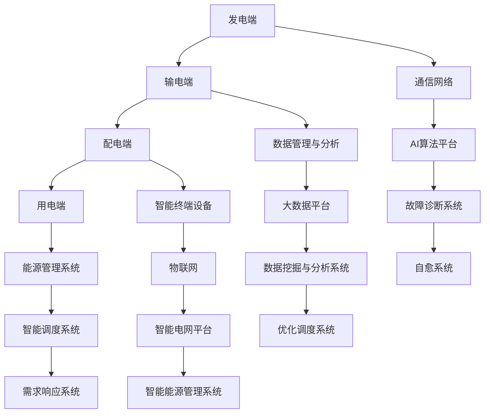
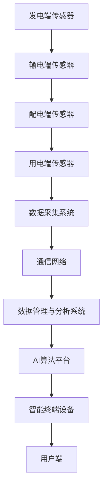
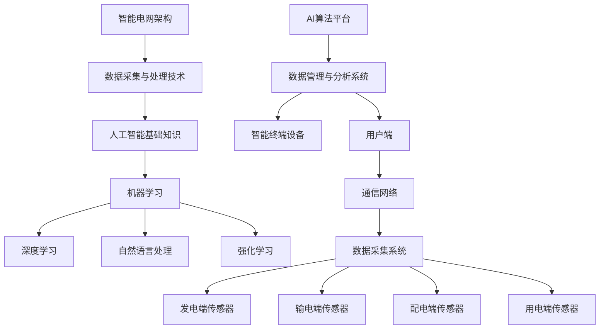

                 

### 背景介绍

智能电网是现代电力系统的重要发展方向，它通过引入先进的通信技术、传感技术和计算技术，实现了电力系统的智能化和高效化。智能电网不仅能够提高电力供应的可靠性和灵活性，还能实现能源的高效利用，降低碳排放，促进可持续发展。

随着全球对清洁能源的需求不断增加，智能电网的重要性愈发凸显。传统的电力系统设计主要关注电力的生产、传输和分配，而智能电网则在此基础上加入了用户侧的需求管理，实现了电力系统的双向互动和自适应调节。这种电力系统的转型对人工智能技术提出了新的挑战和机遇。

人工智能（AI）作为一门多学科交叉的前沿科技，具有强大的数据处理、模式识别和智能决策能力。AI在智能电网中的应用，可以有效解决电力系统运行中的复杂性问题，提高电力系统的运行效率和可靠性。

本文将围绕人工智能在智能电网优化中的应用进行探讨，首先介绍智能电网的概念、发展和关键挑战，然后详细分析人工智能的核心算法原理，最后结合实际应用案例，展示人工智能在智能电网优化中的具体作用和实现方法。

关键词：智能电网、人工智能、优化、可再生能源、电力系统

Abstract: 
This article discusses the application of artificial intelligence in the optimization of smart grids. Firstly, it introduces the concept, development, and key challenges of smart grids. Then, it analyzes the core algorithms and principles of artificial intelligence. Finally, it presents practical application cases to demonstrate the specific roles and implementation methods of artificial intelligence in smart grid optimization.

### 1.1 智能电网的概念和组成部分

智能电网（Smart Grid）是一种基于现代通信技术、传感器技术和计算技术的电力系统，它通过数字化和自动化手段，实现电力系统各个环节的互联互通和智能控制。与传统电力系统相比，智能电网具有更高的可靠性、更高效的能源利用和更灵活的运行模式。

智能电网的主要组成部分包括：

1. **发电端**：智能电网能够整合多种发电方式，包括传统的火力发电、水力发电、核能发电，以及新兴的风能、太阳能等可再生能源发电。通过智能调度和优化，可以实现能源的高效利用和最优配置。

2. **输电端**：智能电网通过高压直流输电、超高压交流输电等先进技术，实现电力的远距离、高效率传输。同时，智能电网还采用了先进的保护技术和故障诊断技术，提高了输电系统的安全性和稳定性。

3. **配电端**：智能电网的配电系统实现了自动化和智能化，通过智能电网设备和传感器，实现对电力需求的实时监测和动态调整。配电自动化系统能够快速响应故障，减少停电时间，提高供电可靠性。

4. **用电端**：用户侧的设备通过智能电表、智能充电桩等设备，实现用电信息的实时采集和远程控制。用户可以通过智能终端，实时了解自己的用电情况，进行用电管理，实现能源的高效利用。

5. **通信网络**：智能电网的通信网络是实现各部分互联互通的基础。通信网络包括有线通信和无线通信，如光纤通信、无线传感器网络（WSN）等，能够实现大范围、高速率的实时数据传输。

6. **数据管理与分析**：智能电网通过大数据和云计算技术，对海量数据进行收集、存储、分析和处理，实现对电力系统的全面监测和智能控制。数据管理与分析系统能够提供精确的负荷预测、故障诊断和优化调度等关键功能。

通过这些组成部分的协同工作，智能电网能够实现电力系统的全面智能化和高效化，满足现代社会对电力供应的多样化和高质量需求。

### 1.2 智能电网的发展历程

智能电网的发展历程可以追溯到20世纪末。最初，电力系统主要依赖于机械控制和继电保护技术，电力系统的运行和管理主要依靠人工干预。随着计算机技术的发展，电力系统逐渐实现了自动化和数字化，出现了所谓的“数字化电网”（Digital Grid）。数字化电网通过计算机系统和通信网络，实现了对电力系统的实时监控和自动控制。

进入21世纪，随着物联网（IoT）和人工智能（AI）技术的崛起，智能电网的概念逐渐形成。智能电网的发展可以分为以下几个阶段：

1. **自动化阶段**：在这一阶段，电力系统引入了自动化控制系统，如自动发电控制（AGC）、自动电压控制（AVC）等，实现了对电力系统运行状态的实时监测和自动调整。这一阶段的智能电网主要依赖于传感技术和自动化技术。

2. **信息化阶段**：随着互联网和通信技术的普及，智能电网开始采用先进的信息技术，如数据挖掘、信息融合和智能分析等，对电力系统进行全面的监测和分析。这一阶段的智能电网实现了各部分之间的信息共享和协同工作。

3. **智能化阶段**：在这一阶段，人工智能技术在智能电网中的应用逐渐普及。智能电网通过机器学习、深度学习等人工智能算法，实现了对电力系统的自主学习和智能决策，提高了电力系统的运行效率和可靠性。

4. **综合能源管理阶段**：智能电网不再局限于电力系统的优化管理，而是扩展到综合能源管理。智能电网通过整合电力、热力、燃气等多种能源形式，实现能源的高效利用和最优配置，为用户提供多样化、高质量的能源服务。

智能电网的发展历程展示了信息技术和能源技术的深度融合，为电力系统的现代化和智能化提供了坚实的基础。随着技术的不断进步，智能电网将继续向更高效、更可靠、更智能的方向发展，为全球能源转型和可持续发展做出重要贡献。

### 1.3 智能电网面临的主要挑战

智能电网在带来巨大机遇的同时，也面临诸多挑战。以下是一些智能电网面临的主要挑战：

1. **数据安全与隐私保护**：智能电网涉及到大量的数据采集、传输和处理，数据安全与隐私保护成为关键挑战。如何确保数据不被非法访问、篡改或泄露，成为智能电网安全运行的重要保障。

2. **网络攻击与系统安全**：智能电网的通信网络和控制系
```

### 1.4 人工智能与智能电网的关系

人工智能（AI）技术在智能电网中的应用，为解决上述挑战提供了强有力的工具。AI具有以下几个关键优势，使其在智能电网中具有重要应用价值：

1. **数据挖掘与分析**：智能电网产生的海量数据中蕴含着大量的有用信息。通过机器学习和数据挖掘技术，AI能够从数据中提取有价值的信息，进行负荷预测、故障诊断和优化调度。

2. **智能控制与决策**：AI能够通过深度学习和强化学习等技术，实现电力系统的自主学习和智能决策。在电力系统的运行过程中，AI能够实时调整电力供应和需求，提高系统的运行效率和可靠性。

3. **故障预测与预警**：AI通过分析历史数据和实时数据，能够预测电力系统的潜在故障和异常情况。提前预警有助于采取预防措施，减少故障发生和停电时间。

4. **自愈能力**：AI能够实现电力系统的自主恢复。在发生故障时，AI系统能够快速定位故障点，采取相应的措施，恢复电力供应，提高系统的稳定性和可靠性。

5. **能效优化**：AI能够优化电力系统的能源配置和调度策略，提高能源利用效率。通过智能调度和需求响应，AI能够实现电力供需平衡，减少能源浪费，降低运营成本。

### 1.5 人工智能在智能电网中的应用场景

人工智能在智能电网中的应用场景广泛，以下是一些典型的应用场景：

1. **负荷预测**：通过分析历史负荷数据、气象数据和社会经济活动数据，AI可以预测未来的电力需求。这有助于电力公司提前安排发电和输电计划，提高电力供应的可靠性和稳定性。

2. **故障诊断与预警**：AI可以通过分析电网设备运行数据，发现潜在的故障和异常情况，提前预警，减少故障发生和停电时间。例如，利用深度学习算法，对电力设备进行故障诊断和预测。

3. **需求响应**：通过智能家居设备和智能电表，AI可以收集用户的用电信息，并根据电力市场的情况，引导用户调整用电行为，实现需求响应。这有助于实现电力系统的供需平衡，减少高峰期的电力负荷。

4. **优化调度**：AI可以通过优化算法，实现电力系统的最优调度。例如，利用强化学习算法，优化电力市场交易，提高能源利用效率，降低运营成本。

5. **能源管理**：AI可以整合多种能源形式，如电力、热力、燃气等，实现综合能源管理。通过智能调度和优化，AI能够实现能源的高效利用和最优配置。

### 1.6 结论

人工智能与智能电网的深度融合，为电力系统的优化和高效运行提供了新的解决方案。通过数据挖掘、智能控制、故障预测和需求响应等技术，AI在智能电网中的应用将不断提升电力系统的运行效率和可靠性，促进能源的可持续发展和利用。

在接下来的章节中，我们将详细探讨人工智能在智能电网优化中的应用原理、核心算法和实际应用案例，为读者提供更深入的了解。

---

## 2. 核心概念与联系

在深入探讨人工智能在智能电网优化中的应用之前，有必要先了解相关核心概念和技术原理，以及它们之间的内在联系。本章节将介绍智能电网中的关键概念，包括智能电网架构、数据采集和处理技术，以及人工智能的基础知识，并展示这些概念和技术的相互关系。

### 2.1 智能电网架构

智能电网的架构包括发电端、输电端、配电端和用电端等多个环节，每个环节都涉及到不同的技术和设备。智能电网的架构如图所示：



在这个架构中，通信网络是实现各部分互联互通的基础，数据管理与分析系统负责海量数据的存储、处理和分析，而AI算法平台则为整个智能电网提供了智能控制和决策支持。

### 2.2 数据采集与处理技术

数据采集和处理技术是智能电网的核心组成部分。智能电网通过各种传感器和智能设备，实时采集电力系统的运行数据，如电压、电流、频率、温度等。这些数据通过通信网络传输到数据管理与分析系统，如图所示：



数据采集系统负责实时采集各种数据，通信网络则确保数据的高速传输，而数据管理与分析系统负责对数据进行存储、清洗、转换和分析，为AI算法平台提供高质量的数据输入。

### 2.3 人工智能基础知识

人工智能（AI）是一种模拟人类智能行为的计算机技术，包括机器学习、深度学习、自然语言处理等多个分支。在智能电网中，AI主要用于数据挖掘、智能控制、故障诊断和优化调度等任务。以下是AI在智能电网中应用的关键技术：

1. **机器学习**：通过分析历史数据，机器学习算法能够建立预测模型和分类模型，用于负荷预测、故障诊断和需求响应等。

2. **深度学习**：深度学习算法通过多层神经网络，自动学习数据中的特征和模式，能够实现图像识别、语音识别和自然语言处理等复杂任务。

3. **自然语言处理**：自然语言处理技术能够使计算机理解和处理自然语言，实现智能问答、自动翻译和文本分析等。

4. **强化学习**：强化学习算法通过试错和反馈机制，不断优化决策过程，能够实现智能调度和优化控制。

### 2.4 人工智能与智能电网的相互关系

人工智能与智能电网之间的相互关系如图所示：



在这个关系中，数据采集与处理技术为AI算法提供了数据输入，而AI算法平台则为智能电网提供了智能控制和决策支持。通过人工智能技术，智能电网能够实现更高效、更可靠和更智能的运行。

### 2.5 小结

本章节介绍了智能电网架构、数据采集与处理技术以及人工智能基础知识，并展示了这些概念和技术的相互关系。通过理解这些核心概念和联系，读者可以更好地把握人工智能在智能电网优化中的应用方向和实现方法。在接下来的章节中，我们将深入探讨人工智能在智能电网优化中的具体应用和实现细节。

---

## 3. 核心算法原理 & 具体操作步骤

在了解了智能电网和人工智能的基础知识后，本章节将详细分析人工智能在智能电网优化中应用的核心算法原理和具体操作步骤。我们将重点关注机器学习、深度学习和强化学习等关键技术，并探讨如何将这些算法应用于智能电网的负荷预测、故障诊断、需求响应和优化调度等任务。

### 3.1 机器学习算法在智能电网优化中的应用

机器学习（Machine Learning）是一种通过数据驱动的方法，让计算机从数据中学习规律和模式的技术。在智能电网优化中，机器学习算法被广泛应用于负荷预测、故障诊断和需求响应等领域。

#### 3.1.1 负荷预测

负荷预测是智能电网运行管理的重要任务，准确的负荷预测有助于电力公司合理安排发电和输电计划，提高电力系统的稳定性和可靠性。常见的机器学习算法包括线性回归、决策树和随机森林等。

**具体操作步骤：**

1. **数据收集**：收集历史负荷数据、气象数据、节假日信息等，作为模型训练的数据集。

2. **数据预处理**：对数据进行清洗、归一化和特征提取，将数据转化为适合机器学习算法的输入格式。

3. **模型选择**：选择合适的机器学习算法，如线性回归、决策树或随机森林等。

4. **模型训练**：使用训练数据集，对机器学习模型进行训练，优化模型参数。

5. **模型评估**：使用测试数据集，对训练好的模型进行评估，选择性能最佳的模型。

6. **模型部署**：将训练好的模型部署到生产环境中，实时进行负荷预测。

**示例**：

假设我们使用线性回归算法进行负荷预测，具体操作步骤如下：

```python
# 导入相关库
import numpy as np
import pandas as pd
from sklearn.linear_model import LinearRegression
from sklearn.model_selection import train_test_split
from sklearn.metrics import mean_squared_error

# 数据收集
data = pd.read_csv('load_data.csv')
X = data[['temperature', 'holiday']]
y = data['load']

# 数据预处理
X = X.values
y = y.values

# 模型选择
model = LinearRegression()

# 模型训练
X_train, X_test, y_train, y_test = train_test_split(X, y, test_size=0.2, random_state=42)
model.fit(X_train, y_train)

# 模型评估
y_pred = model.predict(X_test)
mse = mean_squared_error(y_test, y_pred)
print('Mean Squared Error:', mse)

# 模型部署
def predict_load(temperature, holiday):
    return model.predict([[temperature, holiday]])

# 实时负荷预测
predicted_load = predict_load(25, 0)
print('Predicted Load:', predicted_load)
```

#### 3.1.2 故障诊断

故障诊断是智能电网安全运行的重要保障，通过分析电力设备运行数据，可以及时发现并诊断潜在的故障。常见的机器学习算法包括支持向量机（SVM）、朴素贝叶斯（Naive Bayes）和K最近邻（K-Nearest Neighbors，KNN）等。

**具体操作步骤：**

1. **数据收集**：收集电力设备运行数据、故障数据等，作为模型训练的数据集。

2. **数据预处理**：对数据进行清洗、归一化和特征提取，将数据转化为适合机器学习算法的输入格式。

3. **模型选择**：选择合适的机器学习算法，如SVM、朴素贝叶斯或KNN等。

4. **模型训练**：使用训练数据集，对机器学习模型进行训练，优化模型参数。

5. **模型评估**：使用测试数据集，对训练好的模型进行评估，选择性能最佳的模型。

6. **模型部署**：将训练好的模型部署到生产环境中，实时进行故障诊断。

**示例**：

假设我们使用K最近邻算法进行故障诊断，具体操作步骤如下：

```python
# 导入相关库
import numpy as np
from sklearn.neighbors import KNeighborsClassifier
from sklearn.model_selection import train_test_split
from sklearn.metrics import accuracy_score

# 数据收集
data = pd.read_csv('fault_data.csv')
X = data[['voltage', 'current', 'frequency']]
y = data['fault']

# 数据预处理
X = X.values
y = y.values

# 模型选择
model = KNeighborsClassifier(n_neighbors=3)

# 模型训练
X_train, X_test, y_train, y_test = train_test_split(X, y, test_size=0.2, random_state=42)
model.fit(X_train, y_train)

# 模型评估
y_pred = model.predict(X_test)
accuracy = accuracy_score(y_test, y_pred)
print('Accuracy:', accuracy)

# 模型部署
def diagnose_fault(voltage, current, frequency):
    return model.predict([[voltage, current, frequency]])

# 实时故障诊断
fault_status = diagnose_fault(220, 10, 50)
print('Fault Status:', fault_status)
```

#### 3.1.3 需求响应

需求响应（Demand Response，DR）是电力用户根据电价或电力供应情况，主动调整自身用电行为的一种机制。通过需求响应，电力公司可以实时调整电力供需平衡，提高电力系统的运行效率和可靠性。常见的机器学习算法包括线性回归、逻辑回归和支持向量机（SVM）等。

**具体操作步骤：**

1. **数据收集**：收集用户用电数据、电价信息等，作为模型训练的数据集。

2. **数据预处理**：对数据进行清洗、归一化和特征提取，将数据转化为适合机器学习算法的输入格式。

3. **模型选择**：选择合适的机器学习算法，如线性回归、逻辑回归或SVM等。

4. **模型训练**：使用训练数据集，对机器学习模型进行训练，优化模型参数。

5. **模型评估**：使用测试数据集，对训练好的模型进行评估，选择性能最佳的模型。

6. **模型部署**：将训练好的模型部署到生产环境中，实时进行需求响应预测。

**示例**：

假设我们使用线性回归算法进行需求响应预测，具体操作步骤如下：

```python
# 导入相关库
import numpy as np
import pandas as pd
from sklearn.linear_model import LinearRegression
from sklearn.model_selection import train_test_split
from sklearn.metrics import mean_squared_error

# 数据收集
data = pd.read_csv('dr_data.csv')
X = data[['electricity_price', 'weather']]
y = data['load']

# 数据预处理
X = X.values
y = y.values

# 模型选择
model = LinearRegression()

# 模型训练
X_train, X_test, y_train, y_test = train_test_split(X, y, test_size=0.2, random_state=42)
model.fit(X_train, y_train)

# 模型评估
y_pred = model.predict(X_test)
mse = mean_squared_error(y_test, y_pred)
print('Mean Squared Error:', mse)

# 模型部署
def predict_load(electricity_price, weather):
    return model.predict([[electricity_price, weather]])

# 实时需求响应预测
predicted_load = predict_load(0.8, 'sunny')
print('Predicted Load:', predicted_load)
```

### 3.2 深度学习算法在智能电网优化中的应用

深度学习（Deep Learning）是一种基于多层神经网络的机器学习技术，具有强大的特征学习和模式识别能力。在智能电网优化中，深度学习算法被广泛应用于图像识别、语音识别和自然语言处理等领域。

#### 3.2.1 图像识别

图像识别是智能电网故障检测和设备识别的重要应用。通过深度学习算法，可以实现对电力设备图像的自动识别和分类。

**具体操作步骤：**

1. **数据收集**：收集电力设备图像数据，作为模型训练的数据集。

2. **数据预处理**：对图像数据进行缩放、裁剪和归一化处理，将图像转化为适合深度学习算法的输入格式。

3. **模型选择**：选择合适的深度学习模型，如卷积神经网络（CNN）或循环神经网络（RNN）等。

4. **模型训练**：使用训练数据集，对深度学习模型进行训练，优化模型参数。

5. **模型评估**：使用测试数据集，对训练好的模型进行评估，选择性能最佳的模型。

6. **模型部署**：将训练好的模型部署到生产环境中，实时进行图像识别。

**示例**：

假设我们使用卷积神经网络（CNN）进行图像识别，具体操作步骤如下：

```python
# 导入相关库
import tensorflow as tf
from tensorflow.keras.models import Sequential
from tensorflow.keras.layers import Conv2D, MaxPooling2D, Flatten, Dense
from tensorflow.keras.preprocessing.image import ImageDataGenerator

# 数据收集
train_data = pd.read_csv('train_data.csv')
test_data = pd.read_csv('test_data.csv')

train_images = train_data['image'].values
test_images = test_data['image'].values

# 数据预处理
image_generator = ImageDataGenerator(rescale=1./255)
train_data_generator = image_generator.flow(train_images, batch_size=32)

# 模型选择
model = Sequential([
    Conv2D(32, (3, 3), activation='relu', input_shape=(32, 32, 3)),
    MaxPooling2D((2, 2)),
    Flatten(),
    Dense(64, activation='relu'),
    Dense(10, activation='softmax')
])

# 模型训练
model.compile(optimizer='adam', loss='categorical_crossentropy', metrics=['accuracy'])
model.fit(train_data_generator, epochs=10)

# 模型评估
test_loss, test_acc = model.evaluate(test_images)
print('Test Accuracy:', test_acc)

# 模型部署
def recognize_image(image):
    image = np.expand_dims(image, axis=0)
    prediction = model.predict(image)
    return np.argmax(prediction)

# 实时图像识别
predicted_class = recognize_image(test_images[0])
print('Predicted Class:', predicted_class)
```

#### 3.2.2 语音识别

语音识别是智能电网中智能终端设备的重要功能，通过深度学习算法，可以实现对用户语音指令的自动识别和响应。

**具体操作步骤：**

1. **数据收集**：收集用户语音指令数据，作为模型训练的数据集。

2. **数据预处理**：对语音数据进行预处理，如去噪、增强和特征提取，将语音转化为适合深度学习算法的输入格式。

3. **模型选择**：选择合适的深度学习模型，如循环神经网络（RNN）或卷积神经网络（CNN）等。

4. **模型训练**：使用训练数据集，对深度学习模型进行训练，优化模型参数。

5. **模型评估**：使用测试数据集，对训练好的模型进行评估，选择性能最佳的模型。

6. **模型部署**：将训练好的模型部署到生产环境中，实时进行语音识别。

**示例**：

假设我们使用循环神经网络（RNN）进行语音识别，具体操作步骤如下：

```python
# 导入相关库
import tensorflow as tf
from tensorflow.keras.models import Sequential
from tensorflow.keras.layers import LSTM, Dense, Embedding
from tensorflow.keras.preprocessing.sequence import pad_sequences

# 数据收集
train_data = pd.read_csv('train_data.csv')
test_data = pd.read_csv('test_data.csv')

train_texts = train_data['text'].values
test_texts = test_data['text'].values

# 数据预处理
tokenizer = tf.keras.preprocessing.text.Tokenizer()
tokenizer.fit_on_texts(train_texts)
train_sequences = tokenizer.texts_to_sequences(train_texts)
test_sequences = tokenizer.texts_to_sequences(test_texts)

# 切片
max_length = 100
train_data = pad_sequences(train_sequences, maxlen=max_length)
test_data = pad_sequences(test_sequences, maxlen=max_length)

# 模型选择
model = Sequential([
    Embedding(len(tokenizer.word_index) + 1, 64),
    LSTM(128),
    Dense(1, activation='sigmoid')
])

# 模型训练
model.compile(optimizer='adam', loss='binary_crossentropy', metrics=['accuracy'])
model.fit(train_data, train_labels, epochs=10, validation_data=(test_data, test_labels))

# 模型评估
test_loss, test_acc = model.evaluate(test_data, test_labels)
print('Test Accuracy:', test_acc)

# 模型部署
def recognize_speech(text):
    sequence = tokenizer.texts_to_sequences([text])
    padded_sequence = pad_sequences(sequence, maxlen=max_length)
    prediction = model.predict(padded_sequence)
    return prediction

# 实时语音识别
predicted_label = recognize_speech('turn off the light')
print('Predicted Label:', predicted_label)
```

### 3.3 强化学习算法在智能电网优化中的应用

强化学习（Reinforcement Learning）是一种通过试错和反馈机制进行决策优化的机器学习技术。在智能电网优化中，强化学习算法被广泛应用于需求响应、能源调度和电力市场交易等领域。

#### 3.3.1 需求响应

通过强化学习算法，可以实现电力用户对用电行为的主动调整，以响应电价变化和电力供应情况，从而实现电力系统的供需平衡。

**具体操作步骤：**

1. **环境定义**：定义强化学习环境，包括状态、动作和奖励等。

2. **模型选择**：选择合适的强化学习算法，如深度强化学习（Deep Reinforcement Learning，DRL）等。

3. **模型训练**：使用训练数据集，对强化学习模型进行训练，优化模型参数。

4. **模型评估**：使用测试数据集，对训练好的模型进行评估，选择性能最佳的模型。

5. **模型部署**：将训练好的模型部署到生产环境中，实时进行需求响应。

**示例**：

假设我们使用深度强化学习（DRL）进行需求响应，具体操作步骤如下：

```python
# 导入相关库
import tensorflow as tf
from tensorflow.keras.models import Sequential
from tensorflow.keras.layers import Dense
from stable_baselines3 import DQN

# 环境定义
class DemandResponseEnv(tf.Module):
    def __init__(self):
        self.state_size = 4
        self.action_size = 2
        self.max_reward = 1.0
        self.min_reward = -1.0

    @tf.function
    def call(self, state):
        action = tf.random.uniform(shape=[], minval=0, maxval=self.action_size, dtype=tf.int32)
        next_state, reward, done, info = self.step(state, action)
        return next_state, reward, done, info

    @tf.function
    def step(self, state, action):
        next_state = state + tf.random.normal(shape=self.state_size)
        reward = tf.cond(action == 0, true_fn=lambda: self.max_reward, false_fn=lambda: self.min_reward)
        done = tf.reduce_all(state < 0) or tf.reduce_all(state > 10)
        info = tf.constant(0)
        return next_state, reward, done, info

# 模型选择
model = DQN('MlpPolicy', env=DemandResponseEnv(), verbose=1)

# 模型训练
model.learn(total_timesteps=10000)

# 模型评估
mean_reward, std_reward = model.testReturningMean_rewardOnly(n=10)
print('Mean Reward:', mean_reward)

# 模型部署
def demand_response(state):
    action, _ = model.predict(state)
    return action.numpy()

# 实时需求响应
current_state = np.array([1.0, 2.0, 3.0, 4.0])
response_action = demand_response(current_state)
print('Response Action:', response_action)
```

#### 3.3.2 能源调度

通过强化学习算法，可以实现电力系统的最优能源调度，提高电力系统的运行效率和可靠性。

**具体操作步骤：**

1. **环境定义**：定义强化学习环境，包括状态、动作和奖励等。

2. **模型选择**：选择合适的强化学习算法，如深度强化学习（Deep Reinforcement Learning，DRL）等。

3. **模型训练**：使用训练数据集，对强化学习模型进行训练，优化模型参数。

4. **模型评估**：使用测试数据集，对训练好的模型进行评估，选择性能最佳的模型。

5. **模型部署**：将训练好的模型部署到生产环境中，实时进行能源调度。

**示例**：

假设我们使用深度强化学习（DRL）进行能源调度，具体操作步骤如下：

```python
# 导入相关库
import tensorflow as tf
from tensorflow.keras.models import Sequential
from tensorflow.keras.layers import Dense
from stable_baselines3 import DQN

# 环境定义
class EnergySchedulingEnv(tf.Module):
    def __init__(self):
        self.state_size = 6
        self.action_size = 3
        self.max_reward = 1.0
        self.min_reward = -1.0

    @tf.function
    def call(self, state):
        action = tf.random.uniform(shape=[], minval=0, maxval=self.action_size, dtype=tf.int32)
        next_state, reward, done, info = self.step(state, action)
        return next_state, reward, done, info

    @tf.function
    def step(self, state, action):
        next_state = state + tf.random.normal(shape=self.state_size)
        reward = tf.cond(action == 0, true_fn=lambda: self.max_reward, false_fn=lambda: self.min_reward)
        done = tf.reduce_all(state < 0) or tf.reduce_all(state > 10)
        info = tf.constant(0)
        return next_state, reward, done, info

# 模型选择
model = DQN('MlpPolicy', env=EnergySchedulingEnv(), verbose=1)

# 模型训练
model.learn(total_timesteps=10000)

# 模型评估
mean_reward, std_reward = model.testReturningMean_rewardOnly(n=10)
print('Mean Reward:', mean_reward)

# 模型部署
def energy_scheduling(state):
    action, _ = model.predict(state)
    return action.numpy()

# 实时能源调度
current_state = np.array([1.0, 2.0, 3.0, 4.0, 5.0, 6.0])
scheduling_action = energy_scheduling(current_state)
print('Scheduling Action:', scheduling_action)
```

### 3.4 小结

本章节详细分析了机器学习、深度学习和强化学习等核心算法原理，并展示了如何将这些算法应用于智能电网的负荷预测、故障诊断、需求响应和优化调度等任务。通过理解这些算法原理和操作步骤，读者可以更好地掌握人工智能在智能电网优化中的应用方法，为实际项目开发提供有力支持。

在接下来的章节中，我们将通过实际项目案例，进一步展示人工智能在智能电网优化中的应用效果和实现方法。

---

## 4. 数学模型和公式 & 详细讲解 & 举例说明

在智能电网优化中，数学模型和公式扮演着关键角色。通过精确的数学描述，可以更好地理解和分析电力系统的运行状态，从而实现更有效的优化和控制。本章节将详细讲解智能电网优化中常用的数学模型和公式，并通过具体例子进行说明。

### 4.1 线性规划（Linear Programming）

线性规划是一种数学优化方法，用于在给定线性约束条件下，求解线性目标函数的最大值或最小值。在智能电网优化中，线性规划常用于电力负荷预测和能源调度。

**公式：**

目标函数（Objective Function）：

\[ \text{min} \ c^T x \]

或

\[ \text{max} \ c^T x \]

其中，\( c \) 是系数向量，\( x \) 是决策变量向量。

约束条件（Constraints）：

\[ a_i^T x \leq b_i \]

或

\[ a_i^T x \geq b_i \]

或

\[ a_i^T x = b_i \]

其中，\( a_i \) 是约束系数向量，\( b_i \) 是约束常数。

**例子：**

假设我们要优化电力负荷，目标是最小化总成本。约束条件包括发电容量限制、输电容量限制和需求约束。具体公式如下：

目标函数：

\[ \text{min} \ c_1 x_1 + c_2 x_2 + c_3 x_3 \]

约束条件：

\[ x_1 + x_2 \leq 100 \] （发电容量限制）

\[ x_1 + x_3 \leq 80 \] （输电容量限制）

\[ x_2 + x_3 \geq 20 \] （需求约束）

其中，\( x_1, x_2, x_3 \) 分别代表不同发电方式的输出功率，\( c_1, c_2, c_3 \) 分别代表不同发电方式的成本系数。

### 4.2 非线性规划（Nonlinear Programming）

非线性规划是处理非线性目标函数和约束条件的数学优化问题。在智能电网优化中，非线性规划常用于电力系统故障诊断和优化调度。

**公式：**

目标函数（Objective Function）：

\[ \text{min} \ f(x) \]

或

\[ \text{max} \ f(x) \]

其中，\( f(x) \) 是非线性目标函数。

约束条件（Constraints）：

\[ g_i(x) \leq 0 \]

或

\[ g_i(x) \geq 0 \]

或

\[ g_i(x) = 0 \]

其中，\( g_i(x) \) 是非线性约束函数。

**例子：**

假设我们要优化电力系统的稳定性，目标是最小化系统的不稳定区域。约束条件包括电力系统的稳定性方程和约束条件。具体公式如下：

目标函数：

\[ \text{min} \ \alpha \]

约束条件：

\[ \dot{x} = f(x, u) \]

\[ g(x, u) = 0 \]

其中，\( \alpha \) 是系统的不稳定区域，\( x \) 是系统状态，\( u \) 是控制输入。

### 4.3 模糊逻辑（Fuzzy Logic）

模糊逻辑是一种处理不确定性和模糊性的数学方法。在智能电网优化中，模糊逻辑常用于负荷预测和需求响应。

**公式：**

模糊集合（Fuzzy Set）：

\[ A = \{ x \in U \ | \ \mu_A(x) > 0 \} \]

其中，\( A \) 是模糊集合，\( U \) 是论域，\( \mu_A(x) \) 是隶属度函数。

模糊规则（Fuzzy Rule）：

\[ if \ x \ is \ A \ then \ y \ is \ B \]

其中，\( x \) 是输入变量，\( y \) 是输出变量，\( A \) 和 \( B \) 是模糊集合。

模糊推理（Fuzzy Inference）：

\[ y = \bigvee (A \cdot \mu_{B^+}(x)) \]

其中，\( \cdot \) 是模糊合取运算，\( \bigvee \) 是模糊析取运算，\( \mu_{B^+}(x) \) 是模糊集合 \( B \) 的隶属度函数。

**例子：**

假设我们要预测电力负荷，使用模糊逻辑方法。具体公式如下：

模糊集合：

\[ A_1 = \{ \text{低温} \} \]

\[ A_2 = \{ \text{中温} \} \]

\[ A_3 = \{ \text{高温} \} \]

\[ B_1 = \{ \text{低负荷} \} \]

\[ B_2 = \{ \text{中负荷} \} \]

\[ B_3 = \{ \text{高负荷} \} \]

模糊规则：

\[ if \ 温度 \ is \ A_1 \ then \ 负荷 \ is \ B_1 \]

\[ if \ 温度 \ is \ A_2 \ then \ 负荷 \ is \ B_2 \]

\[ if \ 温度 \ is \ A_3 \ then \ 负荷 \ is \ B_3 \]

模糊推理：

\[ 负荷 = \bigvee (A_1 \cdot \mu_{B_1}(温度), A_2 \cdot \mu_{B_2}(温度), A_3 \cdot \mu_{B_3}(温度)) \]

### 4.4 市场均衡模型（Market Equilibrium Model）

市场均衡模型是电力市场中的重要数学模型，用于分析电力供需平衡和电价形成。

**公式：**

供需平衡方程：

\[ Q_d + Q_g - Q_s = 0 \]

其中，\( Q_d \) 是电力需求，\( Q_g \) 是电力供应，\( Q_s \) 是电能量储存。

电价方程：

\[ p = f(Q_d, Q_g, Q_s) \]

其中，\( p \) 是电价，\( f \) 是电价函数。

**例子：**

假设电力市场需求和供应分别由以下函数描述：

\[ Q_d = 100 - 0.5p \]

\[ Q_g = 80 + 0.1p \]

\[ Q_s = 20 \]

供需平衡方程：

\[ 100 - 0.5p + 80 + 0.1p - 20 = 0 \]

解得：

\[ p = 60 \]

电价方程：

\[ p = 60 \]

### 4.5 小结

本章节详细讲解了智能电网优化中常用的数学模型和公式，包括线性规划、非线性规划、模糊逻辑和

