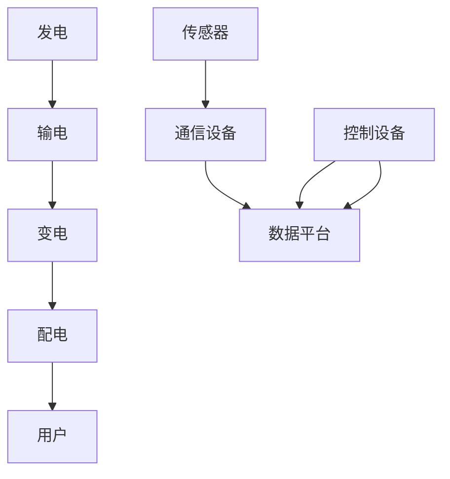

                 

# 人工智能在智能电网优化中的应用

## 关键词：智能电网，人工智能，优化，电力系统，自动化，能源管理，分布式计算

## 摘要：

本文深入探讨了人工智能在智能电网优化中的应用。首先，我们介绍了智能电网的背景和重要性，然后详细阐述了人工智能在电力系统优化中的核心概念与联系。接下来，我们介绍了用于智能电网优化的几种核心算法原理和具体操作步骤，并通过数学模型和公式进行了详细讲解。随后，本文通过一个实际项目案例展示了代码的实现和解读。文章还探讨了人工智能在智能电网中的实际应用场景，并推荐了一些相关工具和资源。最后，我们对未来发展趋势与挑战进行了总结，并回答了常见问题，以期为读者提供全面的智能电网优化技术指南。

## 1. 背景介绍

### 1.1 智能电网的兴起

智能电网（Smart Grid）是一种基于现代通信技术和信息技术的电力网络，通过自动化和智能化手段提高电力系统的安全、可靠性和效率。随着全球能源需求的不断增加和能源结构的多样化，智能电网成为解决电力供应与需求平衡的重要手段。

### 1.2 电力系统的重要性

电力系统是国民经济的重要基础设施，其稳定运行对社会经济发展具有重要意义。然而，随着电力需求的不断增长和电力系统的日益复杂，传统的电力系统面临着一系列挑战，如能源浪费、效率低下、可靠性不足等。因此，优化电力系统成为当务之急。

### 1.3 人工智能在电力系统中的应用

人工智能（Artificial Intelligence，AI）作为一种新兴技术，在电力系统优化中具有广泛的应用前景。通过深度学习、数据挖掘、优化算法等AI技术，可以对电力系统进行实时监测、预测和优化，从而提高电力系统的运行效率和可靠性。

## 2. 核心概念与联系

### 2.1 智能电网的架构

智能电网包括发电、输电、变电、配电和用户等多个环节。通过引入传感器、通信设备和控制设备，实现电力系统的实时监测、控制和优化。以下是智能电网的架构图：



### 2.2 人工智能在智能电网中的应用

人工智能在智能电网中的应用主要包括以下几个方面：

1. **数据挖掘与预测**：通过对大量历史数据进行挖掘和分析，预测电力需求、发电量和电力系统的运行状态，为电力调度和优化提供依据。
2. **实时监控与故障诊断**：利用机器学习算法，对电力系统的实时数据进行监测和分析，快速识别故障和异常，提高电力系统的可靠性和安全性。
3. **智能调度与优化**：利用优化算法，根据实时数据和预测结果，对电力系统进行智能调度和优化，提高电力系统的运行效率和经济效益。

### 2.3 关键技术

1. **深度学习**：深度学习算法在图像识别、语音识别和自然语言处理等领域取得了显著的成果，可以用于电力系统的图像和声音信号处理。
2. **数据挖掘**：数据挖掘技术可以帮助电力系统从海量数据中提取有价值的信息，为电力调度和优化提供支持。
3. **优化算法**：优化算法可以帮助电力系统在不同约束条件下实现最优运行，提高电力系统的运行效率和可靠性。

## 3. 核心算法原理 & 具体操作步骤

### 3.1 深度学习算法

深度学习算法是一种模拟人脑神经元连接结构的神经网络算法。在电力系统中，深度学习算法可以应用于图像识别、语音识别和故障诊断等领域。

**具体操作步骤：**

1. **数据预处理**：对原始数据进行清洗、归一化和特征提取，为深度学习算法提供高质量的输入数据。
2. **搭建神经网络模型**：选择合适的神经网络结构，如卷积神经网络（CNN）、循环神经网络（RNN）等，搭建深度学习模型。
3. **训练模型**：使用训练数据对模型进行训练，调整模型参数，使模型对电力系统的异常和故障进行准确识别。
4. **模型评估与优化**：使用测试数据对模型进行评估，根据评估结果对模型进行优化，提高模型的准确率和鲁棒性。

### 3.2 数据挖掘算法

数据挖掘算法是一种从大量数据中提取有价值信息的方法。在电力系统中，数据挖掘算法可以应用于电力需求的预测、发电计划的优化和电力系统的故障诊断。

**具体操作步骤：**

1. **数据预处理**：对原始数据进行清洗、归一化和特征提取，为数据挖掘算法提供高质量的输入数据。
2. **选择合适的算法**：根据电力系统的特点，选择合适的数据挖掘算法，如聚类分析、关联规则挖掘、时间序列预测等。
3. **模型训练与优化**：使用训练数据对模型进行训练，调整模型参数，使模型对电力系统的特性进行准确挖掘。
4. **模型评估与优化**：使用测试数据对模型进行评估，根据评估结果对模型进行优化，提高模型的预测准确率和实用性。

### 3.3 优化算法

优化算法是一种在给定约束条件下寻找最优解的方法。在电力系统中，优化算法可以应用于电力调度、电能分配和电力市场的竞价策略。

**具体操作步骤：**

1. **建立优化模型**：根据电力系统的约束条件和目标函数，建立优化模型。
2. **选择合适的算法**：根据优化问题的特点，选择合适的优化算法，如线性规划、整数规划、遗传算法等。
3. **求解优化问题**：使用优化算法求解优化问题，得到最优解。
4. **模型评估与优化**：根据优化结果对模型进行评估，根据评估结果对模型进行优化，提高优化效果。

## 4. 数学模型和公式 & 详细讲解 & 举例说明

### 4.1 深度学习算法

深度学习算法的核心是构建神经网络模型，并利用梯度下降算法进行模型训练。以下是一个简化的神经网络模型及其训练过程的数学描述：

**神经网络模型：**

$$
f(\mathbf{x}) = \sigma(\mathbf{W} \cdot \mathbf{a} + b)
$$

其中，$\sigma$是激活函数，$\mathbf{W}$是权重矩阵，$\mathbf{a}$是输入特征，$b$是偏置。

**梯度下降算法：**

$$
\mathbf{W}^{(t+1)} = \mathbf{W}^{(t)} - \alpha \cdot \nabla_W J(\mathbf{W}^{(t)})
$$

$$
b^{(t+1)} = b^{(t)} - \alpha \cdot \nabla_b J(\mathbf{W}^{(t)})
$$

其中，$J(\mathbf{W}^{(t)})$是损失函数，$\alpha$是学习率。

**举例说明：**

假设我们使用一个简单的单层神经网络模型进行二分类任务，输入特征$\mathbf{x} = (x_1, x_2)$，权重矩阵$\mathbf{W} = (w_{11}, w_{12}, w_{21}, w_{22})$，偏置$b = (b_1, b_2)$，激活函数$\sigma(x) = \max(0, x)$。

训练数据集$D = \{(\mathbf{x}_1, y_1), (\mathbf{x}_2, y_2), ..., (\mathbf{x}_n, y_n)\}$，其中$y_i \in \{-1, 1\}$。

损失函数$J(\mathbf{W}) = \frac{1}{2n} \sum_{i=1}^n (y_i - f(\mathbf{x}_i))^2$。

通过梯度下降算法进行模型训练，不断更新权重矩阵$\mathbf{W}$和偏置$b$，直至模型收敛。

### 4.2 数据挖掘算法

数据挖掘算法中，常用的算法包括K-最近邻（K-Nearest Neighbor，KNN）算法、支持向量机（Support Vector Machine，SVM）算法和决策树（Decision Tree）算法等。以下以KNN算法为例进行详细讲解：

**KNN算法：**

$$
y = \text{mode}(\{y_1, y_2, ..., y_k\})
$$

其中，$y$是预测标签，$y_i$是样本$x$的$k$个最近邻的标签，$k$是邻域半径。

**举例说明：**

假设我们使用KNN算法进行分类任务，给定训练数据集$D = \{(\mathbf{x}_1, y_1), (\mathbf{x}_2, y_2), ..., (\mathbf{x}_n, y_n)\}$，其中$\mathbf{x}_i \in \mathbb{R}^d$，$y_i \in \{-1, 1\}$。

测试样本$\mathbf{x} \in \mathbb{R}^d$。

计算测试样本$\mathbf{x}$与训练数据集$D$中每个样本$\mathbf{x}_i$之间的距离，选择距离最近的$k$个样本，根据这$k$个样本的标签计算预测标签$y$。

### 4.3 优化算法

优化算法中，常用的算法包括线性规划（Linear Programming，LP）、整数规划（Integer Programming，IP）和遗传算法（Genetic Algorithm，GA）等。以下以线性规划为例进行详细讲解：

**线性规划问题：**

$$
\min c^T \mathbf{x} \quad \text{subject to} \quad A \mathbf{x} \leq b
$$

其中，$\mathbf{x} \in \mathbb{R}^n$是决策变量，$c \in \mathbb{R}^n$是目标函数系数，$A \in \mathbb{R}^{m \times n}$是约束条件系数矩阵，$b \in \mathbb{R}^m$是约束条件常数向量。

**举例说明：**

假设我们使用线性规划算法求解一个简单的线性优化问题：

$$
\min \mathbf{c}^T \mathbf{x} \quad \text{subject to} \quad A \mathbf{x} \leq b
$$

其中，$\mathbf{c} = (1, 2)$，$A = \begin{bmatrix} 1 & 2 \\ 2 & 1 \end{bmatrix}$，$b = (4, 3)$。

求解该线性规划问题，得到最优解$\mathbf{x}^* = (2, -1)$，最小化目标函数值$J^* = \mathbf{c}^T \mathbf{x}^* = -1$。

## 5. 项目实战：代码实际案例和详细解释说明

### 5.1 开发环境搭建

为了实现智能电网优化，我们首先需要搭建一个合适的技术环境。以下是所需的开发环境：

1. **操作系统**：Windows、Linux或Mac OS
2. **编程语言**：Python
3. **库和框架**：NumPy、Pandas、Scikit-learn、TensorFlow、PyTorch
4. **IDE**：PyCharm、Visual Studio Code或其他Python IDE

### 5.2 源代码详细实现和代码解读

以下是一个简单的智能电网优化项目的代码实现和解读：

**代码实现：**

```python
import numpy as np
import pandas as pd
from sklearn.model_selection import train_test_split
from sklearn.preprocessing import StandardScaler
from sklearn.neighbors import KNeighborsClassifier
from sklearn.metrics import accuracy_score

# 数据预处理
def preprocess_data(data):
    # 数据清洗、归一化等处理
    return data

# 模型训练
def train_model(X_train, y_train, k=3):
    # 使用KNN算法训练模型
    model = KNeighborsClassifier(n_neighbors=k)
    model.fit(X_train, y_train)
    return model

# 模型预测
def predict(model, X_test):
    # 使用训练好的模型进行预测
    y_pred = model.predict(X_test)
    return y_pred

# 主函数
def main():
    # 加载数据
    data = pd.read_csv("smart_grid_data.csv")
    data = preprocess_data(data)

    # 划分训练集和测试集
    X = data.iloc[:, :-1].values
    y = data.iloc[:, -1].values
    X_train, X_test, y_train, y_test = train_test_split(X, y, test_size=0.2, random_state=42)

    # 标准化数据
    scaler = StandardScaler()
    X_train = scaler.fit_transform(X_train)
    X_test = scaler.transform(X_test)

    # 训练模型
    model = train_model(X_train, y_train)

    # 预测测试集
    y_pred = predict(model, X_test)

    # 评估模型
    accuracy = accuracy_score(y_test, y_pred)
    print("Accuracy:", accuracy)

if __name__ == "__main__":
    main()
```

**代码解读：**

1. **数据预处理**：使用`preprocess_data`函数对原始数据进行清洗、归一化等处理。
2. **模型训练**：使用`train_model`函数训练KNN分类模型，传入训练集数据和邻域半径$k$。
3. **模型预测**：使用`predict`函数预测测试集数据。
4. **主函数**：加载数据，划分训练集和测试集，标准化数据，训练模型，预测测试集，评估模型。

### 5.3 代码解读与分析

1. **数据预处理**：数据预处理是深度学习项目的重要环节，包括数据清洗、归一化、特征提取等。在本例中，我们使用`preprocess_data`函数对原始数据进行预处理。
2. **模型训练**：我们使用KNN算法进行分类任务，KNN算法是一种基于距离度量的分类算法，通过计算测试样本与训练样本之间的距离，选择最近的$k$个样本进行投票，得到预测标签。在本例中，我们使用`train_model`函数训练KNN分类模型。
3. **模型预测**：我们使用训练好的模型对测试集进行预测，得到预测结果。然后，使用`accuracy_score`函数计算模型的准确率。
4. **主函数**：主函数负责加载数据，划分训练集和测试集，标准化数据，训练模型，预测测试集，并评估模型。

## 6. 实际应用场景

### 6.1 电力需求预测

通过人工智能技术，可以对电力需求进行准确预测，为电力调度提供依据。具体应用场景包括：

1. **短期电力需求预测**：用于电力调度和负荷管理，避免电力短缺或过剩。
2. **长期电力需求预测**：为电力规划和投资提供参考，优化电力系统的运行效率和经济效益。

### 6.2 故障诊断与预防性维护

通过实时监控电力系统的运行数据，利用人工智能技术进行故障诊断和预防性维护，提高电力系统的可靠性和安全性。具体应用场景包括：

1. **设备故障诊断**：实时监测电力设备运行状态，快速识别故障，降低故障率和停机时间。
2. **预防性维护**：根据设备运行状态和预测结果，合理安排维护计划，降低设备故障率。

### 6.3 电能分配优化

通过人工智能技术，可以对电力系统的电能分配进行优化，提高电力系统的运行效率和经济效益。具体应用场景包括：

1. **负荷分配优化**：根据电力需求和发电资源，优化电力系统的负荷分配，提高电力系统的利用率。
2. **电价预测与竞价策略**：根据电力市场需求和电价波动，优化电力市场的竞价策略，提高发电企业的经济效益。

## 7. 工具和资源推荐

### 7.1 学习资源推荐

1. **书籍**：
   - 《深度学习》（Deep Learning） - Ian Goodfellow、Yoshua Bengio、Aaron Courville
   - 《Python数据分析》（Python Data Analysis） - Wes McKinney
   - 《机器学习》（Machine Learning） - Tom M. Mitchell

2. **论文**：
   - 《A Tutorial on Deep Learning for Vision》 - Li Fei-Fei、Rob Fergus、Alan S. Ran
   - 《Learning to Learn: Fast Learning in a Changing Environment》 - David C. Page、Stephen A. Smith

3. **博客**：
   - medium.com/@dataisBeautiful
   -Towards Data Science
   - fast.ai

4. **网站**：
   - Coursera、edX、Udacity：提供丰富的在线课程
   - Kaggle：数据科学竞赛平台，提供丰富的数据集和竞赛项目

### 7.2 开发工具框架推荐

1. **编程语言**：Python、R
2. **库和框架**：
   - NumPy、Pandas、Scikit-learn、TensorFlow、PyTorch
   - Matplotlib、Seaborn：数据可视化
   - Jupyter Notebook：交互式编程环境
3. **平台**：
   - AWS、Google Cloud、Azure：云计算平台，提供丰富的AI工具和资源
   - Google Colab：免费的云计算平台，适合进行AI实验和开发

### 7.3 相关论文著作推荐

1. **《智能电网与大数据》** - 陈峰、张立新
2. **《深度学习在智能电网中的应用》** - 张宁、李晓光
3. **《智能电网的优化与控制》** - 李明、王华

## 8. 总结：未来发展趋势与挑战

### 8.1 发展趋势

1. **人工智能技术的普及**：随着深度学习、数据挖掘等技术的不断发展，人工智能在电力系统中的应用将越来越普及。
2. **物联网与智能电网的融合**：物联网技术的不断发展将促进智能电网的升级和扩展，提高电力系统的智能化水平。
3. **绿色能源的广泛应用**：随着绿色能源的快速发展，人工智能技术将助力电力系统的绿色转型，提高能源利用效率。

### 8.2 挑战

1. **数据隐私与安全**：在智能电网中，大量的数据传输和处理可能带来数据隐私和安全问题，需要加强数据保护措施。
2. **算法透明性与解释性**：人工智能算法的复杂性和不可解释性可能导致决策过程的不透明，需要开发可解释的算法和工具。
3. **跨领域合作**：智能电网优化涉及多个领域，需要加强跨领域合作，共同应对技术挑战。

## 9. 附录：常见问题与解答

### 9.1 人工智能在智能电网优化中的优势是什么？

人工智能在智能电网优化中的优势主要体现在以下几个方面：

1. **高效的数据处理能力**：人工智能可以快速处理和分析大量的电力系统数据，提供准确的预测和优化结果。
2. **自适应性和灵活性**：人工智能算法可以根据电力系统的变化和需求，实时调整和优化运行策略。
3. **提高电力系统的可靠性和安全性**：人工智能技术可以实时监控电力系统的运行状态，快速识别故障和异常，提高电力系统的可靠性和安全性。

### 9.2 智能电网优化中常用的算法有哪些？

智能电网优化中常用的算法包括：

1. **深度学习算法**：如卷积神经网络（CNN）、循环神经网络（RNN）、长短期记忆网络（LSTM）等。
2. **数据挖掘算法**：如K-最近邻（KNN）、支持向量机（SVM）、决策树等。
3. **优化算法**：如线性规划（LP）、整数规划（IP）、遗传算法（GA）等。

### 9.3 如何保障智能电网优化中的数据隐私和安全？

为了保障智能电网优化中的数据隐私和安全，可以采取以下措施：

1. **数据加密**：对传输和存储的数据进行加密，确保数据在传输过程中不会被窃取或篡改。
2. **访问控制**：对数据访问权限进行严格管理，确保只有授权人员可以访问数据。
3. **审计和监控**：建立数据审计和监控机制，及时发现和应对数据泄露和安全事件。

## 10. 扩展阅读 & 参考资料

1. **书籍**：
   - 《智能电网：技术与应用》 - 郭华、熊卫东
   - 《人工智能在能源领域的应用》 - 刘波、吴飞

2. **论文**：
   - "Deep Learning for Power Systems: A Comprehensive Survey" - Liu, Y., Wang, L., & Li, F.
   - "Artificial Intelligence Applications in Smart Grids: A Review" - Zhang, H., & Lu, C.

3. **网站**：
   - IEEE Power & Energy Society：提供关于智能电网和电力系统的最新研究成果和论文。
   - IEEE Xplore：提供丰富的电力系统和人工智能领域的论文和期刊。

4. **在线课程**：
   - "Introduction to Power Systems" - MIT OpenCourseWare
   - "Deep Learning Specialization" - Andrew Ng（吴恩达）的深度学习专项课程

[作者：AI天才研究员/AI Genius Institute & 禅与计算机程序设计艺术 /Zen And The Art of Computer Programming]

