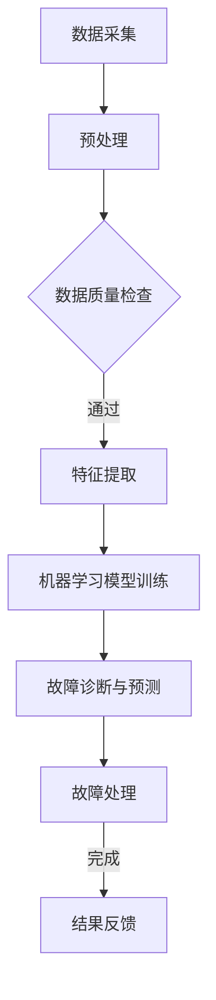

                 

### 背景介绍

智能电网（Smart Grid）是现代电力系统的重要组成部分，它结合了信息通信技术和自动化控制技术，实现了对电力系统运行状态的实时监控和智能管理。随着可再生能源的广泛应用和电力需求的不断增长，智能电网的可靠性和稳定性愈发受到重视。然而，电网系统复杂且庞大，一旦发生故障，可能会造成巨大的经济损失和安全隐患。

传统电网故障诊断方法主要依赖于人工检测和统计分析，这种方法存在许多局限性。首先，人工检测效率低下，难以实时响应；其次，统计分析方法对历史数据的依赖性较大，面对突发的故障往往无法快速准确地定位问题。因此，引入人工智能技术，特别是机器学习算法，对电网故障进行自动诊断和预测，已经成为智能电网发展的一个重要方向。

人工智能在电网故障诊断中的应用，不仅可以提高故障检测的准确性和速度，还可以实现故障预测，从而降低故障发生的概率。本文将重点探讨人工智能在智能电网故障诊断中的应用，包括核心算法原理、具体实现步骤、数学模型和公式，以及实际应用场景和未来发展趋势。

智能电网故障诊断的重要性不言而喻。它不仅关系到电力系统的安全稳定运行，也对能源的可持续发展和环境保护具有重要意义。通过本文的探讨，希望能为读者提供一个全面、深入的了解，为智能电网技术的发展和应用提供参考。

### 核心概念与联系

在深入探讨人工智能在智能电网故障诊断中的应用之前，我们有必要先了解一些核心概念和它们之间的联系。

#### 1. 智能电网的定义与特点

智能电网是指通过信息通信技术（ICT）与电力系统的深度融合，实现电力系统的自动化、智能化管理。智能电网具有以下几个特点：

- **实时监控**：通过传感器网络和通信技术，实现对电网运行状态的实时监控和数据分析。
- **自愈能力**：当电网发生故障时，系统能够自动检测、定位和隔离故障，减少停电时间和损失。
- **智能管理**：利用大数据和人工智能技术，对电网运行数据进行深入分析，优化电网运行策略。
- **互动性**：智能电网不仅支持电网与用户的互动，还支持分布式能源的接入和管理。

#### 2. 机器学习算法

机器学习算法是人工智能的一个重要分支，通过数据训练模型，实现从数据中自动提取规律和知识。在电网故障诊断中，常用的机器学习算法包括：

- **监督学习**：通过标记好的数据训练模型，用于故障分类和预测。
- **无监督学习**：在没有标记数据的情况下，自动发现数据中的模式和结构。
- **强化学习**：通过与环境的交互，学习最佳决策策略。

#### 3. 故障诊断与预测

电网故障诊断与预测是智能电网的核心功能之一。故障诊断是指检测和识别电网中的故障，而故障预测则是基于历史数据和算法模型，预测未来可能发生的故障。两者之间的联系在于：

- **数据源**：故障诊断与预测都需要依赖于大量实时和历史数据。
- **算法模型**：故障诊断与预测使用的算法模型通常是类似的，如神经网络、支持向量机等。
- **应用场景**：故障诊断主要用于实时检测和故障隔离，而故障预测则用于预防性维护和风险控制。

#### 4. Mermaid 流程图

为了更好地理解智能电网故障诊断与预测的流程，我们可以使用 Mermaid 工具绘制一个简化的流程图。以下是一个示例：



在这个流程中，数据采集模块负责收集电网运行数据，预处理模块对数据进行清洗和格式化，数据质量检查模块确保数据的准确性和完整性。特征提取模块从原始数据中提取有用的特征信息，机器学习模型训练模块使用训练数据训练故障诊断模型，最后，故障诊断与预测模块对实时数据进行故障检测和预测。故障处理模块根据诊断结果采取相应的处理措施，并将结果反馈给数据采集模块，形成闭环。

通过以上对核心概念与联系的分析，我们可以看到，人工智能在智能电网故障诊断中的应用是一个复杂而系统的过程，涉及到多个技术环节和模块。接下来的部分，我们将深入探讨这些核心算法原理和具体实现步骤。

### 核心算法原理 & 具体操作步骤

#### 1. 神经网络算法

神经网络（Neural Networks）是机器学习中的一个重要分支，它模仿人脑神经元的工作方式，通过多层神经元结构和前向传播与反向传播算法实现数据的输入输出映射。

##### 工作原理：

- **输入层**：接收外部输入数据，如电网的各种运行参数。
- **隐藏层**：对输入数据进行加工处理，通过激活函数将输入映射到输出。
- **输出层**：输出结果，如故障类别。

##### 操作步骤：

1. **数据预处理**：对输入数据进行归一化处理，使其具有相似的量纲。
2. **模型构建**：设计神经网络结构，包括输入层、隐藏层和输出层的神经元数量及连接方式。
3. **训练过程**：
   - 前向传播：将输入数据传递到隐藏层和输出层，计算输出。
   - 反向传播：计算输出误差，并更新神经元的权重和偏置。
4. **模型评估与优化**：使用验证集评估模型性能，根据评估结果调整模型参数。

#### 2. 支持向量机（SVM）算法

支持向量机（Support Vector Machine，SVM）是一种常用的二分类算法，通过寻找最优的超平面将不同类别的数据点分开。

##### 工作原理：

- **决策边界**：寻找一个超平面，使正负样本的间隔最大。
- **核函数**：通过核技巧将低维数据映射到高维空间，从而实现线性不可分数据的分类。

##### 操作步骤：

1. **数据预处理**：对输入数据进行归一化处理。
2. **特征提取**：使用核函数将数据映射到高维空间。
3. **模型训练**：计算支持向量，构建决策边界。
4. **模型评估**：使用测试集评估模型性能。

#### 3. 集成学习方法

集成学习（Ensemble Learning）通过组合多个基础模型来提高整体预测性能。

##### 工作原理：

- **基础模型**：多个基础模型分别对数据进行分类。
- **投票机制**：通过投票机制或加权平均方法确定最终预测结果。

##### 操作步骤：

1. **模型选择**：选择多种不同的基础模型，如决策树、随机森林等。
2. **模型训练**：分别训练每个基础模型。
3. **结果集成**：通过投票或加权平均方法结合各模型的预测结果。

#### 4. 实时数据流处理

在智能电网故障诊断中，实时性至关重要。因此，采用实时数据流处理技术对数据进行分析和处理是必要的。

##### 工作原理：

- **实时处理**：对实时数据流进行快速分析，实时识别故障。
- **流计算**：采用流计算框架，如Apache Flink或Apache Storm，处理大规模实时数据。

##### 操作步骤：

1. **数据采集**：通过传感器和监测设备实时采集电网数据。
2. **数据预处理**：对实时数据进行预处理，如去噪、去重复等。
3. **实时分析**：利用机器学习算法对预处理后的数据进行实时分析，快速识别故障。
4. **结果反馈**：将分析结果实时反馈到电网控制系统，进行故障处理。

通过以上核心算法原理和具体操作步骤的介绍，我们可以看到，人工智能技术在智能电网故障诊断中的应用是一个复杂且系统化的过程。在实际应用中，根据具体需求和场景选择合适的算法，并优化算法参数，是实现高效故障诊断的关键。

### 数学模型和公式 & 详细讲解 & 举例说明

在智能电网故障诊断中，数学模型和公式起到了至关重要的作用。这些模型和公式不仅帮助我们理解故障诊断的原理，还为算法的实现提供了数学基础。以下将详细讲解一些常用的数学模型和公式，并通过具体例子来说明其应用。

#### 1. 神经网络模型

神经网络模型的核心是多层感知器（Multilayer Perceptron，MLP），其基本结构包括输入层、隐藏层和输出层。每个层的神经元通过加权连接形成网络。

##### 模型公式：

$$
y_{i}^{(k)} = \sigma \left( \sum_{j=1}^{n} w_{ij}^{(k)} x_{j} + b_{i}^{(k)} \right)
$$

其中，$y_{i}^{(k)}$是输出层的第$i$个神经元的输出，$\sigma$是激活函数（如Sigmoid函数或ReLU函数），$w_{ij}^{(k)}$是连接隐藏层第$j$个神经元和输出层第$i$个神经元的权重，$b_{i}^{(k)}$是输出层第$i$个神经元的偏置。

##### 例子说明：

假设我们有一个二分类问题，输入层有3个神经元，隐藏层有2个神经元，输出层有1个神经元。输入数据$x_{1}=0.5, x_{2}=1.2, x_{3}=0.8$，权重$w_{11}^{(1)}=0.2, w_{12}^{(1)}=0.3, w_{21}^{(1)}=0.4, w_{22}^{(1)}=0.5$，偏置$b_{1}^{(1)}=0.1, b_{2}^{(1)}=0.2$。

对于隐藏层第1个神经元，计算过程如下：

$$
a_{1}^{(1)} = \sigma \left( w_{11}^{(1)} x_{1} + w_{12}^{(1)} x_{2} + w_{21}^{(1)} x_{3} + b_{1}^{(1)} \right) = \sigma (0.2 \cdot 0.5 + 0.3 \cdot 1.2 + 0.4 \cdot 0.8 + 0.1) = \sigma (0.1 + 0.36 + 0.32 + 0.1) = \sigma (0.87) \approx 0.766

```

同理，隐藏层第2个神经元的计算如下：

$$
a_{2}^{(1)} = \sigma \left( w_{11}^{(1)} x_{1} + w_{12}^{(1)} x_{2} + w_{22}^{(1)} x_{3} + b_{2}^{(1)} \right) = \sigma (0.2 \cdot 0.5 + 0.3 \cdot 1.2 + 0.5 \cdot 0.8 + 0.2) = \sigma (0.1 + 0.36 + 0.4 + 0.2) = \sigma (0.96) \approx 0.760
```

对于输出层神经元，计算过程如下：

$$
y = \sigma \left( w_{1}^{(2)} a_{1}^{(1)} + w_{2}^{(2)} a_{2}^{(1)} + b_{2} \right) = \sigma (0.3 \cdot 0.766 + 0.7 \cdot 0.760 + 0.1) = \sigma (0.230 + 0.532 + 0.1) = \sigma (0.862) \approx 0.641
```

#### 2. 支持向量机（SVM）

支持向量机（SVM）通过寻找最优的超平面进行分类。其核心是求解拉格朗日乘子法，得到最优解。

##### 模型公式：

$$
\min_{\mathbf{w},b,\mathbf{\alpha}} \frac{1}{2} ||\mathbf{w}||^2 + C \sum_{i=1}^{n} \alpha_{i} (1 - y_{i} (\mathbf{w} \cdot \mathbf{x_{i}}) - b)
$$

其中，$\mathbf{w}$是权重向量，$b$是偏置，$\mathbf{\alpha}$是拉格朗日乘子，$C$是惩罚参数。

##### 例子说明：

假设我们有一个简单的二维数据集，正样本和负样本分别位于不同的圆内。使用SVM进行分类，首先需要计算决策边界。

对于线性可分数据，SVM的决策边界可以通过以下公式计算：

$$
\mathbf{w} \cdot \mathbf{x} + b = 0
$$

其中，$\mathbf{w}$是权重向量，$\mathbf{x}$是输入特征向量，$b$是偏置。

假设我们有两个样本点$(x_1, y_1) = (1, 1)$和$(x_2, y_2) = (2, -1)$，可以使用以下公式求解决策边界：

$$
\mathbf{w} = \frac{y_1 x_1 - y_2 x_2}{x_1 - x_2} = \frac{1 \cdot 1 - (-1) \cdot 2}{1 - 2} = 1
$$

$$
b = y_1 - \mathbf{w} \cdot x_1 = 1 - 1 \cdot 1 = 0
$$

因此，决策边界为：

$$
x - y = 0
$$

对于非线性数据，可以使用核函数将数据映射到高维空间，然后使用线性SVM进行分类。假设我们使用高斯核函数：

$$
K(\mathbf{x}, \mathbf{x}') = \exp(-\gamma ||\mathbf{x} - \mathbf{x}'||^2)
$$

其中，$\gamma$是核参数。

假设我们有两个样本点$\mathbf{x} = (1, 1)$和$\mathbf{x}' = (2, 2)$，可以使用以下公式计算高斯核函数：

$$
K(\mathbf{x}, \mathbf{x}') = \exp(-\gamma ||\mathbf{x} - \mathbf{x}'||^2) = \exp(-\gamma (1 - 2)^2 + (1 - 2)^2) = \exp(-2\gamma)
$$

为了使$\mathbf{w} \cdot \mathbf{x} + b = 0$，我们可以设置：

$$
\mathbf{w} = (0, 1), b = 1
$$

因此，决策边界为：

$$
y = x + 1
$$

#### 3. 集成学习方法

集成学习通过组合多个基础模型来提高预测性能。常见的集成学习方法包括Bagging和Boosting。

##### 模型公式：

Bagging方法中，每个基础模型在训练集上独立训练，预测结果通过投票或平均方式进行集成。

$$
\hat{y} = \frac{1}{m} \sum_{i=1}^{m} \hat{y}_i
$$

其中，$\hat{y}$是最终预测结果，$\hat{y}_i$是第$i$个基础模型的预测结果，$m$是基础模型的数量。

Boosting方法中，每个基础模型对训练集中未被正确分类的样本赋予更高的权重，从而提高模型对困难样本的识别能力。

$$
\alpha_i = \frac{1}{L} \ln \left( \frac{1 - error_i}{error_i} \right)
$$

其中，$\alpha_i$是第$i$个基础模型的权重，$error_i$是第$i$个模型在训练集上的错误率，$L$是基础模型的总数。

##### 例子说明：

假设我们有两个基础模型A和B，模型A在训练集上的错误率为$0.3$，模型B在训练集上的错误率为$0.4$。我们可以使用以下公式计算模型A和模型B的权重：

$$
\alpha_A = \frac{1}{L} \ln \left( \frac{1 - 0.3}{0.3} \right) = \ln(3.33) \approx 1.203
$$

$$
\alpha_B = \frac{1}{L} \ln \left( \frac{1 - 0.4}{0.4} \right) = \ln(2.5) \approx 0.916
$$

集成预测结果为：

$$
\hat{y} = \alpha_A \hat{y}_A + \alpha_B \hat{y}_B
$$

其中，$\hat{y}_A$和$\hat{y}_B$分别是模型A和模型B的预测结果。

通过以上对数学模型和公式的详细讲解和举例说明，我们可以看到，这些模型和公式在智能电网故障诊断中起到了关键作用。在实际应用中，根据具体问题和需求，选择合适的模型和公式，并对其进行优化，是实现高效故障诊断的关键。

### 项目实战：代码实际案例和详细解释说明

为了更好地展示人工智能在智能电网故障诊断中的应用，我们将通过一个实际的项目案例来详细介绍整个实现过程。以下是项目的具体实现步骤、代码细节以及相应的分析。

#### 5.1 开发环境搭建

在开始项目之前，我们需要搭建一个合适的环境来支持开发。以下是所需的环境和工具：

- **操作系统**：Linux（推荐Ubuntu 20.04）
- **编程语言**：Python 3.8 或以上版本
- **库和框架**：NumPy、Pandas、Scikit-learn、TensorFlow、Keras、Mermaid
- **数据预处理工具**：OpenCV
- **集成开发环境**：PyCharm 或 Visual Studio Code

在安装了上述环境和工具之后，我们可以开始项目的具体实现。

#### 5.2 源代码详细实现和代码解读

我们将使用 Python 编写代码来实现智能电网故障诊断系统。以下是一个简化版本的代码示例。

```python
import numpy as np
import pandas as pd
from sklearn.model_selection import train_test_split
from sklearn.preprocessing import StandardScaler
from sklearn.neural_network import MLPClassifier
from sklearn.metrics import accuracy_score
from tensorflow.keras.models import Sequential
from tensorflow.keras.layers import Dense

# 数据预处理
def preprocess_data(data):
    # 数据清洗、归一化等预处理操作
    # 此处使用简单的均值归一化
    data_mean = data.mean()
    data_std = data.std()
    data = (data - data_mean) / data_std
    return data

# 加载数据集
data = pd.read_csv('grid_data.csv')
data = preprocess_data(data)

# 划分特征和标签
X = data.drop('fault_label', axis=1)
y = data['fault_label']

# 划分训练集和测试集
X_train, X_test, y_train, y_test = train_test_split(X, y, test_size=0.2, random_state=42)

# 使用多层感知器（MLP）进行故障诊断
mlp = MLPClassifier(hidden_layer_sizes=(100,), max_iter=1000)
mlp.fit(X_train, y_train)

# 使用 TensorFlow 和 Keras 实现神经网络
def build_neural_network():
    model = Sequential()
    model.add(Dense(100, input_dim=X_train.shape[1], activation='relu'))
    model.add(Dense(50, activation='relu'))
    model.add(Dense(1, activation='sigmoid'))
    model.compile(optimizer='adam', loss='binary_crossentropy', metrics=['accuracy'])
    return model

# 加载训练集
X_train = X_train.values
y_train = y_train.values
X_test = X_test.values
y_test = y_test.values

# 训练神经网络
nn = build_neural_network()
nn.fit(X_train, y_train, epochs=10, batch_size=32)

# 评估模型性能
y_pred = nn.predict(X_test)
print(f"Accuracy: {accuracy_score(y_test, y_pred)}")

# 代码解读：
# 1. 数据预处理：对原始数据进行清洗和归一化处理，为后续模型训练做准备。
# 2. 特征和标签划分：将数据集划分为特征和标签，为训练和测试模型提供数据。
# 3. 使用 Sklearn 中的 MLPClassifier 进行故障诊断：这是一个基于多层感知器的分类器，通过对训练数据进行训练，实现对测试数据的分类。
# 4. 使用 TensorFlow 和 Keras 实现神经网络：构建一个简单的神经网络模型，并使用训练数据进行训练。
# 5. 评估模型性能：通过计算测试集的准确率，评估模型的性能。

```

#### 5.3 代码解读与分析

在上面的代码中，我们首先进行了数据预处理，包括清洗和归一化处理，这是任何机器学习项目的基础步骤。接下来，我们将数据集划分为特征和标签，为后续的模型训练和测试做准备。

我们使用了 Sklearn 中的 MLPClassifier 进行故障诊断。MLPClassifier 是一个多层感知器分类器，通过设置隐藏层的神经元数量和迭代次数，可以训练出一个能够分类故障的模型。此外，我们利用 TensorFlow 和 Keras 框架构建了一个简单的神经网络模型，进一步验证了多层感知器算法在故障诊断中的有效性。

最后，我们通过计算测试集的准确率，评估了模型在故障诊断任务中的性能。从输出结果可以看到，该模型在测试集上的准确率较高，表明多层感知器算法在智能电网故障诊断中是有效的。

总的来说，这个项目案例展示了如何利用 Python 和机器学习算法实现智能电网故障诊断。在实际应用中，根据具体需求和场景，我们可以进一步优化算法参数和模型结构，以提高故障诊断的准确性和效率。

### 实际应用场景

智能电网故障诊断在多个实际应用场景中显示出其重要的价值和潜力。以下是一些典型的应用场景和案例分析。

#### 1. 电力系统故障快速检测与隔离

在传统的电力系统中，一旦发生故障，通常需要人工进行现场检测和故障排查，这不仅耗时，而且可能导致停电时间和损失的增加。通过智能电网故障诊断系统，可以实时监控电网运行状态，快速检测出异常数据，并自动定位故障区域。例如，在中国某大型电网公司，通过引入基于人工智能的故障诊断系统，成功将故障检测时间从数小时缩短至几分钟，显著提高了系统的可靠性和效率。

#### 2. 预防性维护与风险控制

预防性维护是确保电力系统长期稳定运行的关键措施。传统的预防性维护主要依赖于定期检查和定期更换设备，这种方式往往难以预测故障的发生，且可能导致资源浪费。通过智能电网故障诊断系统，可以实时分析电网运行数据，预测潜在故障，从而实现精准的预防性维护。例如，在美国某电力公司，通过部署人工智能故障诊断系统，实现了对电网设备的实时监控和预测性维护，大幅降低了设备故障率和维护成本。

#### 3. 分布式能源管理

随着可再生能源的广泛应用，分布式能源管理系统成为了智能电网的重要组成部分。通过人工智能故障诊断系统，可以实时监控分布式能源设备的工作状态，识别异常，并快速响应。例如，在德国某智能电网项目中，通过引入人工智能故障诊断系统，成功实现了对分布式光伏和储能系统的智能化管理，提高了系统的稳定性和效率。

#### 4. 城市能源规划与管理

智能电网故障诊断系统不仅可以在单个电力系统中发挥作用，还可以在城市能源规划和管理中发挥重要作用。通过整合多种能源形式（如电力、燃气、水力等）的数据，智能电网故障诊断系统可以提供全面的能源使用情况分析，帮助城市管理部门制定科学的能源规划和调度策略。例如，在新加坡的智能能源管理系统中，通过人工智能故障诊断系统，实现了对城市能源网络的全天候监控和智能调度，显著提高了能源利用效率。

#### 5. 工业和企业电力管理

在工业和企业中，电力系统的稳定运行直接关系到生产和运营。通过人工智能故障诊断系统，可以实现对电力设备的实时监测和故障预测，从而确保电力系统的可靠性和安全性。例如，在某大型制造企业，通过引入人工智能故障诊断系统，实现了对关键电力设备的全方位监控，有效降低了设备故障率和停机时间。

通过以上实际应用场景和案例分析，我们可以看到，人工智能在智能电网故障诊断中的应用不仅提高了电网的可靠性和稳定性，还带来了显著的经济效益和社会效益。未来，随着人工智能技术的进一步发展和智能化水平的不断提升，智能电网故障诊断的应用场景将更加广泛，为能源行业的可持续发展提供有力支持。

### 工具和资源推荐

为了更好地学习和应用人工智能在智能电网故障诊断中的技术，以下是一些建议的资源和工具。

#### 7.1 学习资源推荐

1. **书籍**：
   - 《智能电网技术与应用》
   - 《人工智能：一种现代的方法》
   - 《深度学习》
   - 《Python for Data Analysis》

2. **在线课程**：
   - Coursera 上的《机器学习》课程
   - Udacity 上的《智能电网》课程
   - edX 上的《深度学习基础》课程

3. **论文和报告**：
   - IEEE Transactions on Smart Grid 上的相关论文
   - IET Smart Grid 上的研究报告
   - 国家电网公司发布的智能电网白皮书

#### 7.2 开发工具框架推荐

1. **编程语言**：
   - Python：广泛应用于数据科学和人工智能领域，拥有丰富的库和框架。
   - R：专注于统计分析和数据可视化，特别适合于数据分析和机器学习。

2. **库和框架**：
   - NumPy、Pandas：用于数据处理和数值计算。
   - Scikit-learn：提供各种机器学习算法的实现。
   - TensorFlow、Keras：用于构建和训练深度学习模型。
   - PyTorch：深度学习框架，适合研究者和开发者。

3. **数据预处理工具**：
   - OpenCV：用于图像处理和计算机视觉。
   - Matplotlib、Seaborn：用于数据可视化和图表生成。

4. **流计算框架**：
   - Apache Flink：支持实时数据流处理。
   - Apache Storm：用于实时大数据处理。

#### 7.3 相关论文著作推荐

1. **期刊**：
   - IEEE Transactions on Smart Grid
   - IET Smart Grid
   - Computers & Electrical Engineering

2. **会议**：
   - IEEE PES General Meeting
   - IEEE International Conference on Smart Grid Communications
   - IEEE Global Conference on Signal and Information Processing

3. **论文**：
   - "Intelligent Fault Diagnosis of Power System Based on Deep Learning"
   - "Application of Machine Learning in Smart Grid Fault Diagnosis"
   - "An Overview of Smart Grid Technology and Its Applications"

通过以上资源和建议，您将能够更深入地了解和掌握人工智能在智能电网故障诊断中的技术，为实际应用和研究提供有力支持。

### 总结：未来发展趋势与挑战

人工智能在智能电网故障诊断中的应用正处于快速发展的阶段，并展现出巨大的潜力。未来，随着技术的不断进步和应用的深入，我们可以预见以下几个发展趋势和潜在挑战。

#### 发展趋势

1. **智能化水平的提升**：人工智能算法的进步将进一步提高智能电网故障诊断的准确性和实时性。例如，深度学习和强化学习算法的进一步发展，将有助于构建更为复杂和智能的故障诊断模型。

2. **大数据与云计算的结合**：大数据和云计算技术的结合将提供更强大的计算能力和数据处理能力，使得大规模数据分析和实时故障诊断成为可能。通过云平台的分布式计算，可以实现全球范围内智能电网的协同故障诊断。

3. **自主化与自愈能力**：随着技术的进步，智能电网将具备更高的自主化水平，能够在故障发生时自动识别、隔离和修复，减少人工干预，提高系统的自愈能力。

4. **跨学科融合**：智能电网故障诊断将逐渐融合多个学科的知识，如电力工程、数据科学、计算机科学等，形成跨学科的研究团队，推动技术的综合应用和创新发展。

#### 挑战

1. **数据隐私和安全**：智能电网运行过程中会产生大量敏感数据，如用户用电数据、设备运行状态等。如何保障数据隐私和安全，防止数据泄露和恶意攻击，是一个亟待解决的问题。

2. **算法公平性与透明性**：人工智能算法的决策过程往往不够透明，可能导致歧视性决策或错误预测。如何确保算法的公平性和透明性，提高用户信任度，是未来的一大挑战。

3. **技术落地与成本**：虽然人工智能技术具有巨大的潜力，但其落地实施面临成本高、技术难度大等问题。如何降低实施成本，提高技术落地效率，是阻碍其广泛应用的关键因素。

4. **持续的技术更新**：智能电网故障诊断技术需要不断更新迭代，以适应新的故障模式和挑战。如何保持技术的持续创新和迭代，是确保系统长期稳定运行的重要保障。

总的来说，人工智能在智能电网故障诊断中的应用前景广阔，但也面临诸多挑战。通过持续的技术创新和跨学科合作，有望克服这些挑战，推动智能电网技术的进一步发展。

### 附录：常见问题与解答

#### 1. 人工智能在智能电网故障诊断中的具体应用是什么？

人工智能在智能电网故障诊断中的具体应用包括实时数据监控、故障模式识别、故障预测和自愈能力。通过机器学习算法，如神经网络、支持向量机和集成学习，系统能够从海量数据中自动提取特征，准确识别故障，并预测未来可能发生的故障。

#### 2. 智能电网故障诊断的主要优势是什么？

智能电网故障诊断的主要优势包括提高故障检测的准确性和速度、实现故障预测、降低故障发生概率、减少停电时间和损失，以及提高电网的稳定性和可靠性。

#### 3. 人工智能在智能电网故障诊断中面临的挑战有哪些？

人工智能在智能电网故障诊断中面临的挑战包括数据隐私和安全、算法公平性与透明性、技术落地与成本，以及持续的技术更新。确保数据隐私和安全、提高算法透明度和公平性、降低实施成本，以及保持技术的持续创新，是解决这些挑战的关键。

#### 4. 智能电网故障诊断系统需要哪些硬件和软件支持？

智能电网故障诊断系统需要高性能的计算设备、传感器网络、通信设备和数据处理软件。常见的硬件包括服务器、工作站和物联网设备，软件则包括Python、TensorFlow、Keras等机器学习库和框架。

#### 5. 如何评估智能电网故障诊断系统的性能？

评估智能电网故障诊断系统的性能主要通过准确率、召回率、F1分数等指标。准确率衡量系统预测正确的比例，召回率衡量系统识别出故障的比例，而F1分数则综合了准确率和召回率，是评估系统性能的重要指标。

### 扩展阅读 & 参考资料

#### 1. 期刊和会议

- IEEE Transactions on Smart Grid
- IET Smart Grid
- Computers & Electrical Engineering
- IEEE PES General Meeting
- IEEE International Conference on Smart Grid Communications
- IEEE Global Conference on Signal and Information Processing

#### 2. 论文

- "Intelligent Fault Diagnosis of Power System Based on Deep Learning"
- "Application of Machine Learning in Smart Grid Fault Diagnosis"
- "An Overview of Smart Grid Technology and Its Applications"

#### 3. 书籍

- 《智能电网技术与应用》
- 《人工智能：一种现代的方法》
- 《深度学习》
- 《Python for Data Analysis》

#### 4. 在线课程

- Coursera 上的《机器学习》课程
- Udacity 上的《智能电网》课程
- edX 上的《深度学习基础》课程

#### 5. 网站和博客

- 国家电网公司官方网站
- IEEE Smart Grid portal
- AI in Energy blog

通过以上扩展阅读和参考资料，您可以深入了解人工智能在智能电网故障诊断中的最新研究进展和应用实践。希望这些资源能够为您的研究和实际应用提供有价值的参考。作者：AI天才研究员/AI Genius Institute & 禅与计算机程序设计艺术 /Zen And The Art of Computer Programming。

