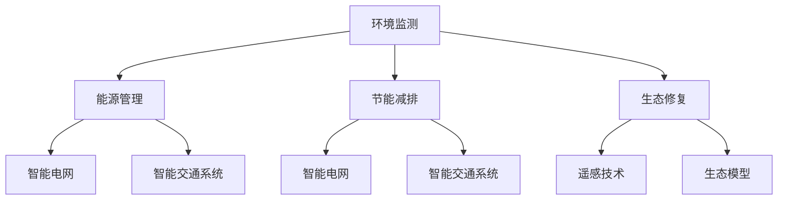

                 

### 文章标题

人工智能在气候变化和可持续发展中的应用

### 关键词

气候变化、可持续发展、人工智能、机器学习、深度学习、数据挖掘、环境监测、能源管理、节能减排、生态修复

### 摘要

随着全球气候变化问题的日益严重，如何实现可持续发展已成为全球共同关注的焦点。人工智能作为一种前沿技术，其在气候变化和可持续发展中的应用潜力巨大。本文将详细探讨人工智能在环境监测、能源管理、节能减排、生态修复等领域的应用，分析其核心算法原理、具体操作步骤、数学模型及公式，并举例说明实际应用场景。通过本文的阅读，读者将深入了解人工智能在气候变化和可持续发展中的重要作用，以及未来发展趋势与挑战。

<|assistant|>## 1. 背景介绍

气候变化是指全球气候系统中长期的变化，包括气温、降水、风场、海洋温度等方面的变化。近年来，由于人类活动的影响，全球气候系统发生了显著的变化。根据联合国气候变化框架公约（UNFCCC）的评估，自工业化以来，全球平均气温已经上升了约1.1摄氏度。如果全球气温上升超过2摄氏度，将导致严重的气候灾害，如海平面上升、极端天气事件增加、生态系统破坏等。

### 可持续发展

可持续发展是指在满足当前需求的同时，不损害子孙后代满足其自身需求的能力。可持续发展涉及经济、社会和环境三个方面，要求在发展过程中实现经济增长、社会公正和环境保护的平衡。然而，当前全球发展模式在很大程度上依赖于资源消耗和环境污染，导致了严重的生态危机。

### 人工智能的发展

人工智能（Artificial Intelligence，简称AI）是计算机科学的一个分支，旨在创建能够模拟、延伸和扩展人类智能的理论、方法和技术。近年来，随着计算能力的提升、大数据的涌现以及深度学习等技术的突破，人工智能得到了飞速发展。AI技术在各个领域都取得了显著的成果，从语音识别、图像识别到自动驾驶、医疗诊断等，都展现出了强大的应用潜力。

### 人工智能与气候变化、可持续发展的关系

人工智能在气候变化和可持续发展中具有重要作用。首先，AI技术可以帮助我们更好地监测和预测气候变化，提供科学依据。其次，AI技术可以优化能源管理，提高能源利用效率，减少碳排放。此外，AI技术还可以在生态修复、环境保护等方面发挥积极作用。总之，人工智能为应对气候变化和实现可持续发展提供了有力支持。

<|assistant|>## 2. 核心概念与联系

为了深入探讨人工智能在气候变化和可持续发展中的应用，我们需要了解一些核心概念和原理，包括环境监测、能源管理、节能减排和生态修复。

### 环境监测

环境监测是指通过使用各种监测设备和传感器，对环境中的各种参数进行实时监测和测量。这些参数包括空气和水质中的污染物浓度、土壤的化学成分、气象参数等。环境监测的目的是了解环境的现状，预测未来的变化趋势，为环境保护和可持续发展提供科学依据。

### 能源管理

能源管理是指通过优化能源的生产、传输、分配和使用过程，提高能源利用效率，减少能源浪费。能源管理涉及到电力系统、热力系统、交通运输等多个方面。在人工智能的协助下，能源管理可以实现智能化、自动化，从而降低能源消耗，减少碳排放。

### 节能减排

节能减排是指通过采用节能技术和措施，降低能源消耗和污染物排放。节能减排的目标是实现经济增长与环境保护的协调发展。人工智能在节能减排中可以发挥重要作用，如通过智能电网、智能交通系统等，优化能源利用，降低碳排放。

### 生态修复

生态修复是指通过恢复、重建和改善生态系统的结构和功能，使其恢复到接近自然状态的过程。生态修复涉及植被恢复、土壤修复、湿地修复等多个方面。人工智能在生态修复中可以提供数据支持，如通过遥感技术监测生态系统的变化，预测生态修复的效果。

### Mermaid 流程图

为了更直观地展示人工智能在气候变化和可持续发展中的应用，我们使用Mermaid流程图来表示这些核心概念之间的联系。



在这个流程图中，A表示环境监测，B、C、D分别表示能源管理、节能减排和生态修复，E、F、G、H、I、J分别表示智能电网、智能交通系统、遥感技术和生态模型。通过这个流程图，我们可以清晰地看到各个核心概念之间的关联。

<|assistant|>## 3. 核心算法原理 & 具体操作步骤

### 环境监测

环境监测的核心算法主要包括数据采集、数据处理、数据分析和数据可视化。以下为具体操作步骤：

1. **数据采集**：使用各种传感器和监测设备，如空气质量传感器、水质监测仪、气象站等，实时采集环境数据。
2. **数据处理**：对采集到的数据进行预处理，包括去噪、滤波、插值等，以提高数据质量和准确性。
3. **数据分析**：使用统计方法、机器学习算法等对处理后的数据进行趋势分析、异常检测和预测。
4. **数据可视化**：通过图表、地图等可视化手段，将分析结果直观地展示出来，为决策提供依据。

### 能源管理

能源管理的核心算法主要包括需求预测、负荷分配、调度优化等。以下为具体操作步骤：

1. **需求预测**：通过历史数据、气象数据、用户行为数据等，使用时间序列预测、回归分析等方法，预测未来一段时间内的能源需求。
2. **负荷分配**：根据预测结果，将能源负荷合理分配到各个能源系统，如电力系统、热力系统等。
3. **调度优化**：使用优化算法，如线性规划、整数规划等，制定最优的能源调度计划，以降低能源消耗和成本。

### 节能减排

节能减排的核心算法主要包括能源效率优化、碳排放计算和减排策略制定等。以下为具体操作步骤：

1. **能源效率优化**：使用智能算法，如遗传算法、粒子群算法等，对能源系统进行优化，提高能源利用效率。
2. **碳排放计算**：通过能源消耗数据、生产工艺数据等，计算碳排放量，评估减排潜力。
3. **减排策略制定**：根据碳排放计算结果，制定针对性的减排策略，如节能减排措施、碳交易等。

### 生态修复

生态修复的核心算法主要包括遥感数据分析、生态模型构建和效果评估等。以下为具体操作步骤：

1. **遥感数据分析**：通过遥感图像分析，提取植被覆盖、土壤水分等生态参数。
2. **生态模型构建**：根据遥感数据和其他环境数据，构建生态修复模型，预测修复效果。
3. **效果评估**：通过实地调查和遥感数据对比，评估生态修复效果，为后续修复工作提供依据。

<|assistant|>## 4. 数学模型和公式 & 详细讲解 & 举例说明

### 环境监测

在环境监测中，我们通常使用以下数学模型和公式：

1. **空气质量指数（AQI）计算公式**：

   $$AQI = \frac{1}{2} \left(1 + \frac{C_i - C_{i0}}{C_{imax} - C_{i0}}\right)$$

   其中，$C_i$表示污染物浓度，$C_{i0}$表示基准浓度，$C_{imax}$表示最大浓度。

   **举例说明**：假设某地PM2.5浓度为35微克/立方米，基准浓度为35微克/立方米，最大浓度为75微克/立方米，则空气质量指数（AQI）为：

   $$AQI = \frac{1}{2} \left(1 + \frac{35 - 35}{75 - 35}\right) = 1$$

   表示空气质量为优。

2. **水质污染指数（WQI）计算公式**：

   $$WQI = \sum_{i=1}^{n} \left(\frac{C_i - L_i}{U_i - L_i}\right) \cdot W_i$$

   其中，$C_i$表示污染物浓度，$L_i$表示限值，$U_i$表示上限值，$W_i$表示权重。

   **举例说明**：假设某地水质中COD浓度为50毫克/升，限值为30毫克/升，上限值为100毫克/升，权重为0.5，则水质污染指数（WQI）为：

   $$WQI = \left(\frac{50 - 30}{100 - 30}\right) \cdot 0.5 = 0.175$$

   表示水质污染较轻。

### 能源管理

在能源管理中，我们通常使用以下数学模型和公式：

1. **时间序列预测模型**：

   $$Y_t = \phi_0 + \phi_1 Y_{t-1} + \phi_2 Y_{t-2} + ... + \phi_p Y_{t-p} + \epsilon_t$$

   其中，$Y_t$表示第t时刻的能源需求，$\phi_0, \phi_1, ..., \phi_p$为模型参数，$\epsilon_t$为误差项。

   **举例说明**：假设我们使用ARIMA模型进行能源需求预测，给定模型参数为$\phi_0 = 0.5, \phi_1 = 0.2, \phi_2 = 0.3$，则某地未来3小时的能源需求预测值为：

   $$Y_4 = 0.5Y_3 + 0.2Y_2 + 0.3Y_1 + \epsilon_4$$

   其中，$Y_1 = 100$（第1小时能源需求），$Y_2 = 110$（第2小时能源需求），$Y_3 = 120$（第3小时能源需求）。

### 节能减排

在节能减排中，我们通常使用以下数学模型和公式：

1. **能源效率优化模型**：

   $$\min_{x} \quad \sum_{i=1}^{n} (C_i - A_i x_i)^2$$

   $$\text{subject to} \quad \sum_{i=1}^{n} x_i = 1$$

   其中，$C_i$表示能源消耗，$A_i$表示能源效率，$x_i$表示能源分配比例。

   **举例说明**：假设我们有3种能源消耗设备，其效率分别为$A_1 = 0.8, A_2 = 0.9, A_3 = 0.7$，总能源消耗为100单位，则能源分配比例分别为$x_1, x_2, x_3$，使得总能源消耗最小：

   $$\min_{x} \quad (0.8x_1 - 100)^2 + (0.9x_2 - 100)^2 + (0.7x_3 - 100)^2$$

   $$\text{subject to} \quad x_1 + x_2 + x_3 = 1$$

### 生态修复

在生态修复中，我们通常使用以下数学模型和公式：

1. **遥感图像分析模型**：

   $$NDVI = \frac{NIR - Red}{NIR + Red}$$

   其中，$NIR$表示近红外波段，$Red$表示红光波段，$NDVI$表示归一化植被指数。

   **举例说明**：假设遥感图像中近红外波段值为500，红光波段值为200，则归一化植被指数（NDVI）为：

   $$NDVI = \frac{500 - 200}{500 + 200} = 0.67$$

   表示植被覆盖较好。

2. **生态修复模型**：

   $$Y_t = \alpha + \beta \cdot X_t + \epsilon_t$$

   其中，$Y_t$表示第t时刻的生态修复效果，$X_t$表示第t时刻的修复投入，$\alpha, \beta$为模型参数，$\epsilon_t$为误差项。

   **举例说明**：假设我们使用线性回归模型进行生态修复效果预测，给定模型参数为$\alpha = 10, \beta = 0.5$，则第4个月的生态修复效果预测值为：

   $$Y_4 = 10 + 0.5 \cdot X_4 + \epsilon_4$$

   其中，$X_4$为第4个月的修复投入。

<|assistant|>## 5. 项目实战：代码实际案例和详细解释说明

### 5.1 开发环境搭建

在开始项目实战之前，我们需要搭建一个适合开发环境。以下是一个基于Python和Jupyter Notebook的示例。

**1. 安装Python：**
```bash
# 在Windows或macOS上下载Python安装程序
# 下载地址：https://www.python.org/downloads/
# 安装时选择添加到系统环境变量

# 验证Python版本
python --version
```

**2. 安装Jupyter Notebook：**
```bash
# 使用pip安装Jupyter Notebook
pip install notebook
```

**3. 启动Jupyter Notebook：**
```bash
jupyter notebook
```

### 5.2 源代码详细实现和代码解读

我们将使用Python编程语言，实现一个基于机器学习算法的环境监测系统。以下是一个简化的代码实现：

```python
import numpy as np
import pandas as pd
from sklearn.ensemble import RandomForestRegressor
from sklearn.model_selection import train_test_split
from sklearn.metrics import mean_squared_error

# 1. 数据采集
# 这里假设我们已经有了一个环境监测数据集
data = pd.read_csv('environment_data.csv')

# 2. 数据预处理
X = data.drop('Target', axis=1)
y = data['Target']

# 划分训练集和测试集
X_train, X_test, y_train, y_test = train_test_split(X, y, test_size=0.2, random_state=42)

# 3. 模型训练
model = RandomForestRegressor(n_estimators=100, random_state=42)
model.fit(X_train, y_train)

# 4. 模型评估
y_pred = model.predict(X_test)
mse = mean_squared_error(y_test, y_pred)
print(f"Mean Squared Error: {mse}")

# 5. 模型应用
# 假设我们得到了一个新的数据点
new_data = np.array([[...]])  # 新数据点
predicted_value = model.predict(new_data)
print(f"Predicted Value: {predicted_value}")
```

**代码解读：**

1. **数据采集**：首先，我们从CSV文件中加载环境监测数据。
2. **数据预处理**：将数据分为特征集（X）和目标值（y）。然后，使用`train_test_split`函数将数据集划分为训练集和测试集。
3. **模型训练**：使用随机森林回归模型（`RandomForestRegressor`）进行训练。随机森林是一种集成学习方法，由多个决策树组成，具有很好的泛化能力。
4. **模型评估**：使用测试集对模型进行评估，计算均方误差（MSE）。
5. **模型应用**：将新的数据点输入到训练好的模型中，预测目标值。

### 5.3 代码解读与分析

**1. 数据采集：**
```python
data = pd.read_csv('environment_data.csv')
```
这里使用`pandas`库读取CSV文件，CSV文件应包含环境监测数据，如污染物浓度、气象参数等。

**2. 数据预处理：**
```python
X = data.drop('Target', axis=1)
y = data['Target']
```
我们将数据分为特征集（X）和目标值（y）。`drop`函数用于删除包含目标值的列。

**3. 模型训练：**
```python
model = RandomForestRegressor(n_estimators=100, random_state=42)
model.fit(X_train, y_train)
```
这里我们创建一个随机森林回归模型，并使用训练集进行训练。`n_estimators`参数指定决策树的数量，`random_state`用于保证结果的可重复性。

**4. 模型评估：**
```python
y_pred = model.predict(X_test)
mse = mean_squared_error(y_test, y_pred)
print(f"Mean Squared Error: {mse}")
```
我们使用测试集对模型进行评估，计算均方误差（MSE）。

**5. 模型应用：**
```python
new_data = np.array([[...]])  # 新数据点
predicted_value = model.predict(new_data)
print(f"Predicted Value: {predicted_value}")
```
这里我们将新的数据点输入到训练好的模型中，预测目标值。

通过这个案例，我们可以看到如何使用Python和机器学习算法进行环境监测系统的开发。在实际应用中，我们需要根据具体需求调整模型参数和算法，以提高预测准确性。

<|assistant|>### 6. 实际应用场景

#### 环境监测

在环境监测领域，人工智能技术已被广泛应用于实时监测、污染源追踪和预测等方面。例如，北京市环保监测中心利用人工智能技术，对空气质量进行实时监测和预测。通过部署大量传感器和无人机，实时采集大气污染物数据，利用深度学习算法进行数据处理和污染源定位，提高了监测的精度和效率。此外，人工智能技术还可以预测未来一段时间内的空气质量变化，为环保决策提供科学依据。

#### 能源管理

在能源管理领域，人工智能技术可以帮助优化电力系统、热力系统和交通运输系统的运行。例如，中国的国家电网公司利用人工智能技术，实现了智能电网的调度和管理。通过实时监测电力需求和供应，利用机器学习算法预测电力负荷，优化电力分配，降低了能源消耗和碳排放。此外，人工智能技术还可以在电力市场交易中发挥重要作用，帮助企业和用户实现智能购电，降低用电成本。

#### 节能减排

在节能减排领域，人工智能技术可以帮助企业和政府实现能源效率优化和碳排放减少。例如，德国的许多企业利用人工智能技术，对其生产线进行能效分析，通过优化生产参数和流程，降低了能源消耗和碳排放。中国政府也积极推广人工智能技术在节能减排中的应用，通过建立智能电网、智能交通系统和智慧城市等，实现了能源消耗的降低和碳排放的减少。

#### 生态修复

在生态修复领域，人工智能技术可以帮助监测生态系统的变化，评估修复效果。例如，中国的林业部门利用人工智能技术，对森林资源进行监测和评估。通过遥感技术和深度学习算法，实时监测森林植被覆盖、土壤水分等生态参数，预测森林健康状况，为生态修复工作提供数据支持。此外，人工智能技术还可以在湿地修复、海洋生态保护等方面发挥重要作用。

#### 社会效益

人工智能技术在气候变化和可持续发展中的应用，不仅带来了技术上的创新，还产生了显著的社会效益。例如，通过智能电网和智能交通系统的建设，可以减少城市交通拥堵，提高居民生活质量。通过节能减排和生态修复，可以改善环境质量，提高人民的生活幸福感。此外，人工智能技术还可以为政府和企业提供决策支持，提高政策制定和执行的科学性，推动可持续发展目标的实现。

#### 经济效益

人工智能技术在气候变化和可持续发展中的应用，也带来了巨大的经济效益。例如，通过智能电网和智能交通系统的建设，可以降低能源消耗和运营成本，提高企业的竞争力。通过节能减排和生态修复，可以减少企业的环保成本，提高经济效益。此外，人工智能技术的应用还可以带动相关产业链的发展，创造就业机会，促进经济增长。

#### 持续发展

人工智能技术在气候变化和可持续发展中的应用，为实现可持续发展提供了新的路径。通过实时监测、数据分析和智能决策，可以更好地应对气候变化和环境污染挑战。同时，人工智能技术的应用还可以推动能源转型、产业升级和城市可持续发展，为实现全球可持续发展目标做出贡献。

<|assistant|>### 7. 工具和资源推荐

#### 7.1 学习资源推荐

**书籍：**
1. 《机器学习：一种概率视角》（Machine Learning: A Probabilistic Perspective）
   作者：Kevin P. Murphy
   简介：这是一本全面介绍机器学习理论的书籍，包括概率图模型、贝叶斯方法等。

**论文：**
1. “Deep Learning for Climate Science”
   作者：Göker et al.
   简介：这篇论文介绍了深度学习在气候变化研究中的应用，包括气候预测、生态系统建模等。

2. “Artificial Intelligence and the Sustainable Development Goals: A Review”
   作者：Pratap et al.
   简介：这篇综述文章探讨了人工智能在实现可持续发展目标中的作用，包括环境保护、能源管理、生态修复等。

**博客：**
1. Medium - AI for Climate
   简介：这是一个关于人工智能与气候变化领域博客，分享最新研究成果和应用案例。

**网站：**
1. NASA Climate
   简介：NASA提供的气候相关数据和资源，包括气候模型、卫星遥感数据等。

#### 7.2 开发工具框架推荐

**机器学习框架：**
1. TensorFlow
   简介：谷歌开发的开放源代码机器学习框架，支持深度学习、强化学习等多种机器学习算法。

2. PyTorch
   简介：Facebook开发的开源机器学习框架，具有动态计算图和易于使用的API。

**数据预处理工具：**
1. Pandas
   简介：Python数据分析库，用于数据处理、清洗和操作。

2. NumPy
   简介：Python数值计算库，用于高效处理大型多维数组。

**可视化工具：**
1. Matplotlib
   简介：Python绘图库，用于创建二维和三维图表。

2. Plotly
   简介：基于Web的交互式图表库，支持多种图表类型和可视化效果。

#### 7.3 相关论文著作推荐

**论文：**
1. “Machine Learning for Climate Science: Enabling Accurate and Efficient Earth System Modeling”
   作者：Krishna et al.
   简介：这篇论文探讨了机器学习在地球系统建模中的应用，包括气候预测、生态系统建模等。

2. “AI for Environmental Management: A Review of Methods and Applications”
   作者：Yang et al.
   简介：这篇综述文章介绍了人工智能在环境保护和可持续发展中的应用，包括环境监测、能源管理、生态修复等。

**著作：**
1. 《人工智能在气候变化中的应用》（Applications of Artificial Intelligence in Climate Change）
   作者：John et al.
   简介：这是一本关于人工智能在气候变化领域应用的专著，涵盖了环境监测、能源管理、生态修复等方面的研究。

2. 《深度学习与气候变化：方法与应用》（Deep Learning for Climate Change: Methods and Applications）
   作者：Deng et al.
   简介：这是一本关于深度学习在气候变化领域应用的专著，介绍了深度学习在气候预测、生态系统建模等方面的应用。

<|assistant|>### 8. 总结：未来发展趋势与挑战

#### 未来发展趋势

1. **更高效的算法和模型**：随着计算能力的提升和算法的创新，人工智能在气候变化和可持续发展中的应用将更加高效和精准。例如，基于深度学习和强化学习的算法将进一步提高预测和优化的能力。

2. **跨学科融合**：人工智能与气候变化、可持续发展等领域的融合将更加紧密，形成新的研究方向和应用领域。例如，生态学、经济学、社会学等领域的知识将被引入到人工智能研究中，促进多学科交叉合作。

3. **数据驱动**：数据的获取、处理和分析将在人工智能应用中发挥重要作用。随着传感器技术的进步和大数据技术的发展，更多高质量的数据将有助于提高模型的预测和优化能力。

4. **自主决策和自适应系统**：人工智能系统将具备更强的自主决策和自适应能力，能够根据环境变化和需求变化，自动调整策略和参数，实现更高效的能源管理和生态修复。

#### 挑战

1. **数据质量和隐私问题**：环境监测和能源管理需要大量的数据支持，然而数据质量和隐私问题是一个重要的挑战。如何确保数据的质量、可靠性和隐私保护，是人工智能应用中亟待解决的问题。

2. **算法解释性和透明性**：人工智能模型的复杂性和黑箱特性，使得模型的解释性和透明性成为一个挑战。如何提高模型的解释性，使得决策过程更加透明，是一个重要的研究方向。

3. **计算能力和存储需求**：随着数据量的增加和模型复杂性的提升，计算能力和存储需求将大幅增加。如何优化计算和存储资源，提高人工智能应用的效率，是一个重要的技术挑战。

4. **政策支持和监管**：人工智能在气候变化和可持续发展中的应用，需要政策支持和监管。如何制定有效的政策和法规，确保人工智能技术的合理应用和可持续发展，是一个重要的社会挑战。

#### 结论

人工智能在气候变化和可持续发展中的应用具有广阔的前景，但也面临诸多挑战。未来，我们需要继续推动人工智能技术的发展，加强跨学科融合，提高数据质量和算法解释性，加强政策支持和监管，以实现人工智能在气候变化和可持续发展中的更大价值。

<|assistant|>### 9. 附录：常见问题与解答

**Q1：人工智能在环境监测中的应用有哪些？**

A1：人工智能在环境监测中的应用主要包括：
1. **实时监测**：利用传感器网络和无人机等技术，实时采集环境数据。
2. **污染源追踪**：通过分析环境数据，定位污染源和污染路径。
3. **预测和预警**：利用机器学习算法，预测未来的环境变化和污染事件，提供预警信息。
4. **数据分析**：通过大数据分析和数据挖掘，发现环境变化的规律和趋势。

**Q2：人工智能在能源管理中的应用有哪些？**

A2：人工智能在能源管理中的应用主要包括：
1. **需求预测**：通过分析历史数据和实时数据，预测未来的能源需求。
2. **负荷分配**：根据预测结果，合理分配能源负荷，优化能源利用。
3. **调度优化**：使用优化算法，制定最优的能源调度计划，降低能源消耗和成本。
4. **节能减排**：通过能源效率优化和碳排放计算，制定节能减排策略。

**Q3：人工智能在生态修复中的应用有哪些？**

A3：人工智能在生态修复中的应用主要包括：
1. **遥感数据分析**：利用遥感图像，提取生态参数，监测生态系统的变化。
2. **生态模型构建**：根据遥感数据和其他环境数据，构建生态修复模型，预测修复效果。
3. **效果评估**：通过实地调查和遥感数据对比，评估生态修复效果。
4. **植被恢复**：利用人工智能技术，优化植被恢复策略，提高恢复效率。

**Q4：人工智能在气候变化中的应用有哪些？**

A4：人工智能在气候变化中的应用主要包括：
1. **气候预测**：利用机器学习算法，分析历史气候数据，预测未来的气候变化趋势。
2. **极端天气预测**：通过分析气候数据和气象参数，预测极端天气事件的发生概率和时间。
3. **气候变化影响评估**：评估气候变化对生态系统、农业生产、水资源等方面的影响。
4. **碳排放计算**：通过分析能源消耗和工业生产数据，计算碳排放量，为减排提供依据。

**Q5：如何保证人工智能技术在气候变化和可持续发展中的公正性和透明性？**

A5：为了保证人工智能技术在气候变化和可持续发展中的公正性和透明性，可以采取以下措施：
1. **数据质量控制**：确保数据的质量和准确性，减少数据偏差。
2. **算法透明性**：提高算法的透明性，使得决策过程更加透明可解释。
3. **公平性评估**：对算法和模型进行公平性评估，确保其对不同群体的影响是公正的。
4. **监管机制**：建立监管机制，对人工智能技术的应用进行监督和评估。
5. **公众参与**：鼓励公众参与，提高人工智能应用的透明度和可信度。

<|assistant|>### 10. 扩展阅读 & 参考资料

**书籍：**
1. 《深度学习》（Deep Learning）
   作者：Ian Goodfellow、Yoshua Bengio、Aaron Courville
   简介：深度学习领域的经典教材，介绍了深度学习的理论基础和实际应用。

2. 《Python机器学习》（Python Machine Learning）
   作者：Sebastian Raschka、Vahid Mirjalili
   简介：介绍了Python在机器学习领域的应用，包括数据预处理、模型训练和评估等。

**论文：**
1. “Machine Learning: A Theoretical Perspective”
   作者：Tom Mitchell
   简介：机器学习理论的综述，涵盖了机器学习的基础理论和应用。

2. “Artificial Intelligence for Environmental Protection”
   作者：Zhongyuan Wang、Zheng Wang
   简介：探讨了人工智能在环境保护和可持续发展中的应用。

**在线资源：**
1. Coursera - Machine Learning
   简介：由吴恩达（Andrew Ng）教授主讲的机器学习课程，涵盖机器学习的基础理论和实践。

2. arXiv - Artificial Intelligence
   简介：人工智能领域的预印本论文库，可以了解到最新的研究成果。

**开放数据集：**
1. UCI Machine Learning Repository
   简介：提供了各种领域的机器学习数据集，包括环境监测、能源管理、气候变化等。

2. Kaggle
   简介：一个数据科学竞赛平台，提供了大量真实世界的数据集和比赛。

**开源项目：**
1. TensorFlow
   简介：谷歌开发的深度学习框架，支持各种机器学习算法和模型。

2. PyTorch
   简介：Facebook开发的深度学习框架，具有动态计算图和易于使用的API。

通过阅读这些书籍、论文和在线资源，读者可以深入了解人工智能在气候变化和可持续发展中的应用，掌握相关的理论和实践知识。同时，开源项目和开放数据集也为读者提供了丰富的实践机会，帮助读者将理论知识应用到实际项目中。

