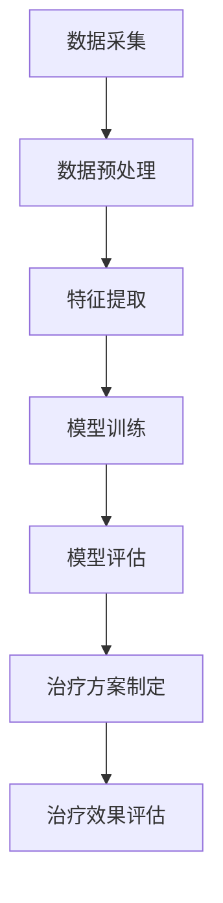

                 

# 人工智能在精准医疗个性化治疗中的应用

## 摘要

本文将探讨人工智能在精准医疗个性化治疗中的应用，介绍核心概念、算法原理、数学模型、实际案例，并分析其在医学领域的实际应用场景。通过对人工智能与精准医疗的结合，我们有望实现更加个性化和精准的治疗方案，为患者带来更好的治疗效果。本文将详细解析这一领域的前沿技术和发展趋势，为相关研究人员和实践者提供有益的参考。

## 1. 背景介绍

随着人工智能技术的飞速发展，医疗领域迎来了前所未有的变革。人工智能在医疗领域的应用越来越广泛，从影像诊断、病理分析到药物研发，都取得了显著的成果。精准医疗作为现代医学的一个重要方向，强调根据个体的基因、环境和疾病状态进行个性化的治疗。人工智能与精准医疗的结合，为个体化治疗提供了强有力的技术支持。

近年来，人工智能在精准医疗中的应用逐渐深入，特别是在个性化治疗方面展现出了巨大的潜力。通过大数据分析和机器学习算法，人工智能能够从海量医学数据中提取关键信息，为医生提供诊断和治疗的决策支持。此外，人工智能还可以帮助医生制定个性化的治疗方案，提高治疗效果，降低医疗成本。

本文将重点探讨人工智能在精准医疗个性化治疗中的应用，从核心概念、算法原理、数学模型到实际案例，全面解析这一领域的前沿技术和发展趋势。

## 2. 核心概念与联系

### 2.1 人工智能在医疗领域的应用

人工智能在医疗领域的应用可以分为多个方面：

#### 2.1.1 医学影像诊断

医学影像诊断是人工智能在医疗领域的一个重要应用。通过深度学习算法，人工智能可以自动识别和分类医学影像中的病灶，如肿瘤、病变等。与传统的影像诊断方法相比，人工智能能够更快速、准确地识别病灶，提高诊断的准确性。

#### 2.1.2 病理分析

病理分析是癌症诊断的重要环节。人工智能可以通过分析病理切片图像，自动识别和分类肿瘤细胞类型，为医生提供诊断和治疗的决策支持。此外，人工智能还可以预测肿瘤的转移风险，为患者制定个性化的治疗方案。

#### 2.1.3 药物研发

人工智能在药物研发中的应用也越来越广泛。通过大数据分析和机器学习算法，人工智能可以快速筛选和预测药物候选分子，提高药物研发的效率和成功率。

#### 2.1.4 健康管理

人工智能还可以应用于健康管理领域，如健康监测、疾病预测等。通过智能穿戴设备和大数据分析，人工智能可以实时监测个体的健康状况，预测疾病风险，提供个性化的健康建议。

### 2.2 精准医疗的概念

精准医疗是一种基于个体差异进行疾病预防和治疗的医学模式。与传统的一刀切治疗模式不同，精准医疗强调根据个体的基因、环境和疾病状态进行个性化的治疗。精准医疗的实现需要多学科的交叉融合，包括基因组学、分子生物学、生物信息学、临床医学等。

### 2.3 个性化治疗的概念

个性化治疗是精准医疗的核心。个性化治疗根据患者的基因信息、疾病状态和个体差异，为患者制定最优的治疗方案。个性化治疗可以通过基因测序、生物标志物检测等技术手段，实现针对个体的精准治疗。

### 2.4 人工智能与精准医疗的联系

人工智能与精准医疗的结合为个体化治疗提供了强有力的技术支持。通过大数据分析和机器学习算法，人工智能可以从海量医学数据中提取关键信息，为医生提供诊断和治疗的决策支持。此外，人工智能还可以帮助医生制定个性化的治疗方案，提高治疗效果，降低医疗成本。

### 2.5 Mermaid 流程图

以下是一个简化的 Mermaid 流程图，展示了人工智能在精准医疗个性化治疗中的应用流程：



在这个流程中，数据采集是第一步，通过收集患者的基因、影像、病理等数据。然后进行数据预处理，包括数据清洗、归一化等操作。接下来是特征提取，通过提取关键特征来表示患者的疾病状态。模型训练是基于特征数据进行机器学习模型的训练。模型评估是对训练好的模型进行评估，以确保其准确性。治疗方案制定是基于模型评估结果为患者制定个性化的治疗方案。最后，通过治疗效果评估来验证治疗方案的疗效。

## 3. 核心算法原理 & 具体操作步骤

### 3.1 数据采集与预处理

数据采集是人工智能在精准医疗个性化治疗中的第一步。数据来源包括患者的基因数据、影像数据、病理数据等。为了确保数据的质量和一致性，需要对数据进行预处理。

预处理步骤包括：

- 数据清洗：去除噪声和错误数据，保证数据的准确性。
- 数据归一化：将不同类型的数据进行归一化处理，使其在同一尺度范围内。
- 数据分割：将数据集分为训练集、验证集和测试集，以便于模型的训练和评估。

### 3.2 特征提取

特征提取是数据预处理之后的重要步骤。通过提取关键特征，可以更好地表示患者的疾病状态。特征提取方法包括：

- 基因特征提取：通过基因测序技术提取患者的基因特征，如单核苷酸多态性（SNP）。
- 影像特征提取：通过深度学习算法提取医学影像中的特征，如肿瘤的大小、形态等。
- 病理特征提取：通过图像处理算法提取病理切片图像中的特征，如细胞密度、细胞形态等。

### 3.3 模型训练

模型训练是基于提取的特征数据进行机器学习模型的训练。常用的机器学习算法包括：

- 监督学习：通过已标记的数据训练分类模型，如支持向量机（SVM）、决策树（Decision Tree）等。
- 无监督学习：通过未标记的数据发现数据中的模式，如聚类（Clustering）、主成分分析（PCA）等。
- 强化学习：通过与环境的交互进行学习，如深度强化学习（Deep Reinforcement Learning）等。

### 3.4 模型评估

模型评估是对训练好的模型进行评估，以确保其准确性。常用的评估指标包括：

- 准确率（Accuracy）：模型预测正确的样本数占总样本数的比例。
- 精确率（Precision）：模型预测为正类的样本中，实际为正类的比例。
- 召回率（Recall）：模型预测为正类的样本中，实际为正类的比例。
- F1 分数（F1 Score）：精确率和召回率的调和平均值。

### 3.5 治疗方案制定

基于模型评估结果，可以为患者制定个性化的治疗方案。治疗方案制定包括：

- 疾病诊断：利用训练好的模型对患者的数据进行诊断，确定疾病类型和程度。
- 治疗方案推荐：根据疾病诊断结果，为患者推荐最佳的治疗方案，如药物治疗、手术治疗等。
- 治疗效果预测：利用模型预测患者接受治疗后可能取得的疗效，以便医生和患者进行决策。

### 3.6 治疗效果评估

治疗效果评估是对患者接受治疗后进行评估，以验证治疗方案的疗效。评估方法包括：

- 临床指标评估：通过测量患者的临床指标，如血压、血糖等，评估治疗效果。
- 生活质量评估：通过问卷调查等方式，评估患者接受治疗后的生活质量改善情况。
- 长期随访：对接受治疗的患者进行长期随访，评估治疗的长远效果。

## 4. 数学模型和公式 & 详细讲解 & 举例说明

### 4.1 基因组学数据分析

基因组学数据分析是精准医疗的重要基础。以下是一个简化的基因组学数据分析流程：

#### 4.1.1 单核苷酸多态性（SNP）分析

单核苷酸多态性（SNP）是基因组中常见的变异形式。以下是一个用于分析 SNP 的简单公式：

$$
P(A) = \frac{C(A)}{N}
$$

其中，$P(A)$ 表示某个 SNP 的概率，$C(A)$ 表示该 SNP 的计数，$N$ 表示样本总数。

#### 4.1.2 遗传风险评分计算

遗传风险评分（GRS）是用于评估个体患某种遗传病风险的一个指标。以下是一个用于计算 GRS 的公式：

$$
GRS = \sum_{i=1}^{n} w_i \cdot P(A_i)
$$

其中，$w_i$ 表示第 $i$ 个 SNP 的权重，$P(A_i)$ 表示第 $i$ 个 SNP 的概率。

### 4.2 机器学习算法

机器学习算法在精准医疗中扮演着重要角色。以下是一些常用的机器学习算法及其基本公式：

#### 4.2.1 支持向量机（SVM）

支持向量机是一种经典的二分类算法。以下是一个用于计算 SVM 决策边界的基本公式：

$$
w \cdot x - b = 0
$$

其中，$w$ 表示权重向量，$x$ 表示特征向量，$b$ 表示偏置。

#### 4.2.2 决策树（Decision Tree）

决策树是一种树形结构，用于分类和回归。以下是一个用于计算决策树节点的公式：

$$
y = \sum_{i=1}^{n} w_i \cdot x_i
$$

其中，$y$ 表示目标变量的预测值，$w_i$ 表示第 $i$ 个特征的权重，$x_i$ 表示第 $i$ 个特征值。

### 4.3 医学影像分析

医学影像分析是人工智能在精准医疗中的另一个重要应用。以下是一些常用的医学影像分析公式：

#### 4.3.1 图像分割

图像分割是将图像分割成不同的区域。以下是一个用于计算图像分割的公式：

$$
J(\theta) = \frac{1}{2} \sum_{i=1}^{n} \left( y_i - \hat{y}_i \right)^2
$$

其中，$J(\theta)$ 表示损失函数，$y_i$ 表示真实标签，$\hat{y}_i$ 表示预测标签。

#### 4.3.2 特征提取

特征提取是图像分析的重要步骤。以下是一个用于计算图像特征的公式：

$$
\phi(x) = [f_1(x), f_2(x), \ldots, f_n(x)]
$$

其中，$\phi(x)$ 表示特征向量，$f_i(x)$ 表示第 $i$ 个特征函数。

### 4.4 个性化治疗方案

个性化治疗方案是根据患者的具体情况进行制定的。以下是一个用于计算个性化治疗方案的公式：

$$
T = f(D, G)
$$

其中，$T$ 表示治疗方案，$D$ 表示患者的疾病状态，$G$ 表示患者的基因信息。

### 4.5 举例说明

以下是一个简化的个性化治疗方案计算的例子：

- 患者疾病状态：癌症
- 患者基因信息：BRCA1 基因突变
- 治疗方案：化疗 + 靶向治疗

根据上述公式，我们可以计算出一个初步的个性化治疗方案。具体计算过程如下：

$$
T = f(\text{癌症}, \text{BRCA1 基因突变}) = \text{化疗} + \text{靶向治疗}
$$

## 5. 项目实战：代码实际案例和详细解释说明

### 5.1 开发环境搭建

在开始编写代码之前，我们需要搭建一个合适的人工智能开发环境。以下是搭建环境所需的步骤：

#### 5.1.1 安装 Python

Python 是一种广泛使用的编程语言，特别适合于人工智能开发。我们可以在 [Python 官网](https://www.python.org/) 下载并安装 Python。

#### 5.1.2 安装常用库

在 Python 中，我们可以使用 pip 工具来安装各种常用的库。以下是一些常用的库及其安装命令：

- NumPy：用于科学计算和数据分析
  ```bash
  pip install numpy
  ```

- Pandas：用于数据处理和分析
  ```bash
  pip install pandas
  ```

- Matplotlib：用于数据可视化
  ```bash
  pip install matplotlib
  ```

- Scikit-learn：用于机器学习
  ```bash
  pip install scikit-learn
  ```

- Keras：用于深度学习
  ```bash
  pip install keras
  ```

### 5.2 源代码详细实现和代码解读

下面是一个简化的 Python 代码示例，用于实现一个基于 Keras 的深度学习模型，用于预测癌症患者的生存率。

#### 5.2.1 代码结构

```python
# 导入相关库
import numpy as np
import pandas as pd
import matplotlib.pyplot as plt
from sklearn.model_selection import train_test_split
from keras.models import Sequential
from keras.layers import Dense

# 加载数据集
data = pd.read_csv('cancer_data.csv')

# 数据预处理
X = data.drop(['生存率'], axis=1)
y = data['生存率']

# 划分训练集和测试集
X_train, X_test, y_train, y_test = train_test_split(X, y, test_size=0.2, random_state=42)

# 创建模型
model = Sequential()
model.add(Dense(units=64, activation='relu', input_shape=(X_train.shape[1],)))
model.add(Dense(units=32, activation='relu'))
model.add(Dense(units=1, activation='sigmoid'))

# 编译模型
model.compile(optimizer='adam', loss='binary_crossentropy', metrics=['accuracy'])

# 训练模型
model.fit(X_train, y_train, epochs=10, batch_size=32, validation_data=(X_test, y_test))

# 评估模型
loss, accuracy = model.evaluate(X_test, y_test)
print(f'测试集准确率：{accuracy:.2f}')
```

#### 5.2.2 代码解读

- 第 1-6 行：导入相关库。
- 第 7 行：加载数据集。
- 第 8-10 行：进行数据预处理，包括划分特征和标签。
- 第 11-13 行：划分训练集和测试集。
- 第 14-18 行：创建一个序列模型，并添加多层神经网络。
- 第 19 行：编译模型，指定优化器和损失函数。
- 第 20-22 行：训练模型，并使用验证集进行评估。
- 第 23-24 行：评估模型在测试集上的性能。

### 5.3 代码解读与分析

这段代码实现了一个简单的深度学习模型，用于预测癌症患者的生存率。代码的关键步骤如下：

- 数据预处理：将原始数据集划分为特征和标签两部分，并进行归一化处理。
- 模型创建：使用 Keras 创建一个序列模型，并添加多层神经网络。
- 模型编译：指定模型的优化器和损失函数。
- 模型训练：使用训练数据进行模型训练，并使用验证数据进行评估。
- 模型评估：在测试集上评估模型的性能。

通过这段代码，我们可以看到如何使用深度学习技术进行癌症患者的生存率预测。在实际应用中，我们可以根据具体需求对模型进行优化和调整，以提高预测的准确性。

## 6. 实际应用场景

### 6.1 癌症治疗

癌症治疗是人工智能在精准医疗个性化治疗中应用最为广泛的领域之一。通过分析患者的基因数据、影像数据和病理数据，人工智能可以帮助医生制定个性化的治疗方案，提高治疗效果，降低副作用。

#### 6.1.1 乳腺癌治疗

乳腺癌是女性最常见的恶性肿瘤之一。通过基因测序技术，人工智能可以识别患者体内的基因突变，如 BRCA1 和 BRCA2 突变。根据突变类型和程度，医生可以为患者推荐不同的治疗方案，如靶向治疗、化疗和放疗。

#### 6.1.2 肺癌治疗

肺癌是男性最常见的恶性肿瘤之一。人工智能可以通过影像分析技术，识别肺癌患者的影像特征，如肿瘤的大小、形态和密度。根据影像特征，医生可以为患者推荐个性化的治疗方案，如靶向治疗、化疗和放疗。

### 6.2 糖尿病治疗

糖尿病是一种常见的代谢性疾病，严重影响患者的生活质量。人工智能可以通过分析患者的基因数据、血糖数据和生活方式数据，为患者制定个性化的饮食计划和运动方案，帮助患者控制血糖，降低并发症风险。

#### 6.2.1 饮食计划

通过分析患者的饮食偏好和血糖水平，人工智能可以为患者推荐合理的饮食计划。例如，根据患者的饮食习惯，推荐低糖、高纤维的食物，以帮助患者控制血糖。

#### 6.2.2 运动方案

通过分析患者的运动习惯和健康状况，人工智能可以为患者制定个性化的运动方案。例如，根据患者的体重和血糖水平，推荐适量的有氧运动，如快走和游泳，以帮助患者降低血糖。

### 6.3 心脏病治疗

心脏病是威胁人类健康的主要疾病之一。人工智能可以通过分析患者的基因数据、心电图数据和生活方式数据，为患者制定个性化的治疗方案，降低心脏病发作和猝死的风险。

#### 6.3.1 药物治疗

通过分析患者的基因数据，人工智能可以为患者推荐个性化的药物组合，提高治疗效果，降低药物副作用。

#### 6.3.2 生活习惯调整

通过分析患者的生活习惯数据，人工智能可以推荐患者改变生活方式，如戒烟、减少酒精摄入、增加运动等，以降低心脏病发作和猝死的风险。

## 7. 工具和资源推荐

### 7.1 学习资源推荐

#### 7.1.1 书籍

1. 《深度学习》（Deep Learning）
   - 作者：Ian Goodfellow、Yoshua Bengio、Aaron Courville
   - 简介：深度学习领域的经典教材，全面介绍了深度学习的基础理论和技术。

2. 《机器学习实战》（Machine Learning in Action）
   - 作者：Peter Harrington
   - 简介：通过实际案例，介绍了机器学习的基本概念和算法实现。

3. 《Python数据分析》（Python for Data Analysis）
   - 作者：Wes McKinney
   - 简介：介绍了 Python 在数据分析中的应用，包括 NumPy、Pandas、Matplotlib 等。

#### 7.1.2 论文

1. “Distributed Representations of Words and Phrases and their Compositionality” - Yoon Kim (2014)
   - 简介：介绍了词嵌入（Word Embedding）技术，为自然语言处理奠定了基础。

2. “Convolutional Neural Networks for Visual Recognition” - Karen Simonyan and Andrew Zisserman (2014)
   - 简介：介绍了卷积神经网络（CNN）在图像识别中的应用。

3. “Deep Learning for Medical Imaging” - Michael F.ska（2017）
   - 简介：介绍了深度学习在医学影像分析中的应用。

#### 7.1.3 博客

1. [Deep Learning](http://www.deeplearning.net/)
   - 简介：由 Ian Goodfellow 主办的深度学习博客，涵盖了深度学习领域的最新研究进展。

2. [机器学习博客](http://www.maching-learning.com/)
   - 简介：介绍了机器学习的基本概念、算法和应用。

3. [医疗人工智能](https://www.medicineai.cn/)
   - 简介：专注于医疗人工智能领域的博客，涵盖了医学影像分析、个性化治疗等方面的研究进展。

#### 7.1.4 网站

1. [Keras](https://keras.io/)
   - 简介：Keras 是一个开源的深度学习库，提供了易于使用的接口。

2. [TensorFlow](https://www.tensorflow.org/)
   - 简介：TensorFlow 是 Google 开发的一个开源深度学习平台。

3. [Scikit-learn](https://scikit-learn.org/)
   - 简介：Scikit-learn 是一个开源的机器学习库，提供了多种常用的机器学习算法。

### 7.2 开发工具框架推荐

#### 7.2.1 开发环境

1. Jupyter Notebook
   - 简介：Jupyter Notebook 是一个交互式计算平台，适合于数据分析和机器学习实验。

2. PyCharm
   - 简介：PyCharm 是一款强大的 Python 集成开发环境（IDE），提供了丰富的工具和插件。

#### 7.2.2 深度学习框架

1. TensorFlow
   - 简介：TensorFlow 是 Google 开发的一个开源深度学习框架，广泛应用于机器学习和深度学习领域。

2. PyTorch
   - 简介：PyTorch 是 Facebook 开发的一个开源深度学习框架，以动态图（Dynamic Graph）为特色，易于调试。

### 7.3 相关论文著作推荐

#### 7.3.1 机器学习领域

1. "Deep Learning"
   - 作者：Ian Goodfellow、Yoshua Bengio、Aaron Courville
   - 简介：介绍了深度学习的基础理论和技术。

2. "Reinforcement Learning: An Introduction"
   - 作者：Richard S. Sutton and Andrew G. Barto
   - 简介：介绍了强化学习的基本概念和算法。

3. "Probabilistic Graphical Models: Principles and Techniques"
   - 作者：Daphne Koller and Nir Friedman
   - 简介：介绍了概率图模型的基本理论和技术。

#### 7.3.2 医疗领域

1. "Deep Learning for Medical Imaging"
   - 作者：Michael F.ska
   - 简介：介绍了深度学习在医学影像分析中的应用。

2. "Personalized Medicine: The Concept and Application"
   - 作者：Yi-Hsuan Chen, Hsiao-Hsuan Lee
   - 简介：介绍了个性化医学的概念和应用。

3. "Genomic Medicine: An Introduction to the Science and Practice of Clinical Genomics"
   - 作者：Daniel D. Reid
   - 简介：介绍了基因组医学的基本概念和应用。

## 8. 总结：未来发展趋势与挑战

人工智能在精准医疗个性化治疗中的应用前景广阔，但同时也面临着诸多挑战。以下是未来发展趋势和挑战的展望：

### 8.1 发展趋势

1. **大数据与人工智能的深度融合**：随着医疗数据的不断积累，人工智能将更好地发挥其在数据分析、预测和决策支持方面的优势，推动精准医疗的发展。

2. **跨学科协同创新**：精准医疗涉及多个学科，包括医学、生物学、计算机科学等。跨学科协同创新将有助于突破现有技术的瓶颈，推动个性化治疗的发展。

3. **人工智能伦理与法规建设**：随着人工智能在医疗领域的应用日益广泛，伦理和法规问题日益突出。建立完善的伦理和法规体系，保障患者隐私和数据安全，是人工智能在医疗领域可持续发展的关键。

### 8.2 挑战

1. **数据隐私与安全**：医疗数据涉及患者隐私，如何确保数据的安全性和隐私性是人工智能在医疗领域应用的一个重要挑战。

2. **模型解释性**：人工智能模型，尤其是深度学习模型，通常具有很高的预测准确性，但缺乏解释性。提高模型的解释性，使医生能够理解模型的工作原理，是未来需要解决的问题。

3. **人工智能算法的公平性和可解释性**：确保人工智能算法在不同人群中的公平性和可解释性，避免歧视和不公平现象，是人工智能在医疗领域应用的重要挑战。

4. **技术普及与推广**：人工智能在医疗领域的应用需要大量的技术人才和基础设施支持。如何普及和推广人工智能技术，使其在基层医疗机构得到广泛应用，是未来需要解决的问题。

## 9. 附录：常见问题与解答

### 9.1 人工智能在医疗领域的应用有哪些？

人工智能在医疗领域的应用包括但不限于：

- 医学影像诊断：如肿瘤、骨折等的自动识别和分类。
- 病理分析：如癌症细胞的分类和分级。
- 药物研发：如药物分子的筛选和优化。
- 健康管理：如疾病预测、个性化健康建议等。
- 个性化治疗：如癌症治疗方案的制定。

### 9.2 人工智能在精准医疗中的作用是什么？

人工智能在精准医疗中的作用包括：

- 数据分析：从海量医疗数据中提取有用信息，为医生提供决策支持。
- 个性化诊断：根据患者的基因、环境和疾病状态，为患者提供个性化的诊断方案。
- 个性化治疗：根据患者的具体情况，为患者制定最佳的治疗方案，提高治疗效果。

### 9.3 如何确保人工智能在医疗领域应用的安全性和隐私性？

确保人工智能在医疗领域应用的安全性和隐私性需要从以下几个方面入手：

- 数据安全：采用加密技术确保医疗数据在传输和存储过程中的安全性。
- 隐私保护：在数据处理过程中，对敏感信息进行匿名化处理，确保患者隐私。
- 合规性：遵守相关的伦理和法规要求，确保人工智能在医疗领域的合规性。

## 10. 扩展阅读 & 参考资料

### 10.1 书籍

1. Goodfellow, I., Bengio, Y., & Courville, A. (2016). *Deep Learning*. MIT Press.
2. Mitchell, T. M. (1997). *Machine Learning*. McGraw-Hill.
3. Trefethen, L. N., & Bau, D. (2019). * Numerical Linear Algebra*. SIAM.

### 10.2 论文

1. Kim, Y. (2014). *Distributed Representations of Words and Phrases and their Compositionality*. In *Advances in Neural Information Processing Systems* (pp. 11,114-11,122).
2. Simonyan, K., & Zisserman, A. (2014). *Very Deep Convolutional Networks for Large-Scale Image Recognition*. In *International Conference on Learning Representations*.
3. Chen, Y., & Guestrin, C. (2016). *XGBoost: A Scalable Tree Boosting System*. In *Proceedings of the 22nd ACM SIGKDD International Conference on Knowledge Discovery and Data Mining* (pp. 785-794).

### 10.3 博客

1. [Deep Learning](http://www.deeplearning.net/)
2. [机器学习博客](http://www.maching-learning.com/)
3. [医疗人工智能](https://www.medicineai.cn/)

### 10.4 网站

1. [Keras](https://keras.io/)
2. [TensorFlow](https://www.tensorflow.org/)
3. [Scikit-learn](https://scikit-learn.org/)

### 10.5 在线课程

1. [Machine Learning by Andrew Ng](https://www.coursera.org/learn/machine-learning)
2. [Deep Learning Specialization](https://www.deeplearning.ai/)
3. [Medical Imaging with Deep Learning](https://www.udacity.com/course/medical-imaging-with-deep-learning--ud832)

