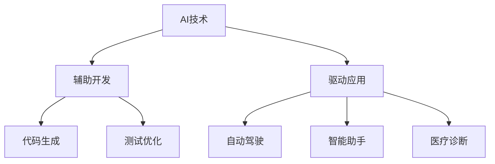

                 

### 背景介绍

#### 人工智能的崛起

近年来，人工智能（AI）技术取得了前所未有的进展，不仅改变了我们的生活方式，还在各个领域产生了深远的影响。AI技术涵盖了机器学习、深度学习、自然语言处理、计算机视觉等多个领域，其中机器学习尤为引人注目。机器学习算法，特别是深度学习算法，通过从大量数据中学习模式，已经能够在图像识别、语音识别、游戏对弈等方面实现超人类的表现。

#### 传统软件开发的挑战

在传统软件开发领域，开发人员通常依赖于明确的业务需求和功能规范来设计、实现和测试软件。然而，随着业务需求的不断变化和复杂性的增加，传统软件开发模式面临着巨大的挑战。首先，软件需求的变化频繁，导致项目开发周期延长和成本上升。其次，传统开发方法在应对大规模数据处理和实时决策时显得力不从心。此外，随着软件系统规模的扩大，维护和升级的难度也显著增加。

#### 人工智能与传统软件开发的关系

人工智能的崛起为传统软件开发带来了新的机遇和挑战。一方面，AI技术可以协助开发人员自动化软件设计、测试和优化过程，提高开发效率和软件质量。例如，使用AI辅助的代码生成工具可以显著减少编码时间，使用AI算法进行软件测试可以更快速地发现和修复缺陷。另一方面，人工智能技术本身也需要软件开发的支持，包括数据预处理、模型训练、模型部署等环节。

本文将围绕人工智能对传统软件开发的吞噬这一主题，探讨AI技术在软件开发中的应用、挑战及其未来发展趋势。通过深入分析AI技术的核心概念、算法原理和实际应用案例，本文旨在为读者提供一个全面而深刻的理解，帮助开发人员把握AI时代的发展趋势，应对未来软件开发的挑战。

### 核心概念与联系

#### 1. 人工智能的定义与分类

人工智能（AI）是模拟、延伸和扩展人类智能的理论、方法、技术及应用。根据AI技术实现的方式和任务目标，可以将其分为几种主要类型：

- **弱人工智能（Narrow AI）**：专注于特定任务，如语音识别、图像识别等，不具备泛化能力。
- **强人工智能（General AI）**：具备人类智能的广泛能力和意识，能够在各种环境和任务中表现，目前尚处于理论研究阶段。
- **深度学习（Deep Learning）**：一种机器学习技术，通过多层神经网络进行数据处理和模式识别，是当前AI研究的热点。

#### 2. 软件开发的定义与过程

软件开发是指创建和构建软件系统的一系列过程，包括需求分析、设计、实现、测试和维护等。传统软件开发主要依赖于以下方法和流程：

- **瀑布模型（Waterfall Model）**：一种线性顺序的开发模型，各阶段严格顺序进行，前一个阶段完成后才开始下一个阶段。
- **敏捷开发（Agile Development）**：一种迭代和增量的开发方法，注重灵活性和快速响应需求变化。

#### 3. AI与软件开发的联系

AI与软件开发之间的联系主要体现在以下几个方面：

- **AI辅助开发**：AI技术可以辅助开发人员完成代码生成、测试和优化等任务，提高开发效率和质量。例如，AI算法可以自动生成代码片段，减少重复性工作。
- **AI驱动的应用**：许多新兴应用，如自动驾驶、智能助手、医疗诊断等，依赖于AI技术进行数据处理和决策。软件开发人员需要掌握AI技术，以构建这些创新应用。
- **AI需求与设计**：AI技术的应用需求直接影响软件开发的设计和实现。例如，自动驾驶系统需要高效、可靠的软件框架来支持实时决策。

为了更直观地展示AI与软件开发之间的联系，以下是一个简化的Mermaid流程图：



通过这个流程图，我们可以看到AI技术在软件开发中的应用场景和相互关系，为后续章节的具体分析提供了基础。

### 核心算法原理 & 具体操作步骤

#### 1. 机器学习算法原理

机器学习（Machine Learning，ML）是人工智能的核心技术之一，它通过从数据中学习模式和规律，实现自动化决策和预测。机器学习算法主要分为监督学习（Supervised Learning）、无监督学习（Unsupervised Learning）和强化学习（Reinforcement Learning）三种类型。

- **监督学习**：有标签数据集，算法学习输入和输出之间的映射关系。常见的算法包括线性回归（Linear Regression）、逻辑回归（Logistic Regression）、支持向量机（SVM）等。
- **无监督学习**：无标签数据集，算法发现数据中的结构和模式。常见的算法包括聚类（Clustering）、主成分分析（PCA）、自编码器（Autoencoder）等。
- **强化学习**：通过环境与智能体的交互，学习最优策略。常见的算法包括Q学习（Q-Learning）、深度确定性策略梯度（DDPG）等。

#### 2. 深度学习算法原理

深度学习（Deep Learning，DL）是机器学习的一种重要分支，通过多层神经网络（Neural Networks）进行数据建模和特征提取。深度学习算法的核心是神经网络，它由输入层、隐藏层和输出层组成。每个层由多个神经元（Neurons）构成，神经元之间通过权重（Weights）和偏置（Bias）进行连接。

- **前向传播（Forward Propagation）**：数据从输入层经过隐藏层传递到输出层，每个神经元计算输入的加权求和并加上偏置，然后通过激活函数（Activation Function）得到输出。
- **反向传播（Backpropagation）**：计算输出层的误差，然后反向传播到隐藏层，更新每个神经元的权重和偏置，以最小化总误差。

#### 3. 自然语言处理算法原理

自然语言处理（Natural Language Processing，NLP）是人工智能的一个分支，旨在使计算机能够理解、生成和处理自然语言。NLP算法主要包括文本预处理、词嵌入、语言模型、序列标注和机器翻译等。

- **文本预处理**：包括分词（Tokenization）、去停用词（Stopword Removal）、词性标注（Part-of-Speech Tagging）等，以简化文本数据结构。
- **词嵌入**：将词汇映射到高维向量空间，使得具有相似语义的词汇在空间中更接近。常见的词嵌入方法包括Word2Vec、GloVe等。
- **语言模型**：通过统计方法或神经网络模型预测下一个单词或字符的概率。常见的算法包括N-gram模型、循环神经网络（RNN）、长短期记忆网络（LSTM）等。
- **序列标注**：对文本序列进行分类，如命名实体识别（Named Entity Recognition，NER）、词性标注（POS Tagging）等。
- **机器翻译**：将一种语言的文本翻译成另一种语言。常见的算法包括基于规则的方法、统计机器翻译（SMT）和神经机器翻译（NMT）。

#### 4. 实际操作步骤

以下是一个简化的深度学习算法操作步骤，以实现图像分类任务为例：

1. **数据集准备**：收集和整理大量带有标签的图像数据，用于训练和测试模型。
2. **数据预处理**：对图像进行缩放、裁剪、旋转等预处理操作，使其适应模型输入。
3. **模型设计**：设计一个卷积神经网络（Convolutional Neural Network，CNN）模型，包括多个卷积层、池化层和全连接层。
4. **模型训练**：使用训练数据集对模型进行训练，通过反向传播算法更新模型参数。
5. **模型评估**：使用测试数据集评估模型性能，包括准确率、召回率、F1分数等指标。
6. **模型优化**：根据评估结果调整模型参数，以提高模型性能。
7. **模型部署**：将训练好的模型部署到实际应用场景，如图像分类应用。

通过以上步骤，我们可以实现一个基本的图像分类系统，这只是一个简单的例子，实际应用中的深度学习项目会涉及更多的技术和细节。

### 数学模型和公式 & 详细讲解 & 举例说明

#### 1. 线性回归模型

线性回归（Linear Regression）是一种基本的机器学习算法，用于预测连续值变量。其数学模型可以表示为：

\[ y = \beta_0 + \beta_1x_1 + \beta_2x_2 + \ldots + \beta_nx_n + \epsilon \]

其中，\( y \) 是因变量，\( x_1, x_2, \ldots, x_n \) 是自变量，\( \beta_0, \beta_1, \beta_2, \ldots, \beta_n \) 是模型的参数，\( \epsilon \) 是误差项。

线性回归模型的参数可以通过最小二乘法（Least Squares Method）进行估计，具体公式如下：

\[ \hat{\beta} = (X^T X)^{-1} X^T y \]

其中，\( X \) 是自变量的矩阵，\( y \) 是因变量的向量，\( \hat{\beta} \) 是参数的估计值。

#### 2. 逻辑回归模型

逻辑回归（Logistic Regression）是一种用于预测离散二分类结果的算法。其数学模型可以表示为：

\[ P(y=1) = \frac{1}{1 + e^{-(\beta_0 + \beta_1x_1 + \beta_2x_2 + \ldots + \beta_nx_n)}} \]

其中，\( P(y=1) \) 是因变量为1的概率，\( x_1, x_2, \ldots, x_n \) 是自变量，\( \beta_0, \beta_1, \beta_2, \ldots, \beta_n \) 是模型的参数。

逻辑回归模型的参数可以通过极大似然估计（Maximum Likelihood Estimation，MLE）进行估计，具体公式如下：

\[ \hat{\beta} = \arg\max_{\beta} \ln L(\beta) \]

其中，\( L(\beta) \) 是似然函数，可以表示为：

\[ L(\beta) = \prod_{i=1}^n P(y_i = y_i| \beta) \]

#### 3. 卷积神经网络模型

卷积神经网络（Convolutional Neural Network，CNN）是一种广泛应用于计算机视觉任务的深度学习模型。其核心组成部分包括卷积层（Convolutional Layer）、池化层（Pooling Layer）和全连接层（Fully Connected Layer）。

一个简单的CNN模型可以表示为：

\[ h_{l+1} = \sigma(\mathcal{F}(h_l; W_l) + b_l) \]

其中，\( h_l \) 是第 \( l \) 层的输出，\( \sigma \) 是激活函数，\( \mathcal{F} \) 是卷积操作，\( W_l \) 和 \( b_l \) 分别是卷积层和偏置层的参数。

卷积操作的公式可以表示为：

\[ (f \star h)(x) = \sum_{y} f(y)h(x-y) \]

其中，\( f \) 是卷积核，\( h \) 是输入数据，\( x \) 是坐标。

为了更直观地理解CNN模型，我们来看一个具体的例子：

假设我们有一个输入图像 \( I \) 和一个卷积核 \( K \)，它们的尺寸分别为 \( (28 \times 28) \) 和 \( (5 \times 5) \)。通过卷积操作，我们得到一个新的特征图 \( F \)：

\[ F(x, y) = \sum_{i=1}^{5} \sum_{j=1}^{5} K(i, j) I(x-i, y-j) \]

其中，\( (x, y) \) 是特征图的坐标，\( (i, j) \) 是卷积核的坐标。

通过这个例子，我们可以看到卷积神经网络如何从原始图像中提取特征，为后续的分类任务提供支持。

### 项目实战：代码实际案例和详细解释说明

为了更好地理解上述算法原理和数学模型，我们将通过一个简单的项目实战来展示如何使用Python和深度学习库（如TensorFlow和Keras）来实现一个基于卷积神经网络的图像分类器。

#### 1. 开发环境搭建

首先，我们需要搭建一个适合深度学习开发的Python环境。以下是步骤：

1. 安装Python（推荐版本3.8或更高）。
2. 安装Anaconda或Miniconda，以便管理和安装依赖库。
3. 使用conda创建一个新环境，并安装以下库：

```bash
conda create -n tensorflow_env python=3.8
conda activate tensorflow_env
conda install tensorflow numpy matplotlib
```

#### 2. 源代码详细实现和代码解读

以下是实现图像分类器的Python代码：

```python
import tensorflow as tf
from tensorflow.keras import layers
import numpy as np
import matplotlib.pyplot as plt

# 加载CIFAR-10数据集
(x_train, y_train), (x_test, y_test) = tf.keras.datasets.cifar10.load_data()

# 数据预处理
x_train = x_train.astype('float32') / 255.0
x_test = x_test.astype('float32') / 255.0
y_train = tf.keras.utils.to_categorical(y_train, 10)
y_test = tf.keras.utils.to_categorical(y_test, 10)

# 构建卷积神经网络模型
model = tf.keras.Sequential([
    layers.Conv2D(32, (3, 3), activation='relu', input_shape=(32, 32, 3)),
    layers.MaxPooling2D((2, 2)),
    layers.Conv2D(64, (3, 3), activation='relu'),
    layers.MaxPooling2D((2, 2)),
    layers.Conv2D(64, (3, 3), activation='relu'),
    layers.Flatten(),
    layers.Dense(64, activation='relu'),
    layers.Dense(10, activation='softmax')
])

# 编译模型
model.compile(optimizer='adam',
              loss='categorical_crossentropy',
              metrics=['accuracy'])

# 训练模型
history = model.fit(x_train, y_train, epochs=20, batch_size=64,
                    validation_data=(x_test, y_test))

# 评估模型
test_loss, test_acc = model.evaluate(x_test, y_test, verbose=2)
print('Test accuracy:', test_acc)

# 可视化训练过程
plt.plot(history.history['accuracy'], label='accuracy')
plt.plot(history.history['val_accuracy'], label='val_accuracy')
plt.xlabel('Epoch')
plt.ylabel('Accuracy')
plt.ylim(0, 1)
plt.legend(loc='lower right')
plt.show()
```

**代码解读**：

1. **数据集加载和预处理**：首先，我们使用TensorFlow的内置函数加载CIFAR-10数据集，并对图像数据进行归一化处理。
2. **模型构建**：我们构建一个简单的卷积神经网络模型，包括两个卷积层、一个池化层和一个全连接层。卷积层用于提取图像特征，池化层用于减小特征图尺寸，全连接层用于分类。
3. **模型编译**：我们使用adam优化器和交叉熵损失函数来编译模型。
4. **模型训练**：我们使用训练数据集训练模型，设置训练轮数和批量大小。
5. **模型评估**：在测试数据集上评估模型性能，打印测试准确率。
6. **可视化**：绘制训练过程中的准确率变化，以便分析模型性能。

#### 3. 代码解读与分析

- **数据预处理**：数据预处理是深度学习项目中的关键步骤。在这里，我们使用归一化处理将图像数据缩放到[0, 1]范围内，以提高模型训练效率。
- **模型构建**：我们使用TensorFlow的Keras API构建模型，这是一个简洁且易于理解的接口。卷积层通过卷积操作提取图像特征，池化层减小特征图尺寸以减少计算量。
- **模型编译**：在编译模型时，我们选择adam优化器，因为它在深度学习任务中通常表现良好。交叉熵损失函数适用于多分类问题，能够计算模型预测概率与实际标签之间的差异。
- **模型训练**：训练模型时，我们使用验证数据集来监控模型性能，防止过拟合。通过调整训练轮数和批量大小，我们可以控制模型训练的复杂度和效率。
- **模型评估**：在测试数据集上评估模型性能，以确定模型是否具备泛化能力。准确率是评估分类模型性能的常用指标。
- **可视化**：可视化训练过程中的准确率变化可以帮助我们理解模型训练过程，识别潜在问题，如过拟合或欠拟合。

通过这个实战项目，我们不仅实现了图像分类器，还详细解读了每一步的代码实现和原理，为读者提供了一个实际应用的例子。

### 实际应用场景

人工智能在软件开发中的应用场景日益广泛，涵盖了从辅助开发到核心驱动的多个方面。以下是一些具体的应用场景，展示了AI如何影响和改变传统软件开发模式。

#### 1. 自动化代码生成

AI技术可以自动生成代码，从而显著提高开发效率。例如，基于自然语言处理（NLP）的代码生成工具可以解析开发者编写的自然语言描述，自动生成相应的代码片段。这种技术不仅减少了手工编码的工作量，还能提高代码的一致性和准确性。谷歌的Tensor2Code项目就是一个典型的例子，它能够根据自然语言描述生成Python代码。

#### 2. 自动化测试

传统的软件测试方法通常依赖于手动编写测试用例，费时费力。而AI技术可以自动化测试流程，通过机器学习算法分析代码和软件行为，生成有效的测试用例。例如，Google的TestGen项目使用深度学习算法分析代码，自动生成高效的测试用例，从而提高了测试覆盖率和测试效率。

#### 3. 智能调试

AI技术可以帮助开发者更快速地定位和修复代码中的错误。智能调试工具利用AI算法分析代码行为和错误模式，提供实时错误预测和修复建议。例如，GitHub的CodeQL技术使用AI算法分析代码库，发现潜在的安全漏洞和代码问题，从而帮助开发者进行智能调试。

#### 4. 智能辅助开发

AI技术还可以在开发过程中提供智能辅助。例如，代码推荐工具可以根据开发者的编码习惯和项目上下文，提供实时代码建议，减少重复劳动。GitHub Copilot就是这样一个工具，它利用大型代码库和自然语言处理技术，为开发者提供代码补全和重构建议。

#### 5. 自动化部署

AI技术可以自动化软件部署流程，提高部署效率和稳定性。例如，使用AI算法进行容器编排和资源管理，可以自动调整资源分配，优化系统性能和资源利用率。AWS的ECS服务结合AI技术，提供了智能部署和扩展解决方案。

#### 6. 软件质量评估

AI技术可以用于评估软件质量，包括代码可读性、可维护性和安全性等。AI算法可以分析代码库，识别潜在问题并提供改进建议。例如，SonarQube等工具使用AI技术进行代码审查，自动检测代码质量问题和安全漏洞。

#### 7. 智能个性化应用

AI技术还可以根据用户行为和偏好，为用户提供个性化的软件和服务。例如，智能推荐系统可以根据用户的历史操作和偏好，推荐合适的软件功能或内容，从而提高用户体验。Netflix和Amazon等平台广泛采用AI技术实现个性化推荐。

这些实际应用场景展示了AI技术在软件开发中的广泛应用，不仅提高了开发效率和软件质量，还改变了传统软件开发的模式，使得开发过程更加智能化和自动化。

### 工具和资源推荐

在人工智能和软件开发领域，有许多优秀的工具和资源可以帮助开发者掌握新技术、提高工作效率。以下是一些推荐的学习资源、开发工具和论文著作，供读者参考。

#### 1. 学习资源推荐

- **书籍**：
  - 《深度学习》（Deep Learning）by Ian Goodfellow、Yoshua Bengio和Aaron Courville
  - 《Python机器学习》（Python Machine Learning）by Sebastian Raschka和Vincent Dubost
  - 《强化学习》（Reinforcement Learning: An Introduction）by Richard S. Sutton和Barto, Andrew G.
- **在线课程**：
  - Coursera的《机器学习》（Machine Learning）课程，由斯坦福大学教授Andrew Ng主讲
  - edX的《深度学习基础》（Deep Learning Fundamentals）课程，由密歇根大学教授Alonzo Church主讲
- **博客和网站**：
  - fast.ai：提供了丰富的深度学习教程和资源
  - Medium上的深度学习和机器学习专栏，包括行业专家的见解和最新研究

#### 2. 开发工具框架推荐

- **深度学习库**：
  - TensorFlow：由Google开发的开源深度学习框架，功能强大且社区活跃
  - PyTorch：由Facebook开发的开源深度学习库，易用且灵活
  - Keras：基于TensorFlow和Theano的高层神经网络API，适用于快速原型开发
- **代码生成工具**：
  - TabNine：基于AI的代码补全工具，支持多种编程语言
  - GitHub Copilot：GitHub推出的AI编程助手，基于大型代码库进行代码推荐
- **自动化测试工具**：
  - Selenium：用于Web应用的自动化测试框架
  - Pytest：Python的测试框架，支持单元测试和功能测试
- **容器化工具**：
  - Docker：用于创建、运行和分发容器的开源工具
  - Kubernetes：用于容器编排和自动化部署的开源平台

#### 3. 相关论文著作推荐

- **论文**：
  - “A Theoretical Basis for Comparing Generative Adversarial Networks” by Y. LeCun, Y. Bengio, and G. Hinton
  - “Deep Neural Networks for Classification: A Comprehensive Study” by Y. Bengio et al.
  - “Attention Is All You Need” by V. Vaswani et al.
- **著作**：
  - 《动手学深度学习》（Dive into Deep Learning）by A. Anastasios, F. Soumith Chintala和E. Y. Liu
  - 《深度学习：理论、算法与应用》（Deep Learning: Theory and Algorithms）by A. Yao、杨强和吴建平
  - 《强化学习导论》（Introduction to Reinforcement Learning）by J. Sutton和A. Barto

这些工具和资源为开发者提供了全面的技术支持和学习途径，有助于他们深入了解人工智能和深度学习，提升软件开发能力。

### 总结：未来发展趋势与挑战

#### 人工智能与传统软件开发融合

随着人工智能技术的不断发展，它正逐步与传统软件开发融合，带来了一系列新的发展机遇。AI技术不仅提高了软件开发的效率和质量，还推动了软件智能化和自动化的发展。未来，人工智能将继续在软件开发中发挥关键作用，实现从辅助开发到核心驱动的全面转变。

#### 软件开发的智能化与自动化

人工智能技术将使软件开发过程更加智能化和自动化。例如，AI驱动的代码生成工具、自动化测试工具和智能调试工具将大大减轻开发人员的负担，提高开发效率。此外，AI技术还将推动软件开发模式的创新，如基于AI的敏捷开发方法，使得软件系统能够更快地响应市场需求。

#### 软件开发人员技能需求的转变

随着AI技术在软件开发中的广泛应用，开发人员的技能需求也在发生变化。未来的软件开发人员不仅需要掌握传统的编程技能，还需要熟悉机器学习、深度学习和自然语言处理等AI技术。同时，开发人员需要具备良好的数据科学素养，能够处理和分析大量数据。

#### 挑战与应对策略

尽管人工智能为软件开发带来了诸多机遇，但也面临着一系列挑战。

1. **技术挑战**：AI技术的发展速度极快，开发人员需要不断学习和更新知识，以应对不断变化的技术环境。此外，AI算法的复杂性和计算需求也对开发人员提出了更高的要求。
2. **伦理挑战**：AI技术在软件开发中的应用引发了伦理和隐私问题。例如，自动化决策系统的公平性和透明度问题，以及数据隐私和安全问题。开发人员需要关注这些问题，并采取相应的措施确保AI技术的伦理和合规性。
3. **人才短缺**：随着AI技术在软件开发中的应用，对专业人才的需求迅速增加。然而，当前AI领域的专业人才仍然相对短缺，这限制了AI技术的进一步推广和应用。因此，培养和引进AI人才成为关键挑战。

#### 未来展望

展望未来，人工智能将继续在软件开发中发挥重要作用，推动软件技术和应用的发展。以下是几个潜在的发展趋势：

1. **智能软件开发**：智能软件系统将具备自我学习和自我优化能力，能够根据用户行为和需求动态调整系统功能。
2. **个性化软件**：AI技术将使得软件系统能够根据用户行为和偏好提供个性化的体验，从而提升用户体验。
3. **云计算与边缘计算的结合**：随着云计算和边缘计算的发展，AI技术将更好地与这两种计算模式结合，实现更高效的数据处理和实时决策。
4. **跨领域应用**：AI技术在医疗、金融、教育等多个领域的应用将不断拓展，推动相关行业的数字化转型。

总之，人工智能正在吞噬传统软件开发，为软件开发带来了前所未有的机遇和挑战。开发人员需要积极应对这些变化，不断学习和适应，以在AI时代保持竞争力。

### 附录：常见问题与解答

#### 1. 人工智能对软件开发的影响是什么？

人工智能对软件开发的影响主要体现在提高开发效率、优化开发流程、提升软件质量和增强用户体验等方面。通过自动化代码生成、智能调试、自动化测试等技术，AI可以显著减少开发人员的重复性工作，提高生产效率。同时，AI技术还可以帮助开发人员更快速地发现和修复软件缺陷，提高软件质量。

#### 2. 人工智能技术如何改变软件开发模式？

人工智能技术改变了软件开发的传统模式，推动了软件开发向智能化和自动化方向发展。例如，AI驱动的代码生成工具和自动化测试工具使得软件开发生命周期中的许多步骤可以自动化完成，减少了人工干预。此外，AI技术还支持敏捷开发方法，使得软件系统能够更快地响应市场需求，实现持续交付。

#### 3. 开发人员需要掌握哪些技能才能应对人工智能带来的挑战？

开发人员需要掌握以下技能以应对人工智能带来的挑战：

- 编程技能：掌握至少一种编程语言，如Python、Java等，这是基础技能。
- 数据科学素养：了解数据预处理、统计分析、机器学习等数据科学基础。
- 深度学习和自然语言处理：掌握深度学习框架（如TensorFlow、PyTorch）和自然语言处理技术。
- 数学基础：具备一定的数学基础，特别是线性代数、概率论和统计学。
- 跨领域知识：了解云计算、边缘计算、大数据等领域的基本知识。

#### 4. 人工智能在软件开发中的应用有哪些？

人工智能在软件开发中的应用非常广泛，包括：

- 自动化代码生成：使用AI技术自动生成代码，提高开发效率。
- 自动化测试：利用AI算法自动化生成测试用例，提高测试覆盖率和效率。
- 智能调试：使用AI技术辅助调试，快速定位和修复代码缺陷。
- 智能辅助开发：如代码补全工具、智能代码推荐等，提高开发体验。
- 软件质量评估：使用AI技术评估代码质量，识别潜在问题和安全漏洞。
- 智能化部署：利用AI技术优化容器编排和资源管理，提高系统性能和稳定性。

#### 5. 人工智能技术的发展是否会取代软件开发人员？

虽然人工智能技术在软件开发中发挥着越来越重要的作用，但它并不能完全取代软件开发人员。AI技术更多地是作为开发人员的辅助工具，帮助开发人员提高工作效率和软件质量。软件开发需要人类开发人员的创造力、判断力和业务理解，这是AI技术无法替代的。因此，开发人员需要积极学习和适应AI技术，将其作为提升自身能力的工具。

### 扩展阅读 & 参考资料

为了深入了解人工智能和深度学习在软件开发中的应用，以下是一些建议的扩展阅读和参考资料：

1. **《深度学习》（Deep Learning）** by Ian Goodfellow、Yoshua Bengio和Aaron Courville
   - 这本书是深度学习的经典教材，详细介绍了深度学习的基础知识、算法和实际应用。
2. **《动手学深度学习》（Dive into Deep Learning）** by A. Anastasios、F. Soumith Chintala和E. Y. Liu
   - 本书通过实践案例介绍了深度学习的基础知识和常用技术，适合初学者和进阶者。
3. **《机器学习实战》（Machine Learning in Action）** by Peter Harrington
   - 这本书通过具体的案例和实践，介绍了机器学习的基本算法和实现方法。
4. **[Keras官方文档](https://keras.io/)**
   - Keras是深度学习的高层API，这个网站提供了详细的文档和教程，帮助开发者快速入门。
5. **[PyTorch官方文档](https://pytorch.org/docs/stable/)**
   - PyTorch是另一个流行的深度学习库，官方文档提供了丰富的教程和API参考。
6. **[TensorFlow官方文档](https://www.tensorflow.org/tutorials)**
   - TensorFlow是Google开发的深度学习框架，官方文档提供了全面的教程和示例代码。
7. **[GitHub Copilot官方文档](https://copilot.github.com/)**  
   - GitHub Copilot是GitHub推出的AI编程助手，这个网站提供了使用指南和教程。
8. **[Selenium官方文档](https://www.selenium.dev/documentation/)**
   - Selenium是一个用于Web应用的自动化测试框架，官方文档详细介绍了如何使用Selenium进行自动化测试。
9. **[pytest官方文档](https://docs.pytest.org/en/7.1.x/)**
   - pytest是Python的测试框架，这个网站提供了详细的测试方法和最佳实践。
10. **[Docker官方文档](https://docs.docker.com/)**
    - Docker是一个用于创建、运行和分发容器的开源工具，官方文档涵盖了容器化技术的各个方面。

通过阅读这些资料，读者可以进一步了解人工智能和深度学习在软件开发中的应用，提升自身的技术水平。同时，这些资源也为开发者在实践中提供了实用的指导和参考。

