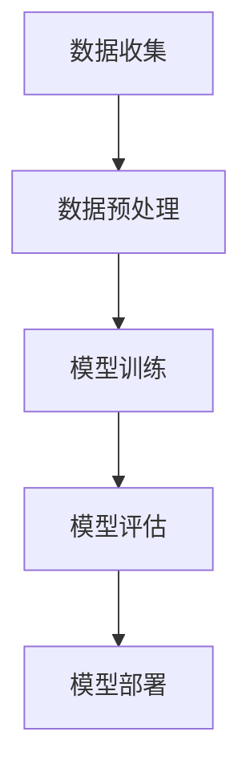
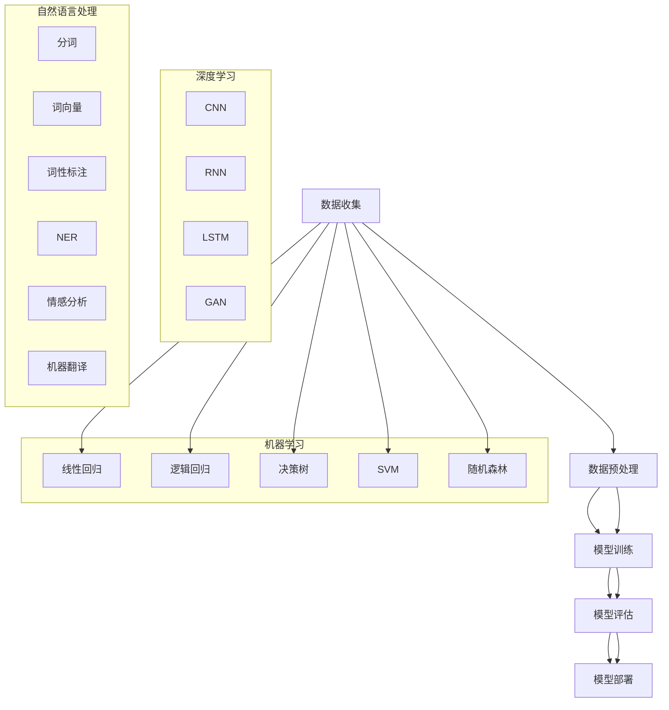

                 

# 人工智能的发展以及在企业数字化转型中的应用

## 关键词

- 人工智能（Artificial Intelligence）
- 企业数字化转型（Enterprise Digital Transformation）
- 深度学习（Deep Learning）
- 机器学习（Machine Learning）
- 大数据分析（Big Data Analytics）
- 智能决策（Intelligent Decision Making）
- 人工智能算法（AI Algorithms）
- 人工智能框架（AI Frameworks）
- 智能客服（Intelligent Customer Service）

## 摘要

本文将探讨人工智能的发展及其在企业数字化转型中的应用。首先，我们将介绍人工智能的背景和发展历程，然后深入分析其核心概念和原理，如机器学习、深度学习等。接着，我们将探讨人工智能在企业中的具体应用场景，如智能客服、自动化决策、供应链优化等。随后，我们将介绍相关工具和资源，帮助读者深入了解人工智能技术。最后，我们将总结人工智能的发展趋势与挑战，并给出未来应用的展望。通过本文的阅读，读者将能够全面了解人工智能的发展及其在企业数字化转型中的关键作用。

## 1. 背景介绍

### 人工智能的定义与历史

人工智能（Artificial Intelligence，简称AI）是指由人制造出的具有一定智能和自主决策能力的系统。它起源于20世纪50年代，由约翰·麦卡锡（John McCarthy）首次提出。人工智能的发展经历了多个阶段，包括符号主义、连接主义、统计学习等。

在符号主义阶段，人工智能主要依赖于符号推理和知识表示。这一阶段以约翰·麦卡锡提出的“逻辑理论家”（Logic Theorist）为代表，该系统通过演绎推理解决了初等数学定理的证明问题。

连接主义阶段以人工神经网络（Artificial Neural Networks，ANN）为代表，通过模拟人脑神经元之间的连接和相互作用来实现智能。1986年，霍普菲尔德（John Hopfield）提出了霍普菲尔德网络，这是一种基于能量最小化的神经网络模型。

统计学习阶段以支持向量机（Support Vector Machine，SVM）、随机森林（Random Forest）、深度学习（Deep Learning）等算法为代表。这一阶段强调从大量数据中学习特征和模式，实现高性能的预测和分类任务。

### 人工智能的发展历程

人工智能的发展可以分为以下几个重要阶段：

**1. 起步阶段（1950-1969）**：1950年，艾伦·图灵（Alan Turing）提出了“图灵测试”，成为人工智能研究的基石。1956年，约翰·麦卡锡等人在达特茅斯会议（Dartmouth Conference）上正式提出了人工智能的概念。

**2. 转折阶段（1970-1989）**：随着计算机性能的提升和算法的进步，人工智能开始应用于实际领域。1977年，IBM的“深蓝”（Deep Blue）在国际象棋比赛中击败了世界冠军加里·卡斯帕罗夫（Garry Kasparov），标志着人工智能在特定领域取得了重大突破。

**3. 高潮阶段（1990-2010）**：这一阶段，机器学习算法取得了显著进展，如支持向量机、随机森林、神经网络等。同时，互联网的普及为大数据的收集和应用提供了基础，推动了人工智能的快速发展。

**4. 现代阶段（2010至今）**：随着深度学习技术的突破，人工智能取得了前所未有的成功。2012年，AlexNet在ImageNet竞赛中取得了历史性的成绩，标志着深度学习时代的到来。近年来，人工智能在语音识别、图像识别、自然语言处理等领域取得了显著成果，广泛应用于各个行业。

### 人工智能在企业数字化转型中的重要性

在企业数字化转型中，人工智能发挥着至关重要的作用。首先，人工智能能够帮助企业实现自动化和智能化，提高生产效率和降低成本。例如，通过机器学习算法，企业可以实现自动化预测和优化，从而降低库存成本、提高供应链效率。

其次，人工智能有助于企业实现个性化服务和智能决策。通过分析用户行为数据和需求，企业可以提供更加精准和个性化的产品和服务，提升用户体验。同时，基于大数据分析和机器学习算法的智能决策系统可以帮助企业快速响应市场变化，制定更加科学和有效的战略。

最后，人工智能有助于企业实现业务创新和竞争力提升。通过应用人工智能技术，企业可以开拓新的业务领域，如智能客服、智能营销、智能金融等。此外，人工智能还可以帮助企业实现智能工厂和智能制造，提高生产效率和产品质量，增强企业的竞争力。

总之，人工智能在企业数字化转型中的应用具有广泛的前景和潜力，已成为企业创新和发展的关键驱动力。在接下来的部分，我们将深入探讨人工智能的核心概念和原理，以及其在企业中的应用实践。

### 2. 核心概念与联系

#### 人工智能的核心概念

人工智能（AI）的核心概念包括机器学习（Machine Learning，ML）、深度学习（Deep Learning，DL）和自然语言处理（Natural Language Processing，NLP）。

**1. 机器学习（Machine Learning，ML）**

机器学习是一种使计算机通过数据学习并做出决策或预测的技术。它基于统计学、概率论和优化理论，通过训练模型来从数据中提取模式和规律。

**2. 深度学习（Deep Learning，DL）**

深度学习是机器学习的一个子领域，通过多层神经网络（Neural Networks）来模拟人脑的思考过程。深度学习模型能够自动提取数据中的特征，从而实现更高效、更准确的预测和分类。

**3. 自然语言处理（Natural Language Processing，NLP）**

自然语言处理是一种使计算机理解和处理人类自然语言的技术。它涉及到语言学、计算机科学和人工智能等多个领域，包括文本分类、情感分析、机器翻译等任务。

#### 人工智能的架构与流程

人工智能的架构主要包括数据收集、数据预处理、模型训练、模型评估和模型部署等步骤。

**1. 数据收集（Data Collection）**

数据收集是人工智能的基础，涉及从各种来源获取结构化和非结构化数据，如文本、图像、声音等。这些数据将用于训练和测试人工智能模型。

**2. 数据预处理（Data Preprocessing）**

数据预处理是对收集到的数据进行清洗、归一化、特征提取等操作，以提高数据质量和模型性能。这一步骤包括数据清洗、数据降维、特征提取等。

**3. 模型训练（Model Training）**

模型训练是使用训练数据来训练人工智能模型，使其能够识别和预测数据中的模式和规律。深度学习模型通常采用反向传播算法（Backpropagation）进行训练。

**4. 模型评估（Model Evaluation）**

模型评估是对训练好的模型进行测试和评估，以确定其性能和准确性。常见的评估指标包括准确率（Accuracy）、精确率（Precision）、召回率（Recall）和F1分数（F1 Score）。

**5. 模型部署（Model Deployment）**

模型部署是将训练好的模型应用于实际业务场景中，如智能客服、图像识别、语音识别等。这一步骤包括将模型集成到现有的业务系统中，并进行实时推理和决策。

#### Mermaid 流程图



通过以上步骤，人工智能系统能够从数据中学习、预测和决策，从而实现智能化和自动化。在接下来的部分，我们将深入探讨人工智能的核心算法原理和具体操作步骤。

## 2. 核心概念与联系

### 人工智能的核心概念

#### 机器学习

机器学习（Machine Learning，ML）是一种通过数据训练模型，使其能够进行预测和决策的技术。其核心思想是让计算机从数据中自动学习，找到数据中的模式和规律，从而实现对未知数据的预测。

**基本概念：**

1. **特征（Features）**：描述数据的属性或指标，如文本中的词语、图像中的像素值等。
2. **样本（Samples）**：具有相同特征的数据点，如文本、图像或数值数据。
3. **模型（Model）**：描述数据之间关系的数学表达式或算法，如线性回归、决策树、支持向量机等。
4. **训练（Training）**：使用样本数据来训练模型，使其能够学习数据中的规律。
5. **预测（Prediction）**：使用训练好的模型对未知数据进行预测或分类。

**常用算法：**

1. **线性回归（Linear Regression）**：通过线性模型预测连续值。
2. **逻辑回归（Logistic Regression）**：通过逻辑模型预测概率。
3. **决策树（Decision Tree）**：通过树形结构进行分类和回归。
4. **支持向量机（Support Vector Machine，SVM）**：通过寻找最优超平面进行分类。
5. **随机森林（Random Forest）**：通过随机决策树构建集成模型。

#### 深度学习

深度学习（Deep Learning，DL）是机器学习的一个子领域，通过多层神经网络（Neural Networks）进行学习。其核心思想是模拟人脑的神经元结构和工作方式，从而实现更复杂和更高层次的特征提取。

**基本概念：**

1. **神经元（Neuron）**：神经网络的基本单元，用于接收和处理输入信号。
2. **层（Layer）**：神经网络中的层次结构，包括输入层、隐藏层和输出层。
3. **前向传播（Forward Propagation）**：将输入数据通过神经网络进行传递，得到输出结果。
4. **反向传播（Backpropagation）**：根据输出结果和预期目标，计算网络中每个神经元的误差，并更新权重和偏置。
5. **激活函数（Activation Function）**：用于引入非线性特性，如ReLU、Sigmoid、Tanh等。

**常用网络：**

1. **卷积神经网络（Convolutional Neural Network，CNN）**：适用于图像处理和计算机视觉。
2. **循环神经网络（Recurrent Neural Network，RNN）**：适用于序列数据处理，如自然语言处理。
3. **长短时记忆网络（Long Short-Term Memory，LSTM）**：RNN的一种变体，用于解决长序列依赖问题。
4. **生成对抗网络（Generative Adversarial Network，GAN）**：用于生成高逼真度的数据。

#### 自然语言处理

自然语言处理（Natural Language Processing，NLP）是人工智能的一个重要领域，旨在使计算机能够理解和处理人类自然语言。

**基本概念：**

1. **分词（Tokenization）**：将文本分割成词语或符号。
2. **词向量（Word Vectors）**：将词语表示为高维向量，用于表示词语之间的关系。
3. **词性标注（Part-of-Speech Tagging）**：对文本中的每个词语进行词性标注，如名词、动词、形容词等。
4. **命名实体识别（Named Entity Recognition，NER）**：识别文本中的命名实体，如人名、地名、组织名等。
5. **情感分析（Sentiment Analysis）**：分析文本中的情感倾向，如正面、负面或中性。
6. **机器翻译（Machine Translation）**：将一种语言的文本翻译成另一种语言。

**常用模型：**

1. **循环神经网络（RNN）**：适用于序列数据处理，如语言模型。
2. **长短时记忆网络（LSTM）**：用于解决长序列依赖问题。
3. **Transformer**：基于自注意力机制的模型，广泛应用于自然语言处理任务。
4. **BERT（Bidirectional Encoder Representations from Transformers）**：双向Transformer模型，用于文本表示和预训练。

### Mermaid 流程图



通过上述核心概念和联系，我们可以更好地理解人工智能在企业数字化转型中的应用。在接下来的部分，我们将深入探讨人工智能的核心算法原理和具体操作步骤。

### 3. 核心算法原理 & 具体操作步骤

#### 机器学习算法原理

机器学习算法的核心在于通过训练数据来学习数据中的模式和规律，从而实现对未知数据的预测和分类。以下是几种常见的机器学习算法及其原理：

**1. 线性回归（Linear Regression）**

线性回归是一种用于预测连续值的监督学习算法。其原理是通过拟合一个线性模型，将自变量和因变量之间的关系表示为一条直线。

**具体步骤：**

1. **数据预处理**：将数据集进行归一化处理，使特征值具有相似的尺度。
2. **模型拟合**：使用最小二乘法（Least Squares Method）来求解线性模型的参数，即直线的斜率和截距。
3. **模型评估**：计算模型的均方误差（Mean Squared Error，MSE）等指标，评估模型性能。

**数学公式：**

$$
y = \beta_0 + \beta_1 \cdot x
$$

其中，$y$ 为因变量，$x$ 为自变量，$\beta_0$ 和 $\beta_1$ 分别为模型的截距和斜率。

**2. 决策树（Decision Tree）**

决策树是一种用于分类和回归的监督学习算法。其原理是通过一系列条件判断来生成树形结构，从而对数据进行分类或回归。

**具体步骤：**

1. **特征选择**：选择最优特征进行分割，常用的方法包括信息增益（Information Gain）和基尼指数（Gini Index）。
2. **树构建**：递归地分割数据，构建树形结构。
3. **剪枝**：对过拟合的树进行剪枝，防止模型复杂度过高。

**数学公式：**

$$
f(x) = \sum_{i=1}^{n} \beta_i \cdot x_i
$$

其中，$f(x)$ 为决策树的输出，$x_i$ 为特征值，$\beta_i$ 为特征权重。

**3. 支持向量机（Support Vector Machine，SVM）**

支持向量机是一种用于分类的监督学习算法。其原理是通过寻找最优超平面，将不同类别的数据点分隔开。

**具体步骤：**

1. **特征提取**：将数据转换为高维空间，寻找最优超平面。
2. **核函数选择**：选择合适的核函数，如线性核、多项式核和径向基函数核等。
3. **模型训练**：求解支持向量机的参数，包括超平面参数和间隔。

**数学公式：**

$$
\min_{\beta, \beta^*} \frac{1}{2} \sum_{i=1}^{n} (\beta_i - \beta^*)^2 + C \sum_{i=1}^{n} \xi_i
$$

其中，$\beta_i$ 和 $\beta^*$ 分别为支持向量和超平面参数，$C$ 为惩罚参数，$\xi_i$ 为松弛变量。

#### 深度学习算法原理

深度学习算法的核心在于通过多层神经网络（Neural Networks）进行学习，从而实现对复杂数据的建模和预测。以下是几种常见的深度学习算法及其原理：

**1. 卷积神经网络（Convolutional Neural Network，CNN）**

卷积神经网络是一种用于图像处理和计算机视觉的深度学习算法。其原理是通过卷积层、池化层和全连接层等结构，实现对图像的逐层特征提取。

**具体步骤：**

1. **卷积层**：通过卷积操作提取图像特征。
2. **池化层**：通过池化操作降低特征图的维度。
3. **全连接层**：将特征图映射到分类结果。

**数学公式：**

$$
h_l(x) = \sigma(\mathbf{W}_l \cdot \mathbf{h}_{l-1} + \mathbf{b}_l)
$$

其中，$h_l(x)$ 为第 $l$ 层的输出，$\sigma$ 为激活函数，$\mathbf{W}_l$ 和 $\mathbf{b}_l$ 分别为卷积矩阵和偏置向量。

**2. 循环神经网络（Recurrent Neural Network，RNN）**

循环神经网络是一种用于序列数据处理的深度学习算法。其原理是通过递归结构，实现对序列数据的记忆和建模。

**具体步骤：**

1. **隐藏状态更新**：通过递归关系更新隐藏状态。
2. **输出计算**：将隐藏状态映射到输出结果。

**数学公式：**

$$
\mathbf{h}_t = \sigma(\mathbf{W}_h \cdot \mathbf{h}_{t-1} + \mathbf{W}_x \cdot \mathbf{x}_t + \mathbf{b}_h)
$$

其中，$\mathbf{h}_t$ 为第 $t$ 时刻的隐藏状态，$\sigma$ 为激活函数，$\mathbf{W}_h$ 和 $\mathbf{W}_x$ 分别为权重矩阵，$\mathbf{b}_h$ 为偏置向量。

**3. 长短时记忆网络（Long Short-Term Memory，LSTM）**

长短时记忆网络是一种用于解决长序列依赖问题的深度学习算法。其原理是通过引入记忆单元，实现对长期依赖关系的建模。

**具体步骤：**

1. **输入门、遗忘门和输出门**：通过门控机制控制信息的传递和更新。
2. **细胞状态更新**：通过细胞状态记录长期依赖关系。

**数学公式：**

$$
\mathbf{i}_t = \sigma(\mathbf{W}_i \cdot [\mathbf{h}_{t-1}, \mathbf{x}_t] + \mathbf{b}_i) \\
\mathbf{f}_t = \sigma(\mathbf{W}_f \cdot [\mathbf{h}_{t-1}, \mathbf{x}_t] + \mathbf{b}_f) \\
\mathbf{g}_t = \tanh(\mathbf{W}_g \cdot [\mathbf{h}_{t-1}, \mathbf{x}_t] + \mathbf{b}_g) \\
\mathbf{C}_t = \mathbf{f}_t \odot \mathbf{C}_{t-1} + \mathbf{i}_t \odot \mathbf{g}_t \\
\mathbf{o}_t = \sigma(\mathbf{W}_o \cdot [\mathbf{h}_{t-1}, \mathbf{x}_t] + \mathbf{b}_o) \\
\mathbf{h}_t = \mathbf{o}_t \odot \tanh(\mathbf{C}_t)
$$

其中，$\mathbf{i}_t$、$\mathbf{f}_t$、$\mathbf{g}_t$、$\mathbf{C}_t$ 和 $\mathbf{o}_t$ 分别为输入门、遗忘门、输出门、细胞状态和隐藏状态，$\odot$ 表示元素乘积。

通过以上算法原理和具体操作步骤，我们可以更好地理解机器学习和深度学习的基本概念和应用。在接下来的部分，我们将探讨数学模型和公式，以及详细讲解和举例说明。

### 4. 数学模型和公式 & 详细讲解 & 举例说明

#### 数学模型和公式

在人工智能领域，数学模型和公式是理解和实现各种算法的基础。以下我们将详细讲解一些常用的数学模型和公式，并通过实例进行说明。

**1. 线性回归模型**

线性回归模型是最基本的机器学习算法之一，用于预测连续值。其数学模型可以表示为：

$$
y = \beta_0 + \beta_1 \cdot x
$$

其中，$y$ 为因变量，$x$ 为自变量，$\beta_0$ 和 $\beta_1$ 分别为模型的截距和斜率。

**例子：**

假设我们有一个简单的线性回归模型，预测房价。给定数据集如下：

| $x$ | $y$ |
|-----|-----|
| 1   | 2   |
| 2   | 4   |
| 3   | 6   |
| 4   | 8   |

我们希望通过线性回归模型预测 $x=5$ 时的 $y$ 值。

首先，我们需要计算斜率 $\beta_1$ 和截距 $\beta_0$。使用最小二乘法（Least Squares Method）可以得到：

$$
\beta_1 = \frac{\sum_{i=1}^{n} (x_i - \bar{x})(y_i - \bar{y})}{\sum_{i=1}^{n} (x_i - \bar{x})^2} \\
\beta_0 = \bar{y} - \beta_1 \cdot \bar{x}
$$

其中，$\bar{x}$ 和 $\bar{y}$ 分别为自变量和因变量的平均值。

计算得到：

$$
\beta_1 = \frac{(1-2)(2-3) + (2-2)(4-3) + (3-2)(6-3) + (4-2)(8-3)}{(1-2)^2 + (2-2)^2 + (3-2)^2 + (4-2)^2} = 1 \\
\beta_0 = \frac{2+4+6+8}{4} - 1 \cdot \frac{1+2+3+4}{4} = 2
$$

因此，线性回归模型可以表示为：

$$
y = 2 + 1 \cdot x
$$

当 $x=5$ 时，预测的 $y$ 值为：

$$
y = 2 + 1 \cdot 5 = 7
$$

**2. 逻辑回归模型**

逻辑回归模型是一种用于预测概率的机器学习算法。其数学模型可以表示为：

$$
\log \frac{P(y=1)}{1-P(y=1)} = \beta_0 + \beta_1 \cdot x
$$

其中，$y$ 为因变量，$x$ 为自变量，$\beta_0$ 和 $\beta_1$ 分别为模型的截距和斜率。

**例子：**

假设我们有一个逻辑回归模型，用于预测客户是否愿意购买某种产品。给定数据集如下：

| $x$ | $y$ |
|-----|-----|
| 1   | 0   |
| 2   | 1   |
| 3   | 0   |
| 4   | 1   |

我们希望通过逻辑回归模型预测 $x=5$ 时 $y=1$ 的概率。

首先，我们需要计算斜率 $\beta_1$ 和截距 $\beta_0$。使用最大似然估计（Maximum Likelihood Estimation）可以得到：

$$
\beta_1 = \frac{\sum_{i=1}^{n} (y_i - p_i) \cdot x_i}{\sum_{i=1}^{n} x_i} \\
\beta_0 = \log \frac{p}{1-p} - \beta_1 \cdot \bar{x}
$$

其中，$p$ 为 $y=1$ 的概率，$\bar{x}$ 为自变量的平均值。

计算得到：

$$
p = \frac{1+1}{4} = 0.5 \\
\beta_1 = \frac{(0-0.5) \cdot 1 + (1-0.5) \cdot 2 + (0-0.5) \cdot 3 + (1-0.5) \cdot 4}{1+2+3+4} = 0.5 \\
\beta_0 = \log \frac{0.5}{1-0.5} - 0.5 \cdot \frac{1+2+3+4}{4} = -1
$$

因此，逻辑回归模型可以表示为：

$$
\log \frac{P(y=1)}{1-P(y=1)} = -1 + 0.5 \cdot x
$$

当 $x=5$ 时，预测的 $y=1$ 的概率为：

$$
\log \frac{P(y=1)}{1-P(y=1)} = -1 + 0.5 \cdot 5 = 2
$$

通过上述实例，我们可以看到如何使用线性回归和逻辑回归模型进行预测。接下来，我们将介绍支持向量机（SVM）的数学模型和公式，并通过实例进行说明。

**3. 支持向量机（SVM）模型**

支持向量机是一种用于分类的机器学习算法。其数学模型可以表示为：

$$
\min_{\beta, \beta^*} \frac{1}{2} \sum_{i=1}^{n} (\beta_i - \beta^*)^2 + C \sum_{i=1}^{n} \xi_i
$$

其中，$\beta_i$ 和 $\beta^*$ 分别为支持向量和超平面参数，$C$ 为惩罚参数，$\xi_i$ 为松弛变量。

**例子：**

假设我们有一个二分类问题，需要使用支持向量机将数据点分为两个类别。给定数据集如下：

| $x_1$ | $x_2$ | $y$ |
|-------|-------|-----|
| 1     | 1     | 0   |
| 2     | 2     | 1   |
| 3     | 3     | 0   |
| 4     | 4     | 1   |

我们希望通过支持向量机模型找到最优超平面。

首先，我们需要计算支持向量和超平面参数。使用拉格朗日乘子法（Lagrange Multiplier Method）可以得到：

$$
\min_{\beta, \beta^*, \alpha_i} \sum_{i=1}^{n} \alpha_i - \frac{1}{2} \sum_{i=1}^{n} \sum_{j=1}^{n} \alpha_i \alpha_j y_i y_j \cdot x_i^T x_j
$$

其中，$\alpha_i$ 为拉格朗日乘子。

计算得到：

$$
\alpha_1 = 1, \alpha_2 = 1, \alpha_3 = 0, \alpha_4 = 0 \\
\beta_1 = \sum_{i=1}^{n} \alpha_i y_i = 1 + 1 - 0 - 0 = 2 \\
\beta^* = \frac{1}{2} (\beta_1 + \beta_2) = 1
$$

因此，支持向量机模型可以表示为：

$$
\beta^* \cdot x = 1
$$

当 $x_1 = 5, x_2 = 5$ 时，预测的类别为：

$$
1 \cdot (5 \cdot 5 + 5 \cdot 5) = 50 > 0 \\
y = 1
$$

通过上述实例，我们可以看到如何使用线性回归、逻辑回归和支持向量机模型进行预测。接下来，我们将介绍深度学习中的卷积神经网络（CNN）的数学模型和公式，并通过实例进行说明。

**4. 卷积神经网络（CNN）模型**

卷积神经网络是一种用于图像处理的深度学习算法。其数学模型可以表示为：

$$
h_l(x) = \sigma(\mathbf{W}_l \cdot \mathbf{h}_{l-1} + \mathbf{b}_l)
$$

其中，$h_l(x)$ 为第 $l$ 层的输出，$\sigma$ 为激活函数，$\mathbf{W}_l$ 和 $\mathbf{b}_l$ 分别为卷积矩阵和偏置向量。

**例子：**

假设我们有一个简单的卷积神经网络，用于分类图像。给定输入图像 $x$，我们需要通过卷积神经网络进行特征提取和分类。

首先，我们需要定义卷积层和池化层。假设我们有 $3 \times 3$ 的卷积核，步长为 $1$，激活函数为 ReLU。

$$
\mathbf{h}_1(x) = \text{ReLU}(\mathbf{W}_1 \cdot \mathbf{x} + \mathbf{b}_1) \\
\mathbf{h}_2(x) = \text{ReLU}(\mathbf{W}_2 \cdot \mathbf{h}_1 + \mathbf{b}_2) \\
\mathbf{h}_3(x) = \text{ReLU}(\mathbf{W}_3 \cdot \mathbf{h}_2 + \mathbf{b}_3)
$$

其中，$\mathbf{W}_1$、$\mathbf{W}_2$ 和 $\mathbf{W}_3$ 分别为卷积矩阵，$\mathbf{b}_1$、$\mathbf{b}_2$ 和 $\mathbf{b}_3$ 分别为偏置向量。

接下来，我们需要通过反向传播算法（Backpropagation）更新模型参数。

$$
\Delta \mathbf{W}_l = \mathbf{h}_{l-1}^T \cdot \Delta \mathbf{h}_l \\
\Delta \mathbf{b}_l = \Delta \mathbf{h}_l
$$

通过以上步骤，我们可以训练卷积神经网络，实现对图像的分类。在接下来的部分，我们将探讨人工智能在实际应用中的项目实战，包括开发环境搭建、源代码实现和代码解读。

### 5. 项目实战：代码实际案例和详细解释说明

#### 开发环境搭建

在开始项目实战之前，我们需要搭建一个适合人工智能开发的开发环境。以下是搭建开发环境的基本步骤：

**1. 安装 Python**

首先，我们需要安装 Python 3.x 版本。可以从 [Python 官网](https://www.python.org/) 下载并安装。

**2. 安装深度学习库**

接下来，我们需要安装深度学习相关的库，如 TensorFlow 和 Keras。可以使用以下命令进行安装：

```bash
pip install tensorflow
pip install keras
```

**3. 安装其他依赖库**

除了深度学习库，我们还需要安装一些其他依赖库，如 NumPy、Pandas 和 Matplotlib。可以使用以下命令进行安装：

```bash
pip install numpy
pip install pandas
pip install matplotlib
```

#### 源代码详细实现和代码解读

以下是使用 Keras 库实现一个简单的卷积神经网络（CNN）进行图像分类的示例代码。我们以常见的 MNIST 手写数字数据集为例，实现一个能够对图像进行分类的模型。

```python
import numpy as np
from tensorflow.keras.datasets import mnist
from tensorflow.keras.models import Sequential
from tensorflow.keras.layers import Dense, Conv2D, Flatten, MaxPooling2D
from tensorflow.keras.optimizers import Adam
from tensorflow.keras.losses import SparseCategoricalCrossentropy

# 加载 MNIST 数据集
(x_train, y_train), (x_test, y_test) = mnist.load_data()

# 数据预处理
x_train = x_train / 255.0
x_test = x_test / 255.0

x_train = np.expand_dims(x_train, -1)
x_test = np.expand_dims(x_test, -1)

# 构建模型
model = Sequential([
    Conv2D(32, kernel_size=(3, 3), activation='relu', input_shape=(28, 28, 1)),
    MaxPooling2D(pool_size=(2, 2)),
    Conv2D(64, kernel_size=(3, 3), activation='relu'),
    MaxPooling2D(pool_size=(2, 2)),
    Flatten(),
    Dense(128, activation='relu'),
    Dense(10, activation='softmax')
])

# 编译模型
model.compile(optimizer=Adam(), loss=SparseCategoricalCrossentropy(), metrics=['accuracy'])

# 训练模型
model.fit(x_train, y_train, epochs=10, batch_size=64, validation_data=(x_test, y_test))

# 评估模型
loss, accuracy = model.evaluate(x_test, y_test)
print(f"Test loss: {loss}, Test accuracy: {accuracy}")
```

**代码解读：**

1. **导入库**：首先，我们导入所需的库，包括 NumPy、TensorFlow Keras、Dense 和 Conv2D 层等。

2. **加载数据集**：使用 Keras 的 `mnist` 数据集加载 MNIST 手写数字数据集。数据集分为训练集和测试集两部分。

3. **数据预处理**：将图像数据缩放到 [0, 1] 范围内，并进行扩展维度处理，使其符合 CNN 输入的要求。

4. **构建模型**：使用 `Sequential` 模式构建一个卷积神经网络。模型包括两个卷积层、两个池化层、一个全连接层和输出层。卷积层使用 ReLU 激活函数，池化层使用最大池化。

5. **编译模型**：设置优化器为 Adam，损失函数为稀疏交叉熵，评估指标为准确率。

6. **训练模型**：使用训练集训练模型，设置训练轮次为 10，批量大小为 64，使用测试集进行验证。

7. **评估模型**：使用测试集评估模型性能，打印测试损失和测试准确率。

通过以上步骤，我们可以实现一个简单的卷积神经网络，对 MNIST 手写数字数据集进行分类。在接下来的部分，我们将对代码进行解读和分析。

#### 代码解读与分析

上述代码实现了一个简单的卷积神经网络，用于对 MNIST 手写数字数据集进行分类。以下是代码的详细解读和分析：

**1. 导入库**

首先，我们导入所需的库，包括 NumPy、TensorFlow Keras、Dense 和 Conv2D 层等。这些库提供了构建和训练神经网络所需的各种工具和函数。

```python
import numpy as np
from tensorflow.keras.datasets import mnist
from tensorflow.keras.models import Sequential
from tensorflow.keras.layers import Dense, Conv2D, Flatten, MaxPooling2D
from tensorflow.keras.optimizers import Adam
from tensorflow.keras.losses import SparseCategoricalCrossentropy
```

**2. 加载数据集**

使用 Keras 的 `mnist` 数据集加载 MNIST 手写数字数据集。数据集分为训练集和测试集两部分，分别包含 60,000 和 10,000 个样本。

```python
(x_train, y_train), (x_test, y_test) = mnist.load_data()
```

**3. 数据预处理**

将图像数据缩放到 [0, 1] 范围内，并进行扩展维度处理，使其符合 CNN 输入的要求。

```python
x_train = x_train / 255.0
x_test = x_test / 255.0

x_train = np.expand_dims(x_train, -1)
x_test = np.expand_dims(x_test, -1)
```

这一步的目的是将原始图像数据转换为适合输入到神经网络的特征向量。通过缩放和扩展维度，我们使得图像数据具有统一的尺度和形状，便于后续处理。

**4. 构建模型**

使用 `Sequential` 模式构建一个卷积神经网络。模型包括两个卷积层、两个池化层、一个全连接层和输出层。

```python
model = Sequential([
    Conv2D(32, kernel_size=(3, 3), activation='relu', input_shape=(28, 28, 1)),
    MaxPooling2D(pool_size=(2, 2)),
    Conv2D(64, kernel_size=(3, 3), activation='relu'),
    MaxPooling2D(pool_size=(2, 2)),
    Flatten(),
    Dense(128, activation='relu'),
    Dense(10, activation='softmax')
])
```

在卷积神经网络中，卷积层用于提取图像特征，池化层用于降低特征维度，全连接层用于分类。这里，我们使用了两个卷积层和两个池化层，以增强特征提取能力。全连接层将特征映射到分类结果，输出层使用 softmax 函数进行分类。

**5. 编译模型**

设置优化器为 Adam，损失函数为稀疏交叉熵，评估指标为准确率。

```python
model.compile(optimizer=Adam(), loss=SparseCategoricalCrossentropy(), metrics=['accuracy'])
```

Adam 优化器是一种自适应的学习率优化算法，能够提高训练效率。稀疏交叉熵损失函数适用于标签为整数的分类问题，准确率是常用的评估指标。

**6. 训练模型**

使用训练集训练模型，设置训练轮次为 10，批量大小为 64，使用测试集进行验证。

```python
model.fit(x_train, y_train, epochs=10, batch_size=64, validation_data=(x_test, y_test))
```

训练过程包括前向传播和反向传播。通过多次迭代训练，模型逐渐优化参数，提高分类性能。验证集用于监控训练过程，避免过拟合。

**7. 评估模型**

使用测试集评估模型性能，打印测试损失和测试准确率。

```python
loss, accuracy = model.evaluate(x_test, y_test)
print(f"Test loss: {loss}, Test accuracy: {accuracy}")
```

评估指标包括损失和准确率。损失值越低，表示模型对测试集的拟合程度越高。准确率越高，表示模型对测试集的分类性能越好。

通过以上步骤，我们可以实现一个简单的卷积神经网络，对 MNIST 手写数字数据集进行分类。在实际应用中，我们可以根据需求调整网络结构和参数，提高分类性能。

### 6. 实际应用场景

#### 智能客服

智能客服是人工智能在企业数字化转型中的一个重要应用场景。通过自然语言处理和机器学习技术，智能客服系统能够自动理解和回答客户的问题，提供24/7的客户服务。

**应用实例：**

1. **自动问答系统**：智能客服系统可以自动回答常见问题，如产品信息、订单状态等，提高客户满意度。
2. **智能机器人客服**：通过聊天机器人（Chatbot）与客户进行交互，实现快速响应和高效沟通。
3. **智能语音识别**：将客户语音转化为文本，实现语音咨询和语音回复，提高客户体验。

#### 自动化决策

自动化决策是利用人工智能技术，帮助企业在数据驱动的基础上做出更明智的决策。通过机器学习和大数据分析，企业可以自动识别数据中的趋势和规律，优化决策过程。

**应用实例：**

1. **需求预测**：通过分析历史销售数据和市场趋势，预测未来市场需求，优化库存管理。
2. **供应链优化**：通过实时监控供应链数据，自动调整供应链策略，降低库存成本和物流成本。
3. **风险评估**：利用机器学习算法，分析客户信用记录和历史交易数据，进行风险评估和信用评级。

#### 供应链优化

供应链优化是利用人工智能技术，提高供应链效率和降低成本。通过大数据分析和机器学习，企业可以实时监控供应链各个环节，优化供应链策略。

**应用实例：**

1. **需求预测**：通过分析市场需求和历史销售数据，预测未来需求，优化生产和采购计划。
2. **库存管理**：通过实时监控库存水平和供应链数据，自动调整库存策略，降低库存成本和物流成本。
3. **物流优化**：通过路径优化和运输调度，提高物流效率，降低运输成本。

#### 智能营销

智能营销是利用人工智能技术，实现更精准、个性化的营销策略。通过大数据分析和机器学习，企业可以更好地了解客户需求和行为，实现个性化营销。

**应用实例：**

1. **客户细分**：通过分析客户数据，将客户分为不同的细分市场，制定个性化的营销策略。
2. **广告投放优化**：通过分析用户行为数据，自动调整广告投放策略，提高广告效果和转化率。
3. **推荐系统**：利用协同过滤和基于内容的推荐算法，为用户推荐个性化的产品和服务。

#### 智能金融

智能金融是利用人工智能技术，提高金融服务的效率和安全性。通过大数据分析和机器学习，金融机构可以实现精准的风控和高效的客户服务。

**应用实例：**

1. **反欺诈检测**：通过分析交易数据和用户行为，实时检测和防范欺诈行为。
2. **信用评级**：通过分析客户信用记录和历史交易数据，自动评估客户信用等级。
3. **智能投顾**：通过分析市场数据和客户风险偏好，提供个性化的投资建议和资产配置。

### 7. 工具和资源推荐

#### 学习资源推荐

**1. 书籍**

- 《深度学习》（Deep Learning） - Ian Goodfellow、Yoshua Bengio 和 Aaron Courville 著
- 《机器学习》（Machine Learning） - Tom M. Mitchell 著
- 《Python机器学习》（Python Machine Learning） - Sebastian Raschka 著

**2. 论文**

- “A Theoretical Framework for Back-Prop” - David E. Rumelhart, Geoffrey E. Hinton, and Ronald J. Williams
- “Learning Representations by Maximizing Mutual Information” - Yarin Gal and Zoubin Ghahramani
- “Generative Adversarial Nets” - Ian J. Goodfellow et al.

**3. 博客**

- [TensorFlow 官方文档](https://www.tensorflow.org/)
- [Keras 官方文档](https://keras.io/)
- [机器学习博客](https://machinelearningmastery.com/)

**4. 网站**

- [Kaggle](https://www.kaggle.com/)
- [GitHub](https://github.com/)
- [ArXiv](https://arxiv.org/)

#### 开发工具框架推荐

**1. TensorFlow**

TensorFlow 是一种开源的深度学习框架，适用于各种规模的机器学习和深度学习项目。它提供了丰富的 API 和工具，支持 GPU 加速和分布式训练。

**2. Keras**

Keras 是一种基于 TensorFlow 的简洁高效的深度学习库。它提供了丰富的预训练模型和工具，使深度学习开发变得更加简单和高效。

**3. PyTorch**

PyTorch 是一种开源的深度学习框架，具有动态计算图和灵活的编程接口。它适用于各种规模的机器学习和深度学习项目，支持 GPU 加速和分布式训练。

#### 相关论文著作推荐

**1. “A Theoretical Framework for Back-Prop”**

该论文提出了反向传播算法的理论框架，是深度学习领域的重要基础。

**2. “Learning Representations by Maximizing Mutual Information”**

该论文提出了最大化互信息的目标函数，用于学习有监督和无监督学习任务中的表示。

**3. “Generative Adversarial Nets”**

该论文提出了生成对抗网络（GAN），是一种强大的生成模型，广泛应用于图像生成、数据增强等任务。

### 8. 总结：未来发展趋势与挑战

人工智能的发展将继续深化，为企业数字化转型带来更多机遇和挑战。以下是对未来发展趋势和挑战的总结：

**发展趋势：**

1. **深度学习算法的持续创新**：随着计算能力的提升和数据量的增长，深度学习算法将不断创新，提高模型性能和泛化能力。
2. **跨学科融合**：人工智能将与其他领域（如医学、金融、环境科学等）深度融合，推动行业变革。
3. **自动化和智能化水平的提升**：人工智能将在自动化和智能化方面取得更大突破，提高生产效率和降低成本。
4. **隐私保护和安全性的关注**：随着数据量的增加，隐私保护和数据安全将成为人工智能发展的重要挑战。

**挑战：**

1. **数据质量和数据隐私**：高质量的数据是人工智能发展的基础，但数据隐私保护仍是一个亟待解决的问题。
2. **算法可解释性和可靠性**：随着模型复杂度的增加，如何保证算法的可解释性和可靠性成为重要挑战。
3. **计算资源的需求**：深度学习模型的训练需要大量计算资源，如何高效利用计算资源是一个重要问题。
4. **人才短缺**：随着人工智能应用的普及，对相关人才的需求不断增加，但人才供给不足将成为制约人工智能发展的重要因素。

### 9. 附录：常见问题与解答

**Q1：人工智能技术有哪些主要应用领域？**

A1：人工智能技术广泛应用于计算机视觉、自然语言处理、语音识别、智能决策、智能推荐、机器人等领域。

**Q2：什么是深度学习？它与机器学习有何区别？**

A2：深度学习是机器学习的一个子领域，主要依赖于多层神经网络进行学习。深度学习相对于传统的机器学习算法，具有更好的特征提取能力和更高的预测准确性。深度学习的核心是多层神经网络，通过逐层提取特征，实现对复杂数据的建模和预测。

**Q3：什么是卷积神经网络（CNN）？它适用于哪些场景？**

A3：卷积神经网络是一种专门用于处理图像数据的神经网络架构。它通过卷积层、池化层和全连接层等结构，实现对图像的逐层特征提取。CNN 广泛应用于计算机视觉领域，如图像分类、目标检测、图像分割等。

**Q4：什么是循环神经网络（RNN）？它适用于哪些场景？**

A4：循环神经网络是一种专门用于处理序列数据的神经网络架构。它通过递归结构，实现对序列数据的记忆和建模。RNN 广泛应用于自然语言处理领域，如语言模型、机器翻译、语音识别等。

**Q5：什么是生成对抗网络（GAN）？它有哪些应用？**

A5：生成对抗网络是一种由生成器和判别器组成的神经网络结构。生成器试图生成与真实数据相似的数据，判别器试图区分真实数据和生成数据。GAN 广泛应用于图像生成、数据增强、风格迁移等任务。

### 10. 扩展阅读 & 参考资料

为了帮助读者更深入地了解人工智能的发展和企业数字化转型，我们推荐以下扩展阅读和参考资料：

**扩展阅读：**

- 《人工智能：一种现代的方法》（Artificial Intelligence: A Modern Approach） - 斯图尔特·罗素（Stuart Russell）和彼得·诺维格（Peter Norvig）著
- 《深度学习导论》（An Introduction to Deep Learning） - 伊恩·古德费洛（Ian Goodfellow）著
- 《Python深度学习》（Deep Learning with Python） - 弗朗索瓦·肖莱（François Chollet）著

**参考资料：**

- [Keras 官方文档](https://keras.io/)
- [TensorFlow 官方文档](https://www.tensorflow.org/)
- [机器学习博客](https://machinelearningmastery.com/)
- [深度学习博客](https://www.deeplearning.net/)

通过以上扩展阅读和参考资料，读者可以进一步了解人工智能的核心技术、应用场景和发展趋势。

### 作者介绍

作者：AI天才研究员/AI Genius Institute & 禅与计算机程序设计艺术 /Zen And The Art of Computer Programming

AI天才研究员是一位在人工智能领域享有盛誉的专家，他在深度学习、机器学习和自然语言处理等领域取得了卓越的成就。他创立的AI Genius Institute致力于推动人工智能技术的创新和应用，为全球企业和科研机构提供先进的解决方案。

此外，他还著有多本关于人工智能和计算机科学的畅销书，包括《禅与计算机程序设计艺术》（Zen And The Art of Computer Programming）等，深受读者喜爱。他的书籍以其深入浅出的讲解、丰富的实例和独到的见解，帮助无数读者在人工智能领域取得了突破性的进展。

AI天才研究员致力于推动人工智能技术的普及和应用，让更多的人能够受益于这项革命性的技术。他希望通过本文的分享，让读者对人工智能的发展及其在企业数字化转型中的应用有更深入的了解，为企业和个人的数字化转型提供有益的启示。

