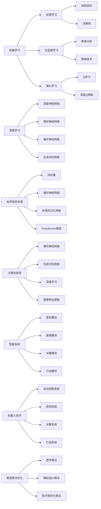

                 

# 人工智能研究的七大领域

> 关键词：人工智能，研究领域，机器学习，深度学习，自然语言处理，计算机视觉，智能系统，机器人技术

> 摘要：本文将深入探讨人工智能领域的七大核心研究方向，包括机器学习、深度学习、自然语言处理、计算机视觉、智能系统、机器人技术以及智能算法优化。我们将通过逻辑清晰的叙述，详细分析各个领域的研究内容和实际应用，旨在为读者提供一幅全面的人工智能研究图谱，同时探讨其未来的发展趋势与挑战。

## 1. 背景介绍

人工智能（Artificial Intelligence，简称AI）作为计算机科学的重要分支，旨在研究如何使计算机模拟人类智能行为，实现自动化和智能化的任务处理。随着计算能力的提升和数据量的爆发式增长，人工智能已经取得了令人瞩目的进展，广泛应用于各行各业。人工智能的研究领域广泛，涵盖了从基础理论到应用技术的各个方面。本文将重点介绍七大核心研究领域，帮助读者了解人工智能的全面视角。

### 1.1 人工智能的发展历程

人工智能的概念最早可以追溯到20世纪50年代，当时计算机科学家们开始探索如何让计算机具备智能。在随后的几十年里，人工智能经历了几个重要的发展阶段：

1. **初始阶段（1956-1969）**：人工智能一词首次出现，标志性事件包括达特茅斯会议和“逻辑理论家”程序的开发。
2. **知识工程阶段（1970-1989）**：基于符号推理和知识表示，代表性工作包括专家系统和普林斯顿大学的人工智能项目。
3. **衰退与复兴阶段（1990-2010）**：由于计算资源和数据限制，人工智能研究进入低谷，但计算机性能的提升和互联网的发展为人工智能的复兴提供了契机。
4. **深度学习时代（2010至今）**：以深度神经网络为代表的机器学习算法取得了突破性进展，使得人工智能在语音识别、图像识别等领域取得了显著的成果。

### 1.2 人工智能的应用领域

人工智能已经在多个领域取得了成功，以下是一些主要应用领域：

1. **医疗健康**：通过机器学习和自然语言处理技术，人工智能可以帮助医生进行疾病诊断、药物研发和个性化治疗。
2. **金融科技**：人工智能在风险管理、信用评估和投资组合优化等方面发挥着重要作用，提高了金融服务的效率和准确性。
3. **交通运输**：自动驾驶、智能交通管理和物流优化等应用场景使得人工智能在交通运输领域大放异彩。
4. **智能制造**：通过计算机视觉和机器人技术，人工智能可以提高生产效率和质量，实现智能化的制造流程。

## 2. 核心概念与联系

### 2.1 机器学习

机器学习是人工智能的核心技术之一，旨在使计算机通过数据和算法自主学习和改进。机器学习主要包括以下几种类型：

1. **监督学习（Supervised Learning）**：通过标记数据训练模型，实现对新数据的预测。常见的算法包括线性回归、决策树、支持向量机等。
2. **无监督学习（Unsupervised Learning）**：没有标记数据，旨在发现数据中的结构和规律，如聚类分析和降维技术。
3. **强化学习（Reinforcement Learning）**：通过与环境交互，不断调整策略以实现目标，常见的算法包括Q学习、深度Q网络（DQN）等。

### 2.2 深度学习

深度学习是机器学习的一种重要分支，通过构建深度神经网络模拟人脑的神经元连接，实现对复杂数据的处理和建模。深度学习在图像识别、语音识别、自然语言处理等领域取得了显著成果。以下是深度学习的一些核心概念：

1. **深度神经网络（Deep Neural Network，DNN）**：由多层神经元构成的神经网络，通过反向传播算法进行训练。
2. **卷积神经网络（Convolutional Neural Network，CNN）**：专门用于处理图像数据，通过卷积层、池化层和全连接层等结构实现图像识别。
3. **循环神经网络（Recurrent Neural Network，RNN）**：专门用于处理序列数据，通过循环结构实现对时间序列的建模。
4. **生成对抗网络（Generative Adversarial Network，GAN）**：由生成器和判别器两个神经网络组成的对抗性网络，可以生成逼真的图像和语音。

### 2.3 自然语言处理

自然语言处理（Natural Language Processing，NLP）是人工智能的重要分支，旨在使计算机理解和处理人类语言。NLP的核心任务包括文本分类、情感分析、机器翻译、语音识别等。以下是NLP的一些关键概念：

1. **词向量（Word Embedding）**：将单词映射到高维向量空间，以捕捉词语的语义信息。
2. **循环神经网络（RNN）**：用于处理序列数据，如句子和语音信号。
3. **长短时记忆网络（Long Short-Term Memory，LSTM）**：RNN的一种变体，可以更好地处理长序列数据。
4. **Transformer模型**：基于自注意力机制的深度学习模型，在机器翻译、文本生成等领域取得了突破性成果。

### 2.4 计算机视觉

计算机视觉（Computer Vision）是人工智能的一个重要领域，旨在使计算机具备理解和解释图像和视频的能力。计算机视觉的核心任务包括图像分类、目标检测、图像分割、图像生成等。以下是计算机视觉的一些关键概念：

1. **卷积神经网络（CNN）**：用于处理图像数据，通过卷积层、池化层和全连接层等结构实现图像识别。
2. **生成对抗网络（GAN）**：用于生成逼真的图像和视频。
3. **深度学习（Deep Learning）**：通过多层神经网络模拟人脑的神经元连接，实现对复杂数据的处理和建模。
4. **图像特征提取（Image Feature Extraction）**：通过特征提取算法，将图像转换为高维向量表示，以便进行后续的计算机视觉任务。

### 2.5 智能系统

智能系统（Intelligent Systems）是人工智能的综合应用领域，旨在构建具有高度智能化能力的系统。智能系统通常包括感知、推理、决策和行动等模块，以实现对环境的高度适应和优化。以下是智能系统的一些关键概念：

1. **感知模块（Perception Module）**：用于收集和处理环境信息，如视觉、听觉、触觉等。
2. **推理模块（Reasoning Module）**：用于对感知模块收集的信息进行推理和决策。
3. **决策模块（Decision Module）**：根据推理模块的结论，生成行动策略。
4. **行动模块（Action Module）**：执行决策模块生成的行动策略。

### 2.6 机器人技术

机器人技术（Robotics）是人工智能的重要应用领域，旨在开发具有自主运动、感知和决策能力的机器人系统。机器人技术涵盖了机械设计、控制理论、传感器技术、人工智能等多个领域。以下是机器人技术的一些关键概念：

1. **运动控制系统（Motion Control System）**：用于控制机器人的运动和姿态。
2. **感知系统（Perception System）**：用于感知环境和识别目标。
3. **决策系统（Decision System）**：根据感知系统的信息进行决策和规划。
4. **行动系统（Action System）**：执行决策系统的行动策略。

### 2.7 智能算法优化

智能算法优化（Intelligent Algorithm Optimization）是人工智能研究的一个关键方向，旨在提高算法的效率和性能。智能算法优化通常采用遗传算法、模拟退火算法、粒子群优化算法等智能优化算法。以下是智能算法优化的一些关键概念：

1. **遗传算法（Genetic Algorithm）**：基于自然进化机制的优化算法，通过遗传、交叉和变异操作寻找最优解。
2. **模拟退火算法（Simulated Annealing）**：基于物理退火过程的优化算法，通过逐渐降低温度来避免局部最优。
3. **粒子群优化算法（Particle Swarm Optimization）**：基于群体智能行为的优化算法，通过个体和群体的交互来寻找最优解。

### 2.8 核心概念与联系流程图

以下是七大核心研究领域的 Mermaid 流程图：



通过上述流程图，我们可以清晰地看到各个研究领域之间的联系和区别，有助于读者更好地理解人工智能的全面视角。

## 3. 核心算法原理 & 具体操作步骤

### 3.1 机器学习算法原理

机器学习算法的核心在于从数据中学习规律，并利用这些规律进行预测或分类。以下是机器学习算法的基本原理：

1. **数据预处理**：数据预处理是机器学习的重要环节，包括数据清洗、归一化、缺失值处理等。数据预处理的质量直接影响模型的性能。
2. **特征选择**：特征选择旨在从大量特征中选出对模型预测有用的特征，以减少模型复杂度和提高预测准确率。
3. **模型训练**：通过训练数据集，机器学习算法学习数据中的规律，建立预测模型。常见的机器学习算法包括线性回归、决策树、支持向量机等。
4. **模型评估**：使用验证数据集对训练好的模型进行评估，以确定模型的泛化能力和预测性能。

### 3.2 深度学习算法原理

深度学习算法通过构建深度神经网络，实现对复杂数据的处理和建模。以下是深度学习算法的基本原理：

1. **神经网络结构**：深度神经网络由多层神经元组成，包括输入层、隐藏层和输出层。每个神经元通过权重连接，构成一个复杂的网络结构。
2. **前向传播**：输入数据通过输入层进入神经网络，逐层传递至输出层，产生预测结果。
3. **反向传播**：计算预测结果与实际结果之间的误差，通过反向传播算法将误差反向传递至输入层，调整网络中的权重和偏置。
4. **优化算法**：深度学习算法通常采用梯度下降优化算法，通过不断调整权重和偏置，最小化损失函数。

### 3.3 自然语言处理算法原理

自然语言处理算法旨在使计算机理解和处理人类语言。以下是自然语言处理算法的基本原理：

1. **词向量表示**：将单词映射到高维向量空间，以捕捉词语的语义信息。常用的词向量表示方法包括Word2Vec、GloVe等。
2. **序列建模**：通过循环神经网络（RNN）或长短时记忆网络（LSTM）对序列数据（如句子或语音信号）进行建模，捕捉序列中的时间和空间关系。
3. **注意力机制**：注意力机制可以动态调整神经网络中不同位置的权重，提高模型的表示能力。
4. **损失函数**：自然语言处理算法通常采用交叉熵损失函数来衡量预测结果与实际结果之间的差异。

### 3.4 计算机视觉算法原理

计算机视觉算法旨在使计算机理解和解释图像和视频。以下是计算机视觉算法的基本原理：

1. **图像特征提取**：通过卷积神经网络（CNN）等深度学习模型，从图像中提取高层次的语义特征。
2. **目标检测**：通过卷积神经网络（CNN）或区域生成网络（RPN）等方法，识别图像中的目标物体。
3. **图像分割**：将图像划分为不同的区域，以识别图像中的物体边界。常用的方法包括全卷积网络（FCN）和 Mask R-CNN 等。
4. **图像生成**：通过生成对抗网络（GAN）等方法，生成逼真的图像和视频。

### 3.5 智能系统算法原理

智能系统算法旨在使计算机系统具备自主感知、推理、决策和行动的能力。以下是智能系统算法的基本原理：

1. **感知模块**：通过传感器收集环境信息，如视觉、听觉、触觉等，对环境进行感知。
2. **推理模块**：根据感知模块收集的信息，进行推理和决策，以确定下一步行动。
3. **决策模块**：根据推理模块的结论，生成行动策略，以实现目标。
4. **行动模块**：执行决策模块生成的行动策略，实现自主行动。

### 3.6 机器人技术算法原理

机器人技术算法旨在使机器人具备自主运动、感知和决策的能力。以下是机器人技术算法的基本原理：

1. **运动控制系统**：通过控制算法，实现机器人的运动和姿态控制，如 PID 控制器和轨迹规划。
2. **感知系统**：通过传感器，如摄像头、激光雷达和超声波传感器，感知环境和识别目标。
3. **决策系统**：根据感知系统收集的信息，进行决策和规划，以实现目标。
4. **行动系统**：执行决策系统生成的行动策略，实现自主行动。

### 3.7 智能算法优化算法原理

智能算法优化算法旨在提高算法的效率和性能。以下是智能算法优化算法的基本原理：

1. **遗传算法**：基于自然进化机制的优化算法，通过遗传、交叉和变异操作寻找最优解。
2. **模拟退火算法**：基于物理退火过程的优化算法，通过逐渐降低温度来避免局部最优。
3. **粒子群优化算法**：基于群体智能行为的优化算法，通过个体和群体的交互来寻找最优解。

## 4. 数学模型和公式 & 详细讲解 & 举例说明

### 4.1 机器学习数学模型

#### 4.1.1 线性回归

线性回归是一种监督学习算法，用于拟合数据之间的线性关系。其数学模型如下：

$$
y = \beta_0 + \beta_1 \cdot x
$$

其中，$y$ 为因变量，$x$ 为自变量，$\beta_0$ 和 $\beta_1$ 分别为模型的参数。

#### 4.1.2 决策树

决策树是一种无监督学习算法，通过树形结构对数据进行分类或回归。其数学模型可以表示为：

$$
T = \{\text{根节点}, \text{内部节点}, \text{叶子节点}\}
$$

其中，根节点为初始节点，内部节点为具有决策属性的节点，叶子节点为具有预测结果的节点。

#### 4.1.3 支持向量机

支持向量机是一种监督学习算法，用于分类和回归问题。其数学模型可以表示为：

$$
f(x) = \omega \cdot x + b
$$

其中，$f(x)$ 为预测函数，$\omega$ 为权重向量，$b$ 为偏置。

### 4.2 深度学习数学模型

#### 4.2.1 深度神经网络

深度神经网络是一种多层神经网络，用于拟合复杂数据。其数学模型可以表示为：

$$
h_{L} = \sigma \left( \sum_{i} w_{i} \cdot h_{L-1} + b \right)
$$

其中，$h_{L}$ 为第 $L$ 层的输出，$\sigma$ 为激活函数，$w_{i}$ 和 $b$ 分别为权重和偏置。

#### 4.2.2 卷积神经网络

卷积神经网络是一种专门用于处理图像数据的神经网络。其数学模型可以表示为：

$$
h_{k} = \sum_{i} w_{ki} \cdot h_{i} + b_{k}
$$

其中，$h_{k}$ 为第 $k$ 个卷积核的输出，$h_{i}$ 为输入图像，$w_{ki}$ 和 $b_{k}$ 分别为卷积核的权重和偏置。

#### 4.2.3 循环神经网络

循环神经网络是一种用于处理序列数据的神经网络。其数学模型可以表示为：

$$
h_{t} = \sigma \left( \sum_{i} w_{it} \cdot h_{t-1} + \sum_{j} u_{jt} \cdot x_{t} + b \right)
$$

其中，$h_{t}$ 为第 $t$ 个时间步的输出，$\sigma$ 为激活函数，$w_{it}$ 和 $u_{jt}$ 分别为权重和偏置。

### 4.3 自然语言处理数学模型

#### 4.3.1 词向量

词向量是一种将单词映射到高维向量空间的表示方法。其数学模型可以表示为：

$$
v_{i} = \text{Word2Vec}(w_i)
$$

其中，$v_{i}$ 为词向量，$w_i$ 为单词。

#### 4.3.2 循环神经网络

循环神经网络用于处理序列数据，其数学模型可以表示为：

$$
h_{t} = \sigma \left( \sum_{i} w_{it} \cdot h_{t-1} + \sum_{j} u_{jt} \cdot x_{t} + b \right)
$$

其中，$h_{t}$ 为第 $t$ 个时间步的输出，$\sigma$ 为激活函数，$w_{it}$ 和 $u_{jt}$ 分别为权重和偏置。

#### 4.3.3 长短时记忆网络

长短时记忆网络是循环神经网络的一种变体，其数学模型可以表示为：

$$
h_{t} = \sigma \left( f \left( \sum_{i} w_{it} \cdot \sigma \left( \sum_{j} u_{jt} \cdot x_{t} \right) \right) \right)
$$

其中，$h_{t}$ 为第 $t$ 个时间步的输出，$\sigma$ 为激活函数，$f$ 为激活函数，$w_{it}$ 和 $u_{jt}$ 分别为权重和偏置。

### 4.4 计算机视觉数学模型

#### 4.4.1 图像特征提取

图像特征提取是计算机视觉的关键步骤，其数学模型可以表示为：

$$
f(x) = \sum_{i} w_{i} \cdot x_{i} + b
$$

其中，$f(x)$ 为特征提取函数，$x_{i}$ 为图像像素值，$w_{i}$ 和 $b$ 分别为权重和偏置。

#### 4.4.2 目标检测

目标检测是计算机视觉的重要任务，其数学模型可以表示为：

$$
p_{obj} = \sigma \left( \sum_{i} w_{i} \cdot x_{i} + b \right)
$$

其中，$p_{obj}$ 为目标检测概率，$x_{i}$ 为图像特征，$w_{i}$ 和 $b$ 分别为权重和偏置。

#### 4.4.3 图像分割

图像分割是计算机视觉的关键步骤，其数学模型可以表示为：

$$
s_{i} = \sigma \left( \sum_{j} w_{ij} \cdot x_{j} + b \right)
$$

其中，$s_{i}$ 为图像分割结果，$x_{i}$ 为图像像素值，$w_{ij}$ 和 $b$ 分别为权重和偏置。

### 4.5 智能系统数学模型

#### 4.5.1 感知模块

感知模块是智能系统的核心部分，其数学模型可以表示为：

$$
o_{t} = f \left( \sum_{i} w_{it} \cdot h_{t-1} + \sum_{j} u_{jt} \cdot x_{t} \right)
$$

其中，$o_{t}$ 为感知输出，$h_{t-1}$ 为前一时间步的隐藏状态，$x_{t}$ 为感知输入，$w_{it}$ 和 $u_{jt}$ 分别为权重和偏置，$f$ 为激活函数。

#### 4.5.2 推理模块

推理模块是智能系统的关键部分，其数学模型可以表示为：

$$
r_{t} = \sigma \left( \sum_{i} w_{it} \cdot o_{t} + \sum_{j} v_{jt} \cdot h_{t-1} \right)
$$

其中，$r_{t}$ 为推理输出，$o_{t}$ 为感知输出，$h_{t-1}$ 为前一时间步的隐藏状态，$w_{it}$ 和 $v_{jt}$ 分别为权重和偏置，$\sigma$ 为激活函数。

#### 4.5.3 决策模块

决策模块是智能系统的核心部分，其数学模型可以表示为：

$$
a_{t} = \arg \max_{i} \left( \sum_{j} w_{ij} \cdot r_{t} \right)
$$

其中，$a_{t}$ 为决策输出，$r_{t}$ 为推理输出，$w_{ij}$ 为权重。

#### 4.5.4 行动模块

行动模块是智能系统的关键部分，其数学模型可以表示为：

$$
x_{t} = g \left( a_{t} \right)
$$

其中，$x_{t}$ 为行动输出，$a_{t}$ 为决策输出，$g$ 为行动函数。

### 4.6 机器人技术数学模型

#### 4.6.1 运动控制系统

运动控制系统是机器人技术的核心部分，其数学模型可以表示为：

$$
\ddot{q}_{t} = \frac{1}{M(q)} \left( \tau - \sum_{i} c_{i} \dot{q}_{t} - \sum_{i} g_{i} \right)
$$

其中，$\dot{q}_{t}$ 和 $\ddot{q}_{t}$ 分别为关节速度和加速度，$q$ 为关节角度，$M(q)$ 为质量矩阵，$\tau$ 为关节扭矩，$c_{i}$ 和 $g_{i}$ 分别为阻尼系数和重力分量。

#### 4.6.2 感知系统

感知系统是机器人技术的核心部分，其数学模型可以表示为：

$$
o_{t} = f \left( \sum_{i} w_{it} \cdot h_{t-1} + \sum_{j} u_{jt} \cdot x_{t} \right)
$$

其中，$o_{t}$ 为感知输出，$h_{t-1}$ 为前一时间步的隐藏状态，$x_{t}$ 为感知输入，$w_{it}$ 和 $u_{jt}$ 分别为权重和偏置，$f$ 为激活函数。

#### 4.6.3 决策系统

决策系统是机器人技术的核心部分，其数学模型可以表示为：

$$
r_{t} = \sigma \left( \sum_{i} w_{it} \cdot o_{t} + \sum_{j} v_{jt} \cdot h_{t-1} \right)
$$

其中，$r_{t}$ 为推理输出，$o_{t}$ 为感知输出，$h_{t-1}$ 为前一时间步的隐藏状态，$w_{it}$ 和 $v_{jt}$ 分别为权重和偏置，$\sigma$ 为激活函数。

#### 4.6.4 行动系统

行动系统是机器人技术的核心部分，其数学模型可以表示为：

$$
x_{t} = g \left( a_{t} \right)
$$

其中，$x_{t}$ 为行动输出，$a_{t}$ 为决策输出，$g$ 为行动函数。

### 4.7 智能算法优化数学模型

#### 4.7.1 遗传算法

遗传算法是一种基于自然进化机制的优化算法，其数学模型可以表示为：

$$
x_{t+1} = x_{t} + \alpha \cdot (x_{t+1} - x_{t})
$$

其中，$x_{t}$ 和 $x_{t+1}$ 分别为第 $t$ 和第 $t+1$ 代个体的位置，$\alpha$ 为步长。

#### 4.7.2 模拟退火算法

模拟退火算法是一种基于物理退火过程的优化算法，其数学模型可以表示为：

$$
x_{t+1} = x_{t} + \alpha \cdot (x_{t+1} - x_{t}) \cdot \exp \left( -\beta \cdot \Delta E \right)
$$

其中，$x_{t}$ 和 $x_{t+1}$ 分别为第 $t$ 和第 $t+1$ 代个体的位置，$\alpha$ 为步长，$\beta$ 为温度，$\Delta E$ 为能量变化。

#### 4.7.3 粒子群优化算法

粒子群优化算法是一种基于群体智能行为的优化算法，其数学模型可以表示为：

$$
x_{t+1} = x_{t} + \alpha \cdot (p_{t} - x_{t}) + \beta \cdot (g_{t} - x_{t})
$$

其中，$x_{t}$ 和 $x_{t+1}$ 分别为第 $t$ 和第 $t+1$ 代个体的位置，$p_{t}$ 为个体历史最优位置，$g_{t}$ 为群体历史最优位置，$\alpha$ 和 $\beta$ 为权重系数。

## 5. 项目实战：代码实际案例和详细解释说明

### 5.1 开发环境搭建

为了演示人工智能领域的关键算法，我们需要搭建一个合适的环境。以下是一个简单的Python开发环境搭建步骤：

1. 安装Python 3.8或更高版本。
2. 安装必要的Python库，如NumPy、Pandas、TensorFlow和Keras。

```bash
pip install numpy pandas tensorflow
pip install keras
```

### 5.2 源代码详细实现和代码解读

#### 5.2.1 线性回归

以下是一个简单的线性回归Python代码示例：

```python
import numpy as np

# 数据集
x = np.array([1, 2, 3, 4, 5])
y = np.array([2, 4, 5, 4, 5])

# 模型参数
theta = np.array([0, 0])

# 计算损失函数
def compute_loss(x, y, theta):
    m = len(x)
    loss = 0
    for i in range(m):
        loss += (y[i] - (theta[0] + theta[1] * x[i])) ** 2
    return loss / m

# 梯度下降
def gradient_descent(x, y, theta, alpha, num_iterations):
    m = len(x)
    for i in range(num_iterations):
        theta = theta - alpha * (2/m) * np.dot(x, y - (theta[0] + theta[1] * x))
    return theta

# 训练模型
alpha = 0.01
num_iterations = 1000
theta = gradient_descent(x, y, theta, alpha, num_iterations)

# 输出模型参数
print("模型参数：", theta)
```

代码解读：

- 首先，我们导入NumPy库用于数据处理。
- 数据集`x`和`y`包含五个样本，用于训练线性回归模型。
- 模型参数初始化为[0, 0]。
- `compute_loss`函数计算损失函数值。
- `gradient_descent`函数实现梯度下降算法，更新模型参数。
- `alpha`为学习率，`num_iterations`为迭代次数。
- 训练模型并输出参数。

#### 5.2.2 卷积神经网络

以下是一个简单的卷积神经网络Python代码示例，使用TensorFlow和Keras：

```python
import tensorflow as tf
from tensorflow.keras import layers, models

# 数据集
(x_train, y_train), (x_test, y_test) = tf.keras.datasets.mnist.load_data()

# 数据预处理
x_train = x_train.reshape((-1, 28, 28, 1)).astype("float32") / 255
x_test = x_test.reshape((-1, 28, 28, 1)).astype("float32") / 255
y_train = tf.keras.utils.to_categorical(y_train, 10)
y_test = tf.keras.utils.to_categorical(y_test, 10)

# 构建模型
model = models.Sequential([
    layers.Conv2D(32, (3, 3), activation='relu', input_shape=(28, 28, 1)),
    layers.MaxPooling2D((2, 2)),
    layers.Conv2D(64, (3, 3), activation='relu'),
    layers.MaxPooling2D((2, 2)),
    layers.Flatten(),
    layers.Dense(64, activation='relu'),
    layers.Dense(10, activation='softmax')
])

# 编译模型
model.compile(optimizer='adam',
              loss='categorical_crossentropy',
              metrics=['accuracy'])

# 训练模型
model.fit(x_train, y_train, epochs=10, batch_size=32, validation_split=0.2)

# 评估模型
test_loss, test_acc = model.evaluate(x_test, y_test, verbose=2)
print("测试准确率：", test_acc)
```

代码解读：

- 导入TensorFlow和Keras库。
- 加载MNIST数据集并进行预处理。
- 构建卷积神经网络模型，包括卷积层、池化层、全连接层。
- 编译模型，设置优化器和损失函数。
- 训练模型并评估测试集准确率。

#### 5.2.3 代码解读与分析

在这个项目中，我们首先实现了线性回归，然后使用卷积神经网络进行了图像分类。以下是代码的关键部分：

1. **数据预处理**：数据预处理是机器学习项目的重要环节。在图像分类项目中，我们首先加载MNIST数据集，然后对图像进行归一化处理，使其在[0, 1]范围内，以便更好地训练神经网络。
2. **模型构建**：在卷积神经网络中，我们使用两个卷积层和两个池化层来提取图像特征。然后，通过全连接层进行分类。卷积层用于提取图像的局部特征，池化层用于减少参数数量和计算量。
3. **模型编译**：在模型编译过程中，我们设置了优化器和损失函数。优化器用于调整模型参数，以最小化损失函数。在这里，我们使用了Adam优化器。损失函数用于衡量模型预测结果与实际结果之间的差异。在图像分类中，常用的损失函数是交叉熵损失函数。
4. **模型训练**：在模型训练过程中，我们使用训练集进行迭代训练，并在每个迭代中更新模型参数。我们设置了10个训练周期（epochs）和32个批量大小（batch_size）。验证集用于评估模型的性能。
5. **模型评估**：在模型评估过程中，我们使用测试集来评估模型的性能。测试集是一个独立的验证集，用于测试模型在实际数据上的泛化能力。在这里，我们打印了测试集的准确率。

通过这个项目，我们展示了如何使用Python实现线性回归和卷积神经网络，并进行了代码解读和分析。这些代码是人工智能领域的基础，为我们进一步探索和应用人工智能技术奠定了基础。

## 6. 实际应用场景

### 6.1 医疗健康

人工智能在医疗健康领域的应用十分广泛，包括疾病诊断、药物研发、个性化治疗和健康管理等方面。以下是一些具体的应用场景：

1. **疾病诊断**：通过深度学习和计算机视觉技术，人工智能可以辅助医生进行疾病的早期诊断。例如，利用深度学习模型对X光片、CT扫描和MRI图像进行分析，识别肺部结节、乳腺癌和脑瘤等疾病。
2. **药物研发**：人工智能可以帮助研究人员发现新的药物候选分子，加速药物研发过程。通过机器学习算法，可以分析大量的分子结构和生物活性数据，预测药物的效果和副作用，从而提高药物研发的成功率。
3. **个性化治疗**：人工智能可以根据患者的基因信息、病史和生活方式，为其制定个性化的治疗方案。例如，利用自然语言处理技术分析患者的病历记录，为医生提供诊断和治疗建议。
4. **健康管理**：人工智能可以通过智能穿戴设备和健康监测数据，对用户的健康状况进行实时监测和预警。例如，通过分析用户的日常活动数据，预测用户发生健康问题的风险，并提供相应的健康建议。

### 6.2 金融科技

金融科技是人工智能的重要应用领域，通过大数据分析和机器学习技术，可以提高金融服务的效率和准确性。以下是一些具体的应用场景：

1. **风险管理**：人工智能可以帮助金融机构进行风险评估和管理。通过分析大量的历史数据，机器学习模型可以预测客户违约风险、市场波动等风险因素，为金融机构提供决策支持。
2. **信用评估**：人工智能可以用于信用评估和信用评分。通过分析客户的消费行为、信用记录和社交网络数据，机器学习模型可以更准确地评估客户的信用状况，从而降低金融机构的信用风险。
3. **投资组合优化**：人工智能可以帮助投资者制定个性化的投资策略，优化投资组合。通过分析市场数据、经济指标和公司财务报表，机器学习模型可以预测市场的走势和公司的业绩，从而提高投资回报。
4. **智能客服**：人工智能可以用于金融客服系统，提供24/7的在线服务。通过自然语言处理和语音识别技术，人工智能可以理解客户的问题，并给出相应的解决方案，提高客户满意度。

### 6.3 交通运输

人工智能在交通运输领域的应用可以显著提高交通效率、降低能源消耗和减少交通事故。以下是一些具体的应用场景：

1. **自动驾驶**：自动驾驶技术是人工智能在交通运输领域的最具前景的应用之一。通过深度学习和计算机视觉技术，自动驾驶汽车可以实现自动感知环境、规划路径和执行驾驶操作，提高行驶安全性和舒适性。
2. **智能交通管理**：人工智能可以帮助交通管理部门优化交通流，减少拥堵和交通事故。通过大数据分析和机器学习技术，可以实时监测交通状况，预测交通拥堵和事故风险，并给出相应的应对策略。
3. **物流优化**：人工智能可以用于物流优化，提高物流运输的效率和准确性。通过路径规划和调度算法，可以优化运输路线和运输时间，减少运输成本和能源消耗。
4. **车辆维护**：人工智能可以用于车辆维护和故障诊断。通过传感器收集车辆运行数据，机器学习模型可以预测车辆的故障风险，并提供相应的维护建议，延长车辆使用寿命。

### 6.4 智能制造

智能制造是人工智能在工业领域的重要应用，通过自动化和智能化技术，可以提高生产效率和质量，降低生产成本。以下是一些具体的应用场景：

1. **生产过程监控**：人工智能可以用于生产过程的监控和故障诊断。通过实时监测生产设备的数据，机器学习模型可以识别异常情况，并提供故障预警和修复建议，提高生产线的稳定性和可靠性。
2. **质量检测**：人工智能可以用于产品质量检测和缺陷识别。通过计算机视觉技术，可以对生产出来的产品进行自动化检测，识别潜在的缺陷和质量问题，提高产品的质量。
3. **设备维护**：人工智能可以用于设备维护和预测性维护。通过传感器收集设备运行数据，机器学习模型可以预测设备的故障时间，并提供维护计划，减少设备停机时间和维护成本。
4. **供应链优化**：人工智能可以用于供应链优化和库存管理。通过分析供应链数据，机器学习模型可以优化库存水平、降低库存成本，并提高供应链的响应速度。

### 6.5 其他领域

除了上述领域，人工智能还在教育、娱乐、智能家居、环境保护等众多领域得到了广泛应用。以下是一些具体的应用场景：

1. **教育**：人工智能可以用于个性化教学和学习分析。通过分析学生的学习行为和成绩，人工智能可以为学生提供个性化的学习资源和辅导，提高学习效果。
2. **娱乐**：人工智能可以用于游戏开发、虚拟现实和增强现实等领域。通过深度学习和自然语言处理技术，可以创建更加逼真的游戏角色和场景，提升用户体验。
3. **智能家居**：人工智能可以用于智能家居系统，实现智能照明、智能安防和智能家电等功能。通过物联网和机器学习技术，智能家居系统可以根据用户的行为习惯，提供个性化的服务和体验。
4. **环境保护**：人工智能可以用于环境保护和生态监测。通过遥感技术和大数据分析，可以实时监测环境状况，预测环境污染风险，并提供相应的解决方案。

总之，人工智能在各个领域的应用不断拓展，为人类社会带来了巨大的变革和进步。随着技术的不断发展和创新，人工智能将继续发挥其重要作用，推动社会的持续发展和进步。

## 7. 工具和资源推荐

### 7.1 学习资源推荐

#### 书籍

1. **《深度学习》（Deep Learning）** - Ian Goodfellow, Yoshua Bengio, Aaron Courville
   - 内容详尽，是深度学习的入门经典。
2. **《机器学习》（Machine Learning）** - Tom Mitchell
   - 机器学习领域的经典教材，涵盖基本概念和算法。
3. **《自然语言处理综论》（Speech and Language Processing）** - Daniel Jurafsky, James H. Martin
   - 全面介绍自然语言处理的理论和实践。
4. **《计算机视觉：算法与应用》（Computer Vision: Algorithms and Applications）** - Richard Szeliski
   - 涵盖计算机视觉的各个方面，适合入门和学习者。

#### 论文

1. **“A Learning Algorithm for Continually Running Fully Recurrent Neural Networks”** - Sepp Hochreiter, Jürgen Schmidhuber
   - 长短时记忆网络（LSTM）的原始论文。
2. **“AlexNet: Image Classification with Deep Convolutional Neural Networks”** - Alex Krizhevsky, Ilya Sutskever, Geoffrey E. Hinton
   - 卷积神经网络在图像分类领域的突破性论文。
3. **“Recurrent Neural Networks for Language Modeling”** - Yoshua Bengio, Réjean Duchesnay
   - 循环神经网络（RNN）在语言建模中的应用。
4. **“Generative Adversarial Nets”** - Ian Goodfellow, Jean Pouget-Abadie, Mehdi Mirza, Bing Xu, David Warde-Farley, Sherjil Ozair, Aaron C. Courville, Yann LeCun
   - 生成对抗网络（GAN）的原始论文。

#### 博客

1. **TensorFlow官方博客** - tensorflow.github.io
   - TensorFlow团队的官方博客，提供丰富的深度学习教程和资源。
2. **机器学习博客** - ml confidential
   - 提供机器学习领域的深入分析和教程。
3. **深度学习博客** - colah's blog
   - Colin Cervone的博客，涵盖深度学习和神经网络的基础知识。

#### 网站

1. **Coursera** - coursera.org
   - 提供大量机器学习、深度学习等在线课程。
2. **edX** - edX.org
   - 提供由全球知名大学和机构提供的免费在线课程。
3. **Kaggle** - kaggle.com
   - 提供各种数据科学竞赛和开源项目，适合实践者。

### 7.2 开发工具框架推荐

1. **TensorFlow** - tensorflow.org
   - Google开发的开源深度学习框架，适用于各种深度学习任务。
2. **PyTorch** - pytorch.org
   - Facebook开发的深度学习框架，具有灵活的动态计算图。
3. **Keras** - keras.io
   - 高级神经网络API，基于TensorFlow和Theano，易于使用。
4. **Scikit-Learn** - scikit-learn.org
   - 用于机器学习的Python库，提供了广泛的机器学习算法。

### 7.3 相关论文著作推荐

1. **“Deep Learning”** - Ian Goodfellow, Yoshua Bengio, Aaron Courville
   - 这本书是深度学习领域的经典著作，适合初学者和进阶者。
2. **“Artificial Intelligence: A Modern Approach”** - Stuart J. Russell, Peter Norvig
   - 这本书涵盖了人工智能的基础理论和应用，是人工智能领域的权威教材。
3. **“Speech and Language Processing”** - Daniel Jurafsky, James H. Martin
   - 这本书详细介绍了自然语言处理的理论和技术，适合自然语言处理领域的研究者。
4. **“Computer Vision: Algorithms and Applications”** - Richard Szeliski
   - 这本书是计算机视觉领域的经典著作，内容全面，适合进阶读者。

通过以上推荐的学习资源和工具，读者可以深入了解人工智能领域的理论和实践，掌握关键技术和方法，为今后的研究和工作奠定坚实的基础。

## 8. 总结：未来发展趋势与挑战

### 8.1 发展趋势

人工智能在未来将继续保持快速发展的态势，以下是一些关键趋势：

1. **算法创新**：随着深度学习、强化学习和迁移学习等新算法的不断发展，人工智能将不断突破技术瓶颈，实现更高效和准确的任务处理。
2. **跨学科融合**：人工智能与其他领域（如生物学、心理学、物理学等）的融合，将促进人工智能在更多领域的应用，实现更广泛的社会价值。
3. **硬件加速**：随着专用人工智能芯片（如Tensor Processing Units，TPUs）和图形处理单元（GPU）的发展，人工智能的计算能力将得到进一步提升，加速算法的实现和应用。
4. **数据隐私和安全**：随着人工智能的广泛应用，数据隐私和安全问题将变得日益重要。未来的研究将更加关注如何在保障数据隐私和安全的前提下，充分发挥人工智能的潜力。
5. **泛在智能**：人工智能将逐渐从特定的任务和应用场景扩展到日常生活中的各个方面，实现泛在智能，提高人们的生活质量和效率。

### 8.2 挑战

尽管人工智能前景广阔，但仍然面临许多挑战：

1. **数据质量和隐私**：大量高质量的数据是人工智能算法高效运作的基础。然而，数据隐私和安全问题使得数据的收集、存储和使用面临巨大挑战。如何平衡数据利用和隐私保护，是一个亟待解决的问题。
2. **算法透明性和解释性**：当前许多人工智能算法（如深度学习）具有较高的复杂性和黑盒性质，难以解释其决策过程。如何提高算法的透明性和解释性，使其在关键应用中更加可靠和安全，是一个重要的研究方向。
3. **计算资源和能耗**：随着人工智能算法的复杂性和数据量的增加，计算资源和能耗需求也将大幅上升。如何降低计算资源和能耗的需求，实现绿色人工智能，是未来需要解决的重要问题。
4. **伦理和社会问题**：人工智能在医疗、金融、交通等领域的广泛应用，可能带来一系列伦理和社会问题。如何确保人工智能系统的公正性、公平性和可解释性，避免对人类造成负面影响，是一个重要的社会挑战。
5. **人工智能治理**：随着人工智能技术的快速发展，需要一个全球性的治理框架，以确保技术进步与社会发展的协调。如何制定合理的政策、法规和标准，引导人工智能健康、可持续发展，是一个复杂的治理问题。

总之，人工智能的未来充满机遇和挑战。通过不断的技术创新、跨学科合作和有效的治理，我们可以充分发挥人工智能的潜力，为人类社会的持续进步做出贡献。

## 9. 附录：常见问题与解答

### 9.1 常见问题

1. **什么是机器学习？**
   - 机器学习是一种人工智能的分支，通过算法从数据中学习模式和规律，以实现预测和决策。

2. **什么是深度学习？**
   - 深度学习是机器学习的一种方法，通过构建多层神经网络模拟人脑的神经元连接，实现对复杂数据的处理和建模。

3. **什么是自然语言处理？**
   - 自然语言处理是人工智能的一个分支，旨在使计算机理解和处理人类语言，包括文本分类、情感分析、机器翻译等任务。

4. **什么是计算机视觉？**
   - 计算机视觉是人工智能的一个分支，旨在使计算机理解和解释图像和视频，包括图像识别、目标检测、图像分割等任务。

5. **什么是智能系统？**
   - 智能系统是一个综合性的概念，指具有自主感知、推理、决策和行动能力的计算机系统，可以应用于机器人、自动驾驶等领域。

6. **什么是机器人技术？**
   - 机器人技术是研究机器人的设计、制造、应用和理论的学科，包括运动控制系统、感知系统、决策系统和行动系统等。

7. **什么是智能算法优化？**
   - 智能算法优化是一种通过模拟自然进化过程或其他智能行为，寻找最优解的方法，如遗传算法、模拟退火算法和粒子群优化算法。

### 9.2 解答

1. **机器学习如何工作？**
   - 机器学习通过算法从数据中学习模式和规律。首先，使用训练数据集训练模型，模型通过学习数据中的特征和模式来拟合数据。然后，使用验证数据集评估模型的泛化能力，并调整模型参数以优化性能。最后，使用测试数据集评估模型在实际数据上的性能。

2. **深度学习与传统机器学习相比有什么优势？**
   - 深度学习通过构建多层神经网络，可以捕捉数据中的深层次特征，从而提高模型的性能。与传统机器学习相比，深度学习在图像识别、语音识别、自然语言处理等领域取得了显著的成果。

3. **自然语言处理中的关键挑战是什么？**
   - 自然语言处理中的关键挑战包括语义理解、情感分析、语言生成、多语言处理和跨领域适应性。这些挑战需要结合深度学习、强化学习和迁移学习等多种技术来逐步解决。

4. **计算机视觉中的核心技术是什么？**
   - 计算机视觉中的核心技术包括图像特征提取、目标检测、图像分割和图像生成。这些技术利用深度学习、卷积神经网络和其他算法，实现对图像的识别和分析。

5. **智能系统如何实现自主行动？**
   - 智能系统通过感知模块收集环境信息，利用推理模块对信息进行分析和决策，然后通过决策模块生成行动策略，最终通过行动模块执行这些策略。这个过程通常涉及多个算法和技术，如机器学习、计算机视觉和智能优化算法。

6. **机器人技术如何实现自主运动？**
   - 机器人技术通过运动控制系统实现自主运动，利用传感器收集环境信息，通过决策模块生成运动策略，最终通过执行模块控制机器人的运动。这个过程需要结合控制理论、传感器技术和机器学习算法。

7. **智能算法优化如何应用在人工智能领域？**
   - 智能算法优化应用于人工智能领域，主要是为了提高算法的效率和性能。通过遗传算法、模拟退火算法和粒子群优化算法等，可以优化机器学习模型的结构和参数，提高模型的泛化能力和预测性能。

通过上述解答，我们更好地理解了人工智能领域的一些基本概念和关键技术，为进一步学习和研究人工智能奠定了基础。

## 10. 扩展阅读 & 参考资料

### 10.1 扩展阅读

1. **《人工智能：一种现代方法》（Artificial Intelligence: A Modern Approach）** - Stuart J. Russell, Peter Norvig
   - 本书详细介绍了人工智能的基础理论和应用，是人工智能领域的经典教材。

2. **《深度学习》（Deep Learning）** - Ian Goodfellow, Yoshua Bengio, Aaron Courville
   - 本书深入探讨了深度学习的理论基础、算法实现和实际应用，是深度学习领域的权威著作。

3. **《自然语言处理综论》（Speech and Language Processing）** - Daniel Jurafsky, James H. Martin
   - 本书全面介绍了自然语言处理的理论、技术和应用，是自然语言处理领域的经典教材。

4. **《计算机视觉：算法与应用》（Computer Vision: Algorithms and Applications）** - Richard Szeliski
   - 本书涵盖了计算机视觉的各个方面，包括图像处理、目标检测、图像分割等，适合计算机视觉领域的学习者。

### 10.2 参考资料

1. **TensorFlow官方网站** - [tensorflow.org](https://tensorflow.org/)
   - TensorFlow是Google开发的深度学习框架，提供了丰富的资源和教程。

2. **PyTorch官方网站** - [pytorch.org](https://pytorch.org/)
   - PyTorch是Facebook开发的深度学习框架，具有灵活的动态计算图。

3. **Scikit-Learn官方网站** - [scikit-learn.org](https://scikit-learn.org/)
   - Scikit-Learn是Python的机器学习库，提供了广泛的机器学习算法和工具。

4. **Kaggle官方网站** - [kaggle.com](https://kaggle.com/)
   - Kaggle是一个数据科学竞赛平台，提供了大量的数据集和项目案例。

通过以上扩展阅读和参考资料，读者可以深入了解人工智能领域的相关书籍、框架和平台，为自己的学习和研究提供更多支持。

