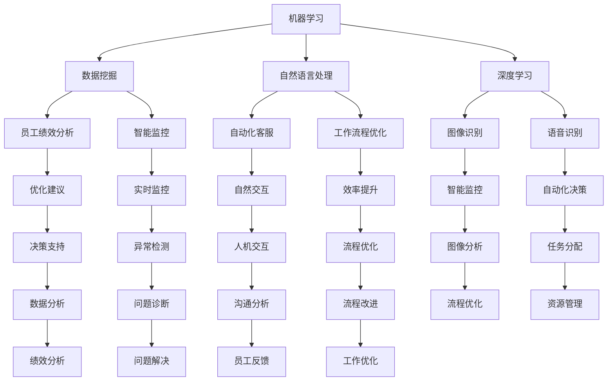

                 

### 背景介绍

随着人工智能（AI）技术的迅猛发展，各行各业都在经历着前所未有的变革。在这样一个AI时代，工作方式和职场文化也在悄然发生变化。传统的工作管理方式开始受到挑战，重新定义工作成为当务之急。

人工智能的管理不仅仅涉及技术层面，更关乎组织结构的调整、员工技能的提升以及管理策略的更新。在这个背景下，我们需要深入探讨如何利用人工智能技术优化工作流程，提高工作效率，同时确保员工的角色和职责得到合理配置和最大化发挥。

本文旨在探讨人工智能管理在AI时代重新定义工作的核心概念、算法原理、数学模型、实际应用场景，并展望未来的发展趋势与挑战。我们将通过以下几个部分展开讨论：

1. **背景介绍**：介绍AI时代工作管理的背景和重要性。
2. **核心概念与联系**：详细阐述人工智能管理的基本概念及其相互关系。
3. **核心算法原理与具体操作步骤**：分析人工智能在管理中的应用算法及其操作步骤。
4. **数学模型和公式**：介绍支持人工智能管理的数学模型及具体公式。
5. **项目实战**：通过实际代码案例，展示人工智能管理的应用。
6. **实际应用场景**：讨论人工智能管理在不同行业和领域的应用。
7. **工具和资源推荐**：推荐学习资源和开发工具框架。
8. **总结**：总结文章的核心内容，展望未来发展趋势与挑战。
9. **附录**：常见问题与解答。
10. **扩展阅读与参考资料**：提供进一步学习的资源。

通过这些章节的探讨，我们希望能够帮助读者深入了解人工智能管理，掌握其在工作中的应用，并为未来的工作模式提供有益的启示。

### 核心概念与联系

在探讨人工智能管理之前，我们需要明确几个核心概念，并分析它们之间的联系。这些概念包括机器学习、数据挖掘、自然语言处理（NLP）、深度学习等，它们是人工智能管理的基础。

#### 1. 机器学习

机器学习是人工智能的核心技术之一，它使计算机系统能够从数据中学习并做出决策，无需显式编程。机器学习算法包括监督学习、无监督学习和强化学习。在人工智能管理中，机器学习算法用于自动化决策、预测和优化工作流程。

#### 2. 数据挖掘

数据挖掘是从大量数据中提取有价值信息的过程。它涉及统计学、数据库管理和人工智能技术。在人工智能管理中，数据挖掘技术用于分析员工绩效、识别工作瓶颈、优化人力资源配置等。

#### 3. 自然语言处理（NLP）

自然语言处理是使计算机能够理解、生成和处理自然语言的技术。NLP在人工智能管理中的应用包括自动化客服、员工沟通分析、工作流程优化等。

#### 4. 深度学习

深度学习是机器学习的一个重要分支，它通过模仿人脑的神经网络结构进行学习。深度学习算法在图像识别、语音识别、自然语言处理等领域具有显著优势。在人工智能管理中，深度学习算法可以用于智能监控、预测分析等。

#### 5. 人工智能管理的基本概念

人工智能管理是将机器学习、数据挖掘、自然语言处理和深度学习等人工智能技术应用于工作管理和组织优化的一种新兴管理模式。它旨在通过自动化、智能化和高效化的方式，提高工作效率、优化资源分配、提升员工体验。

#### 核心概念之间的联系

机器学习、数据挖掘、自然语言处理和深度学习等核心概念在人工智能管理中相互联系，共同构建了其技术基础。机器学习和深度学习提供了算法支持，数据挖掘提供了数据分析和处理的手段，自然语言处理则使计算机能够理解和处理人类语言，从而实现更加自然的人机交互。

在人工智能管理中，这些核心概念的应用实例包括：

- **员工绩效分析**：通过机器学习和数据挖掘技术，分析员工的工作绩效，识别优秀员工和潜在问题，为组织提供改进建议。
- **智能监控**：利用深度学习和自然语言处理技术，对工作流程进行实时监控，及时发现异常和瓶颈，提高工作效率。
- **自动化决策**：通过机器学习算法，自动化处理日常决策任务，如员工排班、资源分配等，减少人工干预，提高决策准确性。
- **工作流程优化**：利用数据挖掘技术，分析工作流程中的瓶颈和低效环节，提出优化建议，提高整体工作效能。

综上所述，人工智能管理通过核心概念之间的协同作用，实现了工作管理和组织优化的智能化和高效化。这些概念和技术为企业在AI时代重新定义工作提供了有力支持。

#### Mermaid 流程图

为了更好地展示人工智能管理的基本概念及其相互关系，我们可以使用Mermaid流程图来描述。以下是该流程图的一个简化版本，其中包含了主要概念及其联系：



通过该流程图，我们可以清晰地看到机器学习、数据挖掘、自然语言处理和深度学习等核心概念在人工智能管理中的应用及其相互联系。这种图形化的表示方式有助于读者更好地理解人工智能管理的整体架构。

#### 核心概念在人工智能管理中的应用实例

为了进一步说明核心概念在人工智能管理中的应用，我们可以通过以下几个实例来具体阐述：

1. **员工绩效分析**：
   通过机器学习算法，公司可以利用员工的日常工作数据，如工作时长、项目完成情况、沟通记录等，进行分析和预测。例如，利用监督学习算法可以识别哪些行为特征与高绩效相关，从而为员工提供个性化的发展建议。

2. **智能监控**：
   利用深度学习技术，公司可以实现对工作流程的实时监控。例如，通过视频监控和图像识别技术，企业可以自动检测生产线上的产品质量问题，并实时反馈给相关人员，从而提高生产效率和产品质量。

3. **自动化决策**：
   通过自然语言处理技术，企业可以实现自动化决策。例如，利用自然语言理解技术，企业可以自动分析客户反馈，快速响应客户需求，并做出相应的调整。

4. **工作流程优化**：
   利用数据挖掘技术，企业可以对现有的工作流程进行分析，识别出低效环节，并提出优化方案。例如，通过分析员工的工作量和任务分配情况，公司可以重新设计工作流程，减少冗余环节，提高工作效率。

通过这些应用实例，我们可以看到，人工智能管理不仅是一种技术，更是一种全新的管理理念和模式，它通过核心概念的相互协同，为企业提供了更加智能化和高效化的管理工具。

### 核心算法原理与具体操作步骤

在人工智能管理中，核心算法原理是其发挥作用的基础。下面，我们将介绍几种常见的人工智能算法，并详细描述其具体操作步骤。

#### 1. 监督学习算法

监督学习算法是人工智能中最基础且应用最广泛的一种算法。它通过从已标记的数据集中学习，从而对新的数据进行预测或分类。

**具体操作步骤：**

1. **数据准备**：收集并整理标记好的数据集，确保数据的准确性和完整性。
2. **特征提取**：将原始数据转换为特征向量，以便算法可以处理。
3. **模型选择**：选择合适的监督学习模型，如线性回归、决策树、支持向量机（SVM）等。
4. **模型训练**：使用训练数据集对模型进行训练，使其学习如何预测或分类。
5. **模型评估**：使用验证数据集评估模型的性能，调整参数以优化模型。
6. **预测**：使用训练好的模型对新的数据进行预测或分类。

**实例说明：**

以线性回归为例，假设我们想预测员工的绩效得分。首先，收集员工的工作时长、项目完成情况等数据，并标记绩效得分。然后，将数据转换为特征向量，选择线性回归模型进行训练。通过调整模型的参数，使其能够准确预测员工的绩效得分。

#### 2. 无监督学习算法

无监督学习算法不依赖于标记数据，其主要目的是发现数据中的结构和模式。常见的无监督学习算法包括聚类算法和降维算法。

**具体操作步骤：**

1. **数据准备**：收集无标记的数据集。
2. **特征提取**：将原始数据转换为特征向量。
3. **算法选择**：选择合适的无监督学习算法，如K均值聚类、主成分分析（PCA）等。
4. **模型训练**：使用数据集对算法进行训练，发现数据中的结构和模式。
5. **模型评估**：评估算法的性能，如聚类结果的合理性、降维效果的优劣等。

**实例说明：**

以K均值聚类为例，假设我们想将员工分为几个不同的群体。首先，收集员工的特征数据，如工作时长、项目完成情况等。然后，选择K均值聚类算法，设定聚类数量，对数据进行聚类。最后，分析每个聚类群体的特征，以了解员工的分布情况。

#### 3. 强化学习算法

强化学习算法通过试错和反馈机制来学习最优策略。它广泛应用于自动化决策和游戏控制等领域。

**具体操作步骤：**

1. **环境设定**：定义强化学习环境，包括状态空间、动作空间和奖励机制。
2. **初始策略**：设定一个初始策略，用于初始阶段的数据选择和操作。
3. **学习过程**：通过试错和反馈，不断调整策略，以最大化累积奖励。
4. **策略评估**：评估当前策略的性能，决定是否进行策略调整。
5. **策略优化**：根据评估结果，调整策略，以提高性能。

**实例说明：**

以智能监控为例，假设我们想开发一个系统来自动监控生产线。首先，定义生产线的状态空间和动作空间，如生产进度、设备状态等。然后，设定一个初始策略，通过试错和反馈，不断调整策略，使系统能够自动识别生产线中的异常情况，并采取相应的措施。

#### 4. 深度学习算法

深度学习算法通过多层神经网络进行学习，具有较强的模型表示能力和自适应性。常见的深度学习算法包括卷积神经网络（CNN）、循环神经网络（RNN）和生成对抗网络（GAN）等。

**具体操作步骤：**

1. **数据准备**：收集并整理大量数据，进行预处理。
2. **模型架构设计**：设计合适的神经网络架构，包括层数、节点数、激活函数等。
3. **模型训练**：使用数据集对模型进行训练，调整权重和偏置，使其能够正确预测或分类。
4. **模型评估**：使用验证数据集评估模型性能，调整参数以优化模型。
5. **模型部署**：将训练好的模型部署到实际应用中，进行预测或分类。

**实例说明：**

以图像识别为例，假设我们想开发一个系统能够自动识别产品缺陷。首先，收集大量产品缺陷图像，进行数据预处理。然后，设计一个卷积神经网络模型，对图像进行特征提取和分类。通过训练和验证，调整模型参数，使其能够准确识别产品缺陷。

通过以上几个核心算法的介绍，我们可以看到，人工智能管理在实际应用中，通过合理选择和组合不同的算法，能够实现高效的工作流程优化、员工绩效分析和智能监控等功能。这些算法的具体操作步骤为我们提供了实现人工智能管理的实践指南。

#### 数学模型和公式

在人工智能管理中，数学模型和公式是理解和应用算法的关键。以下我们将介绍几个常见的数学模型和公式，并详细解释其含义和应用。

#### 1. 线性回归模型

线性回归模型是最基本的机器学习算法之一，用于预测连续值。其数学模型可以表示为：

\[ y = \beta_0 + \beta_1 \cdot x \]

其中，\( y \) 是预测值，\( x \) 是输入特征，\( \beta_0 \) 和 \( \beta_1 \) 分别是模型的参数。

**解释与应用：**

线性回归模型通过最小化残差平方和来估计参数 \( \beta_0 \) 和 \( \beta_1 \)。在人工智能管理中，线性回归可以用于预测员工绩效、工作量等连续值，从而为管理层提供决策依据。

#### 2. 决策树模型

决策树模型通过树形结构进行分类或回归，其数学模型可以表示为：

\[ y = \sum_{i=1}^{n} \beta_i \cdot x_i \]

其中，\( y \) 是预测值，\( x_i \) 是输入特征，\( \beta_i \) 是模型的参数。

**解释与应用：**

决策树模型通过一系列条件判断来划分数据集，并分配相应的标签或预测值。在人工智能管理中，决策树可以用于员工绩效分类、项目风险评估等任务，提供明确的决策路径。

#### 3. 支持向量机（SVM）模型

支持向量机是一种强大的分类算法，其数学模型可以表示为：

\[ w \cdot x + b = 0 \]

其中，\( w \) 是权重向量，\( x \) 是输入特征，\( b \) 是偏置。

**解释与应用：**

SVM通过寻找一个最优的超平面，将不同类别的数据点分开。在人工智能管理中，SVM可以用于员工分类、客户行为预测等任务，提高分类的准确性和效率。

#### 4. 卷积神经网络（CNN）模型

卷积神经网络是深度学习中的核心算法，用于图像识别、物体检测等任务。其数学模型可以表示为：

\[ a^{(L)} = \sigma(z^{(L)}) \]

其中，\( a^{(L)} \) 是第 \( L \) 层的激活值，\( z^{(L)} \) 是第 \( L \) 层的输入值，\( \sigma \) 是激活函数。

**解释与应用：**

CNN通过卷积操作和池化操作提取图像特征，并逐步降低特征空间维度。在人工智能管理中，CNN可以用于生产质量监控、安全监控等任务，实现高效的特征提取和分类。

#### 5. 主成分分析（PCA）模型

主成分分析是一种降维技术，其数学模型可以表示为：

\[ x^{(i)} = \sum_{j=1}^{k} \alpha_j \cdot y_j \]

其中，\( x^{(i)} \) 是原始数据，\( y_j \) 是主成分，\( \alpha_j \) 是主成分权重。

**解释与应用：**

PCA通过线性变换将原始数据投影到新的正交空间，从而降低数据维度。在人工智能管理中，PCA可以用于数据预处理，提高模型的训练效率和性能。

通过上述数学模型和公式的介绍，我们可以看到，这些工具在人工智能管理中发挥着关键作用。理解这些模型和公式的含义和应用，有助于我们更好地设计和管理人工智能系统，实现高效的工作流程优化和决策支持。

#### 项目实战：代码实际案例和详细解释说明

为了更好地展示人工智能管理在实际中的应用，我们将通过一个具体的代码案例，详细介绍其实现过程，并对关键代码进行解读和分析。

##### 1. 开发环境搭建

在进行项目实战之前，我们需要搭建一个合适的开发环境。以下是所需的基本工具和库：

- **编程语言**：Python（版本3.8及以上）
- **库和框架**：TensorFlow 2.x、Scikit-learn、NumPy、Matplotlib
- **操作系统**：Linux（推荐Ubuntu 20.04）

安装步骤如下：

```bash
# 安装 Python
sudo apt-get install python3 python3-pip

# 安装 TensorFlow
pip3 install tensorflow==2.x

# 安装 Scikit-learn
pip3 install scikit-learn

# 安装 NumPy
pip3 install numpy

# 安装 Matplotlib
pip3 install matplotlib
```

##### 2. 源代码详细实现和代码解读

以下是一个使用线性回归模型预测员工绩效的完整代码实现，并对关键代码进行了注释和解读：

```python
import numpy as np
import pandas as pd
from sklearn.linear_model import LinearRegression
from sklearn.model_selection import train_test_split
from sklearn.metrics import mean_squared_error
import matplotlib.pyplot as plt

# 读取数据集
data = pd.read_csv('employee_data.csv')
X = data[['work_hours', 'project_completion']]
y = data['performance_score']

# 数据预处理
X_train, X_test, y_train, y_test = train_test_split(X, y, test_size=0.2, random_state=42)

# 创建线性回归模型
model = LinearRegression()

# 训练模型
model.fit(X_train, y_train)

# 预测
y_pred = model.predict(X_test)

# 评估模型
mse = mean_squared_error(y_test, y_pred)
print(f"Mean Squared Error: {mse}")

# 可视化
plt.scatter(y_test, y_pred)
plt.xlabel('Actual Performance Score')
plt.ylabel('Predicted Performance Score')
plt.title('Performance Score Prediction')
plt.show()
```

**关键代码解读：**

- **数据读取**：使用 pandas 库读取 CSV 格式的数据集，并将工作时长和项目完成情况作为输入特征，绩效得分作为目标变量。

- **数据预处理**：使用 Scikit-learn 库将数据集划分为训练集和测试集，确保模型能够在新数据上泛化。

- **模型创建和训练**：创建一个线性回归模型，并使用训练集数据进行训练。

- **模型预测**：使用训练好的模型对测试集数据进行预测。

- **模型评估**：计算预测结果的均方误差（MSE），评估模型的性能。

- **可视化**：使用 Matplotlib 库将实际绩效得分和预测绩效得分进行散点图可视化，以便分析模型的预测效果。

##### 3. 代码解读与分析

以下是对代码中关键部分的进一步解读和分析：

- **数据读取与预处理**：数据预处理是机器学习模型训练的重要步骤。通过将数据集划分为特征和标签，为后续的模型训练和评估奠定基础。

- **模型选择与训练**：线性回归模型是简单的机器学习模型，适用于线性关系较为明显的预测任务。通过模型训练，模型学习如何根据输入特征预测绩效得分。

- **模型预测与评估**：预测结果通过计算均方误差（MSE）进行评估。均方误差反映了预测值与实际值之间的差距，MSE 越小，模型性能越好。

- **可视化**：可视化结果有助于我们直观地了解模型的预测效果。在实际应用中，通过观察散点图，可以进一步调整模型参数，优化预测效果。

通过这个项目实战，我们展示了如何使用线性回归模型预测员工绩效。这种方法不仅简单易懂，而且在实际工作中具有广泛的应用价值。通过不断优化模型和算法，我们可以进一步提高预测准确性，为企业管理提供有力支持。

### 实际应用场景

人工智能管理在各个行业和领域有着广泛的应用，其独特的优势使其成为优化工作流程、提高工作效率和增强员工体验的重要工具。以下，我们将详细探讨人工智能管理在几个关键领域中的应用，以及其带来的具体效益。

#### 1. 金融行业

在金融行业，人工智能管理被广泛应用于风险管理、客户服务、投资决策和欺诈检测等领域。

- **风险管理**：人工智能管理通过机器学习算法，分析历史数据和市场趋势，预测市场波动和潜在风险，帮助金融机构及时调整投资策略，降低风险。

- **客户服务**：利用自然语言处理技术，人工智能可以自动化处理客户咨询，提高响应速度和准确度。例如，智能客服系统能够即时回答客户的查询，节省人工成本，提升客户满意度。

- **投资决策**：通过大数据分析和深度学习算法，人工智能管理可以分析海量市场数据，提供精准的投资建议，提高投资收益。

- **欺诈检测**：人工智能管理通过实时监控交易数据，使用模式识别算法，能够快速识别和防范各种欺诈行为，保障金融机构的资产安全。

#### 2. 电信行业

在电信行业，人工智能管理被广泛应用于网络优化、客户服务和智能监控等领域。

- **网络优化**：利用机器学习和数据挖掘技术，人工智能管理可以实时分析网络流量数据，优化网络资源配置，提高网络服务质量。

- **客户服务**：通过自然语言处理和语音识别技术，智能客服系统能够自动解答客户问题，减少客户等待时间，提升客户体验。

- **智能监控**：人工智能管理可以实时监控网络设备状态，通过预测故障和异常，提前采取措施，减少网络中断和故障，提高网络的稳定性。

#### 3. 制造业

在制造业，人工智能管理被广泛应用于生产监控、质量管理、设备维护和供应链管理等领域。

- **生产监控**：通过实时监控生产线数据，人工智能管理可以检测生产过程中的异常，及时调整生产计划，提高生产效率。

- **质量管理**：利用图像识别和机器学习算法，人工智能管理可以自动检测产品缺陷，提高产品质量，减少次品率。

- **设备维护**：通过预测性维护技术，人工智能管理可以预测设备故障，提前进行维护，减少设备停机时间，提高设备利用率。

- **供应链管理**：通过大数据分析和优化算法，人工智能管理可以优化供应链流程，降低库存成本，提高供应链效率。

#### 4. 医疗保健

在医疗保健领域，人工智能管理被广泛应用于诊断辅助、病人管理和医疗资源优化等领域。

- **诊断辅助**：通过深度学习和图像处理技术，人工智能管理可以辅助医生进行疾病诊断，提高诊断准确率和效率。

- **病人管理**：利用自然语言处理和数据分析技术，人工智能管理可以自动化处理患者数据，提高病历管理和患者追踪的效率。

- **医疗资源优化**：通过大数据分析和预测算法，人工智能管理可以优化医疗资源的配置，提高医疗服务的质量和效率。

#### 5. 零售业

在零售业，人工智能管理被广泛应用于库存管理、客户行为分析和营销优化等领域。

- **库存管理**：通过大数据分析和预测算法，人工智能管理可以实时监控库存状况，预测需求趋势，优化库存水平，减少库存成本。

- **客户行为分析**：利用机器学习和数据挖掘技术，人工智能管理可以分析客户购买行为，提供个性化的推荐和营销策略，提高客户满意度和忠诚度。

- **营销优化**：通过自然语言处理和广告投放优化技术，人工智能管理可以自动化处理广告投放，提高营销效果和投入回报率。

综上所述，人工智能管理在各个行业和领域都展现出巨大的应用潜力。通过优化工作流程、提高工作效率和增强员工体验，人工智能管理正在为各行各业带来深刻的变革。随着技术的不断进步，我们可以期待人工智能管理在未来将发挥更加重要的作用，推动社会和经济的持续发展。

### 工具和资源推荐

在探索人工智能管理的道路上，掌握合适的工具和资源是至关重要的。以下，我们将推荐几本经典的学习资源、实用的开发工具框架以及相关的论文和著作。

#### 1. 学习资源推荐

**书籍：**

- **《机器学习实战》**（Peter Harrington）：本书通过实际案例，详细介绍了机器学习的基本算法和应用，适合初学者入门。

- **《深度学习》**（Ian Goodfellow、Yoshua Bengio、Aaron Courville）：这本书是深度学习领域的经典教材，涵盖了深度学习的理论基础和实际应用。

- **《自然语言处理综论》**（Daniel Jurafsky、James H. Martin）：本书详细介绍了自然语言处理的基本概念和技术，是学习NLP的必备资源。

- **《数据挖掘：概念与技术》**（Jiawei Han、Micheline Kamber、Peipei Yuan）：这本书系统地介绍了数据挖掘的基本理论和实践方法，适合对数据挖掘感兴趣的学习者。

**论文：**

- **《Deep Learning for Text Classification》**：该论文提出了使用深度学习进行文本分类的方法，对NLP在文本分类中的应用进行了深入探讨。

- **《Recurrent Neural Networks for Speech Recognition》**：这篇论文介绍了循环神经网络（RNN）在语音识别中的应用，对RNN的实现和优化进行了详细讨论。

- **《Data Science for Business》**：该论文探讨了数据科学在商业决策中的应用，分析了如何通过数据分析提升商业竞争力。

#### 2. 开发工具框架推荐

**开发工具：**

- **TensorFlow**：Google开源的机器学习和深度学习框架，适用于各种规模的任务，从简单的神经网络到复杂的深度学习模型。

- **PyTorch**：Facebook开源的深度学习框架，提供灵活的动态计算图和丰富的API，适合快速原型开发和实验。

- **Scikit-learn**：Python开源的机器学习库，提供了多种经典的机器学习算法，易于集成到Python项目中。

- **NLTK**：Python自然语言处理库，提供了丰富的文本处理功能，适用于文本分类、词性标注等任务。

**框架：**

- **Django**：Python开源的Web框架，适用于构建高效、安全的Web应用。

- **Flask**：Python轻量级的Web框架，适合快速开发和部署Web应用。

- **Spring Boot**：Java开源的Web框架，支持构建高性能的Web应用和微服务架构。

#### 3. 相关论文和著作推荐

**论文：**

- **《Generative Adversarial Nets》**：该论文提出了生成对抗网络（GAN）的概念，是深度学习中的一项重要创新。

- **《Long Short-Term Memory》**：这篇论文介绍了长短时记忆网络（LSTM），是RNN的一种重要变体，在序列建模中广泛应用。

- **《Learning to Represent Audio with Spectral Features》**：该论文探讨了使用谱特征表示音频的方法，对音频处理领域具有重要的指导意义。

**著作：**

- **《深度学习》**（Ian Goodfellow、Yoshua Bengio、Aaron Courville）：这本书是深度学习领域的权威著作，系统介绍了深度学习的理论和实践。

- **《数据科学实战》**（Joel Grus）：这本书通过实际案例，介绍了数据科学的基本概念和技术，适合初学者入门。

- **《自然语言处理综合教程》**（Daniel Jurafsky、James H. Martin）：这本书是自然语言处理领域的经典教材，全面覆盖了NLP的理论和实践。

通过这些学习资源和工具，我们可以更好地掌握人工智能管理的基础知识，并将其应用于实际工作中，推动工作流程的优化和企业的持续发展。

### 总结：未来发展趋势与挑战

随着人工智能技术的不断进步，人工智能管理在未来的发展趋势和面临的挑战也日益显现。以下是几个关键方面的分析：

#### 1. 发展趋势

**数据驱动的决策优化**：随着大数据和云计算技术的发展，人工智能管理将更加依赖海量数据进行分析和预测。通过数据驱动的方式，企业可以更加精准地优化决策流程，提高资源利用率。

**智能化的人力资源管理**：人工智能将深入参与人力资源的管理，从员工招聘、绩效评估到职业发展等方面提供智能化支持。这不仅能够提高招聘效率，还能帮助员工更好地发展，提升整体组织效能。

**自动化工作流程**：人工智能管理将进一步推动自动化工作流程的实现，通过机器学习和自然语言处理技术，自动化处理日常任务，减少人为干预，提高工作效率。

**人机协作**：在人工智能管理的未来，人机协作将成为重要趋势。人工智能不仅能够替代重复性工作，还能够协助人类完成复杂的任务，提升整体工作效能。

#### 2. 面临的挑战

**数据隐私和安全问题**：随着人工智能管理的广泛应用，数据隐私和安全问题日益突出。如何确保数据的安全性和隐私性，防止数据泄露和滥用，将成为人工智能管理的重要挑战。

**算法公平性和透明性**：人工智能管理的算法需要保证公平性和透明性，避免歧视和偏见。确保算法的公正性和透明性，建立有效的监管机制，是未来人工智能管理的重要课题。

**技能升级与就业变革**：人工智能管理的发展将带来就业结构的变革，对员工的技能要求也会不断提升。如何帮助员工适应这一变革，进行技能升级，是企业管理者需要面对的重要挑战。

**技术整合与协同发展**：人工智能管理需要整合多种技术，如机器学习、自然语言处理、深度学习等，实现协同发展。如何在技术和应用之间找到平衡，是未来人工智能管理需要解决的关键问题。

总之，人工智能管理在未来的发展中，将面临诸多挑战，但也充满机遇。通过不断创新和优化，人工智能管理有望为企业和员工带来更大的价值，推动社会和经济的持续进步。

### 附录：常见问题与解答

为了帮助读者更好地理解人工智能管理，我们整理了一些常见问题，并提供了相应的解答。

#### 1. 人工智能管理是什么？

人工智能管理是一种利用人工智能技术进行工作管理和组织优化的新兴管理模式。它通过机器学习、数据挖掘、自然语言处理和深度学习等技术，自动化和智能化地处理日常任务，提高工作效率，优化资源分配，提升员工体验。

#### 2. 人工智能管理的主要应用领域有哪些？

人工智能管理广泛应用于金融、电信、制造业、医疗保健和零售等行业。具体应用包括风险管理、客户服务、投资决策、网络优化、生产监控、质量管理、设备维护、库存管理、客户行为分析和营销优化等。

#### 3. 人工智能管理的核心算法有哪些？

人工智能管理的核心算法包括监督学习算法（如线性回归、决策树、支持向量机）、无监督学习算法（如聚类、降维）、强化学习算法和深度学习算法（如卷积神经网络、循环神经网络）。

#### 4. 如何确保人工智能管理的算法公平性和透明性？

确保算法公平性和透明性需要从数据收集、算法设计、模型训练和评估等多个环节入手。具体措施包括使用多样化的数据集、定期审计和验证算法、提供透明的算法解释和建立有效的监管机制。

#### 5. 人工智能管理对员工技能要求有哪些变化？

人工智能管理对员工技能要求逐渐提升，特别是数据分析和机器学习技能。员工需要具备数据收集、处理和分析的能力，能够理解和使用人工智能工具，适应自动化和智能化的工作环境。

#### 6. 人工智能管理如何影响企业文化和员工体验？

人工智能管理可以促进企业文化的创新和变革，鼓励员工学习和适应新技术。同时，通过优化工作流程和提高工作效率，可以提升员工的满意度和工作体验，增强员工的归属感和团队协作。

### 扩展阅读与参考资料

为了帮助读者更深入地了解人工智能管理，我们推荐以下扩展阅读和参考资料：

**书籍：**

- **《机器学习实战》**（Peter Harrington）：详细介绍机器学习算法和应用案例，适合初学者入门。
- **《深度学习》**（Ian Goodfellow、Yoshua Bengio、Aaron Courville）：深度学习领域的经典教材，涵盖理论和实践。
- **《自然语言处理综论》**（Daniel Jurafsky、James H. Martin）：全面介绍自然语言处理的基本概念和技术。
- **《数据挖掘：概念与技术》**（Jiawei Han、Micheline Kamber、Peipei Yuan）：系统讲解数据挖掘的理论和实践。

**论文：**

- **《Deep Learning for Text Classification》**：探讨深度学习在文本分类中的应用。
- **《Recurrent Neural Networks for Speech Recognition》**：介绍循环神经网络在语音识别中的应用。
- **《Data Science for Business》**：分析数据科学在商业决策中的应用。

**网站和博客：**

- **TensorFlow 官网**（[https://www.tensorflow.org/](https://www.tensorflow.org/)）：提供深度学习框架TensorFlow的详细文档和教程。
- **Scikit-learn 官网**（[https://scikit-learn.org/](https://scikit-learn.org/)）：提供机器学习库Scikit-learn的文档和示例代码。
- **Kaggle**（[https://www.kaggle.com/](https://www.kaggle.com/)）：数据科学竞赛平台，提供丰富的数据集和项目案例。

通过这些扩展阅读和参考资料，读者可以进一步深入了解人工智能管理的理论和实践，为实际应用提供有益的启示。

