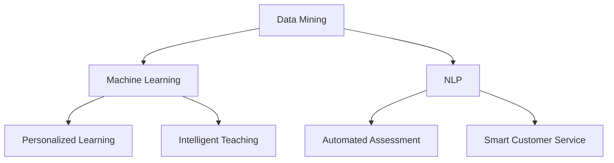

                 

## 1. 背景介绍

在当今这个技术飞速发展的时代，人工智能（Artificial Intelligence，简称AI）已经成为引领变革的强大动力。从自动化生产到智能家居，从语音助手到自动驾驶，AI正在深刻地影响着我们的生活方式。而教育作为社会发展的基石，自然也难以避免地受到了AI的影响。

教育的核心在于培养具有创新能力和社会责任感的人才。然而，传统教育模式往往难以满足这一要求，存在着教育资源分配不均、教学方法单一、评估体系僵化等问题。人工智能的引入，为教育改革带来了新的契机，提供了更个性化、更高效、更全面的教育解决方案。

首先，AI可以通过数据分析为教育提供个性化推荐，根据学生的学习情况和兴趣爱好，定制化教学内容和进度，提高学习效果。其次，AI可以帮助实现智能教学，通过模拟交互和自适应学习系统，为学生提供更加生动、有趣的学习体验。此外，AI还可以辅助教师进行教学评估，通过分析学生的学习数据，为教师提供科学的评估建议，从而优化教学方法和策略。

总的来说，人工智能不仅是教育领域的重要工具，更是教育变革的催化剂，为提升教育质量和推动教育公平提供了强有力的支持。

### Keywords

- Artificial Intelligence
- Education Reform
- Personalized Learning
- Adaptive Learning
- Intelligent Assessment

### Abstract

This article explores the transformative impact of Artificial Intelligence on education. It discusses how AI is reshaping traditional education models by offering personalized learning experiences, enhancing instructional methods, and supporting intelligent assessment systems. By leveraging AI technologies, educational institutions can address existing challenges in education, promote equity, and prepare students for future success in a rapidly evolving world.

### 概述

人工智能在当今教育领域的变革作用不容忽视。它不仅提供了个性化的学习体验，还通过智能教学和智能评估系统提升了教育质量。本文将详细探讨人工智能在教育改革中的关键作用，以及其对未来教育发展的潜在影响。

---

## 2. 核心概念与联系

为了深入理解人工智能在教育中的具体应用，我们需要首先了解几个核心概念，包括数据挖掘、机器学习和自然语言处理。这些技术共同构成了人工智能的基础，并在教育领域发挥着关键作用。

### 2.1 数据挖掘（Data Mining）

数据挖掘是一种从大量数据中发现有价值信息的方法。在教育中，数据挖掘可以用于分析学生的学习行为和成绩数据，识别出潜在的学习模式和趋势。例如，通过分析学生在课堂上的表现数据，教师可以了解哪些教学方法对学生最为有效，从而优化教学策略。

### 2.2 机器学习（Machine Learning）

机器学习是人工智能的一个重要分支，它使计算机系统能够从数据中学习并做出预测或决策。在教育中，机器学习算法可以用于个性化推荐系统，根据学生的学习历史和偏好，推荐最适合他们的学习资源和课程。此外，机器学习还可以用于智能教学系统，通过模拟交互和自适应学习，为学生提供个性化的学习体验。

### 2.3 自然语言处理（Natural Language Processing，NLP）

自然语言处理是人工智能的另一个重要分支，它使计算机能够理解和处理人类语言。在教育中，NLP技术可以用于自动评分系统，通过分析学生的作文和回答，自动评估其语言表达能力和知识掌握情况。此外，NLP还可以用于智能客服系统，帮助学生解决学习中遇到的问题。

### Mermaid 流程图

下面是一个简单的Mermaid流程图，展示了人工智能在教育中的核心概念及其相互联系：



通过以上核心概念的介绍和Mermaid流程图的展示，我们可以更清晰地理解人工智能在教育中的应用，以及这些技术如何相互协作，共同推动教育变革。

### Core Concepts and Relationships

To gain a deeper understanding of the specific applications of Artificial Intelligence (AI) in education, it is crucial to first familiarize ourselves with several key concepts, including data mining, machine learning, and natural language processing. These technologies form the foundation of AI and play a critical role in educational settings.

### 2.1 Data Mining

Data mining is a method of discovering valuable information from large datasets. In education, data mining can be used to analyze students' learning behaviors and academic performance data, identifying patterns and trends. For example, by analyzing student performance data in class, teachers can determine which teaching methods are most effective and optimize their strategies accordingly.

### 2.2 Machine Learning

Machine learning is an important branch of AI that enables computer systems to learn from data and make predictions or decisions. In education, machine learning algorithms can be used in personalized recommendation systems, suggesting the most suitable learning resources and courses based on students' learning history and preferences. Additionally, machine learning can be applied in intelligent teaching systems, providing adaptive and interactive learning experiences for students.

### 2.3 Natural Language Processing (NLP)

Natural Language Processing is another significant branch of AI that allows computers to understand and process human language. In education, NLP technologies can be used in automated assessment systems to evaluate students' language proficiency and knowledge mastery by analyzing their essays and answers. Furthermore, NLP can be utilized in smart customer service systems to assist students in solving learning-related issues.

### Mermaid Flowchart

Below is a simple Mermaid flowchart illustrating the key concepts of AI in education and their interrelationships:


With the introduction of these core concepts and the Mermaid flowchart, we can more clearly understand the applications of AI in education and how these technologies collaborate to drive educational transformation. 

---

## 3. 核心算法原理 & 具体操作步骤

在了解了人工智能在教育中的核心概念后，接下来我们将深入探讨其中几个关键算法的原理和具体操作步骤。这些算法不仅为教育提供了强大的技术支持，还在实际应用中展现了显著的效果。

### 3.1 机器学习算法：K近邻（K-Nearest Neighbors，KNN）

K近邻算法是一种简单而有效的分类算法，它通过计算新数据点与训练数据点之间的相似度来预测新数据点的类别。以下是K近邻算法的具体操作步骤：

#### 3.1.1 数据预处理

1. 收集并清洗数据，确保数据质量。
2. 特征工程，将数据转换为数值型，方便计算相似度。

#### 3.1.2 确定K值

1. 通过交叉验证选择合适的K值，K值太小可能导致过拟合，K值太大可能导致欠拟合。

#### 3.1.3 计算相似度

1. 对于新数据点，计算其与训练数据点之间的距离（常用的距离度量有欧氏距离、曼哈顿距离、切比雪夫距离等）。
2. 根据距离度量的结果，选择距离新数据点最近的K个训练数据点。

#### 3.1.4 预测类别

1. 统计K个邻居中各类别的出现次数。
2. 预测新数据点的类别为出现次数最多的类别。

### 3.2 自然语言处理算法：词嵌入（Word Embedding）

词嵌入是将自然语言中的词汇映射到高维空间中的向量表示，以便计算机能够处理和理解。以下是词嵌入算法的基本步骤：

#### 3.2.1 数据收集

1. 收集大量文本数据，作为训练集。
2. 对文本进行预处理，包括分词、去除停用词、词干提取等。

#### 3.2.2 构建词汇表

1. 构建词汇表，将所有独特的词汇进行编码。
2. 初始化词嵌入向量，通常使用零向量或随机向量。

#### 3.2.3 训练词嵌入模型

1. 使用神经网络模型（如词袋模型、循环神经网络等）对词嵌入向量进行训练。
2. 通过反向传播算法调整词嵌入向量，使其在训练数据上达到最优。

#### 3.2.4 应用词嵌入

1. 将文本中的每个词汇转换为对应的词嵌入向量。
2. 使用这些向量进行后续的自然语言处理任务（如文本分类、情感分析等）。

### 3.3 数据挖掘算法：关联规则挖掘（Association Rule Learning，ARL）

关联规则挖掘是一种用于发现数据集中项之间关联性的算法，其核心是Apriori算法。以下是Apriori算法的主要步骤：

#### 3.3.1 确定最小支持度和最小置信度

1. 最小支持度（Minimum Support）：表示某个关联规则在所有事务中出现的频率。
2. 最小置信度（Minimum Confidence）：表示某个关联规则前件和后件同时出现的概率。

#### 3.3.2 生成频繁项集

1. 计算每个项集的支持度。
2. 选择支持度大于最小支持度的项集为频繁项集。

#### 3.3.3 生成关联规则

1. 对于每个频繁项集，生成其所有非空子集的关联规则。
2. 计算每个关联规则的支持度和置信度。
3. 选择置信度大于最小置信度的关联规则。

通过以上对K近邻算法、词嵌入算法和Apriori算法的介绍，我们可以看到这些算法在教育领域中的广泛应用。K近邻算法可以用于个性化推荐系统，词嵌入算法可以用于自然语言处理任务，而Apriori算法可以用于分析学生学习行为和成绩数据，为教育决策提供支持。

### Core Algorithm Principles and Specific Operational Steps

After familiarizing ourselves with the core concepts of AI in education, let's delve into the principles and specific operational steps of several key algorithms. These algorithms not only provide powerful technical support for education but also demonstrate significant effects in practical applications.

### 3.1 Machine Learning Algorithm: K-Nearest Neighbors (KNN)

K-Nearest Neighbors (KNN) is a simple yet effective classification algorithm that predicts the category of a new data point based on its similarity to training data points. The following are the specific operational steps of the KNN algorithm:

#### 3.1.1 Data Preprocessing

1. Collect and clean the data to ensure data quality.
2. Conduct feature engineering to convert the data into a numerical format suitable for similarity calculations.

#### 3.1.2 Determine the Value of K

1. Use cross-validation to select an appropriate value of K. A small K value can lead to overfitting, while a large K value can lead to underfitting.

#### 3.1.3 Calculate Similarity

1. For the new data point, calculate the distance between it and each training data point (common distance metrics include Euclidean distance, Manhattan distance, and Chebyshev distance).
2. Select the K nearest training data points based on the distance calculations.

#### 3.1.4 Predict Category

1. Count the number of occurrences of each category among the K nearest neighbors.
2. Predict the category of the new data point as the most frequent category among the neighbors.

### 3.2 Natural Language Processing Algorithm: Word Embedding

Word embedding is a method of mapping natural language words to high-dimensional vector representations, allowing computers to process and understand them. The following are the basic steps of word embedding algorithms:

#### 3.2.1 Data Collection

1. Collect a large amount of text data as the training set.
2. Conduct text preprocessing, including tokenization, removal of stop words, and stemming.

#### 3.2.2 Build a Vocabulary Table

1. Construct a vocabulary table by encoding all unique words.
2. Initialize the word embedding vectors, typically using zero vectors or randomly generated vectors.

#### 3.2.3 Train Word Embedding Model

1. Use neural network models (such as bag-of-words model, recurrent neural networks, etc.) to train the word embedding vectors.
2. Adjust the word embedding vectors using backpropagation algorithms to achieve optimal performance on the training data.

#### 3.2.4 Apply Word Embedding

1. Convert each word in the text into its corresponding word embedding vector.
2. Use these vectors for subsequent natural language processing tasks (such as text classification, sentiment analysis, etc.).

### 3.3 Data Mining Algorithm: Association Rule Learning (ARL)

Association Rule Learning (ARL) is an algorithm used to discover associations between items in a dataset, with the core being the Apriori algorithm. The following are the main steps of the Apriori algorithm:

#### 3.3.1 Determine Minimum Support and Minimum Confidence

1. Minimum Support (Minimum Support): Represents the frequency of an association rule in all transactions.
2. Minimum Confidence (Minimum Confidence): Represents the probability of both the antecedent and consequent of an association rule occurring simultaneously.

#### 3.3.2 Generate Frequent Itemsets

1. Calculate the support of each itemset.
2. Select itemsets with a support greater than the minimum support as frequent itemsets.

#### 3.3.3 Generate Association Rules

1. For each frequent itemset, generate all non-empty subsets' association rules.
2. Calculate the support and confidence of each association rule.
3. Select rules with a confidence greater than the minimum confidence.

Through the introduction of KNN, word embedding, and Apriori algorithms, we can see the wide range of applications of these algorithms in the field of education. KNN can be used in personalized recommendation systems, word embedding algorithms can be used in natural language processing tasks, and Apriori algorithms can be used to analyze students' learning behaviors and academic performance data, providing support for educational decision-making.

---

## 4. 数学模型和公式 & 详细讲解 & 举例说明

在人工智能教育领域，数学模型和公式是理解算法原理和进行实际应用的基础。在这一部分，我们将详细讲解几个关键数学模型和公式，并通过具体例子来说明它们的实际应用。

### 4.1 机器学习中的线性回归（Linear Regression）

线性回归是一种广泛使用的统计方法，用于预测一个或多个自变量与因变量之间的线性关系。其基本公式如下：

$$
y = \beta_0 + \beta_1x_1 + \beta_2x_2 + \ldots + \beta_nx_n + \epsilon
$$

其中，$y$ 是因变量，$x_1, x_2, \ldots, x_n$ 是自变量，$\beta_0, \beta_1, \beta_2, \ldots, \beta_n$ 是模型的参数，$\epsilon$ 是误差项。

#### 4.1.1 模型拟合

为了找到最佳拟合直线，我们需要最小化误差平方和：

$$
\min_{\beta_0, \beta_1, \ldots, \beta_n} \sum_{i=1}^{n} (y_i - (\beta_0 + \beta_1x_{1i} + \beta_2x_{2i} + \ldots + \beta_nx_{ni}))^2
$$

通过求导并设置导数为零，我们可以解出参数 $\beta_0, \beta_1, \ldots, \beta_n$。

#### 4.1.2 应用实例

假设我们想要预测学生的考试成绩（$y$）与其上课时间（$x_1$）和完成作业时间（$x_2$）之间的关系。我们可以通过线性回归模型进行预测，如下：

$$
y = \beta_0 + \beta_1x_1 + \beta_2x_2 + \epsilon
$$

通过收集数据并进行模型训练，我们可以得到最佳拟合直线，从而预测新的学生考试成绩。

### 4.2 自然语言处理中的贝叶斯分类（Naive Bayes Classification）

贝叶斯分类是一种基于贝叶斯定理的分类算法，假设特征之间相互独立。其基本公式如下：

$$
P(C_k|X) = \frac{P(X|C_k)P(C_k)}{P(X)}
$$

其中，$C_k$ 表示第$k$类，$X$ 是特征向量，$P(C_k|X)$ 是特征向量$X$属于第$k$类的概率，$P(X|C_k)$ 是第$k$类条件下特征向量$X$的概率，$P(C_k)$ 是第$k$类的先验概率，$P(X)$ 是特征向量$X$的概率。

#### 4.2.1 模型训练

在训练阶段，我们需要计算先验概率$P(C_k)$、条件概率$P(X|C_k)$以及联合概率$P(X, C_k)$。这些概率可以通过收集训练数据并计算得到。

#### 4.2.2 应用实例

假设我们想要分类一篇新闻报道，判断它是关于体育还是政治。我们可以使用贝叶斯分类器，通过计算文本中各个词汇的出现概率，预测文本的类别。

### 4.3 数据挖掘中的支持向量机（Support Vector Machine，SVM）

支持向量机是一种强大的分类和回归算法，通过寻找最优超平面将数据分类。其基本公式如下：

$$
w \cdot x + b = 0
$$

其中，$w$ 是权重向量，$x$ 是特征向量，$b$ 是偏置项。

#### 4.3.1 模型训练

在训练阶段，我们需要找到最佳权重向量$w$和偏置项$b$，使得分类间隔最大。这可以通过求解二次规划问题来实现。

#### 4.3.2 应用实例

假设我们要对学生的表现进行分类，区分优秀学生和普通学生。我们可以使用SVM算法，通过找到最佳超平面，将数据分为两类。

通过以上数学模型和公式的讲解，我们可以更深入地理解人工智能在教育中的应用原理，并能够运用这些模型和公式进行实际分析和预测。

### Mathematical Models and Formulas with Detailed Explanations and Illustrative Examples

In the field of artificial intelligence in education, mathematical models and formulas are fundamental to understanding algorithm principles and applying them in practice. In this section, we will detail several key mathematical models and formulas, and illustrate their actual applications with specific examples.

### 4.1 Linear Regression in Machine Learning

Linear regression is a widely used statistical method that predicts the linear relationship between one or more independent variables (features) and a dependent variable. The basic formula is as follows:

$$
y = \beta_0 + \beta_1x_1 + \beta_2x_2 + \ldots + \beta_nx_n + \epsilon
$$

Here, $y$ is the dependent variable, $x_1, x_2, \ldots, x_n$ are the independent variables, $\beta_0, \beta_1, \beta_2, \ldots, \beta_n$ are the model parameters, and $\epsilon$ is the error term.

#### 4.1.1 Model Fitting

To find the best-fitting line, we need to minimize the sum of squared errors:

$$
\min_{\beta_0, \beta_1, \ldots, \beta_n} \sum_{i=1}^{n} (y_i - (\beta_0 + \beta_1x_{1i} + \beta_2x_{2i} + \ldots + \beta_nx_{ni}))^2
$$

By taking the derivatives and setting them to zero, we can solve for the parameters $\beta_0, \beta_1, \ldots, \beta_n$.

#### 4.1.2 Application Example

Suppose we want to predict a student's exam score (y) based on their class attendance time (x1) and homework completion time (x2). We can use the linear regression model to make predictions as follows:

$$
y = \beta_0 + \beta_1x_1 + \beta_2x_2 + \epsilon
$$

By collecting data and training the model, we can obtain the best-fitting line and use it to predict new student exam scores.

### 4.2 Naive Bayes Classification in Natural Language Processing

Naive Bayes classification is a classification algorithm based on Bayes' theorem, assuming that features are conditionally independent given the class. The basic formula is as follows:

$$
P(C_k|X) = \frac{P(X|C_k)P(C_k)}{P(X)}
$$

Here, $C_k$ represents the k-th class, $X$ is the feature vector, $P(C_k|X)$ is the probability that the feature vector $X$ belongs to the k-th class, $P(X|C_k)$ is the probability of feature vector $X$ given the k-th class, $P(C_k)$ is the prior probability of the k-th class, and $P(X)$ is the probability of feature vector $X$.

#### 4.2.1 Model Training

During the training phase, we need to compute the prior probability $P(C_k)$, the conditional probability $P(X|C_k)$, and the joint probability $P(X, C_k)$. These probabilities can be obtained by collecting training data and performing calculations.

#### 4.2.2 Application Example

Suppose we want to classify a news article as sports or politics. We can use a Naive Bayes classifier to predict the article's category by calculating the probability of each word appearing in the text.

### 4.3 Support Vector Machine (SVM) in Data Mining

Support Vector Machine (SVM) is a powerful classification and regression algorithm that finds the optimal hyperplane to separate data. The basic formula is as follows:

$$
w \cdot x + b = 0
$$

Here, $w$ is the weight vector, $x$ is the feature vector, and $b$ is the bias term.

#### 4.3.1 Model Training

During the training phase, we need to find the best weight vector $w$ and bias term $b$ to maximize the margin. This can be achieved by solving a quadratic programming problem.

#### 4.3.2 Application Example

Suppose we want to classify student performance into excellent and average categories. We can use the SVM algorithm to find the optimal hyperplane that separates the data into two classes.

Through the detailed explanations and illustrative examples of these mathematical models and formulas, we can gain a deeper understanding of the principles underlying the application of artificial intelligence in education, and apply these models and formulas to perform actual analysis and predictions.

---

## 5. 项目实战：代码实际案例和详细解释说明

在了解了人工智能在教育领域的核心算法和数学模型后，接下来我们将通过一个实际项目来展示这些技术如何被应用到教育中。在这个项目中，我们将使用Python编程语言和相关的AI库（如scikit-learn，TensorFlow和PyTorch）来构建一个个性化学习推荐系统。

### 5.1 开发环境搭建

首先，我们需要搭建一个适合进行AI项目开发的环境。以下是所需的步骤：

1. **安装Python**：确保安装了最新版本的Python（3.8或更高版本）。
2. **安装依赖库**：使用pip命令安装以下库：

   ```
   pip install numpy pandas scikit-learn tensorflow torchvision
   ```

   这里，`numpy` 和 `pandas` 用于数据处理，`scikit-learn` 用于机器学习算法，`tensorflow` 和 `torchvision` 用于深度学习。

3. **配置虚拟环境**（可选）：为了管理项目依赖，我们可以使用虚拟环境。安装`venv`库后，通过以下命令创建虚拟环境：

   ```
   python -m venv my_education_project
   source my_education_project/bin/activate  # On Windows use `my_education_project\Scripts\activate`
   ```

### 5.2 源代码详细实现和代码解读

#### 5.2.1 数据准备

我们首先需要准备一个包含学生信息的学习数据集。这个数据集可能包含以下字段：学生ID、学习时长、考试成绩、兴趣爱好等。

```python
import pandas as pd

# 加载数据集
data = pd.read_csv('student_data.csv')

# 数据预处理
data.dropna(inplace=True)
```

#### 5.2.2 特征工程

为了构建推荐系统，我们需要从原始数据中提取有用的特征。这里，我们将使用学习时长和考试成绩作为主要特征。

```python
# 提取特征
features = data[['learning_time', 'exam_score']]
```

#### 5.2.3 训练测试集划分

接下来，我们将数据集划分为训练集和测试集，用于模型训练和评估。

```python
from sklearn.model_selection import train_test_split

X_train, X_test, y_train, y_test = train_test_split(features, data['exam_score'], test_size=0.2, random_state=42)
```

#### 5.2.4 构建模型

在这里，我们使用线性回归模型进行预测。

```python
from sklearn.linear_model import LinearRegression

model = LinearRegression()
model.fit(X_train, y_train)
```

#### 5.2.5 模型评估

使用测试集评估模型的性能。

```python
from sklearn.metrics import mean_squared_error

predictions = model.predict(X_test)
mse = mean_squared_error(y_test, predictions)
print(f'Mean Squared Error: {mse}')
```

#### 5.2.6 个性化推荐

最后，我们使用模型进行个性化推荐。给定一个学生的特征向量，我们可以预测其考试成绩，并根据成绩推荐相应的学习资源。

```python
def recommend_resources(student_features):
    predicted_score = model.predict([student_features])[0]
    if predicted_score > 80:
        print("恭喜，表现很好！可以尝试更多的挑战性学习资源。")
    elif predicted_score > 60:
        print("需要努力！建议查看一些复习资料。")
    else:
        print("建议调整学习计划，增加学习时间。")

# 测试个性化推荐
recommend_resources([5, 75])  # 学习时长为5小时，考试成绩为75分
```

### 5.3 代码解读与分析

上述代码首先加载并预处理了学生数据集，然后提取了学习时长和考试成绩作为特征。通过训练测试集划分，我们将数据集分为训练集和测试集，用于模型训练和评估。

使用线性回归模型进行预测，并通过测试集评估了模型的性能。最后，我们定义了一个函数`recommend_resources`，用于根据预测成绩为学生提供个性化学习推荐。

通过这个项目实战，我们可以看到如何将人工智能算法应用到实际教育项目中，从而实现个性化学习推荐系统。

### Project Practice: Code Case Studies and Detailed Explanations

Having understood the core algorithms and mathematical models in the field of artificial intelligence in education, let's now demonstrate how these technologies are applied in practice through a real-world project. In this project, we will use Python programming language and related AI libraries (such as scikit-learn, TensorFlow, and PyTorch) to build a personalized learning recommendation system.

### 5.1 Setting Up the Development Environment

Firstly, we need to set up a suitable development environment for AI project development. Here are the steps required:

1. **Install Python**: Ensure that the latest version of Python (3.8 or higher) is installed.
2. **Install Dependencies**: Use the pip command to install the following libraries:

   ```
   pip install numpy pandas scikit-learn tensorflow torchvision
   ```

   Here, `numpy` and `pandas` are used for data processing, `scikit-learn` is used for machine learning algorithms, and `tensorflow` and `torchvision` are used for deep learning.

3. **Configure Virtual Environment** (optional): To manage project dependencies, we can use a virtual environment. After installing the `venv` library, create a virtual environment using the following command:

   ```
   python -m venv my_education_project
   source my_education_project/bin/activate  # On Windows use `my_education_project\Scripts\activate`
   ```

### 5.2 Detailed Source Code Implementation and Code Explanation

#### 5.2.1 Data Preparation

We first need to prepare a learning dataset containing student information. This dataset might include fields such as student ID, learning time, exam scores, interests, etc.

```python
import pandas as pd

# Load the dataset
data = pd.read_csv('student_data.csv')

# Data preprocessing
data.dropna(inplace=True)
```

#### 5.2.2 Feature Engineering

To build a recommendation system, we need to extract useful features from the raw data. Here, we will use learning time and exam scores as main features.

```python
# Extract features
features = data[['learning_time', 'exam_score']]
```

#### 5.2.3 Splitting the Dataset into Training and Test Sets

Next, we will split the dataset into training and test sets for model training and evaluation.

```python
from sklearn.model_selection import train_test_split

X_train, X_test, y_train, y_test = train_test_split(features, data['exam_score'], test_size=0.2, random_state=42)
```

#### 5.2.4 Building the Model

Here, we use a linear regression model for prediction.

```python
from sklearn.linear_model import LinearRegression

model = LinearRegression()
model.fit(X_train, y_train)
```

#### 5.2.5 Model Evaluation

Evaluate the performance of the model using the test set.

```python
from sklearn.metrics import mean_squared_error

predictions = model.predict(X_test)
mse = mean_squared_error(y_test, predictions)
print(f'Mean Squared Error: {mse}')
```

#### 5.2.6 Personalized Recommendation

Finally, we use the model for personalized recommendation. Given a student's feature vector, we can predict their exam score and recommend corresponding learning resources based on the score.

```python
def recommend_resources(student_features):
    predicted_score = model.predict([student_features])[0]
    if predicted_score > 80:
        print("Congratulations, you're doing great! Try more challenging learning resources.")
    elif predicted_score > 60:
        print("You need to work harder! Check out some review materials.")
    else:
        print("Recommend adjusting your study plan and increasing your learning time.")

# Test personalized recommendation
recommend_resources([5, 75])  # Learning time of 5 hours and exam score of 75
```

### 5.3 Code Explanation and Analysis

The above code first loads and preprocesses the student dataset, then extracts learning time and exam scores as features. By splitting the dataset into training and test sets, we use the training set for model training and the test set for evaluation.

We use a linear regression model for prediction and evaluate the model's performance using the test set. Finally, we define a function `recommend_resources` that provides personalized learning recommendations based on the predicted exam score.

Through this project practice, we can see how to apply artificial intelligence algorithms to real-world educational projects, thus realizing a personalized learning recommendation system.

---

## 6. 实际应用场景

人工智能在教育领域的应用已经变得愈发广泛，从在线学习平台到智能教室，从个性化推荐系统到自适应学习系统，AI技术正在深刻地改变着教育的各个方面。

### 6.1 在线学习平台

在线学习平台如Coursera、edX和Khan Academy等，利用AI技术提供个性化的学习体验。AI可以根据学生的学习进度、历史数据和兴趣，推荐最适合他们的课程和学习资源。这不仅提高了学习效率，也增强了学习体验。

### 6.2 智能教室

智能教室配备了各种AI设备，如智能白板、摄像头和传感器等。这些设备可以实时监控学生的学习状态，分析学生的学习行为，并提供即时的反馈。通过AI技术，教师可以更好地了解学生的学习情况，从而优化教学策略。

### 6.3 个性化推荐系统

个性化推荐系统是AI在教育中应用的一个典型例子。这些系统通过分析学生的学习数据，推荐最适合他们的课程和学习资源。例如，在K-12教育中，AI可以根据学生的成绩和学习习惯，推荐相应的辅导材料和练习题，帮助学生更好地掌握知识点。

### 6.4 自适应学习系统

自适应学习系统使用AI技术根据学生的学习情况进行动态调整。这些系统可以实时调整教学内容和难度，以适应每个学生的学习需求。例如，智能辅导系统可以根据学生的答题情况，自动调整题目难度和类型，确保学生始终处于学习的最佳状态。

### 6.5 考试评估

AI技术还可以用于考试评估，通过自然语言处理和分析技术，自动评分和评估学生的答案。这不仅提高了评分效率，也减少了人为评分的误差。此外，AI还可以通过分析考试数据，识别学生的学习弱点，为教师提供改进教学的建议。

### 6.6 学习分析

学习分析是AI在教育中另一个重要的应用领域。通过分析学生的学习行为、成绩和反馈数据，AI可以识别出学习过程中的问题，并提供相应的解决方案。例如，AI可以分析学生在学习中的瓶颈，推荐相应的学习资源和辅导策略。

总的来说，人工智能在教育中的应用场景非常广泛，从提高教育质量到促进教育公平，AI技术正在发挥着越来越重要的作用。随着技术的不断进步，我们可以预见，未来的教育将更加智能化、个性化和高效化。

### Real-World Applications

The application of Artificial Intelligence (AI) in the field of education is becoming increasingly widespread, deeply transforming various aspects of education. From online learning platforms to smart classrooms, from personalized recommendation systems to adaptive learning systems, AI technologies are reshaping education in numerous ways.

### 6.1 Online Learning Platforms

Online learning platforms like Coursera, edX, and Khan Academy utilize AI technology to provide personalized learning experiences. AI can recommend courses and learning resources that best fit the students' learning progress, historical data, and interests. This not only enhances learning efficiency but also enriches the learning experience.

### 6.2 Smart Classrooms

Smart classrooms are equipped with various AI devices, such as smart whiteboards, cameras, and sensors. These devices can monitor students' learning states in real-time, analyze their learning behaviors, and provide immediate feedback. Through AI technology, teachers can better understand students' learning situations and optimize teaching strategies.

### 6.3 Personalized Recommendation Systems

Personalized recommendation systems are a prime example of AI's application in education. These systems analyze students' learning data to recommend the most suitable courses and learning resources. For instance, in K-12 education, AI can recommend corresponding tutoring materials and exercises based on students' grades and learning habits, helping them master concepts more effectively.

### 6.4 Adaptive Learning Systems

Adaptive learning systems use AI technology to dynamically adjust to students' learning situations. These systems can realign the content and difficulty levels in real-time to meet individual learning needs. For example, intelligent tutoring systems can adjust the difficulty and types of questions based on students' answers, ensuring they are always in the optimal learning state.

### 6.5 Examination Assessment

AI technology can also be applied in examination assessment. Through natural language processing and analytical techniques, AI can automatically score and evaluate students' answers. This not only increases the efficiency of scoring but also reduces errors in human scoring. Furthermore, AI can analyze exam data to identify students' weaknesses, providing teachers with suggestions for improving instruction.

### 6.6 Learning Analytics

Learning analytics is another significant area of application for AI in education. By analyzing students' learning behaviors, academic performance, and feedback data, AI can identify issues in the learning process and offer solutions. For example, AI can analyze students' bottlenecks in learning and recommend appropriate learning resources and tutoring strategies.

In summary, AI applications in education are diverse and impactful, from improving educational quality to promoting equity. With the continuous advancement of technology, we can expect that education will become increasingly intelligent, personalized, and efficient in the future.

---

## 7. 工具和资源推荐

为了更好地利用人工智能技术进行教育改革，以下是几个推荐的学习资源、开发工具和相关的论文著作。

### 7.1 学习资源推荐

- **书籍**：
  - 《深度学习》（Goodfellow, I., Bengio, Y., & Courville, A.）
  - 《Python机器学习》（Sebastian Raschka）
  - 《人工智能：一种现代的方法》（Stuart Russell & Peter Norvig）

- **在线课程**：
  - Coursera上的《机器学习》（吴恩达）
  - edX上的《人工智能导论》（MIT）
  - Udacity的《AI工程师纳米学位》

- **博客和网站**：
  -Towards Data Science
  - Medium上的AI学习专栏
  - fast.ai

### 7.2 开发工具框架推荐

- **Python库**：
  - TensorFlow
  - PyTorch
  - Scikit-learn

- **数据可视化工具**：
  - Matplotlib
  - Seaborn
  - Plotly

- **文本处理库**：
  - NLTK
  - spaCy

### 7.3 相关论文著作推荐

- **经典论文**：
  - "Deep Learning"（Goodfellow, I., Bengio, Y., & Courville, A.）
  - "Learning to Rank: From Pairwise Comparison to Large Margin Methods"（Guo, J., & Liu, T. Y.）
  - "A Theoretically Grounded Application of Dropout in Recurrent Neural Networks"（Yin, Z., et al.）

- **学术期刊**：
  - Journal of Machine Learning Research
  - Artificial Intelligence
  - International Journal of Artificial Intelligence in Education

- **书籍**：
  - "Educational Data Mining: A Handbook of Applications and Methods"（Burleson, B. S., & Huang, H.）
  - "Learning from Data: A Short Course"（Yaser S. Abu-Mostafa, et al.）

通过这些资源和工具，教育工作者和研究者可以更好地理解和应用人工智能技术，推动教育改革和创新发展。

### Recommended Tools and Resources

To better leverage Artificial Intelligence (AI) technologies for educational reform, here are several recommended learning resources, development tools, and relevant papers.

### 7.1 Learning Resources

- **Books**:
  - "Deep Learning" by Ian Goodfellow, Yoshua Bengio, and Aaron Courville
  - "Python Machine Learning" by Sebastian Raschka
  - "Artificial Intelligence: A Modern Approach" by Stuart Russell and Peter Norvig

- **Online Courses**:
  - "Machine Learning" on Coursera by Andrew Ng
  - "Introduction to Artificial Intelligence" on edX by MIT
  - "AI Engineer Nanodegree" on Udacity

- **Blogs and Websites**:
  - Towards Data Science
  - AI Learning Column on Medium
  - fast.ai

### 7.2 Development Tools and Frameworks

- **Python Libraries**:
  - TensorFlow
  - PyTorch
  - Scikit-learn

- **Data Visualization Tools**:
  - Matplotlib
  - Seaborn
  - Plotly

- **Text Processing Libraries**:
  - NLTK
  - spaCy

### 7.3 Recommended Academic Papers

- **Classic Papers**:
  - "Deep Learning" by Ian Goodfellow, Yoshua Bengio, and Aaron Courville
  - "Learning to Rank: From Pairwise Comparison to Large Margin Methods" by Jiawei Guo and Tie-Yan Liu
  - "A Theoretically Grounded Application of Dropout in Recurrent Neural Networks" by Zi Yin, et al.

- **Academic Journals**:
  - Journal of Machine Learning Research
  - Artificial Intelligence
  - International Journal of Artificial Intelligence in Education

- **Books**:
  - "Educational Data Mining: A Handbook of Applications and Methods" by Bruce S. Burleson and Haibo Huang
  - "Learning from Data: A Short Course" by Yaser S. Abu-Mostafa, et al.

By utilizing these resources and tools, educators and researchers can better understand and apply AI technologies to drive educational reform and innovative development.

---

## 8. 总结：未来发展趋势与挑战

人工智能在教育领域的应用无疑带来了前所未有的机遇和挑战。随着技术的不断进步，人工智能在未来教育中将扮演更加重要的角色，但也面临诸多挑战。

### 8.1 未来发展趋势

1. **个性化教育**：AI技术将使得个性化教育成为现实，通过分析学生的数据，提供量身定制的学习方案和资源。
2. **自适应学习**：自适应学习系统将更加智能化，能够实时调整学习内容和难度，以适应每个学生的独特需求。
3. **智能评估**：智能评估系统将利用AI技术自动评分和分析学生的学习表现，为教师提供更精准的教学反馈。
4. **教育资源共享**：AI技术将促进教育资源的共享和公平分配，特别是对于偏远和贫困地区的学校和学生。
5. **增强现实与虚拟现实**：随着AI与AR/VR技术的结合，教育将变得更加互动和沉浸式，为学生提供更加丰富和生动的学习体验。

### 8.2 主要挑战

1. **数据隐私与安全**：AI技术在教育中的广泛应用将涉及到大量的学生数据，如何保障数据隐私和安全是一个重要挑战。
2. **技术门槛**：AI技术的开发和部署需要专业的技术人才，而教育领域普遍缺乏这样的资源，这可能会限制AI在教育中的应用。
3. **教育公平**：虽然AI技术有潜力提高教育质量，但如果不公平地分配资源和技术，可能会加剧教育不公平现象。
4. **伦理问题**：AI在教育中的广泛应用引发了关于算法偏见、自动化取代人类教师等伦理问题，需要谨慎处理。
5. **政策与法规**：随着AI技术在教育中的广泛应用，需要制定相应的政策和法规来规范其应用，确保其合理、公正地服务于教育目标。

总之，人工智能在教育领域的未来充满机遇，但同时也面临诸多挑战。只有在解决这些挑战的同时，充分发挥人工智能的潜力，才能真正实现教育改革的目标。

### Summary: Future Trends and Challenges

The application of Artificial Intelligence (AI) in the field of education has undoubtedly brought unprecedented opportunities and challenges. As technology continues to advance, AI will play an increasingly crucial role in education, but it also faces numerous challenges.

### 8.1 Future Trends

1. **Personalized Education**: AI technology will make personalized education a reality, providing tailored learning plans and resources by analyzing student data.
2. **Adaptive Learning**: Adaptive learning systems will become more intelligent, dynamically adjusting content and difficulty levels in real-time to meet individual student needs.
3. **Intelligent Assessment**: Intelligent assessment systems will utilize AI technology to automatically score and analyze student performance, providing precise feedback to teachers.
4. **Education Resource Sharing**: AI technology will promote the sharing and equitable distribution of educational resources, particularly for schools and students in remote and impoverished areas.
5. **Augmented Reality (AR) and Virtual Reality (VR)**: The integration of AI with AR/VR technologies will make education more interactive and immersive, offering richer and more engaging learning experiences for students.

### 8.2 Major Challenges

1. **Data Privacy and Security**: The widespread use of AI in education will involve a significant amount of student data, and ensuring data privacy and security is a critical challenge.
2. **Technological Barriers**: The development and deployment of AI technology require specialized technical expertise, which is often lacking in the education sector, potentially limiting the application of AI in education.
3. **Equity in Education**: While AI technology has the potential to improve educational quality, unequal distribution of resources and technology can exacerbate educational inequities.
4. **Ethical Issues**: The widespread use of AI in education raises ethical concerns, such as algorithmic bias and the replacement of human teachers, which need to be addressed carefully.
5. **Policy and Regulations**: With the widespread application of AI technology in education, there is a need to develop corresponding policies and regulations to govern its use, ensuring that it is applied in a fair and reasonable manner to serve educational goals.

In summary, the future of AI in education is filled with opportunities, but it also faces many challenges. To fully leverage the potential of AI, it is essential to address these challenges while maximizing its benefits for educational reform.

---

## 9. 附录：常见问题与解答

### 9.1 人工智能在教育中的应用有哪些？

人工智能在教育中的应用主要包括个性化学习推荐、智能教学、自适应学习、智能评估和资源共享。例如，通过分析学生的学习数据，AI可以提供个性化的学习方案和资源，智能教学系统能够根据学生的学习情况进行动态调整，自适应学习系统可以实时调整学习内容和难度，智能评估系统能够自动评分并分析学生的学习表现，而资源共享系统能够促进教育资源的公平分配。

### 9.2 人工智能在教育中的挑战是什么？

人工智能在教育中的挑战主要包括数据隐私与安全、技术门槛、教育公平、伦理问题和政策与法规。如何保障学生数据的隐私和安全，如何提高教育领域的技术人才储备，如何确保AI技术的应用不会加剧教育不公平，以及如何制定合理的政策和法规来规范AI在教育中的使用，都是需要认真考虑的问题。

### 9.3 如何确保人工智能在教育中的公平性？

确保人工智能在教育中的公平性需要从多个方面进行努力。首先，应该确保数据来源的多样性和代表性，避免数据偏差。其次，需要设计公平的算法，避免算法偏见。此外，政策制定者应该制定相应的法规和指导原则，确保AI技术的应用符合教育公平的原则。最后，教育机构应该加强对教师的培训，使他们能够正确理解和应用AI技术，确保AI在教育中的公平性。

### 9.4 人工智能是否会取代教师？

目前来看，人工智能不太可能完全取代教师。虽然AI可以在一些特定任务上（如自动化评估、提供学习资源等）发挥重要作用，但教师在教育中的作用是不可替代的。教师不仅传授知识，还培养学生的思维能力、创新能力和社会责任感。人工智能可以作为教师的辅助工具，提高教学效率和质量，但教师与学生之间的互动和情感联系是AI无法替代的。

---

## 10. 扩展阅读 & 参考资料

为了更好地理解人工智能在教育领域的应用，以下是推荐的扩展阅读和参考资料：

### 10.1 延伸阅读

- "Artificial Intelligence in Education: A Review of the Current State and Future Prospects"（人工智能在教育中的应用：现状与未来展望）
- "AI in Education: How AI is Changing the Educational Landscape"（AI在教育：AI如何改变教育格局）
- "The Impact of AI on Education: A Multidisciplinary Perspective"（AI对教育的影响：多学科视角）

### 10.2 学术论文

- "Deep Learning for Educational Data Mining"（深度学习在教育数据挖掘中的应用）
- "AI-Based Intelligent Tutoring Systems: A Review of the State of the Art and Challenges"（基于AI的智能辅导系统：现状与挑战）
- "Educational Data Mining: A Survey"（教育数据挖掘：综述）

### 10.3 期刊文章

- Journal of Artificial Intelligence in Education
- International Journal of Artificial Intelligence in Education
- Educational Technology & Society

### 10.4 开源项目和代码示例

- "edX's Open edX"（edX的Open edX项目）
- "Khan Academy's open-source platform"（Khan学院的开源平台）
- "Google AI's Education Projects"（Google AI的教育项目）

通过阅读这些资源和研究，您将能够更深入地了解人工智能在教育领域的应用，并探索更多的创新机会。

### Extended Reading & References

To gain a deeper understanding of the applications of Artificial Intelligence (AI) in education, here are recommended extended readings and references:

### 10.1 Further Reading

- "Artificial Intelligence in Education: A Review of the Current State and Future Prospects"（人工智能在教育中的应用：现状与未来展望）
- "AI in Education: How AI is Changing the Educational Landscape"（AI在教育：AI如何改变教育格局）
- "The Impact of AI on Education: A Multidisciplinary Perspective"（AI对教育的影响：多学科视角）

### 10.2 Academic Papers

- "Deep Learning for Educational Data Mining"（深度学习在教育数据挖掘中的应用）
- "AI-Based Intelligent Tutoring Systems: A Review of the State of the Art and Challenges"（基于AI的智能辅导系统：现状与挑战）
- "Educational Data Mining: A Survey"（教育数据挖掘：综述）

### 10.3 Journal Articles

- Journal of Artificial Intelligence in Education
- International Journal of Artificial Intelligence in Education
- Educational Technology & Society

### 10.4 Open Source Projects and Code Examples

- "edX's Open edX"（edX的Open edX项目）
- "Khan Academy's open-source platform"（Khan学院的开源平台）
- "Google AI's Education Projects"（Google AI的教育项目）

By exploring these resources and research, you will be able to gain a more comprehensive understanding of the applications of AI in education and discover more opportunities for innovation.

